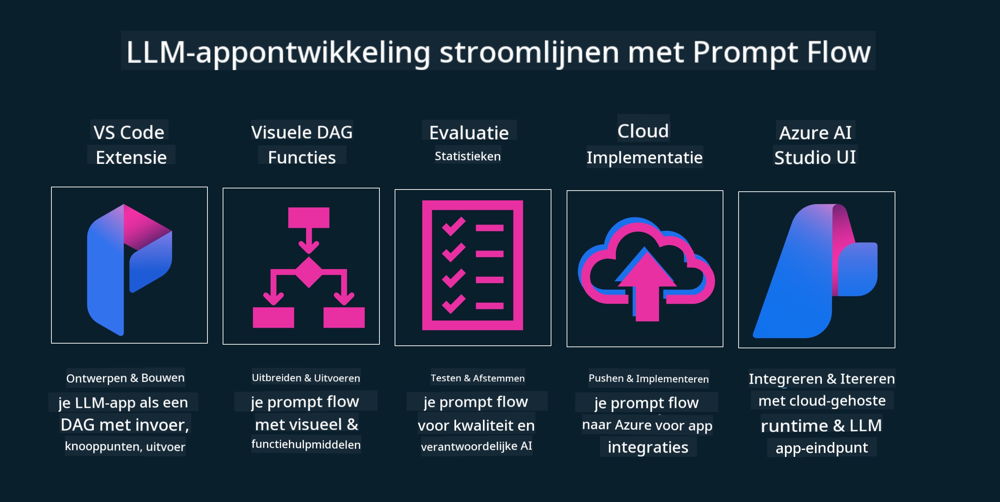

<!--
CO_OP_TRANSLATOR_METADATA:
{
  "original_hash": "27a5347a5022d5ef0a72ab029b03526a",
  "translation_date": "2025-07-09T15:55:38+00:00",
  "source_file": "14-the-generative-ai-application-lifecycle/README.md",
  "language_code": "nl"
}
-->

# De levenscyclus van Generatieve AI-toepassingen

Een belangrijke vraag voor alle AI-toepassingen is de relevantie van AI-functies, aangezien AI een snel evoluerend vakgebied is. Om ervoor te zorgen dat je toepassing relevant, betrouwbaar en robuust blijft, moet je deze continu monitoren, evalueren en verbeteren. Hier komt de levenscyclus van generatieve AI om de hoek kijken.

De levenscyclus van generatieve AI is een raamwerk dat je begeleidt bij de fasen van het ontwikkelen, implementeren en onderhouden van een generatieve AI-toepassing. Het helpt je om je doelen te definiëren, je prestaties te meten, je uitdagingen te identificeren en je oplossingen te implementeren. Daarnaast helpt het je om je toepassing af te stemmen op de ethische en juridische normen van je vakgebied en je belanghebbenden. Door de levenscyclus van generatieve AI te volgen, zorg je ervoor dat je toepassing altijd waarde levert en je gebruikers tevreden stelt.

## Introductie

In dit hoofdstuk leer je:

- Het paradigma verschuiving van MLOps naar LLMOps begrijpen
- De LLM levenscyclus
- Tools voor de levenscyclus
- Metingen en evaluatie van de levenscyclus

## Het paradigma verschuiving van MLOps naar LLMOps begrijpen

LLM’s zijn een nieuw hulpmiddel in het arsenaal van Kunstmatige Intelligentie. Ze zijn ongelooflijk krachtig in analyse- en generatie taken voor toepassingen, maar deze kracht heeft ook gevolgen voor hoe we AI en klassieke machine learning taken stroomlijnen.

Daarom hebben we een nieuw paradigma nodig om dit hulpmiddel dynamisch te kunnen inzetten, met de juiste prikkels. We kunnen oudere AI-apps categoriseren als "ML Apps" en nieuwere AI-apps als "GenAI Apps" of gewoon "AI Apps", wat de gangbare technologie en technieken van dat moment weerspiegelt. Dit verandert onze benadering op meerdere manieren, zie de volgende vergelijking.

Let op dat we bij LLMOps meer gericht zijn op de app-ontwikkelaars, waarbij integraties een sleutelrol spelen, gebruikmakend van "Models-as-a-Service" en denken aan de volgende punten voor metrics.

- Kwaliteit: kwaliteit van de respons
- Schade: Verantwoorde AI
- Eerlijkheid: onderbouwing van de respons (Is het logisch? Is het correct?)
- Kosten: budget van de oplossing
- Latentie: gemiddelde tijd voor tokenrespons

## De LLM levenscyclus

Om de levenscyclus en de aanpassingen te begrijpen, bekijken we eerst de volgende infographic.

Zoals je ziet, verschilt dit van de gebruikelijke levenscycli van MLOps. LLM’s hebben veel nieuwe vereisten, zoals prompting, verschillende technieken om de kwaliteit te verbeteren (fine-tuning, RAG, meta-prompts), andere beoordelingscriteria en verantwoordelijkheden met verantwoorde AI, en tenslotte nieuwe evaluatiemetrics (kwaliteit, schade, eerlijkheid, kosten en latentie).

Neem bijvoorbeeld hoe we ideeën uitwerken. We gebruiken prompt engineering om met verschillende LLM’s te experimenteren en mogelijkheden te verkennen om te testen of onze hypothese klopt.

Let op dat dit geen lineair proces is, maar geïntegreerde, iteratieve loops binnen een overkoepelende cyclus.

Hoe kunnen we deze stappen verkennen? Laten we in detail bekijken hoe we een levenscyclus kunnen opbouwen.

Dit kan wat ingewikkeld lijken, laten we ons eerst richten op de drie grote stappen.

1. Ideevorming/Verkenning: Hier verkennen we op basis van onze zakelijke behoeften. Prototyping, het maken van een [PromptFlow](https://microsoft.github.io/promptflow/index.html?WT.mc_id=academic-105485-koreyst) en testen of het efficiënt genoeg is voor onze hypothese.
1. Bouwen/Aanvullen: Implementatie, nu beginnen we met evalueren voor grotere datasets en passen we technieken toe zoals fine-tuning en RAG om de robuustheid van onze oplossing te controleren. Als het niet werkt, kan herimplementatie, het toevoegen van nieuwe stappen in onze flow of het herstructureren van data helpen. Na het testen van onze flow en schaal, en als het werkt en onze metrics goed zijn, is het klaar voor de volgende stap.
1. Operationeel maken: Integratie, nu voegen we monitoring- en waarschuwingssystemen toe aan ons systeem, implementeren we en integreren we de toepassing in onze app.

Daarna is er de overkoepelende managementcyclus, gericht op beveiliging, compliance en governance.

Gefeliciteerd, je AI-app is nu klaar voor gebruik en operationeel. Voor een praktische ervaring, bekijk de [Contoso Chat Demo.](https://nitya.github.io/contoso-chat/?WT.mc_id=academic-105485-koreys)

Welke tools kunnen we nu gebruiken?

## Tools voor de levenscyclus

Voor tooling biedt Microsoft het [Azure AI Platform](https://azure.microsoft.com/solutions/ai/?WT.mc_id=academic-105485-koreys) en [PromptFlow](https://microsoft.github.io/promptflow/index.html?WT.mc_id=academic-105485-koreyst) die je cyclus eenvoudig maken om te implementeren en direct te gebruiken.

Het [Azure AI Platform](https://azure.microsoft.com/solutions/ai/?WT.mc_id=academic-105485-koreys) stelt je in staat om [AI Studio](https://ai.azure.com/?WT.mc_id=academic-105485-koreys) te gebruiken. AI Studio is een webportaal waarmee je modellen, voorbeelden en tools kunt verkennen. Je beheert je resources, ontwikkelt UI-flows en hebt SDK/CLI-opties voor code-first ontwikkeling.

Azure AI stelt je in staat om meerdere resources te gebruiken om je operaties, services, projecten, vectorzoekopdrachten en databasebehoeften te beheren.

Bouw van Proof-of-Concept (POC) tot grootschalige toepassingen met PromptFlow:

- Ontwerp en bouw apps vanuit VS Code, met visuele en functionele tools
- Test en verfijn je apps voor kwalitatieve AI, eenvoudig en snel
- Gebruik Azure AI Studio om te integreren en itereren met de cloud, push en deploy voor snelle integratie

## Geweldig! Ga door met leren!

Fantastisch, leer nu meer over hoe we een applicatie structureren om de concepten toe te passen met de [Contoso Chat App](https://nitya.github.io/contoso-chat/?WT.mc_id=academic-105485-koreyst), om te zien hoe Cloud Advocacy deze concepten in demonstraties verwerkt. Voor meer content, bekijk onze [Ignite breakout sessie!](https://www.youtube.com/watch?v=DdOylyrTOWg)

Bekijk nu les 15 om te begrijpen hoe [Retrieval Augmented Generation en Vector Databases](../15-rag-and-vector-databases/README.md?WT.mc_id=academic-105485-koreyst) impact hebben op Generatieve AI en om meer boeiende toepassingen te maken!

**Disclaimer**:  
Dit document is vertaald met behulp van de AI-vertalingsdienst [Co-op Translator](https://github.com/Azure/co-op-translator). Hoewel we streven naar nauwkeurigheid, dient u er rekening mee te houden dat geautomatiseerde vertalingen fouten of onnauwkeurigheden kunnen bevatten. Het originele document in de oorspronkelijke taal moet als de gezaghebbende bron worden beschouwd. Voor cruciale informatie wordt professionele menselijke vertaling aanbevolen. Wij zijn niet aansprakelijk voor eventuele misverstanden of verkeerde interpretaties die voortvloeien uit het gebruik van deze vertaling.