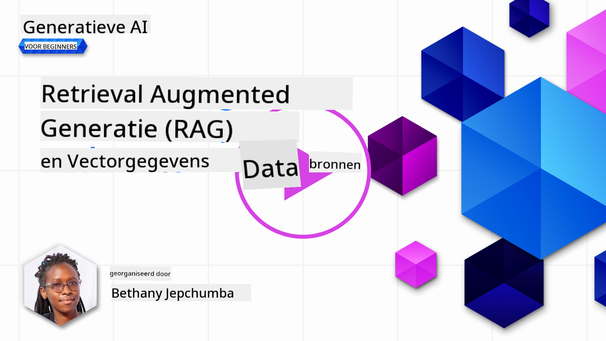
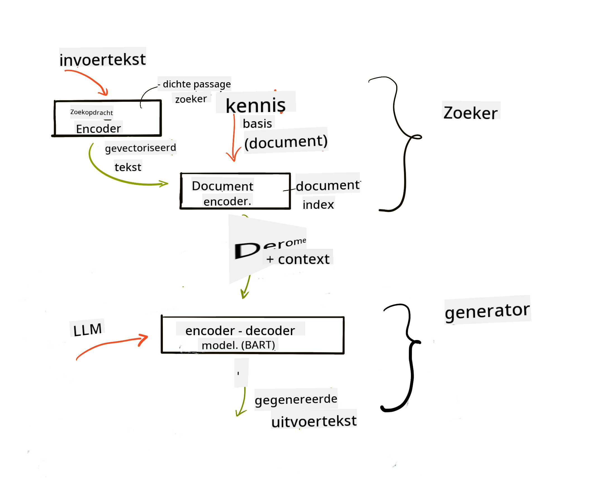
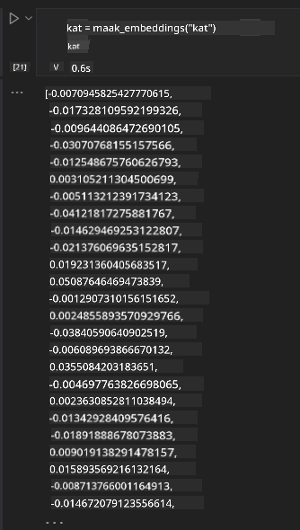

<!--
CO_OP_TRANSLATOR_METADATA:
{
  "original_hash": "e2861bbca91c0567ef32bc77fe054f9e",
  "translation_date": "2025-07-09T16:15:21+00:00",
  "source_file": "15-rag-and-vector-databases/README.md",
  "language_code": "nl"
}
-->
# Retrieval Augmented Generation (RAG) en Vector Databases

[](https://aka.ms/gen-ai-lesson15-gh?WT.mc_id=academic-105485-koreyst)

In de les over zoektoepassingen hebben we kort geleerd hoe je je eigen data kunt integreren in Large Language Models (LLM’s). In deze les duiken we dieper in de concepten van het verankeren van je data in je LLM-toepassing, de werking van het proces en de methoden om data op te slaan, inclusief zowel embeddings als tekst.

> **Video binnenkort beschikbaar**

## Introductie

In deze les behandelen we het volgende:

- Een introductie tot RAG, wat het is en waarom het wordt gebruikt in AI (kunstmatige intelligentie).

- Begrijpen wat vector databases zijn en het aanmaken van een database voor onze toepassing.

- Een praktisch voorbeeld van hoe je RAG integreert in een applicatie.

## Leerdoelen

Na het afronden van deze les kun je:

- Uitleggen waarom RAG belangrijk is bij het ophalen en verwerken van data.

- Een RAG-applicatie opzetten en je data verankeren aan een LLM.

- RAG en Vector Databases effectief integreren in LLM-toepassingen.

## Ons scenario: onze LLM’s verbeteren met eigen data

Voor deze les willen we onze eigen aantekeningen toevoegen aan de educatieve startup, zodat de chatbot meer informatie kan geven over verschillende onderwerpen. Met de aantekeningen die we hebben, kunnen leerlingen beter studeren en de verschillende onderwerpen beter begrijpen, wat het makkelijker maakt om te leren voor hun examens. Voor ons scenario gebruiken we:

- `Azure OpenAI:` het LLM dat we gebruiken om onze chatbot te maken

- `AI for beginners' lesson on Neural Networks:` dit is de data waarop we onze LLM baseren

- `Azure AI Search` en `Azure Cosmos DB:` vector database om onze data op te slaan en een zoekindex te creëren

Gebruikers kunnen oefenquizzen maken van hun aantekeningen, flashcards voor herhaling en samenvattingen in overzichtelijke overzichten. Laten we eerst kijken wat RAG is en hoe het werkt:

## Retrieval Augmented Generation (RAG)

Een door een LLM aangedreven chatbot verwerkt gebruikersvragen om antwoorden te genereren. Het is ontworpen om interactief te zijn en gaat in gesprek met gebruikers over allerlei onderwerpen. De antwoorden zijn echter beperkt tot de context die wordt meegegeven en de basis trainingsdata. Bijvoorbeeld, de kennis van GPT-4 stopt in september 2021, wat betekent dat het geen kennis heeft van gebeurtenissen na die datum. Daarnaast bevat de data die gebruikt wordt om LLM’s te trainen geen vertrouwelijke informatie zoals persoonlijke aantekeningen of een producthandleiding van een bedrijf.

### Hoe RAGs (Retrieval Augmented Generation) werken


Stel je wilt een chatbot inzetten die quizzen maakt van je aantekeningen, dan heb je een verbinding nodig met de kennisbank. Hier komt RAG om de hoek kijken. RAGs werken als volgt:

- **Kennisbank:** Voordat er opgehaald kan worden, moeten deze documenten worden ingelezen en voorbewerkt, meestal door grote documenten op te splitsen in kleinere stukken, deze om te zetten naar tekst-embeddings en op te slaan in een database.

- **Gebruikersvraag:** de gebruiker stelt een vraag

- **Ophalen:** Wanneer een gebruiker een vraag stelt, haalt het embeddingmodel relevante informatie op uit onze kennisbank om meer context te bieden die in de prompt wordt verwerkt.

- **Augmented Generation:** het LLM verbetert zijn antwoord op basis van de opgehaalde data. Dit zorgt ervoor dat het antwoord niet alleen gebaseerd is op de voorgetrainde data, maar ook op relevante informatie uit de toegevoegde context. De opgehaalde data wordt gebruikt om de antwoorden van het LLM aan te vullen. Het LLM geeft vervolgens een antwoord op de vraag van de gebruiker.



De architectuur van RAGs wordt geïmplementeerd met transformers die uit twee delen bestaan: een encoder en een decoder. Bijvoorbeeld, wanneer een gebruiker een vraag stelt, wordt de invoertekst ‘geëncodeerd’ in vectoren die de betekenis van woorden vastleggen, en worden deze vectoren ‘gedecodeerd’ in onze documentindex en genereert het nieuwe tekst op basis van de gebruikersvraag. Het LLM gebruikt een encoder-decoder model om de output te genereren.

Twee benaderingen bij het implementeren van RAG volgens het voorgestelde artikel: [Retrieval-Augmented Generation for Knowledge intensive NLP (natural language processing software) Tasks](https://arxiv.org/pdf/2005.11401.pdf?WT.mc_id=academic-105485-koreyst) zijn:

- **_RAG-Sequence_** waarbij opgehaalde documenten worden gebruikt om het beste antwoord op een gebruikersvraag te voorspellen

- **RAG-Token** waarbij documenten worden gebruikt om het volgende token te genereren, en deze vervolgens worden opgehaald om de vraag van de gebruiker te beantwoorden

### Waarom zou je RAGs gebruiken?

- **Informatierijkdom:** zorgt ervoor dat tekstuele antwoorden actueel en up-to-date zijn. Het verbetert daardoor de prestaties bij domeinspecifieke taken door toegang te krijgen tot de interne kennisbank.

- Vermindert verzinsels door gebruik te maken van **verifieerbare data** in de kennisbank om context te bieden bij gebruikersvragen.

- Het is **kostenbesparend** omdat het goedkoper is dan het fijn afstemmen van een LLM.

## Een kennisbank aanmaken

Onze applicatie is gebaseerd op onze persoonlijke data, namelijk de Neural Network les uit de AI For Beginners-curriculum.

### Vector Databases

Een vector database is, in tegenstelling tot traditionele databases, een gespecialiseerde database die is ontworpen om embedded vectoren op te slaan, te beheren en te doorzoeken. Het slaat numerieke representaties van documenten op. Door data om te zetten naar numerieke embeddings wordt het makkelijker voor ons AI-systeem om de data te begrijpen en te verwerken.

We slaan onze embeddings op in vector databases omdat LLM’s een limiet hebben aan het aantal tokens dat ze als input accepteren. Omdat je niet de hele embedding aan een LLM kunt doorgeven, moeten we ze opdelen in stukken en wanneer een gebruiker een vraag stelt, worden de embeddings die het meest op de vraag lijken teruggegeven samen met de prompt. Het opdelen in stukken verlaagt ook de kosten van het aantal tokens dat door een LLM wordt verwerkt.

Enkele populaire vector databases zijn Azure Cosmos DB, Clarifyai, Pinecone, Chromadb, ScaNN, Qdrant en DeepLake. Je kunt een Azure Cosmos DB-model aanmaken met Azure CLI met het volgende commando:

```bash
az login
az group create -n <resource-group-name> -l <location>
az cosmosdb create -n <cosmos-db-name> -r <resource-group-name>
az cosmosdb list-keys -n <cosmos-db-name> -g <resource-group-name>
```

### Van tekst naar embeddings

Voordat we onze data opslaan, moeten we deze omzetten naar vector embeddings. Als je werkt met grote documenten of lange teksten, kun je deze opdelen in stukken op basis van de verwachte vragen. Het opdelen kan op zinsniveau of op alinea-niveau. Omdat het opdelen betekenis haalt uit de woorden eromheen, kun je extra context toevoegen aan een stuk, bijvoorbeeld door de titel van het document toe te voegen of wat tekst voor of na het stuk mee te nemen. Je kunt de data als volgt opdelen:

```python
def split_text(text, max_length, min_length):
    words = text.split()
    chunks = []
    current_chunk = []

    for word in words:
        current_chunk.append(word)
        if len(' '.join(current_chunk)) < max_length and len(' '.join(current_chunk)) > min_length:
            chunks.append(' '.join(current_chunk))
            current_chunk = []

    # If the last chunk didn't reach the minimum length, add it anyway
    if current_chunk:
        chunks.append(' '.join(current_chunk))

    return chunks
```

Als de data is opgedeeld, kunnen we de tekst embedden met verschillende embeddingmodellen. Enkele modellen die je kunt gebruiken zijn: word2vec, ada-002 van OpenAI, Azure Computer Vision en nog veel meer. De keuze van het model hangt af van de talen die je gebruikt, het type content (tekst/afbeeldingen/audio), de grootte van de input die het kan verwerken en de lengte van de embedding output.

Een voorbeeld van embedded tekst met het OpenAI `text-embedding-ada-002` model is:


## Ophalen en Vector Search

Wanneer een gebruiker een vraag stelt, zet de retriever deze om in een vector met behulp van de query encoder, en zoekt vervolgens in onze documentzoekindex naar relevante vectoren in het document die gerelateerd zijn aan de input. Daarna zet het zowel de inputvector als de documentvectoren om in tekst en voert dit door het LLM.

### Ophalen

Ophalen gebeurt wanneer het systeem snel probeert de documenten uit de index te vinden die voldoen aan de zoekcriteria. Het doel van de retriever is om documenten te vinden die gebruikt worden om context te bieden en het LLM te verankeren op jouw data.

Er zijn verschillende manieren om te zoeken in onze database, zoals:

- **Zoeken op trefwoord** - gebruikt voor tekstzoekopdrachten

- **Semantisch zoeken** - gebruikt de semantische betekenis van woorden

- **Vector zoeken** - zet documenten om van tekst naar vectorrepresentaties met embeddingmodellen. Ophalen gebeurt door te zoeken naar documenten waarvan de vectorrepresentaties het dichtst bij de gebruikersvraag liggen.

- **Hybride** - een combinatie van trefwoord- en vectorzoeken.

Een uitdaging bij ophalen ontstaat wanneer er geen vergelijkbaar antwoord op de vraag in de database staat. Het systeem geeft dan de best mogelijke informatie terug, maar je kunt tactieken gebruiken zoals het instellen van een maximale afstand voor relevantie of hybride zoeken toepassen dat zowel trefwoorden als vectorzoeken combineert. In deze les gebruiken we hybride zoeken, een combinatie van vector- en trefwoordzoeken. We slaan onze data op in een dataframe met kolommen die de stukken en embeddings bevatten.

### Vector Similariteit

De retriever zoekt in de kennisdatabase naar embeddings die dicht bij elkaar liggen, de dichtstbijzijnde buur, omdat dit teksten zijn die op elkaar lijken. In het scenario wordt een gebruikersvraag eerst embedded en vervolgens gematcht met vergelijkbare embeddings. De meest gebruikte maatstaf om te bepalen hoe vergelijkbaar verschillende vectoren zijn, is cosine similarity, gebaseerd op de hoek tussen twee vectoren.

We kunnen ook andere methoden gebruiken om gelijkenis te meten, zoals Euclidische afstand, de rechte lijn tussen vectoruiteinden, en dot product, dat de som van de producten van overeenkomstige elementen van twee vectoren meet.

### Zoekindex

Bij het ophalen moeten we een zoekindex bouwen voor onze kennisbank voordat we kunnen zoeken. Een index slaat onze embeddings op en kan snel de meest vergelijkbare stukken terugvinden, zelfs in een grote database. We kunnen onze index lokaal aanmaken met:

```python
from sklearn.neighbors import NearestNeighbors

embeddings = flattened_df['embeddings'].to_list()

# Create the search index
nbrs = NearestNeighbors(n_neighbors=5, algorithm='ball_tree').fit(embeddings)

# To query the index, you can use the kneighbors method
distances, indices = nbrs.kneighbors(embeddings)
```

### Herordenen (Re-ranking)

Nadat je de database hebt doorzocht, wil je misschien de resultaten sorteren van meest relevant naar minder relevant. Een herordening LLM gebruikt Machine Learning om de relevantie van zoekresultaten te verbeteren door ze te rangschikken van meest relevant. Met Azure AI Search wordt herordenen automatisch voor je gedaan met een semantische herordener. Een voorbeeld van hoe herordenen werkt met de dichtstbijzijnde buren:

```python
# Find the most similar documents
distances, indices = nbrs.kneighbors([query_vector])

index = []
# Print the most similar documents
for i in range(3):
    index = indices[0][i]
    for index in indices[0]:
        print(flattened_df['chunks'].iloc[index])
        print(flattened_df['path'].iloc[index])
        print(flattened_df['distances'].iloc[index])
    else:
        print(f"Index {index} not found in DataFrame")
```

## Alles samenbrengen

De laatste stap is het toevoegen van ons LLM om antwoorden te krijgen die gebaseerd zijn op onze data. We kunnen dit als volgt implementeren:

```python
user_input = "what is a perceptron?"

def chatbot(user_input):
    # Convert the question to a query vector
    query_vector = create_embeddings(user_input)

    # Find the most similar documents
    distances, indices = nbrs.kneighbors([query_vector])

    # add documents to query  to provide context
    history = []
    for index in indices[0]:
        history.append(flattened_df['chunks'].iloc[index])

    # combine the history and the user input
    history.append(user_input)

    # create a message object
    messages=[
        {"role": "system", "content": "You are an AI assistant that helps with AI questions."},
        {"role": "user", "content": history[-1]}
    ]

    # use chat completion to generate a response
    response = openai.chat.completions.create(
        model="gpt-4",
        temperature=0.7,
        max_tokens=800,
        messages=messages
    )

    return response.choices[0].message

chatbot(user_input)
```

## Onze applicatie evalueren

### Evaluatiemaatstaven

- Kwaliteit van de gegeven antwoorden, waarbij het natuurlijk, vloeiend en menselijk klinkt

- Verankering van de data: beoordelen of het antwoord afkomstig is uit de aangeleverde documenten

- Relevantie: beoordelen of het antwoord aansluit bij en gerelateerd is aan de gestelde vraag

- Vloeiendheid - of het antwoord grammaticaal logisch is

## Gebruiksscenario’s voor RAG (Retrieval Augmented Generation) en vector databases

Er zijn veel verschillende toepassingen waarbij function calls je app kunnen verbeteren, zoals:

- Vraag en antwoord: je bedrijfsdata koppelen aan een chat die door medewerkers gebruikt kan worden om vragen te stellen.

- Aanbevelingssystemen: waarbij je een systeem maakt dat de meest vergelijkbare waarden matcht, bijvoorbeeld films, restaurants en meer.

- Chatbotdiensten: je kunt chatgeschiedenis opslaan en het gesprek personaliseren op basis van gebruikersdata.

- Beeldzoeken op basis van vector embeddings, handig bij beeldherkenning en het opsporen van afwijkingen.

## Samenvatting

We hebben de basisprincipes van RAG behandeld, van het toevoegen van onze data aan de applicatie, de gebruikersvraag tot de output. Om het maken van RAG eenvoudiger te maken, kun je frameworks gebruiken zoals Semantic Kernel, Langchain of Autogen.

## Opdracht

Om je kennis van Retrieval Augmented Generation (RAG) verder uit te breiden, kun je:

- Een front-end bouwen voor de applicatie met het framework van jouw keuze

- Een framework gebruiken, zoals LangChain of Semantic Kernel, en je applicatie opnieuw opbouwen.

Gefeliciteerd met het afronden van de les 👏.

## Leren stopt hier niet, ga door met de reis

Na het afronden van deze les, bekijk onze [Generative AI Learning collection](https://aka.ms/genai-collection?WT.mc_id=academic-105485-koreyst) om je kennis van Generative AI verder te verdiepen!

**Disclaimer**:  
Dit document is vertaald met behulp van de AI-vertalingsdienst [Co-op Translator](https://github.com/Azure/co-op-translator). Hoewel we streven naar nauwkeurigheid, dient u er rekening mee te houden dat geautomatiseerde vertalingen fouten of onnauwkeurigheden kunnen bevatten. Het originele document in de oorspronkelijke taal moet als de gezaghebbende bron worden beschouwd. Voor cruciale informatie wordt professionele menselijke vertaling aanbevolen. Wij zijn niet aansprakelijk voor eventuele misverstanden of verkeerde interpretaties die voortvloeien uit het gebruik van deze vertaling.