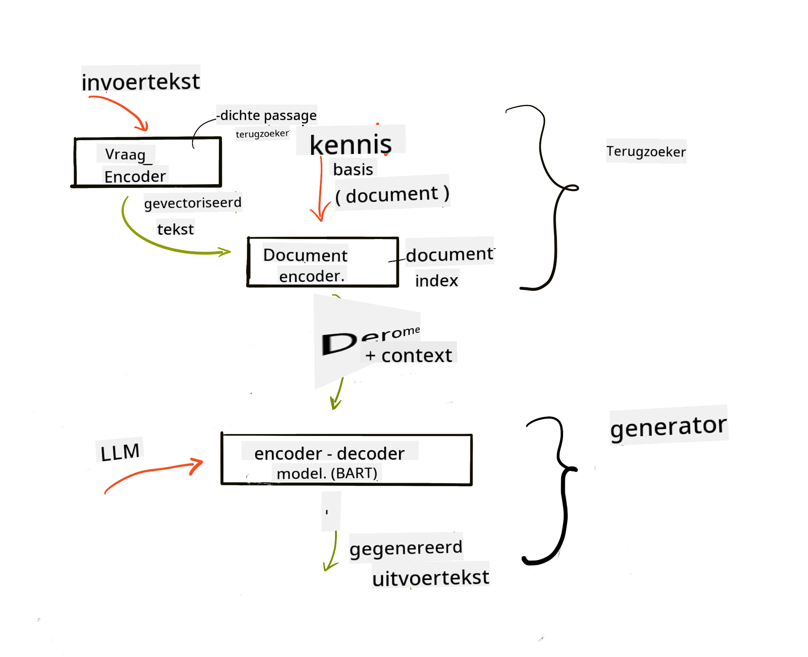

<!--
CO_OP_TRANSLATOR_METADATA:
{
  "original_hash": "e2861bbca91c0567ef32bc77fe054f9e",
  "translation_date": "2025-05-20T01:35:00+00:00",
  "source_file": "15-rag-and-vector-databases/README.md",
  "language_code": "nl"
}
-->
# Retrieval Augmented Generation (RAG) en Vector Databases

[](https://aka.ms/gen-ai-lesson15-gh?WT.mc_id=academic-105485-koreyst)

In de les over zoekapplicaties hebben we kort geleerd hoe je je eigen data kunt integreren in Large Language Models (LLMs). In deze les gaan we dieper in op de concepten van het verankeren van je data in je LLM-applicatie, de mechanismen van het proces en de methoden voor het opslaan van data, inclusief zowel embeddings als tekst.

> **Video Komt Binnenkort**

## Inleiding

In deze les behandelen we het volgende:

- Een introductie tot RAG, wat het is en waarom het wordt gebruikt in AI (kunstmatige intelligentie).

- Begrijpen wat vector databases zijn en er een maken voor onze applicatie.

- Een praktisch voorbeeld van hoe je RAG in een applicatie kunt integreren.

## Leerdoelen

Na het voltooien van deze les kun je:

- De betekenis van RAG in dataverzameling en -verwerking uitleggen.

- Een RAG-applicatie opzetten en je data verankeren aan een LLM.

- Effectieve integratie van RAG en Vector Databases in LLM Applicaties.

## Ons Scenario: onze LLMs verbeteren met onze eigen data

Voor deze les willen we onze eigen notities toevoegen aan de educatieve startup, waardoor de chatbot meer informatie kan krijgen over de verschillende onderwerpen. Met de notities die we hebben, kunnen leerlingen beter studeren en de verschillende onderwerpen begrijpen, wat het gemakkelijker maakt om zich voor te bereiden op hun examens. Om ons scenario te creëren, gebruiken we:

- `Azure OpenAI:` de LLM die we zullen gebruiken om onze chatbot te creëren

- `AI for beginners' lesson on Neural Networks`: dit zal de data zijn waarop we onze LLM baseren

- `Azure AI Search` en `Azure Cosmos DB:` vector database om onze data op te slaan en een zoekindex te creëren

Gebruikers zullen in staat zijn om oefenquizzen te maken van hun notities, herhalingsflitskaarten en het samen te vatten tot beknopte overzichten. Om te beginnen, laten we kijken wat RAG is en hoe het werkt:

## Retrieval Augmented Generation (RAG)

Een LLM-aangedreven chatbot verwerkt gebruikersvragen om antwoorden te genereren. Het is ontworpen om interactief te zijn en gaat in gesprek met gebruikers over een breed scala aan onderwerpen. Echter, de antwoorden zijn beperkt tot de context die wordt geboden en de basisopleidingsdata. Bijvoorbeeld, de kennisafsluiting van GPT-4 is september 2021, wat betekent dat het geen kennis heeft van gebeurtenissen die na deze periode hebben plaatsgevonden. Bovendien sluit de data die wordt gebruikt om LLMs te trainen vertrouwelijke informatie uit, zoals persoonlijke notities of een producthandleiding van een bedrijf.

### Hoe RAGs (Retrieval Augmented Generation) werken


Stel dat je een chatbot wilt implementeren die quizzen maakt van je notities, dan heb je een verbinding met de kennisbasis nodig. Dit is waar RAG te hulp komt. RAGs werken als volgt:

- **Kennisbasis:** Voordat ze worden opgehaald, moeten deze documenten worden opgenomen en voorverwerkt, meestal door grote documenten op te splitsen in kleinere stukken, ze om te zetten naar tekstembedding en ze op te slaan in een database.

- **Gebruikersvraag:** de gebruiker stelt een vraag

- **Ophalen:** Wanneer een gebruiker een vraag stelt, haalt het embedding-model relevante informatie uit onze kennisbasis om meer context te bieden die in de prompt wordt opgenomen.

- **Augmented Generation:** de LLM verbetert zijn antwoord op basis van de opgehaalde data. Het stelt het gegenereerde antwoord in staat om niet alleen gebaseerd te zijn op voorgetrainde data, maar ook op relevante informatie uit de toegevoegde context. De opgehaalde data wordt gebruikt om de antwoorden van de LLM aan te vullen. De LLM geeft dan een antwoord op de vraag van de gebruiker.



De architectuur voor RAGs wordt geïmplementeerd met behulp van transformers die bestaan uit twee delen: een encoder en een decoder. Bijvoorbeeld, wanneer een gebruiker een vraag stelt, wordt de invoertekst 'gecodeerd' in vectoren die de betekenis van woorden vastleggen en de vectoren worden 'gedecodeerd' in onze documentindex en genereert nieuwe tekst op basis van de gebruikersvraag. De LLM gebruikt zowel een encoder-decoder model om de output te genereren.

Twee benaderingen bij het implementeren van RAG volgens het voorgestelde artikel: [Retrieval-Augmented Generation for Knowledge intensive NLP (natural language processing software) Tasks](https://arxiv.org/pdf/2005.11401.pdf?WT.mc_id=academic-105485-koreyst) zijn:

- **_RAG-Sequence_** gebruikt opgehaalde documenten om het best mogelijke antwoord op een gebruikersvraag te voorspellen

- **RAG-Token** gebruikt documenten om de volgende token te genereren en haalt ze vervolgens op om de vraag van de gebruiker te beantwoorden

### Waarom zou je RAGs gebruiken? 

- **Informatierijkdom:** zorgt ervoor dat tekstantwoorden up-to-date en actueel zijn. Het verbetert dus de prestaties op domeinspecifieke taken door toegang te krijgen tot de interne kennisbasis.

- Vermindert verzinsels door gebruik te maken van **verifieerbare data** in de kennisbasis om context te bieden aan de gebruikersvragen.

- Het is **kosteneffectief** omdat ze economischer zijn in vergelijking met het fijn afstemmen van een LLM.

## Een kennisbasis creëren

Onze applicatie is gebaseerd op onze persoonlijke data, namelijk de les Neurale Netwerken in het curriculum AI For Beginners.

### Vector Databases

Een vector database, in tegenstelling tot traditionele databases, is een gespecialiseerde database die is ontworpen om ingesloten vectoren op te slaan, te beheren en te doorzoeken. Het slaat numerieke representaties van documenten op. Het opsplitsen van data naar numerieke embeddings maakt het gemakkelijker voor ons AI-systeem om de data te begrijpen en te verwerken.

We slaan onze embeddings op in vector databases omdat LLMs een limiet hebben aan het aantal tokens dat ze accepteren als invoer. Aangezien je de volledige embeddings niet aan een LLM kunt doorgeven, moeten we ze opsplitsen in stukken en wanneer een gebruiker een vraag stelt, worden de embeddings die het meest op de vraag lijken samen met de prompt teruggegeven. Het opsplitsen vermindert ook de kosten van het aantal tokens dat door een LLM gaat.

Enkele populaire vector databases zijn Azure Cosmos DB, Clarifyai, Pinecone, Chromadb, ScaNN, Qdrant en DeepLake. Je kunt een Azure Cosmos DB-model maken met behulp van Azure CLI met het volgende commando:

```bash
az login
az group create -n <resource-group-name> -l <location>
az cosmosdb create -n <cosmos-db-name> -r <resource-group-name>
az cosmosdb list-keys -n <cosmos-db-name> -g <resource-group-name>
```

### Van tekst naar embeddings

Voordat we onze data opslaan, moeten we deze omzetten naar vector embeddings voordat deze in de database worden opgeslagen. Als je werkt met grote documenten of lange teksten, kun je ze opsplitsen op basis van de verwachte vragen. Het opsplitsen kan op zinsniveau of op alineaniveau. Aangezien het opsplitsen betekenissen afleidt van de woorden eromheen, kun je wat andere context aan een stuk toevoegen, bijvoorbeeld door de documenttitel toe te voegen of wat tekst voor of na het stuk op te nemen. Je kunt de data als volgt opsplitsen:

```python
def split_text(text, max_length, min_length):
    words = text.split()
    chunks = []
    current_chunk = []

    for word in words:
        current_chunk.append(word)
        if len(' '.join(current_chunk)) < max_length and len(' '.join(current_chunk)) > min_length:
            chunks.append(' '.join(current_chunk))
            current_chunk = []

    # If the last chunk didn't reach the minimum length, add it anyway
    if current_chunk:
        chunks.append(' '.join(current_chunk))

    return chunks
```

Zodra ze zijn opgesplitst, kunnen we onze tekst vervolgens inbedden met behulp van verschillende embedding-modellen. Enkele modellen die je kunt gebruiken zijn: word2vec, ada-002 door OpenAI, Azure Computer Vision en vele anderen. Het selecteren van een model om te gebruiken hangt af van de talen die je gebruikt, het type content dat wordt gecodeerd (tekst/afbeeldingen/audio), de grootte van de invoer die het kan coderen en de lengte van de embedding-uitvoer.

Een voorbeeld van ingebedde tekst met behulp van OpenAI's `text-embedding-ada-002` model is:


## Ophalen en Vector Zoeken

Wanneer een gebruiker een vraag stelt, zet de retriever deze om in een vector met behulp van de query-encoder, zoekt vervolgens door onze documentzoekindex naar relevante vectoren in het document die gerelateerd zijn aan de invoer. Zodra dit is gedaan, zet het zowel de invoervector als documentvectoren om in tekst en geeft het door aan de LLM.

### Ophalen

Ophalen gebeurt wanneer het systeem probeert snel de documenten uit de index te vinden die voldoen aan de zoekcriteria. Het doel van de retriever is om documenten te krijgen die zullen worden gebruikt om context te bieden en de LLM te verankeren op je data.

Er zijn verschillende manieren om binnen onze database te zoeken, zoals:

- **Zoeken op trefwoord** - gebruikt voor tekstzoekopdrachten

- **Semantisch zoeken** - gebruikt de semantische betekenis van woorden

- **Vector zoeken** - zet documenten om van tekst naar vectorrepresentaties met behulp van embedding-modellen. Ophalen wordt gedaan door de documenten op te vragen waarvan de vectorrepresentaties het dichtst bij de gebruikersvraag liggen.

- **Hybride** - een combinatie van zowel trefwoord- als vector zoeken.

Een uitdaging bij het ophalen ontstaat wanneer er geen vergelijkbare reactie op de vraag in de database is, het systeem zal dan de beste informatie teruggeven die ze kunnen krijgen, maar je kunt tactieken gebruiken zoals het instellen van de maximale afstand voor relevantie of het gebruik van hybride zoeken dat zowel trefwoorden als vector zoeken combineert. In deze les zullen we hybride zoeken gebruiken, een combinatie van zowel vector als trefwoord zoeken. We zullen onze data opslaan in een dataframe met kolommen die de stukken en embeddings bevatten.

### Vector Gelijkenis

De retriever zal door de kennisdatabase zoeken naar embeddings die dicht bij elkaar liggen, de dichtstbijzijnde buur, omdat het teksten zijn die vergelijkbaar zijn. In het geval dat een gebruiker een vraag stelt, wordt deze eerst ingebed en vervolgens gematcht met vergelijkbare embeddings. De gebruikelijke meting die wordt gebruikt om te vinden hoe vergelijkbaar verschillende vectoren zijn, is cosinusgelijkenis die is gebaseerd op de hoek tussen twee vectoren.

We kunnen gelijkenis meten met andere alternatieven die we kunnen gebruiken, zoals de Euclidische afstand, wat de rechte lijn is tussen vectoruiteinden en het inwendig product, dat de som meet van de producten van overeenkomstige elementen van twee vectoren.

### Zoekindex

Bij het ophalen zullen we een zoekindex voor onze kennisbasis moeten bouwen voordat we zoeken uitvoeren. Een index slaat onze embeddings op en kan snel de meest vergelijkbare stukken ophalen, zelfs in een grote database. We kunnen onze index lokaal maken met behulp van:

```python
from sklearn.neighbors import NearestNeighbors

embeddings = flattened_df['embeddings'].to_list()

# Create the search index
nbrs = NearestNeighbors(n_neighbors=5, algorithm='ball_tree').fit(embeddings)

# To query the index, you can use the kneighbors method
distances, indices = nbrs.kneighbors(embeddings)
```

### Herordenen

Zodra je de database hebt doorzocht, moet je mogelijk de resultaten sorteren van de meest relevante. Een herordening LLM maakt gebruik van Machine Learning om de relevantie van zoekresultaten te verbeteren door ze te rangschikken van de meest relevante. Met Azure AI Search wordt herordening automatisch voor je gedaan met behulp van een semantische herordener. Een voorbeeld van hoe herordening werkt met behulp van dichtstbijzijnde buren:

```python
# Find the most similar documents
distances, indices = nbrs.kneighbors([query_vector])

index = []
# Print the most similar documents
for i in range(3):
    index = indices[0][i]
    for index in indices[0]:
        print(flattened_df['chunks'].iloc[index])
        print(flattened_df['path'].iloc[index])
        print(flattened_df['distances'].iloc[index])
    else:
        print(f"Index {index} not found in DataFrame")
```

## Alles samenbrengen

De laatste stap is om onze LLM toe te voegen aan de mix om antwoorden te kunnen krijgen die gebaseerd zijn op onze data. We kunnen het als volgt implementeren:

```python
user_input = "what is a perceptron?"

def chatbot(user_input):
    # Convert the question to a query vector
    query_vector = create_embeddings(user_input)

    # Find the most similar documents
    distances, indices = nbrs.kneighbors([query_vector])

    # add documents to query  to provide context
    history = []
    for index in indices[0]:
        history.append(flattened_df['chunks'].iloc[index])

    # combine the history and the user input
    history.append(user_input)

    # create a message object
    messages=[
        {"role": "system", "content": "You are an AI assistant that helps with AI questions."},
        {"role": "user", "content": history[-1]}
    ]

    # use chat completion to generate a response
    response = openai.chat.completions.create(
        model="gpt-4",
        temperature=0.7,
        max_tokens=800,
        messages=messages
    )

    return response.choices[0].message

chatbot(user_input)
```

## Onze applicatie evalueren

### Evaluatiecriteria

- Kwaliteit van de geleverde antwoorden, waarbij ervoor wordt gezorgd dat het natuurlijk, vloeiend en mensachtig klinkt

- Verankering van de data: evalueren of het antwoord afkomstig is van de geleverde documenten

- Relevantie: evalueren of het antwoord overeenkomt met en gerelateerd is aan de gestelde vraag

- Vloeiendheid - of het antwoord grammaticaal logisch is

## Gebruiksscenario's voor het gebruik van RAG (Retrieval Augmented Generation) en vector databases

Er zijn veel verschillende gebruiksscenario's waarbij functieaanroepen je app kunnen verbeteren, zoals:

- Vraag en Antwoord: het verankeren van je bedrijfsdata aan een chat die door werknemers kan worden gebruikt om vragen te stellen.

- Aanbevelingssystemen: waar je een systeem kunt creëren dat de meest vergelijkbare waarden matcht, bijvoorbeeld films, restaurants en nog veel meer.

- Chatbotdiensten: je kunt chatgeschiedenis opslaan en het gesprek personaliseren op basis van de gebruikersdata.

- Afbeeldingszoekopdrachten op basis van vector embeddings, nuttig bij beeldherkenning en anomaliedetectie.

## Samenvatting

We hebben de fundamentele gebieden van RAG behandeld, van het toevoegen van onze data aan de applicatie, de gebruikersvraag en output. Om het creëren van RAG te vereenvoudigen, kun je frameworks gebruiken zoals Semanti Kernel, Langchain of Autogen.

## Opdracht

Om je kennis van Retrieval Augmented Generation (RAG) voort te zetten, kun je bouwen:

- Een front-end voor de applicatie bouwen met behulp van het framework van je keuze

- Een framework gebruiken, ofwel LangChain of Semantic Kernel, en je applicatie opnieuw creëren.

Gefeliciteerd met het voltooien van de les 👏.

## Leren stopt hier niet, vervolg de Reis

Na het voltooien van deze les, bekijk onze [Generatieve AI Leercollectie](https://aka.ms/genai-collection?WT.mc_id=academic-105485-koreyst) om je kennis van Generatieve AI verder te verdiepen!

**Disclaimer**:  
Dit document is vertaald met behulp van de AI-vertalingsdienst [Co-op Translator](https://github.com/Azure/co-op-translator). Hoewel we streven naar nauwkeurigheid, dient u zich ervan bewust te zijn dat geautomatiseerde vertalingen fouten of onnauwkeurigheden kunnen bevatten. Het originele document in zijn oorspronkelijke taal moet als de gezaghebbende bron worden beschouwd. Voor kritieke informatie wordt professionele menselijke vertaling aanbevolen. Wij zijn niet aansprakelijk voor eventuele misverstanden of misinterpretaties die voortvloeien uit het gebruik van deze vertaling.