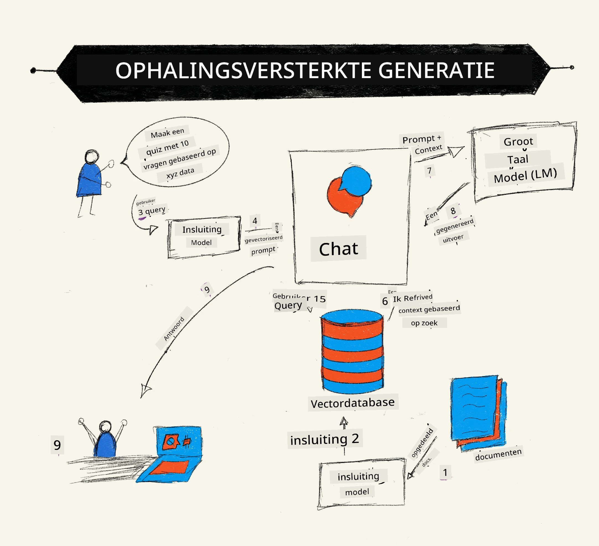
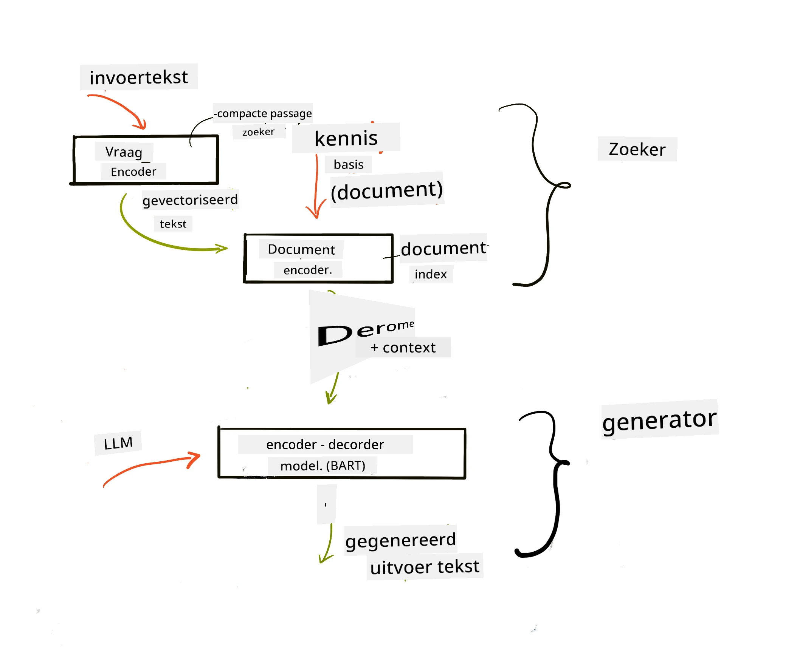
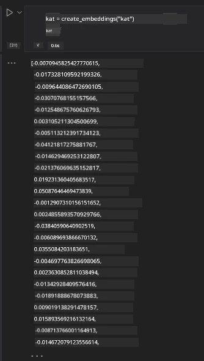

# Retrieval Augmented Generation (RAG) en Vector Databases

[](https://youtu.be/4l8zhHUBeyI?si=BmvDmL1fnHtgQYkL)

In de les over zoektoepassingen hebben we kort geleerd hoe je je eigen data kunt integreren in Large Language Models (LLM’s). In deze les zullen we dieper ingaan op de concepten van het funderen van je data in je LLM-toepassing, de werking van het proces en de methoden voor het opslaan van data, inclusief zowel embeddings als tekst.

> **Video komt binnenkort**

## Inleiding

In deze les behandelen we het volgende:

- Een introductie tot RAG, wat het is en waarom het wordt gebruikt in AI (kunstmatige intelligentie).

- Begrijpen wat vector databases zijn en het creëren van een vector database voor onze toepassing.

- Een praktisch voorbeeld van hoe je RAG in een toepassing integreert.

## Leerdoelen

Na het voltooien van deze les kun je:

- De betekenis van RAG bij data-opvraging en verwerking uitleggen.

- Een RAG-toepassing opzetten en je data funderen in een LLM.

- Effectieve integratie van RAG en Vector Databases in LLM-toepassingen.

## Ons Scenario: onze LLMs verrijken met eigen data

Voor deze les willen we onze eigen notities toevoegen aan de educatieve startup, wat het chatbot in staat stelt meer informatie te krijgen over verschillende onderwerpen. Met behulp van de notities die we hebben, kunnen leerlingen beter studeren en de verschillende onderwerpen begrijpen, wat het makkelijker maakt om te reviseren voor hun examens. Voor ons scenario gebruiken we:

- `Azure OpenAI:` de LLM die we gebruiken om onze chatbot te maken

- `AI for beginners' lesson on Neural Networks`: dit is de data waarop we onze LLM funderen

- `Azure AI Search` en `Azure Cosmos DB:` vector database om onze data op te slaan en een zoekindex te creëren

Gebruikers kunnen oefenquizzen maken vanuit hun notities, revisie-flashcards maken en deze samenvatten tot beknopte overzichten. Laten we beginnen met wat RAG is en hoe het werkt:

## Retrieval Augmented Generation (RAG)

Een LLM-gestuurde chatbot verwerkt gebruikersopdrachten om antwoorden te genereren. Het is ontworpen om interactief te zijn en gaat in gesprek met gebruikers over een breed scala aan onderwerpen. De antwoorden zijn echter beperkt tot de context die wordt verstrekt en de basis-trainingsdata. GPT-4 bijvoorbeeld heeft een kennisafkapdatum van september 2021, wat betekent dat het geen kennis heeft van gebeurtenissen na die tijd. Bovendien bevat de data die gebruikt wordt om LLMs te trainen geen vertrouwelijke informatie zoals persoonlijke notities of het producthandboek van een bedrijf.

### Hoe RAGs (Retrieval Augmented Generation) werken



Stel dat je een chatbot wil inzetten die quizzen maakt van jouw notities, dan heb je een verbinding met de kennisbasis nodig. Dit is waar RAG te hulp schiet. RAGs werken als volgt:

- **Kennisbasis:** Voordat er iets wordt opgehaald, moeten deze documenten worden ingelezen en voorverwerkt, meestal door grote documenten in kleinere stukken op te splitsen, deze om te zetten in tekst-embeddings en op te slaan in een database.

- **Gebruikersvraag:** de gebruiker stelt een vraag.

- **Ophalen:** Wanneer een gebruiker een vraag stelt, haalt het embeddingmodel relevante informatie op uit onze kennisbasis om meer context te bieden die in de prompt wordt verwerkt.

- **Uitgebreide generatie:** de LLM verbetert zijn antwoord op basis van de opgehaalde data. Zo wordt het antwoord niet alleen gegenereerd op basis van vooraf getrainde data, maar ook via relevante informatie van de toegevoegde context. De opgehaalde data wordt gebruikt om de antwoorden van de LLM te versterken. De LLM geeft vervolgens een antwoord op de vraag van de gebruiker.



De architectuur van RAGs wordt geïmplementeerd met transformers die uit twee delen bestaan: een encoder en een decoder. Bijvoorbeeld, wanneer een gebruiker een vraag stelt, wordt de invoertekst ‘geëncodeerd’ naar vectoren die de betekenis van woorden vangen en worden deze vectoren ‘gedecodeerd’ in onze documentindex en genereert nieuwe tekst gebaseerd op de gebruikersvraag. De LLM gebruikt een encoder-decoder model om de output te genereren.

Twee benaderingen voor het implementeren van RAG volgens het voorgestelde paper: [Retrieval-Augmented Generation for Knowledge intensive NLP (natural language processing software) Tasks](https://arxiv.org/pdf/2005.11401.pdf?WT.mc_id=academic-105485-koreyst) zijn:

- **_RAG-Sequence_** gebruikt opgehaalde documenten om het beste mogelijke antwoord op een gebruikersvraag te voorspellen

- **RAG-Token** gebruikt documenten om het volgende token te genereren, waarna deze opnieuw worden opgehaald om de gebruikersvraag te beantwoorden

### Waarom zou je RAGs gebruiken?

- **Informatierijkdom:** zorgt ervoor dat tekstuele antwoorden up-to-date en actueel zijn. Zo verbetert het de prestaties op domeinspecifieke taken door toegang tot de interne kennisbasis.

- Vermindert verzinsels door **verifieerbare data** uit de kennisbasis te gebruiken om context te bieden bij gebruikersvragen.

- Het is **kostenbesparend** omdat het economischer is dan het fijnslijpen (fine-tunen) van een LLM.

## Een kennisbasis creëren

Onze applicatie is gebaseerd op onze persoonlijke data, namelijk de Neural Network-les van het AI For Beginners curriculum.

### Vector Databases

Een vector database is, anders dan traditionele databases, een gespecialiseerde database ontworpen om embedded vectoren op te slaan, beheren en doorzoeken. Het slaat numerieke representaties van documenten op. Door data om te zetten in numerieke embeddings wordt het makkelijker voor ons AI-systeem om de data te begrijpen en te verwerken.

We slaan onze embeddings op in vector databases omdat LLMs een limiet hebben aan het aantal tokens dat ze als input accepteren. Omdat je niet de gehele embedding aan een LLM kunt voeren, moeten we deze opsplitsen in stukken, en wanneer een gebruiker een vraag stelt, worden de meest relevante embeddings samen met de prompt teruggegeven. Het opsplitsen (chunking) vermindert ook de kosten van het aantal tokens dat door een LLM gaat.

Enkele populaire vector databases zijn Azure Cosmos DB, Clarifyai, Pinecone, Chromadb, ScaNN, Qdrant en DeepLake. Je kunt een Azure Cosmos DB model maken met Azure CLI met het volgende commando:

```bash
az login
az group create -n <resource-group-name> -l <location>
az cosmosdb create -n <cosmos-db-name> -r <resource-group-name>
az cosmosdb list-keys -n <cosmos-db-name> -g <resource-group-name>
```

### Van tekst naar embeddings

Voordat we onze data opslaan, moeten we deze omzetten naar vector embeddings. Als je werkt met grote documenten of lange teksten, kun je deze opdelen op basis van de vragen die je verwacht. Het opdelen kan op zin- of paragraafniveau gebeuren. Omdat de betekenis van een stuk ook afhangt van de woorden eromheen, kun je extra context aan een stuk toevoegen, bijvoorbeeld door de titel van het document toe te voegen of wat tekst ervoor of erna. Je kunt de data als volgt opdelen:

```python
def split_text(text, max_length, min_length):
    words = text.split()
    chunks = []
    current_chunk = []

    for word in words:
        current_chunk.append(word)
        if len(' '.join(current_chunk)) < max_length and len(' '.join(current_chunk)) > min_length:
            chunks.append(' '.join(current_chunk))
            current_chunk = []

    # Als het laatste stuk de minimale lengte niet heeft bereikt, voeg het toch toe
    if current_chunk:
        chunks.append(' '.join(current_chunk))

    return chunks
```

Zodra de data opgedeeld is, kunnen we onze tekst embedden met behulp van verschillende embeddingmodellen. Enkele modellen die je kunt gebruiken zijn: word2vec, ada-002 van OpenAI, Azure Computer Vision en meer. De keuze van een model is afhankelijk van de talen die je gebruikt, het soort inhoud (tekst/afbeeldingen/audio), de grootte van de input die het kan encoderen en de lengte van de embedding-output.

Een voorbeeld van ingebedde tekst met OpenAI’s `text-embedding-ada-002` model is:


## Ophalen en Vector Search

Wanneer een gebruiker een vraag stelt, zet de retriever deze om in een vector met behulp van de query encoder, waarna het zoekt in onze documentzoekindex naar relevante vectoren die bij de vraag horen. Vervolgens zet het zowel de inputvector als de documentvectoren om in tekst en voert dit door de LLM.

### Ophalen

Retrieval vindt plaats wanneer het systeem snel documenten probeert te vinden uit de index die voldoen aan de zoekcriteria. Het doel van de retriever is documenten te vinden die gebruikt worden om context te bieden en de LLM te funderen op jouw data.

Er zijn verschillende manieren om te zoeken binnen onze database, zoals:

- **Zoeken op trefwoord** - gebruikt voor tekstzoekopdrachten

- **Vector search** - zet documenten om van tekst naar vectorrepresentaties met embeddingmodellen, waardoor een **semantische zoekopdracht** mogelijk wordt op de betekenis van woorden. Retrieval gebeurt door te zoeken naar documenten waarvan de vectorrepresentaties het dichtst bij de gebruikersvraag liggen.

- **Hybride** - een combinatie van zowel trefwoord- als vectorzoekopdrachten.

Een uitdaging bij retrieval ontstaat wanneer er geen vergelijkbaar antwoord in de database staat op een query. Het systeem geeft dan het beste informatie terug die het kan vinden, maar je kunt tactieken gebruiken zoals het instellen van een maximale afstand voor relevantie of een hybride zoekopdracht inzetten die zowel trefwoorden als vector search combineert. In deze les gebruiken we hybride zoeken, een combinatie van vector- en trefwoordzoekopdrachten. We slaan onze data op in een dataframe met kolommen die de chunks en de embeddings bevatten.

### Vector Gelijkenis

De retriever zoekt in de kennisdatabase naar embeddings die dicht bij elkaar liggen, de ‘dichtstbijzijnde buur’ (nearest neighbour), omdat het teksten zijn die op elkaar lijken. In het scenario waarin een gebruiker een query stelt, wordt deze eerst geëncodeerd en vervolgens gematcht met soortgelijke embeddings. De meest gebruikte maatstaf om te bepalen hoe gelijkend vectoren zijn is cosinusgelijkenis, gebaseerd op de hoek tussen twee vectoren.

We kunnen gelijkenis ook meten met andere methoden zoals Euclidische afstand, de rechte lijn tussen vector-einden, en de dotproduct, die de som meet van de producten van overeenkomstige elementen in twee vectoren.

### Zoekindex

Voor het uitvoeren van retrieval moeten we een zoekindex bouwen voor onze kennisbasis. Een index slaat onze embeddings op en kan snel de meest vergelijkbare chunks ophalen, ook in een grote database. We kunnen onze index lokaal maken met:

```python
from sklearn.neighbors import NearestNeighbors

embeddings = flattened_df['embeddings'].to_list()

# Maak de zoekindex aan
nbrs = NearestNeighbors(n_neighbors=5, algorithm='ball_tree').fit(embeddings)

# Om de index te doorzoeken, kunt u de kneighbors-methode gebruiken
distances, indices = nbrs.kneighbors(embeddings)
```

### Herordenen (Re-ranking)

Zodra je hebt gevraagd in de database, moet je de resultaten mogelijk sorteren van meest relevant. Een herordenende LLM gebruikt machine learning om de relevantie van zoekresultaten te verbeteren door ze te rangschikken van meest relevant naar minst relevant. Met Azure AI Search wordt herordenen automatisch voor je gedaan met een semantische reranker. Een voorbeeld van hoe reranking werkt met nearest neighbours:

```python
# Vind de meest vergelijkbare documenten
distances, indices = nbrs.kneighbors([query_vector])

index = []
# Print de meest vergelijkbare documenten
for i in range(3):
    index = indices[0][i]
    for index in indices[0]:
        print(flattened_df['chunks'].iloc[index])
        print(flattened_df['path'].iloc[index])
        print(flattened_df['distances'].iloc[index])
    else:
        print(f"Index {index} not found in DataFrame")
```

## Alles samenbrengen

De laatste stap is het toevoegen van onze LLM om antwoorden te kunnen krijgen die gebaseerd zijn op onze data. We kunnen dit als volgt implementeren:

```python
user_input = "what is a perceptron?"

def chatbot(user_input):
    # Zet de vraag om in een queryvector
    query_vector = create_embeddings(user_input)

    # Vind de meest vergelijkbare documenten
    distances, indices = nbrs.kneighbors([query_vector])

    # voeg documenten toe aan de query om context te bieden
    history = []
    for index in indices[0]:
        history.append(flattened_df['chunks'].iloc[index])

    # combineer de geschiedenis en de gebruikersinvoer
    history.append(user_input)

    # maak een berichtobject aan
    messages=[
        {"role": "system", "content": "You are an AI assistant that helps with AI questions."},
        {"role": "user", "content": "\n\n".join(history) }
    ]

    # gebruik chatcompletie om een reactie te genereren
    response = openai.chat.completions.create(
        model="gpt-4",
        temperature=0.7,
        max_tokens=800,
        messages=messages
    )

    return response.choices[0].message

chatbot(user_input)
```

## Onze toepassing evalueren

### Evaluatiecriteria

- Kwaliteit van de gegeven antwoorden: zorgen dat ze natuurlijk, vloeiend en menselijk klinken

- Fundering van de data: evalueren of het antwoord afkomstig is uit de aangeleverde documenten

- Relevant: evalueren of het antwoord past bij en gerelateerd is aan de gestelde vraag

- Vloeiendheid: of het antwoord grammaticaal klopt

## Toepassingen van Retrieval Augmented Generation (RAG) en vector databases

Er zijn veel verschillende toepassingen waar functie-aanroepen je app kunnen verbeteren, zoals:

- Vraag en Antwoord: fundeer je bedrijfsdata in een chat die door medewerkers kan worden gebruikt om vragen te stellen.

- Aanbevelingssystemen: waar je een systeem maakt dat de meest vergelijkbare waarden matcht, bijvoorbeeld films, restaurants en meer.

- Chatbot diensten: je kunt chatgeschiedenis opslaan en het gesprek personaliseren op basis van gebruikersdata.

- Afbeelding zoeken op basis van vector embeddings, nuttig bij beeldherkenning en het opsporen van afwijkingen.

## Samenvatting

We hebben de fundamentele gebieden van RAG behandeld, van het toevoegen van data aan de applicatie, de gebruikersvraag en output. Om het maken van RAG eenvoudiger te maken, kun je frameworks gebruiken zoals Semantic Kernel, Langchain of Autogen.

## Opdracht

Om je kennis van Retrieval Augmented Generation (RAG) te verdiepen kun je:

- Een front-end bouwen voor de applicatie met het framework van jouw keuze

- Een framework gebruiken, zoals LangChain of Semantic Kernel, en je applicatie opnieuw maken.

Gefeliciteerd met het voltooien van de les 👏.

## Leren stopt hier niet, ga verder op de Reis

Na het voltooien van deze les, bekijk onze [Generative AI Learning collection](https://aka.ms/genai-collection?WT.mc_id=academic-105485-koreyst) om je kennis over Generatieve AI verder te verdiepen!

---

<!-- CO-OP TRANSLATOR DISCLAIMER START -->
**Disclaimer**:
Dit document is vertaald met behulp van de AI vertaaldienst [Co-op Translator](https://github.com/Azure/co-op-translator). Hoewel we streven naar nauwkeurigheid, verzoeken wij u rekening te houden met het feit dat automatische vertalingen fouten of onnauwkeurigheden kunnen bevatten. Het originele document in de oorspronkelijke taal dient als de bevoegde bron te worden beschouwd. Voor cruciale informatie wordt professionele menselijke vertaling aanbevolen. Wij zijn niet aansprakelijk voor eventuele misverstanden of verkeerd geïnterpreteerde informatie die voortvloeit uit het gebruik van deze vertaling.
<!-- CO-OP TRANSLATOR DISCLAIMER END -->