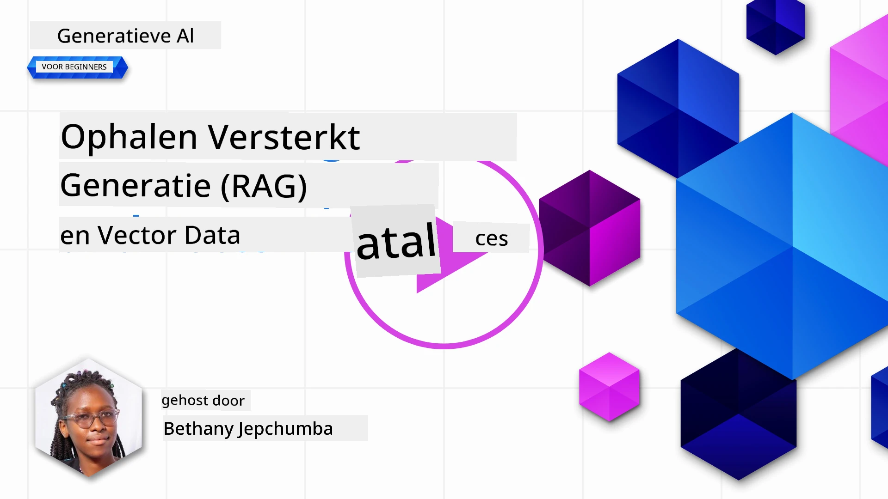
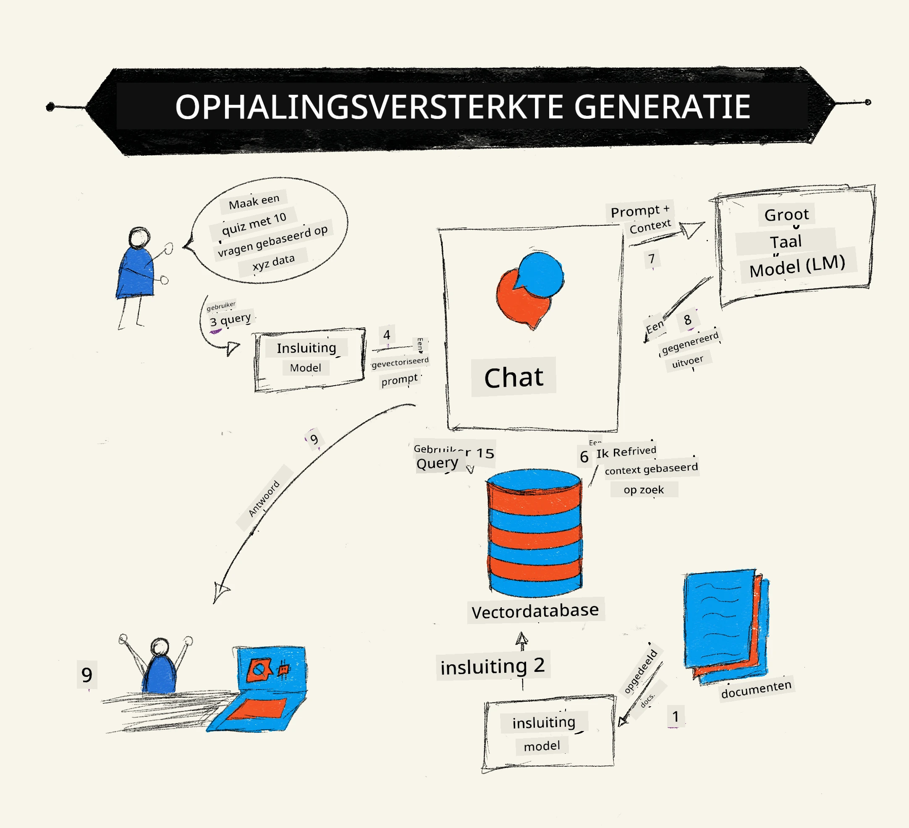
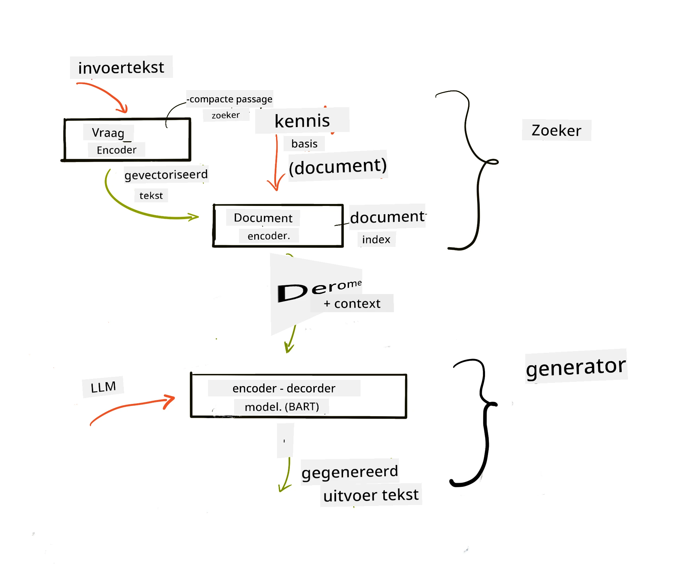
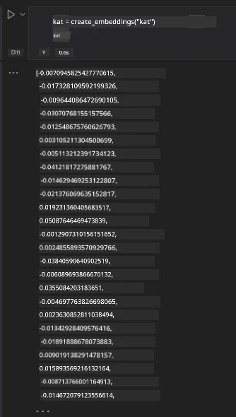

# Retrieval Augmented Generation (RAG) en Vector Databases

[](https://youtu.be/4l8zhHUBeyI?si=BmvDmL1fnHtgQYkL)

In de les over zoekapplicaties hebben we kort geleerd hoe je je eigen data in grote taalmodellen (LLM's) kunt integreren. In deze les gaan we dieper in op de concepten van het verankeren van je data in je LLM-toepassing, de werking van het proces en de methoden voor het opslaan van data, inclusief zowel embeddings als tekst.

> **Video binnenkort beschikbaar**

## Introductie

In deze les behandelen we het volgende:

- Een introductie tot RAG, wat het is en waarom het wordt gebruikt in AI (kunstmatige intelligentie).

- Begrijpen wat vector databases zijn en het maken van een voor onze toepassing.

- Een praktisch voorbeeld over hoe RAG in een applicatie te integreren.

## Leerdoelen

Na het voltooien van deze les kun je:

- De betekenis van RAG in data-ophaling en verwerking uitleggen.

- Een RAG-toepassing opzetten en je data verankeren aan een LLM.

- Effectieve integratie van RAG en Vector Databases in LLM-toepassingen.

## Ons Scenario: onze LLM's verrijken met onze eigen data

Voor deze les willen we onze eigen notities toevoegen aan de educatieve startup, zodat de chatbot meer informatie kan krijgen over de verschillende onderwerpen. Met de notities die we hebben, kunnen leerlingen beter studeren en de verschillende onderwerpen begrijpen, wat het makkelijker maakt om zich voor te bereiden op hun examens. Om ons scenario te creëren, gebruiken we:

- `Azure OpenAI:` de LLM die we gebruiken om onze chatbot te maken

- `AI for beginners' les over Neural Networks`: dit wordt de data waarop we onze LLM baseren

- `Azure AI Search` en `Azure Cosmos DB:` vector database om onze data op te slaan en een zoekindex te maken

Gebruikers kunnen oefenquizzen maken van hun notities, revisie-flashcards en deze samenvatten tot beknopte overzichten. Laten we om te beginnen eens kijken wat RAG is en hoe het werkt:

## Retrieval Augmented Generation (RAG)

Een LLM-gestuurde chatbot verwerkt gebruikersprompts om antwoorden te genereren. Het is ontworpen om interactief te zijn en met gebruikers over diverse onderwerpen te communiceren. Echter, de antwoorden zijn beperkt tot de context die wordt aangeleverd en de onderliggende trainingsdata. Bijvoorbeeld, de kennis van GPT-4 stopt in september 2021, wat betekent dat het geen kennis heeft van gebeurtenissen na die datum. Bovendien bevat de data die wordt gebruikt voor het trainen van LLM's geen vertrouwelijke informatie zoals persoonlijke notities of een bedrijfsproducthandleiding.

### Hoe RAGs (Retrieval Augmented Generation) werken



Stel dat je een chatbot wilt inzetten die quizzen maakt van je notities, dan heb je een verbinding nodig met de kennisbank. Dit is waar RAG te hulp komt. RAGs werken als volgt:

- **Kennisbank:** Voor de opvraging moeten deze documenten worden ingelezen en voorbewerkt, meestal door grote documenten op te splitsen in kleinere stukken, deze om te zetten naar tekstembeddings en ze op te slaan in een database.

- **Gebruikersvraag:** de gebruiker stelt een vraag

- **Ophalen:** Wanneer een gebruiker een vraag stelt, haalt het embeddingmodel relevante informatie op uit onze kennisbank om meer context te bieden die wordt opgenomen in de prompt.

- **Uitgebreide generatie:** de LLM verbetert zijn antwoord op basis van de opgehaalde data. Dit maakt het mogelijk dat het antwoord niet alleen gebaseerd is op voorgetrainde data maar ook relevante informatie uit de toegevoegde context bevat. De opgehaalde data wordt gebruikt om de antwoorden van de LLM te verrijken. Vervolgens geeft de LLM een antwoord op de vraag van de gebruiker.



De architectuur voor RAGs wordt geïmplementeerd met behulp van transformers die uit twee delen bestaan: een encoder en een decoder. Bijvoorbeeld, wanneer een gebruiker een vraag stelt, wordt de inputtekst 'gecodeerd' in vectoren die de betekenis van woorden vastleggen en worden de vectoren 'gedecodeerd' in onze documentindex om nieuwe tekst te genereren op basis van de gebruikersvraag. De LLM gebruikt zowel een encoder- als decoder-model om de output te genereren.

Twee benaderingen bij het implementeren van RAG volgens het voorgestelde paper: [Retrieval-Augmented Generation for Knowledge intensive NLP Tasks](https://arxiv.org/pdf/2005.11401.pdf?WT.mc_id=academic-105485-koreyst) zijn:

- **_RAG-Sequence_** gebruikt opgehaalde documenten om het beste mogelijke antwoord op een gebruikersvraag te voorspellen

- **RAG-Token** gebruikt documenten om het volgende token te genereren, en haalt ze steeds op om de gebruikersvraag te beantwoorden

### Waarom zou je RAGs gebruiken? 

- **Informatierijkdom:** zorgt ervoor dat tekstantwoorden up-to-date en actueel zijn. Het verbetert daardoor de prestaties bij domeinspecifieke taken door toegang tot de interne kennisbank.

- Vermindert verzinsels door gebruik te maken van **verifieerbare data** in de kennisbank om context te bieden bij gebruikersvragen.

- Het is **kosteneffectief** omdat het goedkoper is dan het fijn afstemmen van een LLM.

## Een kennisbank creëren

Onze toepassing is gebaseerd op onze persoonlijke data, namelijk de Neural Network les uit het curriculum AI For Beginners.

### Vector Databases

Een vector database is, in tegenstelling tot traditionele databases, een gespecialiseerde database die is ontworpen om embedded vectoren op te slaan, te beheren en doorzoeken. Het slaat numerieke representaties van documenten op. Het opsplitsen van data naar numerieke embeddings maakt het eenvoudiger voor ons AI-systeem om de data te begrijpen en verwerken.

We slaan onze embeddings op in vector databases omdat LLMs een limiet hebben aan het aantal tokens dat ze als input accepteren. Aangezien je niet de volledige embeddings aan een LLM kunt doorgeven, moeten we ze opsplitsen in stukken en wanneer een gebruiker een vraag stelt, worden de embeddings die het meest lijken op de vraag teruggegeven samen met de prompt. Het opsplitsen verlaagt ook de kosten vanwege het aantal tokens dat door een LLM wordt gestuurd.

Enkele populaire vector databases zijn Azure Cosmos DB, Clarifyai, Pinecone, Chromadb, ScaNN, Qdrant en DeepLake. Je kunt een Azure Cosmos DB-model aanmaken via Azure CLI met het volgende commando:

```bash
az login
az group create -n <resource-group-name> -l <location>
az cosmosdb create -n <cosmos-db-name> -r <resource-group-name>
az cosmosdb list-keys -n <cosmos-db-name> -g <resource-group-name>
```

### Van tekst naar embeddings

Voordat we onze data opslaan, moeten we deze omzetten naar vector embeddings voordat ze in de database worden opgeslagen. Als je met grote documenten of lange teksten werkt, kun je ze opsplitsen op basis van verwachte zoekopdrachten. Opsplitsen kan per zin of per alinea plaatsvinden. Omdat de betekenis wordt afgeleid uit de woorden eromheen, kun je ook wat extra context toevoegen aan een stuk, bijvoorbeeld door de documenttitel toe te voegen of tekst voor of na het stuk mee te nemen. Je kunt de data als volgt opsplitsen:

```python
def split_text(text, max_length, min_length):
    words = text.split()
    chunks = []
    current_chunk = []

    for word in words:
        current_chunk.append(word)
        if len(' '.join(current_chunk)) < max_length and len(' '.join(current_chunk)) > min_length:
            chunks.append(' '.join(current_chunk))
            current_chunk = []

    # Als de laatste brok niet de minimale lengte bereikte, voeg deze dan toch toe
    if current_chunk:
        chunks.append(' '.join(current_chunk))

    return chunks
```

Eenmaal opgesplitst, kunnen we onze tekst embedden met verschillende embeddingmodellen. Enkele modellen die je kunt gebruiken zijn: word2vec, ada-002 van OpenAI, Azure Computer Vision en vele anderen. De keuze van een model hangt af van de talen die je gebruikt, het type inhoud dat gecodeerd wordt (tekst/afbeeldingen/audio), de grootte van de input die gecodeerd kan worden en de lengte van de embedding output.

Een voorbeeld van embedded tekst met het OpenAI `text-embedding-ada-002` model is:


## Retrieval en Vector Search

Wanneer een gebruiker een vraag stelt, zet de retriever deze om in een vector met de query encoder, daarna zoekt hij in onze document zoekindex naar relevante vectoren die gerelateerd zijn aan de input. Zodra dit is gebeurd, zet hij zowel de input vector als de documentvectoren om in tekst en voert dit door de LLM.

### Retrieval

Retrieval vindt plaats wanneer het systeem probeert snel documenten uit de index te vinden die aan de zoekcriteria voldoen. Het doel van de retriever is documenten te vinden die gebruikt worden om context te bieden en de LLM op jouw data te baseren.

Er zijn verschillende manieren om te zoeken binnen onze database, zoals:

- **Trefwoordzoektocht** - gebruikt voor tekstzoektochten

- **Vectorzoektocht** - zet documenten van tekst om in vectorrepresentaties met embeddingmodellen, wat een **semantische zoekopdracht** mogelijk maakt op basis van de betekenis van woorden. Ophalen gebeurt door te zoeken naar documenten waarvan de vectorrepresentaties het dichtst bij de gebruikersvraag liggen.

- **Hybride** - een combinatie van trefwoord- en vectorzoektocht.

Een uitdaging met retrieval ontstaat wanneer er geen vergelijkbaar antwoord in de database is; het systeem zal dan de best beschikbare informatie teruggeven. Je kunt echter tactieken gebruiken zoals het instellen van de maximale afstand voor relevantie of hybride zoektochten. In deze les gebruiken we hybride zoektochten, een combinatie van vector- en trefwoordzoektochten. We slaan onze data op in een dataframe met kolommen die de stukken alsmede de embeddings bevatten.

### Vector Similarity

De retriever zoekt in de kennisdatabase naar embeddings die dicht bij elkaar liggen, de dichtstbijzijnde buur, omdat het teksten zijn die op elkaar lijken. In het scenario wordt een gebruikersvraag eerst ge-embed en daarna gematcht met vergelijkbare embeddings. De gangbare maatstaf om te bepalen hoe vergelijkbaar verschillende vectoren zijn, is de cosinus-similariteit, die gebaseerd is op de hoek tussen twee vectoren.

We kunnen vergelijking meten met andere alternatieven zoals Euclidische afstand, hetgeen de rechte lijn tussen vectoruiteinden is, en het inwendig product dat de som meet van de producten van overeenkomstige elementen van twee vectoren.

### Zoekindex

Bij het ophalen moeten we een zoekindex bouwen voor onze kennisbank voordat we zoeken uitvoeren. Een index slaat onze embeddings op en kan snel de meest vergelijkbare stukken terugvinden, zelfs in een grote database. We kunnen onze index lokaal aanmaken met:

```python
from sklearn.neighbors import NearestNeighbors

embeddings = flattened_df['embeddings'].to_list()

# Maak de zoekindex aan
nbrs = NearestNeighbors(n_neighbors=5, algorithm='ball_tree').fit(embeddings)

# Om de index te doorzoeken, kunt u de kneighbors-methode gebruiken
distances, indices = nbrs.kneighbors(embeddings)
```

### Herordenen (Re-ranking)

Nadat je de database hebt bevraagd, moet je de resultaten mogelijk sorteren van meest relevant naar minder. Een herordening-LLM gebruikt machine learning om de relevantie van zoekresultaten te verbeteren door ze te ordenen van meest relevant. Met Azure AI Search wordt herordening automatisch voor je gedaan met een semantische herordener. Een voorbeeld van hoe herordening werkt met de dichtstbijzijnde buren:

```python
# Vind de meest vergelijkbare documenten
distances, indices = nbrs.kneighbors([query_vector])

index = []
# Print de meest vergelijkbare documenten
for i in range(3):
    index = indices[0][i]
    for index in indices[0]:
        print(flattened_df['chunks'].iloc[index])
        print(flattened_df['path'].iloc[index])
        print(flattened_df['distances'].iloc[index])
    else:
        print(f"Index {index} not found in DataFrame")
```

## Alles samenvoegen

De laatste stap is het toevoegen van onze LLM om antwoorden te krijgen die gebaseerd zijn op onze data. We kunnen het als volgt implementeren:

```python
user_input = "what is a perceptron?"

def chatbot(user_input):
    # Zet de vraag om in een query vector
    query_vector = create_embeddings(user_input)

    # Vind de meest vergelijkbare documenten
    distances, indices = nbrs.kneighbors([query_vector])

    # voeg documenten toe aan de query om context te bieden
    history = []
    for index in indices[0]:
        history.append(flattened_df['chunks'].iloc[index])

    # combineer de geschiedenis en de gebruikersinvoer
    history.append(user_input)

    # maak een berichtobject aan
    messages=[
        {"role": "system", "content": "You are an AI assistant that helps with AI questions."},
        {"role": "user", "content": "\n\n".join(history) }
    ]

    # gebruik de Responses API om een antwoord te genereren
    response = client.responses.create(
        model="gpt-4o-mini",
        temperature=0.7,
        max_output_tokens=800,
        input=messages,
        store=False,
    )

    return response.output_text

chatbot(user_input)
```

## Evalueren van onze applicatie

### Evaluatiemaatstaven

- Kwaliteit van de geleverde antwoorden die natuurlijk, vloeiend en mensachtig klinken

- Verankering van de data: evalueren of het antwoord afkomstig is van de geleverde documenten

- Relevantie: beoordelen of het antwoord past bij en gerelateerd is aan de gestelde vraag

- Vloeiendheid - of het antwoord grammaticaal logisch is

## Toepassingen voor het gebruik van RAG (Retrieval Augmented Generation) en vector databases

Er zijn vele gebruiksmogelijkheden waar functie-aanroepen je app kunnen verbeteren zoals:

- Vraag- en Antwoordsystemen: je bedrijfsdata koppelen aan een chat waar medewerkers vragen aan kunnen stellen.

- Aanbevelingssystemen: waarmee je een systeem maakt dat de meest vergelijkbare waarden matcht, bijvoorbeeld films, restaurants en meer.

- Chatbotdiensten: je kunt chatgeschiedenis opslaan en het gesprek personaliseren op basis van de gebruikersdata.

- Afbeeldingszoektocht gebaseerd op vector embeddings, nuttig bij beeldherkenning en anomaly-detectie.

## Samenvatting

We hebben de fundamentele aspecten van RAG behandeld, van het toevoegen van onze data aan de toepassing, de gebruikersvraag en de output. Om de creatie van RAG te vereenvoudigen, kun je frameworks gebruiken zoals Semantic Kernel, Langchain of Autogen.

## Opdracht

Om je leren van Retrieval Augmented Generation (RAG) voort te zetten, kun je het volgende bouwen:

- Bouw een front-end voor de applicatie met het framework van jouw keuze

- Gebruik een framework, zoals LangChain of Semantic Kernel, en bouw je applicatie opnieuw.

Gefeliciteerd met het voltooien van de les 👏.

## Het leren stopt hier niet, ga door met de reis

Na het voltooien van deze les, bekijk onze [Generative AI Learning collectie](https://aka.ms/genai-collection?WT.mc_id=academic-105485-koreyst) om je Generative AI-kennis verder te ontwikkelen!

---

<!-- CO-OP TRANSLATOR DISCLAIMER START -->
**Disclaimer**:
Dit document is vertaald met behulp van de AI vertaaldienst [Co-op Translator](https://github.com/Azure/co-op-translator). Hoewel we streven naar nauwkeurigheid, dient u er rekening mee te houden dat geautomatiseerde vertalingen fouten of onnauwkeurigheden kunnen bevatten. Het originele document in de oorspronkelijke taal moet worden beschouwd als de gezaghebbende bron. Voor kritieke informatie wordt professionele menselijke vertaling aanbevolen. Wij zijn niet aansprakelijk voor eventuele misverstanden of verkeerde interpretaties die voortvloeien uit het gebruik van deze vertaling.
<!-- CO-OP TRANSLATOR DISCLAIMER END -->