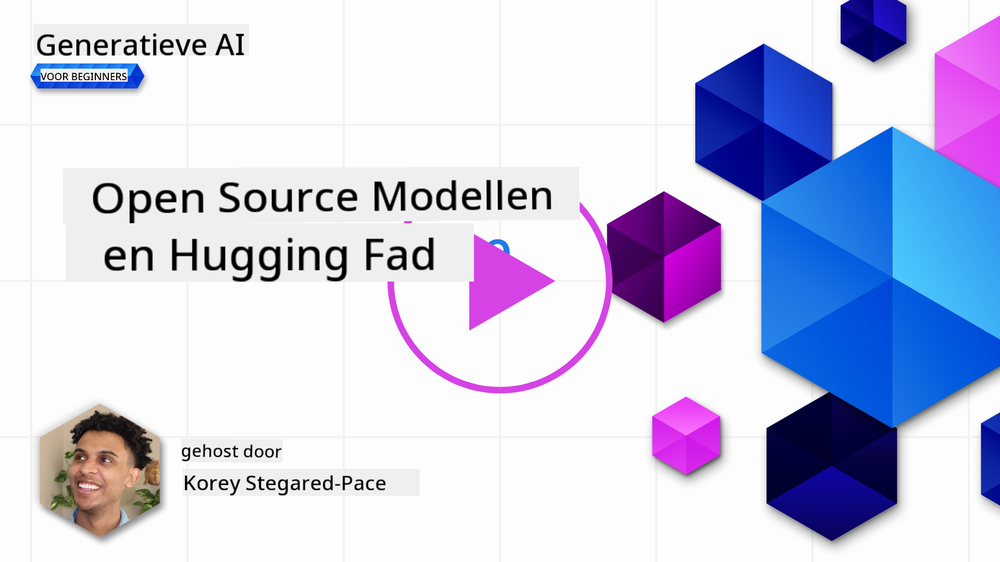
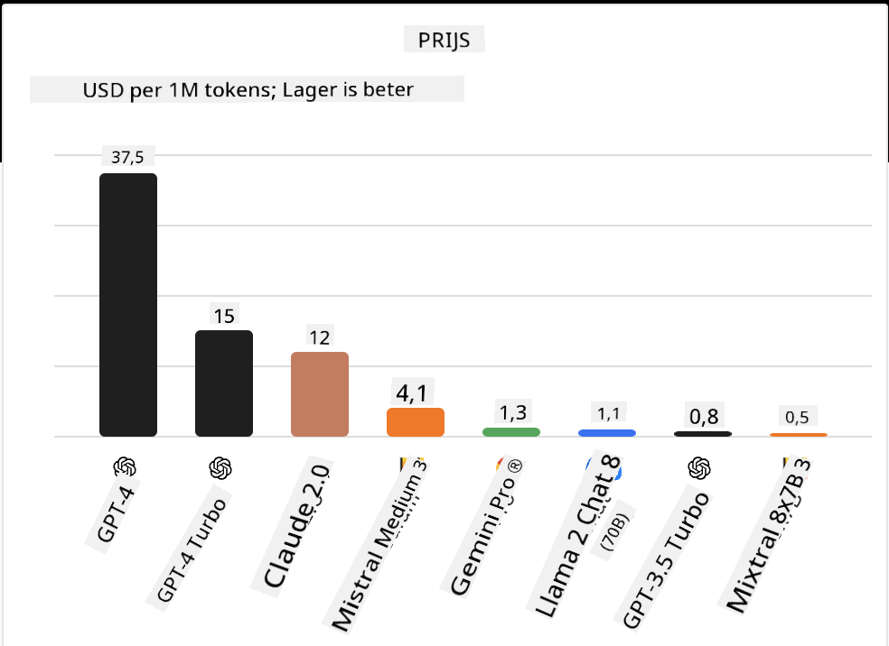

<!--
CO_OP_TRANSLATOR_METADATA:
{
  "original_hash": "0bba96e53ab841d99db731892a51fab8",
  "translation_date": "2025-07-09T17:11:51+00:00",
  "source_file": "16-open-source-models/README.md",
  "language_code": "nl"
}
-->

## Introductie

De wereld van open-source LLM's is spannend en voortdurend in ontwikkeling. Deze les biedt een diepgaande blik op open source modellen. Als je op zoek bent naar informatie over hoe propriëtaire modellen zich verhouden tot open source modellen, ga dan naar de ["Exploring and Comparing Different LLMs" les](../02-exploring-and-comparing-different-llms/README.md?WT.mc_id=academic-105485-koreyst). Deze les behandelt ook het onderwerp fine-tuning, maar een uitgebreidere uitleg vind je in de ["Fine-Tuning LLMs" les](../18-fine-tuning/README.md?WT.mc_id=academic-105485-koreyst).

## Leerdoelen

- Inzicht krijgen in open source modellen  
- Begrijpen van de voordelen van werken met open source modellen  
- Verkennen van de open modellen die beschikbaar zijn op Hugging Face en Azure AI Studio  

## Wat zijn Open Source Modellen?

Open source software heeft een cruciale rol gespeeld in de groei van technologie in diverse vakgebieden. De Open Source Initiative (OSI) heeft [10 criteria voor software](https://web.archive.org/web/20241126001143/https://opensource.org/osd?WT.mc_id=academic-105485-koreyst) opgesteld om als open source te worden geclassificeerd. De broncode moet openlijk gedeeld worden onder een door OSI goedgekeurde licentie.

Hoewel de ontwikkeling van LLM's vergelijkbare elementen heeft met softwareontwikkeling, is het proces niet precies hetzelfde. Dit heeft geleid tot veel discussie binnen de community over de definitie van open source in de context van LLM's. Voor een model om te voldoen aan de traditionele definitie van open source, moet de volgende informatie publiekelijk beschikbaar zijn:

- Datasets die gebruikt zijn om het model te trainen.  
- Volledige modelgewichten als onderdeel van de training.  
- De evaluatiecode.  
- De fine-tuning code.  
- Volledige modelgewichten en trainingsstatistieken.  

Er zijn momenteel slechts enkele modellen die aan deze criteria voldoen. Het [OLMo-model, gemaakt door het Allen Institute for Artificial Intelligence (AllenAI)](https://huggingface.co/allenai/OLMo-7B?WT.mc_id=academic-105485-koreyst), is er één die in deze categorie past.

Voor deze les zullen we de modellen voortaan "open modellen" noemen, omdat ze mogelijk niet volledig aan bovenstaande criteria voldoen op het moment van schrijven.

## Voordelen van Open Modellen

**Zeer aanpasbaar** – Omdat open modellen worden uitgebracht met gedetailleerde trainingsinformatie, kunnen onderzoekers en ontwikkelaars de interne werking van het model aanpassen. Dit maakt het mogelijk om zeer gespecialiseerde modellen te creëren die zijn afgestemd op een specifieke taak of studiegebied. Voorbeelden hiervan zijn codegeneratie, wiskundige bewerkingen en biologie.

**Kosten** – De kosten per token voor het gebruik en inzetten van deze modellen zijn lager dan die van propriëtaire modellen. Bij het bouwen van Generative AI-toepassingen is het belangrijk om de verhouding tussen prestaties en prijs te bekijken voor jouw specifieke gebruikssituatie.

  
Bron: Artificial Analysis

**Flexibiliteit** – Werken met open modellen geeft je de vrijheid om verschillende modellen te gebruiken of te combineren. Een voorbeeld hiervan zijn de [HuggingChat Assistants](https://huggingface.co/chat?WT.mc_id=academic-105485-koreyst), waarbij een gebruiker het model direct in de gebruikersinterface kan kiezen:

## Verkennen van Verschillende Open Modellen

### Llama 2

[LLama2](https://huggingface.co/meta-llama?WT.mc_id=academic-105485-koreyst), ontwikkeld door Meta, is een open model dat geoptimaliseerd is voor chat-gebaseerde toepassingen. Dit komt door de fine-tuning methode, waarbij veel dialogen en menselijke feedback zijn gebruikt. Hierdoor levert het model resultaten die beter aansluiten bij menselijke verwachtingen, wat zorgt voor een betere gebruikerservaring.

Enkele voorbeelden van fine-tuned versies van Llama zijn [Japanese Llama](https://huggingface.co/elyza/ELYZA-japanese-Llama-2-7b?WT.mc_id=academic-105485-koreyst), gespecialiseerd in Japans, en [Llama Pro](https://huggingface.co/TencentARC/LLaMA-Pro-8B?WT.mc_id=academic-105485-koreyst), een verbeterde versie van het basismodel.

### Mistral

[Mistral](https://huggingface.co/mistralai?WT.mc_id=academic-105485-koreyst) is een open model met een sterke focus op hoge prestaties en efficiëntie. Het gebruikt de Mixture-of-Experts aanpak, waarbij een groep gespecialiseerde expertmodellen wordt gecombineerd in één systeem. Afhankelijk van de input worden bepaalde modellen geselecteerd om te worden gebruikt. Dit maakt de berekeningen effectiever, omdat modellen alleen de inputs behandelen waarin ze gespecialiseerd zijn.

Voorbeelden van fine-tuned versies van Mistral zijn [BioMistral](https://huggingface.co/BioMistral/BioMistral-7B?text=Mon+nom+est+Thomas+et+mon+principal?WT.mc_id=academic-105485-koreyst), gericht op de medische sector, en [OpenMath Mistral](https://huggingface.co/nvidia/OpenMath-Mistral-7B-v0.1-hf?WT.mc_id=academic-105485-koreyst), dat wiskundige berekeningen uitvoert.

### Falcon

[Falcon](https://huggingface.co/tiiuae?WT.mc_id=academic-105485-koreyst) is een LLM ontwikkeld door het Technology Innovation Institute (**TII**). De Falcon-40B is getraind met 40 miljard parameters en presteert beter dan GPT-3 met een lager rekenbudget. Dit komt door het gebruik van het FlashAttention-algoritme en multiquery attention, waardoor het geheugengebruik tijdens inferentie wordt verminderd. Door deze kortere inferentietijd is de Falcon-40B geschikt voor chattoepassingen.

Voorbeelden van fine-tuned versies van Falcon zijn de [OpenAssistant](https://huggingface.co/OpenAssistant/falcon-40b-sft-top1-560?WT.mc_id=academic-105485-koreyst), een assistent gebouwd op open modellen, en [GPT4ALL](https://huggingface.co/nomic-ai/gpt4all-falcon?WT.mc_id=academic-105485-koreyst), dat betere prestaties levert dan het basismodel.

## Hoe te Kiezen

Er is geen eenduidig antwoord voor het kiezen van een open model. Een goed startpunt is de filterfunctie op taak in Azure AI Studio. Dit helpt je te begrijpen voor welke taken het model getraind is. Hugging Face onderhoudt ook een LLM Leaderboard waarop de best presterende modellen worden getoond op basis van bepaalde metrics.

Als je LLM's wilt vergelijken over verschillende types, is [Artificial Analysis](https://artificialanalysis.ai/?WT.mc_id=academic-105485-koreyst) een andere waardevolle bron:

  
Bron: Artificial Analysis

Als je aan een specifieke use case werkt, kan het zoeken naar fine-tuned versies die gericht zijn op hetzelfde gebied effectief zijn. Experimenteren met meerdere open modellen om te zien hoe ze presteren volgens jouw en de verwachtingen van je gebruikers is ook een goede aanpak.

## Volgende Stappen

Het beste van open modellen is dat je er snel mee aan de slag kunt. Bekijk de [Azure AI Studio Model Catalog](https://ai.azure.com?WT.mc_id=academic-105485-koreyst), waarin een specifieke Hugging Face-collectie met de modellen die we hier besproken hebben, te vinden is.

## Leren stopt hier niet, ga door met de reis

Na het voltooien van deze les, bekijk onze [Generative AI Learning collection](https://aka.ms/genai-collection?WT.mc_id=academic-105485-koreyst) om je kennis van Generative AI verder te verdiepen!

**Disclaimer**:  
Dit document is vertaald met behulp van de AI-vertalingsdienst [Co-op Translator](https://github.com/Azure/co-op-translator). Hoewel we streven naar nauwkeurigheid, dient u er rekening mee te houden dat geautomatiseerde vertalingen fouten of onnauwkeurigheden kunnen bevatten. Het originele document in de oorspronkelijke taal moet als de gezaghebbende bron worden beschouwd. Voor cruciale informatie wordt professionele menselijke vertaling aanbevolen. Wij zijn niet aansprakelijk voor eventuele misverstanden of verkeerde interpretaties die voortvloeien uit het gebruik van deze vertaling.