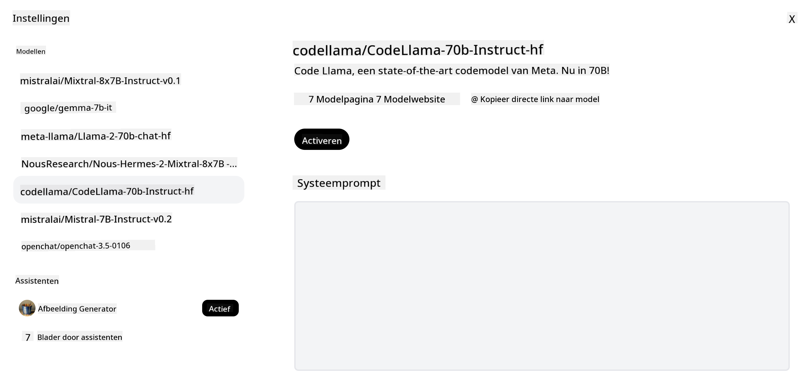
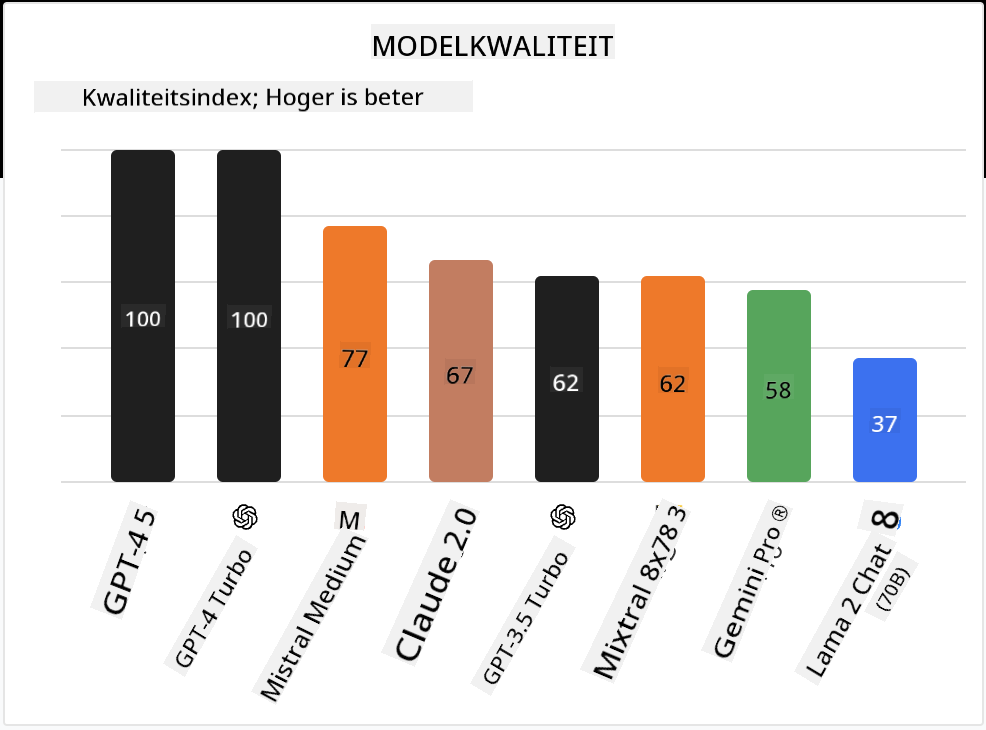

<!--
CO_OP_TRANSLATOR_METADATA:
{
  "original_hash": "0bba96e53ab841d99db731892a51fab8",
  "translation_date": "2025-05-20T06:58:42+00:00",
  "source_file": "16-open-source-models/README.md",
  "language_code": "nl"
}
-->

## Introductie

De wereld van open-source LLMs is spannend en voortdurend in ontwikkeling. Deze les heeft als doel een diepgaand inzicht te bieden in open source modellen. Als je op zoek bent naar informatie over hoe eigen modellen zich verhouden tot open source modellen, ga dan naar de les ["Exploring and Comparing Different LLMs"](../02-exploring-and-comparing-different-llms/README.md?WT.mc_id=academic-105485-koreyst). Deze les zal ook het onderwerp fine-tuning behandelen, maar een meer gedetailleerde uitleg is te vinden in de les ["Fine-Tuning LLMs"](../18-fine-tuning/README.md?WT.mc_id=academic-105485-koreyst).

## Leerdoelen

- Verkrijg inzicht in open source modellen
- Begrijp de voordelen van werken met open source modellen
- Verken de open modellen beschikbaar op Hugging Face en de Azure AI Studio

## Wat zijn Open Source Modellen?

Open source software heeft een cruciale rol gespeeld in de groei van technologie in verschillende gebieden. De Open Source Initiative (OSI) heeft [10 criteria voor software](https://web.archive.org/web/20241126001143/https://opensource.org/osd?WT.mc_id=academic-105485-koreyst) gedefinieerd om als open source te worden geclassificeerd. De broncode moet openlijk worden gedeeld onder een licentie goedgekeurd door de OSI.

Hoewel de ontwikkeling van LLMs vergelijkbare elementen heeft met het ontwikkelen van software, is het proces niet precies hetzelfde. Dit heeft veel discussie in de gemeenschap gebracht over de definitie van open source in de context van LLMs. Voor een model om te voldoen aan de traditionele definitie van open source, moet de volgende informatie openbaar beschikbaar zijn:

- Databases gebruikt om het model te trainen.
- Volledige modelgewichten als onderdeel van de training.
- De evaluatiecode.
- De fine-tuning code.
- Volledige modelgewichten en trainingsstatistieken.

Er zijn momenteel slechts enkele modellen die aan deze criteria voldoen. Het [OLMo model gemaakt door Allen Institute for Artificial Intelligence (AllenAI)](https://huggingface.co/allenai/OLMo-7B?WT.mc_id=academic-105485-koreyst) is er een die in deze categorie past.

Voor deze les zullen we naar de modellen verwijzen als "open modellen" omdat ze mogelijk niet aan de bovenstaande criteria voldoen op het moment van schrijven.

## Voordelen van Open Modellen

**Zeer Aanpasbaar** - Omdat open modellen worden vrijgegeven met gedetailleerde trainingsinformatie, kunnen onderzoekers en ontwikkelaars de interne structuur van het model aanpassen. Dit maakt het mogelijk om zeer gespecialiseerde modellen te creëren die zijn afgestemd op een specifieke taak of studiegebied. Enkele voorbeelden hiervan zijn codegeneratie, wiskundige bewerkingen en biologie.

**Kosten** - De kosten per token voor het gebruik en implementeren van deze modellen zijn lager dan die van eigen modellen. Bij het bouwen van Generatieve AI-toepassingen moet gekeken worden naar prestaties versus prijs bij het werken met deze modellen voor jouw gebruikssituatie.

Bron: Artificial Analysis

**Flexibiliteit** - Werken met open modellen stelt je in staat flexibel te zijn in het gebruik van verschillende modellen of het combineren ervan. Een voorbeeld hiervan is de [HuggingChat Assistants](https://huggingface.co/chat?WT.mc_id=academic-105485-koreyst) waar een gebruiker het model kan selecteren dat direct in de gebruikersinterface wordt gebruikt:

## Verkenning van Verschillende Open Modellen

### Llama 2

[LLama2](https://huggingface.co/meta-llama?WT.mc_id=academic-105485-koreyst), ontwikkeld door Meta, is een open model dat geoptimaliseerd is voor chat-gebaseerde toepassingen. Dit is te danken aan de fine-tuning methode, die een grote hoeveelheid dialoog en menselijke feedback omvatte. Met deze methode produceert het model meer resultaten die in lijn zijn met menselijke verwachtingen, wat zorgt voor een betere gebruikerservaring.

Enkele voorbeelden van fine-tuned versies van Llama zijn [Japanese Llama](https://huggingface.co/elyza/ELYZA-japanese-Llama-2-7b?WT.mc_id=academic-105485-koreyst), die gespecialiseerd is in Japans, en [Llama Pro](https://huggingface.co/TencentARC/LLaMA-Pro-8B?WT.mc_id=academic-105485-koreyst), een verbeterde versie van het basismodel.

### Mistral

[Mistral](https://huggingface.co/mistralai?WT.mc_id=academic-105485-koreyst) is een open model met een sterke focus op hoge prestaties en efficiëntie. Het gebruikt de Mixture-of-Experts benadering, die een groep gespecialiseerde expertmodellen combineert tot één systeem waarbij, afhankelijk van de input, bepaalde modellen worden geselecteerd om te worden gebruikt. Dit maakt de berekening effectiever omdat modellen alleen de inputs behandelen waarin ze gespecialiseerd zijn.

Enkele voorbeelden van fine-tuned versies van Mistral zijn [BioMistral](https://huggingface.co/BioMistral/BioMistral-7B?text=Mon+nom+est+Thomas+et+mon+principal?WT.mc_id=academic-105485-koreyst), die zich richt op het medische domein, en [OpenMath Mistral](https://huggingface.co/nvidia/OpenMath-Mistral-7B-v0.1-hf?WT.mc_id=academic-105485-koreyst), die wiskundige berekeningen uitvoert.

### Falcon

[Falcon](https://huggingface.co/tiiuae?WT.mc_id=academic-105485-koreyst) is een LLM gecreëerd door het Technology Innovation Institute (**TII**). De Falcon-40B werd getraind op 40 miljard parameters, wat heeft aangetoond beter te presteren dan GPT-3 met een kleiner rekenbudget. Dit is te danken aan het gebruik van het FlashAttention algoritme en multiquery aandacht, waardoor het de geheugeneisen tijdens inferentie kan verminderen. Met deze verminderde inferentietijd is de Falcon-40B geschikt voor chattoepassingen.

Enkele voorbeelden van fine-tuned versies van Falcon zijn de [OpenAssistant](https://huggingface.co/OpenAssistant/falcon-40b-sft-top1-560?WT.mc_id=academic-105485-koreyst), een assistent gebouwd op open modellen, en [GPT4ALL](https://huggingface.co/nomic-ai/gpt4all-falcon?WT.mc_id=academic-105485-koreyst), die hogere prestaties levert dan het basismodel.

## Hoe te Kiezen

Er is geen eenduidig antwoord voor het kiezen van een open model. Een goede plek om te beginnen is door gebruik te maken van de Azure AI Studio's filter op taak functie. Dit zal je helpen te begrijpen voor welke soorten taken het model is getraind. Hugging Face onderhoudt ook een LLM Leaderboard dat je de best presterende modellen laat zien op basis van bepaalde metrics.

Als je LLMs wilt vergelijken over de verschillende types, is [Artificial Analysis](https://artificialanalysis.ai/?WT.mc_id=academic-105485-koreyst) een andere geweldige bron:

Bron: Artifical Analysis

Als je werkt aan een specifieke gebruikssituatie, kan het effectief zijn om te zoeken naar fine-tuned versies die zich richten op hetzelfde gebied. Experimenteren met meerdere open modellen om te zien hoe ze presteren volgens jouw en de verwachtingen van je gebruikers is een andere goede praktijk.

## Volgende Stappen

Het beste van open modellen is dat je er vrij snel mee aan de slag kunt. Bekijk de [Azure AI Studio Model Catalog](https://ai.azure.com?WT.mc_id=academic-105485-koreyst), die een specifieke Hugging Face collectie bevat met de modellen die we hier hebben besproken.

## Leren stopt hier niet, ga verder met de Reis

Na het voltooien van deze les, bekijk onze [Generative AI Learning collectie](https://aka.ms/genai-collection?WT.mc_id=academic-105485-koreyst) om je Generative AI kennis verder te vergroten!

**Disclaimer**:  
Dit document is vertaald met behulp van de AI-vertalingsdienst [Co-op Translator](https://github.com/Azure/co-op-translator). Hoewel we ons best doen voor nauwkeurigheid, dient u zich ervan bewust te zijn dat geautomatiseerde vertalingen fouten of onnauwkeurigheden kunnen bevatten. Het originele document in de oorspronkelijke taal moet worden beschouwd als de gezaghebbende bron. Voor cruciale informatie wordt professionele menselijke vertaling aanbevolen. Wij zijn niet aansprakelijk voor eventuele misverstanden of verkeerde interpretaties die voortvloeien uit het gebruik van deze vertaling.