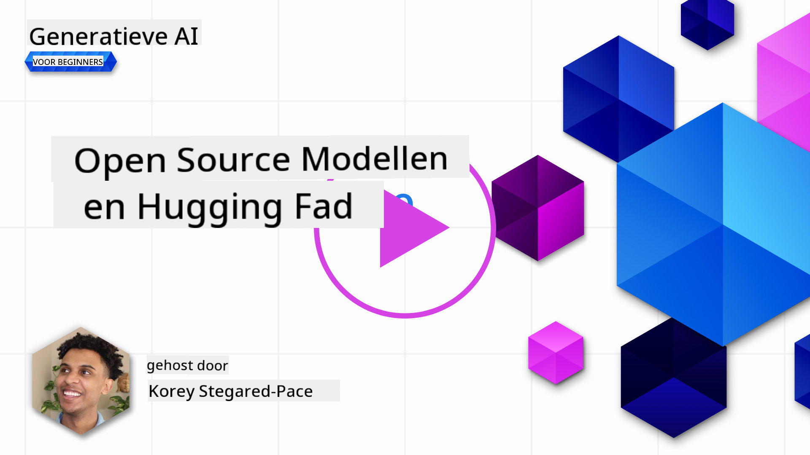
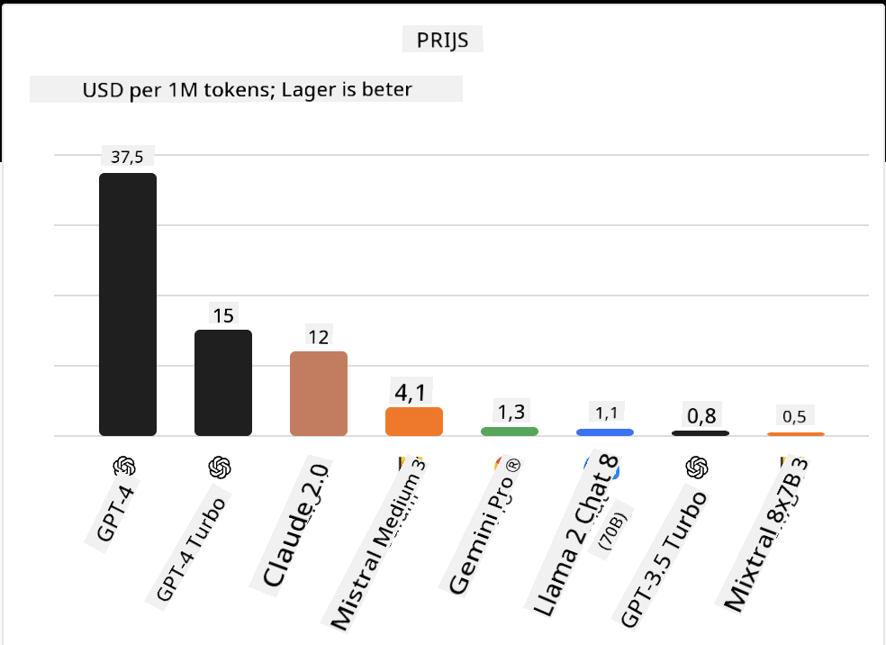
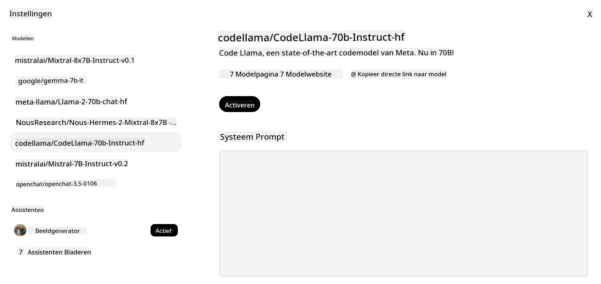
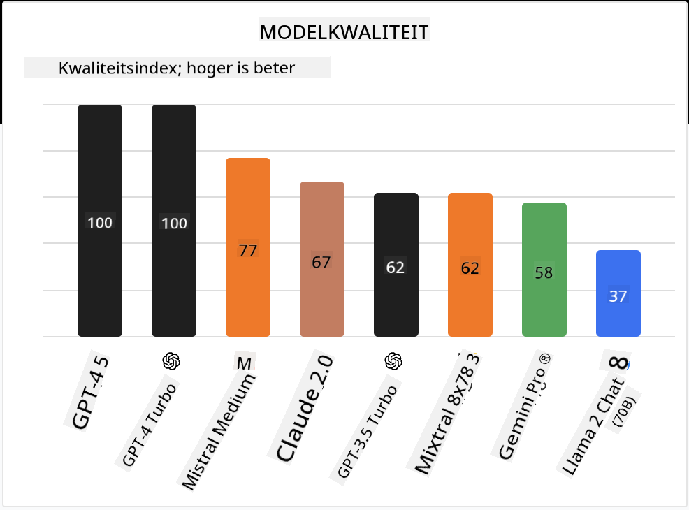

<!--
CO_OP_TRANSLATOR_METADATA:
{
  "original_hash": "0bba96e53ab841d99db731892a51fab8",
  "translation_date": "2025-06-25T23:59:17+00:00",
  "source_file": "16-open-source-models/README.md",
  "language_code": "nl"
}
-->

## Introductie

De wereld van open-source LLMs is spannend en voortdurend in ontwikkeling. Deze les heeft als doel een diepgaande blik te geven op open source modellen. Als je op zoek bent naar informatie over hoe eigendomsmodellen zich verhouden tot open source modellen, ga dan naar de les ["Exploring and Comparing Different LLMs"](../02-exploring-and-comparing-different-llms/README.md?WT.mc_id=academic-105485-koreyst). Deze les zal ook het onderwerp fine-tuning behandelen, maar een meer gedetailleerde uitleg is te vinden in de les ["Fine-Tuning LLMs"](../18-fine-tuning/README.md?WT.mc_id=academic-105485-koreyst).

## Leerdoelen

- Krijg inzicht in open source modellen
- Begrijp de voordelen van werken met open source modellen
- Verken de open modellen beschikbaar op Hugging Face en de Azure AI Studio

## Wat zijn Open Source Modellen?

Open source software heeft een cruciale rol gespeeld in de groei van technologie in verschillende velden. De Open Source Initiative (OSI) heeft [10 criteria voor software](https://web.archive.org/web/20241126001143/https://opensource.org/osd?WT.mc_id=academic-105485-koreyst) gedefinieerd om als open source te worden geclassificeerd. De broncode moet openlijk worden gedeeld onder een licentie goedgekeurd door de OSI.

Hoewel de ontwikkeling van LLMs vergelijkbare elementen heeft met het ontwikkelen van software, is het proces niet precies hetzelfde. Dit heeft veel discussie in de gemeenschap gebracht over de definitie van open source in de context van LLMs. Voor een model om in lijn te zijn met de traditionele definitie van open source moet de volgende informatie openbaar beschikbaar zijn:

- Datasets die gebruikt zijn om het model te trainen.
- Volledige modelgewichten als onderdeel van de training.
- De evaluatiecode.
- De fine-tuning code.
- Volledige modelgewichten en trainingsstatistieken.

Er zijn momenteel slechts een paar modellen die aan deze criteria voldoen. Het [OLMo model gemaakt door Allen Institute for Artificial Intelligence (AllenAI)](https://huggingface.co/allenai/OLMo-7B?WT.mc_id=academic-105485-koreyst) is er een die in deze categorie past.

Voor deze les zullen we naar de modellen verwijzen als "open modellen" voortaan, omdat ze mogelijk niet aan de bovenstaande criteria voldoen op het moment van schrijven.

## Voordelen van Open Modellen

**Zeer aanpasbaar** - Omdat open modellen worden vrijgegeven met gedetailleerde trainingsinformatie, kunnen onderzoekers en ontwikkelaars de interne werking van het model wijzigen. Dit maakt de creatie van zeer gespecialiseerde modellen mogelijk die zijn afgestemd voor een specifieke taak of studiegebied. Enkele voorbeelden hiervan zijn codegeneratie, wiskundige bewerkingen en biologie.

**Kosten** - De kosten per token voor het gebruiken en implementeren van deze modellen zijn lager dan die van eigendomsmodellen. Bij het bouwen van Generatieve AI-toepassingen moet gekeken worden naar prestaties versus prijs bij het werken met deze modellen voor jouw gebruikssituatie.

Bron: Artificial Analysis

**Flexibiliteit** - Werken met open modellen stelt je in staat flexibel te zijn in termen van het gebruik van verschillende modellen of het combineren ervan. Een voorbeeld hiervan is de [HuggingChat Assistants](https://huggingface.co/chat?WT.mc_id=academic-105485-koreyst) waar een gebruiker het model dat wordt gebruikt direct in de gebruikersinterface kan selecteren:

## Verkennen van Verschillende Open Modellen

### Llama 2

[LLama2](https://huggingface.co/meta-llama?WT.mc_id=academic-105485-koreyst), ontwikkeld door Meta, is een open model dat geoptimaliseerd is voor chatgebaseerde toepassingen. Dit komt door de fine-tuning methode, die een grote hoeveelheid dialoog en menselijke feedback omvatte. Met deze methode produceert het model meer resultaten die in lijn zijn met menselijke verwachtingen, wat zorgt voor een betere gebruikerservaring.

Enkele voorbeelden van fijn afgestemde versies van Llama zijn [Japanese Llama](https://huggingface.co/elyza/ELYZA-japanese-Llama-2-7b?WT.mc_id=academic-105485-koreyst), die gespecialiseerd is in Japans en [Llama Pro](https://huggingface.co/TencentARC/LLaMA-Pro-8B?WT.mc_id=academic-105485-koreyst), wat een verbeterde versie van het basismodel is.

### Mistral

[Mistral](https://huggingface.co/mistralai?WT.mc_id=academic-105485-koreyst) is een open model met een sterke focus op hoge prestaties en efficiëntie. Het gebruikt de Mixture-of-Experts aanpak die een groep gespecialiseerde expertmodellen combineert in één systeem waarbij, afhankelijk van de invoer, bepaalde modellen worden geselecteerd om te worden gebruikt. Dit maakt de berekening effectiever omdat modellen alleen de invoer behandelen waarin ze gespecialiseerd zijn.

Enkele voorbeelden van fijn afgestemde versies van Mistral zijn [BioMistral](https://huggingface.co/BioMistral/BioMistral-7B?text=Mon+nom+est+Thomas+et+mon+principal?WT.mc_id=academic-105485-koreyst), die zich richt op het medische domein en [OpenMath Mistral](https://huggingface.co/nvidia/OpenMath-Mistral-7B-v0.1-hf?WT.mc_id=academic-105485-koreyst), die wiskundige berekeningen uitvoert.

### Falcon

[Falcon](https://huggingface.co/tiiuae?WT.mc_id=academic-105485-koreyst) is een LLM gecreëerd door het Technology Innovation Institute (**TII**). De Falcon-40B werd getraind op 40 miljard parameters, wat heeft aangetoond beter te presteren dan GPT-3 met een kleiner compute budget. Dit komt door het gebruik van het FlashAttention algoritme en multiquery aandacht die het mogelijk maakt om de geheugenvereisten bij inferentietijd te verminderen. Met deze verminderde inferentietijd is de Falcon-40B geschikt voor chattoepassingen.

Enkele voorbeelden van fijn afgestemde versies van Falcon zijn de [OpenAssistant](https://huggingface.co/OpenAssistant/falcon-40b-sft-top1-560?WT.mc_id=academic-105485-koreyst), een assistent gebouwd op open modellen en [GPT4ALL](https://huggingface.co/nomic-ai/gpt4all-falcon?WT.mc_id=academic-105485-koreyst), die hogere prestaties levert dan het basismodel.

## Hoe te Kiezen

Er is geen eenduidig antwoord voor het kiezen van een open model. Een goede plek om te beginnen is door het filteren op taakfunctie van de Azure AI Studio te gebruiken. Dit zal je helpen begrijpen voor welke soorten taken het model is getraind. Hugging Face onderhoudt ook een LLM Leaderboard dat je de best presterende modellen laat zien op basis van bepaalde statistieken.

Wanneer je LLMs wilt vergelijken over de verschillende typen, is [Artificial Analysis](https://artificialanalysis.ai/?WT.mc_id=academic-105485-koreyst) een andere geweldige bron:

Bron: Artifical Analysis

Als je aan een specifieke gebruikssituatie werkt, kan het effectief zijn om te zoeken naar fijn afgestemde versies die zich richten op hetzelfde gebied. Experimenteren met meerdere open modellen om te zien hoe ze presteren volgens jouw en je gebruikers' verwachtingen is een andere goede praktijk.

## Volgende Stappen

Het beste van open modellen is dat je vrij snel aan de slag kunt gaan met werken ermee. Bekijk de [Azure AI Studio Model Catalog](https://ai.azure.com?WT.mc_id=academic-105485-koreyst), waarin een specifieke Hugging Face collectie met deze modellen die we hier hebben besproken wordt weergegeven.

## Leren stopt hier niet, ga verder met de Reis

Na het voltooien van deze les, bekijk onze [Generative AI Learning collectie](https://aka.ms/genai-collection?WT.mc_id=academic-105485-koreyst) om je kennis van Generatieve AI verder te vergroten!

**Disclaimer**:  
Dit document is vertaald met behulp van de AI-vertalingsservice [Co-op Translator](https://github.com/Azure/co-op-translator). Hoewel we ons best doen voor nauwkeurigheid, dient u zich ervan bewust te zijn dat geautomatiseerde vertalingen fouten of onnauwkeurigheden kunnen bevatten. Het originele document in zijn oorspronkelijke taal moet worden beschouwd als de gezaghebbende bron. Voor kritische informatie wordt professionele menselijke vertaling aanbevolen. Wij zijn niet aansprakelijk voor eventuele misverstanden of verkeerde interpretaties die voortvloeien uit het gebruik van deze vertaling.