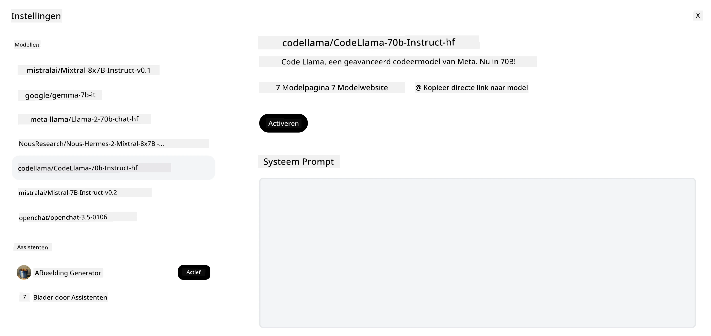
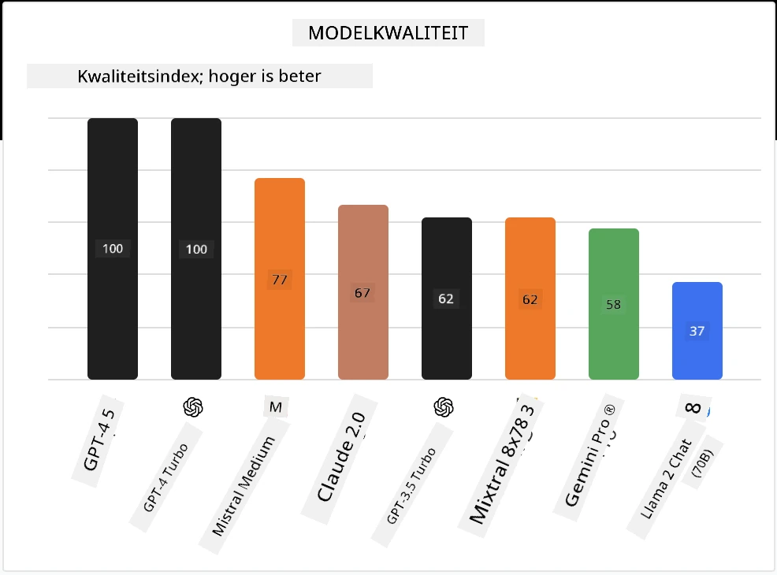

## Introductie

De wereld van open-source LLM's is spannend en voortdurend in ontwikkeling. Deze les heeft als doel om een diepgaand inzicht te geven in open-source modellen. Als je informatie zoekt over hoe propriëtaire modellen zich verhouden tot open-source modellen, ga dan naar de ["Exploring and Comparing Different LLMs" les](../02-exploring-and-comparing-different-llms/README.md?WT.mc_id=academic-105485-koreyst). Deze les behandelt ook het onderwerp fine-tuning, maar een meer gedetailleerde uitleg is te vinden in de ["Fine-Tuning LLMs" les](../18-fine-tuning/README.md?WT.mc_id=academic-105485-koreyst).

## Leerdoelen

- Krijg inzicht in open source Modellen
- Begrijp de voordelen van het werken met open source Modellen
- Verken de open modellen beschikbaar op Hugging Face en de Microsoft Foundry modelcatalogus

## Wat zijn Open Source Modellen?

Open source software heeft een cruciale rol gespeeld in de groei van technologie in verschillende velden. De Open Source Initiative (OSI) heeft [10 criteria voor software](https://web.archive.org/web/20241126001143/https://opensource.org/osd?WT.mc_id=academic-105485-koreyst) vastgesteld om als open source te worden geclassificeerd. De broncode moet openlijk gedeeld worden onder een door de OSI goedgekeurde licentie.

Hoewel de ontwikkeling van LLMs vergelijkbare elementen bevat als softwareontwikkeling, is het proces niet exact hetzelfde. Dit heeft veel discussie opgeleverd binnen de gemeenschap over de definitie van open source in de context van LLMs. Voor een model om te voldoen aan de traditionele definitie van open source, moet de volgende informatie openbaar beschikbaar zijn:

- Datasets gebruikt voor het trainen van het model.
- Volledige modelgewichten als onderdeel van de training.
- De evaluatiecode.
- De fine-tuning code.
- Volledige modelgewichten en trainingsstatistieken.

Er zijn momenteel maar enkele modellen die aan deze criteria voldoen. Het [OLMo model gecreëerd door Allen Institute for Artificial Intelligence (AllenAI)](https://huggingface.co/allenai/OLMo-7B?WT.mc_id=academic-105485-koreyst) is één die binnen deze categorie valt.

Voor deze les zullen we de modellen "open modellen" noemen, omdat ze op het moment van schrijven mogelijk niet volledig voldoen aan de bovenstaande criteria.

## Voordelen van Open Modellen

**Zeer Aanpasbaar** - Omdat open modellen worden uitgebracht met gedetailleerde trainingsinformatie, kunnen onderzoekers en ontwikkelaars de interne structuur van het model wijzigen. Dit maakt het mogelijk om zeer gespecialiseerde modellen te maken die zijn fijn afgestemd voor een specifieke taak of studiegebied. Enkele voorbeelden hiervan zijn codegeneratie, wiskundige bewerkingen en biologie.

**Kosten** - De kosten per token voor het gebruiken en inzetten van deze modellen liggen lager dan die van propriëtaire modellen. Bij het bouwen van Generatieve AI applicaties moet je letten op prestaties versus prijs wanneer je met deze modellen werkt voor jouw gebruikssituatie.

Bron: Artificial Analysis

**Flexibiliteit** - Werken met open modellen stelt je in staat om flexibel te zijn in het gebruik van verschillende modellen of het combineren ervan. Een voorbeeld hiervan zijn de [HuggingChat Assistenten](https://huggingface.co/chat?WT.mc_id=academic-105485-koreyst) waarbij een gebruiker direct in de gebruikersinterface het gebruikte model kan kiezen:

## Verkennen van Verschillende Open Modellen

### Llama 2

[Llama2](https://huggingface.co/meta-llama?WT.mc_id=academic-105485-koreyst), ontwikkeld door Meta, is een open model dat geoptimaliseerd is voor chat-gebaseerde applicaties. Dit komt door de fine-tuning methode die een grote hoeveelheid dialoog en menselijke feedback bevatte. Met deze methode levert het model resultaten die beter aansluiten bij menselijke verwachtingen, wat zorgt voor een betere gebruikerservaring.

Enkele voorbeelden van fijn afgestemde versies van Llama zijn [Japanese Llama](https://huggingface.co/elyza/ELYZA-japanese-Llama-2-7b?WT.mc_id=academic-105485-koreyst), gespecialiseerd in Japans, en [Llama Pro](https://huggingface.co/TencentARC/LLaMA-Pro-8B?WT.mc_id=academic-105485-koreyst), een verbeterde versie van het basismodel.

### Mistral

[Mistral](https://huggingface.co/mistralai?WT.mc_id=academic-105485-koreyst) is een open model met een sterke focus op hoge prestaties en efficiëntie. Het gebruikt de Mixture-of-Experts aanpak die een groep gespecialiseerde expertmodellen combineert in één systeem, waarbij afhankelijk van de input bepaalde modellen worden geselecteerd om gebruikt te worden. Dit maakt de berekening effectiever omdat de modellen alleen de invoer verwerken waar ze in gespecialiseerd zijn.

Enkele voorbeelden van fijn afgestemde versies van Mistral zijn [BioMistral](https://huggingface.co/BioMistral/BioMistral-7B?text=Mon+nom+est+Thomas+et+mon+principal?WT.mc_id=academic-105485-koreyst), gericht op het medische domein, en [OpenMath Mistral](https://huggingface.co/nvidia/OpenMath-Mistral-7B-v0.1-hf?WT.mc_id=academic-105485-koreyst), dat wiskundige berekeningen uitvoert.

### Falcon

[Falcon](https://huggingface.co/tiiuae?WT.mc_id=academic-105485-koreyst) is een LLM gemaakt door het Technology Innovation Institute (**TII**). De Falcon-40B werd getraind met 40 miljard parameters en heeft aangetoond beter te presteren dan GPT-3 met een lager rekenbudget. Dit komt door het gebruik van het FlashAttention-algoritme en multiquery-attentie, die het mogelijk maken de geheugeneisen tijdens inferentie te verminderen. Dankzij deze verkorte inferentietijd is de Falcon-40B geschikt voor chatapplicaties.

Enkele voorbeelden van fijn afgestemde versies van Falcon zijn de [OpenAssistant](https://huggingface.co/OpenAssistant/falcon-40b-sft-top1-560?WT.mc_id=academic-105485-koreyst), een assistent gebouwd op open modellen, en [GPT4ALL](https://huggingface.co/nomic-ai/gpt4all-falcon?WT.mc_id=academic-105485-koreyst), die betere prestaties levert dan het basismodel.

## Hoe te Kiezen

Er is geen eenduidig antwoord bij het kiezen van een open model. Een goed beginpunt is de filter-op-taak functie in de Microsoft Foundry modelcatalogus. Dit helpt je te begrijpen voor welke soorten taken het model is getraind. Hugging Face onderhoudt ook een LLM Leaderboard dat de best presterende modellen toont op basis van bepaalde metrics.

Als je LLMs van verschillende types wilt vergelijken, is [Artificial Analysis](https://artificialanalysis.ai/?WT.mc_id=academic-105485-koreyst) een andere uitstekende bron:

Bron: Artificial Analysis

Als je aan een specifieke use case werkt, kan het effectief zijn te zoeken naar fijn afgestemde versies die zich op hetzelfde gebied richten. Experimenteren met meerdere open modellen om te zien hoe ze presteren volgens jouw en de verwachtingen van je gebruikers is ook een goede praktijk.

## Volgende Stappen

Het beste van open modellen is dat je er vrij snel mee aan de slag kunt. Bekijk de [Microsoft Foundry modelcatalogus](https://ai.azure.com?WT.mc_id=academic-105485-koreyst), waarin een specifieke Hugging Face collectie met de hier besproken modellen te vinden is.

## Leren stopt hier niet, ga door met de Reis

Na het voltooien van deze les, bekijk onze [Generative AI Leercollectie](https://aka.ms/genai-collection?WT.mc_id=academic-105485-koreyst) om je kennis over Generative AI verder te vergroten!

---

<!-- CO-OP TRANSLATOR DISCLAIMER START -->
**Disclaimer**:
Dit document is vertaald met behulp van de AI vertaaldienst [Co-op Translator](https://github.com/Azure/co-op-translator). Hoewel we streven naar nauwkeurigheid, dient u er rekening mee te houden dat geautomatiseerde vertalingen fouten of onnauwkeurigheden kunnen bevatten. Het originele document in de oorspronkelijke taal moet worden beschouwd als de gezaghebbende bron. Voor kritieke informatie wordt professionele menselijke vertaling aanbevolen. Wij zijn niet aansprakelijk voor eventuele misverstanden of verkeerde interpretaties die voortvloeien uit het gebruik van deze vertaling.
<!-- CO-OP TRANSLATOR DISCLAIMER END -->