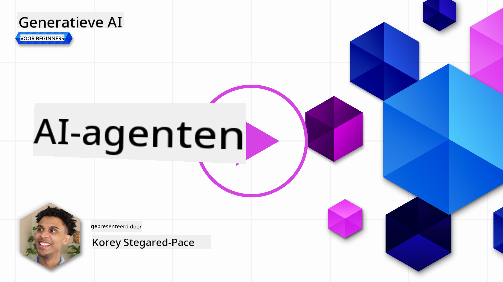
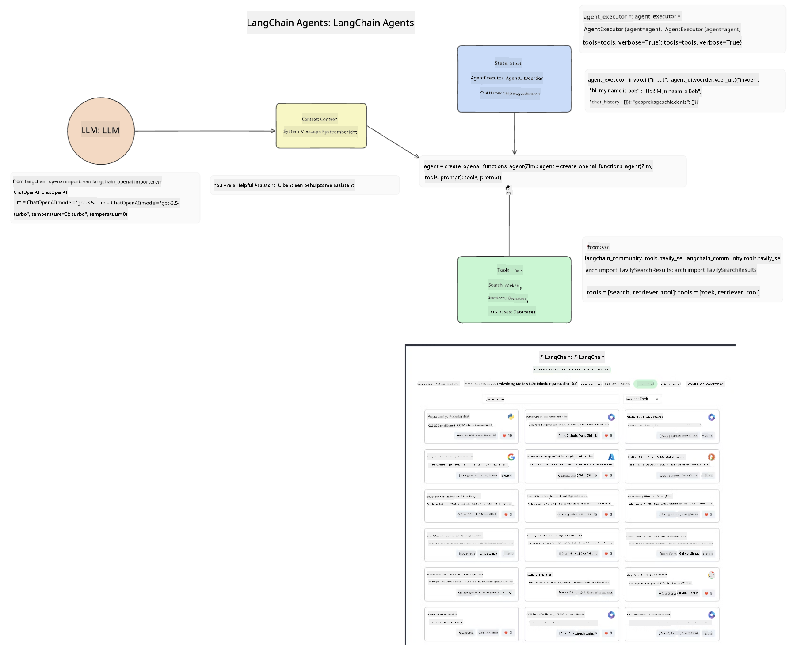
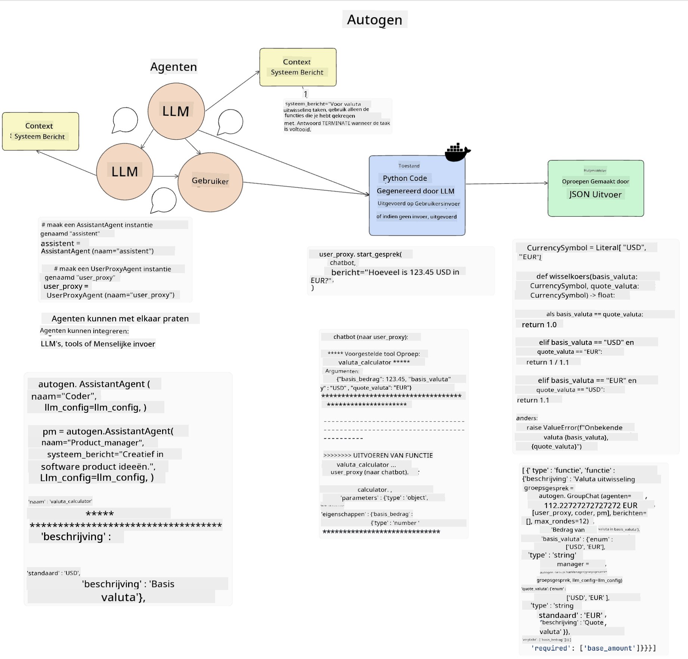
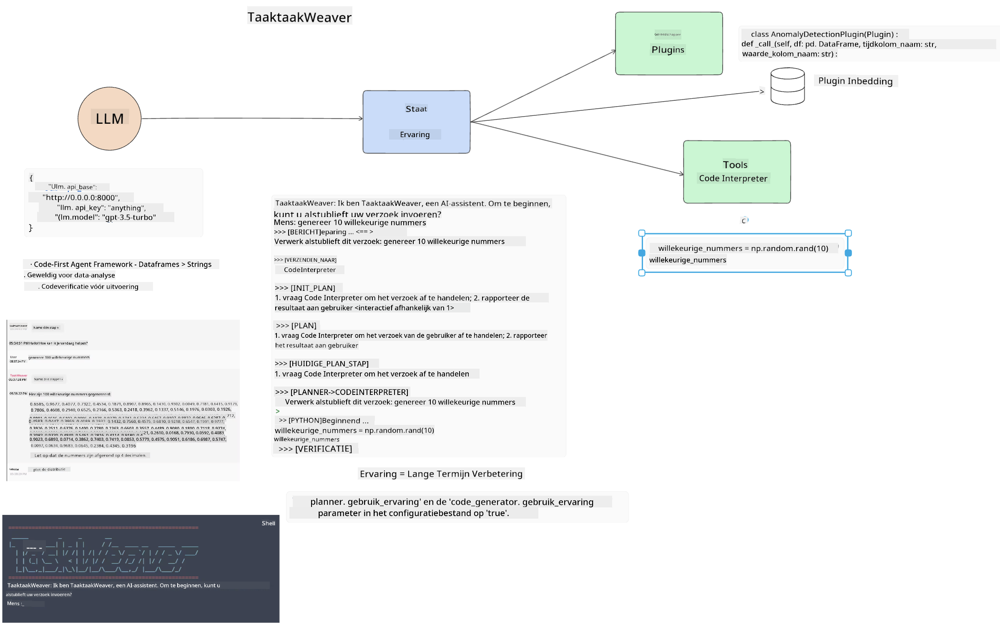
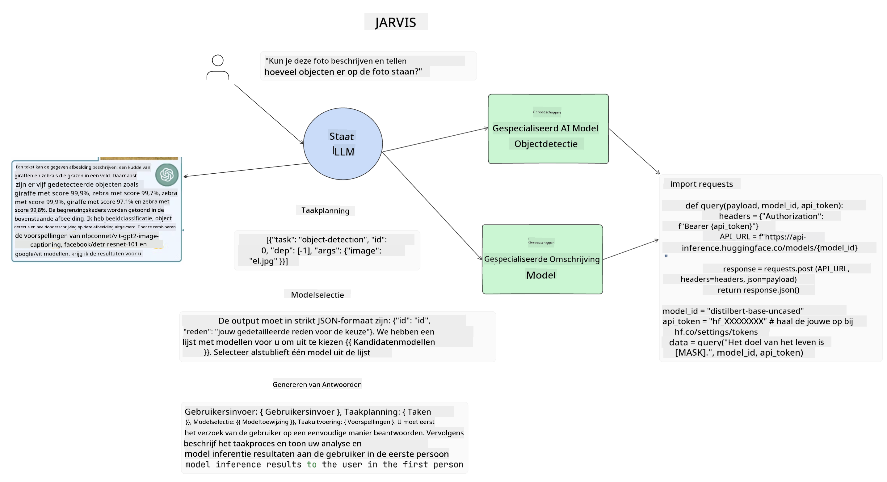

<!--
CO_OP_TRANSLATOR_METADATA:
{
  "original_hash": "11f03c81f190d9cbafd0f977dcbede6c",
  "translation_date": "2025-05-20T07:27:00+00:00",
  "source_file": "17-ai-agents/README.md",
  "language_code": "nl"
}
-->
[](https://aka.ms/gen-ai-lesson17-gh?WT.mc_id=academic-105485-koreyst)

## Introductie

AI Agents vertegenwoordigen een spannende ontwikkeling in Generatieve AI, waardoor Grote Taalmodellen (LLMs) kunnen evolueren van assistenten naar agents die acties kunnen ondernemen. AI Agent frameworks stellen ontwikkelaars in staat applicaties te maken die LLMs toegang geven tot tools en statusbeheer. Deze frameworks verbeteren ook de zichtbaarheid, waardoor gebruikers en ontwikkelaars de acties die door LLMs gepland zijn kunnen monitoren, wat de ervaringsbeheer verbetert.

De les zal de volgende gebieden behandelen:

- Begrijpen wat een AI Agent is - Wat is precies een AI Agent?
- Verkennen van vier verschillende AI Agent Frameworks - Wat maakt ze uniek?
- Toepassen van deze AI Agents op verschillende use cases - Wanneer moeten we AI Agents gebruiken?

## Leerdoelen

Na het volgen van deze les kun je:

- Uitleggen wat AI Agents zijn en hoe ze kunnen worden gebruikt.
- Een begrip hebben van de verschillen tussen enkele populaire AI Agent Frameworks, en hoe ze verschillen.
- Begrijpen hoe AI Agents functioneren om applicaties met hen te bouwen.

## Wat Zijn AI Agents?

AI Agents zijn een zeer spannend veld in de wereld van Generatieve AI. Met deze opwinding komt soms een verwarring van termen en hun toepassing. Om dingen eenvoudig en inclusief te houden voor de meeste tools die verwijzen naar AI Agents, gaan we deze definitie gebruiken:

AI Agents stellen Grote Taalmodellen (LLMs) in staat taken uit te voeren door hen toegang te geven tot een **status** en **tools**.


Laten we deze termen definiëren:

**Grote Taalmodellen** - Dit zijn de modellen die gedurende deze cursus worden genoemd, zoals GPT-3.5, GPT-4, Llama-2, enz.

**Status** - Dit verwijst naar de context waarin de LLM werkt. De LLM gebruikt de context van zijn eerdere acties en de huidige context, wat zijn besluitvorming voor volgende acties leidt. AI Agent Frameworks stellen ontwikkelaars in staat deze context gemakkelijker te onderhouden.

**Tools** - Om de taak die de gebruiker heeft gevraagd en die de LLM heeft gepland uit te voeren, heeft de LLM toegang nodig tot tools. Enkele voorbeelden van tools kunnen een database, een API, een externe applicatie of zelfs een andere LLM zijn!

Hopelijk geven deze definities je een goede basis voor de toekomst terwijl we kijken naar hoe ze worden geïmplementeerd. Laten we een paar verschillende AI Agent frameworks verkennen:

## LangChain Agents

[LangChain Agents](https://python.langchain.com/docs/how_to/#agents?WT.mc_id=academic-105485-koreyst) is een implementatie van de definities die we hierboven hebben gegeven.

Om de **status** te beheren, gebruikt het een ingebouwde functie genaamd de `AgentExecutor`. Deze accepteert de gedefinieerde `agent` en de `tools` die beschikbaar zijn.

De `Agent Executor` slaat ook de chatgeschiedenis op om de context van de chat te bieden.



LangChain biedt een [catalogus van tools](https://integrations.langchain.com/tools?WT.mc_id=academic-105485-koreyst) die in je applicatie kunnen worden geïmporteerd waarin de LLM toegang kan krijgen. Deze zijn gemaakt door de gemeenschap en door het LangChain-team.

Je kunt dan deze tools definiëren en ze doorgeven aan de `Agent Executor`.

Zichtbaarheid is een ander belangrijk aspect bij het praten over AI Agents. Het is belangrijk voor applicatieontwikkelaars om te begrijpen welke tool de LLM gebruikt en waarom. Hiervoor heeft het team bij LangChain LangSmith ontwikkeld.

## AutoGen

Het volgende AI Agent framework dat we zullen bespreken is [AutoGen](https://microsoft.github.io/autogen/?WT.mc_id=academic-105485-koreyst). De hoofd focus van AutoGen is gesprekken. Agents zijn zowel **gespreksvaardig** als **aanpasbaar**.

**Gespreksvaardig -** LLMs kunnen een gesprek beginnen en voortzetten met een andere LLM om een taak te voltooien. Dit gebeurt door `AssistantAgents` te creëren en hen een specifieke systeemboodschap te geven.

```python

autogen.AssistantAgent( name="Coder", llm_config=llm_config, ) pm = autogen.AssistantAgent( name="Product_manager", system_message="Creative in software product ideas.", llm_config=llm_config, )

```

**Aanpasbaar** - Agents kunnen niet alleen als LLMs worden gedefinieerd, maar ook als een gebruiker of een tool. Als ontwikkelaar kun je een `UserProxyAgent` definiëren die verantwoordelijk is voor interactie met de gebruiker voor feedback bij het voltooien van een taak. Deze feedback kan de uitvoering van de taak voortzetten of stoppen.

```python
user_proxy = UserProxyAgent(name="user_proxy")
```

### Status en Tools

Om de status te veranderen en beheren, genereert een assistent Agent Python-code om de taak te voltooien.

Hier is een voorbeeld van het proces:



#### LLM Gedefinieerd met een Systeemboodschap

```python
system_message="For weather related tasks, only use the functions you have been provided with. Reply TERMINATE when the task is done."
```

Deze systeemboodschap wijst deze specifieke LLM naar welke functies relevant zijn voor zijn taak. Vergeet niet dat je met AutoGen meerdere gedefinieerde AssistantAgents kunt hebben met verschillende systeemboodschappen.

#### Chat wordt door Gebruiker Gestart

```python
user_proxy.initiate_chat( chatbot, message="I am planning a trip to NYC next week, can you help me pick out what to wear? ", )

```

Deze boodschap van de user_proxy (Mens) is wat het proces van de Agent zal starten om de mogelijke functies te verkennen die hij moet uitvoeren.

#### Functie wordt Uitgevoerd

```bash
chatbot (to user_proxy):

***** Suggested tool Call: get_weather ***** Arguments: {"location":"New York City, NY","time_periond:"7","temperature_unit":"Celsius"} ******************************************************** --------------------------------------------------------------------------------

>>>>>>>> EXECUTING FUNCTION get_weather... user_proxy (to chatbot): ***** Response from calling function "get_weather" ***** 112.22727272727272 EUR ****************************************************************

```

Zodra de initiële chat is verwerkt, zal de Agent de voorgestelde tool sturen om te bellen. In dit geval is het een functie genaamd `get_weather`. Depending on your configuration, this function can be automatically executed and read by the Agent or can be executed based on user input.

You can find a list of [AutoGen code samples](https://microsoft.github.io/autogen/docs/Examples/?WT.mc_id=academic-105485-koreyst) to further explore how to get started building.

## Taskweaver

The next agent framework we will explore is [Taskweaver](https://microsoft.github.io/TaskWeaver/?WT.mc_id=academic-105485-koreyst). It is known as a "code-first" agent because instead of working strictly with `strings` , it can work with DataFrames in Python. This becomes extremely useful for data analysis and generation tasks. This can be things like creating graphs and charts or generating random numbers.

### State and Tools

To manage the state of the conversation, TaskWeaver uses the concept of a `Planner`. The `Planner` is a LLM that takes the request from the users and maps out the tasks that need to be completed to fulfill this request.

To complete the tasks the `Planner` is exposed to the collection of tools called `Plugins`. Dit kunnen Python-klassen zijn of een algemene code-interpreter. Deze plugins worden opgeslagen als embeddings zodat de LLM beter kan zoeken naar de juiste plugin.



Hier is een voorbeeld van een plugin om anomaliedetectie af te handelen:

```python
class AnomalyDetectionPlugin(Plugin): def __call__(self, df: pd.DataFrame, time_col_name: str, value_col_name: str):
```

De code wordt geverifieerd voordat deze wordt uitgevoerd. Een andere functie om context te beheren in Taskweaver is `experience`. Experience allows for the context of a conversation to be stored over to the long term in a YAML file. This can be configured so that the LLM improves over time on certain tasks given that it is exposed to prior conversations.

## JARVIS

The last agent framework we will explore is [JARVIS](https://github.com/microsoft/JARVIS?tab=readme-ov-file?WT.mc_id=academic-105485-koreyst). What makes JARVIS unique is that it uses an LLM to manage the `state` van het gesprek en de `tools`zijn andere AI-modellen. Elk van de AI-modellen zijn gespecialiseerde modellen die bepaalde taken uitvoeren zoals objectdetectie, transcriptie of beeldbeschrijving.



De LLM, zijnde een algemeen doel model, ontvangt het verzoek van de gebruiker en identificeert de specifieke taak en eventuele argumenten/gegevens die nodig zijn om de taak te voltooien.

```python
[{"task": "object-detection", "id": 0, "dep": [-1], "args": {"image": "e1.jpg" }}]
```

De LLM formatteert vervolgens het verzoek op een manier die het gespecialiseerde AI-model kan interpreteren, zoals JSON. Zodra het AI-model zijn voorspelling heeft teruggestuurd op basis van de taak, ontvangt de LLM de reactie.

Als meerdere modellen nodig zijn om de taak te voltooien, zal het ook de reactie van die modellen interpreteren voordat ze worden samengebracht om de reactie aan de gebruiker te genereren.

Het onderstaande voorbeeld laat zien hoe dit zou werken wanneer een gebruiker een beschrijving en telling van de objecten in een afbeelding vraagt:

## Opdracht

Om je leerproces over AI Agents voort te zetten, kun je bouwen met AutoGen:

- Een applicatie die een zakelijke vergadering simuleert met verschillende afdelingen van een educatieve startup.
- Creëer systeemboodschappen die LLMs begeleiden in het begrijpen van verschillende persona's en prioriteiten, en stel de gebruiker in staat een nieuw productidee te presenteren.
- De LLM zou vervolgens vervolgvragen van elke afdeling moeten genereren om de pitch en het productidee te verfijnen en te verbeteren.

## Leren stopt hier niet, ga verder met de Reis

Na het voltooien van deze les, bekijk onze [Generatieve AI Leercollectie](https://aka.ms/genai-collection?WT.mc_id=academic-105485-koreyst) om je kennis van Generatieve AI verder te verbeteren!

**Disclaimer**:  
Dit document is vertaald met behulp van de AI-vertalingsservice [Co-op Translator](https://github.com/Azure/co-op-translator). Hoewel we streven naar nauwkeurigheid, dient u zich ervan bewust te zijn dat geautomatiseerde vertalingen fouten of onnauwkeurigheden kunnen bevatten. Het originele document in zijn oorspronkelijke taal moet worden beschouwd als de gezaghebbende bron. Voor cruciale informatie wordt professionele menselijke vertaling aanbevolen. Wij zijn niet aansprakelijk voor eventuele misverstanden of misinterpretaties die voortvloeien uit het gebruik van deze vertaling.