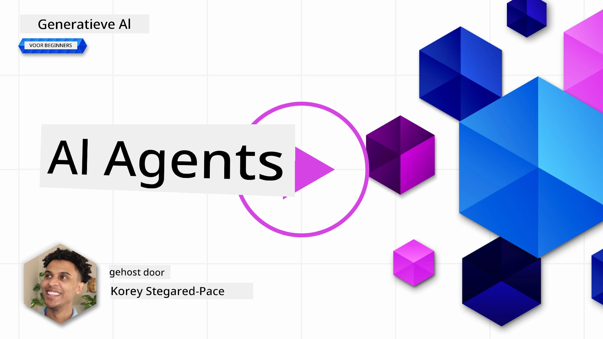
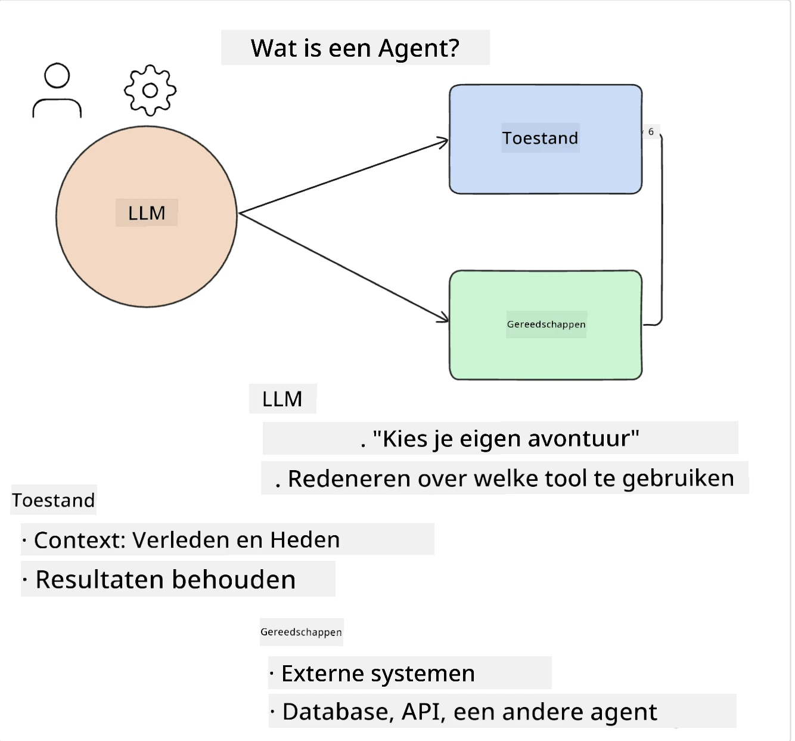
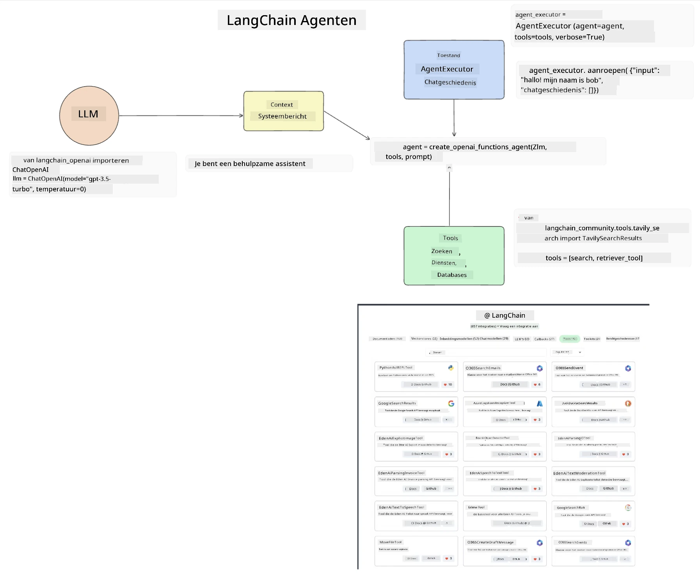
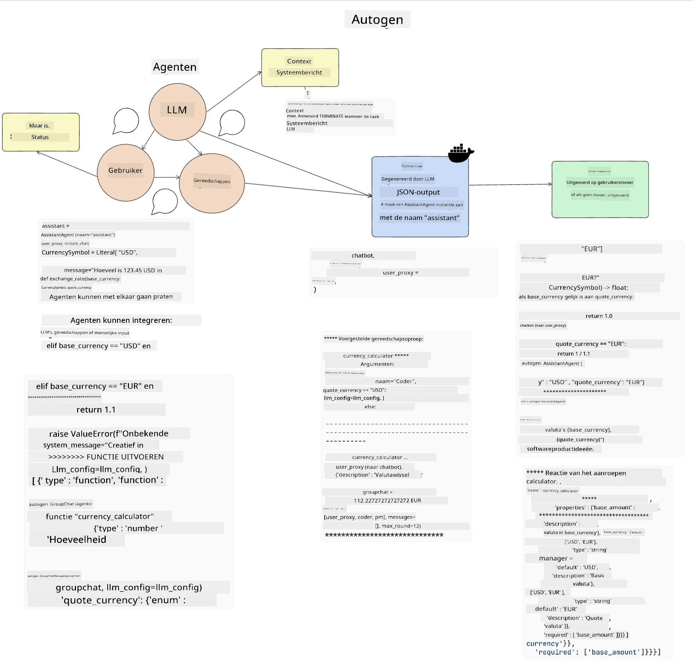
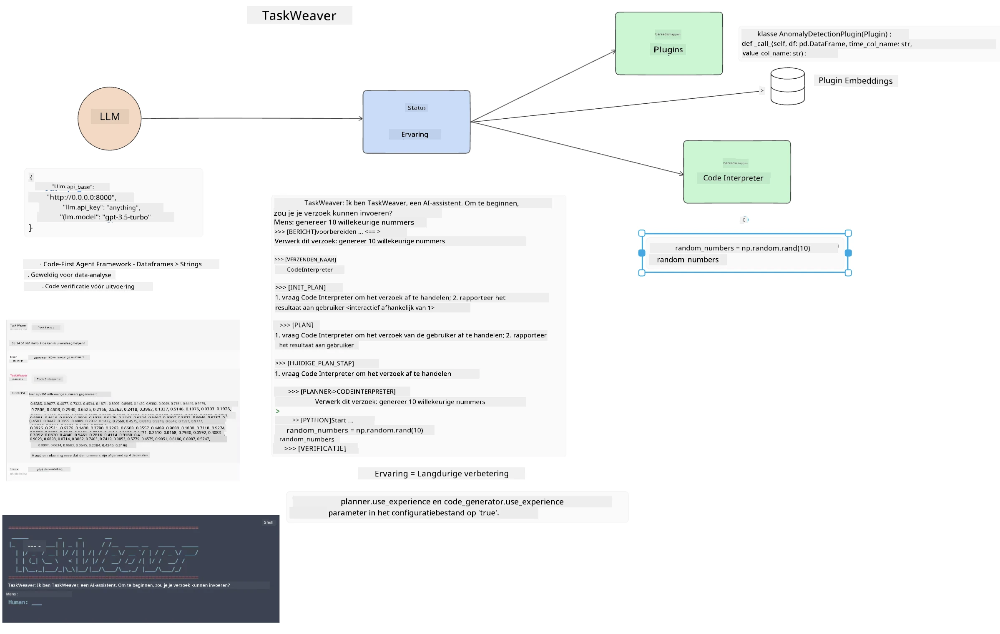
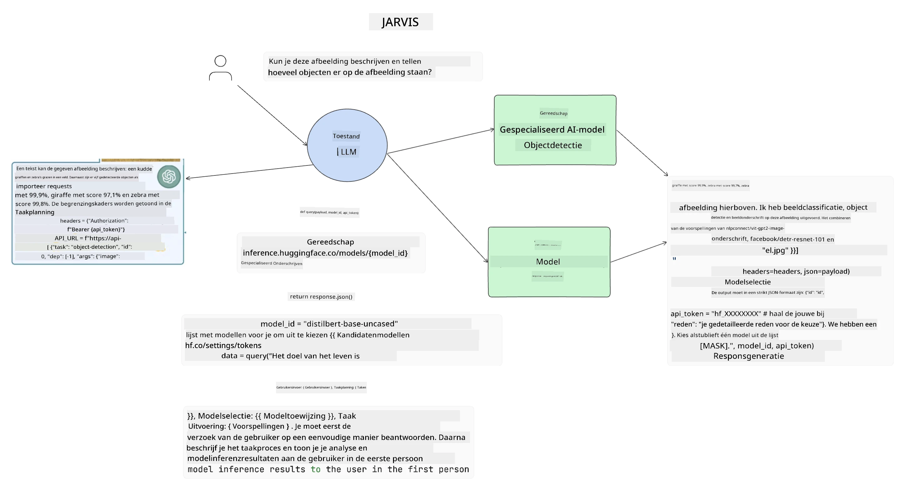

[](https://youtu.be/yAXVW-lUINc?si=bOtW9nL6jc3XJgOM)

## Introductie

AI Agents vertegenwoordigen een spannende ontwikkeling in Generative AI, waarbij Large Language Models (LLM's) evolueren van assistenten tot agenten die in staat zijn acties te ondernemen. AI Agent-raamwerken stellen ontwikkelaars in staat applicaties te maken die LLM's toegang geven tot tools en statusbeheer. Deze raamwerken verbeteren ook de zichtbaarheid, waardoor gebruikers en ontwikkelaars de geplande acties van LLM's kunnen monitoren, wat de ervaringsbeheer verbetert.

De les behandelt de volgende onderwerpen:

- Begrijpen wat een AI Agent is – Wat is precies een AI Agent?
- Verkennen van vier verschillende AI Agent Frameworks – Wat maakt ze uniek?
- Toepassen van deze AI Agents op verschillende use-cases – Wanneer moeten we AI Agents gebruiken?

## Leerdoelen

Na het volgen van deze les kun je:

- Uitleggen wat AI Agents zijn en hoe ze kunnen worden gebruikt.
- Inzicht hebben in de verschillen tussen enkele populaire AI Agent Frameworks en hoe ze van elkaar verschillen.
- Begrijpen hoe AI Agents functioneren om applicaties ermee te bouwen.

## Wat zijn AI Agents?

AI Agents zijn een zeer spannend gebied in de wereld van Generative AI. Met deze opwinding komt soms verwarring over termen en hun toepassing. Om het eenvoudig te houden en inclusief voor de meeste tools die naar AI Agents verwijzen, zullen we deze definitie gebruiken:

AI Agents stellen Large Language Models (LLM's) in staat taken uit te voeren door ze toegang te geven tot een **status** en **tools**.



Laten we deze termen definiëren:

**Large Language Models** – Dit zijn de modellen die door deze cursus worden genoemd, zoals GPT-3.5, GPT-4, Llama-2, enz.

**Status** – Dit verwijst naar de context waarin het LLM werkt. Het LLM gebruikt de context van zijn vorige acties en de huidige context om zijn besluitvorming voor volgende acties te sturen. AI Agent Frameworks maken het voor ontwikkelaars eenvoudiger om deze context te behouden.

**Tools** – Om de taak te voltooien die de gebruiker heeft aangevraagd en die het LLM heeft gepland, heeft het LLM toegang nodig tot tools. Enkele voorbeelden van tools kunnen een database, een API, een externe applicatie of zelfs een ander LLM zijn!

Deze definities geven hopelijk een goede basis voor het vervolg waarin we bekijken hoe ze worden geïmplementeerd. Laten we een paar verschillende AI Agent-frameworks verkennen:

## LangChain Agents

[LangChain Agents](https://python.langchain.com/docs/how_to/#agents?WT.mc_id=academic-105485-koreyst) is een implementatie van de bovenstaande definities.

Om de **status** te beheren, gebruikt het een ingebouwde functie genaamd de `AgentExecutor`. Deze accepteert de gedefinieerde `agent` en de beschikbare `tools`.

De `AgentExecutor` slaat ook de chatgeschiedenis op om de context van het gesprek te bieden.



LangChain biedt een [catalogus met tools](https://integrations.langchain.com/tools?WT.mc_id=academic-105485-koreyst) die in je applicatie geïmporteerd kunnen worden en waartoe het LLM toegang kan krijgen. Deze worden gemaakt door de community en het LangChain-team.

Je kunt deze tools vervolgens definiëren en doorgeven aan de `AgentExecutor`.

Zichtbaarheid is een ander belangrijk aspect bij AI Agents. Het is belangrijk voor applicatieontwikkelaars om te begrijpen welke tool het LLM gebruikt en waarom. Daarom heeft het team van LangChain LangSmith ontwikkeld.

## AutoGen

Het volgende AI Agent-framework dat we bespreken is [AutoGen](https://microsoft.github.io/autogen/?WT.mc_id=academic-105485-koreyst). De focus van AutoGen ligt op gesprekken. Agents zijn zowel **gespreksvaardig** als **aanpasbaar**.

**Gespreksvaardig -** LLM's kunnen een gesprek starten en voortzetten met een ander LLM om een taak te voltooien. Dit gebeurt door het creëren van `AssistantAgents` en het geven van een specifieke systeem boodschap.

```python

autogen.AssistantAgent( name="Coder", llm_config=llm_config, ) pm = autogen.AssistantAgent( name="Product_manager", system_message="Creative in software product ideas.", llm_config=llm_config, )

```

**Aanpasbaar** – Agents kunnen niet alleen als LLM worden gedefinieerd, maar ook als gebruiker of tool. Als ontwikkelaar kun je een `UserProxyAgent` definiëren die verantwoordelijk is voor interactie met de gebruiker voor feedback bij het voltooien van een taak. Deze feedback kan de uitvoering van de taak voortzetten of stoppen.

```python
user_proxy = UserProxyAgent(name="user_proxy")
```

### Status en Tools

Om de status te wijzigen en te beheren genereert een assistent-agent Python-code om de taak te voltooien.

Hier is een voorbeeld van het proces:



#### LLM gedefinieerd met een systeemboodschap

```python
system_message="For weather related tasks, only use the functions you have been provided with. Reply TERMINATE when the task is done."
```

Deze systeemboodschap stuurt dit specifieke LLM aan welke functies relevant zijn voor zijn taak. Onthoud, met AutoGen kun je meerdere gedefinieerde AssistantAgents hebben met verschillende systeemboodschappen.

#### Chat wordt gestart door gebruiker

```python
user_proxy.initiate_chat( chatbot, message="I am planning a trip to NYC next week, can you help me pick out what to wear? ", )

```

Dit bericht van de user_proxy (mens) zal het proces starten waarbij de Agent de mogelijke functies onderzoekt die hij moet uitvoeren.

#### Functie wordt uitgevoerd

```bash
chatbot (to user_proxy):

***** Suggested tool Call: get_weather ***** Arguments: {"location":"New York City, NY","time_periond:"7","temperature_unit":"Celsius"} ******************************************************** --------------------------------------------------------------------------------

>>>>>>>> EXECUTING FUNCTION get_weather... user_proxy (to chatbot): ***** Response from calling function "get_weather" ***** 112.22727272727272 EUR ****************************************************************

```

Zodra de initiële chat is verwerkt, zal de Agent de voorgestelde tool die moet worden aangeroepen, sturen. In dit geval is dat een functie genaamd `get_weather`. Afhankelijk van je configuratie kan deze functie automatisch door de Agent worden uitgevoerd en gelezen, of op basis van gebruikersinvoer worden uitgevoerd.

Je kunt een lijst vinden van [AutoGen codevoorbeelden](https://microsoft.github.io/autogen/docs/Examples/?WT.mc_id=academic-105485-koreyst) om verder te verkennen hoe je kunt beginnen met bouwen.

## Taskweaver

Het volgende agent-framework dat we verkennen is [Taskweaver](https://microsoft.github.io/TaskWeaver/?WT.mc_id=academic-105485-koreyst). Het staat bekend als een "code-first" agent omdat het in plaats van strikt met `strings` te werken, kan werken met DataFrames in Python. Dit wordt enorm nuttig voor data-analyse- en generatietaken. Dit kan dingen omvatten zoals het maken van grafieken en diagrammen of het genereren van willekeurige getallen.

### Status en Tools

Om de status van het gesprek te beheren, gebruikt TaskWeaver het concept van een `Planner`. De `Planner` is een LLM die de verzoeken van de gebruikers ontvangt en de taken uitschrijft die voltooid moeten worden om het verzoek te vervullen.

Om de taken te voltooien wordt de `Planner` blootgesteld aan een verzameling tools, `Plugins` genaamd. Dit kunnen Python-klassen zijn of een algemene code-interpreter. Deze plugins worden opgeslagen als embeddings zodat het LLM beter kan zoeken naar de juiste plugin.



Hier is een voorbeeld van een plugin voor het afhandelen van anomaliedetectie:

```python
class AnomalyDetectionPlugin(Plugin): def __call__(self, df: pd.DataFrame, time_col_name: str, value_col_name: str):
```

De code wordt geverifieerd vóór uitvoering. Een andere functie om context te beheren in Taskweaver is `experience`. Experience maakt het mogelijk de context van een gesprek op de lange termijn op te slaan in een YAML-bestand. Dit kan zo worden geconfigureerd dat het LLM over de tijd verbetert op bepaalde taken, mits het wordt blootgesteld aan eerdere gesprekken.

## JARVIS

Het laatste agent-framework dat we zullen verkennen is [JARVIS](https://github.com/microsoft/JARVIS?tab=readme-ov-file&WT.mc_id=academic-105485-koreyst). Wat JARVIS uniek maakt, is dat het een LLM gebruikt om de `status` van het gesprek te beheren en de `tools` andere AI-modellen zijn. Elk van de AI-modellen zijn gespecialiseerde modellen die bepaalde taken uitvoeren zoals objectdetectie, transcriptie of image captioning.



Het LLM, als een algemeen model, ontvangt het verzoek van de gebruiker en identificeert de specifieke taak en eventuele argumenten/data die nodig zijn om de taak te voltooien.

```python
[{"task": "object-detection", "id": 0, "dep": [-1], "args": {"image": "e1.jpg" }}]
```

Het LLM formatteert het verzoek vervolgens op een manier die het gespecialiseerde AI-model kan interpreteren, zoals JSON. Zodra het AI-model zijn voorspelling heeft teruggegeven op basis van de taak, ontvangt het LLM de reactie.

Als meerdere modellen nodig zijn om de taak te voltooien, zal het ook de reacties van die modellen interpreteren voordat het ze samenbrengt om de reactie aan de gebruiker te genereren.

Het voorbeeld hieronder toont hoe dit zou werken wanneer een gebruiker een beschrijving en telling van de objecten in een afbeelding opvraagt:

## Opdracht

Om je leren over AI Agents voort te zetten, kun je met AutoGen bouwen:

- Een applicatie die een zakelijke vergadering simuleert met verschillende afdelingen van een educatieve startup.
- Maak systeemboodschappen die LLM's begeleiden in het begrijpen van verschillende persona's en prioriteiten, en stel de gebruiker in staat om een nieuw productidee te presenteren.
- Het LLM moet vervolgens vervolgvragen genereren vanuit elke afdeling om de pitch en het productidee te verfijnen en te verbeteren.

## Leren stopt hier niet, zet de reis voort

Na het voltooien van deze les, bekijk onze [Generative AI Learning collection](https://aka.ms/genai-collection?WT.mc_id=academic-105485-koreyst) om je Generative AI-kennis verder te vergroten!

---

<!-- CO-OP TRANSLATOR DISCLAIMER START -->
**Disclaimer**:
Dit document is vertaald met behulp van de AI vertaaldienst [Co-op Translator](https://github.com/Azure/co-op-translator). Hoewel we streven naar nauwkeurigheid, dient u er rekening mee te houden dat geautomatiseerde vertalingen fouten of onnauwkeurigheden kunnen bevatten. Het oorspronkelijke document in de oorspronkelijke taal dient als gezaghebbende bron te worden beschouwd. Voor cruciale informatie wordt professionele menselijke vertaling aanbevolen. Wij zijn niet aansprakelijk voor eventuele misverstanden of verkeerde interpretaties die voortvloeien uit het gebruik van deze vertaling.
<!-- CO-OP TRANSLATOR DISCLAIMER END -->