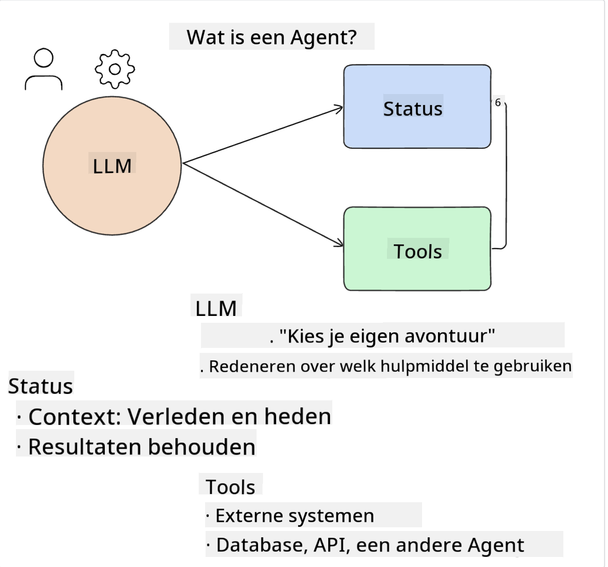
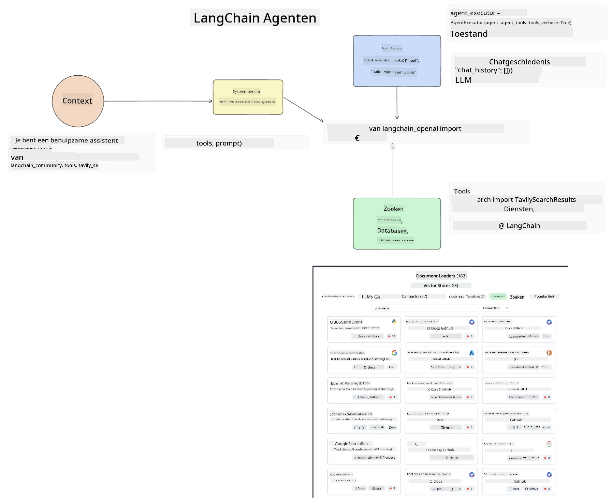
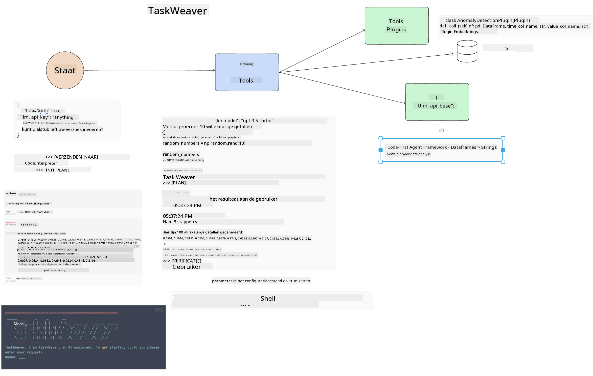
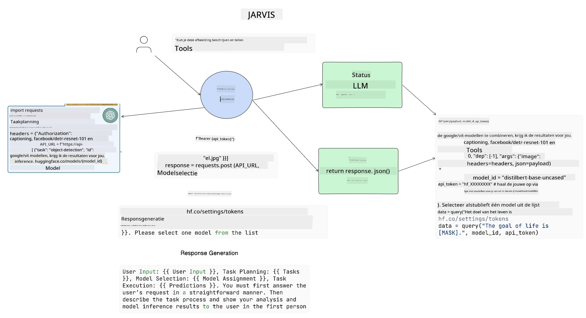

<!--
CO_OP_TRANSLATOR_METADATA:
{
  "original_hash": "11f03c81f190d9cbafd0f977dcbede6c",
  "translation_date": "2025-07-09T17:27:41+00:00",
  "source_file": "17-ai-agents/README.md",
  "language_code": "nl"
}
-->
[](https://aka.ms/gen-ai-lesson17-gh?WT.mc_id=academic-105485-koreyst)

## Introductie

AI Agents vormen een spannende ontwikkeling binnen Generative AI, waarbij Large Language Models (LLM’s) evolueren van assistenten naar agenten die daadwerkelijk acties kunnen ondernemen. AI Agent-frameworks stellen ontwikkelaars in staat om applicaties te bouwen die LLM’s toegang geven tot tools en state management. Deze frameworks verbeteren ook de transparantie, waardoor gebruikers en ontwikkelaars de geplande acties van LLM’s kunnen volgen en zo de gebruikerservaring kunnen verbeteren.

In deze les behandelen we de volgende onderwerpen:

- Wat is een AI Agent precies?
- Vier verschillende AI Agent-frameworks verkennen – wat maakt ze uniek?
- Toepassen van deze AI Agents in verschillende use cases – wanneer gebruik je AI Agents?

## Leerdoelen

Na deze les kun je:

- Uitleggen wat AI Agents zijn en hoe ze gebruikt kunnen worden.
- Het verschil begrijpen tussen enkele populaire AI Agent-frameworks en hoe ze van elkaar verschillen.
- Begrijpen hoe AI Agents werken om er zelf applicaties mee te bouwen.

## Wat zijn AI Agents?

AI Agents zijn een erg interessant gebied binnen Generative AI. Door deze interesse ontstaat soms verwarring over termen en toepassingen. Om het eenvoudig te houden en de meeste tools die AI Agents noemen te omvatten, gebruiken we deze definitie:

AI Agents stellen Large Language Models (LLM’s) in staat om taken uit te voeren door ze toegang te geven tot een **state** en **tools**.



Laten we deze termen definiëren:

**Large Language Models** – Dit zijn de modellen die in deze cursus worden genoemd, zoals GPT-3.5, GPT-4, Llama-2, enzovoort.

**State** – Dit verwijst naar de context waarin het LLM werkt. Het LLM gebruikt de context van eerdere acties en de huidige situatie om zijn beslissingen voor volgende acties te sturen. AI Agent-frameworks maken het voor ontwikkelaars makkelijker om deze context te beheren.

**Tools** – Om de taak die de gebruiker heeft gevraagd en die het LLM heeft gepland uit te voeren, heeft het LLM toegang nodig tot tools. Voorbeelden van tools zijn een database, een API, een externe applicatie of zelfs een ander LLM!

Deze definities geven hopelijk een goede basis om verder te begrijpen hoe ze worden toegepast. Laten we een paar verschillende AI Agent-frameworks bekijken:

## LangChain Agents

[LangChain Agents](https://python.langchain.com/docs/how_to/#agents?WT.mc_id=academic-105485-koreyst) is een implementatie van de bovenstaande definities.

Om de **state** te beheren, gebruikt het een ingebouwde functie genaamd `AgentExecutor`. Deze accepteert de gedefinieerde `agent` en de beschikbare `tools`.

De `AgentExecutor` slaat ook de chatgeschiedenis op om de context van het gesprek te bieden.



LangChain biedt een [catalogus van tools](https://integrations.langchain.com/tools?WT.mc_id=academic-105485-koreyst) die je in je applicatie kunt importeren en waar het LLM toegang toe kan krijgen. Deze zijn gemaakt door de community en het LangChain-team.

Je kunt deze tools definiëren en doorgeven aan de `AgentExecutor`.

Zichtbaarheid is een ander belangrijk aspect bij AI Agents. Het is belangrijk voor ontwikkelaars om te begrijpen welke tool het LLM gebruikt en waarom. Daarom heeft het team van LangChain LangSmith ontwikkeld.

## AutoGen

Het volgende AI Agent-framework dat we bespreken is [AutoGen](https://microsoft.github.io/autogen/?WT.mc_id=academic-105485-koreyst). De focus van AutoGen ligt op gesprekken. Agents zijn zowel **conversabel** als **aanpasbaar**.

**Conversabel** – LLM’s kunnen een gesprek starten en voortzetten met een ander LLM om een taak te voltooien. Dit gebeurt door `AssistantAgents` te creëren en ze een specifieke system message te geven.

```python

autogen.AssistantAgent( name="Coder", llm_config=llm_config, ) pm = autogen.AssistantAgent( name="Product_manager", system_message="Creative in software product ideas.", llm_config=llm_config, )

```

**Aanpasbaar** – Agents kunnen niet alleen LLM’s zijn, maar ook een gebruiker of een tool. Als ontwikkelaar kun je een `UserProxyAgent` definiëren die verantwoordelijk is voor interactie met de gebruiker om feedback te krijgen bij het voltooien van een taak. Deze feedback kan de uitvoering van de taak voortzetten of stoppen.

```python
user_proxy = UserProxyAgent(name="user_proxy")
```

### State en Tools

Om de state te wijzigen en te beheren genereert een assistant Agent Python-code om de taak uit te voeren.

Hier is een voorbeeld van het proces:


#### LLM gedefinieerd met een system message

```python
system_message="For weather related tasks, only use the functions you have been provided with. Reply TERMINATE when the task is done."
```

Deze system message geeft aan dit specifieke LLM aan welke functies relevant zijn voor zijn taak. Onthoud dat je met AutoGen meerdere AssistantAgents kunt definiëren met verschillende system messages.

#### Chat wordt gestart door gebruiker

```python
user_proxy.initiate_chat( chatbot, message="I am planning a trip to NYC next week, can you help me pick out what to wear? ", )

```

Dit bericht van de user_proxy (mens) start het proces waarbij de Agent onderzoekt welke functies hij moet uitvoeren.

#### Functie wordt uitgevoerd

```bash
chatbot (to user_proxy):

***** Suggested tool Call: get_weather ***** Arguments: {"location":"New York City, NY","time_periond:"7","temperature_unit":"Celsius"} ******************************************************** --------------------------------------------------------------------------------

>>>>>>>> EXECUTING FUNCTION get_weather... user_proxy (to chatbot): ***** Response from calling function "get_weather" ***** 112.22727272727272 EUR ****************************************************************

```

Zodra de initiële chat is verwerkt, zal de Agent de voorgestelde tool aanroepen. In dit geval is dat een functie genaamd `get_weather`. Afhankelijk van je configuratie kan deze functie automatisch worden uitgevoerd en gelezen door de Agent, of op basis van gebruikersinput.

Je kunt een lijst met [AutoGen codevoorbeelden](https://microsoft.github.io/autogen/docs/Examples/?WT.mc_id=academic-105485-koreyst) vinden om verder te ontdekken hoe je kunt beginnen met bouwen.

## Taskweaver

Het volgende agent-framework dat we bekijken is [Taskweaver](https://microsoft.github.io/TaskWeaver/?WT.mc_id=academic-105485-koreyst). Het staat bekend als een "code-first" agent omdat het in plaats van alleen met `strings` te werken, ook met DataFrames in Python kan werken. Dit is erg handig voor data-analyse en generatietaken, zoals het maken van grafieken en diagrammen of het genereren van willekeurige getallen.

### State en Tools

Om de state van het gesprek te beheren gebruikt TaskWeaver het concept van een `Planner`. De `Planner` is een LLM die het verzoek van de gebruiker ontvangt en de taken in kaart brengt die moeten worden uitgevoerd om aan het verzoek te voldoen.

Om de taken uit te voeren heeft de `Planner` toegang tot een verzameling tools genaamd `Plugins`. Dit kunnen Python-klassen zijn of een algemene code-interpreter. Deze plugins worden opgeslagen als embeddings zodat het LLM beter kan zoeken naar de juiste plugin.



Hier is een voorbeeld van een plugin voor het detecteren van anomalieën:

```python
class AnomalyDetectionPlugin(Plugin): def __call__(self, df: pd.DataFrame, time_col_name: str, value_col_name: str):
```

De code wordt gecontroleerd voordat deze wordt uitgevoerd. Een andere functie om context te beheren in Taskweaver is `experience`. Experience maakt het mogelijk om de context van een gesprek op de lange termijn op te slaan in een YAML-bestand. Dit kan zo worden ingesteld dat het LLM in de loop van de tijd beter wordt in bepaalde taken, doordat het eerdere gesprekken kan gebruiken.

## JARVIS

Het laatste agent-framework dat we bekijken is [JARVIS](https://github.com/microsoft/JARVIS?tab=readme-ov-file?WT.mc_id=academic-105485-koreyst). Wat JARVIS uniek maakt, is dat het een LLM gebruikt om de `state` van het gesprek te beheren en dat de `tools` andere AI-modellen zijn. Elk van deze AI-modellen is gespecialiseerd in bepaalde taken, zoals objectdetectie, transcriptie of het maken van bijschriften bij afbeeldingen.



Het LLM, als een algemeen model, ontvangt het verzoek van de gebruiker en identificeert de specifieke taak en eventuele argumenten/data die nodig zijn om de taak uit te voeren.

```python
[{"task": "object-detection", "id": 0, "dep": [-1], "args": {"image": "e1.jpg" }}]
```

Het LLM formatteert het verzoek vervolgens op een manier die het gespecialiseerde AI-model kan interpreteren, bijvoorbeeld in JSON. Zodra het AI-model zijn voorspelling heeft teruggegeven, ontvangt het LLM de respons.

Als meerdere modellen nodig zijn om de taak te voltooien, interpreteert het LLM ook de reacties van die modellen voordat het ze samenvoegt om het antwoord aan de gebruiker te geven.

Het onderstaande voorbeeld laat zien hoe dit werkt wanneer een gebruiker een beschrijving en telling van objecten in een afbeelding opvraagt:

## Opdracht

Om je kennis van AI Agents verder te ontwikkelen kun je met AutoGen het volgende bouwen:

- Een applicatie die een zakelijke vergadering simuleert met verschillende afdelingen van een educatieve startup.
- Maak system messages die LLM’s helpen verschillende persona’s en prioriteiten te begrijpen, en waarmee de gebruiker een nieuw productidee kan pitchen.
- Het LLM moet vervolgens vervolgvragen genereren vanuit elke afdeling om de pitch en het productidee te verfijnen en verbeteren.

## Leren stopt hier niet, ga door met de reis

Na het afronden van deze les kun je onze [Generative AI Learning collectie](https://aka.ms/genai-collection?WT.mc_id=academic-105485-koreyst) bekijken om je kennis van Generative AI verder te verdiepen!

**Disclaimer**:  
Dit document is vertaald met behulp van de AI-vertalingsdienst [Co-op Translator](https://github.com/Azure/co-op-translator). Hoewel we streven naar nauwkeurigheid, dient u er rekening mee te houden dat geautomatiseerde vertalingen fouten of onnauwkeurigheden kunnen bevatten. Het originele document in de oorspronkelijke taal moet als de gezaghebbende bron worden beschouwd. Voor cruciale informatie wordt professionele menselijke vertaling aanbevolen. Wij zijn niet aansprakelijk voor eventuele misverstanden of verkeerde interpretaties die voortvloeien uit het gebruik van deze vertaling.