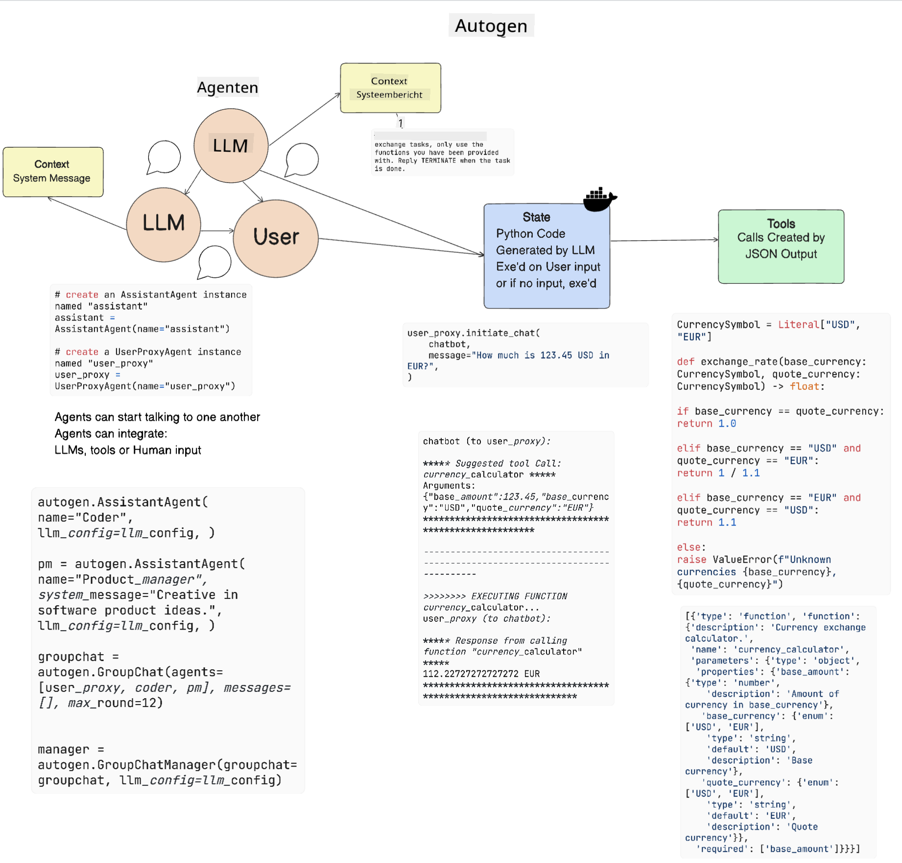

<!--
CO_OP_TRANSLATOR_METADATA:
{
  "original_hash": "8e8d1f6a63da606af7176a87ff8e92b6",
  "translation_date": "2025-10-17T19:58:21+00:00",
  "source_file": "17-ai-agents/README.md",
  "language_code": "nl"
}
-->
[](https://youtu.be/yAXVW-lUINc?si=bOtW9nL6jc3XJgOM)

## Introductie

AI-agents vormen een spannende ontwikkeling binnen Generatieve AI, waarbij Grote Taalmodellen (LLMs) evolueren van assistenten naar agents die zelfstandig acties kunnen ondernemen. Frameworks voor AI-agents stellen ontwikkelaars in staat om applicaties te maken die LLMs toegang geven tot tools en state management. Deze frameworks verbeteren ook de transparantie, waardoor gebruikers en ontwikkelaars de acties die door LLMs worden gepland beter kunnen volgen en zo de gebruikerservaring kunnen optimaliseren.

In deze les behandelen we de volgende onderwerpen:

- Begrijpen wat een AI-agent is - Wat is een AI-agent precies?
- Verkennen van vier verschillende AI-agent frameworks - Wat maakt ze uniek?
- Toepassen van deze AI-agents op verschillende use cases - Wanneer gebruiken we AI-agents?

## Leerdoelen

Na het volgen van deze les kun je:

- Uitleggen wat AI-agents zijn en hoe ze gebruikt kunnen worden.
- Begrijpen wat de verschillen zijn tussen enkele populaire AI-agent frameworks en hoe ze van elkaar verschillen.
- Begrijpen hoe AI-agents functioneren om applicaties mee te bouwen.

## Wat zijn AI-agents?

AI-agents zijn een zeer spannend gebied binnen de wereld van Generatieve AI. Met deze opwinding komt soms ook verwarring over termen en hun toepassing. Om het eenvoudig te houden en inclusief te zijn voor de meeste tools die naar AI-agents verwijzen, hanteren we de volgende definitie:

AI-agents stellen Grote Taalmodellen (LLMs) in staat om taken uit te voeren door ze toegang te geven tot een **state** en **tools**.


Laten we deze termen definiëren:

**Grote Taalmodellen** - Dit zijn de modellen die in deze cursus worden besproken, zoals GPT-3.5, GPT-4, Llama-2, enzovoort.

**State** - Dit verwijst naar de context waarin het LLM werkt. Het LLM gebruikt de context van eerdere acties en de huidige situatie om beslissingen te nemen voor volgende acties. AI-agent frameworks maken het voor ontwikkelaars eenvoudiger om deze context te beheren.

**Tools** - Om de taak die de gebruiker heeft gevraagd en die het LLM heeft gepland uit te voeren, heeft het LLM toegang nodig tot tools. Voorbeelden van tools zijn een database, een API, een externe applicatie of zelfs een ander LLM!

Deze definities bieden hopelijk een goede basis voor de verdere verkenning van hoe ze worden geïmplementeerd. Laten we een paar verschillende AI-agent frameworks bekijken:

## LangChain Agents

[LangChain Agents](https://python.langchain.com/docs/how_to/#agents?WT.mc_id=academic-105485-koreyst) is een implementatie van de hierboven gegeven definities.

Om de **state** te beheren, gebruikt het een ingebouwde functie genaamd `AgentExecutor`. Deze accepteert de gedefinieerde `agent` en de beschikbare `tools`.

De `AgentExecutor` slaat ook de chatgeschiedenis op om de context van het gesprek te bieden.


LangChain biedt een [catalogus van tools](https://integrations.langchain.com/tools?WT.mc_id=academic-105485-koreyst) die in je applicatie kunnen worden geïmporteerd, zodat het LLM toegang krijgt. Deze tools zijn gemaakt door de community en het LangChain-team.

Je kunt deze tools vervolgens definiëren en doorgeven aan de `AgentExecutor`.

Transparantie is een ander belangrijk aspect bij AI-agents. Het is belangrijk voor applicatieontwikkelaars om te begrijpen welke tool het LLM gebruikt en waarom. Hiervoor heeft het team van LangChain LangSmith ontwikkeld.

## AutoGen

Het volgende AI-agent framework dat we bespreken is [AutoGen](https://microsoft.github.io/autogen/?WT.mc_id=academic-105485-koreyst). De belangrijkste focus van AutoGen ligt op gesprekken. Agents zijn zowel **gespreksgericht** als **aanpasbaar**.

**Gespreksgericht -** LLMs kunnen een gesprek starten en voortzetten met een ander LLM om een taak te voltooien. Dit gebeurt door `AssistantAgents` te creëren en ze een specifieke systeemboodschap te geven.

```python

autogen.AssistantAgent( name="Coder", llm_config=llm_config, ) pm = autogen.AssistantAgent( name="Product_manager", system_message="Creative in software product ideas.", llm_config=llm_config, )

```

**Aanpasbaar** - Agents kunnen niet alleen als LLMs worden gedefinieerd, maar ook als een gebruiker of een tool. Als ontwikkelaar kun je een `UserProxyAgent` definiëren die verantwoordelijk is voor interactie met de gebruiker voor feedback bij het voltooien van een taak. Deze feedback kan de uitvoering van de taak voortzetten of stoppen.

```python
user_proxy = UserProxyAgent(name="user_proxy")
```

### State en Tools

Om de state te wijzigen en te beheren, genereert een AssistantAgent Python-code om de taak te voltooien.

Hier is een voorbeeld van het proces:



#### LLM gedefinieerd met een systeemboodschap

```python
system_message="For weather related tasks, only use the functions you have been provided with. Reply TERMINATE when the task is done."
```

Deze systeemboodschap geeft dit specifieke LLM aan welke functies relevant zijn voor zijn taak. Onthoud dat je met AutoGen meerdere AssistantAgents kunt definiëren met verschillende systeemboodschappen.

#### Chat wordt gestart door gebruiker

```python
user_proxy.initiate_chat( chatbot, message="I am planning a trip to NYC next week, can you help me pick out what to wear? ", )

```

Dit bericht van de user_proxy (Mens) is wat het proces van de Agent start om de mogelijke functies te verkennen die hij moet uitvoeren.

#### Functie wordt uitgevoerd

```bash
chatbot (to user_proxy):

***** Suggested tool Call: get_weather ***** Arguments: {"location":"New York City, NY","time_periond:"7","temperature_unit":"Celsius"} ******************************************************** --------------------------------------------------------------------------------

>>>>>>>> EXECUTING FUNCTION get_weather... user_proxy (to chatbot): ***** Response from calling function "get_weather" ***** 112.22727272727272 EUR ****************************************************************

```

Zodra de initiële chat is verwerkt, zal de Agent de voorgestelde tool doorgeven om te gebruiken. In dit geval is dat een functie genaamd `get_weather`. Afhankelijk van je configuratie kan deze functie automatisch worden uitgevoerd en gelezen door de Agent, of kan deze worden uitgevoerd op basis van gebruikersinvoer.

Je kunt een lijst met [AutoGen codevoorbeelden](https://microsoft.github.io/autogen/docs/Examples/?WT.mc_id=academic-105485-koreyst) vinden om verder te verkennen hoe je kunt beginnen met bouwen.

## Taskweaver

Het volgende agent framework dat we verkennen is [Taskweaver](https://microsoft.github.io/TaskWeaver/?WT.mc_id=academic-105485-koreyst). Het staat bekend als een "code-first" agent omdat het in plaats van strikt met `strings` te werken, kan werken met DataFrames in Python. Dit is bijzonder nuttig voor data-analyse en generatietaken, zoals het maken van grafieken en diagrammen of het genereren van willekeurige getallen.

### State en Tools

Om de state van het gesprek te beheren, gebruikt TaskWeaver het concept van een `Planner`. De `Planner` is een LLM die het verzoek van de gebruiker ontvangt en de taken uitzet die moeten worden uitgevoerd om aan dit verzoek te voldoen.

Om de taken te voltooien, heeft de `Planner` toegang tot een verzameling tools genaamd `Plugins`. Dit kunnen Python-klassen of een algemene code-interpreter zijn. Deze plugins worden opgeslagen als embeddings zodat het LLM beter kan zoeken naar de juiste plugin.


Hier is een voorbeeld van een plugin voor het detecteren van afwijkingen:

```python
class AnomalyDetectionPlugin(Plugin): def __call__(self, df: pd.DataFrame, time_col_name: str, value_col_name: str):
```

De code wordt geverifieerd voordat deze wordt uitgevoerd. Een andere functie om context te beheren in TaskWeaver is `experience`. Experience maakt het mogelijk om de context van een gesprek op lange termijn op te slaan in een YAML-bestand. Dit kan worden geconfigureerd zodat het LLM na verloop van tijd beter wordt in bepaalde taken, omdat het wordt blootgesteld aan eerdere gesprekken.

## JARVIS

Het laatste agent framework dat we verkennen is [JARVIS](https://github.com/microsoft/JARVIS?tab=readme-ov-file?WT.mc_id=academic-105485-koreyst). Wat JARVIS uniek maakt, is dat het een LLM gebruikt om de `state` van het gesprek te beheren en de `tools` andere AI-modellen zijn. Elk van de AI-modellen is gespecialiseerd in bepaalde taken, zoals objectdetectie, transcriptie of beeldbeschrijving.


Het LLM, als algemeen model, ontvangt het verzoek van de gebruiker en identificeert de specifieke taak en eventuele argumenten/data die nodig zijn om de taak te voltooien.

```python
[{"task": "object-detection", "id": 0, "dep": [-1], "args": {"image": "e1.jpg" }}]
```

Het LLM formatteert vervolgens het verzoek op een manier die het gespecialiseerde AI-model kan interpreteren, zoals JSON. Zodra het AI-model zijn voorspelling heeft geretourneerd op basis van de taak, ontvangt het LLM de reactie.

Als meerdere modellen nodig zijn om de taak te voltooien, zal het ook de reacties van die modellen interpreteren voordat ze worden samengevoegd om een antwoord aan de gebruiker te genereren.

Het onderstaande voorbeeld laat zien hoe dit zou werken wanneer een gebruiker een beschrijving en telling van de objecten in een afbeelding vraagt:

## Opdracht

Om je kennis van AI-agents verder te ontwikkelen, kun je bouwen met AutoGen:

- Een applicatie die een zakelijke vergadering simuleert met verschillende afdelingen van een educatieve startup.
- Maak systeemboodschappen die LLMs begeleiden in het begrijpen van verschillende persona's en prioriteiten, en stel de gebruiker in staat een nieuw productidee te presenteren.
- Het LLM moet vervolgens vervolgvragen genereren van elke afdeling om de pitch en het productidee te verfijnen en te verbeteren.

## Leren stopt hier niet, ga verder met je reis

Na het voltooien van deze les, bekijk onze [Generatieve AI Leercollectie](https://aka.ms/genai-collection?WT.mc_id=academic-105485-koreyst) om je kennis van Generatieve AI verder te verdiepen!

---

**Disclaimer**:  
Dit document is vertaald met behulp van de AI-vertalingsservice [Co-op Translator](https://github.com/Azure/co-op-translator). Hoewel we streven naar nauwkeurigheid, dient u zich ervan bewust te zijn dat geautomatiseerde vertalingen fouten of onnauwkeurigheden kunnen bevatten. Het originele document in de oorspronkelijke taal moet worden beschouwd als de gezaghebbende bron. Voor kritieke informatie wordt professionele menselijke vertaling aanbevolen. Wij zijn niet aansprakelijk voor eventuele misverstanden of verkeerde interpretaties die voortvloeien uit het gebruik van deze vertaling.