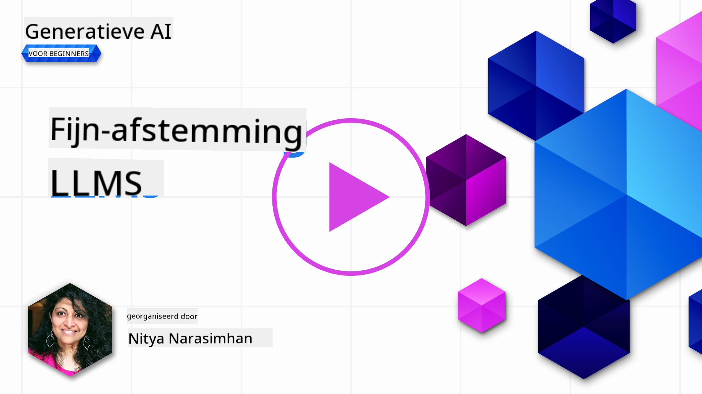
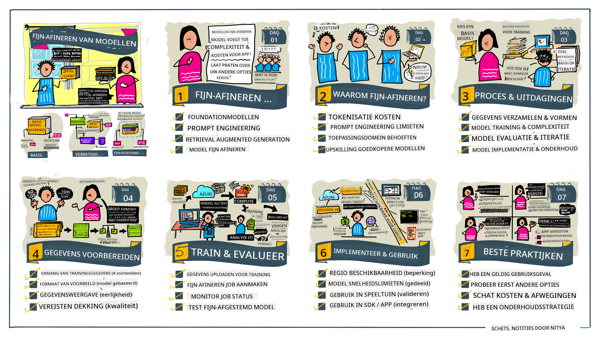

<!--
CO_OP_TRANSLATOR_METADATA:
{
  "original_hash": "68664f7e754a892ae1d8d5e2b7bd2081",
  "translation_date": "2025-07-09T17:45:31+00:00",
  "source_file": "18-fine-tuning/README.md",
  "language_code": "nl"
}
-->

# Je LLM Fijn afstemmen

Het gebruik van grote taalmodellen om generatieve AI-toepassingen te bouwen brengt nieuwe uitdagingen met zich mee. Een belangrijk aandachtspunt is het waarborgen van de kwaliteit van de antwoorden (nauwkeurigheid en relevantie) die het model genereert voor een specifieke gebruikersvraag. In eerdere lessen hebben we technieken besproken zoals prompt engineering en retrieval-augmented generation, die proberen dit probleem op te lossen door _de promptinput_ aan het bestaande model aan te passen.

In de les van vandaag bespreken we een derde techniek, **fijn afstemmen**, die deze uitdaging probeert aan te pakken door _het model zelf opnieuw te trainen_ met extra data. Laten we de details bekijken.

## Leerdoelen

Deze les introduceert het concept van fijn afstemmen voor voorgetrainde taalmodellen, onderzoekt de voordelen en uitdagingen van deze aanpak, en geeft richtlijnen over wanneer en hoe je fijn afstemmen kunt gebruiken om de prestaties van je generatieve AI-modellen te verbeteren.

Aan het einde van deze les zou je de volgende vragen moeten kunnen beantwoorden:

- Wat is fijn afstemmen voor taalmodellen?
- Wanneer en waarom is fijn afstemmen nuttig?
- Hoe kan ik een voorgetraind model fijn afstemmen?
- Wat zijn de beperkingen van fijn afstemmen?

Klaar? Laten we beginnen.

## Geïllustreerde gids

Wil je eerst het overzicht van wat we gaan behandelen voordat we dieper ingaan? Bekijk dan deze geïllustreerde gids die de leerreis van deze les beschrijft – van het leren van de kernconcepten en motivatie voor fijn afstemmen, tot het begrijpen van het proces en de beste praktijken voor het uitvoeren van de fijn afstemming. Dit is een fascinerend onderwerp om te verkennen, dus vergeet niet de [Resources](./RESOURCES.md?WT.mc_id=academic-105485-koreyst) pagina te bekijken voor extra links ter ondersteuning van je zelfgestuurde leertraject!

## Wat is fijn afstemmen voor taalmodellen?

Grote taalmodellen zijn per definitie _voorgetraind_ op grote hoeveelheden tekst afkomstig uit diverse bronnen, waaronder het internet. Zoals we in eerdere lessen hebben geleerd, hebben we technieken nodig zoals _prompt engineering_ en _retrieval-augmented generation_ om de kwaliteit van de antwoorden van het model op de vragen van gebruikers ("prompts") te verbeteren.

Een populaire prompt-engineering techniek is het geven van meer sturing aan het model over wat er in het antwoord verwacht wordt, door _instructies te geven_ (expliciete sturing) of _enkele voorbeelden te tonen_ (impliciete sturing). Dit wordt ook wel _few-shot learning_ genoemd, maar het kent twee beperkingen:

- De tokenlimieten van het model kunnen het aantal voorbeelden dat je kunt geven beperken, en daarmee de effectiviteit.
- De tokenkosten kunnen het duur maken om bij elke prompt voorbeelden toe te voegen, wat de flexibiliteit beperkt.

Fijn afstemmen is een veelgebruikte praktijk in machine learning systemen waarbij we een voorgetraind model nemen en het opnieuw trainen met nieuwe data om de prestaties op een specifieke taak te verbeteren. In de context van taalmodellen kunnen we het voorgetrainde model fijn afstemmen _met een zorgvuldig samengestelde set voorbeelden voor een specifieke taak of toepassingsgebied_ om een **aangepast model** te creëren dat mogelijk nauwkeuriger en relevanter is voor die specifieke taak of domein. Een bijkomend voordeel van fijn afstemmen is dat het ook het aantal voorbeelden dat nodig is voor few-shot learning kan verminderen – wat het tokenverbruik en de bijbehorende kosten verlaagt.

## Wanneer en waarom zouden we modellen fijn afstemmen?

In _deze_ context, als we het over fijn afstemmen hebben, bedoelen we **supervised** fijn afstemmen waarbij het hertrainen gebeurt door **nieuwe data toe te voegen** die niet in de oorspronkelijke trainingsdataset zat. Dit verschilt van een unsupervised fijn afstemmingsaanpak waarbij het model opnieuw wordt getraind op de originele data, maar met andere hyperparameters.

Het belangrijkste om te onthouden is dat fijn afstemmen een geavanceerde techniek is die een bepaald niveau van expertise vereist om de gewenste resultaten te behalen. Als het verkeerd wordt gedaan, kan het de verwachte verbeteringen niet opleveren en zelfs de prestaties van het model voor jouw specifieke domein verslechteren.

Dus, voordat je leert "hoe" je taalmodellen fijn kunt afstemmen, moet je weten "waarom" je deze weg zou moeten bewandelen, en "wanneer" je het proces van fijn afstemmen moet starten. Begin met jezelf de volgende vragen te stellen:

- **Use Case**: Wat is jouw _use case_ voor fijn afstemmen? Welk aspect van het huidige voorgetrainde model wil je verbeteren?
- **Alternatieven**: Heb je _andere technieken_ geprobeerd om de gewenste resultaten te bereiken? Gebruik deze om een basislijn voor vergelijking te creëren.
  - Prompt engineering: Probeer technieken zoals few-shot prompting met voorbeelden van relevante promptantwoorden. Evalueer de kwaliteit van de antwoorden.
  - Retrieval Augmented Generation: Probeer prompts aan te vullen met zoekresultaten uit je data. Evalueer de kwaliteit van de antwoorden.
- **Kosten**: Heb je de kosten van fijn afstemmen in kaart gebracht?
  - Afstembaarheid – is het voorgetrainde model beschikbaar voor fijn afstemmen?
  - Inspanning – voor het voorbereiden van trainingsdata, evalueren en verfijnen van het model.
  - Rekenkracht – voor het uitvoeren van fijn afstemmingsjobs en het inzetten van het fijn afgestemde model.
  - Data – toegang tot voldoende kwalitatieve voorbeelden om impact te hebben met fijn afstemmen.
- **Voordelen**: Heb je de voordelen van fijn afstemmen bevestigd?
  - Kwaliteit – presteert het fijn afgestemde model beter dan de basislijn?
  - Kosten – vermindert het tokengebruik door prompts te vereenvoudigen?
  - Uitbreidbaarheid – kun je het basismodel hergebruiken voor nieuwe domeinen?

Door deze vragen te beantwoorden, kun je bepalen of fijn afstemmen de juiste aanpak is voor jouw use case. Idealiter is de aanpak alleen geldig als de voordelen opwegen tegen de kosten. Zodra je besluit door te gaan, is het tijd om na te denken over _hoe_ je het voorgetrainde model kunt fijn afstemmen.

Wil je meer inzicht in het besluitvormingsproces? Bekijk [To fine-tune or not to fine-tune](https://www.youtube.com/watch?v=0Jo-z-MFxJs)

## Hoe kunnen we een voorgetraind model fijn afstemmen?

Om een voorgetraind model fijn af te stemmen, heb je nodig:

- een voorgetraind model om fijn af te stemmen
- een dataset om te gebruiken voor fijn afstemmen
- een trainingsomgeving om de fijn afstemmingsjob uit te voeren
- een hostingomgeving om het fijn afgestemde model te implementeren

## Fijn afstemmen in de praktijk

De volgende bronnen bieden stapsgewijze tutorials die je begeleiden bij een echt voorbeeld met een geselecteerd model en een zorgvuldig samengestelde dataset. Om deze tutorials te doorlopen, heb je een account nodig bij de betreffende aanbieder, evenals toegang tot het relevante model en de datasets.

| Provider     | Tutorial                                                                                                                                                                       | Beschrijving                                                                                                                                                                                                                                                                                                                                                                                                                      |
| ------------ | ------------------------------------------------------------------------------------------------------------------------------------------------------------------------------ | -------------------------------------------------------------------------------------------------------------------------------------------------------------------------------------------------------------------------------------------------------------------------------------------------------------------------------------------------------------------------------------------------------------------------------- |
| OpenAI       | [How to fine-tune chat models](https://github.com/openai/openai-cookbook/blob/main/examples/How_to_finetune_chat_models.ipynb?WT.mc_id=academic-105485-koreyst)                | Leer hoe je een `gpt-35-turbo` fijn afstemt voor een specifiek domein ("receptassistent") door trainingsdata voor te bereiden, de fijn afstemmingsjob uit te voeren en het fijn afgestemde model te gebruiken voor inferentie.                                                                                                                                                                                                      |
| Azure OpenAI | [GPT 3.5 Turbo fine-tuning tutorial](https://learn.microsoft.com/azure/ai-services/openai/tutorials/fine-tune?tabs=python-new%2Ccommand-line?WT.mc_id=academic-105485-koreyst) | Leer hoe je een `gpt-35-turbo-0613` model **op Azure** fijn afstemt door stappen te volgen om trainingsdata te maken en te uploaden, de fijn afstemmingsjob uit te voeren, en het nieuwe model te implementeren en te gebruiken.                                                                                                                                                                                                   |
| Hugging Face | [Fine-tuning LLMs with Hugging Face](https://www.philschmid.de/fine-tune-llms-in-2024-with-trl?WT.mc_id=academic-105485-koreyst)                                               | Deze blogpost begeleidt je bij het fijn afstemmen van een _open LLM_ (bijv. `CodeLlama 7B`) met behulp van de [transformers](https://huggingface.co/docs/transformers/index?WT.mc_id=academic-105485-koreyst) bibliotheek en [Transformer Reinforcement Learning (TRL)](https://huggingface.co/docs/trl/index?WT.mc_id=academic-105485-koreyst) met open [datasets](https://huggingface.co/docs/datasets/index?WT.mc_id=academic-105485-koreyst) op Hugging Face. |
|              |                                                                                                                                                                                |                                                                                                                                                                                                                                                                                                                                                                                                                                  |
| 🤗 AutoTrain | [Fine-tuning LLMs with AutoTrain](https://github.com/huggingface/autotrain-advanced/?WT.mc_id=academic-105485-koreyst)                                                         | AutoTrain (of AutoTrain Advanced) is een Python-bibliotheek ontwikkeld door Hugging Face die fijn afstemmen mogelijk maakt voor veel verschillende taken, inclusief LLM fijn afstemmen. AutoTrain is een no-code oplossing en fijn afstemmen kan in je eigen cloud, op Hugging Face Spaces of lokaal worden gedaan. Het ondersteunt zowel een webgebaseerde GUI, CLI als training via yaml-configuratiebestanden.                                      |
|              |                                                                                                                                                                                |                                                                                                                                                                                                                                                                                                                                                                                                                                  |

## Opdracht

Kies een van de bovenstaande tutorials en doorloop deze. _We kunnen een versie van deze tutorials repliceren in Jupyter Notebooks in deze repo ter referentie. Gebruik echter de originele bronnen direct om de meest recente versies te krijgen_.

## Goed gedaan! Ga door met leren.

Na het voltooien van deze les, bekijk onze [Generative AI Learning collectie](https://aka.ms/genai-collection?WT.mc_id=academic-105485-koreyst) om je kennis van Generative AI verder te verdiepen!

Gefeliciteerd!! Je hebt de laatste les uit de v2-serie van deze cursus afgerond! Stop niet met leren en bouwen. \*\*Bekijk de [RESOURCES](RESOURCES.md?WT.mc_id=academic-105485-koreyst) pagina voor een lijst met extra suggesties over dit onderwerp.

Onze v1-serie lessen is ook bijgewerkt met meer opdrachten en concepten. Neem dus even de tijd om je kennis op te frissen – en [deel je vragen en feedback](https://github.com/microsoft/generative-ai-for-beginners/issues?WT.mc_id=academic-105485-koreyst) om ons te helpen deze lessen voor de community te verbeteren.

**Disclaimer**:  
Dit document is vertaald met behulp van de AI-vertalingsdienst [Co-op Translator](https://github.com/Azure/co-op-translator). Hoewel we streven naar nauwkeurigheid, dient u er rekening mee te houden dat geautomatiseerde vertalingen fouten of onnauwkeurigheden kunnen bevatten. Het originele document in de oorspronkelijke taal moet als de gezaghebbende bron worden beschouwd. Voor cruciale informatie wordt professionele menselijke vertaling aanbevolen. Wij zijn niet aansprakelijk voor eventuele misverstanden of verkeerde interpretaties die voortvloeien uit het gebruik van deze vertaling.