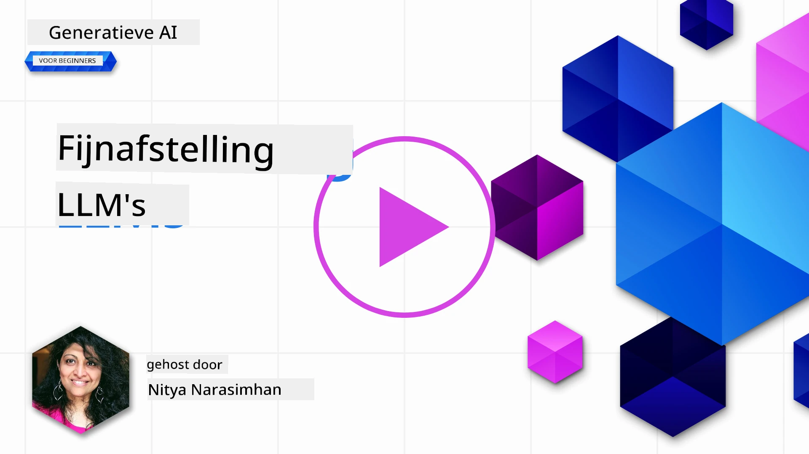

# Je LLM fijn afstemmen

Het gebruik van grote taalmodellen om generatieve AI-toepassingen te bouwen brengt nieuwe uitdagingen met zich mee. Een belangrijk vraagstuk is het waarborgen van de responskwaliteit (nauwkeurigheid en relevantie) in door het model gegenereerde inhoud voor een gegeven gebruikersverzoek. In eerdere lessen hebben we technieken besproken zoals prompt engineering en retrieval-augmented generation die proberen het probleem op te lossen door _de prompt-invoer_ naar het bestaande model te _wijzigen_.

In de les van vandaag bespreken we een derde techniek, **fine-tuning**, die probeert de uitdaging aan te pakken door _het model zelf opnieuw te trainen_ met aanvullende data. Laten we in de details duiken.

## Leerdoelen

Deze les introduceert het concept van fine-tuning voor voorgetrainde taalmodellen, verkent de voordelen en uitdagingen van deze aanpak, en geeft advies over wanneer en hoe je fine-tuning kunt gebruiken om de prestaties van je generatieve AI-modellen te verbeteren.

Aan het einde van deze les moet je de volgende vragen kunnen beantwoorden:

- Wat is fine-tuning voor taalmodellen?
- Wanneer en waarom is fine-tuning nuttig?
- Hoe kan ik een voorgetraind model fijn afstemmen?
- Wat zijn de beperkingen van fine-tuning?

Klaar? Laten we beginnen.

## Geïllustreerde gids

Wil je eerst het grote geheel zien van wat we zullen behandelen voordat we erin duiken? Bekijk deze geïllustreerde gids die de leerreis voor deze les beschrijft – van het leren van de kernconcepten en motivatie voor fine-tuning tot het begrijpen van het proces en best practices voor het uitvoeren van de fine-tuning taak. Dit is een fascinerend onderwerp om te verkennen, dus vergeet niet de [Bronnen](./RESOURCES.md?WT.mc_id=academic-105485-koreyst) pagina te bekijken voor extra links ter ondersteuning van je zelfgestuurde leertraject!

## Wat is fine-tuning voor taalmodellen?

Grofweg zijn grote taalmodellen _voorgetraind_ op grote hoeveelheden tekst afkomstig van diverse bronnen, waaronder het internet. Zoals we in eerdere lessen hebben geleerd, hebben we technieken nodig zoals _prompt engineering_ en _retrieval-augmented generation_ om de kwaliteit van de reacties van het model op de vragen ("prompts") van de gebruiker te verbeteren.

Een populaire prompt-engineering techniek omvat het geven van meer sturing aan het model over wat er in de reactie wordt verwacht, hetzij door _instructies_ te geven (explisiete begeleiding) of _door het model een paar voorbeelden te geven_ (impliciete begeleiding). Dit wordt aangeduid als _few-shot learning_, maar het kent twee beperkingen:

- Tokenlimieten van het model kunnen het aantal voorbeelden beperken dat je kunt geven, en zo de effectiviteit beperken.
- Tokenkosten kunnen het duur maken om voorbeelden aan elke prompt toe te voegen, wat de flexibiliteit beperkt.

Fine-tuning is een gangbare praktijk in machine learning systemen waarbij we een voorgetraind model nemen en het opnieuw trainen met nieuwe data om de prestaties voor een specifieke taak te verbeteren. In de context van taalmodellen kunnen we het voorgetrainde model _fijn afstemmen met een zorgvuldig samengestelde set voorbeelden voor een bepaalde taak of toepassingsgebied_ om een **aangepast model** te creëren dat mogelijk nauwkeuriger en relevanter is voor die specifieke taak of dat domein. Een nevenvoordeel van fine-tuning is dat het ook het aantal benodigde voorbeelden voor few-shot learning kan verminderen – waardoor het tokengebruik en de bijbehorende kosten afnemen.

## Wanneer en waarom zouden we modellen moeten fijn afstemmen?

In _deze_ context betekent fine-tuning dat we het hebben over **supervised** fine-tuning waarbij het opnieuw trainen wordt gedaan door **toevoegen van nieuwe data** die niet deel uitmaakte van de originele trainingsdataset. Dit is anders dan een unsupervised fine-tuning aanpak waarbij het model opnieuw wordt getraind op de originele data, maar met andere hyperparameters.

Het belangrijkste om te onthouden is dat fine-tuning een gevorderde techniek is die een bepaald niveau van expertise vereist om de gewenste resultaten te bereiken. Als het verkeerd wordt gedaan, kan het zijn dat het niet de verwachte verbeteringen oplevert, en het kan zelfs de prestaties van het model voor jouw gerichte domein verslechteren.

Dus, voordat je leert "hoe" je taalmodellen kunt fijn afstemmen, moet je weten "waarom" je deze route zou moeten nemen, en "wanneer" je het proces van fine-tuning moet starten. Begin met jezelf deze vragen te stellen:

- **Use case**: Wat is je _use case_ voor fine-tuning? Welk aspect van het huidige voorgetrainde model wil je verbeteren?
- **Alternatieven**: Heb je al _andere technieken_ geprobeerd om de gewenste resultaten te bereiken? Gebruik deze als referentiepunt.
  - Prompt engineering: Probeer technieken zoals few-shot prompting met voorbeelden van relevante prompt-antwoorden. Evalueer de kwaliteit van de antwoorden.
  - Retrieval Augmented Generation: Probeer prompts aan te vullen met zoekresultaten die uit je data zijn opgehaald. Evalueer de kwaliteit van de antwoorden.
- **Kosten**: Heb je de kosten voor fine-tuning in kaart gebracht?
  - Afstemming - is het voorgetrainde model beschikbaar voor fine-tuning?
  - Inspanning - voor het voorbereiden van trainingsdata, evalueren en verfijnen van het model.
  - Rekenkracht - voor het uitvoeren van fine-tuning taken en het inzetten van het fijn afgestelde model.
  - Data - toegang tot voldoende kwalitatieve voorbeelden voor impact van fine-tuning.
- **Voordelen**: Heb je de voordelen van fine-tuning bevestigd?
  - Kwaliteit - presteerde het fijn afgestelde model beter dan de basislijn?
  - Kosten - vermindert het tokengebruik door eenvoudiger prompts?
  - Uitbreidbaarheid - kun je het basismodel hergebruiken voor nieuwe domeinen?

Door deze vragen te beantwoorden, moet je kunnen beslissen of fine-tuning de juiste aanpak is voor jouw use case. Idealiter is deze aanpak alleen geldig als de voordelen zwaarder wegen dan de kosten. Zodra je besluit door te gaan, is het tijd om na te denken over _hoe_ je het voorgetrainde model kunt fijn afstemmen.

Wil je meer inzicht in het beslissingsproces? Kijk naar [To fine-tune or not to fine-tune](https://www.youtube.com/watch?v=0Jo-z-MFxJs)

## Hoe kunnen we een voorgetraind model fijn afstemmen?

Om een voorgetraind model fijn af te stemmen, heb je nodig:

- een voorgetraind model om fijn af te stemmen
- een dataset om te gebruiken voor fine-tuning
- een trainingsomgeving om de fine-tuning taak uit te voeren
- een hostingomgeving om het fijn afgestelde model te deployen

## Fine-tuning in actie

De volgende bronnen bieden stapsgewijze tutorials die je meenemen door een echt voorbeeld met een geselecteerd model en een zorgvuldig samengestelde dataset. Om deze tutorials te doorlopen, heb je een account nodig bij de betreffende provider, evenals toegang tot het relevante model en datasets.

| Provider     | Tutorial                                                                                                                                                                       | Beschrijving                                                                                                                                                                                                                                                                                                                                                                                                                       |
| ------------ | ------------------------------------------------------------------------------------------------------------------------------------------------------------------------------ | --------------------------------------------------------------------------------------------------------------------------------------------------------------------------------------------------------------------------------------------------------------------------------------------------------------------------------------------------------------------------------------------------------------------------------- |
| OpenAI       | [How to fine-tune chat models](https://github.com/openai/openai-cookbook/blob/main/examples/How_to_finetune_chat_models.ipynb?WT.mc_id=academic-105485-koreyst)                | Leer hoe je een `gpt-35-turbo` kunt fijn afstemmen voor een specifiek domein ("receptassistent") door trainingsdata voor te bereiden, de fine-tuning taak uit te voeren, en het fijn afgestelde model te gebruiken voor inferentie.                                                                                                                                                                                               |
| Azure OpenAI | [GPT 3.5 Turbo fine-tuning tutorial](https://learn.microsoft.com/azure/ai-services/openai/tutorials/fine-tune?tabs=python-new%2Ccommand-line?WT.mc_id=academic-105485-koreyst) | Leer hoe je een `gpt-35-turbo-0613` model **op Azure** kunt fijn afstemmen door stappen te volgen om trainingsdata te creëren en te uploaden, de fine-tuning taak uit te voeren, het nieuwe model te deployen en te gebruiken.                                                                                                                                                                                                  |
| Hugging Face | [Fine-tuning LLMs with Hugging Face](https://www.philschmid.de/fine-tune-llms-in-2024-with-trl?WT.mc_id=academic-105485-koreyst)                                               | Deze blogpost laat zien hoe je een _open LLM_ (bijv. `CodeLlama 7B`) kunt fijn afstemmen met behulp van de [transformers](https://huggingface.co/docs/transformers/index?WT.mc_id=academic-105485-koreyst) bibliotheek & [Transformer Reinforcement Learning (TRL)](https://huggingface.co/docs/trl/index?WT.mc_id=academic-105485-koreyst) met open [datasets](https://huggingface.co/docs/datasets/index?WT.mc_id=academic-105485-koreyst) op Hugging Face.      |
|              |                                                                                                                                                                                |                                                                                                                                                                                                                                                                                                                                                                                                                                   |
| 🤗 AutoTrain | [Fine-tuning LLMs with AutoTrain](https://github.com/huggingface/autotrain-advanced/?WT.mc_id=academic-105485-koreyst)                                                         | AutoTrain (of AutoTrain Advanced) is een pythonbibliotheek ontwikkeld door Hugging Face die fine-tuning voor veel verschillende taken mogelijk maakt, inclusief LLM fine-tuning. AutoTrain is een no-code oplossing en fine-tuning kan in je eigen cloud, op Hugging Face Spaces of lokaal worden uitgevoerd. Het ondersteunt zowel een webgebaseerde GUI, CLI als training via yaml-configuratiebestanden.                                      |
|              |                                                                                                                                                                                |                                                                                                                                                                                                                                                                                                                                                                                                                                   |
| 🦥 Unsloth   | [Fine-tuning LLMs with Unsloth](https://github.com/unslothai/unsloth)                                                                                                          | Unsloth is een open-source framework dat LLM fine-tuning en reinforcement learning (RL) ondersteunt. Unsloth vereenvoudigt lokaal trainen, evalueren en deployen met kant-en-klare [notebooks](https://github.com/unslothai/notebooks). Het ondersteunt ook text-to-speech (TTS), BERT en multimodale modellen. Om te beginnen, lees hun stapsgewijze [Fine-tuning LLMs Guide](https://docs.unsloth.ai/get-started/fine-tuning-llms-guide).                            |
|              |                                                                                                                                                                                |                                                                                                                                                                                                                                                                                                                                                                                                                                   |
## Opdracht

Kies een van de bovenstaande tutorials en doorloop deze. _We kunnen een versie van deze tutorials repliceren in Jupyter Notebooks in deze repo ter referentie. Gebruik direct de originele bronnen om de nieuwste versies te verkrijgen_.

## Geweldig werk! Ga door met leren.

Na het voltooien van deze les, bekijk onze [Generative AI Learning collectie](https://aka.ms/genai-collection?WT.mc_id=academic-105485-koreyst) om je kennis van Generative AI verder te vergroten!

Gefeliciteerd!! Je hebt de laatste les uit de v2-serie van deze cursus voltooid! Stop niet met leren en bouwen. \*\*Bekijk de [BRONNEN](RESOURCES.md?WT.mc_id=academic-105485-koreyst) pagina voor een lijst met aanvullende suggesties speciaal voor dit onderwerp.

Onze v1-serie van lessen is ook bijgewerkt met meer opdrachten en concepten. Neem dus een minuut om je kennis op te frissen – en [deel je vragen en feedback](https://github.com/microsoft/generative-ai-for-beginners/issues?WT.mc_id=academic-105485-koreyst) om ons te helpen deze lessen voor de community te verbeteren.

---

<!-- CO-OP TRANSLATOR DISCLAIMER START -->
**Disclaimer**:  
Dit document is vertaald met behulp van de AI-vertalingsdienst [Co-op Translator](https://github.com/Azure/co-op-translator). Hoewel wij streven naar nauwkeurigheid, willen wij u erop wijzen dat geautomatiseerde vertalingen fouten of onnauwkeurigheden kunnen bevatten. Het originele document in de oorspronkelijke taal dient als de gezaghebbende bron te worden beschouwd. Voor cruciale informatie wordt professionele menselijke vertaling aanbevolen. Wij zijn niet aansprakelijk voor enig misverstand of verkeerde interpretatie voortvloeiend uit het gebruik van deze vertaling.
<!-- CO-OP TRANSLATOR DISCLAIMER END -->