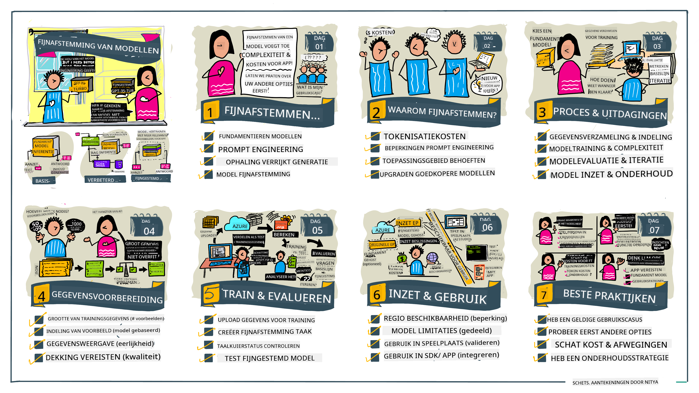

<!--
CO_OP_TRANSLATOR_METADATA:
{
  "original_hash": "68664f7e754a892ae1d8d5e2b7bd2081",
  "translation_date": "2025-05-20T07:51:57+00:00",
  "source_file": "18-fine-tuning/README.md",
  "language_code": "nl"
}
-->

# Het Fijnstemmen van je LLM

Het gebruik van grote taalmodellen om generatieve AI-toepassingen te bouwen brengt nieuwe uitdagingen met zich mee. Een belangrijk probleem is het waarborgen van de kwaliteit van de antwoorden (nauwkeurigheid en relevantie) in de inhoud die door het model wordt gegenereerd voor een specifieke gebruikersvraag. In eerdere lessen bespraken we technieken zoals prompt engineering en retrieval-augmented generation die proberen het probleem op te lossen door _de promptinput_ aan het bestaande model aan te passen.

In de les van vandaag bespreken we een derde techniek, **fijnstemmen**, die probeert de uitdaging aan te pakken door _het model zelf te hertrainen_ met extra gegevens. Laten we de details induiken.

## Leerdoelen

Deze les introduceert het concept van fijnstemmen voor voorgetrainde taalmodellen, onderzoekt de voordelen en uitdagingen van deze aanpak, en geeft richtlijnen over wanneer en hoe fijnstemmen te gebruiken om de prestaties van je generatieve AI-modellen te verbeteren.

Aan het einde van deze les zou je de volgende vragen moeten kunnen beantwoorden:

- Wat is fijnstemmen voor taalmodellen?
- Wanneer en waarom is fijnstemmen nuttig?
- Hoe kan ik een voorgetraind model fijnstemmen?
- Wat zijn de beperkingen van fijnstemmen?

Klaar? Laten we beginnen.

## Geïllustreerde Gids

Wil je het grote geheel zien van wat we zullen behandelen voordat we erin duiken? Bekijk deze geïllustreerde gids die de leerreis voor deze les beschrijft - van het leren van de kernconcepten en motivatie voor fijnstemmen, tot het begrijpen van het proces en de beste praktijken voor het uitvoeren van de fijnstemtaak. Dit is een fascinerend onderwerp om te verkennen, dus vergeet niet de [Resources](./RESOURCES.md?WT.mc_id=academic-105485-koreyst) pagina te bekijken voor extra links om je zelfgeleide leerreis te ondersteunen!

## Wat is fijnstemmen voor taalmodellen?

Grote taalmodellen zijn per definitie _voorgetraind_ op grote hoeveelheden tekst uit diverse bronnen, waaronder het internet. Zoals we in eerdere lessen hebben geleerd, hebben we technieken nodig zoals _prompt engineering_ en _retrieval-augmented generation_ om de kwaliteit van de antwoorden van het model op de vragen van de gebruiker ("prompts") te verbeteren.

Een populaire prompt-engineeringtechniek houdt in dat het model meer begeleiding krijgt over wat er in het antwoord wordt verwacht, hetzij door _instructies_ te geven (expliciete begeleiding) of _een paar voorbeelden te geven_ (impliciete begeleiding). Dit wordt _few-shot learning_ genoemd, maar het heeft twee beperkingen:

- Modeltokenlimieten kunnen het aantal voorbeelden dat je kunt geven beperken en de effectiviteit beperken.
- Modeltokencosten kunnen het duur maken om voorbeelden aan elke prompt toe te voegen, en de flexibiliteit beperken.

Fijnstemmen is een gebruikelijke praktijk in machineleersystemen waarbij we een voorgetraind model nemen en het opnieuw trainen met nieuwe gegevens om de prestaties op een specifieke taak te verbeteren. In de context van taalmodellen kunnen we het voorgetrainde model _fijnstemmen met een samengestelde set van voorbeelden voor een bepaalde taak of toepassingsdomein_ om een **aangepast model** te creëren dat mogelijk nauwkeuriger en relevanter is voor die specifieke taak of dat domein. Een bijkomend voordeel van fijnstemmen is dat het ook het aantal benodigde voorbeelden voor few-shot learning kan verminderen - waardoor tokengebruik en gerelateerde kosten worden verminderd.

## Wanneer en waarom moeten we modellen fijnstemmen?

In _deze_ context, wanneer we het hebben over fijnstemmen, verwijzen we naar **gecontroleerd** fijnstemmen waarbij het hertrainen wordt gedaan door **nieuwe gegevens toe te voegen** die geen deel uitmaakten van de oorspronkelijke trainingsdataset. Dit verschilt van een ongecontroleerde fijnstemaanpak waarbij het model opnieuw wordt getraind op de oorspronkelijke gegevens, maar met andere hyperparameters.

Het belangrijkste om te onthouden is dat fijnstemmen een geavanceerde techniek is die een bepaald niveau van expertise vereist om de gewenste resultaten te behalen. Als het verkeerd wordt gedaan, kan het mogelijk niet de verwachte verbeteringen bieden, en kan het zelfs de prestaties van het model voor je gerichte domein verslechteren.

Dus, voordat je leert "hoe" je taalmodellen moet fijnstemmen, moet je weten "waarom" je deze route zou moeten nemen, en "wanneer" je het proces van fijnstemmen moet starten. Begin met jezelf de volgende vragen te stellen:

- **Gebruikssituatie**: Wat is je _gebruikssituatie_ voor fijnstemmen? Welk aspect van het huidige voorgetrainde model wil je verbeteren?
- **Alternatieven**: Heb je _andere technieken_ geprobeerd om de gewenste resultaten te bereiken? Gebruik ze om een basislijn voor vergelijking te creëren.
  - Prompt engineering: Probeer technieken zoals few-shot prompting met voorbeelden van relevante promptantwoorden. Evalueer de kwaliteit van de antwoorden.
  - Retrieval Augmented Generation: Probeer prompts aan te vullen met zoekresultaten die door je gegevens zijn opgehaald. Evalueer de kwaliteit van de antwoorden.
- **Kosten**: Heb je de kosten voor fijnstemmen geïdentificeerd?
  - Afstembaarheid - is het voorgetrainde model beschikbaar voor fijnstemmen?
  - Inspanning - voor het voorbereiden van trainingsgegevens, evalueren en verfijnen van het model.
  - Rekenkracht - voor het uitvoeren van fijnstemopdrachten en het implementeren van het fijngetunede model.
  - Gegevens - toegang tot voldoende kwaliteitsvoorbeelden voor fijnstemmingsimpact.
- **Voordelen**: Heb je de voordelen van fijnstemmen bevestigd?
  - Kwaliteit - presteerde het fijngetunede model beter dan de basislijn?
  - Kosten - vermindert het het tokengebruik door prompts te vereenvoudigen?
  - Uitbreidbaarheid - kun je het basismodel hergebruiken voor nieuwe domeinen?

Door deze vragen te beantwoorden, zou je moeten kunnen beslissen of fijnstemmen de juiste aanpak is voor je gebruikssituatie. Idealiter is de aanpak alleen geldig als de voordelen opwegen tegen de kosten. Zodra je besluit door te gaan, is het tijd om na te denken over _hoe_ je het voorgetrainde model kunt fijnstemmen.

Wil je meer inzicht krijgen in het beslissingsproces? Bekijk [To fine-tune or not to fine-tune](https://www.youtube.com/watch?v=0Jo-z-MFxJs)

## Hoe kunnen we een voorgetraind model fijnstemmen?

Om een voorgetraind model fijn te stemmen, heb je nodig:

- een voorgetraind model om fijn te stemmen
- een dataset om te gebruiken voor fijnstemmen
- een trainingsomgeving om de fijnstemopdracht uit te voeren
- een hostingomgeving om het fijngetunede model te implementeren

## Fijnstemmen in Actie

De volgende bronnen bieden stapsgewijze tutorials om je door een echt voorbeeld te leiden met een geselecteerd model en een samengestelde dataset. Om deze tutorials te doorlopen, heb je een account nodig bij de specifieke provider, samen met toegang tot het relevante model en datasets.

| Provider     | Tutorial                                                                                                                                                                       | Beschrijving                                                                                                                                                                                                                                                                                                                                                                                                                        |
| ------------ | ------------------------------------------------------------------------------------------------------------------------------------------------------------------------------ | ----------------------------------------------------------------------------------------------------------------------------------------------------------------------------------------------------------------------------------------------------------------------------------------------------------------------------------------------------------------------------------------------------------------------------------- |
| OpenAI       | [How to fine-tune chat models](https://github.com/openai/openai-cookbook/blob/main/examples/How_to_finetune_chat_models.ipynb?WT.mc_id=academic-105485-koreyst)                | Leer een `gpt-35-turbo` fijn te stemmen voor een specifiek domein ("receptassistent") door trainingsgegevens voor te bereiden, de fijnstemopdracht uit te voeren en het fijngetunede model te gebruiken voor inferentie.                                                                                                                                                                                                                                               |
| Azure OpenAI | [GPT 3.5 Turbo fine-tuning tutorial](https://learn.microsoft.com/azure/ai-services/openai/tutorials/fine-tune?tabs=python-new%2Ccommand-line?WT.mc_id=academic-105485-koreyst) | Leer een `gpt-35-turbo-0613` model **op Azure** fijn te stemmen door stappen te ondernemen om trainingsgegevens te maken en te uploaden, de fijnstemopdracht uit te voeren. Implementeer en gebruik het nieuwe model.                                                                                                                                                                                                                                                          |
| Hugging Face | [Fine-tuning LLMs with Hugging Face](https://www.philschmid.de/fine-tune-llms-in-2024-with-trl?WT.mc_id=academic-105485-koreyst)                                               | Deze blogpost begeleidt je bij het fijnstemmen van een _open LLM_ (bijv. `CodeLlama 7B`) met behulp van de [transformers](https://huggingface.co/docs/transformers/index?WT.mc_id=academic-105485-koreyst) bibliotheek en [Transformer Reinforcement Learning (TRL)](https://huggingface.co/docs/trl/index?WT.mc_id=academic-105485-koreyst]) met open [datasets](https://huggingface.co/docs/datasets/index?WT.mc_id=academic-105485-koreyst) op Hugging Face. |
|              |                                                                                                                                                                                |                                                                                                                                                                                                                                                                                                                                                                                                                                     |
| 🤗 AutoTrain | [Fine-tuning LLMs with AutoTrain](https://github.com/huggingface/autotrain-advanced/?WT.mc_id=academic-105485-koreyst)                                                         | AutoTrain (of AutoTrain Advanced) is een python-bibliotheek ontwikkeld door Hugging Face die fijnstemmen voor veel verschillende taken mogelijk maakt, inclusief LLM fijnstemmen. AutoTrain is een no-code oplossing en fijnstemmen kan worden gedaan in je eigen cloud, op Hugging Face Spaces of lokaal. Het ondersteunt zowel een webgebaseerde GUI, CLI en training via yaml-configuratiebestanden.                                                              |
|              |                                                                                                                                                                                |                                                                                                                                                                                                                                                                                                                                                                                                                                     |

## Opdracht

Selecteer een van de bovenstaande tutorials en doorloop deze. _We kunnen een versie van deze tutorials repliceren in Jupyter Notebooks in deze repo alleen voor referentie. Gebruik de originele bronnen direct om de nieuwste versies te krijgen_.

## Goed Gedaan! Zet je Leerproces Voort.

Na het voltooien van deze les, bekijk onze [Generative AI Learning collection](https://aka.ms/genai-collection?WT.mc_id=academic-105485-koreyst) om je kennis van Generatieve AI verder te verbeteren!

Gefeliciteerd!! Je hebt de laatste les van de v2-serie voor deze cursus voltooid! Stop niet met leren en bouwen. **Bekijk de [RESOURCES](RESOURCES.md?WT.mc_id=academic-105485-koreyst) pagina voor een lijst van aanvullende suggesties voor dit onderwerp.

Onze v1-serie lessen is ook bijgewerkt met meer opdrachten en concepten. Neem dus even de tijd om je kennis op te frissen - en deel alsjeblieft [je vragen en feedback](https://github.com/microsoft/generative-ai-for-beginners/issues?WT.mc_id=academic-105485-koreyst) om ons te helpen deze lessen voor de community te verbeteren.

**Disclaimer**:  
Dit document is vertaald met behulp van de AI-vertalingsdienst [Co-op Translator](https://github.com/Azure/co-op-translator). Hoewel we ons best doen voor nauwkeurigheid, dient u zich ervan bewust te zijn dat geautomatiseerde vertalingen fouten of onnauwkeurigheden kunnen bevatten. Het originele document in zijn oorspronkelijke taal moet worden beschouwd als de gezaghebbende bron. Voor cruciale informatie wordt professionele menselijke vertaling aanbevolen. Wij zijn niet aansprakelijk voor misverstanden of verkeerde interpretaties die voortvloeien uit het gebruik van deze vertaling.