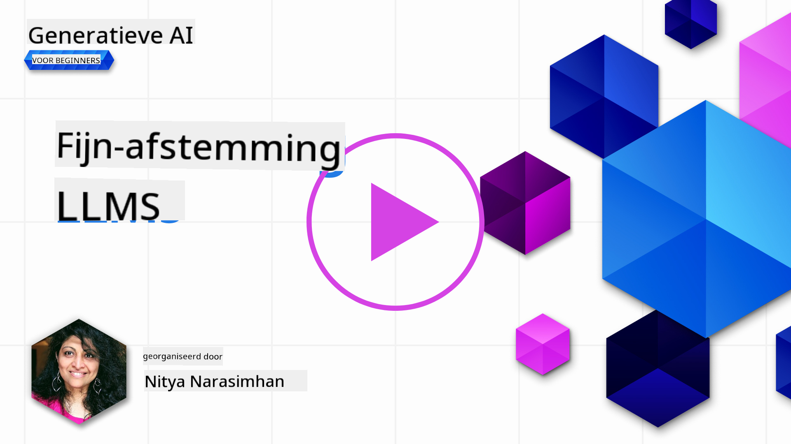
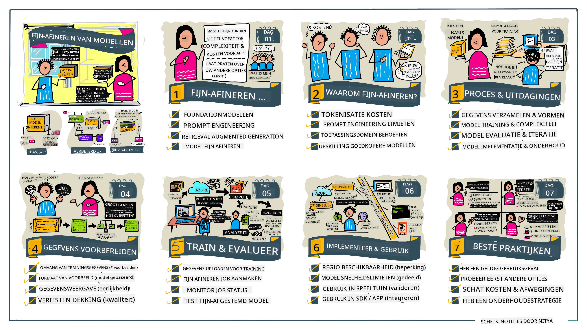

<!--
CO_OP_TRANSLATOR_METADATA:
{
  "original_hash": "68664f7e754a892ae1d8d5e2b7bd2081",
  "translation_date": "2025-06-26T00:45:49+00:00",
  "source_file": "18-fine-tuning/README.md",
  "language_code": "nl"
}
-->

# Fine-Tuning van je LLM

Het gebruik van grote taalmodellen om generatieve AI-toepassingen te bouwen, brengt nieuwe uitdagingen met zich mee. Een belangrijk probleem is het waarborgen van de kwaliteit van de respons (nauwkeurigheid en relevantie) in de inhoud die door het model wordt gegenereerd voor een specifieke gebruikersvraag. In eerdere lessen hebben we technieken besproken zoals prompt engineering en retrieval-augmented generation die proberen het probleem op te lossen door _de promptinvoer_ van het bestaande model aan te passen.

In de les van vandaag bespreken we een derde techniek, **fine-tuning**, die probeert de uitdaging aan te pakken door _het model zelf te hertrainen_ met extra data. Laten we in de details duiken.

## Leerdoelen

Deze les introduceert het concept van fine-tuning voor vooraf getrainde taalmodellen, verkent de voordelen en uitdagingen van deze aanpak en biedt richtlijnen over wanneer en hoe je fine-tuning kunt gebruiken om de prestaties van je generatieve AI-modellen te verbeteren.

Aan het einde van deze les zou je de volgende vragen moeten kunnen beantwoorden:

- Wat is fine-tuning voor taalmodellen?
- Wanneer, en waarom, is fine-tuning nuttig?
- Hoe kan ik een vooraf getraind model fine-tunen?
- Wat zijn de beperkingen van fine-tuning?

Klaar? Laten we beginnen.

## Geïllustreerde Gids

Wil je het grote geheel zien van wat we gaan behandelen voordat we erin duiken? Bekijk deze geïllustreerde gids die de leerreis voor deze les beschrijft - van het leren van de kernconcepten en motivatie voor fine-tuning, tot het begrijpen van het proces en de beste praktijken voor het uitvoeren van de fine-tuningtaak. Dit is een fascinerend onderwerp om te verkennen, dus vergeet niet de [Resources](./RESOURCES.md?WT.mc_id=academic-105485-koreyst) pagina te bekijken voor extra links ter ondersteuning van je zelfgestuurde leerreis!

## Wat is fine-tuning voor taalmodellen?

Grote taalmodellen zijn per definitie _vooraf getraind_ op grote hoeveelheden tekst afkomstig van diverse bronnen, waaronder het internet. Zoals we in eerdere lessen hebben geleerd, hebben we technieken nodig zoals _prompt engineering_ en _retrieval-augmented generation_ om de kwaliteit van de reacties van het model op de vragen van de gebruiker ("prompts") te verbeteren.

Een populaire prompt-engineering techniek houdt in dat je het model meer richtlijnen geeft over wat er in de respons wordt verwacht, hetzij door _instructies_ (expliciete begeleiding) te geven of _enkele voorbeelden te geven_ (impliciete begeleiding). Dit wordt _few-shot learning_ genoemd, maar het heeft twee beperkingen:

- Beperkingen van modeltokens kunnen het aantal voorbeelden dat je kunt geven beperken en de effectiviteit beperken.
- De kosten van modeltokens kunnen het duur maken om aan elke prompt voorbeelden toe te voegen en de flexibiliteit beperken.

Fine-tuning is een gangbare praktijk in machineleersystemen waarbij we een vooraf getraind model nemen en het hertrainen met nieuwe gegevens om de prestaties op een specifieke taak te verbeteren. In de context van taalmodellen kunnen we het vooraf getrainde model _fijn afstemmen met een zorgvuldig samengestelde set voorbeelden voor een bepaalde taak of toepassingsdomein_ om een **aangepast model** te creëren dat mogelijk nauwkeuriger en relevanter is voor die specifieke taak of dat domein. Een bijkomend voordeel van fine-tuning is dat het ook het aantal benodigde voorbeelden voor few-shot learning kan verminderen - waardoor het tokengebruik en de gerelateerde kosten worden verminderd.

## Wanneer en waarom moeten we modellen fine-tunen?

In _deze_ context, als we het hebben over fine-tuning, verwijzen we naar **supervised** fine-tuning waarbij het hertrainen wordt gedaan door **nieuwe gegevens toe te voegen** die geen deel uitmaakten van de oorspronkelijke trainingsdataset. Dit verschilt van een unsupervised fine-tuning benadering waarbij het model wordt hertraind op de oorspronkelijke gegevens, maar met verschillende hyperparameters.

Het belangrijkste om te onthouden is dat fine-tuning een geavanceerde techniek is die een bepaald niveau van expertise vereist om de gewenste resultaten te behalen. Als het verkeerd wordt uitgevoerd, kan het mogelijk niet de verwachte verbeteringen opleveren en zelfs de prestaties van het model voor je doelgebied verslechteren.

Dus, voordat je leert "hoe" je taalmodellen kunt fine-tunen, moet je weten "waarom" je deze route zou moeten nemen en "wanneer" je het proces van fine-tuning moet starten. Begin met jezelf deze vragen te stellen:

- **Use Case**: Wat is je _use case_ voor fine-tuning? Welk aspect van het huidige vooraf getrainde model wil je verbeteren?
- **Alternatieven**: Heb je _andere technieken_ geprobeerd om de gewenste resultaten te bereiken? Gebruik ze om een basislijn voor vergelijking te creëren.
  - Prompt engineering: Probeer technieken zoals few-shot prompting met voorbeelden van relevante promptantwoorden. Evalueer de kwaliteit van de antwoorden.
  - Retrieval Augmented Generation: Probeer prompts aan te vullen met zoekresultaten die zijn verkregen door je gegevens te doorzoeken. Evalueer de kwaliteit van de antwoorden.
- **Kosten**: Heb je de kosten voor fine-tuning geïdentificeerd?
  - Afstembaarheid - is het vooraf getrainde model beschikbaar voor fine-tuning?
  - Inspanning - voor het voorbereiden van trainingsgegevens, evalueren en verfijnen van het model.
  - Rekenkracht - voor het uitvoeren van fine-tuning taken en het implementeren van het fijn afgestemde model
  - Gegevens - toegang tot voldoende kwaliteitsvoorbeelden voor fine-tuning impact
- **Voordelen**: Heb je de voordelen van fine-tuning bevestigd?
  - Kwaliteit - presteerde het fijn afgestemde model beter dan de basislijn?
  - Kosten - vermindert het het tokengebruik door prompts te vereenvoudigen?
  - Uitbreidbaarheid - kun je het basismodel hergebruiken voor nieuwe domeinen?

Door deze vragen te beantwoorden, zou je moeten kunnen beslissen of fine-tuning de juiste aanpak is voor je use case. Idealiter is de aanpak alleen geldig als de voordelen opwegen tegen de kosten. Zodra je besluit door te gaan, is het tijd om na te denken over _hoe_ je het vooraf getrainde model kunt fine-tunen.

Wil je meer inzicht krijgen in het besluitvormingsproces? Bekijk [To fine-tune or not to fine-tune](https://www.youtube.com/watch?v=0Jo-z-MFxJs)

## Hoe kunnen we een vooraf getraind model fine-tunen?

Om een vooraf getraind model te fine-tunen, heb je nodig:

- een vooraf getraind model om te fine-tunen
- een dataset om te gebruiken voor fine-tuning
- een trainingsomgeving om de fine-tuning taak uit te voeren
- een hostingomgeving om het fijn afgestemde model te implementeren

## Fine-Tuning in Actie

De volgende bronnen bieden stapsgewijze tutorials om je door een echt voorbeeld te leiden met een geselecteerd model en een zorgvuldig samengestelde dataset. Om deze tutorials door te werken, heb je een account nodig bij de specifieke provider, samen met toegang tot het relevante model en datasets.

| Provider     | Tutorial                                                                                                                                                                       | Beschrijving                                                                                                                                                                                                                                                                                                                                                                                                                        |
| ------------ | ------------------------------------------------------------------------------------------------------------------------------------------------------------------------------ | ---------------------------------------------------------------------------------------------------------------------------------------------------------------------------------------------------------------------------------------------------------------------------------------------------------------------------------------------------------------------------------------------------------------------------------- |
| OpenAI       | [How to fine-tune chat models](https://github.com/openai/openai-cookbook/blob/main/examples/How_to_finetune_chat_models.ipynb?WT.mc_id=academic-105485-koreyst)                | Leer een `gpt-35-turbo` fijn af te stemmen voor een specifiek domein ("receptassistent") door trainingsgegevens voor te bereiden, de fine-tuning taak uit te voeren en het fijn afgestemde model voor inferentie te gebruiken.                                                                                                                                                                                                                                              |
| Azure OpenAI | [GPT 3.5 Turbo fine-tuning tutorial](https://learn.microsoft.com/azure/ai-services/openai/tutorials/fine-tune?tabs=python-new%2Ccommand-line?WT.mc_id=academic-105485-koreyst) | Leer een `gpt-35-turbo-0613` model **op Azure** fijn af te stemmen door stappen te nemen om trainingsgegevens te maken en te uploaden, de fine-tuning taak uit te voeren. Implementeer en gebruik het nieuwe model.                                                                                                                                                                                                                                                                 |
| Hugging Face | [Fine-tuning LLMs with Hugging Face](https://www.philschmid.de/fine-tune-llms-in-2024-with-trl?WT.mc_id=academic-105485-koreyst)                                               | Deze blogpost begeleidt je bij het fine-tunen van een _open LLM_ (bijv. `CodeLlama 7B`) met behulp van de [transformers](https://huggingface.co/docs/transformers/index?WT.mc_id=academic-105485-koreyst) bibliotheek & [Transformer Reinforcement Learning (TRL)](https://huggingface.co/docs/trl/index?WT.mc_id=academic-105485-koreyst]) met open [datasets](https://huggingface.co/docs/datasets/index?WT.mc_id=academic-105485-koreyst) op Hugging Face. |
|              |                                                                                                                                                                                |                                                                                                                                                                                                                                                                                                                                                                                                                                    |
| 🤗 AutoTrain | [Fine-tuning LLMs with AutoTrain](https://github.com/huggingface/autotrain-advanced/?WT.mc_id=academic-105485-koreyst)                                                         | AutoTrain (of AutoTrain Advanced) is een pythonbibliotheek ontwikkeld door Hugging Face die finetuning mogelijk maakt voor veel verschillende taken, inclusief LLM finetuning. AutoTrain is een no-code oplossing en finetuning kan worden gedaan in je eigen cloud, op Hugging Face Spaces of lokaal. Het ondersteunt zowel een webgebaseerde GUI, CLI als training via yaml-configuratiebestanden.                                                                               |
|              |                                                                                                                                                                                |                                                                                                                                                                                                                                                                                                                                                                                                                                    |

## Opdracht

Selecteer een van de bovenstaande tutorials en doorloop deze. _We kunnen een versie van deze tutorials repliceren in Jupyter Notebooks in deze repo alleen ter referentie. Gebruik de originele bronnen rechtstreeks om de nieuwste versies te krijgen_.

## Goed Werk! Ga door met je Leren.

Na het voltooien van deze les, bekijk onze [Generative AI Learning collectie](https://aka.ms/genai-collection?WT.mc_id=academic-105485-koreyst) om je kennis van Generatieve AI verder te vergroten!

Gefeliciteerd!! Je hebt de laatste les van de v2-serie voor deze cursus voltooid! Stop niet met leren en bouwen. **Bekijk de [RESOURCES](RESOURCES.md?WT.mc_id=academic-105485-koreyst) pagina voor een lijst met extra suggesties voor alleen dit onderwerp.

Onze v1-serie lessen is ook bijgewerkt met meer opdrachten en concepten. Dus neem even de tijd om je kennis op te frissen - en deel alsjeblieft [je vragen en feedback](https://github.com/microsoft/generative-ai-for-beginners/issues?WT.mc_id=academic-105485-koreyst) om ons te helpen deze lessen voor de community te verbeteren.

**Disclaimer**:  
Dit document is vertaald met behulp van de AI-vertalingsservice [Co-op Translator](https://github.com/Azure/co-op-translator). Hoewel we ons best doen voor nauwkeurigheid, dient u zich ervan bewust te zijn dat geautomatiseerde vertalingen fouten of onnauwkeurigheden kunnen bevatten. Het originele document in zijn oorspronkelijke taal moet als de gezaghebbende bron worden beschouwd. Voor cruciale informatie wordt professionele menselijke vertaling aanbevolen. Wij zijn niet aansprakelijk voor eventuele misverstanden of verkeerde interpretaties die voortvloeien uit het gebruik van deze vertaling.