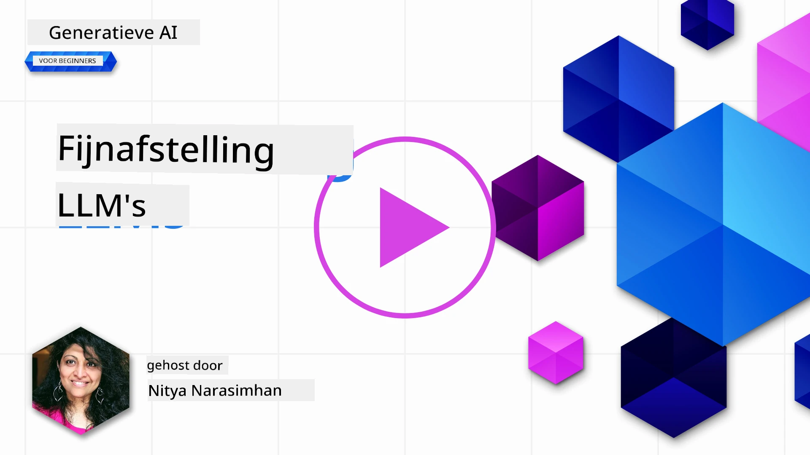
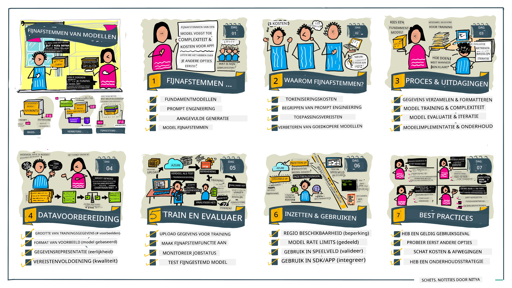

# Het Fijn-afstemmen van je LLM

Het gebruik van grote taalmodellen om generatieve AI-toepassingen te bouwen brengt nieuwe uitdagingen met zich mee. Een belangrijk probleem is het waarborgen van de kwaliteit van de respons (nauwkeurigheid en relevantie) in de inhoud die door het model wordt gegenereerd voor een gegeven gebruikersverzoek. In eerdere lessen bespraken we technieken zoals prompt engineering en retrieval-augmented generation die proberen het probleem op te lossen door _de promptinvoer_ naar het bestaande model te _wijzigen_.

In de les van vandaag bespreken we een derde techniek, **fijn-afstemming**, die probeert de uitdaging aan te pakken door _het model zelf opnieuw te trainen_ met extra data. Laten we dieper op de details ingaan.

## Leerdoelen

Deze les introduceert het concept van fijn-afstemming voor voorgetrainde taalmodellen, verkent de voordelen en uitdagingen van deze aanpak en biedt richtlijnen over wanneer en hoe je fijn-afstemming kunt gebruiken om de prestaties van je generatieve AI-modellen te verbeteren.

Aan het einde van deze les zou je de volgende vragen moeten kunnen beantwoorden:

- Wat is fijn-afstemming voor taalmodellen?
- Wanneer, en waarom, is fijn-afstemming nuttig?
- Hoe kan ik een voorgetraind model fijn-afstemmen?
- Wat zijn de beperkingen van fijn-afstemming?

Klaar? Laten we beginnen.

## Geïllustreerde Gids

Wil je een overzicht van wat we zullen behandelen voordat we erin duiken? Bekijk deze geïllustreerde gids die de leerreis van deze les beschrijft - van het leren van de kernconcepten en motivatie voor fijn-afstemming, tot het begrijpen van het proces en de beste praktijken voor het uitvoeren van de fijn-afstemtaken. Dit is een fascinerend onderwerp om te verkennen, dus vergeet niet de [Resources](./RESOURCES.md?WT.mc_id=academic-105485-koreyst) pagina te raadplegen voor extra links ter ondersteuning van je zelfgestuurde leertraject!

## Wat is fijn-afstemming voor taalmodellen?

Groot taalmodellen zijn per definitie _voorgetraind_ op grote hoeveelheden tekst uit diverse bronnen, waaronder het internet. Zoals we in eerdere lessen hebben geleerd, hebben we technieken nodig zoals _prompt engineering_ en _retrieval-augmented generation_ om de kwaliteit van de antwoorden van het model op de vragen van de gebruiker ("prompts") te verbeteren.

Een populaire prompt-engineering techniek houdt in dat je het model meer leiding geeft over wat er wordt verwacht in de respons, hetzij door _instructies_ (expliciete begeleiding) te geven, hetzij door _enkele voorbeelden te geven_ (impliciete begeleiding). Dit wordt aangeduid als _few-shot learning_ maar heeft twee beperkingen:

- Model-tokenlimieten kunnen het aantal voorbeelden beperken dat je kunt geven, en de effectiviteit verminderen.
- Model-tokenkosten kunnen het duur maken om voorbeelden aan elke prompt toe te voegen, en beperken de flexibiliteit.

Fijn-afstemming is een gebruikelijke praktijk in machine learning systemen waarbij we een voorgetraind model nemen en deze opnieuw trainen met nieuwe data om de prestaties op een specifieke taak te verbeteren. In de context van taalmodellen kunnen we het voorgetrainde model fijn-afstemmen _met een samengestelde set voorbeelden voor een bepaalde taak of toepassingsdomein_ om een **aangepast model** te creëren dat mogelijk nauwkeuriger en relevanter is voor die specifieke taak of dat domein. Een bijkomend voordeel van fijn-afstemming is dat het ook het aantal voorbeelden dat nodig is voor few-shot learning kan verminderen - wat het tokengebruik en de bijbehorende kosten verlaagt.

## Wanneer en waarom zouden we modellen fijn-afstemmen?

In _deze_ context, als we het over fijn-afstemming hebben, bedoelen we **gecontroleerde** fijn-afstemming waarbij het hertrainen wordt gedaan door **nieuwe data toe te voegen** die niet deel uitmaakte van de oorspronkelijke trainingsdataset. Dit verschilt van een ongecontroleerde fijn-afstemmingsaanpak waarbij het model opnieuw wordt getraind op de originele data, maar met andere hyperparameters.

Het belangrijkste om te onthouden is dat fijn-afstemming een geavanceerde techniek is die een bepaald niveau van expertise vereist om de gewenste resultaten te bereiken. Als het verkeerd wordt gedaan, kan het de verwachte verbeteringen niet opleveren en kan het zelfs de prestaties van het model voor jouw gerichte domein verslechteren.

Dus, voordat je leert "hoe" je taalmodellen fijn-afstemt, moet je weten "waarom" je deze route moet nemen, en "wanneer" je moet beginnen met het proces van fijn-afstemming. Begin met jezelf deze vragen te stellen:

- **Use Case**: Wat is je _use case_ voor fijn-afstemming? Welk aspect van het huidige voorgetrainde model wil je verbeteren?
- **Alternatieven**: Heb je _andere technieken_ geprobeerd om de gewenste resultaten te bereiken? Gebruik deze om een referentiepunt te creëren.
  - Prompt engineering: Probeer technieken zoals few-shot prompting met voorbeelden van relevante promptantwoorden. Evalueer de kwaliteit van de antwoorden.
  - Retrieval Augmented Generation: Probeer prompts aan te vullen met queryresultaten die zijn opgehaald door het doorzoeken van je data. Evalueer de kwaliteit van de antwoorden.
- **Kosten**: Heb je de kosten voor fijn-afstemming geïdentificeerd?
  - Afstembaarheid - is het voorgetrainde model beschikbaar voor fijn-afstemming?
  - Inspanning - voor het voorbereiden van trainingsdata, evalueren en verfijnen van het model.
  - Berekening - voor het uitvoeren van fijn-afstemtaken en het deployen van het fijn-afgestelde model.
  - Data - toegang tot voldoende kwalitatieve voorbeelden voor effectieve fijn-afstemming.
- **Voordelen**: Heb je de voordelen van fijn-afstemming bevestigd?
  - Kwaliteit - presteert het fijn-afgestelde model beter dan de basislijn?
  - Kosten - vermindert het het gebruik van token door prompts te vereenvoudigen?
  - Uitbreidbaarheid - kun je het basismodel hergebruiken voor nieuwe domeinen?

Door deze vragen te beantwoorden, zou je moeten kunnen bepalen of fijn-afstemming de juiste aanpak is voor jouw use case. Idealiter is deze aanpak alleen geldig als de voordelen opwegen tegen de kosten. Zodra je besluit om door te gaan, is het tijd om na te denken over _hoe_ je het voorgetrainde model fijn kunt afstemmen.

Wil je meer inzichten over het besluitvormingsproces? Bekijk [Fijn-afstemmen of niet fijn-afstemmen](https://www.youtube.com/watch?v=0Jo-z-MFxJs)

## Hoe kunnen we een voorgetraind model fijn-afstemmen?

Om een voorgetraind model fijn-af te stemmen, heb je het volgende nodig:

- een voorgetraind model om fijn-af te stemmen
- een dataset voor fijn-afstemming
- een trainingsomgeving om de fijn-afstemming uit te voeren
- een hostingomgeving om het fijn-afgestelde model te implementeren

## Fijn-afstemming in de praktijk

De volgende bronnen bieden stapsgewijze tutorials die je door een echt voorbeeld leiden met een geselecteerd model en een samengestelde dataset. Om deze tutorials te doorlopen, heb je een account nodig bij de specifieke provider, samen met toegang tot het relevante model en de datasets.

| Provider     | Tutorial                                                                                                                                                                       | Beschrijving                                                                                                                                                                                                                                                                                                                                                                                                                        |
| ------------ | ------------------------------------------------------------------------------------------------------------------------------------------------------------------------------ | ---------------------------------------------------------------------------------------------------------------------------------------------------------------------------------------------------------------------------------------------------------------------------------------------------------------------------------------------------------------------------------------------------------------------------------- |
| OpenAI       | [Hoe chatmodellen fijn-afstemmen](https://github.com/openai/openai-cookbook/blob/main/examples/How_to_finetune_chat_models.ipynb?WT.mc_id=academic-105485-koreyst)                | Leer hoe je een `gpt-35-turbo` fijn-afstemt voor een specifiek domein ("receptassistent") door trainingsdata voor te bereiden, de fijn-afstemming uit te voeren en het fijn-afgestelde model te gebruiken voor inferentie.                                                                                                                                                                                                             |
| Azure OpenAI | [GPT 3.5 Turbo fijn-afstemming tutorial](https://learn.microsoft.com/azure/ai-services/openai/tutorials/fine-tune?tabs=python-new%2Ccommand-line&WT.mc_id=academic-105485-koreyst) | Leer hoe je een `gpt-35-turbo-0613` model **op Azure** fijn-afstemt door stappen te volgen om trainingsdata te maken en te uploaden, de fijn-afstemming uit te voeren, het nieuwe model te deployen en te gebruiken.                                                                                                                                                                                                                   |
| Hugging Face | [Fijn-afstemmen van LLMs met Hugging Face](https://www.philschmid.de/fine-tune-llms-in-2024-with-trl?WT.mc_id=academic-105485-koreyst)                                               | Deze blogpost leidt je door het fijn-afstemmen van een _open LLM_ (bijv. `CodeLlama 7B`) met de [transformers](https://huggingface.co/docs/transformers/index?WT.mc_id=academic-105485-koreyst) bibliotheek & [Transformer Reinforcement Learning (TRL)](https://huggingface.co/docs/trl/index?WT.mc_id=academic-105485-koreyst) met open [datasets](https://huggingface.co/docs/datasets/index?WT.mc_id=academic-105485-koreyst) op Hugging Face. |
|              |                                                                                                                                                                                |                                                                                                                                                                                                                                                                                                                                                                                                                                    |
| 🤗 AutoTrain | [Fijn-afstemmen van LLMs met AutoTrain](https://github.com/huggingface/autotrain-advanced/?WT.mc_id=academic-105485-koreyst)                                                         | AutoTrain (of AutoTrain Advanced) is een python bibliotheek ontwikkeld door Hugging Face waarmee fijn-afstemming voor veel verschillende taken mogelijk is, waaronder LLM fijn-afstemming. AutoTrain is een no-code oplossing en fijn-afstemming kan worden gedaan op je eigen cloud, Hugging Face Spaces of lokaal. Het ondersteunt zowel een webgebaseerde GUI, CLI als training via yaml-configuratiebestanden.                                     |
|              |                                                                                                                                                                                |                                                                                                                                                                                                                                                                                                                                                                                                                                    |
| 🦥 Unsloth | [Fijn-afstemmen van LLMs met Unsloth](https://github.com/unslothai/unsloth)                                                         | Unsloth is een open-source framework dat fijn-afstemming en reinforcement learning (RL) voor LLMs ondersteunt. Unsloth vereenvoudigt lokaal trainen, evalueren en implementeren met kant-en-klare [notebooks](https://github.com/unslothai/notebooks). Het ondersteunt ook text-to-speech (TTS), BERT en multimodale modellen. Om te beginnen, lees hun stapsgewijze [Fijn-afstemmen van LLMs Gids](https://docs.unsloth.ai/get-started/fine-tuning-llms-guide).              |
|              |                                                                                                                                                                                |                                                                                                                                                                                                                                                                                                                                                                                                                                    |
## Opdracht

Kies een van de bovenstaande tutorials en doorloop deze. _We kunnen een versie van deze tutorials in Jupyter Notebooks binnen deze repository repliceren ter referentie. Gebruik de originele bronnen direct om de nieuwste versies te krijgen_.

## Goed Werk! Ga Door met Leren.

Na het voltooien van deze les, bekijk onze [Generative AI Learningscollectie](https://aka.ms/genai-collection?WT.mc_id=academic-105485-koreyst) om je kennis over Generatieve AI verder uit te breiden!

Gefeliciteerd!! Je hebt de laatste les uit de v2-serie van deze cursus voltooid! Stop niet met leren en bouwen. \*\*Bekijk de [RESOURCES](RESOURCES.md?WT.mc_id=academic-105485-koreyst) pagina voor een lijst met aanvullende suggesties over dit onderwerp.

Onze v1 serie lessen is ook bijgewerkt met meer opdrachten en concepten. Neem dus even de tijd om je kennis op te frissen - en deel alsjeblieft [je vragen en feedback](https://github.com/microsoft/generative-ai-for-beginners/issues?WT.mc_id=academic-105485-koreyst) om ons te helpen deze lessen voor de community te verbeteren.

---

<!-- CO-OP TRANSLATOR DISCLAIMER START -->
**Disclaimer**:  
Dit document is vertaald met behulp van de AI-vertalingsdienst [Co-op Translator](https://github.com/Azure/co-op-translator). Hoewel we streven naar nauwkeurigheid, dient u er rekening mee te houden dat geautomatiseerde vertalingen fouten of onnauwkeurigheden kunnen bevatten. Het oorspronkelijke document in de originele taal moet als de gezaghebbende bron worden beschouwd. Voor belangrijke informatie wordt professionele menselijke vertaling aanbevolen. Wij zijn niet aansprakelijk voor eventuele misverstanden of verkeerde interpretaties die voortvloeien uit het gebruik van deze vertaling.
<!-- CO-OP TRANSLATOR DISCLAIMER END -->