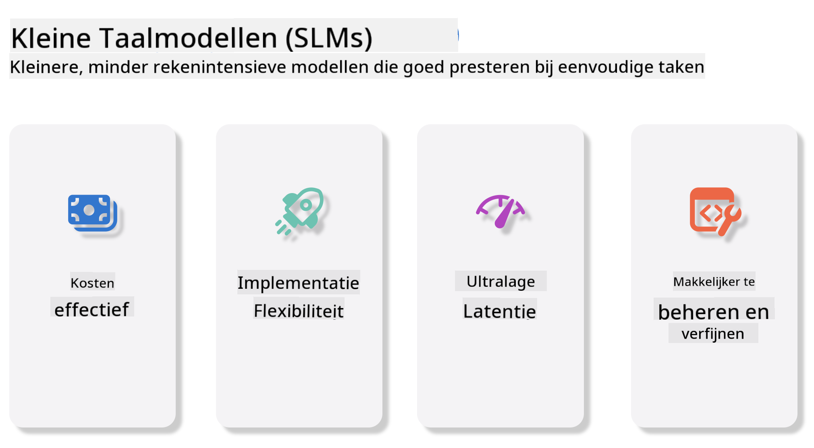
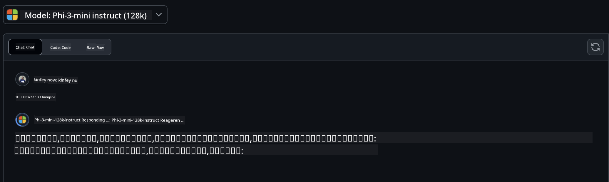
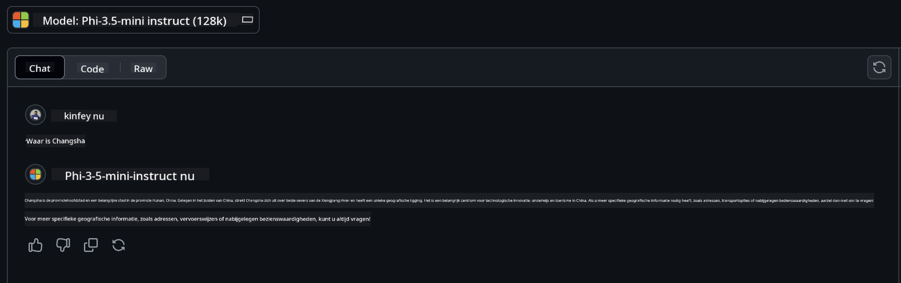

<!--
CO_OP_TRANSLATOR_METADATA:
{
  "original_hash": "124ad36cfe96f74038811b6e2bb93e9d",
  "translation_date": "2025-05-20T10:09:02+00:00",
  "source_file": "19-slm/README.md",
  "language_code": "nl"
}
-->
# Introductie tot Kleine Taalmodellen voor Generatieve AI voor Beginners

Generatieve AI is een fascinerend gebied van kunstmatige intelligentie dat zich richt op het creëren van systemen die in staat zijn nieuwe inhoud te genereren. Deze inhoud kan variëren van tekst en afbeeldingen tot muziek en zelfs volledige virtuele omgevingen. Een van de meest spannende toepassingen van generatieve AI is in het domein van taalmodellen.

## Wat zijn Kleine Taalmodellen?

Een Klein Taalmodel (SLM) vertegenwoordigt een verkleinde variant van een groot taalmodel (LLM), waarbij veel van de architecturale principes en technieken van LLM's worden benut, terwijl het een aanzienlijk verminderd computationeel voetafdruk vertoont. SLM's zijn een subset van taalmodellen ontworpen om mensachtige tekst te genereren. In tegenstelling tot hun grotere tegenhangers, zoals GPT-4, zijn SLM's compacter en efficiënter, waardoor ze ideaal zijn voor toepassingen waar computationele middelen beperkt zijn. Ondanks hun kleinere omvang kunnen ze nog steeds een verscheidenheid aan taken uitvoeren. Typisch worden SLM's geconstrueerd door LLM's te comprimeren of te distilleren, met als doel een substantieel deel van de oorspronkelijke modelfunctionaliteit en taalkundige capaciteiten te behouden. Deze vermindering in modelgrootte vermindert de algehele complexiteit, waardoor SLM's efficiënter worden in termen van zowel geheugengebruik als computationele vereisten. Ondanks deze optimalisaties kunnen SLM's nog steeds een breed scala aan natuurlijke taalverwerkingstaken (NLP) uitvoeren:

- Tekstgeneratie: Het creëren van coherente en contextueel relevante zinnen of alinea's.
- Tekstvoltooiing: Voorspellen en voltooien van zinnen op basis van een gegeven prompt.
- Vertaling: Het omzetten van tekst van de ene taal naar de andere.
- Samenvatting: Het verkorten van lange stukken tekst tot kortere, beter verteerbare samenvattingen.

Hoewel met enkele afwegingen in prestaties of diepte van begrip vergeleken met hun grotere tegenhangers.

## Hoe werken Kleine Taalmodellen?

SLM's worden getraind op enorme hoeveelheden tekstdata. Tijdens de training leren ze de patronen en structuren van taal, waardoor ze tekst kunnen genereren die zowel grammaticaal correct als contextueel passend is. Het trainingsproces omvat:

- Gegevensverzameling: Het verzamelen van grote datasets van tekst uit verschillende bronnen.
- Voorbewerking: Het opschonen en organiseren van de data om deze geschikt te maken voor training.
- Training: Het gebruik van machine learning-algoritmen om het model te leren begrijpen en tekst te genereren.
- Fine-Tuning: Het aanpassen van het model om zijn prestaties op specifieke taken te verbeteren.

De ontwikkeling van SLM's sluit aan bij de toenemende behoefte aan modellen die kunnen worden ingezet in omgevingen met beperkte middelen, zoals mobiele apparaten of edge computing-platforms, waar full-scale LLM's mogelijk onpraktisch zijn vanwege hun zware resource-eisen. Door te focussen op efficiëntie, balanceren SLM's prestaties met toegankelijkheid, waardoor bredere toepassing in verschillende domeinen mogelijk wordt.



## Leerdoelen

In deze les hopen we de kennis van SLM te introduceren en deze te combineren met Microsoft Phi-3 om verschillende scenario's in tekstinhoud, visie en MoE te leren. Aan het einde van deze les zou je de volgende vragen moeten kunnen beantwoorden:

- Wat is SLM
- Wat is het verschil tussen SLM en LLM
- Wat is Microsoft Phi-3/3.5 Familie
- Hoe inferentie Microsoft Phi-3/3.5 Familie

Klaar? Laten we beginnen.

## De Verschillen tussen Grote Taalmodellen (LLM's) en Kleine Taalmodellen (SLM's)

Zowel LLM's als SLM's zijn gebouwd op basisprincipes van probabilistische machine learning, waarbij vergelijkbare benaderingen worden gevolgd in hun architectonisch ontwerp, trainingsmethodologieën, gegevensgeneratieprocessen en modelevaluatietechnieken. Echter, verschillende belangrijke factoren onderscheiden deze twee soorten modellen.

## Toepassingen van Kleine Taalmodellen

SLM's hebben een breed scala aan toepassingen, waaronder:

- Chatbots: Klantenondersteuning bieden en met gebruikers communiceren op een conversatie manier.
- Contentcreatie: Schrijvers helpen door ideeën te genereren of zelfs volledige artikelen op te stellen.
- Onderwijs: Studenten helpen bij schrijfopdrachten of het leren van nieuwe talen.
- Toegankelijkheid: Hulpmiddelen creëren voor individuen met een handicap, zoals tekst-naar-spraak systemen.

**Grootte**

Een primair onderscheid tussen LLM's en SLM's ligt in de schaal van de modellen. LLM's, zoals ChatGPT (GPT-4), kunnen naar schatting 1,76 biljoen parameters bevatten, terwijl open-source SLM's zoals Mistral 7B zijn ontworpen met aanzienlijk minder parameters—ongeveer 7 miljard. Deze discrepantie is voornamelijk te wijten aan verschillen in modelarchitectuur en trainingsprocessen. Bijvoorbeeld, ChatGPT gebruikt een zelf-aandachtsmechanisme binnen een encoder-decoder raamwerk, terwijl Mistral 7B gebruik maakt van sliding window aandacht, wat efficiëntere training binnen een decoder-only model mogelijk maakt. Deze architectonische variatie heeft diepgaande implicaties voor de complexiteit en prestaties van deze modellen.

**Begrip**

SLM's zijn doorgaans geoptimaliseerd voor prestaties binnen specifieke domeinen, waardoor ze zeer gespecialiseerd zijn maar mogelijk beperkt in hun vermogen om brede contextuele begrip te bieden over meerdere kennisgebieden. Daarentegen streven LLM's ernaar om mensachtige intelligentie op een meer uitgebreide niveau te simuleren. Getraind op enorme, diverse datasets, zijn LLM's ontworpen om goed te presteren in een verscheidenheid aan domeinen, waardoor ze grotere veelzijdigheid en aanpasbaarheid bieden. Daardoor zijn LLM's geschikter voor een breder scala aan downstream taken, zoals natuurlijke taalverwerking en programmeren.

**Computing**

De training en inzet van LLM's zijn resource-intensieve processen, vaak vereist significante computationele infrastructuur, inclusief grootschalige GPU-clusters. Bijvoorbeeld, het trainen van een model zoals ChatGPT vanaf nul kan duizenden GPU's gedurende langere perioden vereisen. Daarentegen zijn SLM's, met hun kleinere parameteraantallen, toegankelijker in termen van computationele middelen. Modellen zoals Mistral 7B kunnen worden getraind en uitgevoerd op lokale machines uitgerust met matige GPU-capaciteiten, hoewel training nog steeds meerdere uren over verschillende GPU's vereist.

**Bias**

Bias is een bekend probleem in LLM's, voornamelijk vanwege de aard van de trainingsdata. Deze modellen vertrouwen vaak op rauwe, open beschikbare data van het internet, wat bepaalde groepen mogelijk ondervertegenwoordigt of verkeerd vertegenwoordigt, verkeerde labeling introduceert, of linguïstische biases reflecteert beïnvloed door dialect, geografische variaties, en grammaticale regels. Bovendien kan de complexiteit van LLM-architecturen onbedoeld bias verergeren, die mogelijk onopgemerkt blijft zonder zorgvuldige fine-tuning. Aan de andere kant zijn SLM's, getraind op meer beperkte, domeinspecifieke datasets, inherent minder vatbaar voor dergelijke biases, hoewel ze er niet immuun voor zijn.

**Inferentie**

De verminderde omvang van SLM's biedt hen een aanzienlijk voordeel in termen van inferentiesnelheid, waardoor ze efficiënt output kunnen genereren op lokale hardware zonder de noodzaak van uitgebreide parallelle verwerking. Daarentegen vereisen LLM's, vanwege hun omvang en complexiteit, vaak substantiële parallelle computationele middelen om acceptabele inferentietijden te bereiken. De aanwezigheid van meerdere gelijktijdige gebruikers vertraagt verder de reactietijden van LLM's, vooral wanneer ze op schaal worden ingezet.

Samenvattend, hoewel zowel LLM's als SLM's een fundamentele basis in machine learning delen, verschillen ze aanzienlijk in termen van modelgrootte, resourcevereisten, contextueel begrip, vatbaarheid voor bias, en inferentiesnelheid. Deze verschillen weerspiegelen hun respectieve geschiktheid voor verschillende gebruikssituaties, waarbij LLM's veelzijdiger maar resource-intensief zijn, en SLM's meer domeinspecifieke efficiëntie bieden met verminderde computationele eisen.

***Opmerking: In dit hoofdstuk zullen we SLM introduceren met Microsoft Phi-3 / 3.5 als voorbeeld.***

## Introduceer Phi-3 / Phi-3.5 Familie

Phi-3 / 3.5 Familie richt zich voornamelijk op tekst, visie, en Agent (MoE) toepassingsscenario's:

### Phi-3 / 3.5 Instruct

Voornamelijk voor tekstgeneratie, chatvoltooiing, en inhoudsinformatie-extractie, enz.

**Phi-3-mini**

Het 3.8B taalmodel is beschikbaar op Microsoft Azure AI Studio, Hugging Face, en Ollama. Phi-3 modellen presteren aanzienlijk beter dan taalmodellen van gelijke en grotere omvang op belangrijke benchmarks (zie benchmarknummers hieronder, hogere nummers zijn beter). Phi-3-mini presteert beter dan modellen die twee keer zo groot zijn, terwijl Phi-3-small en Phi-3-medium grotere modellen, inclusief GPT-3.5, overtreffen.

**Phi-3-small & medium**

Met slechts 7B parameters verslaat Phi-3-small GPT-3.5T op een verscheidenheid aan taal-, redeneer-, coderings-, en wiskundige benchmarks. De Phi-3-medium met 14B parameters zet deze trend voort en overtreft de Gemini 1.0 Pro.

**Phi-3.5-mini**

We kunnen het beschouwen als een upgrade van Phi-3-mini. Terwijl de parameters onveranderd blijven, verbetert het de mogelijkheid om meerdere talen te ondersteunen (Ondersteunt 20+ talen: Arabisch, Chinees, Tsjechisch, Deens, Nederlands, Engels, Fins, Frans, Duits, Hebreeuws, Hongaars, Italiaans, Japans, Koreaans, Noors, Pools, Portugees, Russisch, Spaans, Zweeds, Thais, Turks, Oekraïens) en voegt sterkere ondersteuning toe voor lange contexten. Phi-3.5-mini met 3.8B parameters presteert beter dan taalmodellen van dezelfde omvang en is gelijkwaardig aan modellen die twee keer zo groot zijn.

### Phi-3 / 3.5 Visie

We kunnen het Instruct-model van Phi-3/3.5 beschouwen als Phi's vermogen om te begrijpen, en Visie is wat Phi ogen geeft om de wereld te begrijpen.

**Phi-3-Vision**

Phi-3-vision, met slechts 4.2B parameters, zet deze trend voort en overtreft grotere modellen zoals Claude-3 Haiku en Gemini 1.0 Pro V op algemene visuele redeneertaken, OCR, en tabel- en diagrambegripstaken.

**Phi-3.5-Vision**

Phi-3.5-Vision is ook een upgrade van Phi-3-Vision, met ondersteuning voor meerdere afbeeldingen. Je kunt het beschouwen als een verbetering in visie, niet alleen kunnen ze afbeeldingen zien, maar ook video's. Phi-3.5-vision overtreft grotere modellen zoals Claude-3.5 Sonnet en Gemini 1.5 Flash op OCR, tabel- en grafiekbegripstaken en gelijkwaardig op algemene visuele kennisredeneertaken. Ondersteunt multi-frame invoer, d.w.z. uitvoeren van redeneren op meerdere invoerafbeeldingen.

### Phi-3.5-MoE

***Mixture of Experts (MoE)*** stelt modellen in staat om met veel minder rekencapaciteit vooraf getraind te worden, wat betekent dat je het model of de datasetgrootte dramatisch kunt opschalen met hetzelfde rekenbudget als een dicht model. In het bijzonder zou een MoE-model dezelfde kwaliteit als zijn dichte tegenhanger veel sneller moeten bereiken tijdens pretraining. Phi-3.5-MoE omvat 16x3.8B expertmodules. Phi-3.5-MoE met slechts 6.6B actieve parameters bereikt een vergelijkbaar niveau van redeneren, taalbegrip, en wiskunde als veel grotere modellen.

We kunnen het Phi-3/3.5 Familie model gebruiken op basis van verschillende scenario's. In tegenstelling tot LLM, kun je Phi-3/3.5-mini of Phi-3/3.5-Vision op randapparaten inzetten.

## Hoe Phi-3/3.5 Familie modellen te gebruiken

We hopen Phi-3/3.5 in verschillende scenario's te gebruiken. Vervolgens zullen we Phi-3/3.5 gebruiken op basis van verschillende scenario's.


### Inferentie verschil

Cloud's API

**GitHub Modellen**

GitHub
Modellen zijn de meest directe manier. Je kunt snel toegang krijgen tot het Phi-3/3.5-Instruct model via GitHub Models. Gecombineerd met de Azure AI Inference SDK / OpenAI SDK, kun je via code toegang krijgen tot de API om de Phi-3/3.5-Instruct oproep te voltooien. Je kunt ook verschillende effecten testen via Playground. - Demo:Vergelijking van de effecten van Phi-3-mini en Phi-3.5-mini in Chinese scenario's   **Azure AI Studio** Of als we de vision- en MoE-modellen willen gebruiken, kun je Azure AI Studio gebruiken om de oproep te voltooien. Als je geïnteresseerd bent, kun je de Phi-3 Cookbook lezen om te leren hoe je Phi-3/3.5 Instruct, Vision, MoE kunt oproepen via Azure AI Studio [Klik op deze link](https://github.com/microsoft/Phi-3CookBook/blob/main/md/02.QuickStart/AzureAIStudio_QuickStart.md?WT.mc_id=academic-105485-koreyst) **NVIDIA NIM** Naast de cloudgebaseerde Model Catalog-oplossingen die door Azure en GitHub worden aangeboden, kun je ook [Nivida NIM](https://developer.nvidia.com/nim?WT.mc_id=academic-105485-koreyst) gebruiken om gerelateerde oproepen te voltooien. Je kunt NIVIDA NIM bezoeken om de API-oproepen van de Phi-3/3.5 Family te voltooien. NVIDIA NIM (NVIDIA Inference Microservices) is een reeks versnelde inferentie-microservices die zijn ontworpen om ontwikkelaars te helpen AI-modellen efficiënt in verschillende omgevingen te implementeren, waaronder clouds, datacenters en werkstations. Hier zijn enkele belangrijke kenmerken van NVIDIA NIM: - **Eenvoud van implementatie:** NIM maakt de implementatie van AI-modellen mogelijk met een enkele opdracht, waardoor het eenvoudig kan worden geïntegreerd in bestaande workflows. - **Geoptimaliseerde prestaties:** Het maakt gebruik van NVIDIA's vooraf geoptimaliseerde inferentie-engines, zoals TensorRT en TensorRT-LLM, om lage latentie en hoge doorvoer te garanderen. - **Schaalbaarheid:** NIM ondersteunt autoscaling op Kubernetes, waardoor het effectief kan omgaan met variërende workloads. - **Beveiliging en controle:** Organisaties kunnen controle behouden over hun gegevens en applicaties door NIM-microservices zelf te hosten op hun eigen beheerde infrastructuur. - **Standaard API's:** NIM biedt industrienorm API's, waardoor het eenvoudig is om AI-applicaties zoals chatbots, AI-assistenten en meer te bouwen en te integreren. NIM maakt deel uit van NVIDIA AI Enterprise, dat tot doel heeft de implementatie en operationalisatie van AI-modellen te vereenvoudigen, zodat ze efficiënt draaien op NVIDIA GPU's. - Demo: Het gebruik van Nividia NIM om Phi-3.5-Vision-API aan te roepen [[Klik op deze link](../../../19-slm/python/Phi-3-Vision-Nividia-NIM.ipynb)] ### Inferentie Phi-3/3.5 in lokale omgeving Inferentie in relatie tot Phi-3, of een taalmodel zoals GPT-3, verwijst naar het proces van het genereren van antwoorden of voorspellingen op basis van de input die het ontvangt. Wanneer je een prompt of vraag aan Phi-3 geeft, gebruikt het zijn getrainde neurale netwerk om het meest waarschijnlijke en relevante antwoord te infereren door patronen en relaties in de gegevens waarop het is getraind te analyseren. **Hugging Face Transformer** Hugging Face Transformers is een krachtige bibliotheek ontworpen voor natuurlijke taalverwerking (NLP) en andere machine learning-taken. Hier zijn enkele belangrijke punten over: 1. **Voorgetrainde modellen**: Het biedt duizenden voorgetrainde modellen die kunnen worden gebruikt voor verschillende taken zoals tekstclassificatie, naamherkenning, vraagbeantwoording, samenvatting, vertaling en tekstgeneratie. 2. **Framework interoperabiliteit**: De bibliotheek ondersteunt meerdere deep learning-frameworks, waaronder PyTorch, TensorFlow en JAX. Dit stelt je in staat om een model in één framework te trainen en het in een ander te gebruiken. 3. **Multimodale mogelijkheden**: Naast NLP ondersteunt Hugging Face Transformers ook taken in computer vision (bijv. beeldclassificatie, objectdetectie) en audioprocessing (bijv. spraakherkenning, audioclassificatie). 4. **Gebruiksgemak**: De bibliotheek biedt API's en tools om eenvoudig modellen te downloaden en te verfijnen, waardoor het toegankelijk is voor zowel beginners als experts. 5. **Community en bronnen**: Hugging Face heeft een levendige community en uitgebreide documentatie, tutorials en handleidingen om gebruikers te helpen aan de slag te gaan en het meeste uit de bibliotheek te halen. [officiële documentatie](https://huggingface.co/docs/transformers/index?WT.mc_id=academic-105485-koreyst) of hun [GitHub-repository](https://github.com/huggingface/transformers?WT.mc_id=academic-105485-koreyst). Dit is de meest gebruikte methode, maar het vereist ook GPU-versnelling. Uiteindelijk vereisen scènes zoals Vision en MoE veel berekeningen, wat zeer beperkt zal zijn in de CPU als ze niet zijn gekwantificeerd. - Demo:Het gebruik van Transformer om Phi-3.5-Instuct aan te roepen [Klik op deze link](../../../19-slm/python/phi35-instruct-demo.ipynb) - Demo:Het gebruik van Transformer om Phi-3.5-Vision aan te roepen[Klik op deze link](../../../19-slm/python/phi35-vision-demo.ipynb) - Demo:Het gebruik van Transformer om Phi-3.5-MoE aan te roepen[Klik op deze link](../../../19-slm/python/phi35_moe_demo.ipynb) **Ollama** [Ollama](https://ollama.com/?WT.mc_id=academic-105485-koreyst) is een platform dat is ontworpen om het gemakkelijker te maken om grote taalmodellen (LLM's) lokaal op je machine uit te voeren. Het ondersteunt verschillende modellen zoals Llama 3.1, Phi 3, Mistral en Gemma 2, onder andere. Het platform vereenvoudigt het proces door modelgewichten, configuratie en gegevens in één pakket te bundelen, waardoor het toegankelijker wordt voor gebruikers om hun eigen modellen aan te passen en te creëren. Ollama is beschikbaar voor macOS, Linux en Windows. Het is een geweldig hulpmiddel als je wilt experimenteren met of LLM's wilt implementeren zonder afhankelijk te zijn van clouddiensten. Ollama is de meest directe manier, je hoeft alleen de volgende instructie uit te voeren. ```bash

ollama run phi3.5

``` **ONNX Runtime voor GenAI** [ONNX Runtime](https://github.com/microsoft/onnxruntime-genai?WT.mc_id=academic-105485-koreyst) is een cross-platform inferentie- en trainingsmachine-learning accelerator. ONNX Runtime voor Generative AI (GENAI) is een krachtig hulpmiddel dat je helpt generatieve AI-modellen efficiënt te laten draaien op verschillende platforms. ## Wat is ONNX Runtime? ONNX Runtime is een open-source project dat hoge-prestatie inferentie van machine learning-modellen mogelijk maakt. Het ondersteunt modellen in het Open Neural Network Exchange (ONNX) formaat, wat een standaard is voor het representeren van machine learning-modellen.ONNX Runtime inferentie kan snellere klantervaringen en lagere kosten mogelijk maken, modellen ondersteunen van deep learning-frameworks zoals PyTorch en TensorFlow/Keras evenals klassieke machine learning-bibliotheken zoals scikit-learn, LightGBM, XGBoost, enz. ONNX Runtime is compatibel met verschillende hardware, drivers en besturingssystemen, en biedt optimale prestaties door gebruik te maken van hardwareversnellers waar van toepassing naast grafiekoptimalisaties en transformaties ## Wat is Generative AI? Generative AI verwijst naar AI-systemen die nieuwe inhoud kunnen genereren, zoals tekst, afbeeldingen of muziek, op basis van de gegevens waarop ze zijn getraind. Voorbeelden zijn taalmodellen zoals GPT-3 en beeldgeneratiemodellen zoals Stable Diffusion. De ONNX Runtime voor GenAI bibliotheek biedt de generatieve AI-loop voor ONNX-modellen, inclusief inferentie met ONNX Runtime, logitsverwerking, zoeken en sampling, en KV cachebeheer. ## ONNX Runtime voor GENAI ONNX Runtime voor GENAI breidt de mogelijkheden van ONNX Runtime uit om generatieve AI-modellen te ondersteunen. Hier zijn enkele belangrijke kenmerken: - **Brede platformondersteuning:** Het werkt op verschillende platforms, waaronder Windows, Linux, macOS, Android en iOS. - **Modelondersteuning:** Het ondersteunt veel populaire generatieve AI-modellen, zoals LLaMA, GPT-Neo, BLOOM, en meer. - **Prestatieoptimalisatie:** Het bevat optimalisaties voor verschillende hardwareversnellers zoals NVIDIA GPU's, AMD GPU's, en meer2. - **Gebruiksgemak:** Het biedt API's voor eenvoudige integratie in applicaties, waardoor je tekst, afbeeldingen en andere inhoud kunt genereren met minimale code - Gebruikers kunnen een high-level generate() methode aanroepen, of elke iteratie van het model in een loop uitvoeren, waarbij één token per keer wordt gegenereerd, en optioneel generatieparameters binnen de loop worden bijgewerkt. - ONNX runtime heeft ook ondersteuning voor greedy/beam search en TopP, TopK sampling om tokensequenties te genereren en ingebouwde logitsverwerking zoals herhalingsstraffen. Je kunt ook eenvoudig aangepaste scoring toevoegen. ## Aan de slag Om aan de slag te gaan met ONNX Runtime voor GENAI, kun je de volgende stappen volgen: ### Installeer ONNX Runtime: ```Python
pip install onnxruntime
``` ### Installeer de Generative AI-extensies: ```Python
pip install onnxruntime-genai
``` ### Voer een model uit: Hier is een eenvoudig voorbeeld in Python: ```Python
import onnxruntime_genai as og

model = og.Model('path_to_your_model.onnx')

tokenizer = og.Tokenizer(model)

input_text = "Hello, how are you?"

input_tokens = tokenizer.encode(input_text)

output_tokens = model.generate(input_tokens)

output_text = tokenizer.decode(output_tokens)

print(output_text) 
``` ### Demo:Het gebruik van ONNX Runtime GenAI om Phi-3.5-Vision aan te roepen ```python

import onnxruntime_genai as og

model_path = './Your Phi-3.5-vision-instruct ONNX Path'

img_path = './Your Image Path'

model = og.Model(model_path)

processor = model.create_multimodal_processor()

tokenizer_stream = processor.create_stream()

text = "Your Prompt"

prompt = "<|user|>\n"

prompt += "<|image_1|>\n"

prompt += f"{text}<|end|>\n"

prompt += "<|assistant|>\n"

image = og.Images.open(img_path)

inputs = processor(prompt, images=image)

params = og.GeneratorParams(model)

params.set_inputs(inputs)

params.set_search_options(max_length=3072)

generator = og.Generator(model, params)

while not generator.is_done():

    generator.compute_logits()
    
    generator.generate_next_token()

    new_token = generator.get_next_tokens()[0]
    
    code += tokenizer_stream.decode(new_token)
    
    print(tokenizer_stream.decode(new_token), end='', flush=True)

``` **Overige** Naast ONNX Runtime en Ollama referentiemethoden, kunnen we ook de referentie van kwantitatieve modellen voltooien op basis van de modelreferentiemethoden die door verschillende fabrikanten worden aangeboden. Zoals Apple MLX-framework met Apple Metal, Qualcomm QNN met NPU, Intel OpenVINO met CPU/GPU, enz. Je kunt ook meer inhoud krijgen van [Phi-3 Cookbook](https://github.com/microsoft/phi-3cookbook?WT.mc_id=academic-105485-koreyst) ## Meer We hebben de basisprincipes van de Phi-3/3.5 Family geleerd, maar om meer te leren over SLM hebben we meer kennis nodig. Je kunt de antwoorden vinden in de Phi-3 Cookbook. Als je meer wilt leren, bezoek dan de [Phi-3 Cookbook](https://github.com/microsoft/phi-3cookbook?WT.mc_id=academic-105485-koreyst).

**Disclaimer**:  
Dit document is vertaald met behulp van de AI-vertalingsdienst [Co-op Translator](https://github.com/Azure/co-op-translator). Hoewel we streven naar nauwkeurigheid, dient u zich ervan bewust te zijn dat geautomatiseerde vertalingen fouten of onnauwkeurigheden kunnen bevatten. Het originele document in de oorspronkelijke taal moet worden beschouwd als de gezaghebbende bron. Voor cruciale informatie wordt professionele menselijke vertaling aanbevolen. Wij zijn niet aansprakelijk voor eventuele misverstanden of verkeerde interpretaties die voortvloeien uit het gebruik van deze vertaling.