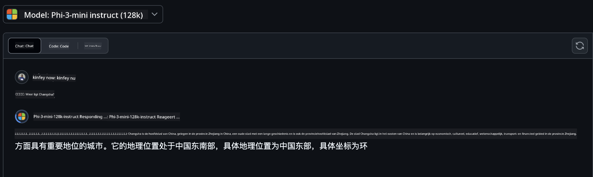
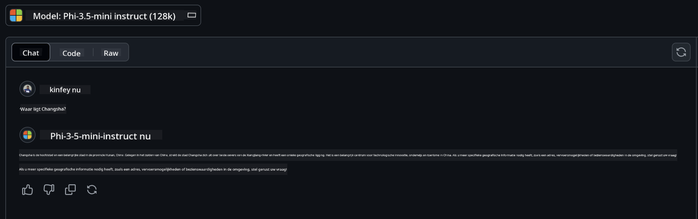

<!--
CO_OP_TRANSLATOR_METADATA:
{
  "original_hash": "124ad36cfe96f74038811b6e2bb93e9d",
  "translation_date": "2025-06-26T02:30:59+00:00",
  "source_file": "19-slm/README.md",
  "language_code": "nl"
}
-->

Modellen is de meest directe manier. Je kunt snel toegang krijgen tot het Phi-3/3.5-Instruct model via GitHub Modellen. In combinatie met de Azure AI Inference SDK / OpenAI SDK kun je via code toegang krijgen tot de API om de Phi-3/3.5-Instruct oproep te voltooien. Je kunt ook verschillende effecten testen via Playground. - Demo:Vergelijking van de effecten van Phi-3-mini en Phi-3.5-mini in Chinese scenario's   **Azure AI Studio** Of als we de visie- en MoE-modellen willen gebruiken, kun je Azure AI Studio gebruiken om de oproep te voltooien. Als je geïnteresseerd bent, kun je het Phi-3 Cookbook lezen om te leren hoe je Phi-3/3.5 Instruct, Vision, MoE kunt oproepen via Azure AI Studio [Klik op deze link](https://github.com/microsoft/Phi-3CookBook/blob/main/md/02.QuickStart/AzureAIStudio_QuickStart.md?WT.mc_id=academic-105485-koreyst) **NVIDIA NIM** Naast de cloud-gebaseerde Model Catalog oplossingen die worden aangeboden door Azure en GitHub, kun je ook [Nivida NIM](https://developer.nvidia.com/nim?WT.mc_id=academic-105485-koreyst) gebruiken om gerelateerde oproepen te voltooien. Je kunt NVIDIA NIM bezoeken om de API-oproepen van de Phi-3/3.5 Familie te voltooien. NVIDIA NIM (NVIDIA Inference Microservices) is een set van versnelde inferentie-microservices ontworpen om ontwikkelaars te helpen AI-modellen efficiënt te implementeren in verschillende omgevingen, waaronder clouds, datacenters en werkstations. Hier zijn enkele belangrijke kenmerken van NVIDIA NIM: - **Eenvoudige Implementatie:** NIM maakt het mogelijk om AI-modellen met een enkele opdracht te implementeren, waardoor het eenvoudig te integreren is in bestaande workflows. - **Geoptimaliseerde Prestaties:** Het maakt gebruik van NVIDIA's vooraf geoptimaliseerde inferentie-engines, zoals TensorRT en TensorRT-LLM, om lage latentie en hoge doorvoer te garanderen. - **Schaalbaarheid:** NIM ondersteunt autoscaling op Kubernetes, waardoor het effectief kan omgaan met variërende werklasten. - **Beveiliging en Controle:** Organisaties kunnen controle behouden over hun gegevens en applicaties door NIM-microservices zelf te hosten op hun eigen beheerde infrastructuur. - **Standaard API's:** NIM biedt industriestandaard API's, waardoor het eenvoudig is om AI-toepassingen zoals chatbots, AI-assistenten en meer te bouwen en te integreren. NIM maakt deel uit van NVIDIA AI Enterprise, dat tot doel heeft de implementatie en operationalisatie van AI-modellen te vereenvoudigen, zodat ze efficiënt draaien op NVIDIA GPU's. - Demo: Gebruik Nividia NIM om Phi-3.5-Vision-API aan te roepen [[Klik op deze link](../../../19-slm/python/Phi-3-Vision-Nividia-NIM.ipynb)] ### Inferentie Phi-3/3.5 in lokale omgeving Inferentie met betrekking tot Phi-3, of elk taalmodel zoals GPT-3, verwijst naar het proces van het genereren van antwoorden of voorspellingen op basis van de input die het ontvangt. Wanneer je een prompt of vraag aan Phi-3 geeft, gebruikt het zijn getrainde neurale netwerk om de meest waarschijnlijke en relevante reactie te infereren door patronen en relaties in de gegevens waarop het is getraind te analyseren. **Hugging Face Transformer** Hugging Face Transformers is een krachtige bibliotheek ontworpen voor natuurlijke taalverwerking (NLP) en andere machine learning-taken. Hier zijn enkele belangrijke punten erover: 1. **Vooraf Getrainde Modellen**: Het biedt duizenden vooraf getrainde modellen die kunnen worden gebruikt voor verschillende taken zoals tekstclassificatie, benoemde entiteitsherkenning, vraagbeantwoording, samenvatting, vertaling en tekstgeneratie. 2. **Framework Interoperabiliteit**: De bibliotheek ondersteunt meerdere deep learning-frameworks, waaronder PyTorch, TensorFlow en JAX. Dit stelt je in staat om een model in het ene framework te trainen en het in een ander te gebruiken. 3. **Multimodale Capaciteiten**: Naast NLP ondersteunt Hugging Face Transformers ook taken in computervisie (bijv. beeldclassificatie, objectdetectie) en audioprocessing (bijv. spraakherkenning, audioclassificatie). 4. **Gebruiksgemak**: De bibliotheek biedt API's en tools om eenvoudig modellen te downloaden en fijn af te stemmen, waardoor het toegankelijk is voor zowel beginners als experts. 5. **Gemeenschap en Middelen**: Hugging Face heeft een levendige gemeenschap en uitgebreide documentatie, tutorials en gidsen om gebruikers te helpen aan de slag te gaan en het meeste uit de bibliotheek te halen. [officiële documentatie](https://huggingface.co/docs/transformers/index?WT.mc_id=academic-105485-koreyst) of hun [GitHub-repository](https://github.com/huggingface/transformers?WT.mc_id=academic-105485-koreyst). Dit is de meest gebruikte methode, maar het vereist ook GPU-versnelling. Uiteindelijk vereisen scènes zoals Vision en MoE veel berekeningen, die zeer beperkt zullen zijn op de CPU als ze niet worden gekwantificeerd. - Demo: Gebruik Transformer om Phi-3.5-Instuct aan te roepen [Klik op deze link](../../../19-slm/python/phi35-instruct-demo.ipynb) - Demo: Gebruik Transformer om Phi-3.5-Vision aan te roepen [Klik op deze link](../../../19-slm/python/phi35-vision-demo.ipynb) - Demo: Gebruik Transformer om Phi-3.5-MoE aan te roepen [Klik op deze link](../../../19-slm/python/phi35_moe_demo.ipynb) **Ollama** [Ollama](https://ollama.com/?WT.mc_id=academic-105485-koreyst) is een platform dat is ontworpen om het gemakkelijker te maken om grote taalmodellen (LLM's) lokaal op je machine te draaien. Het ondersteunt verschillende modellen zoals Llama 3.1, Phi 3, Mistral en Gemma 2, onder andere. Het platform vereenvoudigt het proces door modelgewichten, configuratie en gegevens in één pakket te bundelen, waardoor het toegankelijker wordt voor gebruikers om hun eigen modellen aan te passen en te creëren. Ollama is beschikbaar voor macOS, Linux en Windows. Het is een geweldig hulpmiddel als je wilt experimenteren met of LLM's wilt implementeren zonder afhankelijk te zijn van clouddiensten. Ollama is de meest directe manier, je hoeft alleen maar de volgende verklaring uit te voeren. ```bash

ollama run phi3.5

``` **ONNX Runtime voor GenAI** [ONNX Runtime](https://github.com/microsoft/onnxruntime-genai?WT.mc_id=academic-105485-koreyst) is een cross-platform inferentie- en trainingsmachine-learning accelerator. ONNX Runtime voor Generative AI (GENAI) is een krachtig hulpmiddel dat je helpt om generatieve AI-modellen efficiënt te draaien op verschillende platforms. ## Wat is ONNX Runtime? ONNX Runtime is een open-source project dat hoge-prestatie inferentie van machine learning-modellen mogelijk maakt. Het ondersteunt modellen in het Open Neural Network Exchange (ONNX) formaat, dat een standaard is voor het representeren van machine learning-modellen. ONNX Runtime-inferentie kan snellere klantervaringen en lagere kosten mogelijk maken, en ondersteunt modellen van deep learning-frameworks zoals PyTorch en TensorFlow/Keras, evenals klassieke machine learning-bibliotheken zoals scikit-learn, LightGBM, XGBoost, enz. ONNX Runtime is compatibel met verschillende hardware, drivers en besturingssystemen, en biedt optimale prestaties door gebruik te maken van hardwareversnellers waar van toepassing, naast grafiekoptimalisaties en transformaties. ## Wat is Generative AI? Generative AI verwijst naar AI-systemen die nieuwe inhoud kunnen genereren, zoals tekst, afbeeldingen of muziek, op basis van de gegevens waarop ze zijn getraind. Voorbeelden zijn taalmodellen zoals GPT-3 en beeldgeneratiemodellen zoals Stable Diffusion. ONNX Runtime voor GenAI-bibliotheek biedt de generatieve AI-lus voor ONNX-modellen, inclusief inferentie met ONNX Runtime, logitsverwerking, zoeken en bemonstering, en KV-cachebeheer. ## ONNX Runtime voor GENAI ONNX Runtime voor GENAI breidt de mogelijkheden van ONNX Runtime uit om generatieve AI-modellen te ondersteunen. Hier zijn enkele belangrijke kenmerken: - **Brede Platformondersteuning:** Het werkt op verschillende platforms, waaronder Windows, Linux, macOS, Android en iOS. - **Modelondersteuning:** Het ondersteunt veel populaire generatieve AI-modellen, zoals LLaMA, GPT-Neo, BLOOM, en meer. - **Prestatieoptimalisatie:** Het bevat optimalisaties voor verschillende hardwareversnellers zoals NVIDIA GPU's, AMD GPU's, en meer2. - **Gebruiksgemak:** Het biedt API's voor eenvoudige integratie in applicaties, waardoor je tekst, afbeeldingen en andere inhoud kunt genereren met minimale code. - Gebruikers kunnen een high-level generate() methode aanroepen, of elke iteratie van het model in een lus uitvoeren, waarbij één token tegelijk wordt gegenereerd en optioneel generatieparameters binnen de lus worden bijgewerkt. - ONNX runtime heeft ook ondersteuning voor hebzuchtig/straal zoeken en TopP, TopK bemonstering om tokensequenties te genereren en ingebouwde logitsverwerking zoals herhalingsstraffen. Je kunt ook eenvoudig aangepaste scoring toevoegen. ## Aan de slag Om aan de slag te gaan met ONNX Runtime voor GENAI, kun je de volgende stappen volgen: ### Installeer ONNX Runtime: ```Python
pip install onnxruntime
``` ### Installeer de Generative AI Extensions: ```Python
pip install onnxruntime-genai
``` ### Voer een Model uit: Hier is een eenvoudig voorbeeld in Python: ```Python
import onnxruntime_genai as og

model = og.Model('path_to_your_model.onnx')

tokenizer = og.Tokenizer(model)

input_text = "Hello, how are you?"

input_tokens = tokenizer.encode(input_text)

output_tokens = model.generate(input_tokens)

output_text = tokenizer.decode(output_tokens)

print(output_text) 
``` ### Demo: Gebruik ONNX Runtime GenAI om Phi-3.5-Vision aan te roepen ```python

import onnxruntime_genai as og

model_path = './Your Phi-3.5-vision-instruct ONNX Path'

img_path = './Your Image Path'

model = og.Model(model_path)

processor = model.create_multimodal_processor()

tokenizer_stream = processor.create_stream()

text = "Your Prompt"

prompt = "<|user|>\n"

prompt += "<|image_1|>\n"

prompt += f"{text}<|end|>\n"

prompt += "<|assistant|>\n"

image = og.Images.open(img_path)

inputs = processor(prompt, images=image)

params = og.GeneratorParams(model)

params.set_inputs(inputs)

params.set_search_options(max_length=3072)

generator = og.Generator(model, params)

while not generator.is_done():

    generator.compute_logits()
    
    generator.generate_next_token()

    new_token = generator.get_next_tokens()[0]
    
    code += tokenizer_stream.decode(new_token)
    
    print(tokenizer_stream.decode(new_token), end='', flush=True)

``` **Andere** Naast ONNX Runtime en Ollama referentiemethoden, kunnen we ook de referentie van kwantitatieve modellen voltooien op basis van de modelreferentiemethoden die door verschillende fabrikanten worden aangeboden. Zoals Apple MLX framework met Apple Metal, Qualcomm QNN met NPU, Intel OpenVINO met CPU/GPU, enz. Je kunt ook meer inhoud krijgen van [Phi-3 Cookbook](https://github.com/microsoft/phi-3cookbook?WT.mc_id=academic-105485-koreyst) ## Meer We hebben de basisprincipes van de Phi-3/3.5 Familie geleerd, maar om meer te leren over SLM hebben we meer kennis nodig. Je kunt de antwoorden vinden in het Phi-3 Cookbook. Als je meer wilt leren, bezoek dan het [Phi-3 Cookbook](https://github.com/microsoft/phi-3cookbook?WT.mc_id=academic-105485-koreyst).

**Disclaimer**:  
Dit document is vertaald met behulp van de AI-vertalingsdienst [Co-op Translator](https://github.com/Azure/co-op-translator). Hoewel we streven naar nauwkeurigheid, dient u zich ervan bewust te zijn dat geautomatiseerde vertalingen fouten of onnauwkeurigheden kunnen bevatten. Het originele document in de oorspronkelijke taal moet worden beschouwd als de gezaghebbende bron. Voor cruciale informatie wordt professionele menselijke vertaling aanbevolen. Wij zijn niet aansprakelijk voor misverstanden of misinterpretaties die voortvloeien uit het gebruik van deze vertaling.