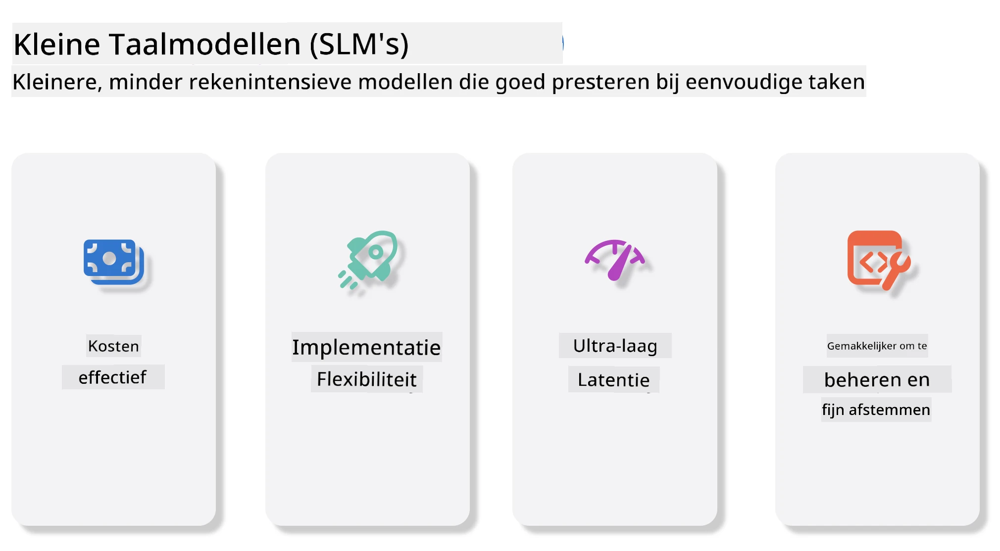
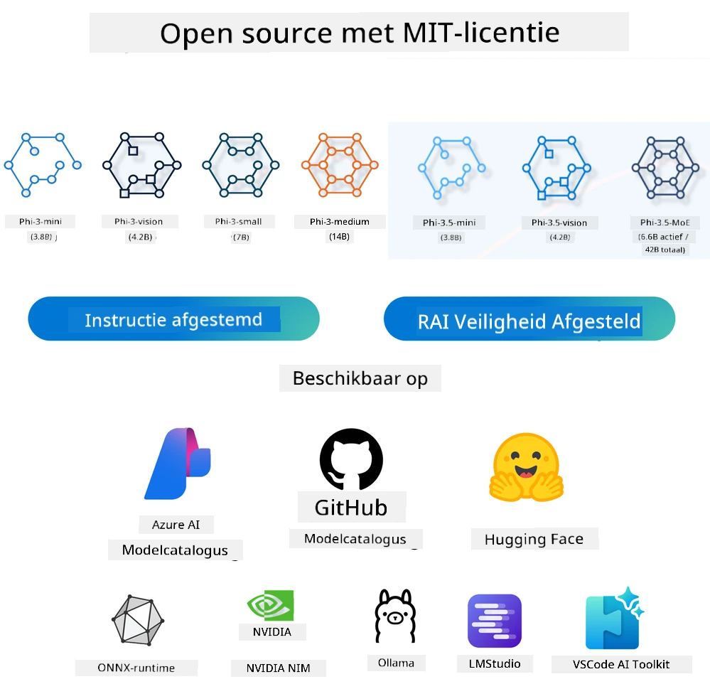
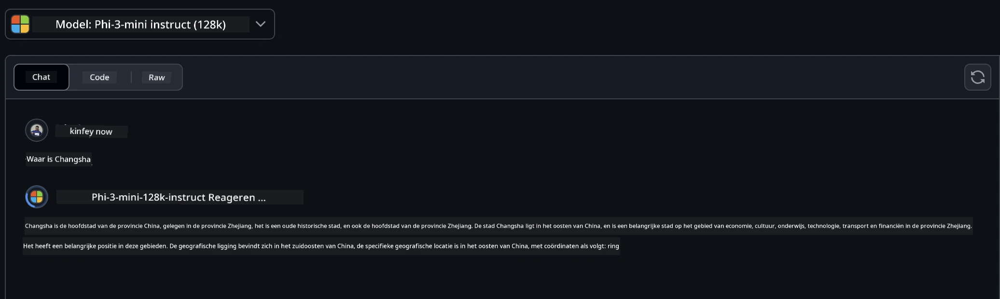
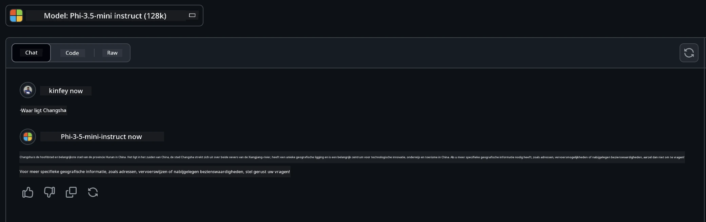

# Introductie tot Kleine Taalmodellen voor Generatieve AI voor Beginners
Generatieve AI is een fascinerend vakgebied binnen kunstmatige intelligentie dat zich richt op het creëren van systemen die in staat zijn om nieuwe inhoud te genereren. Deze inhoud kan variëren van tekst en afbeeldingen tot muziek en zelfs volledige virtuele omgevingen. Een van de meest opwindende toepassingen van generatieve AI ligt op het gebied van taalmodellen.

## Wat Zijn Kleine Taalmodellen?

Een Klein Taalmodel (SLM) vertegenwoordigt een verkleinde variant van een groot taalmodel (LLM), waarbij veel van de architectonische principes en technieken van LLMs worden gebruikt, maar met een aanzienlijk verminderde computationele voetafdruk.

SLM's zijn een subset van taalmodellen die zijn ontworpen om mensachtige tekst te genereren. In tegenstelling tot hun grotere tegenhangers, zoals GPT-4, zijn SLM's compacter en efficiënter, waardoor ze ideaal zijn voor toepassingen waar de computationele middelen beperkt zijn. Ondanks hun kleinere formaat kunnen ze nog steeds een verscheidenheid aan taken uitvoeren. Typisch worden SLM's geconstrueerd door compressie of distillatie van LLM's, met als doel een groot deel van de oorspronkelijke functionaliteit en taalkundige capaciteiten te behouden. Deze verkleining van het model vermindert de algehele complexiteit, waardoor SLM's efficiënter zijn in zowel geheugengebruik als computationele vereisten. Ondanks deze optimalisaties kunnen SLM's een breed scala aan taken in natuurlijke taalverwerking (NLP) uitvoeren:

- Tekstgeneratie: Het creëren van coherente en contextueel relevante zinnen of alinea's.
- Tekstavondeling: Het voorspellen en aanvullen van zinnen op basis van een gegeven prompt.
- Vertaling: Het omzetten van tekst van de ene naar de andere taal.
- Samenvatting: Het condenseren van lange tekststukken tot kortere, beter verteerbare samenvattingen.

Wel met enkele concessies in prestaties of diepgang van begrip vergeleken met hun grotere tegenhangers.

## Hoe Werken Kleine Taalmodellen?
SLM's worden getraind op enorme hoeveelheden tekstdata. Tijdens de training leren ze patronen en structuren van taal, waardoor ze tekst kunnen genereren die zowel grammaticaal correct als contextueel passend is. Het trainingsproces omvat:

- Gegevensverzameling: Het verzamelen van grote datasets met tekst uit verschillende bronnen.
- Voorbewerking: Het schoonmaken en organiseren van de data om deze geschikt te maken voor training.
- Training: Het gebruik van machine learning-algoritmes om het model te leren hoe het tekst moet begrijpen en genereren.
- Fijnafstelling: Het aanpassen van het model om de prestaties op specifieke taken te verbeteren.

De ontwikkeling van SLM's sluit aan bij de groeiende behoefte aan modellen die kunnen worden ingezet in omgevingen met beperkte middelen, zoals mobiele apparaten of edge computing-platforms, waar full-scale LLM's onpraktisch kunnen zijn vanwege hun zware resourcegebruik. Door zich te richten op efficiëntie, vinden SLM's een balans tussen prestaties en toegankelijkheid, waardoor ze breder toepasbaar zijn in diverse domeinen.



## Leerdoelen

In deze les hopen we kennis over SLM te introduceren en dit te combineren met Microsoft Phi-3 om verschillende scenario's te leren in tekstinhoud, visie en MoE.

Aan het einde van deze les zou je de volgende vragen moeten kunnen beantwoorden:

- Wat is SLM?
- Wat is het verschil tussen SLM en LLM?
- Wat is de Microsoft Phi-3/3.5 Familie?
- Hoe voer je inferentie uit met de Microsoft Phi-3/3.5 Familie?

Klaar? Laten we beginnen.

## De Onderscheidingen tussen Grote Taalmodellen (LLM's) en Kleine Taalmodellen (SLM's)

Zowel LLM's als SLM's zijn gebouwd op fundamentele principes van probabilistische machine learning, waarbij vergelijkbare benaderingen worden gevolgd in architectonisch ontwerp, trainingsmethodologieën, data-generatieprocessen en modelevaluatietechnieken. Toch onderscheiden verschillende kernfactoren deze twee typen modellen.

## Toepassingen van Kleine Taalmodellen

SLM's hebben een breed scala aan toepassingen, waaronder:

- Chatbots: Het bieden van klantenondersteuning en interactie met gebruikers op een conversationele manier.
- Contentcreatie: Het assisteren van schrijvers door ideeën te genereren of zelfs volledige artikelen op te stellen.
- Onderwijs: Het helpen van studenten bij schrijfopdrachten of het leren van nieuwe talen.
- Toegankelijkheid: Het creëren van gereedschappen voor mensen met een beperking, zoals tekst-naar-spraak systemen.

**Grootte**
  
Een primaire onderscheid tussen LLM's en SLM's ligt in de schaal van de modellen. LLM's, zoals ChatGPT (GPT-4), kunnen ongeveer 1,76 biljoen parameters bevatten, terwijl open-source SLM's zoals Mistral 7B zijn ontworpen met aanzienlijk minder parameters – ongeveer 7 miljard. Deze discrepantie komt vooral door verschillen in modelarchitectuur en trainingsprocessen. Bijvoorbeeld, ChatGPT gebruikt een zelfaandachtsmechanisme binnen een encoder-decoder structuur, terwijl Mistral 7B gebruikmaakt van sliding window attention, wat efficiëntere training binnen een decoder-only model mogelijk maakt. Deze architecturale variatie heeft diepgaande implicaties voor de complexiteit en prestaties van deze modellen.

**Begrip**

SLM's zijn typisch geoptimaliseerd voor prestaties binnen specifieke domeinen, waardoor ze hoog gespecialiseerd maar mogelijk beperkt zijn in hun vermogen om brede contextuele kennis over meerdere vakgebieden te bieden. Daarentegen streven LLM's ernaar om menselijke intelligentie op een meer omvattend niveau na te bootsen. Getraind op enorme, diverse datasets, zijn LLM's ontworpen om goed te presteren over een verscheidenheid aan domeinen, en bieden ze meer veelzijdigheid en aanpasbaarheid. Daarom zijn LLM's beter geschikt voor een breder scala aan downstream taken, zoals natuurlijke taalverwerking en programmeren.

**Computing**

De training en inzet van LLM's zijn resource-intensieve processen, wat vaak aanzienlijke computationele infrastructuur vereist, inclusief grootschalige GPU-clusters. Bijvoorbeeld, het trainen van een model als ChatGPT vanaf nul kan duizenden GPU's vereisen over lange periodes. Daarentegen zijn SLM's, met hun kleinere aantal parameters, toegankelijker qua computationele middelen. Modellen zoals Mistral 7B kunnen worden getraind en uitgevoerd op lokale machines met gematigde GPU-capaciteiten, hoewel de training nog steeds enkele uren over meerdere GPU's kan kosten.

**Bias**

Bias is een bekend probleem bij LLM's, hoofdzakelijk vanwege de aard van de trainingsdata. Deze modellen vertrouwen vaak op ruwe, openlijk beschikbare data van het internet, die bepaalde groepen kan ondervertegenwoordigen of verkeerd kan voorstellen, verkeerde labeling kan bevatten of taalkundige vooroordelen weerspiegelt beïnvloed door dialecten, geografische variaties en grammaticale regels. Bovendien kan de complexiteit van LLM-architecturen onbedoeld biais versterken, wat onopgemerkt kan blijven zonder zorgvuldige fijnregeling. Aan de andere kant worden SLM's, die getraind zijn op meer beperkte, domeinspecifieke datasets, van nature minder gevoelig voor zulke biases, hoewel ze er niet volledig immuun voor zijn.

**Inferentie**

De kleinere omvang van SLM's geeft hen een aanzienlijk voordeel in inferentiesnelheid, waardoor ze efficiënt output kunnen genereren op lokale hardware zonder uitgebreide parallelle verwerking. LLM's daarentegen vereisen, vanwege hun grootte en complexiteit, vaak aanzienlijke parallelle computationele middelen om acceptabele inferentietijden te bereiken. De aanwezigheid van meerdere gelijktijdige gebruikers vertraagt de reactietijden van LLM's nog meer, vooral bij grootschalige uitrol.

Samenvattend, hoewel LLM's en SLM's een gemeenschappelijke basis hebben in machine learning, verschillen ze significant in modelgrootte, resourcevereisten, contextueel begrip, gevoeligheid voor biais en inferentiesnelheid. Deze verschillen weerspiegelen hun respectieve geschiktheid voor diverse toepassingen, waarbij LLM's veelzijdiger maar middelenintensiever zijn, en SLM's meer domeinspecifieke efficiëntie bieden met lagere computationele eisen.

***Opmerking: In deze les introduceren we SLM met Microsoft Phi-3 / 3.5 als voorbeeld.***

## Introductie Phi-3 / Phi-3.5 Familie

Phi-3 / 3.5 Familie richt zich voornamelijk op tekst-, visie- en Agent (MoE) toepassingsscenario's:

### Phi-3 / 3.5 Instruct

Voornamelijk voor tekstgeneratie, chatafwerking en extractie van inhoudsinformatie, enzovoorts.

**Phi-3-mini**

Het 3,8 miljard parameter taalmodel is beschikbaar op Microsoft Azure AI Studio, Hugging Face en Ollama. Phi-3 modellen presteren significant beter dan taalmodellen van gelijke of grotere omvang op belangrijke benchmarks (zie benchmarkcijfers hieronder, hogere cijfers zijn beter). Phi-3-mini presteert beter dan modellen met twee keer zijn grootte, terwijl Phi-3-small en Phi-3-medium grotere modellen verslaan, waaronder GPT-3.5.

**Phi-3-small & medium**

Met slechts 7 miljard parameters verslaat Phi-3-small GPT-3.5T op diverse taal-, redeneer-, codeer- en wiskundebenchmarks.

De Phi-3-medium met 14 miljard parameters zet deze trend voort en presteert beter dan de Gemini 1.0 Pro.

**Phi-3.5-mini**

Deze kan worden gezien als een upgrade van Phi-3-mini. Hoewel het aantal parameters ongewijzigd blijft, verbetert het de ondersteuning voor meerdere talen (ondersteunt 20+ talen: Arabisch, Chinees, Tsjechisch, Deens, Nederlands, Engels, Fins, Frans, Duits, Hebreeuws, Hongaars, Italiaans, Japans, Koreaans, Noors, Pools, Portugees, Russisch, Spaans, Zweeds, Thais, Turks, Oekraïens) en voegt sterkere ondersteuning toe voor lange context.

Phi-3.5-mini met 3,8 miljard parameters presteert beter dan taalmodellen van dezelfde grootte en is vergelijkbaar met modellen van twee keer zijn omvang.

### Phi-3 / 3.5 Vision

We kunnen het Instruct-model van Phi-3/3.5 zien als Phi's vermogen om te begrijpen, en Vision is wat Phi ogen geeft om de wereld te begrijpen.

**Phi-3-Vision**

Phi-3-vision, met slechts 4,2 miljard parameters, zet deze trend voort en presteert beter dan grotere modellen zoals Claude-3 Haiku en Gemini 1.0 Pro V bij algemene visuele redeneertaken, OCR, en begrip van tabellen en diagrammen.

**Phi-3.5-Vision**

Phi-3.5-Vision is ook een upgrade van Phi-3-Vision en voegt ondersteuning toe voor meerdere beelden. Je kunt het zien als een verbetering in visie: niet alleen kun je plaatjes zien, maar ook video's.

Phi-3.5-vision presteert beter dan grotere modellen zoals Claude-3.5 Sonnet en Gemini 1.5 Flash bij OCR, tabel- en grafiekbegripstaken en is vergelijkbaar bij algemene visuele kennisevaluatietaken. Ondersteunt multi-frame input, oftewel redeneren over meerdere inputafbeeldingen.

### Phi-3.5-MoE

***Mixture of Experts (MoE)*** maakt het mogelijk om modellen voor te trainen met veel minder rekenkracht, wat betekent dat je het model of de dataset drastisch kunt opschalen met hetzelfde rekenbudget als een dense model. Een MoE-model zou in het bijzonder tijdens pretraining sneller dezelfde kwaliteit moeten bereiken als zijn dense tegenhanger.

Phi-3.5-MoE bestaat uit 16x3,8 miljard expertmodules. Phi-3.5-MoE met slechts 6,6 miljard actieve parameters bereikt een vergelijkbaar niveau van redeneren, taalbegrip en wiskunde als veel grotere modellen.

We kunnen het Phi-3/3.5 Familie model gebruiken op basis van verschillende scenario's. In tegenstelling tot LLM, kun je Phi-3/3.5-mini of Phi-3/3.5-Vision inzetten op edge devices.

## Hoe gebruik je Phi-3/3.5 Familie modellen

We hopen Phi-3/3.5 te gebruiken in verschillende scenario's. Hieronder gebruiken we Phi-3/3.5 op basis van diverse scenario's.



### Inference via Cloud APIs

**GitHub Models**

GitHub Models is de meest directe manier. Je kunt snel toegang krijgen tot het Phi-3/3.5-Instruct model via GitHub Models. Gecombineerd met de Azure AI Inference SDK / OpenAI SDK, kun je via code de API aanroepen om Phi-3/3.5-Instruct te gebruiken. Je kunt ook verschillende resultaten testen via Playground.

- Demo: Vergelijking van de prestaties van Phi-3-mini en Phi-3.5-mini in Chinese scenario's






**Azure AI Studio**

Of als je de visie- en MoE-modellen wilt gebruiken, kun je Azure AI Studio gebruiken om de aanroep te voltooien. Als je geïnteresseerd bent, kun je de Phi-3 Cookbook lezen om te leren hoe je Phi-3/3.5 Instruct, Vision, MoE aanroept via Azure AI Studio [Klik op deze link](https://github.com/microsoft/Phi-3CookBook/blob/main/md/02.QuickStart/AzureAIStudio_QuickStart.md?WT.mc_id=academic-105485-koreyst)


**NVIDIA NIM**

Naast de cloudgebaseerde Model Catalog oplossingen aangeboden door Azure en GitHub, kun je ook [NVIDIA NIM](https://developer.nvidia.com/nim?WT.mc_id=academic-105485-koreyst) gebruiken voor gerelateerde aanroepen. Je kunt NVIDIA NIM bezoeken om API-aanroepen voor de Phi-3/3.5 Familie te doen. NVIDIA NIM (NVIDIA Inference Microservices) is een verzameling versnelde inferentie-microservices ontworpen om ontwikkelaars te helpen AI-modellen efficiënt te implementeren over verschillende omgevingen, inclusief clouds, datacenters en werkstations.

Hier zijn enkele belangrijke kenmerken van NVIDIA NIM:
- **Gemak van implementatie:** NIM maakt het mogelijk AI-modellen met één commando te implementeren, wat het eenvoudig maakt om in bestaande workflows te integreren.
- **Geoptimaliseerde prestaties:** Het maakt gebruik van NVIDIA’s vooraf geoptimaliseerde inference-engines, zoals TensorRT en TensorRT-LLM, om lage latentie en hoge doorvoer te garanderen.
- **Schaalbaarheid:** NIM ondersteunt autoscaling op Kubernetes, waardoor het effectief verschillende workloads kan verwerken.
- **Beveiliging en controle:** Organisaties kunnen controle houden over hun data en toepassingen door NIM-microservices zelf te hosten op hun eigen beheerde infrastructuur.
- **Standaard APIs:** NIM biedt industrienormen APIs, waardoor het makkelijk is AI-toepassingen zoals chatbots, AI-assistenten en meer te bouwen en te integreren.

NIM maakt deel uit van NVIDIA AI Enterprise, dat tot doel heeft het implementeren en operationeel maken van AI-modellen te vereenvoudigen, zodat deze efficiënt draaien op NVIDIA GPU’s.

- Demo: NVIDIA NIM gebruiken om Phi-3.5-Vision-API aan te roepen  [[Klik op deze link](./python/Phi-3-Vision-Nividia-NIM.ipynb?WT.mc_id=academic-105485-koreyst)]


### Phi-3/3.5 lokaal draaien
Inference in relatie tot Phi-3, of een taalmodel zoals GPT-3, verwijst naar het proces van het genereren van antwoorden of voorspellingen op basis van de input die het ontvangt. Wanneer je een prompt of vraag aan Phi-3 geeft, gebruikt het zijn getrainde neurale netwerk om de meest waarschijnlijke en relevante reactie af te leiden door patronen en relaties in de data waarop het getraind is te analyseren.

**Hugging Face Transformer**
Hugging Face Transformers is een krachtige bibliotheek ontworpen voor natuurlijke taalverwerking (NLP) en andere machine learning-taken. Hier zijn enkele belangrijke punten:

1. **Voorgetrainde modellen:** Het biedt duizenden voorgetrainde modellen die gebruikt kunnen worden voor diverse taken zoals tekstanalyse, named entity recognition, vraagbeantwoording, samenvatting, vertaling en tekstgeneratie.

2. **Framework-interoperabiliteit:** De bibliotheek ondersteunt meerdere deep learning frameworks, waaronder PyTorch, TensorFlow en JAX. Dit maakt het mogelijk om een model in het ene framework te trainen en in een ander te gebruiken.

3. **Multimodale mogelijkheden:** Naast NLP ondersteunt Hugging Face Transformers ook taken in computer vision (bijv. beeldclassificatie, objectdetectie) en audioprocessing (bijv. spraakherkenning, audioclassificatie).

4. **Gebruiksgemak:** De bibliotheek biedt APIs en tools om eenvoudig modellen te downloaden en fine-tunen, wat het toegankelijk maakt voor zowel beginners als experts.

5. **Community en bronnen:** Hugging Face heeft een levendige community en uitgebreide documentatie, tutorials en handleidingen om gebruikers te helpen snel aan de slag te gaan en het maximale uit de bibliotheek te halen.
[officiële documentatie](https://huggingface.co/docs/transformers/index?WT.mc_id=academic-105485-koreyst) of hun [GitHub-repository](https://github.com/huggingface/transformers?WT.mc_id=academic-105485-koreyst).

Dit is de meest gebruikte methode, maar vereist ook GPU-versnelling. Scenario’s zoals Vision en MoE vergen immers veel rekenkracht, wat op een CPU erg traag zal zijn indien niet gequantiseerd.


- Demo: Transformer gebruiken om Phi-3.5-Instruct aan te roepen [Klik op deze link](./python/phi35-instruct-demo.ipynb?WT.mc_id=academic-105485-koreyst)

- Demo: Transformer gebruiken om Phi-3.5-Vision aan te roepen [Klik op deze link](./python/phi35-vision-demo.ipynb?WT.mc_id=academic-105485-koreyst)

- Demo: Transformer gebruiken om Phi-3.5-MoE aan te roepen [Klik op deze link](./python/phi35_moe_demo.ipynb?WT.mc_id=academic-105485-koreyst)

**Ollama**
[Ollama](https://ollama.com/?WT.mc_id=academic-105485-koreyst) is een platform dat het makkelijker maakt om grote taalmodellen (LLM’s) lokaal op je computer te draaien. Het ondersteunt diverse modellen zoals Llama 3.1, Phi 3, Mistral en Gemma 2, onder anderen. Het platform vereenvoudigt het proces door modelgewichten, configuraties en data in één pakket te bundelen, waardoor gebruikers eenvoudiger hun eigen modellen kunnen aanpassen en creëren. Ollama is beschikbaar voor macOS, Linux en Windows. Het is een uitstekende tool als je wilt experimenteren met of LLM’s wilt implementeren zonder afhankelijk te zijn van cloudservices. Ollama is de meest directe methode, je hoeft slechts het volgende commando uit te voeren.


```bash

ollama run phi3.5

```


**ONNX Runtime voor GenAI**

[ONNX Runtime](https://github.com/microsoft/onnxruntime-genai?WT.mc_id=academic-105485-koreyst) is een cross-platform inference- en trainingsversneller voor machine learning. ONNX Runtime voor Generative AI (GENAI) is een krachtig hulpmiddel dat helpt generatieve AI-modellen efficiënt uit te voeren op verschillende platforms.

## Wat is ONNX Runtime?
ONNX Runtime is een open-source project dat high-performance inference van machine learning-modellen mogelijk maakt. Het ondersteunt modellen in het Open Neural Network Exchange (ONNX) formaat, een standaard voor het vertegenwoordigen van machine learning-modellen. ONNX Runtime inference kan snellere klantervaringen en lagere kosten mogelijk maken, en ondersteunt modellen van deep learning frameworks zoals PyTorch en TensorFlow/Keras evenals klassieke machine learning bibliotheken zoals scikit-learn, LightGBM, XGBoost, etc. ONNX Runtime is compatibel met verschillende hardware, drivers en besturingssystemen en biedt optimale prestaties door gebruik te maken van hardwareversnellers waar mogelijk, naast grafiekoptimalisaties en transformaties.

## Wat is Generative AI?
Generative AI verwijst naar AI-systemen die nieuwe content kunnen genereren, zoals tekst, afbeeldingen of muziek, op basis van de data waarop ze zijn getraind. Voorbeelden zijn taalmodellen zoals GPT-3 en beeldgeneratiemodellen zoals Stable Diffusion. De ONNX Runtime voor GenAI bibliotheek biedt de generatieve AI-loop voor ONNX modellen, inclusief inference met ONNX Runtime, logitsverwerking, zoeken en sampling, en KV-cachebeheer.

## ONNX Runtime voor GENAI
ONNX Runtime voor GENAI breidt de mogelijkheden van ONNX Runtime uit om generatieve AI-modellen te ondersteunen. Hier zijn enkele belangrijke kenmerken:

- **Brede platformondersteuning:** Het werkt op diverse platforms, waaronder Windows, Linux, macOS, Android en iOS.
- **Modelondersteuning:** Het ondersteunt vele populaire generatieve AI-modellen, zoals LLaMA, GPT-Neo, BLOOM, en meer.
- **Prestatieoptimalisatie:** Het bevat optimalisaties voor verschillende hardwareversnellers zoals NVIDIA GPU’s, AMD GPU’s, en meer.
- **Gebruiksgemak:** Het biedt APIs voor eenvoudige integratie in applicaties, waarmee je tekst, afbeeldingen en andere content met minimale code kunt genereren.
- Gebruikers kunnen een hoge-niveau generate() methode aanroepen, of elke iteratie van het model in een lus draaien, één token per keer genereren, en optioneel generatieparameters binnen de lus bijwerken.
- ONNX runtime ondersteunt ook greedy/beam search en TopP, TopK sampling voor het genereren van tokensequenties en ingebouwde logitsverwerking zoals herhalingsstraffen. Je kunt ook eenvoudig eigen scoring toevoegen.

## Aan de slag
Om te beginnen met ONNX Runtime voor GENAI, kun je deze stappen volgen:

### Installeer ONNX Runtime:
```Python
pip install onnxruntime
```
### Installeer de Generative AI-extensies:
```Python
pip install onnxruntime-genai
```

### Een model draaien: Hier is een eenvoudig voorbeeld in Python:
```Python
import onnxruntime_genai as og

model = og.Model('path_to_your_model.onnx')

tokenizer = og.Tokenizer(model)

input_text = "Hello, how are you?"

input_tokens = tokenizer.encode(input_text)

output_tokens = model.generate(input_tokens)

output_text = tokenizer.decode(output_tokens)

print(output_text) 
```
### Demo: ONNX Runtime GenAI gebruiken om Phi-3.5-Vision aan te roepen


```python

import onnxruntime_genai as og

model_path = './Your Phi-3.5-vision-instruct ONNX Path'

img_path = './Your Image Path'

model = og.Model(model_path)

processor = model.create_multimodal_processor()

tokenizer_stream = processor.create_stream()

text = "Your Prompt"

prompt = "<|user|>\n"

prompt += "<|image_1|>\n"

prompt += f"{text}<|end|>\n"

prompt += "<|assistant|>\n"

image = og.Images.open(img_path)

inputs = processor(prompt, images=image)

params = og.GeneratorParams(model)

params.set_inputs(inputs)

params.set_search_options(max_length=3072)

generator = og.Generator(model, params)

while not generator.is_done():

    generator.compute_logits()
    
    generator.generate_next_token()

    new_token = generator.get_next_tokens()[0]
    
    output = tokenizer_stream.decode(new_token)
    
    print(tokenizer_stream.decode(new_token), end='', flush=True)

```


**Overig**

Naast ONNX Runtime en Ollama referentiemethoden kunnen we ook de referentie van kwantitatieve modellen voltooien op basis van de modelreferentiemethoden die verschillende fabrikanten bieden. Zoals Apple MLX framework met Apple Metal, Qualcomm QNN met NPU, Intel OpenVINO met CPU/GPU, enzovoort. Je kunt ook meer content vinden in de [Phi-3 Cookbook](https://github.com/microsoft/phi-3cookbook?WT.mc_id=academic-105485-koreyst)


## Meer

We hebben de basis van de Phi-3/3.5 familie geleerd, maar om meer te leren over SLM hebben we meer kennis nodig. Je kunt de antwoorden vinden in de Phi-3 Cookbook. Als je meer wilt leren, bezoek dan de [Phi-3 Cookbook](https://github.com/microsoft/phi-3cookbook?WT.mc_id=academic-105485-koreyst).

---

<!-- CO-OP TRANSLATOR DISCLAIMER START -->
**Disclaimer**:
Dit document is vertaald met behulp van de AI-vertalingsdienst [Co-op Translator](https://github.com/Azure/co-op-translator). Hoewel we streven naar nauwkeurigheid, dient u er rekening mee te houden dat geautomatiseerde vertalingen fouten of onnauwkeurigheden kunnen bevatten. Het oorspronkelijke document in de originele taal moet als de gezaghebbende bron worden beschouwd. Voor cruciale informatie wordt een professionele menselijke vertaling aanbevolen. Wij zijn niet aansprakelijk voor eventuele misverstanden of verkeerde interpretaties voortvloeiend uit het gebruik van deze vertaling.
<!-- CO-OP TRANSLATOR DISCLAIMER END -->