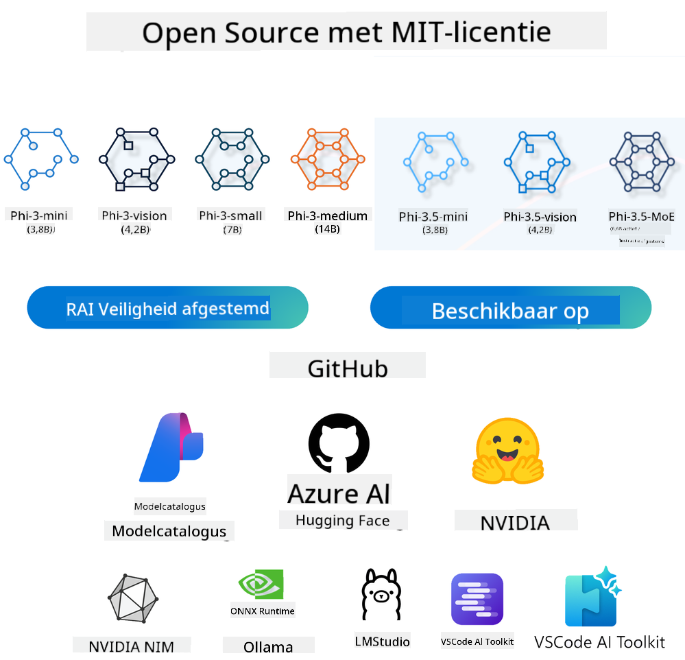
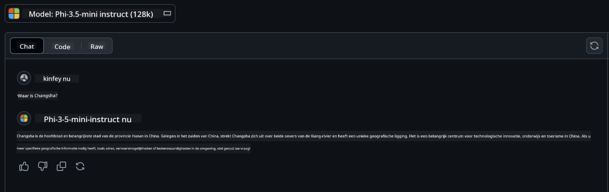

<!--
CO_OP_TRANSLATOR_METADATA:
{
  "original_hash": "124ad36cfe96f74038811b6e2bb93e9d",
  "translation_date": "2025-07-09T18:39:27+00:00",
  "source_file": "19-slm/README.md",
  "language_code": "nl"
}
-->
# Introductie tot Kleine Taalmodellen voor Generatieve AI voor Beginners  
Generatieve AI is een fascinerend vakgebied binnen kunstmatige intelligentie dat zich richt op het creëren van systemen die in staat zijn nieuwe content te genereren. Deze content kan variëren van tekst en afbeeldingen tot muziek en zelfs complete virtuele omgevingen. Een van de meest spannende toepassingen van generatieve AI ligt op het gebied van taalmodellen.

## Wat Zijn Kleine Taalmodellen?  

Een Klein Taalmodel (SLM) is een verkleinde variant van een groot taalmodel (LLM), waarbij veel van de architecturale principes en technieken van LLMs worden gebruikt, maar met een aanzienlijk kleinere rekencapaciteit.  

SLM’s zijn een subset van taalmodellen die ontworpen zijn om mensachtige tekst te genereren. In tegenstelling tot hun grotere tegenhangers, zoals GPT-4, zijn SLM’s compacter en efficiënter, waardoor ze ideaal zijn voor toepassingen waar de rekencapaciteit beperkt is. Ondanks hun kleinere omvang kunnen ze nog steeds diverse taken uitvoeren. Meestal worden SLM’s gebouwd door LLM’s te comprimeren of te distilleren, met als doel een groot deel van de functionaliteit en taalkundige capaciteiten van het oorspronkelijke model te behouden. Deze verkleining van het model vermindert de complexiteit, waardoor SLM’s efficiënter zijn in zowel geheugengebruik als rekenkracht. Ondanks deze optimalisaties kunnen SLM’s een breed scala aan natuurlijke taalverwerkingstaken uitvoeren:  

- Tekstgeneratie: Het creëren van samenhangende en contextueel relevante zinnen of paragrafen.  
- Tekstafwerking: Het voorspellen en aanvullen van zinnen op basis van een gegeven prompt.  
- Vertaling: Het omzetten van tekst van de ene taal naar de andere.  
- Samenvatting: Het inkorten van lange teksten tot kortere, beter behapbare samenvattingen.  

Alhoewel dit soms gepaard gaat met enige concessies in prestaties of diepgang van begrip vergeleken met hun grotere tegenhangers.

## Hoe Werken Kleine Taalmodellen?  
SLM’s worden getraind op enorme hoeveelheden tekstdata. Tijdens het trainen leren ze de patronen en structuren van taal, waardoor ze tekst kunnen genereren die zowel grammaticaal correct als contextueel passend is. Het trainingsproces omvat:  

- Data Verzameling: Het verzamelen van grote datasets met tekst uit diverse bronnen.  
- Voorbewerking: Het opschonen en organiseren van de data om deze geschikt te maken voor training.  
- Training: Het gebruik van machine learning-algoritmes om het model te leren tekst te begrijpen en te genereren.  
- Fijnslijpen: Het aanpassen van het model om de prestaties op specifieke taken te verbeteren.  

De ontwikkeling van SLM’s sluit aan bij de groeiende behoefte aan modellen die ingezet kunnen worden in omgevingen met beperkte middelen, zoals mobiele apparaten of edge computing-platforms, waar volledige LLM’s vaak onpraktisch zijn vanwege hun zware resourcegebruik. Door te focussen op efficiëntie, bieden SLM’s een balans tussen prestaties en toegankelijkheid, wat bredere toepassingen in verschillende domeinen mogelijk maakt.


## Leerdoelen  

In deze les willen we kennis over SLM introduceren en dit combineren met Microsoft Phi-3 om verschillende scenario’s te leren in tekstcontent, visie en MoE.

Aan het einde van deze les zou je de volgende vragen moeten kunnen beantwoorden:  

- Wat is SLM  
- Wat is het verschil tussen SLM en LLM  
- Wat is Microsoft Phi-3/3.5 Familie  
- Hoe voer je inferentie uit met Microsoft Phi-3/3.5 Familie  

Klaar? Laten we beginnen.

## De Verschillen tussen Grote Taalmodellen (LLM’s) en Kleine Taalmodellen (SLM’s)  

Zowel LLM’s als SLM’s zijn gebaseerd op fundamentele principes van probabilistische machine learning en volgen vergelijkbare benaderingen in hun architectuur, trainingsmethoden, datageneratieprocessen en modelbeoordelingstechnieken. Toch zijn er een aantal belangrijke factoren die deze twee typen modellen onderscheiden.

## Toepassingen van Kleine Taalmodellen  

SLM’s hebben een breed scala aan toepassingen, waaronder:  

- Chatbots: Het bieden van klantenservice en het voeren van gesprekken met gebruikers.  
- Contentcreatie: Het ondersteunen van schrijvers door ideeën te genereren of zelfs hele artikelen te schrijven.  
- Onderwijs: Het helpen van studenten bij schrijfopdrachten of het leren van nieuwe talen.  
- Toegankelijkheid: Het creëren van hulpmiddelen voor mensen met een beperking, zoals tekst-naar-spraak systemen.  

**Grootte**  

Een belangrijk verschil tussen LLM’s en SLM’s zit in de schaal van de modellen. LLM’s, zoals ChatGPT (GPT-4), kunnen naar schatting 1,76 biljoen parameters bevatten, terwijl open-source SLM’s zoals Mistral 7B ontworpen zijn met aanzienlijk minder parameters — ongeveer 7 miljard. Dit verschil komt vooral door variaties in modelarchitectuur en trainingsprocessen. Zo gebruikt ChatGPT een self-attention mechanisme binnen een encoder-decoder structuur, terwijl Mistral 7B sliding window attention toepast, wat efficiëntere training mogelijk maakt binnen een decoder-only model. Deze architecturale verschillen hebben grote gevolgen voor de complexiteit en prestaties van de modellen.

**Begrip**  

SLM’s zijn meestal geoptimaliseerd voor prestaties binnen specifieke domeinen, waardoor ze zeer gespecialiseerd zijn maar mogelijk beperkt in hun vermogen om brede contextuele kennis over meerdere vakgebieden te bieden. LLM’s daarentegen streven ernaar menselijke intelligentie op een meer omvattend niveau te simuleren. Ze worden getraind op enorme, diverse datasets en zijn ontworpen om goed te presteren in verschillende domeinen, wat zorgt voor grotere veelzijdigheid en aanpassingsvermogen. Hierdoor zijn LLM’s beter geschikt voor een breder scala aan downstream-taken, zoals natuurlijke taalverwerking en programmeren.

**Rekenkracht**  

Het trainen en inzetten van LLM’s is een resource-intensief proces, dat vaak aanzienlijke rekeninfrastructuur vereist, zoals grootschalige GPU-clusters. Zo kan het trainen van een model als ChatGPT vanaf nul duizenden GPU’s over lange periodes vereisen. SLM’s, met hun kleinere aantal parameters, zijn daarentegen toegankelijker qua rekenkracht. Modellen zoals Mistral 7B kunnen getraind en uitgevoerd worden op lokale machines met gemiddelde GPU-capaciteit, hoewel training nog steeds enkele uren op meerdere GPU’s kan vergen.

**Bias**  

Bias is een bekend probleem bij LLM’s, vooral door de aard van de trainingsdata. Deze modellen vertrouwen vaak op ruwe, vrij beschikbare data van het internet, die bepaalde groepen kan ondervertegenwoordigen of verkeerd kan weergeven, foutieve labeling kan bevatten, of taalkundige vooroordelen kan weerspiegelen door dialecten, geografische variaties en grammaticale regels. Daarnaast kan de complexiteit van LLM-architecturen bias onbedoeld versterken, wat zonder zorgvuldige fijnslijping onopgemerkt kan blijven. SLM’s, die getraind worden op meer beperkte, domeinspecifieke datasets, zijn van nature minder vatbaar voor dergelijke biases, hoewel ze er niet volledig immuun voor zijn.

**Inferentie**  

De kleinere omvang van SLM’s geeft ze een groot voordeel in inferentiesnelheid, waardoor ze efficiënt output kunnen genereren op lokale hardware zonder uitgebreide parallelle verwerking. LLM’s daarentegen vereisen vanwege hun grootte en complexiteit vaak aanzienlijke parallelle rekenmiddelen om acceptabele inferentietijden te bereiken. Het gelijktijdig gebruik door meerdere gebruikers vertraagt bovendien de reactietijden van LLM’s, vooral bij grootschalige inzet.

Samenvattend, hoewel LLM’s en SLM’s een gemeenschappelijke basis in machine learning delen, verschillen ze sterk in modelgrootte, resourcebehoefte, contextueel begrip, gevoeligheid voor bias en inferentiesnelheid. Deze verschillen bepalen hun geschiktheid voor uiteenlopende toepassingen, waarbij LLM’s veelzijdiger maar resource-intensiever zijn, en SLM’s efficiënter en meer domeinspecifiek met lagere rekenvereisten.

***Note：In dit hoofdstuk introduceren we SLM aan de hand van Microsoft Phi-3 / 3.5 als voorbeeld.***

## Introductie Phi-3 / Phi-3.5 Familie  

De Phi-3 / 3.5 Familie richt zich vooral op tekst-, visie- en Agent (MoE) toepassingsscenario’s:

### Phi-3 / 3.5 Instruct  

Voornamelijk voor tekstgeneratie, chatafwerking en contentinformatie-extractie, enzovoort.

**Phi-3-mini**  

Het 3,8 miljard parameters tellende taalmodel is beschikbaar op Microsoft Azure AI Studio, Hugging Face en Ollama. Phi-3 modellen presteren aanzienlijk beter dan taalmodellen van gelijke en grotere omvang op belangrijke benchmarks (zie benchmarkcijfers hieronder, hogere cijfers zijn beter). Phi-3-mini presteert beter dan modellen die twee keer zo groot zijn, terwijl Phi-3-small en Phi-3-medium grotere modellen, waaronder GPT-3.5, overtreffen.

**Phi-3-small & medium**  

Met slechts 7 miljard parameters verslaat Phi-3-small GPT-3.5T op diverse taal-, redeneer-, codeer- en wiskundebenchmarks.

Phi-3-medium met 14 miljard parameters zet deze trend voort en presteert beter dan Gemini 1.0 Pro.

**Phi-3.5-mini**  

Dit kan worden gezien als een upgrade van Phi-3-mini. Hoewel het aantal parameters gelijk blijft, verbetert het de ondersteuning voor meerdere talen (ondersteunt 20+ talen: Arabisch, Chinees, Tsjechisch, Deens, Nederlands, Engels, Fins, Frans, Duits, Hebreeuws, Hongaars, Italiaans, Japans, Koreaans, Noors, Pools, Portugees, Russisch, Spaans, Zweeds, Thai, Turks, Oekraïens) en voegt het sterkere ondersteuning toe voor lange context.

Phi-3.5-mini met 3,8 miljard parameters presteert beter dan taalmodellen van dezelfde grootte en is vergelijkbaar met modellen die twee keer zo groot zijn.

### Phi-3 / 3.5 Vision  

We kunnen het Instruct-model van Phi-3/3.5 zien als Phi’s vermogen om te begrijpen, en Vision is wat Phi ogen geeft om de wereld te begrijpen.

**Phi-3-Vision**  

Phi-3-vision, met slechts 4,2 miljard parameters, zet deze trend voort en presteert beter dan grotere modellen zoals Claude-3 Haiku en Gemini 1.0 Pro V op algemene visuele redeneertaken, OCR, en taken rondom het begrijpen van tabellen en diagrammen.

**Phi-3.5-Vision**  

Phi-3.5-Vision is ook een upgrade van Phi-3-Vision, met ondersteuning voor meerdere afbeeldingen. Je kunt het zien als een verbetering in visie: niet alleen kan het plaatjes zien, maar ook video’s.

Phi-3.5-vision presteert beter dan grotere modellen zoals Claude-3.5 Sonnet en Gemini 1.5 Flash op OCR-, tabel- en grafiekbegripstaken en is vergelijkbaar op algemene visuele kennis- en redeneertaken. Ondersteunt multi-frame input, oftewel redeneren over meerdere invoerafbeeldingen.

### Phi-3.5-MoE  

***Mixture of Experts (MoE)*** maakt het mogelijk modellen te pretrainen met veel minder rekenkracht, wat betekent dat je het model of de dataset aanzienlijk kunt opschalen met hetzelfde rekenbudget als een dense model. Met name zou een MoE-model dezelfde kwaliteit als zijn dense tegenhanger veel sneller moeten bereiken tijdens pretraining.

Phi-3.5-MoE bestaat uit 16x3,8 miljard expertmodules. Phi-3.5-MoE met slechts 6,6 miljard actieve parameters bereikt een vergelijkbaar niveau van redeneren, taalbegrip en wiskunde als veel grotere modellen.

We kunnen het Phi-3/3.5 Familie model gebruiken op basis van verschillende scenario’s. In tegenstelling tot LLM kun je Phi-3/3.5-mini of Phi-3/3.5-Vision op edge-apparaten inzetten.

## Hoe gebruik je Phi-3/3.5 Familie modellen  

We willen Phi-3/3.5 in verschillende scenario’s gebruiken. Hieronder laten we zien hoe je Phi-3/3.5 in verschillende situaties kunt toepassen.



### Verschil in inferentie via Cloud API  

**GitHub Models**  

GitHub Models is de meest directe manier. Je kunt snel toegang krijgen tot het Phi-3/3.5-Instruct model via GitHub Models. In combinatie met de Azure AI Inference SDK / OpenAI SDK kun je via code de API aanroepen om Phi-3/3.5-Instruct te gebruiken. Je kunt ook verschillende resultaten testen via Playground.

- Demo: Vergelijking van de prestaties van Phi-3-mini en Phi-3.5-mini in Chinese scenario’s




**Azure AI Studio**  

Of als je de vision- en MoE-modellen wilt gebruiken, kun je Azure AI Studio inzetten om de aanroepen te doen. Als je geïnteresseerd bent, kun je de Phi-3 Cookbook lezen om te leren hoe je Phi-3/3.5 Instruct, Vision, MoE via Azure AI Studio aanroept [Klik op deze link](https://github.com/microsoft/Phi-3CookBook/blob/main/md/02.QuickStart/AzureAIStudio_QuickStart.md?WT.mc_id=academic-105485-koreyst)

**NVIDIA NIM**  

Naast de cloudgebaseerde Model Catalog-oplossingen van Azure en GitHub, kun je ook [NVIDIA NIM](https://developer.nvidia.com/nim?WT.mc_id=academic-105485-koreyst) gebruiken om gerelateerde aanroepen te doen. Je kunt NVIDIA NIM bezoeken om API-aanroepen van de Phi-3/3.5 Familie te voltooien. NVIDIA NIM (NVIDIA Inference Microservices) is een set geoptimaliseerde inferentie-microservices die ontwikkelaars helpen AI-modellen efficiënt te implementeren in verschillende omgevingen, waaronder clouds, datacenters en werkstations.

Hier zijn enkele belangrijke kenmerken van NVIDIA NIM:  

- **Eenvoudige Implementatie:** NIM maakt het mogelijk AI-modellen met één commando te implementeren, wat integratie in bestaande workflows eenvoudig maakt.  
- **Geoptimaliseerde Prestaties:** Het maakt gebruik van NVIDIA’s vooraf geoptimaliseerde inferentie-engines, zoals TensorRT en TensorRT-LLM, voor lage latentie en hoge doorvoer.  
- **Schaalbaarheid:** NIM ondersteunt autoscaling op Kubernetes, waardoor het effectief kan omgaan met wisselende workloads.
- **Beveiliging en Controle:** Organisaties kunnen de controle over hun data en applicaties behouden door NIM-microservices zelf te hosten op hun eigen beheerde infrastructuur.
- **Standaard API’s:** NIM biedt industrieel erkende API’s, waardoor het eenvoudig is om AI-toepassingen zoals chatbots, AI-assistenten en meer te bouwen en te integreren.

NIM maakt deel uit van NVIDIA AI Enterprise, dat als doel heeft het inzetten en operationeel maken van AI-modellen te vereenvoudigen, zodat deze efficiënt draaien op NVIDIA GPU’s.

- Demo: Gebruik van Nvidia NIM om Phi-3.5-Vision-API aan te roepen [[Klik op deze link](python/Phi-3-Vision-Nividia-NIM.ipynb)]


### Inference Phi-3/3.5 in lokale omgeving
Inference met betrekking tot Phi-3, of elk taalmodel zoals GPT-3, verwijst naar het proces van het genereren van antwoorden of voorspellingen op basis van de input die het ontvangt. Wanneer je een prompt of vraag aan Phi-3 geeft, gebruikt het zijn getrainde neurale netwerk om de meest waarschijnlijke en relevante reactie af te leiden door patronen en verbanden in de trainingsdata te analyseren.

**Hugging Face Transformer**  
Hugging Face Transformers is een krachtige bibliotheek ontworpen voor natuurlijke taalverwerking (NLP) en andere machine learning taken. Hier zijn enkele belangrijke punten:

1. **Voorgetrainde Modellen:** Het biedt duizenden voorgetrainde modellen die gebruikt kunnen worden voor diverse taken zoals tekstclassificatie, named entity recognition, vraagbeantwoording, samenvatting, vertaling en tekstgeneratie.

2. **Framework Interoperabiliteit:** De bibliotheek ondersteunt meerdere deep learning frameworks, waaronder PyTorch, TensorFlow en JAX. Dit maakt het mogelijk om een model in het ene framework te trainen en in het andere te gebruiken.

3. **Multimodale Mogelijkheden:** Naast NLP ondersteunt Hugging Face Transformers ook taken in computer vision (bijv. beeldclassificatie, objectdetectie) en audioprocessing (bijv. spraakherkenning, audioclassificatie).

4. **Gebruiksgemak:** De bibliotheek biedt API’s en tools om modellen eenvoudig te downloaden en fijn af te stemmen, waardoor het toegankelijk is voor zowel beginners als experts.

5. **Community en Resources:** Hugging Face heeft een levendige community en uitgebreide documentatie, tutorials en handleidingen om gebruikers op weg te helpen en het meeste uit de bibliotheek te halen.  
[officiële documentatie](https://huggingface.co/docs/transformers/index?WT.mc_id=academic-105485-koreyst) of hun [GitHub repository](https://github.com/huggingface/transformers?WT.mc_id=academic-105485-koreyst).

Dit is de meest gebruikte methode, maar het vereist ook GPU-versnelling. Immers, toepassingen zoals Vision en MoE vragen veel rekenkracht, wat op de CPU erg beperkt zal zijn als ze niet gequantiseerd zijn.


- Demo: Gebruik van Transformer om Phi-3.5-Instruct aan te roepen [Klik op deze link](python/phi35-instruct-demo.ipynb)

- Demo: Gebruik van Transformer om Phi-3.5-Vision aan te roepen [Klik op deze link](python/phi35-vision-demo.ipynb)

- Demo: Gebruik van Transformer om Phi-3.5-MoE aan te roepen [Klik op deze link](python/phi35_moe_demo.ipynb)

**Ollama**  
[Ollama](https://ollama.com/?WT.mc_id=academic-105485-koreyst) is een platform dat het makkelijker maakt om grote taalmodellen (LLM’s) lokaal op je eigen machine te draaien. Het ondersteunt diverse modellen zoals Llama 3.1, Phi 3, Mistral en Gemma 2, onder andere. Het platform vereenvoudigt het proces door modelgewichten, configuratie en data in één pakket te bundelen, waardoor het toegankelijker wordt voor gebruikers om hun eigen modellen aan te passen en te creëren. Ollama is beschikbaar voor macOS, Linux en Windows. Het is een uitstekend hulpmiddel als je wilt experimenteren met of LLM’s wilt inzetten zonder afhankelijk te zijn van cloudservices. Ollama is de meest directe manier, je hoeft alleen de volgende opdracht uit te voeren.


```bash

ollama run phi3.5

```


**ONNX Runtime voor GenAI**

[ONNX Runtime](https://github.com/microsoft/onnxruntime-genai?WT.mc_id=academic-105485-koreyst) is een cross-platform accelerator voor inference en training van machine learning modellen. ONNX Runtime voor Generative AI (GENAI) is een krachtig hulpmiddel dat je helpt generatieve AI-modellen efficiënt te draaien op verschillende platforms.

## Wat is ONNX Runtime?  
ONNX Runtime is een open-source project dat high-performance inference van machine learning modellen mogelijk maakt. Het ondersteunt modellen in het Open Neural Network Exchange (ONNX) formaat, een standaard voor het representeren van machine learning modellen. ONNX Runtime inference kan zorgen voor snellere gebruikerservaringen en lagere kosten, en ondersteunt modellen van deep learning frameworks zoals PyTorch en TensorFlow/Keras, evenals klassieke machine learning bibliotheken zoals scikit-learn, LightGBM, XGBoost, enzovoort. ONNX Runtime is compatibel met verschillende hardware, drivers en besturingssystemen, en levert optimale prestaties door gebruik te maken van hardwareversnellers waar mogelijk, naast grafiekoptimalisaties en transformaties.

## Wat is Generative AI?  
Generative AI verwijst naar AI-systemen die nieuwe content kunnen genereren, zoals tekst, afbeeldingen of muziek, op basis van de data waarop ze getraind zijn. Voorbeelden zijn taalmodellen zoals GPT-3 en beeldgeneratiemodellen zoals Stable Diffusion. De ONNX Runtime voor GenAI bibliotheek biedt de generatieve AI-cyclus voor ONNX-modellen, inclusief inference met ONNX Runtime, logitsverwerking, zoek- en samplingmethoden, en KV-cachebeheer.

## ONNX Runtime voor GENAI  
ONNX Runtime voor GENAI breidt de mogelijkheden van ONNX Runtime uit om generatieve AI-modellen te ondersteunen. Hier zijn enkele belangrijke kenmerken:

- **Brede Platformondersteuning:** Het werkt op diverse platforms, waaronder Windows, Linux, macOS, Android en iOS.  
- **Modelondersteuning:** Het ondersteunt veel populaire generatieve AI-modellen, zoals LLaMA, GPT-Neo, BLOOM en meer.  
- **Prestatieoptimalisatie:** Het bevat optimalisaties voor verschillende hardwareversnellers zoals NVIDIA GPU’s, AMD GPU’s, en meer.  
- **Gebruiksgemak:** Het biedt API’s voor eenvoudige integratie in applicaties, waarmee je tekst, afbeeldingen en andere content kunt genereren met minimale code.  
- Gebruikers kunnen een high-level generate() methode aanroepen, of elke iteratie van het model in een lus uitvoeren, waarbij telkens één token wordt gegenereerd en optioneel generatieparameters binnen de lus worden aangepast.  
- ONNX Runtime ondersteunt ook greedy/beam search en TopP, TopK sampling om tokenreeksen te genereren, en ingebouwde logitsverwerking zoals herhalingsstraffen. Je kunt ook eenvoudig eigen scoringsmethoden toevoegen.

## Aan de slag  
Om te beginnen met ONNX Runtime voor GENAI, kun je de volgende stappen volgen:

### Installeer ONNX Runtime:  
```Python
pip install onnxruntime
```  
### Installeer de Generative AI Extensions:  
```Python
pip install onnxruntime-genai
```

### Draai een model: Hier is een eenvoudig voorbeeld in Python:  
```Python
import onnxruntime_genai as og

model = og.Model('path_to_your_model.onnx')

tokenizer = og.Tokenizer(model)

input_text = "Hello, how are you?"

input_tokens = tokenizer.encode(input_text)

output_tokens = model.generate(input_tokens)

output_text = tokenizer.decode(output_tokens)

print(output_text) 
```  
### Demo: Gebruik van ONNX Runtime GenAI om Phi-3.5-Vision aan te roepen


```python

import onnxruntime_genai as og

model_path = './Your Phi-3.5-vision-instruct ONNX Path'

img_path = './Your Image Path'

model = og.Model(model_path)

processor = model.create_multimodal_processor()

tokenizer_stream = processor.create_stream()

text = "Your Prompt"

prompt = "<|user|>\n"

prompt += "<|image_1|>\n"

prompt += f"{text}<|end|>\n"

prompt += "<|assistant|>\n"

image = og.Images.open(img_path)

inputs = processor(prompt, images=image)

params = og.GeneratorParams(model)

params.set_inputs(inputs)

params.set_search_options(max_length=3072)

generator = og.Generator(model, params)

while not generator.is_done():

    generator.compute_logits()
    
    generator.generate_next_token()

    new_token = generator.get_next_tokens()[0]
    
    code += tokenizer_stream.decode(new_token)
    
    print(tokenizer_stream.decode(new_token), end='', flush=True)

```


**Overige**

Naast ONNX Runtime en Ollama referentiemethoden kunnen we ook de referentie van kwantitatieve modellen afronden op basis van de modelreferentiemethoden die door verschillende fabrikanten worden aangeboden. Denk aan het Apple MLX framework met Apple Metal, Qualcomm QNN met NPU, Intel OpenVINO met CPU/GPU, enzovoort. Je kunt ook meer informatie vinden in de [Phi-3 Cookbook](https://github.com/microsoft/phi-3cookbook?WT.mc_id=academic-105485-koreyst).


## Meer

We hebben de basis van de Phi-3/3.5 familie geleerd, maar om meer te weten te komen over SLM hebben we meer kennis nodig. Je vindt de antwoorden in de Phi-3 Cookbook. Wil je meer leren, bezoek dan de [Phi-3 Cookbook](https://github.com/microsoft/phi-3cookbook?WT.mc_id=academic-105485-koreyst).

**Disclaimer**:  
Dit document is vertaald met behulp van de AI-vertalingsdienst [Co-op Translator](https://github.com/Azure/co-op-translator). Hoewel we streven naar nauwkeurigheid, dient u er rekening mee te houden dat geautomatiseerde vertalingen fouten of onnauwkeurigheden kunnen bevatten. Het originele document in de oorspronkelijke taal moet als de gezaghebbende bron worden beschouwd. Voor cruciale informatie wordt professionele menselijke vertaling aanbevolen. Wij zijn niet aansprakelijk voor eventuele misverstanden of verkeerde interpretaties die voortvloeien uit het gebruik van deze vertaling.