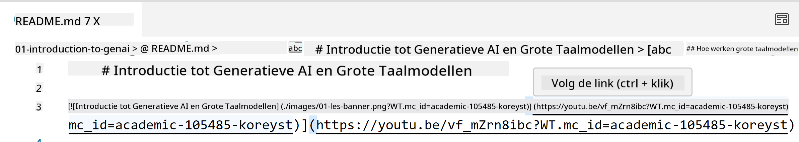
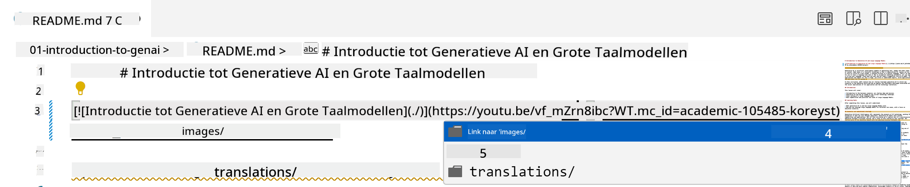
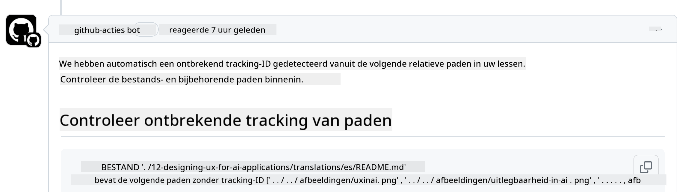
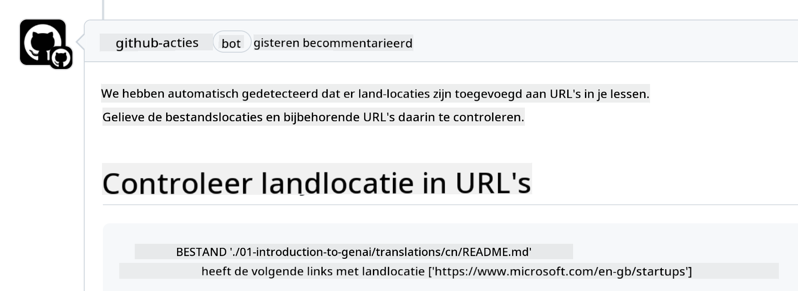

<!--
CO_OP_TRANSLATOR_METADATA:
{
  "original_hash": "57c41f2af71001a2cff9d8eb797cb843",
  "translation_date": "2025-05-19T11:19:41+00:00",
  "source_file": "CONTRIBUTING.md",
  "language_code": "nl"
}
-->
# Bijdragen

Dit project verwelkomt bijdragen en suggesties. De meeste bijdragen vereisen dat je akkoord gaat met een Contributor License Agreement (CLA) waarin je verklaart dat je het recht hebt om ons de rechten te geven om je bijdrage te gebruiken. Voor details, bezoek <https://cla.microsoft.com>.

> Belangrijk: bij het vertalen van tekst in deze repo, zorg ervoor dat je geen gebruik maakt van machinevertaling. We zullen vertalingen verifiëren via de gemeenschap, dus bied alleen aan om te vertalen in talen waarin je vaardig bent.

Wanneer je een pull request indient, zal een CLA-bot automatisch bepalen of je een CLA moet indienen en de PR dienovereenkomstig aanpassen (bijv. label, commentaar). Volg gewoon de instructies die door de bot worden gegeven. Je hoeft dit slechts één keer te doen voor alle repositories die onze CLA gebruiken.

## Gedragscode

Dit project heeft de [Microsoft Open Source Code of Conduct](https://opensource.microsoft.com/codeofconduct/?WT.mc_id=academic-105485-koreyst) aangenomen. Voor meer informatie lees de [Code of Conduct FAQ](https://opensource.microsoft.com/codeofconduct/faq/?WT.mc_id=academic-105485-koreyst) of neem contact op met [opencode@microsoft.com](mailto:opencode@microsoft.com) voor eventuele aanvullende vragen of opmerkingen.

## Vraag of Probleem?

Open alsjeblieft geen GitHub issues voor algemene ondersteuningsvragen, omdat de GitHub-lijst moet worden gebruikt voor functieverzoeken en bugrapporten. Op deze manier kunnen we gemakkelijker daadwerkelijke problemen of bugs van de code volgen en de algemene discussie gescheiden houden van de daadwerkelijke code.

## Typfouten, Problemen, Bugs en bijdragen

Wanneer je wijzigingen indient voor de Generative AI for Beginners repository, volg dan deze aanbevelingen.

* Fork altijd de repository naar je eigen account voordat je wijzigingen aanbrengt
* Combineer geen meerdere wijzigingen in één pull request. Dien bijvoorbeeld bugfixes en documentatie-updates in met aparte PR's
* Als je pull request merge-conflicten vertoont, zorg ervoor dat je lokale main een spiegel is van wat er in de hoofdrepository staat voordat je wijzigingen aanbrengt
* Als je een vertaling indient, maak dan één PR voor alle vertaalde bestanden, aangezien we geen gedeeltelijke vertalingen voor de inhoud accepteren
* Als je een typfout of documentatiecorrectie indient, kun je wijzigingen combineren in één PR waar dat geschikt is

## Algemene Richtlijnen voor Schrijven

- Zorg ervoor dat al je URL's zijn ingesloten in vierkante haken gevolgd door een haakje zonder extra spaties eromheen of erin ``.
- Zorg ervoor dat elke relatieve link (d.w.z. links naar andere bestanden en mappen in de repository) begint met een `./` die verwijst naar een bestand of map in de huidige werkmap of een `../` die verwijst naar een bestand of map in een bovenliggende werkmap.
- Zorg ervoor dat elke relatieve link (d.w.z. links naar andere bestanden en mappen in de repository) een tracking-ID heeft (d.w.z. `?` of `&` dan `wt.mc_id=` of `WT.mc_id=`) aan het einde ervan.
- Zorg ervoor dat elke URL van de volgende domeinen _github.com, microsoft.com, visualstudio.com, aka.ms, en azure.com_ een tracking-ID heeft (d.w.z. `?` of `&` dan `wt.mc_id=` of `WT.mc_id=`) aan het einde ervan.
- Zorg ervoor dat je links geen land specifieke locale bevatten (d.w.z. `/en-us/` of `/en/`).
- Zorg ervoor dat alle afbeeldingen zijn opgeslagen in de `./images` map.
- Zorg ervoor dat de afbeeldingen beschrijvende namen hebben met Engelse karakters, cijfers, en streepjes in de naam van je afbeelding.

## GitHub Workflows

Wanneer je een pull request indient, zullen vier verschillende workflows worden geactiveerd om de vorige regels te valideren. Volg gewoon de hier vermelde instructies om de workflowcontroles te doorstaan.

- [Controleer Gebroken Relatieve Paden](../..)
- [Controleer Paden Hebben Tracking](../..)
- [Controleer URL's Hebben Tracking](../..)
- [Controleer URL's Hebben Geen Locale](../..)

### Controleer Gebroken Relatieve Paden

Deze workflow zorgt ervoor dat elk relatief pad in je bestanden werkt. Deze repository is gedeployed naar GitHub pagina's, dus je moet heel voorzichtig zijn bij het typen van de links die alles samenvoegen om niemand naar de verkeerde plek te leiden.

Om ervoor te zorgen dat je links correct werken, gebruik simpelweg VS code om dat te controleren.

Bijvoorbeeld, wanneer je met je muis over een link in je bestanden beweegt, krijg je de prompt om de link te volgen door op **ctrl + klik** te drukken.

Als je op een link klikt en deze werkt niet lokaal, dan zal het zeker de workflow activeren en niet werken op GitHub.

Om dit probleem op te lossen, probeer de link te typen met behulp van VS code.

Wanneer je `./` of `../` typt, zal VS code je een keuze geven uit de beschikbare opties volgens wat je hebt getypt.

Volg het pad door op het gewenste bestand of map te klikken en je zult zeker weten dat je pad niet gebroken is.

Zodra je het juiste relatieve pad hebt toegevoegd, sla op, en push je wijzigingen, zal de workflow opnieuw worden geactiveerd om je wijzigingen te verifiëren. Als je de controle doorstaat, ben je klaar om verder te gaan.

### Controleer Paden Hebben Tracking

Deze workflow zorgt ervoor dat elk relatief pad tracking bevat. Deze repository is gedeployed naar GitHub pagina's, dus we moeten de beweging tussen de verschillende bestanden en mappen volgen.

Om ervoor te zorgen dat je relatieve paden tracking bevatten, controleer simpelweg op de volgende tekst `?wt.mc_id=` aan het einde van het pad. Als het is toegevoegd aan je relatieve paden, dan zul je deze controle doorstaan.

Zo niet, dan krijg je mogelijk de volgende fout.

Om dit probleem op te lossen, probeer het bestandspad te openen dat door de workflow is gemarkeerd en voeg de tracking-ID toe aan het einde van de relatieve paden.

Zodra je de tracking-ID hebt toegevoegd, sla op, en push je wijzigingen, zal de workflow opnieuw worden geactiveerd om je wijzigingen te verifiëren. Als je de controle doorstaat, ben je klaar om verder te gaan.

### Controleer URL's Hebben Tracking

Deze workflow zorgt ervoor dat elke web-URL tracking bevat. Deze repository is beschikbaar voor iedereen, dus je moet ervoor zorgen dat je de toegang volgt om te weten waar het verkeer vandaan komt.

Om ervoor te zorgen dat je URL's tracking bevatten, controleer simpelweg op de volgende tekst `?wt.mc_id=` aan het einde van de URL. Als het is toegevoegd aan je URL's, dan zul je deze controle doorstaan.

Zo niet, dan krijg je mogelijk de volgende fout.

Om dit probleem op te lossen, probeer het bestandspad te openen dat door de workflow is gemarkeerd en voeg de tracking-ID toe aan het einde van de URL's.

Zodra je de tracking-ID hebt toegevoegd, sla op, en push je wijzigingen, zal de workflow opnieuw worden geactiveerd om je wijzigingen te verifiëren. Als je de controle doorstaat, ben je klaar om verder te gaan.

### Controleer URL's Hebben Geen Locale

Deze workflow zorgt ervoor dat elke web-URL geen land specifieke locale bevat. Deze repository is beschikbaar voor iedereen over de hele wereld, dus je moet ervoor zorgen dat je geen land specifieke locale in URL's opneemt.

Om ervoor te zorgen dat je URL's geen land specifieke locale bevatten, controleer simpelweg op de volgende tekst `/en-us/` of `/en/` of enige andere taal locale ergens in de URL. Als het niet aanwezig is in je URL's, dan zul je deze controle doorstaan.

Zo niet, dan krijg je mogelijk de volgende fout.

Om dit probleem op te lossen, probeer het bestandspad te openen dat door de workflow is gemarkeerd en verwijder de land locale van de URL's.

Zodra je de land locale hebt verwijderd, sla op, en push je wijzigingen, zal de workflow opnieuw worden geactiveerd om je wijzigingen te verifiëren. Als je de controle doorstaat, ben je klaar om verder te gaan.

Gefeliciteerd! We zullen zo snel mogelijk contact met je opnemen met feedback over je bijdrage.

**Disclaimer**:  
Dit document is vertaald met behulp van de AI-vertalingsdienst [Co-op Translator](https://github.com/Azure/co-op-translator). Hoewel we streven naar nauwkeurigheid, dient u zich ervan bewust te zijn dat geautomatiseerde vertalingen fouten of onnauwkeurigheden kunnen bevatten. Het originele document in zijn oorspronkelijke taal moet worden beschouwd als de gezaghebbende bron. Voor cruciale informatie wordt professionele menselijke vertaling aanbevolen. Wij zijn niet aansprakelijk voor misverstanden of misinterpretaties die voortvloeien uit het gebruik van deze vertaling.