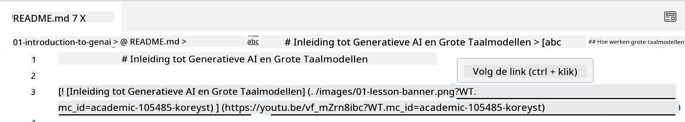
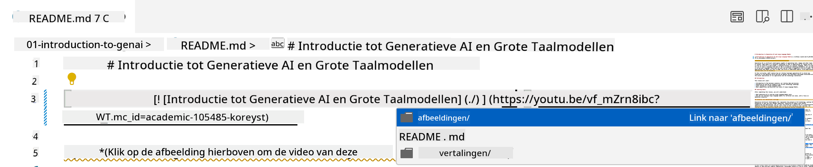
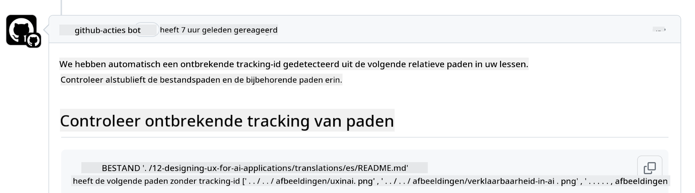
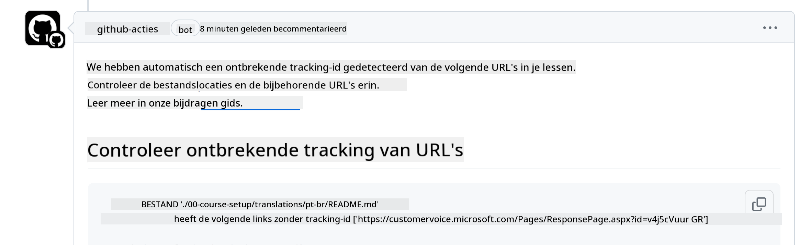
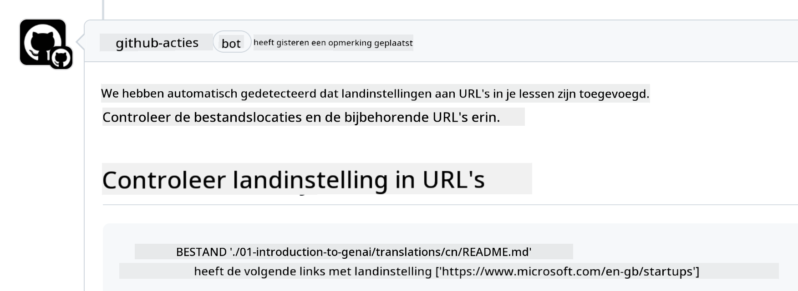

<!--
CO_OP_TRANSLATOR_METADATA:
{
  "original_hash": "57c41f2af71001a2cff9d8eb797cb843",
  "translation_date": "2025-06-25T07:14:00+00:00",
  "source_file": "CONTRIBUTING.md",
  "language_code": "nl"
}
-->
# Bijdragen

Dit project verwelkomt bijdragen en suggesties. De meeste bijdragen vereisen dat je instemt met een Contributor License Agreement (CLA) waarin je verklaart dat je het recht hebt om ons de rechten te geven om je bijdrage te gebruiken. Voor details, bezoek <https://cla.microsoft.com>.

> Belangrijk: bij het vertalen van tekst in deze repo, zorg ervoor dat je geen gebruik maakt van machinale vertaling. We zullen vertalingen via de gemeenschap verifiëren, dus bied alleen vertalingen aan in talen waarin je vaardig bent.

Wanneer je een pull-aanvraag indient, zal een CLA-bot automatisch bepalen of je een CLA moet verstrekken en de PR dienovereenkomstig versieren (bijv. label, opmerking). Volg gewoon de instructies van de bot. Je hoeft dit slechts één keer te doen voor alle repositories die onze CLA gebruiken.

## Gedragscode

Dit project heeft de [Microsoft Open Source Gedragscode](https://opensource.microsoft.com/codeofconduct/?WT.mc_id=academic-105485-koreyst) aangenomen. Voor meer informatie lees de [Gedragscode FAQ](https://opensource.microsoft.com/codeofconduct/faq/?WT.mc_id=academic-105485-koreyst) of neem contact op met [opencode@microsoft.com](mailto:opencode@microsoft.com) voor eventuele aanvullende vragen of opmerkingen.

## Vragen of Problemen?

Open geen GitHub-issues voor algemene ondersteuningsvragen, omdat de GitHub-lijst gebruikt moet worden voor functieverzoeken en bugrapporten. Op deze manier kunnen we gemakkelijker daadwerkelijke problemen of bugs in de code volgen en de algemene discussie gescheiden houden van de feitelijke code.

## Typfouten, Problemen, Bugs en bijdragen

Wanneer je wijzigingen indient in de Generative AI voor Beginners-repository, volg dan deze aanbevelingen.

* Fork altijd de repository naar je eigen account voordat je je wijzigingen aanbrengt
* Combineer geen meerdere wijzigingen in één pull-aanvraag. Dien bijvoorbeeld een bugfix en documentatie-updates in met afzonderlijke PR's
* Als je pull-aanvraag mergeconflicten vertoont, zorg er dan voor dat je lokale main een spiegel is van wat er in de hoofdrepository staat voordat je je wijzigingen aanbrengt
* Als je een vertaling indient, maak dan één PR voor alle vertaalde bestanden, aangezien we geen gedeeltelijke vertalingen van de inhoud accepteren
* Als je een typefout of documentatiefix indient, kun je wijzigingen combineren in een enkele PR waar dat geschikt is

## Algemene Richtlijnen voor schrijven

- Zorg ervoor dat al je URL's zijn ingesloten in vierkante haken gevolgd door een haakje zonder extra spaties eromheen of erin ``.
- Zorg ervoor dat elke relatieve link (d.w.z. links naar andere bestanden en mappen in de repository) begint met een `./` die verwijst naar een bestand of map in de huidige werkmap of een `../` die verwijst naar een bestand of map in een bovenliggende werkmap.
- Zorg ervoor dat elke relatieve link (d.w.z. links naar andere bestanden en mappen in de repository) een tracking-ID heeft (d.w.z. `?` of `&` dan `wt.mc_id=` of `WT.mc_id=`) aan het einde ervan.
- Zorg ervoor dat elke URL van de volgende domeinen _github.com, microsoft.com, visualstudio.com, aka.ms, en azure.com_ een tracking-ID heeft (d.w.z. `?` of `&` dan `wt.mc_id=` of `WT.mc_id=`) aan het einde ervan.
- Zorg ervoor dat je links geen land-specifieke locale bevatten (d.w.z. `/en-us/` of `/en/`).
- Zorg ervoor dat alle afbeeldingen zijn opgeslagen in de `./images` map.
- Zorg ervoor dat de afbeeldingen beschrijvende namen hebben met Engelse karakters, cijfers en streepjes in de naam van je afbeelding.

## GitHub Workflows

Wanneer je een pull-aanvraag indient, worden er vier verschillende workflows geactiveerd om de bovenstaande regels te valideren. Volg gewoon de hier vermelde instructies om de workflowcontroles te doorstaan.

- [Controleer Gebroken Relatieve Paden](../..)
- [Controleer of Paden Tracking Hebben](../..)
- [Controleer of URL's Tracking Hebben](../..)
- [Controleer of URL's Geen Locale Hebben](../..)

### Controleer Gebroken Relatieve Paden

Deze workflow zorgt ervoor dat elk relatief pad in je bestanden werkt. Deze repository is geïmplementeerd op GitHub-pagina's, dus je moet heel voorzichtig zijn wanneer je de links typt die alles samenbinden om niemand naar de verkeerde plek te leiden.

Om ervoor te zorgen dat je links correct werken, gebruik je eenvoudig VS code om dat te controleren.

Bijvoorbeeld, wanneer je over een link in je bestanden zweeft, krijg je de melding om de link te volgen door op **ctrl + klik** te drukken.

Als je op een link klikt en deze werkt lokaal niet, dan zal het zeker de workflow activeren en niet werken op GitHub.

Om dit probleem op te lossen, probeer je de link te typen met behulp van VS code.

Wanneer je `./` of `../` typt, zal VS code je vragen om te kiezen uit de beschikbare opties op basis van wat je hebt getypt.

Volg het pad door op het gewenste bestand of map te klikken en je zult er zeker van zijn dat je pad niet gebroken is.

Zodra je het juiste relatieve pad hebt toegevoegd, sla je op en push je je wijzigingen. De workflow zal opnieuw worden geactiveerd om je wijzigingen te verifiëren. Als je de controle doorstaat, ben je klaar om verder te gaan.

### Controleer of Paden Tracking Hebben

Deze workflow zorgt ervoor dat elk relatief pad tracking heeft. Deze repository is geïmplementeerd op GitHub-pagina's, dus we moeten de beweging tussen de verschillende bestanden en mappen volgen.

Om ervoor te zorgen dat je relatieve paden tracking hebben, controleer je eenvoudig op de volgende tekst `?wt.mc_id=` aan het einde van het pad. Als het is toegevoegd aan je relatieve paden, zul je deze controle doorstaan.

Zo niet, dan krijg je mogelijk de volgende foutmelding.

Om dit probleem op te lossen, probeer je het bestandspad dat de workflow heeft gemarkeerd te openen en voeg je de tracking-ID toe aan het einde van de relatieve paden.

Zodra je de tracking-ID hebt toegevoegd, sla je op en push je je wijzigingen. De workflow zal opnieuw worden geactiveerd om je wijzigingen te verifiëren. Als je de controle doorstaat, ben je klaar om verder te gaan.

### Controleer of URL's Tracking Hebben

Deze workflow zorgt ervoor dat elke web-URL tracking heeft. Deze repository is beschikbaar voor iedereen, dus je moet ervoor zorgen dat je de toegang bijhoudt om te weten waar het verkeer vandaan komt.

Om ervoor te zorgen dat je URL's tracking hebben, controleer je eenvoudig op de volgende tekst `?wt.mc_id=` aan het einde van de URL. Als het is toegevoegd aan je URL's, zul je deze controle doorstaan.

Zo niet, dan krijg je mogelijk de volgende foutmelding.

Om dit probleem op te lossen, probeer je het bestandspad dat de workflow heeft gemarkeerd te openen en voeg je de tracking-ID toe aan het einde van de URL's.

Zodra je de tracking-ID hebt toegevoegd, sla je op en push je je wijzigingen. De workflow zal opnieuw worden geactiveerd om je wijzigingen te verifiëren. Als je de controle doorstaat, ben je klaar om verder te gaan.

### Controleer of URL's Geen Locale Hebben

Deze workflow zorgt ervoor dat elke web-URL geen land-specifieke locale heeft. Deze repository is beschikbaar voor iedereen over de hele wereld, dus je moet ervoor zorgen dat je geen land-specifieke locale in URL's opneemt.

Om ervoor te zorgen dat je URL's geen land-specifieke locale hebben, controleer je eenvoudig op de volgende tekst `/en-us/` of `/en/` of een andere taal-locale ergens in de URL. Als het niet aanwezig is in je URL's, zul je deze controle doorstaan.

Zo niet, dan krijg je mogelijk de volgende foutmelding.

Om dit probleem op te lossen, probeer je het bestandspad dat de workflow heeft gemarkeerd te openen en verwijder je de land-locale uit de URL's.

Zodra je de land-locale hebt verwijderd, sla je op en push je je wijzigingen. De workflow zal opnieuw worden geactiveerd om je wijzigingen te verifiëren. Als je de controle doorstaat, ben je klaar om verder te gaan.

Gefeliciteerd! We zullen zo snel mogelijk contact met je opnemen met feedback over je bijdrage.

**Disclaimer**:  
Dit document is vertaald met behulp van de AI vertaaldienst [Co-op Translator](https://github.com/Azure/co-op-translator). Hoewel we streven naar nauwkeurigheid, dient u zich ervan bewust te zijn dat geautomatiseerde vertalingen fouten of onnauwkeurigheden kunnen bevatten. Het originele document in de oorspronkelijke taal moet worden beschouwd als de gezaghebbende bron. Voor cruciale informatie wordt professionele menselijke vertaling aanbevolen. Wij zijn niet aansprakelijk voor misverstanden of misinterpretaties die voortvloeien uit het gebruik van deze vertaling.