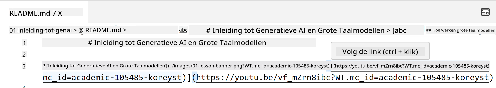
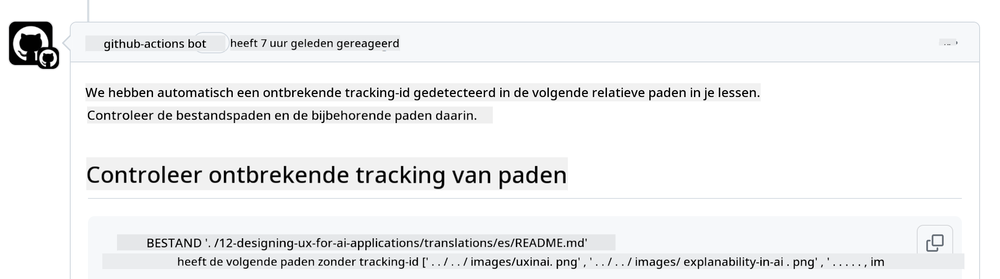
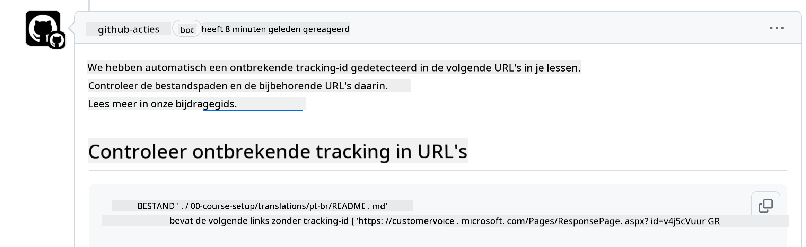
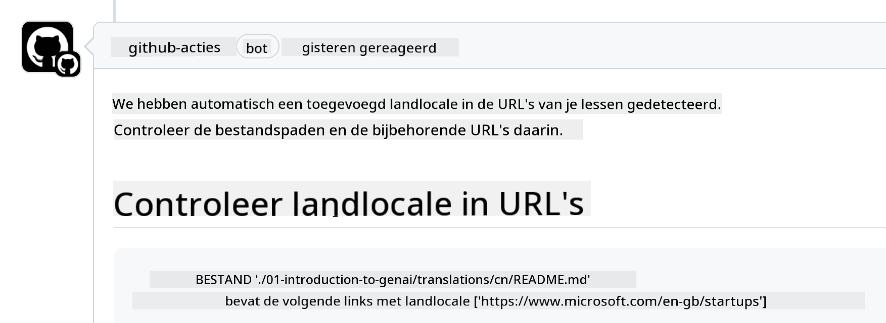

<!--
CO_OP_TRANSLATOR_METADATA:
{
  "original_hash": "57c41f2af71001a2cff9d8eb797cb843",
  "translation_date": "2025-07-09T06:08:58+00:00",
  "source_file": "CONTRIBUTING.md",
  "language_code": "nl"
}
-->
# Bijdragen

Dit project verwelkomt bijdragen en suggesties. Voor de meeste bijdragen moet je akkoord gaan met een Contributor License Agreement (CLA) waarin je verklaart dat je het recht hebt om, en daadwerkelijk, ons de rechten verleent om jouw bijdrage te gebruiken. Voor meer informatie, bezoek <https://cla.microsoft.com>.

> Belangrijk: bij het vertalen van tekst in deze repository, zorg er alsjeblieft voor dat je geen machinevertaling gebruikt. We zullen vertalingen via de community controleren, dus meld je alleen aan voor vertalingen in talen waarin je goed bent.

Wanneer je een pull request indient, bepaalt een CLA-bot automatisch of je een CLA moet aanleveren en voorziet het PR van de juiste aanduidingen (bijv. label, commentaar). Volg gewoon de instructies van de bot. Dit hoef je maar één keer te doen voor alle repositories die onze CLA gebruiken.

## Gedragscode

Dit project heeft de [Microsoft Open Source Code of Conduct](https://opensource.microsoft.com/codeofconduct/?WT.mc_id=academic-105485-koreyst) aangenomen.  
Voor meer informatie lees de [Code of Conduct FAQ](https://opensource.microsoft.com/codeofconduct/faq/?WT.mc_id=academic-105485-koreyst) of neem contact op met [opencode@microsoft.com](mailto:opencode@microsoft.com) voor aanvullende vragen of opmerkingen.

## Vraag of probleem?

Open alsjeblieft geen GitHub-issues voor algemene ondersteuningsvragen, aangezien de GitHub-lijst bedoeld is voor functieverzoeken en bugrapporten. Zo kunnen we daadwerkelijke problemen of bugs in de code beter volgen en houden we de algemene discussie gescheiden van de code zelf.

## Typfouten, problemen, bugs en bijdragen

Wanneer je wijzigingen indient voor de Generative AI for Beginners repository, volg dan deze aanbevelingen:

* Fork altijd de repository naar je eigen account voordat je wijzigingen aanbrengt  
* Combineer geen meerdere wijzigingen in één pull request. Dien bijvoorbeeld bugfixes en documentatie-updates in via aparte PR’s  
* Als je pull request merge-conflicten toont, zorg er dan voor dat je lokale main een exacte kopie is van de main repository voordat je wijzigingen aanbrengt  
* Als je een vertaling indient, maak dan één PR voor alle vertaalde bestanden, want we accepteren geen gedeeltelijke vertalingen van de inhoud  
* Als je een typfout of documentatiecorrectie indient, kun je waar passend meerdere aanpassingen combineren in één PR

## Algemene richtlijnen voor schrijven

- Zorg dat al je URL’s tussen vierkante haken staan gevolgd door haakjes zonder extra spaties ``.  
- Zorg dat relatieve links (links naar andere bestanden en mappen in de repository) beginnen met `./` voor een bestand of map in de huidige werkmap, of `../` voor een bestand of map in een bovenliggende werkmap.  
- Zorg dat relatieve links een tracking-ID bevatten (bijv. `?` of `&` gevolgd door `wt.mc_id=` of `WT.mc_id=`) aan het einde.  
- Zorg dat URL’s van de volgende domeinen _github.com, microsoft.com, visualstudio.com, aka.ms, en azure.com_ een tracking-ID bevatten (bijv. `?` of `&` gevolgd door `wt.mc_id=` of `WT.mc_id=`) aan het einde.  
- Zorg dat je links geen land-specifieke locale bevatten (bijv. `/en-us/` of `/en/`).  
- Zorg dat alle afbeeldingen in de map `./images` staan.  
- Zorg dat afbeeldingen beschrijvende namen hebben met Engelse letters, cijfers en streepjes.

## GitHub Workflows

Wanneer je een pull request indient, worden vier verschillende workflows geactiveerd om bovenstaande regels te controleren.  
Volg gewoon de instructies hieronder om de workflow-controles te doorstaan.

- [Check Broken Relative Paths](../..)  
- [Check Paths Have Tracking](../..)  
- [Check URLs Have Tracking](../..)  
- [Check URLs Don't Have Locale](../..)

### Check Broken Relative Paths

Deze workflow controleert of relatieve paden in je bestanden werken.  
Deze repository wordt gehost op GitHub Pages, dus je moet heel zorgvuldig zijn bij het typen van links die alles aan elkaar verbinden, zodat niemand naar de verkeerde plek wordt geleid.

Om te controleren of je links goed werken, gebruik je gewoon VS Code.

Bijvoorbeeld, als je met je muis over een link in je bestanden zweeft, krijg je de optie om de link te volgen door op **ctrl + klik** te drukken.

Als je op een link klikt en deze werkt lokaal niet, dan zal de workflow ook falen en werkt het niet op GitHub.

Om dit op te lossen, probeer de link te typen met behulp van VS Code.

Wanneer je `./` of `../` typt, zal VS Code je opties tonen op basis van wat je hebt getypt.

Volg het pad door te klikken op het gewenste bestand of map, zo weet je zeker dat je pad niet verbroken is.

Zodra je het juiste relatieve pad hebt toegevoegd, sla je op en push je je wijzigingen. De workflow wordt dan opnieuw geactiveerd om je wijzigingen te controleren.  
Als je de controle doorstaat, ben je klaar.

### Check Paths Have Tracking

Deze workflow controleert of relatieve paden tracking bevatten.  
Deze repository wordt gehost op GitHub Pages, dus we moeten het verkeer tussen verschillende bestanden en mappen volgen.

Controleer of je relatieve paden de tekst `?wt.mc_id=` aan het einde bevatten.  
Als dit is toegevoegd, slaag je voor deze controle.

Zo niet, dan krijg je mogelijk de volgende foutmelding.

Om dit op te lossen, open je het bestandspad dat de workflow heeft gemarkeerd en voeg je de tracking-ID toe aan het einde van de relatieve paden.

Sla op en push je wijzigingen, de workflow wordt opnieuw geactiveerd om te controleren.  
Als je slaagt, ben je klaar.

### Check URLs Have Tracking

Deze workflow controleert of web-URL’s tracking bevatten.  
Deze repository is voor iedereen toegankelijk, dus je moet het verkeer kunnen volgen om te weten waar het vandaan komt.

Controleer of je URL’s de tekst `?wt.mc_id=` aan het einde bevatten.  
Als dit is toegevoegd, slaag je voor deze controle.

Zo niet, dan krijg je mogelijk de volgende foutmelding.

Om dit op te lossen, open je het bestandspad dat de workflow heeft gemarkeerd en voeg je de tracking-ID toe aan het einde van de URL’s.

Sla op en push je wijzigingen, de workflow wordt opnieuw geactiveerd om te controleren.  
Als je slaagt, ben je klaar.

### Check URLs Don't Have Locale

Deze workflow controleert of web-URL’s geen land-specifieke locale bevatten.  
Deze repository is wereldwijd beschikbaar, dus je moet ervoor zorgen dat je geen land-specifieke locale in URL’s opneemt.

Controleer of je URL’s niet de tekst `/en-us/` of `/en/` of een andere taal-locale bevatten.  
Als dit niet voorkomt, slaag je voor deze controle.

Zo niet, dan krijg je mogelijk de volgende foutmelding.

Om dit op te lossen, open je het bestandspad dat de workflow heeft gemarkeerd en verwijder je de land-specifieke locale uit de URL’s.

Sla op en push je wijzigingen, de workflow wordt opnieuw geactiveerd om te controleren.  
Als je slaagt, ben je klaar.

Gefeliciteerd! We nemen zo snel mogelijk contact met je op met feedback over je bijdrage.

**Disclaimer**:  
Dit document is vertaald met behulp van de AI-vertalingsdienst [Co-op Translator](https://github.com/Azure/co-op-translator). Hoewel we streven naar nauwkeurigheid, dient u er rekening mee te houden dat geautomatiseerde vertalingen fouten of onnauwkeurigheden kunnen bevatten. Het originele document in de oorspronkelijke taal moet als de gezaghebbende bron worden beschouwd. Voor cruciale informatie wordt professionele menselijke vertaling aanbevolen. Wij zijn niet aansprakelijk voor eventuele misverstanden of verkeerde interpretaties die voortvloeien uit het gebruik van deze vertaling.