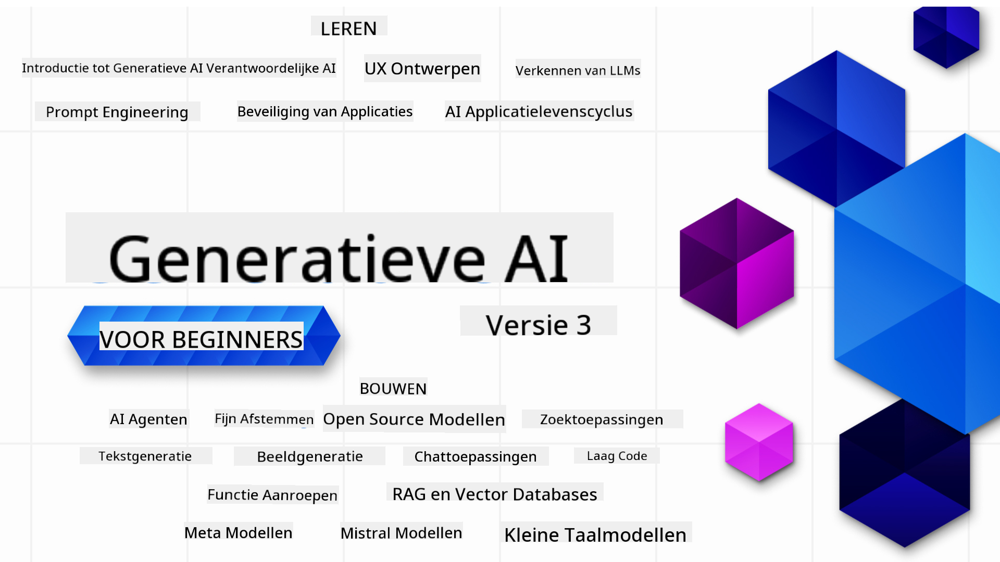

<!--
CO_OP_TRANSLATOR_METADATA:
{
  "original_hash": "c2ee25895ebbfa1a52868bb6eab686fc",
  "translation_date": "2025-05-19T11:50:33+00:00",
  "source_file": "README.md",
  "language_code": "nl"
}
-->

### 21 lessen die alles leren wat je moet weten om te beginnen met het bouwen van Generatieve AI-toepassingen

### 🌐 Ondersteuning voor meerdere talen

#### Ondersteund via GitHub Action (Geautomatiseerd & Altijd Actueel)
[Frans](../fr/README.md) | [Spaans](../es/README.md) | [Duits](../de/README.md) | [Russisch](../ru/README.md) | [Arabisch](../ar/README.md) | [Perzisch (Farsi)](../fa/README.md) | [Urdu](../ur/README.md) | [Chinees (Vereenvoudigd)](../zh/README.md) | [Chinees (Traditioneel, Macau)](../mo/README.md) | [Chinees (Traditioneel, Hong Kong)](../hk/README.md) | [Chinees (Traditioneel, Taiwan)](../tw/README.md) | [Japans](../ja/README.md) | [Koreaans](../ko/README.md) | [Hindi](../hi/README.md) | [Bengaals](../bn/README.md) | [Marathi](../mr/README.md) | [Nepalees](../ne/README.md) | [Punjabi (Gurmukhi)](../pa/README.md) | [Portugees (Portugal)](../pt/README.md) | [Portugees (Brazilië)](../br/README.md) | [Italiaans](../it/README.md) | [Pools](../pl/README.md) | [Turks](../tr/README.md) | [Grieks](../el/README.md) | [Thais](../th/README.md) | [Zweeds](../sv/README.md) | [Deens](../da/README.md) | [Noors](../no/README.md) | [Fins](../fi/README.md) | [Nederlands](./README.md) | [Hebreeuws](../he/README.md) | [Vietnamees](../vi/README.md) | [Indonesisch](../id/README.md) | [Maleis](../ms/README.md) | [Tagalog (Filipijns)](../tl/README.md) | [Swahili](../sw/README.md) | [Hongaars](../hu/README.md) | [Tsjechisch](../cs/README.md) | [Slowaaks](../sk/README.md) | [Roemeens](../ro/README.md) | [Bulgaars](../bg/README.md) | [Servisch (Cyrillisch)](../sr/README.md) | [Kroatisch](../hr/README.md) | [Sloveens](../sl/README.md) Schrijf de uitvoer van links naar rechts.
# Generatieve AI voor Beginners (Versie 3) - Een Cursus

Leer de basisprincipes van het bouwen van Generatieve AI-toepassingen met onze uitgebreide cursus van 21 lessen door Microsoft Cloud Advocates.

## 🌱 Aan de slag

Deze cursus bestaat uit 21 lessen. Elke les behandelt een eigen onderwerp, dus begin waar je wilt!

Lessen zijn gelabeld als "Learn"-lessen die een Generatieve AI-concept uitleggen of "Build"-lessen die een concept en codevoorbeelden in zowel **Python** als **TypeScript** uitleggen wanneer mogelijk.

Voor .NET-ontwikkelaars, bekijk [Generatieve AI voor Beginners (.NET Editie)](https://github.com/microsoft/Generative-AI-for-beginners-dotnet?WT.mc_id=academic-105485-koreyst)!

Elke les bevat ook een "Keep Learning"-sectie met aanvullende leermiddelen.

## Wat je nodig hebt
### Om de code van deze cursus te draaien, kun je gebruikmaken van:
 - [Azure OpenAI Service](https://aka.ms/genai-beginners/azure-open-ai?WT.mc_id=academic-105485-koreyst) - **Lessen:** "aoai-assignment"
 - [GitHub Marketplace Model Catalog](https://aka.ms/genai-beginners/gh-models?WT.mc_id=academic-105485-koreyst) - **Lessen:** "githubmodels"
 - [OpenAI API](https://aka.ms/genai-beginners/open-ai?WT.mc_id=academic-105485-koreyst) - **Lessen:** "oai-assignment" 

- Basiskennis van Python of TypeScript is nuttig - \*Voor absolute beginners, bekijk deze [Python](https://aka.ms/genai-beginners/python?WT.mc_id=academic-105485-koreyst) en [TypeScript](https://aka.ms/genai-beginners/typescript?WT.mc_id=academic-105485-koreyst) cursussen
- Een GitHub-account om [deze hele repo te forken](https://aka.ms/genai-beginners/github?WT.mc_id=academic-105485-koreyst) naar je eigen GitHub-account

We hebben een **[Cursus Setup](./00-course-setup/README.md?WT.mc_id=academic-105485-koreyst)** les gemaakt om je te helpen met het opzetten van je ontwikkelomgeving.

Vergeet niet om [deze repo te sterren (🌟)](https://docs.github.com/en/get-started/exploring-projects-on-github/saving-repositories-with-stars?WT.mc_id=academic-105485-koreyst) om het later makkelijker terug te vinden.

## 🧠 Klaar om te implementeren?

Als je op zoek bent naar meer geavanceerde codevoorbeelden, bekijk dan onze [collectie van Generatieve AI Codevoorbeelden](https://aka.ms/genai-beg-code?WT.mc_id=academic-105485-koreyst) in zowel **Python** als **TypeScript**.

## 🗣️ Ontmoet andere leerlingen, krijg ondersteuning

Word lid van onze [officiële Azure AI Foundry Discord-server](https://aka.ms/genai-discord?WT.mc_id=academic-105485-koreyst) om andere leerlingen die deze cursus volgen te ontmoeten en te netwerken en ondersteuning te krijgen.

Stel vragen of deel productfeedback in ons [Azure AI Foundry Developer Forum](https://aka.ms/azureaifoundry/forum) op Github.

## 🚀 Een startup bouwen?

Meld je aan voor [Microsoft voor Startups Founders Hub](https://aka.ms/genai-foundershub?WT.mc_id=academic-105485-koreyst) om **gratis OpenAI-tegoeden** en tot **$150k aan Azure-tegoeden te ontvangen om toegang te krijgen tot OpenAI-modellen via Azure OpenAI Services**.

## 🙏 Wil je helpen?

Heb je suggesties of heb je spelfouten of codefouten gevonden? [Meld een probleem](https://github.com/microsoft/generative-ai-for-beginners/issues?WT.mc_id=academic-105485-koreyst) of [Maak een pull request](https://github.com/microsoft/generative-ai-for-beginners/pulls?WT.mc_id=academic-105485-koreyst)

## 📂 Elke les bevat:

- Een korte video-inleiding tot het onderwerp
- Een geschreven les in de README
- Python en TypeScript codevoorbeelden ter ondersteuning van Azure OpenAI en OpenAI API
- Links naar extra bronnen om je leerproces voort te zetten

## 🗃️ Lessen

| #   | **Les Link**                                                                                                                              | **Beschrijving**                                                                                 | **Video**                                                                   | **Extra Leren**                                                             |
| --- | -------------------------------------------------------------------------------------------------------------------------------------------- | ----------------------------------------------------------------------------------------------- | --------------------------------------------------------------------------- | ------------------------------------------------------------------------------ |
| 00  | [Cursus Setup](./00-course-setup/README.md?WT.mc_id=academic-105485-koreyst)                                                                 | **Learn:** Hoe je je ontwikkelomgeving instelt                                            | Video Komt Binnenkort                                                                 | [Meer Leren](https://aka.ms/genai-collection?WT.mc_id=academic-105485-koreyst) |
| 01  | [Introductie tot Generatieve AI en LLMs](./01-introduction-to-genai/README.md?WT.mc_id=academic-105485-koreyst)                              | **Learn:** Begrijpen wat Generatieve AI is en hoe Grote Taalmodellen (LLMs) werken.       | [Video](https://aka.ms/gen-ai-lesson-1-gh?WT.mc_id=academic-105485-koreyst) | [Meer Leren](https://aka.ms/genai-collection?WT.mc_id=academic-105485-koreyst) |
| 02  | [Verkennen en vergelijken van verschillende LLMs](./02-exploring-and-comparing-different-llms/README.md?WT.mc_id=academic-105485-koreyst)             | **Learn:** Hoe je het juiste model voor je gebruikssituatie kiest                                      | [Video](https://aka.ms/gen-ai-lesson2-gh?WT.mc_id=academic-105485-koreyst)  | [Meer Leren](https://aka.ms/genai-collection?WT.mc_id=academic-105485-koreyst) |
| 03  | [Generatieve AI verantwoord gebruiken](./03-using-generative-ai-responsibly/README.md?WT.mc_id=academic-105485-koreyst)                           | **Learn:** Hoe je Generatieve AI-toepassingen verantwoord bouwt                                  | [Video](https://aka.ms/gen-ai-lesson3-gh?WT.mc_id=academic-105485-koreyst)  | [Meer Leren](https://aka.ms/genai-collection?WT.mc_id=academic-105485-koreyst) |
| 04  | [Begrijpen van de basisprincipes van Prompt Engineering](./04-prompt-engineering-fundamentals/README.md?WT.mc_id=academic-105485-koreyst)             | **Learn:** Praktische Best Practices voor Prompt Engineering                                           | [Video](https://aka.ms/gen-ai-lesson4-gh?WT.mc_id=academic-105485-koreyst)  | [Meer Leren](https://aka.ms/genai-collection?WT.mc_id=academic-105485-koreyst) |
| 05  | [Geavanceerde Prompts Maken](./05-advanced-prompts/README.md?WT.mc_id=academic-105485-koreyst)                                                | **Leer:** Hoe je technieken voor prompt engineering kunt toepassen die het resultaat van je prompts verbeteren. | [Video](https://aka.ms/gen-ai-lesson5-gh?WT.mc_id=academic-105485-koreyst)  | [Meer leren](https://aka.ms/genai-collection?WT.mc_id=academic-105485-koreyst) |
| 06  | [Tekstgeneratie-applicaties Bouwen](./06-text-generation-apps/README.md?WT.mc_id=academic-105485-koreyst)                                | **Bouw:** Een tekstgeneratie-app met behulp van Azure OpenAI / OpenAI API                                | [Video](https://aka.ms/gen-ai-lesson6-gh?WT.mc_id=academic-105485-koreyst)  | [Meer leren](https://aka.ms/genai-collection?WT.mc_id=academic-105485-koreyst) |
| 07  | [Chatapplicaties Bouwen](./07-building-chat-applications/README.md?WT.mc_id=academic-105485-koreyst)                                     | **Bouw:** Technieken voor het efficiënt bouwen en integreren van chatapplicaties.               | [Video](https://aka.ms/gen-ai-lessons7-gh?WT.mc_id=academic-105485-koreyst) | [Meer leren](https://aka.ms/genai-collection?WT.mc_id=academic-105485-koreyst) |
| 08  | [Zoekapps Bouwen met Vector Databases](./08-building-search-applications/README.md?WT.mc_id=academic-105485-koreyst)                        | **Bouw:** Een zoekapplicatie die Embeddings gebruikt om data te doorzoeken.                        | [Video](https://aka.ms/gen-ai-lesson8-gh?WT.mc_id=academic-105485-koreyst)  | [Meer leren](https://aka.ms/genai-collection?WT.mc_id=academic-105485-koreyst) |
| 09  | [Afbeeldingsgeneratie-applicaties Bouwen](./09-building-image-applications/README.md?WT.mc_id=academic-105485-koreyst)                        | **Bouw:** Een applicatie voor afbeeldingsgeneratie                                                       | [Video](https://aka.ms/gen-ai-lesson9-gh?WT.mc_id=academic-105485-koreyst)  | [Meer leren](https://aka.ms/genai-collection?WT.mc_id=academic-105485-koreyst) |
| 10  | [Low Code AI Applicaties Bouwen](./10-building-low-code-ai-applications/README.md?WT.mc_id=academic-105485-koreyst)                       | **Bouw:** Een Generatieve AI-applicatie met behulp van Low Code-tools                                     | [Video](https://aka.ms/gen-ai-lesson10-gh?WT.mc_id=academic-105485-koreyst) | [Meer leren](https://aka.ms/genai-collection?WT.mc_id=academic-105485-koreyst) |
| 11  | [Externe Applicaties Integreren met Function Calling](./11-integrating-with-function-calling/README.md?WT.mc_id=academic-105485-koreyst) | **Bouw:** Wat function calling is en de gebruikstoepassingen voor applicaties                          | [Video](https://aka.ms/gen-ai-lesson11-gh?WT.mc_id=academic-105485-koreyst) | [Meer leren](https://aka.ms/genai-collection?WT.mc_id=academic-105485-koreyst) |
| 12  | [UX Ontwerpen voor AI Applicaties](./12-designing-ux-for-ai-applications/README.md?WT.mc_id=academic-105485-koreyst)                         | **Leer:** Hoe je UX-ontwerpprincipes kunt toepassen bij het ontwikkelen van Generatieve AI-applicaties         | [Video](https://aka.ms/gen-ai-lesson12-gh?WT.mc_id=academic-105485-koreyst) | [Meer leren](https://aka.ms/genai-collection?WT.mc_id=academic-105485-koreyst) |
| 13  | [Je Generatieve AI Applicaties Beveiligen](./13-securing-ai-applications/README.md?WT.mc_id=academic-105485-koreyst)                         | **Leer:** De bedreigingen en risico's voor AI-systemen en methoden om deze systemen te beveiligen.             | [Video](https://aka.ms/gen-ai-lesson13-gh?WT.mc_id=academic-105485-koreyst) | [Meer leren](https://aka.ms/genai-collection?WT.mc_id=academic-105485-koreyst) |
| 14  | [De Levenscyclus van Generatieve AI Applicaties](./14-the-generative-ai-application-lifecycle/README.md?WT.mc_id=academic-105485-koreyst)           | **Leer:** De tools en metrics om de LLM-levenscyclus en LLMOps te beheren                         | [Video](https://aka.ms/gen-ai-lesson14-gh?WT.mc_id=academic-105485-koreyst) | [Meer leren](https://aka.ms/genai-collection?WT.mc_id=academic-105485-koreyst) |
| 15  | [Retrieval Augmented Generation (RAG) en Vector Databases](./15-rag-and-vector-databases/README.md?WT.mc_id=academic-105485-koreyst)        | **Bouw:** Een applicatie met een RAG-framework om embeddings op te halen uit een Vector Database  | [Video](https://aka.ms/gen-ai-lesson15-gh?WT.mc_id=academic-105485-koreyst) | [Meer informatie](https://aka.ms/genai-collection?WT.mc_id=academic-105485-koreyst) |
| 16  | [Open Source Modellen en Hugging Face](./16-open-source-models/README.md?WT.mc_id=academic-105485-koreyst)                                    | **Bouw:** Een applicatie met open source modellen beschikbaar op Hugging Face                    | [Video](https://aka.ms/gen-ai-lesson16-gh?WT.mc_id=academic-105485-koreyst) | [Meer informatie](https://aka.ms/genai-collection?WT.mc_id=academic-105485-koreyst) |
| 17  | [AI Agents](./17-ai-agents/README.md?WT.mc_id=academic-105485-koreyst)                                                                       | **Bouw:** Een applicatie met een AI Agent Framework                                           | [Video](https://aka.ms/gen-ai-lesson17-gh?WT.mc_id=academic-105485-koreyst) | [Meer informatie](https://aka.ms/genai-collection?WT.mc_id=academic-105485-koreyst) |
| 18  | [Fijn-afstemmen van LLMs](./18-fine-tuning/README.md?WT.mc_id=academic-105485-koreyst)                                                              | **Leer:** Het wat, waarom en hoe van het fijn-afstemmen van LLMs                                            | [Video](https://aka.ms/gen-ai-lesson18-gh?WT.mc_id=academic-105485-koreyst) | [Meer informatie](https://aka.ms/genai-collection?WT.mc_id=academic-105485-koreyst) |
| 19  | [Bouwen met SLMs](./19-slm/README.md?WT.mc_id=academic-105485-koreyst)                                                              | **Leer:** De voordelen van bouwen met Small Language Models                                            | Video Komt Binnenkort | [Meer informatie](https://aka.ms/genai-collection?WT.mc_id=academic-105485-koreyst) |
| 20  | [Bouwen met Mistral Modellen](./20-mistral/README.md?WT.mc_id=academic-105485-koreyst)                                                              | **Leer:** De kenmerken en verschillen van de Mistral Family Modellen                                           | Video Komt Binnenkort | [Meer informatie](https://aka.ms/genai-collection?WT.mc_id=academic-105485-koreyst) |
| 21  | [Bouwen met Meta Modellen](./21-meta/README.md?WT.mc_id=academic-105485-koreyst)                                                              | **Leer:** De kenmerken en verschillen van de Meta Family Modellen                                           | Video Komt Binnenkort | [Meer informatie](https://aka.ms/genai-collection?WT.mc_id=academic-105485-koreyst) |

### 🌟 Speciale dank

Speciale dank aan [**John Aziz**](https://www.linkedin.com/in/john0isaac/) voor het creëren van alle GitHub-acties en workflows

[**Bernhard Merkle**](https://www.linkedin.com/in/bernhard-merkle-738b73/) voor het leveren van belangrijke bijdragen aan elke les om de ervaring van de leerling en de code te verbeteren.

## 🎒 Andere Cursussen

Ons team produceert andere cursussen! Bekijk:

- [**NIEUW** AI Agents voor Beginners](https://github.com/microsoft/ai-agents-for-beginners?WT.mc_id=academic-105485-koreyst)
- [**NIEUW** Generatieve AI voor Beginners met .NET](https://github.com/microsoft/Generative-AI-for-beginners-dotnet?WT.mc_id=academic-105485-koreyst)
- [**NIEUW** Generatieve AI voor Beginners met JavaScript](https://aka.ms/genai-js-course?WT.mc_id=academic-105485-koreyst)
- [ML voor Beginners](https://aka.ms/ml-beginners?WT.mc_id=academic-105485-koreyst)
- [Data Science voor Beginners](https://aka.ms/datascience-beginners?WT.mc_id=academic-105485-koreyst)
- [AI voor Beginners](https://aka.ms/ai-beginners?WT.mc_id=academic-105485-koreyst)
- [Cybersecurity voor Beginners](https://github.com/microsoft/Security-101??WT.mc_id=academic-96948-sayoung)
- [Webontwikkeling voor Beginners](https://aka.ms/webdev-beginners?WT.mc_id=academic-105485-koreyst)
- [IoT voor Beginners](https://aka.ms/iot-beginners?WT.mc_id=academic-105485-koreyst)
- [XR Ontwikkeling voor Beginners](https://github.com/microsoft/xr-development-for-beginners?WT.mc_id=academic-105485-koreyst)
- [GitHub Copilot onder de knie krijgen voor AI Paired Programming](https://aka.ms/GitHubCopilotAI?WT.mc_id=academic-105485-koreyst)
- [GitHub Copilot onder de knie krijgen voor C#/.NET Ontwikkelaars](https://github.com/microsoft/mastering-github-copilot-for-dotnet-csharp-developers?WT.mc_id=academic-105485-koreyst)
- [Kies je eigen Copilot avontuur](https://github.com/microsoft/CopilotAdventures?WT.mc_id=academic-105485-koreyst)

**Disclaimer**:  
Dit document is vertaald met behulp van de AI-vertalingsservice [Co-op Translator](https://github.com/Azure/co-op-translator). Hoewel we ons best doen voor nauwkeurigheid, houd er rekening mee dat geautomatiseerde vertalingen fouten of onnauwkeurigheden kunnen bevatten. Het oorspronkelijke document in de oorspronkelijke taal moet worden beschouwd als de gezaghebbende bron. Voor kritieke informatie wordt professionele menselijke vertaling aanbevolen. Wij zijn niet aansprakelijk voor misverstanden of verkeerde interpretaties die voortvloeien uit het gebruik van deze vertaling.