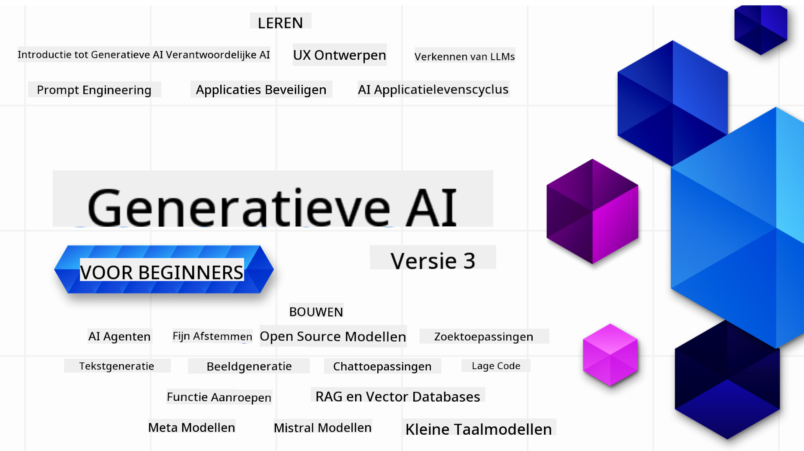

<!--
CO_OP_TRANSLATOR_METADATA:
{
  "original_hash": "6e3f4c8a4f323b8eab1cf11ded304b0f",
  "translation_date": "2025-06-25T08:03:57+00:00",
  "source_file": "README.md",
  "language_code": "nl"
}
-->

### 21 Lessen die je alles leren wat je moet weten om te beginnen met het bouwen van Generatieve AI-toepassingen

### 🌐 Ondersteuning voor meerdere talen

#### Ondersteund via GitHub Action (Geautomatiseerd & Altijd Up-to-Date)

# Generatieve AI voor Beginners (Versie 3) - Een Cursus

Leer de basisprincipes van het bouwen van Generatieve AI-toepassingen met onze uitgebreide cursus van 21 lessen door Microsoft Cloud Advocates.

## 🌱 Aan de Slag

Deze cursus bevat 21 lessen. Elke les behandelt een eigen onderwerp, dus begin waar je maar wilt!

Lessen zijn gelabeld als "Leer"-lessen die een concept van Generatieve AI uitleggen of "Bouw"-lessen die een concept en codevoorbeelden uitleggen in zowel **Python** als **TypeScript**, waar mogelijk.

Voor .NET-ontwikkelaars, bekijk [Generatieve AI voor Beginners (.NET Editie)](https://github.com/microsoft/Generative-AI-for-beginners-dotnet?WT.mc_id=academic-105485-koreyst)!

Elke les bevat ook een "Blijf Leren"-sectie met extra leermiddelen.

## Wat Je Nodig Hebt
### Om de code van deze cursus uit te voeren, kun je gebruikmaken van:
- [Azure OpenAI Service](https://aka.ms/genai-beginners/azure-open-ai?WT.mc_id=academic-105485-koreyst) - **Lessen:** "aoai-opdracht"
- [GitHub Marketplace Model Catalogus](https://aka.ms/genai-beginners/gh-models?WT.mc_id=academic-105485-koreyst) - **Lessen:** "githubmodels"
- [OpenAI API](https://aka.ms/genai-beginners/open-ai?WT.mc_id=academic-105485-koreyst) - **Lessen:** "oai-opdracht" 

- Basiskennis van Python of TypeScript is nuttig - \*Voor absolute beginners, bekijk deze [Python](https://aka.ms/genai-beginners/python?WT.mc_id=academic-105485-koreyst) en [TypeScript](https://aka.ms/genai-beginners/typescript?WT.mc_id=academic-105485-koreyst) cursussen
- Een GitHub-account om [deze hele repo te forken](https://aka.ms/genai-beginners/github?WT.mc_id=academic-105485-koreyst) naar je eigen GitHub-account

We hebben een **[Cursus Setup](./00-course-setup/README.md?WT.mc_id=academic-105485-koreyst)** les gemaakt om je te helpen met het instellen van je ontwikkelomgeving.

Vergeet niet om [deze repo te ster (🌟)](https://docs.github.com/en/get-started/exploring-projects-on-github/saving-repositories-with-stars?WT.mc_id=academic-105485-koreyst) zodat je het later makkelijker kunt terugvinden.

## 🧠 Klaar om te Implementeren?

Als je op zoek bent naar meer geavanceerde codevoorbeelden, bekijk dan onze [collectie van Generatieve AI Codevoorbeelden](https://aka.ms/genai-beg-code?WT.mc_id=academic-105485-koreyst) in zowel **Python** als **TypeScript**.

## 🗣️ Ontmoet Andere Leerlingen, Krijg Ondersteuning

Word lid van onze [officiële Azure AI Foundry Discord-server](https://aka.ms/genai-discord?WT.mc_id=academic-105485-koreyst) om andere leerlingen te ontmoeten die deze cursus volgen en om ondersteuning te krijgen.

Stel vragen of deel productfeedback in ons [Azure AI Foundry Developer Forum](https://aka.ms/azureaifoundry/forum) op Github.

## 🚀 Een Startup Bouwen?

Meld je aan voor [Microsoft for Startups Founders Hub](https://aka.ms/genai-foundershub?WT.mc_id=academic-105485-koreyst) om **gratis OpenAI-credits** te ontvangen en tot **$150k aan Azure-credits om toegang te krijgen tot OpenAI-modellen via Azure OpenAI Services**.

## 🙏 Wil je helpen?

Heb je suggesties of heb je spelfouten of codefouten gevonden? [Meld een probleem](https://github.com/microsoft/generative-ai-for-beginners/issues?WT.mc_id=academic-105485-koreyst) of [Maak een pull request](https://github.com/microsoft/generative-ai-for-beginners/pulls?WT.mc_id=academic-105485-koreyst)

## 📂 Elke les bevat:

- Een korte video-introductie tot het onderwerp
- Een geschreven les in de README
- Python- en TypeScript-codevoorbeelden ter ondersteuning van Azure OpenAI en OpenAI API
- Links naar extra bronnen om je leerproces voort te zetten

## 🗃️ Lessen

| #   | **Les Link**                                                                                                                             | **Beschrijving**                                                                                | **Video**                                                                   | **Extra Leren**                                                                 |
| --- | ---------------------------------------------------------------------------------------------------------------------------------------- | ----------------------------------------------------------------------------------------------- | --------------------------------------------------------------------------- | ------------------------------------------------------------------------------ |
| 00  | [Cursus Setup](./00-course-setup/README.md?WT.mc_id=academic-105485-koreyst)                                                             | **Leer:** Hoe je je ontwikkelomgeving instelt                                                   | Video Komt Binnenkort                                                       | [Meer Leren](https://aka.ms/genai-collection?WT.mc_id=academic-105485-koreyst) |
| 01  | [Introductie tot Generatieve AI en LLMs](./01-introduction-to-genai/README.md?WT.mc_id=academic-105485-koreyst)                          | **Leer:** Begrijpen wat Generatieve AI is en hoe Grote Taalmodellen (LLMs) werken.              | [Video](https://aka.ms/gen-ai-lesson-1-gh?WT.mc_id=academic-105485-koreyst) | [Meer Leren](https://aka.ms/genai-collection?WT.mc_id=academic-105485-koreyst) |
| 02  | [Verkennen en vergelijken van verschillende LLMs](./02-exploring-and-comparing-different-llms/README.md?WT.mc_id=academic-105485-koreyst) | **Leer:** Hoe je het juiste model voor jouw gebruikssituatie selecteert                          | [Video](https://aka.ms/gen-ai-lesson2-gh?WT.mc_id=academic-105485-koreyst)  | [Meer Leren](https://aka.ms/genai-collection?WT.mc_id=academic-105485-koreyst) |
| 03  | [Verantwoordelijk Gebruik van Generatieve AI](./03-using-generative-ai-responsibly/README.md?WT.mc_id=academic-105485-koreyst)           | **Leer:** Hoe je Generatieve AI-toepassingen op verantwoorde wijze bouwt                         | [Video](https://aka.ms/gen-ai-lesson3-gh?WT.mc_id=academic-105485-koreyst)  | [Meer Leren](https://aka.ms/genai-collection?WT.mc_id=academic-105485-koreyst) |
| 04  | [Begrijpen van Prompt Engineering Grondbeginselen](./04-prompt-engineering-fundamentals/README.md?WT.mc_id=academic-105485-koreyst)      | **Leer:** Praktische Beste Practices voor Prompt Engineering                                    | [Video](https://aka.ms/gen-ai-lesson4-gh?WT.mc_id=academic-105485-koreyst)  | [Meer Leren](https://aka.ms/genai-collection?WT.mc_id=academic-105485-koreyst) |
| 05  | [Geavanceerde Prompts Maken](./05-advanced-prompts/README.md?WT.mc_id=academic-105485-koreyst)                                                | **Leer:** Hoe je prompt engineering technieken kunt toepassen die de uitkomst van je prompts verbeteren. | [Video](https://aka.ms/gen-ai-lesson5-gh?WT.mc_id=academic-105485-koreyst)  | [Meer Leren](https://aka.ms/genai-collection?WT.mc_id=academic-105485-koreyst) |
| 06  | [Tekstgeneratie Applicaties Bouwen](./06-text-generation-apps/README.md?WT.mc_id=academic-105485-koreyst)                                | **Bouw:** Een tekstgeneratie app met Azure OpenAI / OpenAI API                                | [Video](https://aka.ms/gen-ai-lesson6-gh?WT.mc_id=academic-105485-koreyst)  | [Meer Leren](https://aka.ms/genai-collection?WT.mc_id=academic-105485-koreyst) |
| 07  | [Chatapplicaties Bouwen](./07-building-chat-applications/README.md?WT.mc_id=academic-105485-koreyst)                                     | **Bouw:** Technieken voor het efficiënt bouwen en integreren van chatapplicaties.               | [Video](https://aka.ms/gen-ai-lessons7-gh?WT.mc_id=academic-105485-koreyst) | [Meer Leren](https://aka.ms/genai-collection?WT.mc_id=academic-105485-koreyst) |
| 08  | [Zoekapps Bouwen met Vector Databases](./08-building-search-applications/README.md?WT.mc_id=academic-105485-koreyst)                        | **Bouw:** Een zoekapplicatie die Embeddings gebruikt om data te doorzoeken.                        | [Video](https://aka.ms/gen-ai-lesson8-gh?WT.mc_id=academic-105485-koreyst)  | [Meer Leren](https://aka.ms/genai-collection?WT.mc_id=academic-105485-koreyst) |
| 09  | [Afbeeldingsgeneratie Applicaties Bouwen](./09-building-image-applications/README.md?WT.mc_id=academic-105485-koreyst)                        | **Bouw:** Een afbeeldingsgeneratie applicatie                                                       | [Video](https://aka.ms/gen-ai-lesson9-gh?WT.mc_id=academic-105485-koreyst)  | [Meer Leren](https://aka.ms/genai-collection?WT.mc_id=academic-105485-koreyst) |
| 10  | [Low Code AI Applicaties Bouwen](./10-building-low-code-ai-applications/README.md?WT.mc_id=academic-105485-koreyst)                       | **Bouw:** Een Generatieve AI applicatie met Low Code tools                                     | [Video](https://aka.ms/gen-ai-lesson10-gh?WT.mc_id=academic-105485-koreyst) | [Meer Leren](https://aka.ms/genai-collection?WT.mc_id=academic-105485-koreyst) |
| 11  | [Externe Applicaties Integreren met Function Calling](./11-integrating-with-function-calling/README.md?WT.mc_id=academic-105485-koreyst) | **Bouw:** Wat is function calling en de gebruikssituaties voor applicaties                          | [Video](https://aka.ms/gen-ai-lesson11-gh?WT.mc_id=academic-105485-koreyst) | [Meer Leren](https://aka.ms/genai-collection?WT.mc_id=academic-105485-koreyst) |
| 12  | [UX Ontwerpen voor AI Applicaties](./12-designing-ux-for-ai-applications/README.md?WT.mc_id=academic-105485-koreyst)                         | **Leer:** Hoe je UX ontwerpprincipes toepast bij het ontwikkelen van Generatieve AI Applicaties         | [Video](https://aka.ms/gen-ai-lesson12-gh?WT.mc_id=academic-105485-koreyst) | [Meer Leren](https://aka.ms/genai-collection?WT.mc_id=academic-105485-koreyst) |
| 13  | [Je Generatieve AI Applicaties Beveiligen](./13-securing-ai-applications/README.md?WT.mc_id=academic-105485-koreyst)                         | **Leer:** De bedreigingen en risico's voor AI-systemen en methoden om deze systemen te beveiligen.             | [Video](https://aka.ms/gen-ai-lesson13-gh?WT.mc_id=academic-105485-koreyst) | [Meer Leren](https://aka.ms/genai-collection?WT.mc_id=academic-105485-koreyst) |
| 14  | [De Generatieve AI Applicatie Levenscyclus](./14-the-generative-ai-application-lifecycle/README.md?WT.mc_id=academic-105485-koreyst)           | **Leer:** De tools en metrics om de LLM Levenscyclus en LLMOps te beheren                         | [Video](https://aka.ms/gen-ai-lesson14-gh?WT.mc_id=academic-105485-koreyst) | [Meer Leren](https://aka.ms/genai-collection?WT.mc_id=academic-105485-koreyst) |
| 15  | [Retrieval Augmented Generation (RAG) en Vector Databases](./15-rag-and-vector-databases/README.md?WT.mc_id=academic-105485-koreyst)        | **Bouwen:** Een applicatie gebruiken met een RAG Framework om embeddings uit een Vector Database op te halen  | [Video](https://aka.ms/gen-ai-lesson15-gh?WT.mc_id=academic-105485-koreyst) | [Meer leren](https://aka.ms/genai-collection?WT.mc_id=academic-105485-koreyst) |
| 16  | [Open Source Modellen en Hugging Face](./16-open-source-models/README.md?WT.mc_id=academic-105485-koreyst)                                    | **Bouwen:** Een applicatie gebruiken met open source modellen beschikbaar op Hugging Face                    | [Video](https://aka.ms/gen-ai-lesson16-gh?WT.mc_id=academic-105485-koreyst) | [Meer leren](https://aka.ms/genai-collection?WT.mc_id=academic-105485-koreyst) |
| 17  | [AI Agents](./17-ai-agents/README.md?WT.mc_id=academic-105485-koreyst)                                                                       | **Bouwen:** Een applicatie gebruiken met een AI Agent Framework                                           | [Video](https://aka.ms/gen-ai-lesson17-gh?WT.mc_id=academic-105485-koreyst) | [Meer leren](https://aka.ms/genai-collection?WT.mc_id=academic-105485-koreyst) |
| 18  | [Fine-Tuning van LLMs](./18-fine-tuning/README.md?WT.mc_id=academic-105485-koreyst)                                                              | **Leren:** Het wat, waarom en hoe van fine-tuning van LLMs                                            | [Video](https://aka.ms/gen-ai-lesson18-gh?WT.mc_id=academic-105485-koreyst) | [Meer leren](https://aka.ms/genai-collection?WT.mc_id=academic-105485-koreyst) |
| 19  | [Bouwen met SLMs](./19-slm/README.md?WT.mc_id=academic-105485-koreyst)                                                              | **Leren:** De voordelen van bouwen met Small Language Models                                            | Video binnenkort beschikbaar | [Meer leren](https://aka.ms/genai-collection?WT.mc_id=academic-105485-koreyst) |
| 20  | [Bouwen met Mistral Modellen](./20-mistral/README.md?WT.mc_id=academic-105485-koreyst)                                                              | **Leren:** De kenmerken en verschillen van de Mistral Familie Modellen                                           | Video binnenkort beschikbaar | [Meer leren](https://aka.ms/genai-collection?WT.mc_id=academic-105485-koreyst) |
| 21  | [Bouwen met Meta Modellen](./21-meta/README.md?WT.mc_id=academic-105485-koreyst)                                                              | **Leren:** De kenmerken en verschillen van de Meta Familie Modellen                                           | Video binnenkort beschikbaar | [Meer leren](https://aka.ms/genai-collection?WT.mc_id=academic-105485-koreyst) |

### 🌟 Speciale dank

Speciale dank aan [**John Aziz**](https://www.linkedin.com/in/john0isaac/) voor het maken van alle GitHub Acties en workflows

[**Bernhard Merkle**](https://www.linkedin.com/in/bernhard-merkle-738b73/) voor het leveren van belangrijke bijdragen aan elke les om de leer- en code-ervaring te verbeteren.

## 🎒 Andere cursussen

Ons team produceert andere cursussen! Bekijk:

- [**NIEUW** Model Context Protocol voor Beginners](https://github.com/microsoft/mcp-for-beginners?WT.mc_id=academic-105485-koreyst)
- [AI Agents voor Beginners](https://github.com/microsoft/ai-agents-for-beginners?WT.mc_id=academic-105485-koreyst)
- [Generatieve AI voor Beginners met .NET](https://github.com/microsoft/Generative-AI-for-beginners-dotnet?WT.mc_id=academic-105485-koreyst)
- [Generatieve AI voor Beginners met JavaScript](https://aka.ms/genai-js-course?WT.mc_id=academic-105485-koreyst)
- [ML voor Beginners](https://aka.ms/ml-beginners?WT.mc_id=academic-105485-koreyst)
- [Data Science voor Beginners](https://aka.ms/datascience-beginners?WT.mc_id=academic-105485-koreyst)
- [AI voor Beginners](https://aka.ms/ai-beginners?WT.mc_id=academic-105485-koreyst)
- [Cybersecurity voor Beginners](https://github.com/microsoft/Security-101??WT.mc_id=academic-96948-sayoung)
- [Webontwikkeling voor Beginners](https://aka.ms/webdev-beginners?WT.mc_id=academic-105485-koreyst)
- [IoT voor Beginners](https://aka.ms/iot-beginners?WT.mc_id=academic-105485-koreyst)
- [XR-ontwikkeling voor beginners](https://github.com/microsoft/xr-development-for-beginners?WT.mc_id=academic-105485-koreyst)
- [GitHub Copilot beheersen voor AI Pair Programming](https://aka.ms/GitHubCopilotAI?WT.mc_id=academic-105485-koreyst)
- [GitHub Copilot beheersen voor C#/.NET-ontwikkelaars](https://github.com/microsoft/mastering-github-copilot-for-dotnet-csharp-developers?WT.mc_id=academic-105485-koreyst)
- [Kies je eigen Copilot avontuur](https://github.com/microsoft/CopilotAdventures?WT.mc_id=academic-105485-koreyst)

**Disclaimer**:  
Dit document is vertaald met behulp van de AI-vertalingsdienst [Co-op Translator](https://github.com/Azure/co-op-translator). Hoewel we streven naar nauwkeurigheid, dient u zich ervan bewust te zijn dat geautomatiseerde vertalingen fouten of onnauwkeurigheden kunnen bevatten. Het originele document in zijn oorspronkelijke taal moet worden beschouwd als de gezaghebbende bron. Voor kritieke informatie wordt professionele menselijke vertaling aanbevolen. Wij zijn niet aansprakelijk voor misverstanden of verkeerde interpretaties die voortvloeien uit het gebruik van deze vertaling.