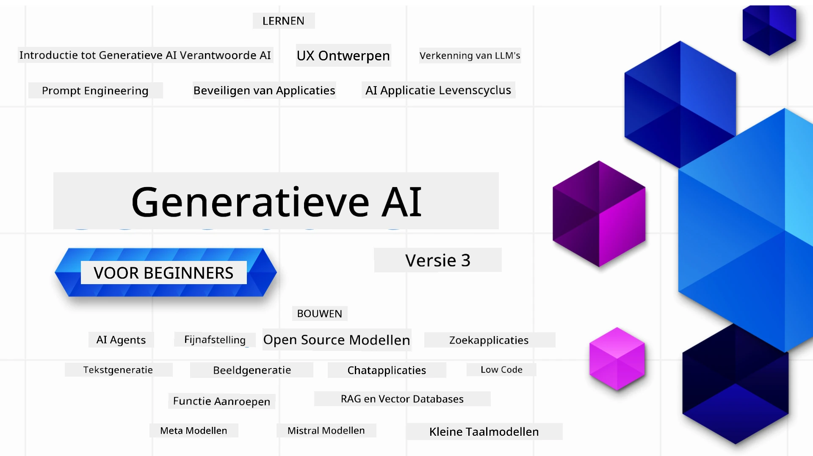

### 21 Lessen die alles leren wat je moet weten om Generatieve AI-toepassingen te bouwen

[](https://github.com/microsoft/Generative-AI-For-Beginners/blob/master/LICENSE?WT.mc_id=academic-105485-koreyst)
[](https://GitHub.com/microsoft/Generative-AI-For-Beginners/graphs/contributors/?WT.mc_id=academic-105485-koreyst)
[](https://GitHub.com/microsoft/Generative-AI-For-Beginners/issues/?WT.mc_id=academic-105485-koreyst)
[](https://GitHub.com/microsoft/Generative-AI-For-Beginners/pulls/?WT.mc_id=academic-105485-koreyst)
[](http://makeapullrequest.com?WT.mc_id=academic-105485-koreyst)

[](https://GitHub.com/microsoft/Generative-AI-For-Beginners/watchers/?WT.mc_id=academic-105485-koreyst)
[](https://GitHub.com/microsoft/Generative-AI-For-Beginners/network/?WT.mc_id=academic-105485-koreyst)
[](https://GitHub.com/microsoft/Generative-AI-For-Beginners/stargazers/?WT.mc_id=academic-105485-koreyst)

[](https://discord.gg/nTYy5BXMWG)

### 🌐 Meertalige Ondersteuning

#### Ondersteund via GitHub Action (Geautomatiseerd & Altijd Actueel)

<!-- CO-OP TRANSLATOR LANGUAGES TABLE START -->
[Arabic](../ar/README.md) | [Bengali](../bn/README.md) | [Bulgarian](../bg/README.md) | [Burmese (Myanmar)](../my/README.md) | [Chinese (Simplified)](../zh-CN/README.md) | [Chinese (Traditional, Hong Kong)](../zh-HK/README.md) | [Chinese (Traditional, Macau)](../zh-MO/README.md) | [Chinese (Traditional, Taiwan)](../zh-TW/README.md) | [Croatian](../hr/README.md) | [Czech](../cs/README.md) | [Danish](../da/README.md) | [Dutch](./README.md) | [Estonian](../et/README.md) | [Finnish](../fi/README.md) | [French](../fr/README.md) | [German](../de/README.md) | [Greek](../el/README.md) | [Hebrew](../he/README.md) | [Hindi](../hi/README.md) | [Hungarian](../hu/README.md) | [Indonesian](../id/README.md) | [Italian](../it/README.md) | [Japanese](../ja/README.md) | [Kannada](../kn/README.md) | [Khmer](../km/README.md) | [Korean](../ko/README.md) | [Lithuanian](../lt/README.md) | [Malay](../ms/README.md) | [Malayalam](../ml/README.md) | [Marathi](../mr/README.md) | [Nepali](../ne/README.md) | [Nigerian Pidgin](../pcm/README.md) | [Norwegian](../no/README.md) | [Persian (Farsi)](../fa/README.md) | [Polish](../pl/README.md) | [Portuguese (Brazil)](../pt-BR/README.md) | [Portuguese (Portugal)](../pt-PT/README.md) | [Punjabi (Gurmukhi)](../pa/README.md) | [Romanian](../ro/README.md) | [Russian](../ru/README.md) | [Serbian (Cyrillic)](../sr/README.md) | [Slovak](../sk/README.md) | [Slovenian](../sl/README.md) | [Spanish](../es/README.md) | [Swahili](../sw/README.md) | [Swedish](../sv/README.md) | [Tagalog (Filipino)](../tl/README.md) | [Tamil](../ta/README.md) | [Telugu](../te/README.md) | [Thai](../th/README.md) | [Turkish](../tr/README.md) | [Ukrainian](../uk/README.md) | [Urdu](../ur/README.md) | [Vietnamese](../vi/README.md)

> **Lieveling lokaal klonen?**
>
> Deze repository bevat 50+ taalvertalingen die de downloadgrootte aanzienlijk verhogen. Om te klonen zonder vertalingen, gebruik je sparse checkout:
>
> **Bash / macOS / Linux:**
> ```bash
> git clone --filter=blob:none --sparse https://github.com/microsoft/generative-ai-for-beginners.git
> cd generative-ai-for-beginners
> git sparse-checkout set --no-cone '/*' '!translations' '!translated_images'
> ```
>
> **CMD (Windows):**
> ```cmd
> git clone --filter=blob:none --sparse https://github.com/microsoft/generative-ai-for-beginners.git
> cd generative-ai-for-beginners
> git sparse-checkout set --no-cone "/*" "!translations" "!translated_images"
> ```
>
> Dit geeft je alles wat je nodig hebt om de cursus te voltooien met een veel snellere download.
<!-- CO-OP TRANSLATOR LANGUAGES TABLE END -->

# Generatieve AI voor Beginners (Versie 3) - Een Cursus

Leer de basisprincipes van het bouwen van Generatieve AI-toepassingen met onze 21-lessen durende uitgebreide cursus door Microsoft Cloud Advocates.

## 🌱 Aan de slag

Deze cursus bestaat uit 21 lessen. Elke les behandelt een eigen onderwerp, dus begin waar je maar wilt!

Lessen zijn gelabeld als "Leer"-lessen die een Generatieve AI-concept uitleggen of "Bouw"-lessen die een concept uitleggen en codevoorbeelden in zowel **Python** als **TypeScript** bieden indien mogelijk.

Voor .NET-ontwikkelaars, bekijk [Generative AI for Beginners (.NET Edition)](https://github.com/microsoft/Generative-AI-for-beginners-dotnet?WT.mc_id=academic-105485-koreyst)!

Elke les bevat ook een sectie "Blijf Leren" met aanvullende leermiddelen.

## Wat je nodig hebt
### Om de code van deze cursus uit te voeren, kun je een van de volgende gebruiken:
 - [Azure OpenAI Service](https://aka.ms/genai-beginners/azure-open-ai?WT.mc_id=academic-105485-koreyst) - **Lessen:** "aoai-assignment"
 - [Microsoft Foundry Models](https://ai.azure.com/catalog/models?WT.mc_id=academic-105485-koreyst) - **Lessen:** "githubmodels" (GitHub Models wordt aan het eind van juli 2026 stopgezet - gebruik in plaats daarvan Microsoft Foundry Models)
 - [OpenAI API](https://aka.ms/genai-beginners/open-ai?WT.mc_id=academic-105485-koreyst) - **Lessen:** "oai-assignment"
 - [Foundry Local](https://foundrylocal.ai?WT.mc_id=academic-105485-koreyst) - Voer modellen volledig offline uit op je eigen apparaat, geen cloud-abonnement vereist
   
- Basiskennis van Python of TypeScript is nuttig - \*Voor absolute beginners bekijk deze [Python](https://aka.ms/genai-beginners/python?WT.mc_id=academic-105485-koreyst) en [TypeScript](https://aka.ms/genai-beginners/typescript?WT.mc_id=academic-105485-koreyst) cursussen
- Een GitHub-account om [deze hele repo te forken](https://aka.ms/genai-beginners/github?WT.mc_id=academic-105485-koreyst) naar je eigen GitHub-account

We hebben een **[Cursus Setup](./00-course-setup/README.md?WT.mc_id=academic-105485-koreyst)** les gemaakt om je te helpen bij het opzetten van je ontwikkelomgeving.

Vergeet niet om [deze repo te voorzien van een ster (🌟)](https://docs.github.com/en/get-started/exploring-projects-on-github/saving-repositories-with-stars?WT.mc_id=academic-105485-koreyst) zodat je hem later gemakkelijker terugvindt.

## 🧠 Klaar om te implementeren?

Als je op zoek bent naar meer geavanceerde codevoorbeelden, bekijk dan onze [collectie van Generatieve AI Code Voorbeelden](https://aka.ms/genai-beg-code?WT.mc_id=academic-105485-koreyst) in zowel **Python** als **TypeScript**.

## 🗣️ Ontmoet andere leerlingen, krijg ondersteuning

Doe mee met onze [officiële Microsoft Foundry Discord-server](https://aka.ms/genai-discord?WT.mc_id=academic-105485-koreyst) om andere cursisten te ontmoeten en te netwerken en ondersteuning te krijgen.

Stel vragen of deel productfeedback in ons [Microsoft Foundry Developer Forum](https://aka.ms/azureaifoundry/forum) op Github.

## 🚀 Een startup bouwen?

Bezoek [Microsoft for Startups](https://www.microsoft.com/startups) om te ontdekken hoe je vandaag nog kunt beginnen met bouwen met Azure-kredieten.

## 🙏 Wil je helpen?

Heb je suggesties of tref je spelfouten of codefouten aan? [Open een issue](https://github.com/microsoft/generative-ai-for-beginners/issues?WT.mc_id=academic-105485-koreyst) of [Maak een pull request](https://github.com/microsoft/generative-ai-for-beginners/pulls?WT.mc_id=academic-105485-koreyst)

## 📂 Iedere les bevat:

- Een korte video-introductie over het onderwerp
- Een geschreven les te vinden in de README
- Python- en TypeScript-codevoorbeelden die Azure OpenAI en OpenAI API ondersteunen
- Links naar extra bronnen om je leren voort te zetten

## 🗃️ Lessen

| #   | **Les Link**                                                                                                                                  | **Beschrijving**                                                                               | **Video**                                                                 | **Extra Leren**                                                               |
| --- | -------------------------------------------------------------------------------------------------------------------------------------------- | --------------------------------------------------------------------------------------------- | ------------------------------------------------------------------------- | ------------------------------------------------------------------------------ |
| 00  | [Cursus Setup](./00-course-setup/README.md?WT.mc_id=academic-105485-koreyst)                                                                   | **Leer:** Hoe je je ontwikkelomgeving opzet                                                | Video komt binnenkort                                                        | [Leer Meer](https://aka.ms/genai-collection?WT.mc_id=academic-105485-koreyst) |
| 01  | [Introductie tot Generatieve AI en LLMs](./01-introduction-to-genai/README.md?WT.mc_id=academic-105485-koreyst)                                | **Leer:** Begrijpen wat Generatieve AI is en hoe Grote Taalmodellen (LLMs) werken.         | [Video](https://aka.ms/gen-ai-lesson-1-gh?WT.mc_id=academic-105485-koreyst) | [Leer Meer](https://aka.ms/genai-collection?WT.mc_id=academic-105485-koreyst) |
| 02  | [Verkennen en vergelijken van verschillende LLMs](./02-exploring-and-comparing-different-llms/README.md?WT.mc_id=academic-105485-koreyst)      | **Leer:** Hoe je het juiste model kiest voor jouw gebruiksgeval                            | [Video](https://aka.ms/gen-ai-lesson2-gh?WT.mc_id=academic-105485-koreyst)  | [Leer Meer](https://aka.ms/genai-collection?WT.mc_id=academic-105485-koreyst) |
| 03  | [Verantwoord gebruik van Generatieve AI](./03-using-generative-ai-responsibly/README.md?WT.mc_id=academic-105485-koreyst)                       | **Leer:** Hoe je Generatieve AI-toepassingen verantwoord bouwt                             | [Video](https://aka.ms/gen-ai-lesson3-gh?WT.mc_id=academic-105485-koreyst)  | [Leer Meer](https://aka.ms/genai-collection?WT.mc_id=academic-105485-koreyst) |

| 04  | [De basisprincipes van prompt engineering begrijpen](./04-prompt-engineering-fundamentals/README.md?WT.mc_id=academic-105485-koreyst)             | **Leer:** Praktische beste methoden voor prompt engineering                                           | [Video](https://aka.ms/gen-ai-lesson4-gh?WT.mc_id=academic-105485-koreyst)  | [Meer informatie](https://aka.ms/genai-collection?WT.mc_id=academic-105485-koreyst) |
| 05  | [Geavanceerde prompts maken](./05-advanced-prompts/README.md?WT.mc_id=academic-105485-koreyst)                                                | **Leer:** Hoe je prompt engineering-technieken toepast die het resultaat van je prompts verbeteren. | [Video](https://aka.ms/gen-ai-lesson5-gh?WT.mc_id=academic-105485-koreyst)  | [Meer informatie](https://aka.ms/genai-collection?WT.mc_id=academic-105485-koreyst) |
| 06  | [Applicaties voor tekstgeneratie bouwen](./06-text-generation-apps/README.md?WT.mc_id=academic-105485-koreyst)                                | **Bouw:** Een app voor tekstgeneratie met behulp van Azure OpenAI / OpenAI API                        | [Video](https://aka.ms/gen-ai-lesson6-gh?WT.mc_id=academic-105485-koreyst)  | [Meer informatie](https://aka.ms/genai-collection?WT.mc_id=academic-105485-koreyst) |
| 07  | [Chatapplicaties bouwen](./07-building-chat-applications/README.md?WT.mc_id=academic-105485-koreyst)                                     | **Bouw:** Technieken voor het efficiënt bouwen en integreren van chatapplicaties.                      | [Video](https://aka.ms/gen-ai-lessons7-gh?WT.mc_id=academic-105485-koreyst) | [Meer informatie](https://aka.ms/genai-collection?WT.mc_id=academic-105485-koreyst) |
| 08  | [Zoekapps bouwen met vector databases](./08-building-search-applications/README.md?WT.mc_id=academic-105485-koreyst)                        | **Bouw:** Een zoekapplicatie die Embeddings gebruikt om naar data te zoeken.                          | [Video](https://aka.ms/gen-ai-lesson8-gh?WT.mc_id=academic-105485-koreyst)  | [Meer informatie](https://aka.ms/genai-collection?WT.mc_id=academic-105485-koreyst) |
| 09  | [Applicaties voor beeldgeneratie bouwen](./09-building-image-applications/README.md?WT.mc_id=academic-105485-koreyst)                        | **Bouw:** Een applicatie voor beeldgeneratie                                                         | [Video](https://aka.ms/gen-ai-lesson9-gh?WT.mc_id=academic-105485-koreyst)  | [Meer informatie](https://aka.ms/genai-collection?WT.mc_id=academic-105485-koreyst) |
| 10  | [Low Code AI-applicaties bouwen](./10-building-low-code-ai-applications/README.md?WT.mc_id=academic-105485-koreyst)                       | **Bouw:** Een Generative AI-applicatie met Low Code-tools                                           | [Video](https://aka.ms/gen-ai-lesson10-gh?WT.mc_id=academic-105485-koreyst) | [Meer informatie](https://aka.ms/genai-collection?WT.mc_id=academic-105485-koreyst) |
| 11  | [Externe applicaties integreren met function calling](./11-integrating-with-function-calling/README.md?WT.mc_id=academic-105485-koreyst) | **Bouw:** Wat is function calling en de toepassingen ervan voor applicaties                          | [Video](https://aka.ms/gen-ai-lesson11-gh?WT.mc_id=academic-105485-koreyst) | [Meer informatie](https://aka.ms/genai-collection?WT.mc_id=academic-105485-koreyst) |
| 12  | [UX ontwerpen voor AI-applicaties](./12-designing-ux-for-ai-applications/README.md?WT.mc_id=academic-105485-koreyst)                         | **Leer:** Hoe je UX-ontwerpprincipes toepast bij het ontwikkelen van Generative AI-applicaties         | [Video](https://aka.ms/gen-ai-lesson12-gh?WT.mc_id=academic-105485-koreyst) | [Meer informatie](https://aka.ms/genai-collection?WT.mc_id=academic-105485-koreyst) |
| 13  | [Je Generative AI-applicaties beveiligen](./13-securing-ai-applications/README.md?WT.mc_id=academic-105485-koreyst)                         | **Leer:** De bedreigingen en risico's voor AI-systemen en manieren om deze systemen te beveiligen.             | [Video](https://aka.ms/gen-ai-lesson13-gh?WT.mc_id=academic-105485-koreyst) | [Meer informatie](https://aka.ms/genai-collection?WT.mc_id=academic-105485-koreyst) |
| 14  | [De levenscyclus van Generative AI-applicaties](./14-the-generative-ai-application-lifecycle/README.md?WT.mc_id=academic-105485-koreyst)           | **Leer:** De tools en metrics om de LLM-levenscyclus en LLMOps te beheren                         | [Video](https://aka.ms/gen-ai-lesson14-gh?WT.mc_id=academic-105485-koreyst) | [Meer informatie](https://aka.ms/genai-collection?WT.mc_id=academic-105485-koreyst) |
| 15  | [Retrieval Augmented Generation (RAG) en vector databases](./15-rag-and-vector-databases/README.md?WT.mc_id=academic-105485-koreyst)        | **Bouw:** Een applicatie met een RAG-framework om embeddings uit vector databases op te halen  | [Video](https://aka.ms/gen-ai-lesson15-gh?WT.mc_id=academic-105485-koreyst) | [Meer informatie](https://aka.ms/genai-collection?WT.mc_id=academic-105485-koreyst) |
| 16  | [Open source modellen en Hugging Face](./16-open-source-models/README.md?WT.mc_id=academic-105485-koreyst)                                    | **Bouw:** Een applicatie met open source modellen beschikbaar op Hugging Face                    | [Video](https://aka.ms/gen-ai-lesson16-gh?WT.mc_id=academic-105485-koreyst) | [Meer informatie](https://aka.ms/genai-collection?WT.mc_id=academic-105485-koreyst) |
| 17  | [AI Agents](./17-ai-agents/README.md?WT.mc_id=academic-105485-koreyst)                                                                       | **Bouw:** Een applicatie met een AI Agent-framework                                           | [Video](https://aka.ms/gen-ai-lesson17-gh?WT.mc_id=academic-105485-koreyst) | [Meer informatie](https://aka.ms/genai-collection?WT.mc_id=academic-105485-koreyst) |
| 18  | [Fijn afstemmen van LLMs](./18-fine-tuning/README.md?WT.mc_id=academic-105485-koreyst)                                                              | **Leer:** Het wat, waarom en hoe van fijn afstemmen van LLMs                                            | [Video](https://aka.ms/gen-ai-lesson18-gh?WT.mc_id=academic-105485-koreyst) | [Meer informatie](https://aka.ms/genai-collection?WT.mc_id=academic-105485-koreyst) |
| 19  | [Bouwen met SLMs](./19-slm/README.md?WT.mc_id=academic-105485-koreyst)                                                              | **Leer:** De voordelen van bouwen met Small Language Models                                            | Video binnenkort beschikbaar | [Meer informatie](https://aka.ms/genai-collection?WT.mc_id=academic-105485-koreyst) |
| 20  | [Bouwen met Mistral-modellen](./20-mistral/README.md?WT.mc_id=academic-105485-koreyst)                                                              | **Leer:** De kenmerken en verschillen van de Mistral Family Models                                           | Video binnenkort beschikbaar | [Meer informatie](https://aka.ms/genai-collection?WT.mc_id=academic-105485-koreyst) |
| 21  | [Bouwen met Meta-modellen](./21-meta/README.md?WT.mc_id=academic-105485-koreyst)                                                              | **Leer:** De kenmerken en verschillen van de Meta Family Models                                           | Video binnenkort beschikbaar | [Meer informatie](https://aka.ms/genai-collection?WT.mc_id=academic-105485-koreyst) |

### 🌟 Speciale dank

Speciale dank aan [**John Aziz**](https://www.linkedin.com/in/john0isaac/) voor het creëren van alle GitHub Actions en workflows

[**Bernhard Merkle**](https://www.linkedin.com/in/bernhard-merkle-738b73/) voor het leveren van belangrijke bijdragen aan elke les om de leer- en codeervaring te verbeteren. 

## 🎒 Andere cursussen

Ons team produceert andere cursussen! Bekijk:

<!-- CO-OP TRANSLATOR OTHER COURSES START -->
### LangChain
[](https://aka.ms/langchain4j-for-beginners)
[](https://aka.ms/langchainjs-for-beginners?WT.mc_id=m365-94501-dwahlin)
[](https://github.com/microsoft/langchain-for-beginners?WT.mc_id=m365-94501-dwahlin)
---

### Azure / Edge / MCP / Agents
[](https://github.com/microsoft/AZD-for-beginners?WT.mc_id=academic-105485-koreyst)
[](https://github.com/microsoft/edgeai-for-beginners?WT.mc_id=academic-105485-koreyst)
[](https://github.com/microsoft/mcp-for-beginners?WT.mc_id=academic-105485-koreyst)
[](https://github.com/microsoft/ai-agents-for-beginners?WT.mc_id=academic-105485-koreyst)

---
 
### Generative AI-serie
[](https://github.com/microsoft/generative-ai-for-beginners?WT.mc_id=academic-105485-koreyst)
[-9333EA?style=for-the-badge&labelColor=E5E7EB&color=9333EA)](https://github.com/microsoft/Generative-AI-for-beginners-dotnet?WT.mc_id=academic-105485-koreyst)
[-C084FC?style=for-the-badge&labelColor=E5E7EB&color=C084FC)](https://github.com/microsoft/generative-ai-for-beginners-java?WT.mc_id=academic-105485-koreyst)

[-E879F9?style=for-the-badge&labelColor=E5E7EB&color=E879F9)](https://github.com/microsoft/generative-ai-with-javascript?WT.mc_id=academic-105485-koreyst)

---
 
### Kernleren
[](https://aka.ms/ml-beginners?WT.mc_id=academic-105485-koreyst)
[](https://aka.ms/datascience-beginners?WT.mc_id=academic-105485-koreyst)
[](https://aka.ms/ai-beginners?WT.mc_id=academic-105485-koreyst)
[](https://github.com/microsoft/Security-101?WT.mc_id=academic-96948-sayoung)
[](https://aka.ms/webdev-beginners?WT.mc_id=academic-105485-koreyst)
[](https://aka.ms/iot-beginners?WT.mc_id=academic-105485-koreyst)
[](https://github.com/microsoft/xr-development-for-beginners?WT.mc_id=academic-105485-koreyst)

---
 
### Copilot-serie
[](https://aka.ms/GitHubCopilotAI?WT.mc_id=academic-105485-koreyst)
[](https://github.com/microsoft/mastering-github-copilot-for-dotnet-csharp-developers?WT.mc_id=academic-105485-koreyst)
[](https://github.com/microsoft/CopilotAdventures?WT.mc_id=academic-105485-koreyst)
<!-- CO-OP TRANSLATOR OTHER COURSES END -->

## Hulp krijgen

Als je vastloopt of vragen hebt over het bouwen van AI-apps. Doe mee met medeleerlingen en ervaren ontwikkelaars in discussies over MCP. Het is een ondersteunende gemeenschap waar vragen welkom zijn en kennis vrij wordt gedeeld.

[](https://discord.gg/nTYy5BXMWG)

Als je productfeedback hebt of fouten tegenkomt tijdens het bouwen, bezoek:

[](https://aka.ms/foundry/forum)

---

<!-- CO-OP TRANSLATOR DISCLAIMER START -->
**Disclaimer**:
Dit document is vertaald met behulp van de AI vertaaldienst [Co-op Translator](https://github.com/Azure/co-op-translator). Hoewel we streven naar nauwkeurigheid, dient u er rekening mee te houden dat geautomatiseerde vertalingen fouten of onnauwkeurigheden kunnen bevatten. Het originele document in de oorspronkelijke taal moet worden beschouwd als de gezaghebbende bron. Voor kritieke informatie wordt professionele menselijke vertaling aanbevolen. Wij zijn niet aansprakelijk voor eventuele misverstanden of verkeerde interpretaties die voortvloeien uit het gebruik van deze vertaling.
<!-- CO-OP TRANSLATOR DISCLAIMER END -->