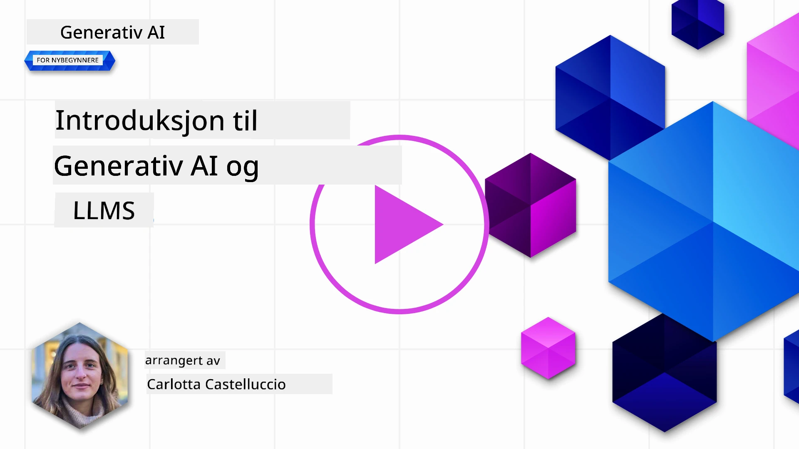
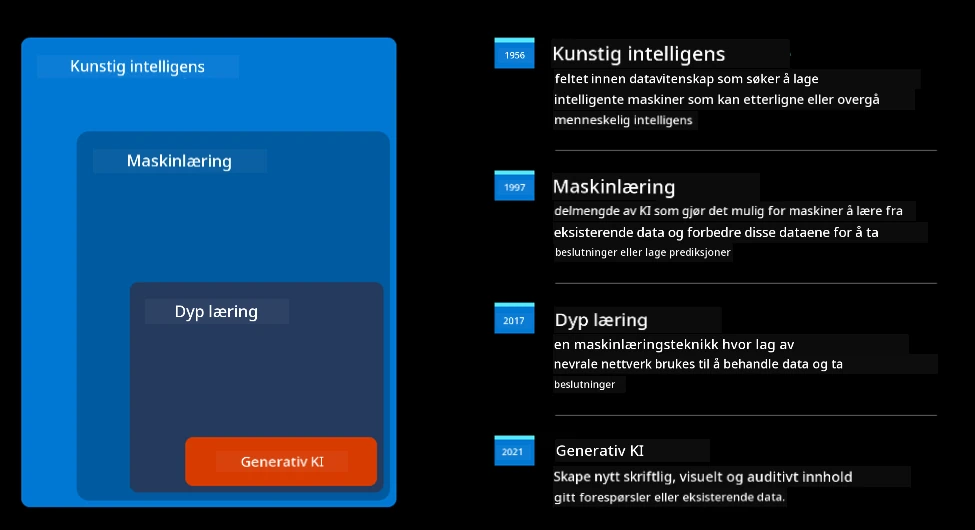
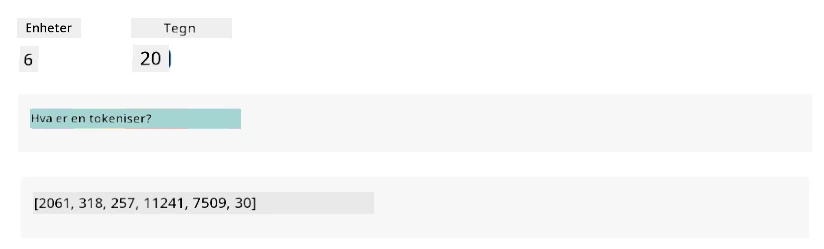
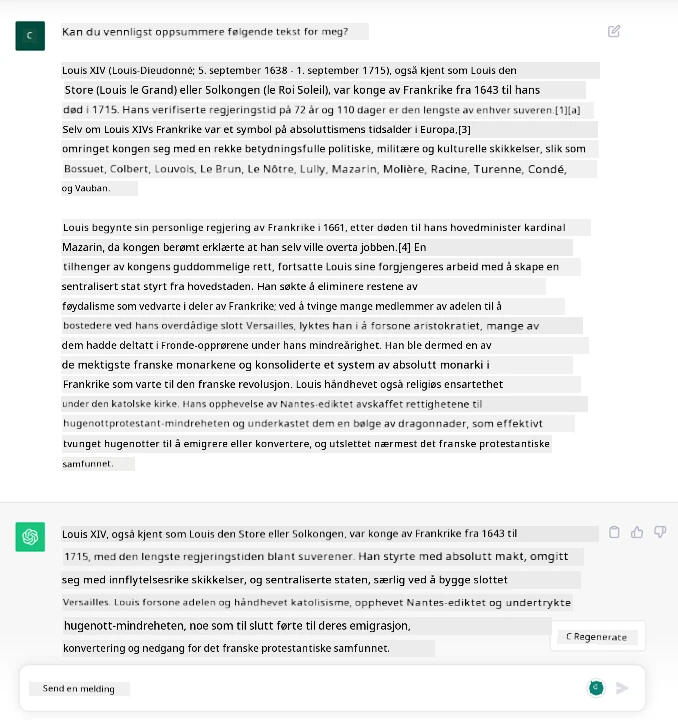
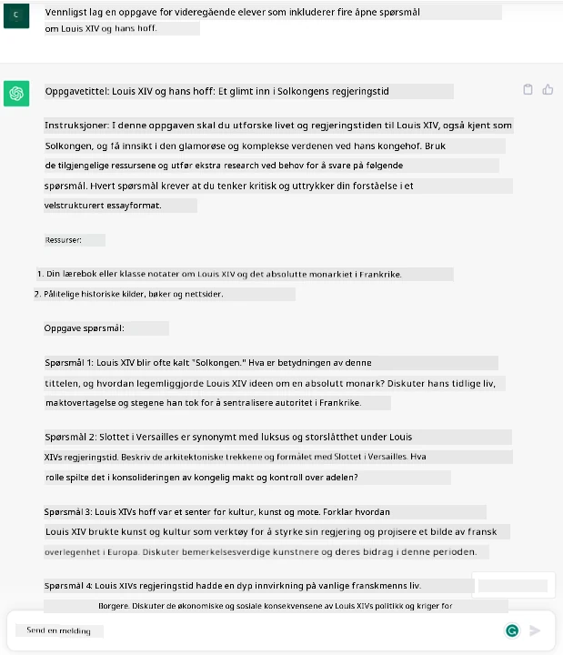
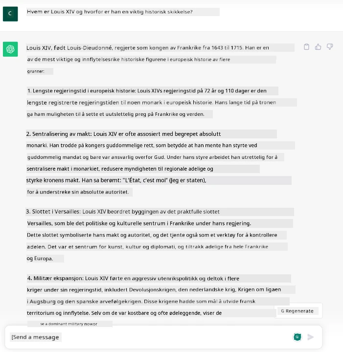
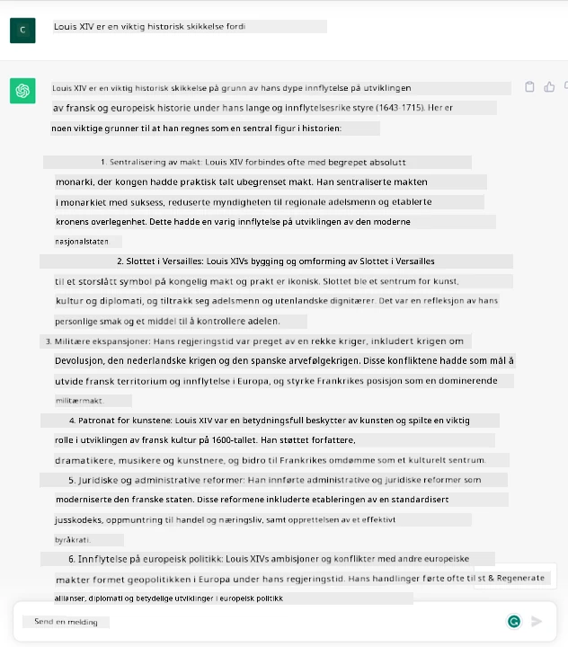
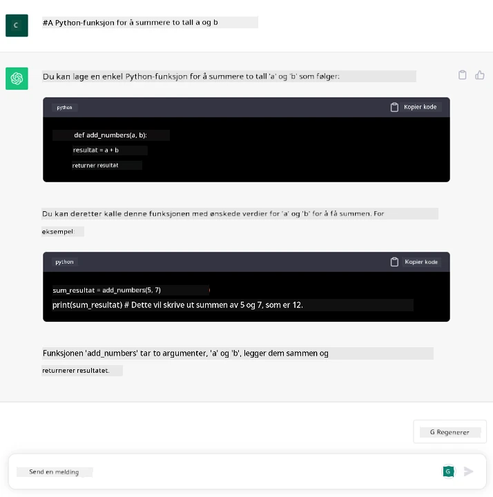

# Introduksjon til generativ AI og store språkmodeller

_(Klikk på bildet over for å se videoen til denne leksjonen)_

Generativ AI er kunstig intelligens som kan generere tekst, bilder og andre typer innhold. Det som gjør det til en fantastisk teknologi, er at det demokratiserer AI; hvem som helst kan bruke det med så lite som et tekstprompt, en setning skrevet på et naturlig språk. Det er ikke nødvendig å lære et språk som Java eller SQL for å oppnå noe verdifullt, alt du trenger er å bruke språket ditt, si hva du vil, og ut kommer et forslag fra en AI-modell. Anvendelsene og innvirkningen av dette er enorme; du kan skrive eller forstå rapporter, lage søknader og mye mer, alt på sekunder.

I dette pensumet vil vi utforske hvordan vår oppstartsbedrift bruker generativ AI for å åpne nye scenarier i utdanningsverdenen, og hvordan vi håndterer de uunngåelige utfordringene knyttet til de sosiale implikasjonene av bruken og teknologiske begrensninger.

## Introduksjon

Denne leksjonen vil dekke:

- Introduksjon til forretningsscenariet: vår oppstartsbedriftidé og oppdrag.
- Generativ AI og hvordan vi havnet i dagens teknologilandskap.
- Hvordan en stor språkmodell fungerer internt.
- Hovedkapasiteter og praktiske bruksområder for store språkmodeller.

## Læringsmål

Etter å ha fullført denne leksjonen vil du forstå:

- Hva generativ AI er og hvordan store språkmodeller fungerer.
- Hvordan du kan utnytte store språkmodeller for forskjellige brukstilfeller, med fokus på utdanningsscenarier.

## Scenario: vår utdanningsstartup

Generativ kunstig intelligens (AI) representerer toppen av AI-teknologi og presser grensene for det som en gang ble ansett som umulig. Generative AI-modeller har flere kapasiteter og bruksområder, men i dette pensumet skal vi utforske hvordan de revolusjonerer utdanning gjennom en fiktiv oppstartsbedrift. Vi vil referere til denne oppstartsbedriften som _vår oppstartsbedrift_. Vår oppstartsbedrift opererer innen utdanningssektoren med det ambisiøse misjonsutsagnet

> _å forbedre tilgjengeligheten til læring på global skala, sikre rettferdig tilgang til utdanning og tilby personlig læring til hver elev i henhold til deres behov_.

Vårt oppstartsteam er klar over at vi ikke kan oppnå dette målet uten å utnytte et av de mest kraftfulle verktøyene i moderne tid – store språkmodeller (LLMs).

Generativ AI forventes å revolusjonere måten vi lærer og underviser på i dag, med studenter som har virtuelle lærere tilgjengelig 24 timer i døgnet som gir store mengder informasjon og eksempler, og lærere som kan bruke innovative verktøy for å vurdere sine elever og gi tilbakemelding.

For å starte, la oss definere noen grunnleggende konsepter og terminologi som vi skal bruke gjennom hele pensumet.

## Hvordan fikk vi generativ AI?

Til tross for den ekstraordinære _oppstyret_ som nylig er skapt rundt kunngjøringen av generative AI-modeller, er denne teknologien flere tiår under utvikling, med de første forskningsinnsatsene som går tilbake til 60-tallet. Vi er nå på et punkt hvor AI har menneskelige kognitive evner, som samtale, vist av for eksempel [OpenAI ChatGPT](https://openai.com/chatgpt) eller [Microsoft Copilot](https://copilot.microsoft.com/?WT.mc_id=academic-105485-koreyst), som også bruker en GPT-modell for sin samtaleorienterte nettlesersøkeopplevelse.

Hvis vi går litt tilbake, bestod de aller første AI-prototypene av tekstbaserte chatboter, som bygde på en kunnskapsbase hentet fra en gruppe eksperter og representert i en datamaskin. Svarene i kunnskapsbasen ble utløst av nøkkelord som dukket opp i inndataene.
Det ble imidlertid raskt klart at en slik tilnærming med tekstbaserte chatboter ikke skalerte godt.

### En statistisk tilnærming til AI: Maskinlæring

Et vendepunkt kom på 90-tallet, med anvendelsen av en statistisk tilnærming til tekstanalyse. Dette førte til utviklingen av nye algoritmer – kjent som maskinlæring – som kunne lære mønstre fra data uten å være eksplisitt programmert. Denne tilnærmingen gjør det mulig for maskiner å simulere menneskelig språkforståelse: en statistisk modell trenes på tekst-etikett-par, som gjør det mulig for modellen å klassifisere ukjent tekstinnhold med en forhåndsdefinert etikett som representerer intensjonen i meldingen.

### Nevrale nettverk og moderne virtuelle assistenter

De siste årene har den teknologiske utviklingen innen maskinvare, som kan håndtere større datamengder og mer komplekse beregninger, stimulert forskningen innen AI, noe som førte til utviklingen av avanserte maskinlæringsalgoritmer kjent som nevrale nettverk eller dype læringsalgoritmer.

Nevrale nettverk (og spesielt rekurente nevrale nettverk – RNNs) forbedret naturlig språkprosessering betydelig ved å gjøre det mulig å representere meningen med tekst på en mer meningsfull måte, ved å verdsette konteksten til et ord i en setning.

Dette er teknologien som drev de virtuelle assistentene som ble født i det første tiåret av det nye århundret, som var svært dyktige i å tolke menneskespråk, identifisere et behov og utføre en handling for å tilfredsstille det – som å svare med et forhåndsdefinert skript eller å bruke en tredjepartstjeneste.

### Nåtiden, generativ AI

Så slik kom vi til generativ AI i dag, som kan betraktes som en underkategori av dyp læring.

Etter tiår med forskning innen AI-feltet, kom en ny modellarkitektur – kalt _Transformer_ – som overvant begrensningene ved RNNs, ved å kunne håndtere mye lengre tekstsekvenser som input. Transformere er basert på oppmerksomhetsmekanismen, som gjør det mulig for modellen å gi ulike vekter til de innkommende dataene, «legge mer oppmerksomhet» der den mest relevante informasjonen er konsentrert, uavhengig av rekkefølgen i tekstsekvensen.

De fleste av de nyeste generative AI-modellene – også kjent som store språkmodeller (LLMs), siden de jobber med tekstbaserte input og output – er faktisk basert på denne arkitekturen. Det interessante med disse modellene – trent på enorme mengder umerkede data fra ulike kilder som bøker, artikler og nettsider – er at de kan tilpasses en rekke oppgaver og generere grammatisk korrekt tekst med en tilsynelatende kreativitet. Så, ikke bare forbedret de maskinens kapasitet til å «forstå» en inputtekst betydelig, men de gjorde det også mulig for modellen å generere et originalt svar på menneskespråk.

## Hvordan fungerer store språkmodeller?

I neste kapittel skal vi utforske forskjellige typer generative AI-modeller, men for nå skal vi se på hvordan store språkmodeller fungerer, med fokus på OpenAI GPT (Generative Pre-trained Transformer) modeller.

- **Tokenizer, tekst til tall**: Store språkmodeller mottar tekst som input og genererer tekst som output. Men siden de er statistiske modeller, fungerer de mye bedre med tall enn tekstsekvenser. Derfor prosesseres hver input til modellen av en tokenizer før den brukes av kjernemodellen. En token er et tekststykke – bestående av et variabelt antall tegn, så tokenizeren sin hovedoppgave er å dele opp input til en rekke tokens. Deretter kartlegges hver token med en tokenindeks, som er den heltallsbaserte koden av det opprinnelige tekststykket.

- **Predikere output-tokens**: Gitt n tokens som input (med maks n varierende fra modell til modell), kan modellen forutsi én token som output. Denne tokenen innlemmes deretter i inputen til neste iterasjon, i et ekspanderende vindusmønster, noe som gir en bedre brukeropplevelse ved å få en (eller flere) setning(er) som svar. Dette forklarer hvorfor, hvis du noen gang har prøvd ChatGPT, kan du ha lagt merke til at den av og til ser ut til å stoppe midt i en setning.

- **Utvelgelsesprosess, sannsynlighetsfordeling**: Output-tokenen velges av modellen i henhold til sannsynligheten for at den forekommer etter den gjeldende tekstsekvensen. Dette fordi modellen predikerer en sannsynlighetsfordeling over alle mulige «neste tokens», beregnet basert på treningen. Men det er ikke alltid tokenen med høyest sannsynlighet som velges fra den resulterende fordelingen. Det legges til et innslag av tilfeldighet til dette valget, slik at modellen virker på en ikke-deterministisk måte – vi får ikke nøyaktig samme output for samme input. Denne graden av tilfeldighet legges til for å simulere den kreative tenkeprosessen, og den kan justeres med en modellparameter kalt temperatur.

## Hvordan kan vår oppstartsbedrift utnytte store språkmodeller?

Nå som vi har en bedre forståelse av hvordan en stor språkmodell fungerer internt, la oss se på noen praktiske eksempler på de vanligste oppgavene de kan utføre ganske godt, med et blikk på vårt forretningsscenario.
Vi sa at hovedkapasiteten til en stor språkmodell er _å generere tekst fra bunnen av, ut fra en tekstuell input skrevet på naturlig språk_.

Men hva slags tekstinput og output?
Input til en stor språkmodell kalles et prompt, mens output kalles en completion, et begrep som refererer til modellens mekanisme for å generere neste token for å fullføre den nåværende inputen. Vi skal fordype oss i hva et prompt er og hvordan man designer det for å få mest mulig ut av modellen. Men for nå, la oss bare si at et prompt kan inneholde:

- En **instruksjon** som spesifiserer hvilken type output vi forventer fra modellen. Denne instruksjonen kan noen ganger inneholde eksempler eller ekstra data.

  1. Sammendrag av en artikkel, bok, produktanmeldelser og mer, sammen med utvinning av innsikt fra ustrukturert data.
    
    
  
  2. Kreativ idéutvikling og utforming av en artikkel, et essay, en oppgave eller mer.
      
     

- Et **spørsmål**, stilt i form av en samtale med en agent.
  
  

- Et tekststykke som skal **fullføres**, som implisitt er en forespørsel om skrivehjelp.
  
  

- Et stykke **kode** sammen med forespørsel om å forklare og dokumentere det, eller en kommentar som ber modellen generere en kodebit som utfører en spesifikk oppgave.
  
  

Eksemplene over er ganske enkle og er ikke ment å være en uttømmende demonstrasjon av store språkmodellers kapasiteter. De er ment å vise potensialet i å bruke generativ AI, spesielt, men ikke begrenset til, utdanningskontekster.

Dessuten er outputen fra en generativ AI-modell ikke perfekt, og noen ganger kan modellens kreativitet virke mot seg selv, noe som resulterer i en output som er en kombinasjon av ord som brukeren kan tolke som en mystifisering av virkeligheten, eller den kan være støtende. Generativ AI er ikke intelligent – i det minste ikke i den mer omfattende definisjonen av intelligens, som inkluderer kritisk og kreativ tenkning eller emosjonell intelligens; den er ikke deterministisk, og den er ikke pålitelig, siden fabrikasjoner, som gale referanser, innhold og påstander, kan blandes med korrekt informasjon og presenteres på en overbevisende og selvsikker måte. I de følgende leksjonene skal vi håndtere disse begrensningene og se hva vi kan gjøre for å dempe dem.

## Oppgave

Din oppgave er å lese mer om [generativ AI](https://en.wikipedia.org/wiki/Generative_artificial_intelligence?WT.mc_id=academic-105485-koreyst) og prøve å identifisere et område hvor du i dag ville lagt til generativ AI som ikke har det. Hvordan ville virkningen vært annerledes enn å gjøre det på «gammelmåten», kan du gjøre noe du ikke kunne før, eller er du raskere? Skriv en 300 ord lang oppsummering om hvordan din drømme-AI-oppstartsbedrift ville sett ut og inkluder overskrifter som «Problem», «Hvordan jeg ville brukt AI», «Virkning» og eventuelt en forretningsplan.

Hvis du gjorde denne oppgaven, kan det hende du til og med er klar for å søke Microsofts inkubator, [Microsoft for Startups Founders Hub](https://www.microsoft.com/startups?WT.mc_id=academic-105485-koreyst). Vi tilbyr kreditter for både Azure, OpenAI, mentoring og mye mer, sjekk det ut!

## Kunnskapssjekk

Hva er sant om store språkmodeller?

1. Du får samme svar hver gang.
1. Den gjør ting perfekt, er flink til å legge sammen tall, produsere fungerende kode osv.
1. Svaret kan variere til tross for samme prompt. Den er også flink til å gi deg et førsteutkast av noe, enten det er tekst eller kode. Men du må forbedre resultatene.

A: 3, en LLM er ikke-deterministisk, svaret varierer, men du kan kontrollere variasjonen med innstillingen temperatur. Du bør heller ikke forvente at den gjør ting perfekt; den er her for å gjøre det tunge arbeidet for deg, noe som ofte betyr at du får et godt første forsøk på noe som du må forbedre gradvis.

## Flott arbeid! Fortsett reisen

Etter å ha fullført denne leksjonen, sjekk ut vår [Generative AI Learning collection](https://aka.ms/genai-collection?WT.mc_id=academic-105485-koreyst) for å fortsette å øke din kunnskap om generativ AI!

Gå til leksjon 2 der vi skal se på hvordan man [utforsker og sammenligner forskjellige LLM-typer](../02-exploring-and-comparing-different-llms/README.md?WT.mc_id=academic-105485-koreyst)!

---

<!-- CO-OP TRANSLATOR DISCLAIMER START -->
**Ansvarsfraskrivelse**:
Dette dokumentet er oversatt ved hjelp av AI-oversettelsestjenesten [Co-op Translator](https://github.com/Azure/co-op-translator). Selv om vi streber etter nøyaktighet, vær oppmerksom på at automatiske oversettelser kan inneholde feil eller unøyaktigheter. Det opprinnelige dokumentet på originalspråket skal betraktes som den autoritative kilden. For kritisk informasjon anbefales profesjonell menneskelig oversettelse. Vi er ikke ansvarlige for eventuelle misforståelser eller feiltolkninger som oppstår ved bruk av denne oversettelsen.
<!-- CO-OP TRANSLATOR DISCLAIMER END -->