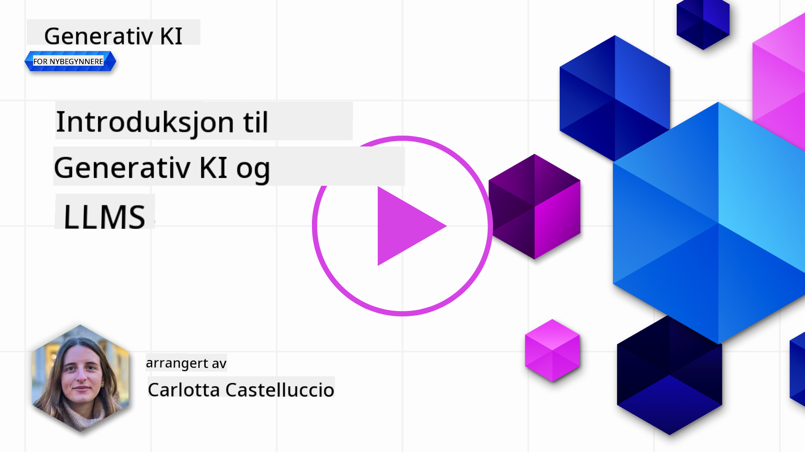
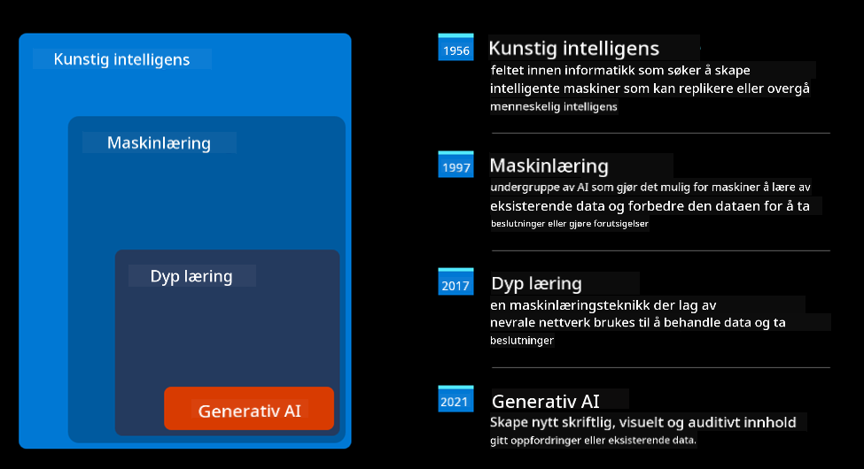
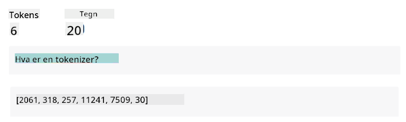
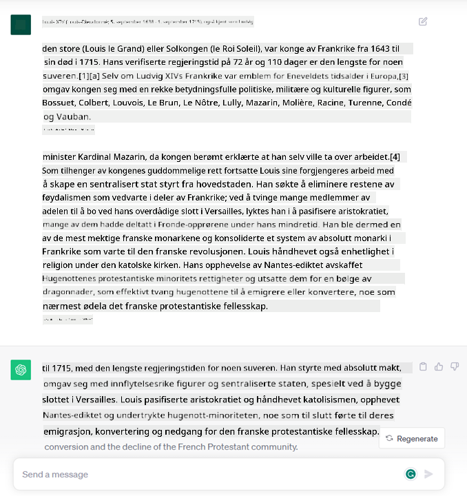
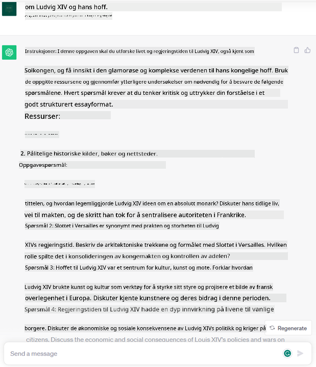
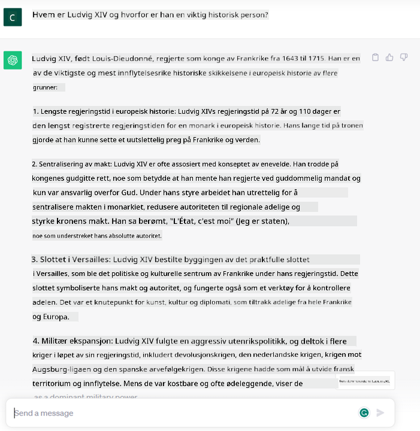
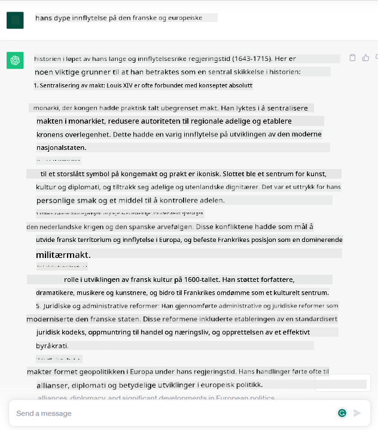
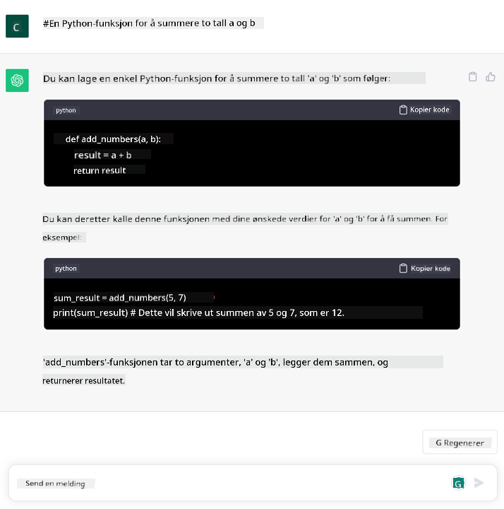

<!--
CO_OP_TRANSLATOR_METADATA:
{
  "original_hash": "f53ba0fa49164f9323043f1c6b11f2b1",
  "translation_date": "2025-06-25T09:55:57+00:00",
  "source_file": "01-introduction-to-genai/README.md",
  "language_code": "no"
}
-->
# Introduksjon til Generativ AI og Store Språkmodeller

_(Klikk på bildet over for å se videoen av denne leksjonen)_

Generativ AI er kunstig intelligens som er i stand til å generere tekst, bilder og andre typer innhold. Det som gjør det til en fantastisk teknologi er at det demokratiserer AI; alle kan bruke det med så lite som en tekstprompt, en setning skrevet på et naturlig språk. Du trenger ikke å lære et språk som Java eller SQL for å oppnå noe verdifullt, alt du trenger er å bruke språket ditt, si hva du vil ha, og ut kommer et forslag fra en AI-modell. Anvendelsene og påvirkningen av dette er enorme; du kan skrive eller forstå rapporter, lage applikasjoner og mye mer, alt på sekunder.

I dette læreplanen vil vi utforske hvordan vår oppstart utnytter generativ AI for å åpne nye scenarier i utdanningsverdenen og hvordan vi takler de uunngåelige utfordringene knyttet til de sosiale implikasjonene av dens anvendelse og teknologiens begrensninger.

## Introduksjon

Denne leksjonen vil dekke:

- Introduksjon til forretningsscenariet: vår oppstartside og misjon.
- Generativ AI og hvordan vi landet på det nåværende teknologilandskapet.
- Indre arbeid av en stor språkmodell.
- Hovedkapasiteter og praktiske brukstilfeller av Store Språkmodeller.

## Læringsmål

Etter å ha fullført denne leksjonen vil du forstå:

- Hva generativ AI er og hvordan Store Språkmodeller fungerer.
- Hvordan du kan utnytte store språkmodeller for forskjellige brukstilfeller, med fokus på utdanningsscenarier.

## Scenario: vår utdanningsoppstart

Generativ Kunstig Intelligens (AI) representerer toppen av AI-teknologi, og presser grensene for hva som en gang ble ansett som umulig. Generative AI-modeller har flere kapasiteter og anvendelser, men for denne læreplanen vil vi utforske hvordan det revolusjonerer utdanning gjennom en fiktiv oppstart. Vi vil referere til denne oppstarten som _vår oppstart_. Vår oppstart arbeider innen utdanningsfeltet med den ambisiøse misjonen

> _å forbedre tilgjengeligheten i læring, på global skala, sikre lik tilgang til utdanning og tilby personlige læringsopplevelser til hver elev, i henhold til deres behov_.

Vårt oppstartteam er klar over at vi ikke vil kunne oppnå dette målet uten å utnytte et av de mest kraftfulle verktøyene i moderne tid – Store Språkmodeller (LLMs).

Generativ AI forventes å revolusjonere måten vi lærer og underviser i dag, med studenter som har tilgang til virtuelle lærere 24 timer i døgnet som gir store mengder informasjon og eksempler, og lærere som kan utnytte innovative verktøy for å vurdere sine studenter og gi tilbakemelding.

For å starte, la oss definere noen grunnleggende begreper og terminologi vi vil bruke gjennom læreplanen.

## Hvordan fikk vi Generativ AI?

Til tross for den ekstraordinære _hypen_ som nylig ble skapt av kunngjøringen av generative AI-modeller, er denne teknologien flere tiår i utvikling, med de første forskningsinnsatsene som daterer seg tilbake til 60-tallet. Vi er nå på et punkt hvor AI har menneskelige kognitive evner, som samtale vist av for eksempel [OpenAI ChatGPT](https://openai.com/chatgpt) eller [Bing Chat](https://www.microsoft.com/edge/features/bing-chat?WT.mc_id=academic-105485-koreyst), som også bruker en GPT-modell for web-søk Bing-samtaler.

Litt tilbake, de aller første prototypene av AI bestod av skrivemaskin-chatbots, avhengig av en kunnskapsbase hentet fra en gruppe eksperter og representert i en datamaskin. Svarene i kunnskapsbasen ble utløst av nøkkelord som dukket opp i inndata-teksten.
Det ble imidlertid raskt klart at en slik tilnærming, ved bruk av skrivemaskin-chatbots, ikke skalerte godt.

### En statistisk tilnærming til AI: Maskinlæring

Et vendepunkt kom på 90-tallet, med anvendelsen av en statistisk tilnærming til tekstanalyse. Dette førte til utviklingen av nye algoritmer – kjent som maskinlæring – i stand til å lære mønstre fra data uten å bli eksplisitt programmert. Denne tilnærmingen tillater maskiner å simulere menneskelig språkforståelse: en statistisk modell trenes på tekst-etikett-paringer, noe som gjør det mulig for modellen å klassifisere ukjent inndata-tekst med en forhåndsdefinert etikett som representerer intensjonen i meldingen.

### Nevrale nettverk og moderne virtuelle assistenter

De siste årene har den teknologiske utviklingen av maskinvare, i stand til å håndtere større mengder data og mer komplekse beregninger, oppmuntret til forskning innen AI, noe som har ført til utviklingen av avanserte maskinlæringsalgoritmer kjent som nevrale nettverk eller dyp læringsalgoritmer.

Nevrale nettverk (og spesielt Recurrent Neural Networks – RNNs) forbedret naturlig språkprosessering betydelig, slik at representasjonen av meningen med tekst på en mer meningsfull måte, verdsatte konteksten av et ord i en setning.

Dette er teknologien som drev de virtuelle assistentene som ble født i det første tiåret av det nye århundret, svært dyktige til å tolke menneskelig språk, identifisere et behov og utføre en handling for å tilfredsstille det – som å svare med et forhåndsdefinert skript eller bruke en tredjepartstjeneste.

### Nåtid, Generativ AI

Så det er slik vi kom til Generativ AI i dag, som kan sees på som en undergruppe av dyp læring.

Etter tiår med forskning innen AI-feltet, overgikk en ny modellarkitektur – kalt _Transformer_ – begrensningene til RNNs, ved å kunne få mye lengre sekvenser av tekst som inndata. Transformere er basert på oppmerksomhetsmekanismen, som gjør det mulig for modellen å gi forskjellige vekter til de inngangene den mottar, ‘legge mer oppmerksomhet’ der den mest relevante informasjonen er konsentrert, uavhengig av deres rekkefølge i tekstsekvensen.

De fleste av de nyere generative AI-modellene – også kjent som Store Språkmodeller (LLMs), siden de arbeider med tekstlige inndata og utdata – er faktisk basert på denne arkitekturen. Det som er interessant med disse modellene – trent på en enorm mengde umerket data fra forskjellige kilder som bøker, artikler og nettsteder – er at de kan tilpasses til et bredt utvalg av oppgaver og generere grammatisk korrekt tekst med en tilsynelatende kreativitet. Så ikke bare har de utrolig forbedret maskinens evne til å ‘forstå’ en inndata-tekst, men de har gjort det mulig for dem å generere et originalt svar på menneskelig språk.

## Hvordan fungerer store språkmodeller?

I neste kapittel skal vi utforske forskjellige typer Generative AI-modeller, men for nå la oss se på hvordan store språkmodeller fungerer, med fokus på OpenAI GPT (Generative Pre-trained Transformer) modeller.

- **Tokenizer, tekst til tall**: Store Språkmodeller mottar en tekst som inndata og genererer en tekst som utdata. Imidlertid, som statistiske modeller, fungerer de mye bedre med tall enn tekstsekvenser. Derfor blir hver inndata til modellen behandlet av en tokenizer, før den brukes av kjernemodellen. En token er en tekstbit – bestående av et variabelt antall tegn, så tokenizers hovedoppgave er å dele inndataen i en rekke tokens. Deretter blir hver token kartlagt med en token-indeks, som er den heltallige koding av den originale tekstbiten.

- **Forutsi utdata-tokens**: Gitt n tokens som inndata (med maks n som varierer fra en modell til en annen), er modellen i stand til å forutsi en token som utdata. Denne tokenen blir deretter innlemmet i inndataen til neste iterasjon, i et ekspanderende vindumønster, noe som gir en bedre brukeropplevelse av å få en (eller flere) setninger som et svar. Dette forklarer hvorfor, hvis du noen gang har lekt med ChatGPT, kan du ha lagt merke til at det noen ganger ser ut som det stopper midt i en setning.

- **Utvelgelsesprosess, sannsynlighetsfordeling**: Utdata-tokenen velges av modellen i henhold til dens sannsynlighet for å oppstå etter den nåværende tekstsekvensen. Dette er fordi modellen forutsier en sannsynlighetsfordeling over alle mulige ‘neste tokens’, beregnet basert på dens trening. Imidlertid er det ikke alltid tokenen med høyest sannsynlighet som velges fra den resulterende fordelingen. En grad av tilfeldighet legges til dette valget, på en måte som modellen oppfører seg på en ikke-deterministisk måte - vi får ikke nøyaktig samme utdata for samme inndata. Denne graden av tilfeldighet legges til for å simulere prosessen med kreativ tenkning, og den kan justeres ved hjelp av en modellparameter kalt temperatur.

## Hvordan kan vår oppstart utnytte Store Språkmodeller?

Nå som vi har en bedre forståelse av den indre virkemåten til en stor språkmodell, la oss se noen praktiske eksempler på de vanligste oppgavene de kan utføre ganske bra, med et øye til vårt forretningsscenario.
Vi sa at hovedkapasiteten til en Stor Språkmodell er _å generere en tekst fra bunnen av, med utgangspunkt i en tekstlig inndata, skrevet på naturlig språk_.

Men hva slags tekstlig inndata og utdata?
Inndataen til en stor språkmodell er kjent som en prompt, mens utdataen er kjent som en completion, et begrep som refererer til modellens mekanisme for å generere neste token for å fullføre den nåværende inndataen. Vi skal dykke dypt inn i hva en prompt er og hvordan man designer den på en måte for å få mest mulig ut av vår modell. Men for nå, la oss bare si at en prompt kan inkludere:

- En **instruksjon** som spesifiserer typen utdata vi forventer fra modellen. Denne instruksjonen kan noen ganger inneholde noen eksempler eller noen tilleggsdata.

  1. Sammendrag av en artikkel, bok, produktanmeldelser og mer, sammen med utvinning av innsikt fra ustrukturert data.
    
    
  
  2. Kreativ idéskaping og design av en artikkel, et essay, en oppgave eller mer.
      
     

- Et **spørsmål**, stilt i form av en samtale med en agent.
  
  

- En bit av **tekst å fullføre**, som implisitt er en forespørsel om skriveassistanse.
  
  

- En bit av **kode** sammen med forespørselen om å forklare og dokumentere den, eller en kommentar som ber om å generere et stykke kode som utfører en spesifikk oppgave.
  
  

Eksemplene ovenfor er ganske enkle og er ikke ment å være en uttømmende demonstrasjon av Store Språkmodellers kapasiteter. De er ment å vise potensialet ved bruk av generativ AI, spesielt men ikke begrenset til utdanningskontekster.

Også, utdataen fra en generativ AI-modell er ikke perfekt og noen ganger kan modellens kreativitet virke mot den, noe som resulterer i en utdata som er en kombinasjon av ord som den menneskelige brukeren kan tolke som en mystifisering av virkeligheten, eller det kan være støtende. Generativ AI er ikke intelligent - i det minste ikke i den mer omfattende definisjonen av intelligens, inkludert kritisk og kreativ resonnering eller emosjonell intelligens; den er ikke deterministisk, og den er ikke pålitelig, siden fabrikasjoner, som feilaktige referanser, innhold og uttalelser, kan bli kombinert med korrekt informasjon og presentert på en overbevisende og selvsikker måte. I de følgende leksjonene vil vi håndtere alle disse begrensningene og vi vil se hva vi kan gjøre for å dempe dem.

## Oppgave

Din oppgave er å lese mer om [generativ AI](https://en.wikipedia.org/wiki/Generative_artificial_intelligence?WT.mc_id=academic-105485-koreyst) og prøve å identifisere et område hvor du ville lagt til generativ AI i dag som ikke har det. Hvordan ville påvirkningen vært annerledes enn å gjøre det på den "gamle måten", kan du gjøre noe du ikke kunne før, eller er du raskere? Skriv et sammendrag på 300 ord om hvordan din drømme-AI-oppstart ville sett ut og inkluder overskrifter som "Problem", "Hvordan jeg ville brukt AI", "Påvirkning" og eventuelt en forretningsplan.

Hvis du gjorde denne oppgaven, kan du til og med være klar til å søke på Microsofts inkubator, [Microsoft for Startups Founders Hub](https://www.microsoft.com/startups?WT.mc_id=academic-105485-koreyst) vi tilbyr kreditter for både Azure, OpenAI, mentoring og mye mer, sjekk det ut!

## Kunnskapssjekk

Hva er sant om store språkmodeller?

1. Du får nøyaktig samme svar hver gang.
1. Den gjør ting perfekt, flink til å legge til tall, produsere fungerende kode osv.
1. Svaret kan variere til tross for bruk av samme prompt. Det er også flott til å gi deg et første utkast av noe, enten det er tekst eller kode. Men du må forbedre resultatene.

A: 3, en LLM er ikke-deterministisk, svaret varierer, men du kan kontrollere variansen via en temperatursinnstilling. Du bør heller ikke forvente at den gjør ting perfekt, den er her for å gjøre det tunge løftet for deg, noe som ofte betyr at du får et godt første forsøk på noe som du må gradvis forbedre.

## Flott arbeid! Fortsett reisen

Etter å ha fullført denne leksjonen, sjekk ut vår [Generative AI Learning collection](https://aka.ms/genai-collection?WT.mc_id=academic-105485-koreyst) for å fortsette å heve din kunnskap om Generativ AI!

Gå videre til Leksjon 2 hvor vi vil se på hvordan vi kan [utforske og sammenligne forskjellige LLM-typer](../02-exploring-and-comparing-different-llms/README.md?WT.mc_id=academic-105485-koreyst)!

**Ansvarsfraskrivelse**:  
Dette dokumentet er oversatt ved hjelp av AI-oversettelsestjenesten [Co-op Translator](https://github.com/Azure/co-op-translator). Selv om vi tilstreber nøyaktighet, vær oppmerksom på at automatiserte oversettelser kan inneholde feil eller unøyaktigheter. Det originale dokumentet på sitt opprinnelige språk bør betraktes som den autoritative kilden. For kritisk informasjon anbefales profesjonell menneskelig oversettelse. Vi er ikke ansvarlige for misforståelser eller feiltolkninger som oppstår ved bruk av denne oversettelsen.