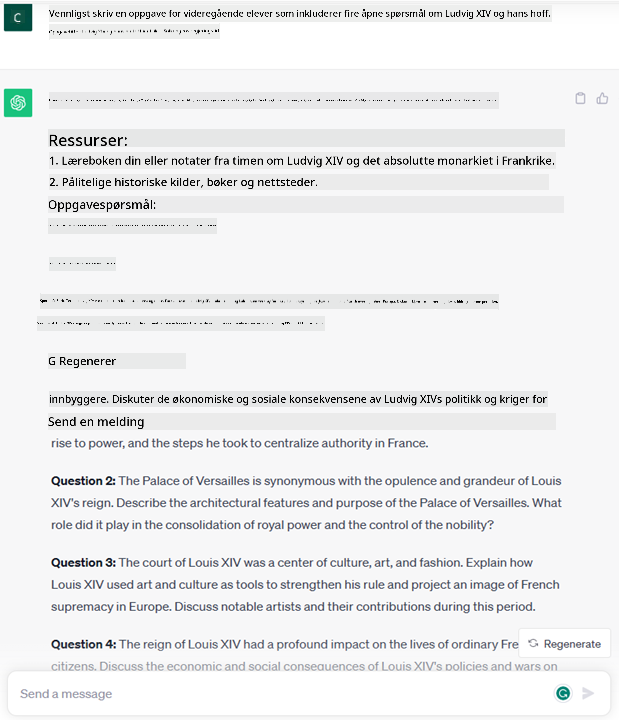
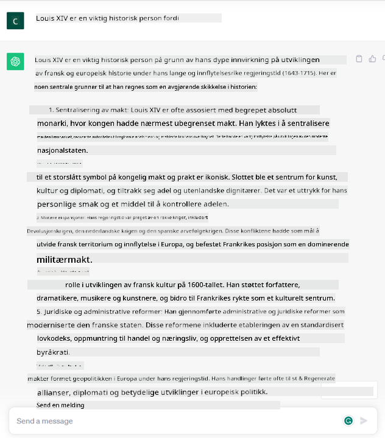
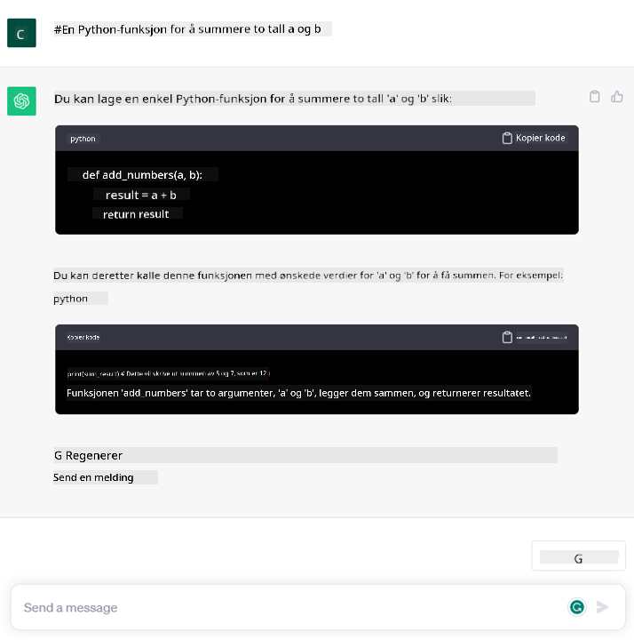

<!--
CO_OP_TRANSLATOR_METADATA:
{
  "original_hash": "bfb7901bdbece1ba3e9f35c400ca33e8",
  "translation_date": "2025-10-17T19:24:14+00:00",
  "source_file": "01-introduction-to-genai/README.md",
  "language_code": "no"
}
-->
# Introduksjon til Generativ AI og Store Språkmodeller

_(Klikk på bildet ovenfor for å se videoen til denne leksjonen)_

Generativ AI er kunstig intelligens som kan generere tekst, bilder og andre typer innhold. Det som gjør det til en fantastisk teknologi er at det demokratiserer AI; hvem som helst kan bruke det med så lite som en tekstprompt, en setning skrevet på et naturlig språk. Du trenger ikke å lære et språk som Java eller SQL for å oppnå noe verdifullt, alt du trenger er å bruke ditt eget språk, si hva du vil ha, og ut kommer et forslag fra en AI-modell. Anvendelsene og innvirkningen av dette er enorme – du kan skrive eller forstå rapporter, lage applikasjoner og mye mer, alt på sekunder.

I dette kurset skal vi utforske hvordan vår oppstart utnytter generativ AI for å åpne opp nye scenarier innen utdanningsverdenen, og hvordan vi takler de uunngåelige utfordringene knyttet til de sosiale implikasjonene av dens anvendelse og teknologiske begrensninger.

## Introduksjon

Denne leksjonen vil dekke:

- Introduksjon til forretningsscenariet: vår oppstartside og misjon.
- Generativ AI og hvordan vi landet på dagens teknologilandskap.
- Hvordan en stor språkmodell fungerer.
- Hovedfunksjoner og praktiske bruksområder for Store Språkmodeller.

## Læringsmål

Etter å ha fullført denne leksjonen, vil du forstå:

- Hva generativ AI er og hvordan Store Språkmodeller fungerer.
- Hvordan du kan utnytte store språkmodeller for ulike bruksområder, med fokus på utdanningsscenarier.

## Scenario: vår utdanningsoppstart

Generativ kunstig intelligens (AI) representerer toppen av AI-teknologi og utvider grensene for hva som en gang ble ansett som umulig. Generative AI-modeller har flere funksjoner og bruksområder, men for dette kurset skal vi utforske hvordan det revolusjonerer utdanning gjennom en fiktiv oppstart. Vi vil referere til denne oppstarten som _vår oppstart_. Vår oppstart jobber innen utdanningssektoren med den ambisiøse misjonen:

> _å forbedre tilgjengeligheten til læring på globalt nivå, sikre lik tilgang til utdanning og tilby personlige læringsopplevelser til hver enkelt elev, i henhold til deres behov_.

Vårt oppstartsteam er klar over at vi ikke vil kunne oppnå dette målet uten å utnytte et av de mest kraftfulle verktøyene i moderne tid – Store Språkmodeller (LLMs).

Generativ AI forventes å revolusjonere måten vi lærer og underviser på i dag, med studenter som har virtuelle lærere tilgjengelig 24 timer i døgnet, som gir store mengder informasjon og eksempler, og lærere som kan utnytte innovative verktøy for å vurdere sine elever og gi tilbakemeldinger.

La oss starte med å definere noen grunnleggende begreper og terminologi som vi vil bruke gjennom kurset.

## Hvordan fikk vi Generativ AI?

Til tross for den ekstraordinære _hypen_ som nylig er skapt av kunngjøringen av generative AI-modeller, har denne teknologien vært under utvikling i flere tiår, med de første forskningsinnsatsene som går tilbake til 60-tallet. Vi er nå på et punkt hvor AI har menneskelige kognitive evner, som samtale, vist for eksempel av [OpenAI ChatGPT](https://openai.com/chatgpt) eller [Bing Chat](https://www.microsoft.com/edge/features/bing-chat?WT.mc_id=academic-105485-koreyst), som også bruker en GPT-modell for nettsøk og Bing-samtaler.

Hvis vi går litt tilbake, besto de aller første prototypene av AI av skrivemaskin-chatbots, som baserte seg på en kunnskapsbase hentet fra en gruppe eksperter og representert i en datamaskin. Svarene i kunnskapsbasen ble utløst av nøkkelord som dukket opp i innspilt tekst. 
Det ble imidlertid raskt klart at en slik tilnærming, ved bruk av skrivemaskin-chatbots, ikke skalerte godt.

### En statistisk tilnærming til AI: Maskinlæring

Et vendepunkt kom på 90-tallet, med anvendelsen av en statistisk tilnærming til tekstanalyse. Dette førte til utviklingen av nye algoritmer – kjent som maskinlæring – som var i stand til å lære mønstre fra data uten å bli eksplisitt programmert. Denne tilnærmingen tillot maskiner å simulere menneskelig språkforståelse: en statistisk modell ble trent på tekst-etikett-paringer, som gjorde det mulig for modellen å klassifisere ukjent innspilt tekst med en forhåndsdefinert etikett som representerte intensjonen bak meldingen.

### Nevrale nettverk og moderne virtuelle assistenter

I de senere år har den teknologiske utviklingen av maskinvare, som er i stand til å håndtere større mengder data og mer komplekse beregninger, oppmuntret forskning innen AI, noe som har ført til utviklingen av avanserte maskinlæringsalgoritmer kjent som nevrale nettverk eller dyp læringsalgoritmer.

Nevrale nettverk (og spesielt Recurrent Neural Networks – RNNs) forbedret naturlig språkbehandling betydelig, og gjorde det mulig å representere betydningen av tekst på en mer meningsfull måte, ved å verdsette konteksten til et ord i en setning.

Dette er teknologien som drev de virtuelle assistentene som ble født i det første tiåret av det nye århundret, svært dyktige til å tolke menneskelig språk, identifisere et behov og utføre en handling for å tilfredsstille det – som å svare med et forhåndsdefinert manus eller bruke en tredjepartstjeneste.

### I dag, Generativ AI

Så slik kom vi til Generativ AI i dag, som kan sees på som en undergruppe av dyp læring.

Etter flere tiår med forskning innen AI-feltet, overvant en ny modellarkitektur – kalt _Transformer_ – begrensningene til RNNs, og var i stand til å ta imot mye lengre tekstsekvenser som input. Transformere er basert på oppmerksomhetsmekanismen, som gjør det mulig for modellen å gi forskjellige vekter til inputene den mottar, ‘gi mer oppmerksomhet’ der den mest relevante informasjonen er konsentrert, uavhengig av deres rekkefølge i tekstsekvensen.

De fleste av de nylige generative AI-modellene – også kjent som Store Språkmodeller (LLMs), siden de arbeider med tekstlige input og output – er faktisk basert på denne arkitekturen. Det som er interessant med disse modellene – trent på en enorm mengde umerkede data fra ulike kilder som bøker, artikler og nettsteder – er at de kan tilpasses et bredt spekter av oppgaver og generere grammatisk korrekt tekst med et snev av kreativitet. Så, ikke bare har de utrolig forbedret kapasiteten til en maskin til å ‘forstå’ en innspilt tekst, men de har også gjort det mulig for dem å generere et originalt svar på menneskelig språk.

## Hvordan fungerer store språkmodeller?

I neste kapittel skal vi utforske forskjellige typer generative AI-modeller, men for nå skal vi se på hvordan store språkmodeller fungerer, med fokus på OpenAI GPT (Generative Pre-trained Transformer) modeller.

- **Tokenizer, tekst til tall**: Store Språkmodeller mottar en tekst som input og genererer en tekst som output. Men siden de er statistiske modeller, fungerer de mye bedre med tall enn tekstsekvenser. Derfor blir hver input til modellen behandlet av en tokenizer før den brukes av kjernemodellen. En token er en del av tekst – bestående av et variabelt antall tegn, så hovedoppgaven til tokenizeren er å dele opp inputen i en rekke tokens. Deretter blir hver token kartlagt med en token-indeks, som er den heltallige kodingen av den opprinnelige tekstdelen.

- **Forutsi output-tokens**: Gitt n tokens som input (med maks n som varierer fra en modell til en annen), er modellen i stand til å forutsi én token som output. Denne tokenen blir deretter innlemmet i inputen til neste iterasjon, i et utvidende vindusmønster, som muliggjør en bedre brukeropplevelse ved å gi én (eller flere) setning som svar. Dette forklarer hvorfor, hvis du noen gang har lekt med ChatGPT, kan du ha lagt merke til at den noen ganger ser ut til å stoppe midt i en setning.

- **Utvelgelsesprosess, sannsynlighetsfordeling**: Output-tokenen velges av modellen i henhold til sannsynligheten for at den oppstår etter den nåværende tekstsekvensen. Dette er fordi modellen forutsier en sannsynlighetsfordeling over alle mulige ‘neste tokens’, beregnet basert på dens trening. Imidlertid blir ikke alltid tokenen med høyest sannsynlighet valgt fra den resulterende fordelingen. En grad av tilfeldighet legges til dette valget, på en måte som gjør at modellen oppfører seg på en ikke-deterministisk måte – vi får ikke nøyaktig samme output for samme input. Denne graden av tilfeldighet legges til for å simulere prosessen med kreativ tenkning, og den kan justeres ved hjelp av en modellparameter kalt temperatur.

## Hvordan kan vår oppstart utnytte Store Språkmodeller?

Nå som vi har en bedre forståelse av hvordan en stor språkmodell fungerer, la oss se noen praktiske eksempler på de vanligste oppgavene de kan utføre ganske godt, med et blikk på vårt forretningsscenario.
Vi sa at hovedfunksjonen til en Stor Språkmodell er _å generere en tekst fra bunnen av, basert på en tekstlig input, skrevet på naturlig språk_.

Men hva slags tekstlig input og output?
Inputen til en stor språkmodell er kjent som en prompt, mens outputen er kjent som en completion, et begrep som refererer til modellens mekanisme for å generere neste token for å fullføre den nåværende inputen. Vi skal dykke dypt inn i hva en prompt er og hvordan man designer den på en måte som får mest mulig ut av modellen vår. Men for nå, la oss bare si at en prompt kan inkludere:

- En **instruksjon** som spesifiserer typen output vi forventer fra modellen. Denne instruksjonen kan noen ganger inneholde eksempler eller tilleggsdata.

  1. Sammendrag av en artikkel, bok, produktanmeldelser og mer, sammen med utvinning av innsikt fra ustrukturerte data.
    
    
  
  2. Kreativ idéutvikling og utforming av en artikkel, et essay, en oppgave eller mer.
      
     

- Et **spørsmål**, stilt i form av en samtale med en agent.
  
  

- En del av **tekst som skal fullføres**, som implisitt er en forespørsel om skrivehjelp.
  
  

- En del av **kode** sammen med en forespørsel om å forklare og dokumentere den, eller en kommentar som ber om å generere et stykke kode som utfører en spesifikk oppgave.
  
  

Eksemplene ovenfor er ganske enkle og er ikke ment å være en uttømmende demonstrasjon av Store Språkmodellers evner. De er ment å vise potensialet ved å bruke generativ AI, spesielt, men ikke begrenset til, utdanningskontekster.

I tillegg er outputen fra en generativ AI-modell ikke perfekt, og noen ganger kan modellens kreativitet virke mot sin hensikt, noe som resulterer i en output som er en kombinasjon av ord som den menneskelige brukeren kan tolke som en forvrengning av virkeligheten, eller som kan være støtende. Generativ AI er ikke intelligent – i det minste ikke i den mer omfattende definisjonen av intelligens, som inkluderer kritisk og kreativ tenkning eller emosjonell intelligens; den er ikke deterministisk, og den er ikke pålitelig, siden fabrikasjoner, som feilaktige referanser, innhold og uttalelser, kan kombineres med korrekt informasjon og presenteres på en overbevisende og selvsikker måte. I de følgende leksjonene skal vi håndtere alle disse begrensningene og se hva vi kan gjøre for å redusere dem.

## Oppgave

Din oppgave er å lese mer om [generativ AI](https://en.wikipedia.org/wiki/Generative_artificial_intelligence?WT.mc_id=academic-105485-koreyst) og prøve å identifisere et område der du ville lagt til generativ AI i dag som ikke har det. Hvordan ville effekten vært annerledes enn å gjøre det på den "gamle måten", kan du gjøre noe du ikke kunne før, eller går det raskere? Skriv et sammendrag på 300 ord om hvordan din drømme-AI-oppstart ville sett ut, og inkluder overskrifter som "Problem", "Hvordan jeg ville brukt AI", "Effekt" og eventuelt en forretningsplan.

Hvis du gjennomførte denne oppgaven, kan du til og med være klar til å søke på Microsofts inkubator, [Microsoft for Startups Founders Hub](https://www.microsoft.com/startups?WT.mc_id=academic-105485-koreyst). Vi tilbyr kreditter for både Azure, OpenAI, mentoring og mye mer, sjekk det ut!

## Kunnskapssjekk

Hva er sant om store språkmodeller?

1. Du får nøyaktig samme svar hver gang.
1. Den gjør ting perfekt, er flink til å legge sammen tall, produsere fungerende kode osv.
1. Svaret kan variere selv om du bruker samme prompt. Den er også god til å gi deg et første utkast til noe, enten det er tekst eller kode. Men du må forbedre resultatene.

A: 3, en LLM er ikke-deterministisk, svaret varierer, men du kan kontrollere variasjonen via en temperaturinnstilling. Du bør heller ikke forvente at den gjør ting perfekt, den er her for å gjøre det tunge arbeidet for deg, noe som ofte betyr at du får et godt første forsøk på noe som du gradvis må forbedre.

## Flott arbeid! Fortsett reisen

Etter å ha fullført denne leksjonen, sjekk ut vår [Generative AI Learning-samling](https://aka.ms/genai-collection?WT.mc_id=academic-105485-koreyst) for å fortsette å utvikle din kunnskap om Generativ AI!
Gå videre til Lekse 2 hvor vi skal se på hvordan vi kan [utforske og sammenligne ulike LLM-typer](../02-exploring-and-comparing-different-llms/README.md?WT.mc_id=academic-105485-koreyst)!

---

**Ansvarsfraskrivelse**:  
Dette dokumentet er oversatt ved hjelp av AI-oversettelsestjenesten [Co-op Translator](https://github.com/Azure/co-op-translator). Selv om vi streber etter nøyaktighet, vær oppmerksom på at automatiserte oversettelser kan inneholde feil eller unøyaktigheter. Det originale dokumentet på sitt opprinnelige språk bør anses som den autoritative kilden. For kritisk informasjon anbefales profesjonell menneskelig oversettelse. Vi er ikke ansvarlige for misforståelser eller feiltolkninger som oppstår ved bruk av denne oversettelsen.