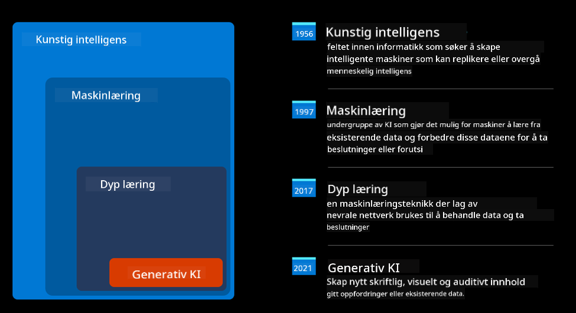
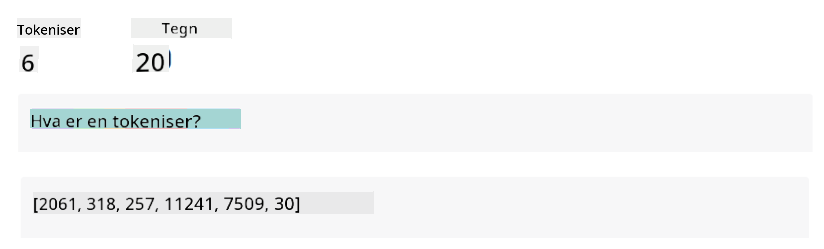
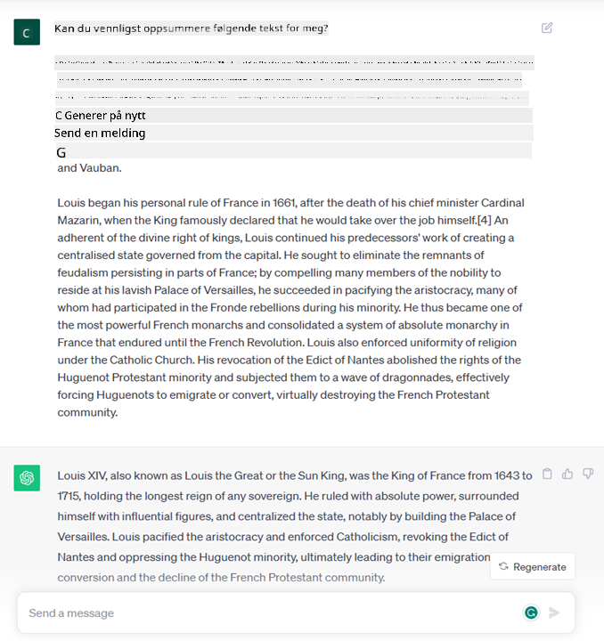
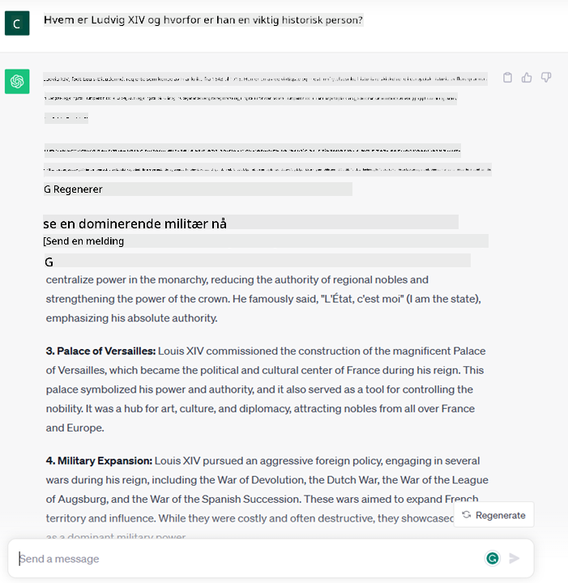

<!--
CO_OP_TRANSLATOR_METADATA:
{
  "original_hash": "f53ba0fa49164f9323043f1c6b11f2b1",
  "translation_date": "2025-07-09T07:55:19+00:00",
  "source_file": "01-introduction-to-genai/README.md",
  "language_code": "no"
}
-->
# Introduksjon til Generativ AI og Store Språkmodeller

_(Klikk på bildet over for å se video av denne leksjonen)_

Generativ AI er kunstig intelligens som kan generere tekst, bilder og andre typer innhold. Det som gjør det til en fantastisk teknologi, er at den demokratiserer AI – alle kan bruke den med bare en tekstprompt, en setning skrevet på et naturlig språk. Du trenger ikke å lære et språk som Java eller SQL for å få til noe meningsfullt, alt du trenger er å bruke ditt eget språk, si hva du ønsker, og så får du et forslag fra en AI-modell. Bruksområdene og effektene er enorme; du kan skrive eller forstå rapporter, lage applikasjoner og mye mer, alt på sekunder.

I dette læreplanen skal vi utforske hvordan vår startup bruker generativ AI for å åpne nye muligheter i utdanningsverdenen, og hvordan vi håndterer de uunngåelige utfordringene knyttet til de sosiale konsekvensene av bruken og teknologiske begrensninger.

## Introduksjon

Denne leksjonen vil dekke:

- Introduksjon til forretningsscenarioet: vår startup-idé og misjon.
- Generativ AI og hvordan vi havnet i dagens teknologilandskap.
- Hvordan en stor språkmodell fungerer.
- Hovedkapasiteter og praktiske bruksområder for store språkmodeller.

## Læringsmål

Etter å ha fullført denne leksjonen vil du forstå:

- Hva generativ AI er og hvordan store språkmodeller fungerer.
- Hvordan du kan bruke store språkmodeller til ulike formål, med fokus på utdanningsscenarier.

## Scenario: vår utdanningsstartup

Generativ kunstig intelligens (AI) representerer toppen av AI-teknologi og flytter grensene for det som tidligere ble ansett som umulig. Generative AI-modeller har mange evner og bruksområder, men i denne læreplanen skal vi utforske hvordan den revolusjonerer utdanning gjennom en fiktiv startup. Vi kaller denne startupen _vår startup_. Vår startup jobber innen utdanningssektoren med det ambisiøse målsetningen:

> _å forbedre tilgjengeligheten i læring på global skala, sikre rettferdig tilgang til utdanning og tilby personlig tilpassede læringsopplevelser til hver enkelt elev, basert på deres behov_.

Vårt startup-team er klar over at vi ikke vil klare å nå dette målet uten å bruke et av de mest kraftfulle verktøyene i moderne tid – Store Språkmodeller (LLMs).

Generativ AI forventes å revolusjonere måten vi lærer og underviser på i dag, med elever som har virtuelle lærere tilgjengelig 24 timer i døgnet som gir store mengder informasjon og eksempler, og lærere som kan bruke innovative verktøy for å vurdere elevene og gi tilbakemeldinger.

La oss starte med å definere noen grunnleggende begreper og terminologi vi vil bruke gjennom hele læreplanen.

## Hvordan fikk vi Generativ AI?

Til tross for den enorme _hypen_ som har oppstått nylig rundt generative AI-modeller, er denne teknologien flere tiår gammel, med de første forskningsinnsatsene som går tilbake til 60-tallet. Vi er nå på et punkt hvor AI har menneskelige kognitive evner, som samtale, vist for eksempel av [OpenAI ChatGPT](https://openai.com/chatgpt) eller [Bing Chat](https://www.microsoft.com/edge/features/bing-chat?WT.mc_id=academic-105485-koreyst), som også bruker en GPT-modell for nettlesersøk og Bing-samtaler.

For å gå litt tilbake, besto de aller første AI-prototypene av tekstbaserte chatboter, som bygde på en kunnskapsbase hentet fra en gruppe eksperter og representert i en datamaskin. Svarene i kunnskapsbasen ble trigget av nøkkelord som dukket opp i inndata-teksten.  
Det ble imidlertid raskt klart at en slik tilnærming med tekstbaserte chatboter ikke skalerte godt.

### En statistisk tilnærming til AI: Maskinlæring

Et vendepunkt kom på 90-tallet, med anvendelsen av en statistisk tilnærming til tekstanalyse. Dette førte til utviklingen av nye algoritmer – kjent som maskinlæring – som kunne lære mønstre fra data uten å være eksplisitt programmert. Denne tilnærmingen gjør det mulig for maskiner å simulere menneskelig språkforståelse: en statistisk modell trenes på tekst-etikett-par, noe som gjør at modellen kan klassifisere ukjent inndata med en forhåndsdefinert etikett som representerer intensjonen i meldingen.

### Nevrale nettverk og moderne virtuelle assistenter

De siste årene har teknologisk utvikling av maskinvare, som kan håndtere større datamengder og mer komplekse beregninger, stimulert AI-forskning, noe som har ført til utviklingen av avanserte maskinlæringsalgoritmer kjent som nevrale nettverk eller dyp læring.

Nevrale nettverk (spesielt Recurrent Neural Networks – RNNs) forbedret betydelig naturlig språkbehandling, ved å gjøre det mulig å representere meningen i tekst på en mer meningsfull måte, ved å ta hensyn til konteksten til et ord i en setning.

Dette er teknologien som drev de virtuelle assistentene som dukket opp i det første tiåret av det nye århundret, svært dyktige til å tolke menneskelig språk, identifisere et behov og utføre en handling for å tilfredsstille det – som å svare med et forhåndsdefinert manus eller bruke en tredjepartstjeneste.

### Dagens generative AI

Slik kom vi fram til dagens generative AI, som kan sees på som en underkategori av dyp læring.

Etter tiår med forskning innen AI-feltet, overvant en ny modellarkitektur – kalt _Transformer_ – begrensningene til RNN-er, ved å kunne håndtere mye lengre tekstsekvenser som inndata. Transformere er basert på oppmerksomhetsmekanismen, som gjør at modellen kan gi ulik vekt til de innkommende dataene, og ‘fokusere mer’ der den mest relevante informasjonen er konsentrert, uavhengig av rekkefølgen i tekstsekvensen.

De fleste av de nyeste generative AI-modellene – også kjent som Store Språkmodeller (LLMs), siden de jobber med tekstlige inn- og utdata – er faktisk basert på denne arkitekturen. Det interessante med disse modellene – trent på enorme mengder umerkede data fra ulike kilder som bøker, artikler og nettsider – er at de kan tilpasses et bredt spekter av oppgaver og generere grammatisk korrekt tekst med en viss grad av kreativitet. Så de har ikke bare forbedret maskinens evne til å ‘forstå’ en inndatatekst, men også gjort det mulig å generere et originalt svar på menneskespråk.

## Hvordan fungerer store språkmodeller?

I neste kapittel skal vi utforske ulike typer generative AI-modeller, men for nå skal vi se på hvordan store språkmodeller fungerer, med fokus på OpenAI GPT (Generative Pre-trained Transformer) modeller.

- **Tokenizer, tekst til tall**: Store språkmodeller mottar tekst som inndata og genererer tekst som utdata. Men siden de er statistiske modeller, fungerer de mye bedre med tall enn med tekstsekvenser. Derfor blir all inndata til modellen først behandlet av en tokenizer før den brukes av kjernemodellen. En token er en tekstbit – som kan bestå av et variabelt antall tegn, så tokenizeren sin hovedoppgave er å dele opp inndata i en liste av tokens. Deretter blir hver token koblet til en tokenindeks, som er den numeriske koding av den opprinnelige tekstbiten.

- **Forutsi utdata-tokens**: Gitt n tokens som inndata (med maks n som varierer fra modell til modell), kan modellen forutsi én token som utdata. Denne tokenen blir så lagt til inndata for neste iterasjon, i et mønster med et utvidende vindu, noe som gir en bedre brukeropplevelse ved å få ett (eller flere) setninger som svar. Dette forklarer hvorfor, hvis du noen gang har brukt ChatGPT, kan det virke som den stopper midt i en setning.

- **Utvelgelsesprosess, sannsynlighetsfordeling**: Utdata-tokenen velges av modellen basert på sannsynligheten for at den følger etter den nåværende tekstsekvensen. Dette fordi modellen predikerer en sannsynlighetsfordeling over alle mulige ‘neste tokens’, beregnet ut fra treningen. Men det er ikke alltid tokenen med høyest sannsynlighet som velges. En grad av tilfeldighet legges til valget, slik at modellen opptrer ikke-deterministisk – vi får ikke nøyaktig samme svar for samme inndata. Denne graden av tilfeldighet simulerer kreativ tenkning og kan justeres med en modellparameter kalt temperatur.

## Hvordan kan vår startup bruke Store Språkmodeller?

Nå som vi har en bedre forståelse av hvordan en stor språkmodell fungerer, la oss se på noen praktiske eksempler på de vanligste oppgavene de kan utføre godt, med tanke på vårt forretningsscenario.  
Vi sa at hovedkapasiteten til en stor språkmodell er _å generere tekst fra bunnen av, basert på en tekstlig inndata skrevet på naturlig språk_.

Men hva slags tekstlig inndata og utdata?  
Inndata til en stor språkmodell kalles en prompt, mens utdata kalles en completion, et begrep som refererer til modellens mekanisme for å generere neste token for å fullføre den nåværende inndataen. Vi skal gå i dybden på hva en prompt er og hvordan man utformer den for å få mest mulig ut av modellen. Men foreløpig kan vi si at en prompt kan inneholde:

- En **instruksjon** som spesifiserer hvilken type utdata vi forventer fra modellen. Denne instruksjonen kan noen ganger inneholde eksempler eller ekstra data.

  1. Oppsummering av en artikkel, bok, produktanmeldelser og mer, sammen med uttrekk av innsikter fra ustrukturert data.
    
    
  
  2. Kreativ idéutvikling og utforming av en artikkel, et essay, en oppgave eller mer.
      
     

- Et **spørsmål**, stilt i form av en samtale med en agent.
  
  

- En tekstbit som skal **fullføres**, som implisitt er en forespørsel om skrivehjelp.
  
  

- En kodebit sammen med forespørsel om å forklare og dokumentere den, eller en kommentar som ber om å generere en kodebit som utfører en spesifikk oppgave.
  
  

Eksemplene over er ganske enkle og er ikke ment som en uttømmende demonstrasjon av store språkmodellers evner. De skal vise potensialet ved å bruke generativ AI, spesielt, men ikke begrenset til, utdanningskontekster.

I tillegg er ikke utdataene fra en generativ AI-modell perfekte, og noen ganger kan modellens kreativitet spille mot den, noe som resulterer i et svar som er en kombinasjon av ord som brukeren kan oppfatte som en forvrengning av virkeligheten, eller som kan være støtende. Generativ AI er ikke intelligent – i hvert fall ikke i den mer omfattende definisjonen av intelligens, som inkluderer kritisk og kreativ tenkning eller emosjonell intelligens; den er ikke deterministisk, og den er ikke pålitelig, siden fabrikasjoner som feilaktige referanser, innhold og påstander kan blandes med korrekt informasjon og presenteres på en overbevisende og selvsikker måte. I de kommende leksjonene skal vi ta for oss alle disse begrensningene og se hva vi kan gjøre for å dempe dem.

## Oppgave

Din oppgave er å lese mer om [generativ AI](https://en.wikipedia.org/wiki/Generative_artificial_intelligence?WT.mc_id=academic-105485-koreyst) og prøve å identifisere et område hvor du ville lagt til generativ AI i dag som ikke har det. Hvordan ville effekten vært annerledes enn å gjøre det på den "gamle måten"? Kan du gjøre noe du ikke kunne før, eller er du raskere? Skriv et sammendrag på 300 ord om hvordan din drømme-AI-startup ville sett ut, og inkluder overskrifter som "Problem", "Hvordan jeg ville brukt AI", "Effekt" og eventuelt en forretningsplan.

Hvis du gjør denne oppgaven, kan du til og med være klar til å søke på Microsofts inkubator, [Microsoft for Startups Founders Hub](https://www.microsoft.com/startups?WT.mc_id=academic-105485-koreyst). Vi tilbyr kreditter for både Azure, OpenAI, mentoring og mye mer, sjekk det ut!

## Kunnskapssjekk

Hva stemmer om store språkmodeller?

1. Du får nøyaktig samme svar hver gang.  
1. Den gjør ting perfekt, er flink til å legge sammen tall, lage fungerende kode osv.  
1. Svaret kan variere selv om du bruker samme prompt. Den er også god til å gi deg et førsteutkast av noe, enten det er tekst eller kode. Men du må forbedre resultatene.

Svar: 3, en LLM er ikke-deterministisk, svaret varierer, men du kan styre variasjonen via en temperaturinnstilling. Du bør heller ikke forvente at den gjør ting perfekt, den er her for å gjøre det tunge arbeidet for deg, noe som ofte betyr at du får et godt førsteutkast som du må forbedre gradvis.

## Flott jobbet! Fortsett reisen

Etter å ha fullført denne leksjonen, sjekk ut vår [Generative AI Learning collection](https://aka.ms/genai-collection?WT.mc_id=academic-105485-koreyst) for å fortsette å utvikle din kunnskap om generativ AI!
Gå videre til Lesson 2 hvor vi skal se på hvordan man [utforsker og sammenligner forskjellige typer LLM](../02-exploring-and-comparing-different-llms/README.md?WT.mc_id=academic-105485-koreyst)!

**Ansvarsfraskrivelse**:  
Dette dokumentet er oversatt ved hjelp av AI-oversettelsestjenesten [Co-op Translator](https://github.com/Azure/co-op-translator). Selv om vi streber etter nøyaktighet, vennligst vær oppmerksom på at automatiske oversettelser kan inneholde feil eller unøyaktigheter. Det opprinnelige dokumentet på originalspråket skal anses som den autoritative kilden. For kritisk informasjon anbefales profesjonell menneskelig oversettelse. Vi er ikke ansvarlige for eventuelle misforståelser eller feiltolkninger som oppstår ved bruk av denne oversettelsen.