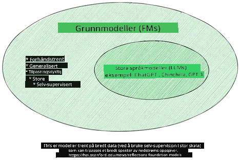
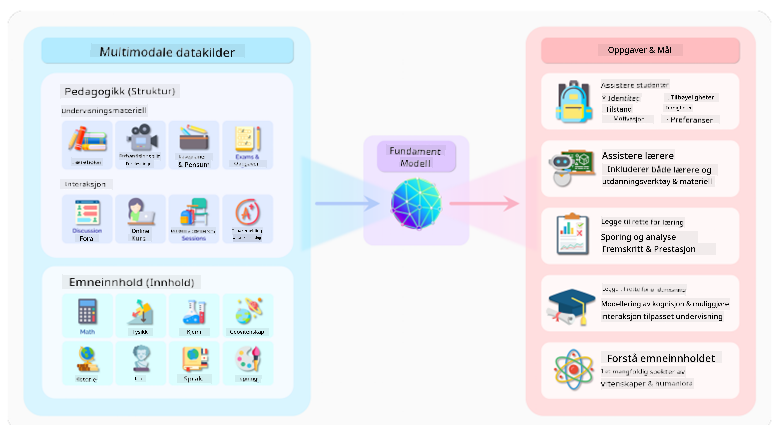
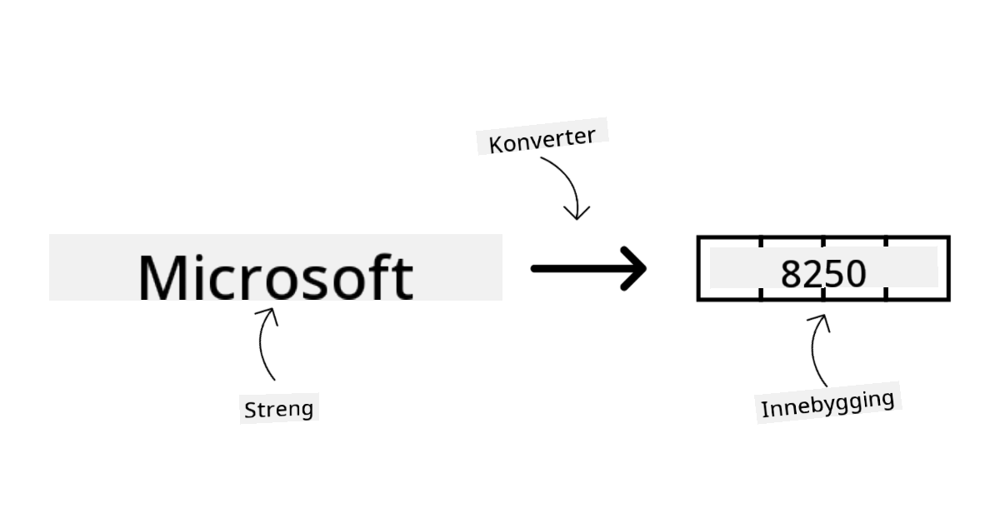
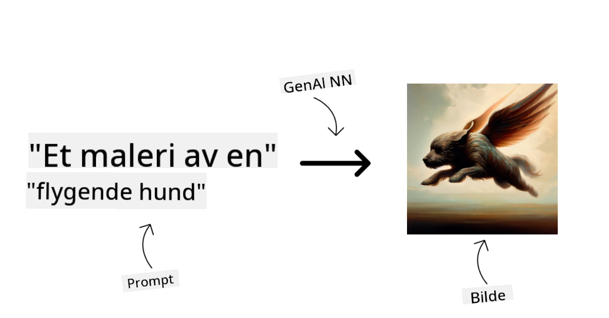
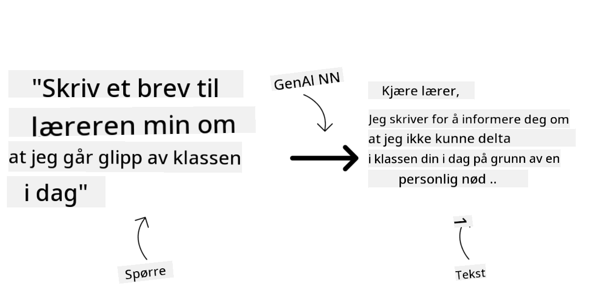
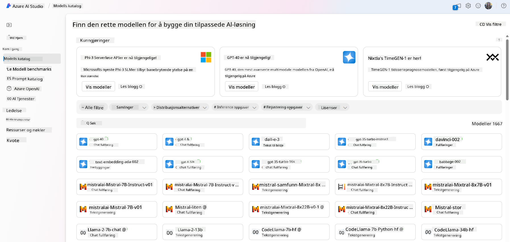
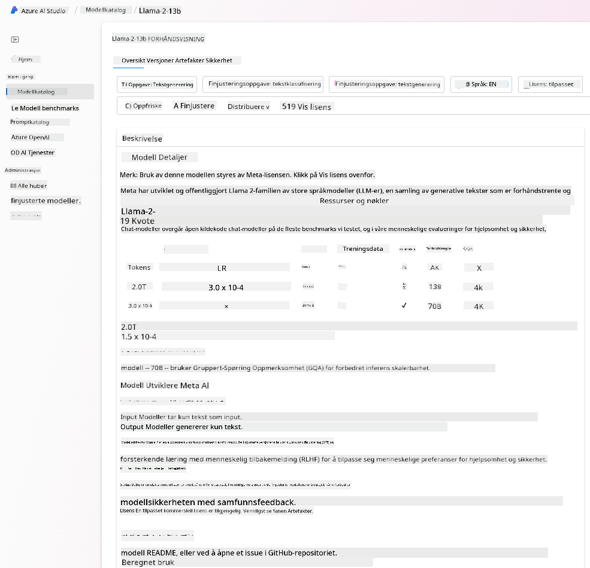
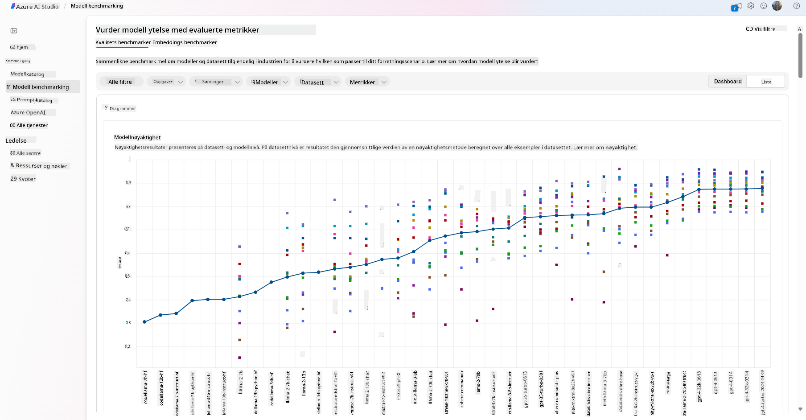
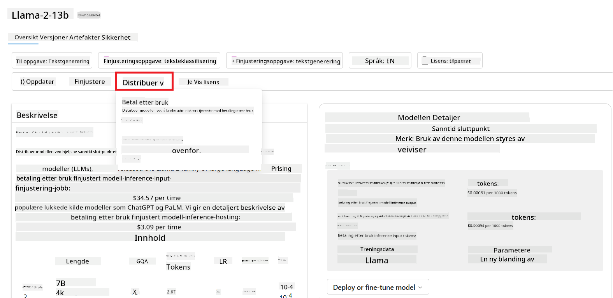
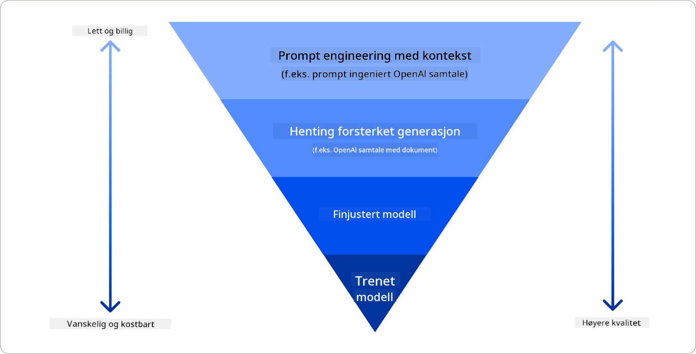

<!--
CO_OP_TRANSLATOR_METADATA:
{
  "original_hash": "e2f686f2eb794941761252ac5e8e090b",
  "translation_date": "2025-07-09T08:29:49+00:00",
  "source_file": "02-exploring-and-comparing-different-llms/README.md",
  "language_code": "no"
}
-->
# Utforske og sammenligne ulike LLM-er

> _Klikk på bildet over for å se video av denne leksjonen_

I forrige leksjon har vi sett hvordan Generativ AI endrer teknologilandskapet, hvordan Large Language Models (LLM-er) fungerer, og hvordan en bedrift – som vår startup – kan bruke dem i sine brukstilfeller og vokse! I dette kapitlet skal vi sammenligne og kontrastere ulike typer store språkmodeller (LLM-er) for å forstå deres fordeler og ulemper.

Neste steg i vår startups reise er å utforske dagens landskap av LLM-er og finne ut hvilke som passer best for vårt brukstilfelle.

## Introduksjon

Denne leksjonen vil dekke:

- Ulike typer LLM-er i dagens landskap.
- Testing, iterasjon og sammenligning av ulike modeller for ditt brukstilfelle i Azure.
- Hvordan man kan distribuere en LLM.

## Læringsmål

Etter å ha fullført denne leksjonen vil du kunne:

- Velge riktig modell for ditt brukstilfelle.
- Forstå hvordan du tester, itererer og forbedrer ytelsen til modellen din.
- Vite hvordan bedrifter distribuerer modeller.

## Forstå ulike typer LLM-er

LLM-er kan kategoriseres på flere måter basert på arkitektur, treningsdata og brukstilfelle. Å forstå disse forskjellene vil hjelpe vår startup med å velge riktig modell for situasjonen, og forstå hvordan man tester, itererer og forbedrer ytelsen.

Det finnes mange ulike typer LLM-modeller, og valget av modell avhenger av hva du ønsker å bruke dem til, dataene dine, hvor mye du er villig til å betale, og mer.

Avhengig av om du ønsker å bruke modellene til tekst, lyd, video, bilde-generering og så videre, kan du velge en annen type modell.

- **Lyd- og talegjenkjenning**. For dette formålet er Whisper-typer modeller et godt valg, da de er allsidige og rettet mot talegjenkjenning. De er trent på variert lyd og kan utføre flerspråklig talegjenkjenning. Lær mer om [Whisper-typer modeller her](https://platform.openai.com/docs/models/whisper?WT.mc_id=academic-105485-koreyst).

- **Bildegenerering**. For bildegenerering er DALL-E og Midjourney to svært kjente valg. DALL-E tilbys av Azure OpenAI. [Les mer om DALL-E her](https://platform.openai.com/docs/models/dall-e?WT.mc_id=academic-105485-koreyst) og også i kapittel 9 i dette læreplanen.

- **Tekstgenerering**. De fleste modeller er trent for tekstgenerering, og du har et bredt utvalg fra GPT-3.5 til GPT-4. De kommer til ulike kostnader, hvor GPT-4 er den dyreste. Det er verdt å sjekke ut [Azure OpenAI playground](https://oai.azure.com/portal/playground?WT.mc_id=academic-105485-koreyst) for å vurdere hvilke modeller som passer best for dine behov når det gjelder kapasitet og pris.

- **Multi-modality**. Hvis du ønsker å håndtere flere typer data i input og output, kan du se på modeller som [gpt-4 turbo med visjon eller gpt-4o](https://learn.microsoft.com/azure/ai-services/openai/concepts/models#gpt-4-and-gpt-4-turbo-models?WT.mc_id=academic-105485-koreyst) – de nyeste utgivelsene fra OpenAI – som kan kombinere naturlig språkbehandling med visuell forståelse, og muliggjør interaksjoner gjennom multimodale grensesnitt.

Å velge en modell betyr at du får noen grunnleggende funksjoner, men det er ikke alltid nok. Ofte har du bedrifts-spesifikke data som du på en eller annen måte må formidle til LLM-en. Det finnes flere måter å gjøre dette på, mer om det i de kommende seksjonene.

### Foundation Models versus LLM-er

Begrepet Foundation Model ble [myntet av forskere ved Stanford](https://arxiv.org/abs/2108.07258?WT.mc_id=academic-105485-koreyst) og definert som en AI-modell som oppfyller visse kriterier, som:

- **De trenes ved bruk av unsupervised learning eller self-supervised learning**, noe som betyr at de trenes på umerkede multimodale data, og krever ikke menneskelig annotering eller merking av data i treningsprosessen.
- **De er svært store modeller**, basert på dype nevrale nettverk trent på milliarder av parametere.
- **De er normalt ment å fungere som en ‘grunnmur’ for andre modeller**, noe som betyr at de kan brukes som utgangspunkt for å bygge andre modeller oppå, noe som kan gjøres ved finjustering.

Bildekilde: [Essential Guide to Foundation Models and Large Language Models | by Babar M Bhatti | Medium](https://thebabar.medium.com/essential-guide-to-foundation-models-and-large-language-models-27dab58f7404)

For å tydeliggjøre denne forskjellen, la oss ta ChatGPT som eksempel. For å bygge den første versjonen av ChatGPT, fungerte en modell kalt GPT-3.5 som foundation model. Det betyr at OpenAI brukte noe chat-spesifikk data for å lage en finjustert versjon av GPT-3.5 som var spesialisert på å prestere godt i samtalescenarier, som chatboter.

Bildekilde: [2108.07258.pdf (arxiv.org)](https://arxiv.org/pdf/2108.07258.pdf?WT.mc_id=academic-105485-koreyst)

### Open Source versus Proprietære modeller

En annen måte å kategorisere LLM-er på er om de er open source eller proprietære.

Open source-modeller er modeller som er gjort tilgjengelig for offentligheten og kan brukes av hvem som helst. De blir ofte gjort tilgjengelig av selskapet som laget dem, eller av forskningsmiljøet. Disse modellene kan inspiseres, modifiseres og tilpasses for ulike brukstilfeller i LLM-er. De er imidlertid ikke alltid optimalisert for produksjonsbruk, og kan ha lavere ytelse enn proprietære modeller. I tillegg kan finansieringen for open source-modeller være begrenset, og de kan mangle langsiktig vedlikehold eller oppdateringer med den nyeste forskningen. Eksempler på populære open source-modeller inkluderer [Alpaca](https://crfm.stanford.edu/2023/03/13/alpaca.html?WT.mc_id=academic-105485-koreyst), [Bloom](https://huggingface.co/bigscience/bloom) og [LLaMA](https://llama.meta.com).

Proprietære modeller er modeller som eies av et selskap og ikke er tilgjengelig for offentligheten. Disse modellene er ofte optimalisert for produksjonsbruk. De kan imidlertid ikke inspiseres, modifiseres eller tilpasses for ulike brukstilfeller. I tillegg er de ikke alltid gratis, og kan kreve abonnement eller betaling for bruk. Brukere har heller ikke kontroll over dataene som brukes til å trene modellen, noe som betyr at de må stole på at eieren av modellen sikrer personvern og ansvarlig bruk av AI. Eksempler på populære proprietære modeller inkluderer [OpenAI-modeller](https://platform.openai.com/docs/models/overview?WT.mc_id=academic-105485-koreyst), [Google Bard](https://sapling.ai/llm/bard?WT.mc_id=academic-105485-koreyst) og [Claude 2](https://www.anthropic.com/index/claude-2?WT.mc_id=academic-105485-koreyst).

### Embedding versus bilde-generering versus tekst- og kodegenerering

LLM-er kan også kategoriseres etter hvilken type output de genererer.

Embeddings er en type modeller som kan konvertere tekst til en numerisk form, kalt embedding, som er en numerisk representasjon av input-teksten. Embeddings gjør det enklere for maskiner å forstå relasjoner mellom ord eller setninger, og kan brukes som input til andre modeller, som klassifiseringsmodeller eller klyngemodeller som presterer bedre på numeriske data. Embedding-modeller brukes ofte til transfer learning, hvor en modell bygges for en surrogatoppgave med mye data, og deretter gjenbrukes modellvektene (embeddings) for andre oppgaver. Et eksempel på denne kategorien er [OpenAI embeddings](https://platform.openai.com/docs/models/embeddings?WT.mc_id=academic-105485-koreyst).

Bildegenereringsmodeller er modeller som genererer bilder. Disse brukes ofte til bildebehandling, bildesyntese og bildetransformasjon. Bildegenereringsmodeller trenes ofte på store datasett med bilder, som [LAION-5B](https://laion.ai/blog/laion-5b/?WT.mc_id=academic-105485-koreyst), og kan brukes til å generere nye bilder eller redigere eksisterende bilder med teknikker som inpainting, superoppløsning og fargelegging. Eksempler inkluderer [DALL-E-3](https://openai.com/dall-e-3?WT.mc_id=academic-105485-koreyst) og [Stable Diffusion-modeller](https://github.com/Stability-AI/StableDiffusion?WT.mc_id=academic-105485-koreyst).

Tekst- og kodegenereringsmodeller er modeller som genererer tekst eller kode. Disse brukes ofte til tekstoppsummering, oversettelse og spørsmål-svar. Tekstgenereringsmodeller trenes ofte på store tekstdatasett, som [BookCorpus](https://www.cv-foundation.org/openaccess/content_iccv_2015/html/Zhu_Aligning_Books_and_ICCV_2015_paper.html?WT.mc_id=academic-105485-koreyst), og kan brukes til å generere ny tekst eller svare på spørsmål. Kodegenereringsmodeller, som [CodeParrot](https://huggingface.co/codeparrot?WT.mc_id=academic-105485-koreyst), trenes ofte på store kodebaser, som GitHub, og kan brukes til å generere ny kode eller rette feil i eksisterende kode.

### Encoder-Decoder versus Decoder-only

For å forklare de ulike arkitekturtypene til LLM-er, la oss bruke en analogi.

Tenk deg at sjefen din ga deg i oppgave å lage en quiz for studentene. Du har to kolleger; en som har ansvar for å lage innholdet, og en annen som har ansvar for å gjennomgå det.

Innholdsprodusenten er som en Decoder-only modell, de kan se på temaet og det du allerede har skrevet, og deretter skrive et kurs basert på det. De er veldig flinke til å skrive engasjerende og informativt innhold, men ikke så gode til å forstå temaet og læringsmålene. Noen eksempler på Decoder-modeller er GPT-familien, som GPT-3.

Gjennomgangspersonen er som en Encoder-only modell, de ser på kurset som er skrevet og svarene, legger merke til sammenhengen mellom dem og forstår konteksten, men er ikke gode til å generere innhold. Et eksempel på en Encoder-only modell er BERT.

Tenk deg at vi kan ha noen som både kan lage og gjennomgå quizen, dette er en Encoder-Decoder modell. Noen eksempler er BART og T5.

### Tjeneste versus modell

Nå skal vi snakke om forskjellen mellom en tjeneste og en modell. En tjeneste er et produkt som tilbys av en Cloud Service Provider, og er ofte en kombinasjon av modeller, data og andre komponenter. En modell er kjernen i en tjeneste, og er ofte en foundation model, som en LLM.

Tjenester er ofte optimalisert for produksjonsbruk og er ofte enklere å bruke enn modeller, via et grafisk brukergrensesnitt. Tjenester er imidlertid ikke alltid gratis, og kan kreve abonnement eller betaling for bruk, i bytte mot å utnytte tjenesteeierens utstyr og ressurser, optimalisere kostnader og skalere enkelt. Et eksempel på en tjeneste er [Azure OpenAI Service](https://learn.microsoft.com/azure/ai-services/openai/overview?WT.mc_id=academic-105485-koreyst), som tilbyr en betalingsmodell basert på forbruk, noe som betyr at brukere betaler proporsjonalt med hvor mye de bruker tjenesten. Azure OpenAI Service tilbyr også sikkerhet på bedriftsnivå og et rammeverk for ansvarlig AI i tillegg til modellens funksjoner.

Modeller er bare det nevrale nettverket, med parametere, vekter og annet. Å la selskaper kjøre modeller lokalt krever imidlertid at de kjøper utstyr, bygger en struktur for skalering og kjøper lisens eller bruker en open source-modell. En modell som LLaMA er tilgjengelig for bruk, men krever regnekraft for å kjøre modellen.

## Hvordan teste og iterere med ulike modeller for å forstå ytelse i Azure

Når teamet vårt har utforsket dagens LLM-landskap og identifisert noen gode kandidater for sine scenarier, er neste steg å teste dem på egne data og arbeidsmengde. Dette er en iterativ prosess, utført gjennom eksperimenter og målinger.
De fleste modellene vi nevnte i forrige avsnitt (OpenAI-modeller, open source-modeller som Llama2, og Hugging Face-transformere) er tilgjengelige i [Model Catalog](https://learn.microsoft.com/azure/ai-studio/how-to/model-catalog-overview?WT.mc_id=academic-105485-koreyst) i [Azure AI Studio](https://ai.azure.com/?WT.mc_id=academic-105485-koreyst).

[Azure AI Studio](https://learn.microsoft.com/azure/ai-studio/what-is-ai-studio?WT.mc_id=academic-105485-koreyst) er en skyplattform designet for utviklere som vil bygge generative AI-applikasjoner og håndtere hele utviklingssyklusen – fra eksperimentering til evaluering – ved å samle alle Azure AI-tjenester i ett enkelt nav med et brukervennlig GUI. Model Catalog i Azure AI Studio gjør det mulig for brukeren å:

- Finne Foundation Model av interesse i katalogen – enten proprietær eller open source, filtrert etter oppgave, lisens eller navn. For å gjøre søket enklere, er modellene organisert i samlinger, som Azure OpenAI-samlingen, Hugging Face-samlingen og flere.

- Gå gjennom model card, inkludert en detaljert beskrivelse av tiltenkt bruk og treningsdata, kodeeksempler og evalueringsresultater fra det interne evalueringsbiblioteket.

- Sammenligne benchmarks på tvers av modeller og datasett tilgjengelig i bransjen for å vurdere hvilken som passer best for forretningsscenariet, via [Model Benchmarks](https://learn.microsoft.com/azure/ai-studio/how-to/model-benchmarks?WT.mc_id=academic-105485-koreyst)-panelet.

- Finjustere modellen på egendefinerte treningsdata for å forbedre modellens ytelse i en spesifikk arbeidsmengde, ved å utnytte eksperimenterings- og sporingsmulighetene i Azure AI Studio.

- Distribuere den opprinnelige forhåndstrente modellen eller den finjusterte versjonen til en ekstern sanntidsinferenz – administrert databehandling – eller serverløs API-endepunkt – [betal etter bruk](https://learn.microsoft.com/azure/ai-studio/how-to/model-catalog-overview#model-deployment-managed-compute-and-serverless-api-pay-as-you-go?WT.mc_id=academic-105485-koreyst) – for å gjøre det mulig for applikasjoner å bruke den.

> [!NOTE]
> Ikke alle modeller i katalogen er for øyeblikket tilgjengelige for finjustering og/eller distribusjon med betalingsmodell. Sjekk model card for detaljer om modellens egenskaper og begrensninger.

## Forbedre LLM-resultater

Vi har utforsket med vårt startup-team ulike typer LLM-er og en skyplattform (Azure Machine Learning) som gjør det mulig å sammenligne forskjellige modeller, evaluere dem på testdata, forbedre ytelsen og distribuere dem på inferensendepunkter.

Men når bør man vurdere å finjustere en modell i stedet for å bruke en forhåndstrent? Finnes det andre metoder for å forbedre modellens ytelse på spesifikke arbeidsoppgaver?

Det finnes flere tilnærminger en bedrift kan bruke for å oppnå ønskede resultater fra en LLM. Du kan velge ulike typer modeller med ulik grad av trening når du distribuerer en LLM i produksjon, med forskjellige nivåer av kompleksitet, kostnad og kvalitet. Her er noen ulike tilnærminger:

- **Prompt engineering med kontekst**. Ideen er å gi nok kontekst når du gir prompten for å sikre at du får de svarene du trenger.

- **Retrieval Augmented Generation, RAG**. Dataene dine kan for eksempel ligge i en database eller et web-endepunkt. For å sikre at disse dataene, eller et utvalg av dem, inkluderes ved prompttidspunktet, kan du hente relevant data og gjøre det til en del av brukerens prompt.

- **Finjustert modell**. Her trener du modellen videre på egne data, noe som gjør modellen mer presis og responsiv til dine behov, men det kan være kostbart.

Bildekilde: [Four Ways that Enterprises Deploy LLMs | Fiddler AI Blog](https://www.fiddler.ai/blog/four-ways-that-enterprises-deploy-llms?WT.mc_id=academic-105485-koreyst)

### Prompt Engineering med kontekst

Forhåndstrente LLM-er fungerer veldig godt på generelle naturlige språkoppgaver, selv ved å kalle dem med en kort prompt, som en setning som skal fullføres eller et spørsmål – det såkalte “zero-shot” læring.

Jo mer brukeren kan ramme inn spørsmålet sitt med en detaljert forespørsel og eksempler – altså konteksten – desto mer nøyaktig og i tråd med brukerens forventninger blir svaret. Her snakker vi om “one-shot” læring hvis prompten inneholder bare ett eksempel, og “few-shot” læring hvis den inneholder flere eksempler. Prompt engineering med kontekst er den mest kostnadseffektive måten å komme i gang på.

### Retrieval Augmented Generation (RAG)

LLM-er har begrensningen at de kun kan bruke data som har vært med i treningen for å generere et svar. Det betyr at de ikke vet noe om hendelser som har skjedd etter treningsprosessen, og de kan ikke få tilgang til ikke-offentlig informasjon (som bedriftsdata).  
Dette kan overkommes med RAG, en teknikk som utvider prompten med eksterne data i form av dokumentbiter, med tanke på begrensninger i promptens lengde. Dette støttes av vektordatabaser (som [Azure Vector Search](https://learn.microsoft.com/azure/search/vector-search-overview?WT.mc_id=academic-105485-koreyst)) som henter ut relevante biter fra ulike forhåndsdefinerte datakilder og legger dem til i promptens kontekst.

Denne teknikken er svært nyttig når en bedrift ikke har nok data, tid eller ressurser til å finjustere en LLM, men likevel ønsker å forbedre ytelsen på en spesifikk arbeidsmengde og redusere risikoen for fabrikasjoner, altså forvrengning av virkeligheten eller skadelig innhold.

### Finjustert modell

Finjustering er en prosess som utnytter transfer learning for å ‘tilpasse’ modellen til en spesifikk oppgave eller problemstilling. I motsetning til few-shot læring og RAG, resulterer dette i at en ny modell genereres med oppdaterte vekter og biaser. Det krever et sett med trenings-eksempler bestående av en enkelt input (prompten) og tilhørende output (fullføringen).  
Dette vil være den foretrukne tilnærmingen hvis:

- **Bruke finjusterte modeller**. En bedrift ønsker å bruke finjusterte, mindre kapable modeller (som embedding-modeller) i stedet for høyytelsesmodeller, noe som gir en mer kostnadseffektiv og rask løsning.

- **Vurdere latenstid**. Latenstid er viktig for et spesifikt brukstilfelle, så det er ikke mulig å bruke veldig lange prompts, eller antallet eksempler som modellen skal lære fra, passer ikke med promptens lengdebegrensning.

- **Holde seg oppdatert**. En bedrift har mye høy-kvalitetsdata og sannhetsmerkede etiketter, samt ressurser til å holde disse dataene oppdatert over tid.

### Trent modell

Å trene en LLM fra bunnen av er uten tvil den mest krevende og komplekse tilnærmingen, som krever enorme mengder data, dyktige ressurser og passende datakraft. Dette alternativet bør kun vurderes i et scenario hvor en bedrift har et domene-spesifikt brukstilfelle og store mengder domene-sentrert data.

## Kunnskapssjekk

Hva kan være en god tilnærming for å forbedre LLM fullføringsresultater?

1. Prompt engineering med kontekst  
1. RAG  
1. Finjustert modell

A:3, hvis du har tid, ressurser og høy-kvalitetsdata, er finjustering det beste valget for å holde modellen oppdatert. Men hvis du ønsker å forbedre ting og mangler tid, er det verdt å vurdere RAG først.

## 🚀 Utfordring

Les mer om hvordan du kan [bruke RAG](https://learn.microsoft.com/azure/search/retrieval-augmented-generation-overview?WT.mc_id=academic-105485-koreyst) for din virksomhet.

## Flott jobba, fortsett læringen

Etter å ha fullført denne leksjonen, sjekk ut vår [Generative AI Learning collection](https://aka.ms/genai-collection?WT.mc_id=academic-105485-koreyst) for å fortsette å utvikle din kunnskap om Generativ AI!

Gå videre til Leksjon 3 hvor vi ser på hvordan man kan [bygge med Generativ AI på en ansvarlig måte](../03-using-generative-ai-responsibly/README.md?WT.mc_id=academic-105485-koreyst)!

**Ansvarsfraskrivelse**:  
Dette dokumentet er oversatt ved hjelp av AI-oversettelsestjenesten [Co-op Translator](https://github.com/Azure/co-op-translator). Selv om vi streber etter nøyaktighet, vennligst vær oppmerksom på at automatiske oversettelser kan inneholde feil eller unøyaktigheter. Det opprinnelige dokumentet på originalspråket skal anses som den autoritative kilden. For kritisk informasjon anbefales profesjonell menneskelig oversettelse. Vi er ikke ansvarlige for eventuelle misforståelser eller feiltolkninger som oppstår ved bruk av denne oversettelsen.