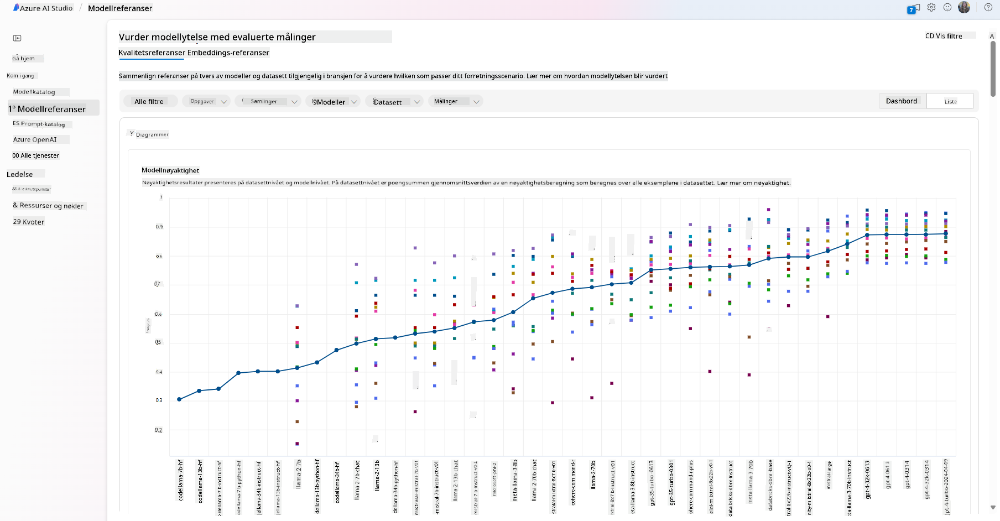
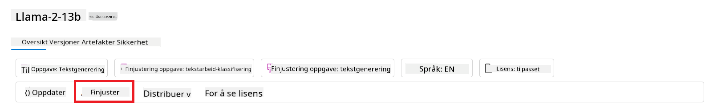
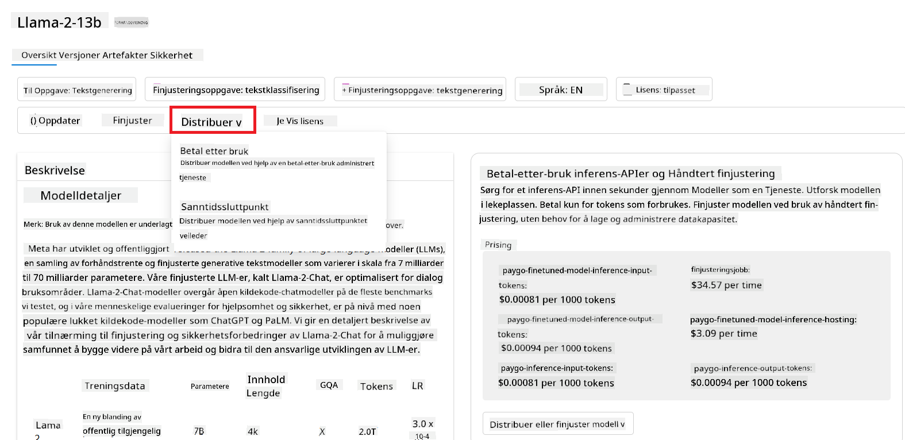

<!--
CO_OP_TRANSLATOR_METADATA:
{
  "original_hash": "e2f686f2eb794941761252ac5e8e090b",
  "translation_date": "2025-05-19T14:06:54+00:00",
  "source_file": "02-exploring-and-comparing-different-llms/README.md",
  "language_code": "no"
}
-->
# Utforsking og sammenligning av ulike LLM-er

> _Klikk på bildet over for å se videoen av denne leksjonen_

I den forrige leksjonen så vi hvordan Generativ AI endrer teknologilandskapet, hvordan Store Språkmodeller (LLM-er) fungerer og hvordan en bedrift - som vår oppstart - kan bruke dem til sine bruksområder og vokse! I dette kapittelet skal vi sammenligne og kontrastere ulike typer store språkmodeller (LLM-er) for å forstå deres fordeler og ulemper.

Neste steg i vår oppstartsreise er å utforske det nåværende landskapet av LLM-er og forstå hvilke som er egnet for vårt bruksområde.

## Introduksjon

Denne leksjonen vil dekke:

- Ulike typer LLM-er i det nåværende landskapet.
- Testing, iterering og sammenligning av ulike modeller for ditt bruksområde i Azure.
- Hvordan distribuere en LLM.

## Læringsmål

Etter å ha fullført denne leksjonen, vil du kunne:

- Velge riktig modell for ditt bruksområde.
- Forstå hvordan du tester, itererer og forbedrer ytelsen til modellen din.
- Vite hvordan bedrifter distribuerer modeller.

## Forstå ulike typer LLM-er

LLM-er kan ha flere kategoriseringer basert på deres arkitektur, treningsdata og bruksområde. Å forstå disse forskjellene vil hjelpe vår oppstart med å velge riktig modell for scenariet, og forstå hvordan man tester, itererer og forbedrer ytelsen.

Det finnes mange forskjellige typer LLM-modeller, og valget ditt av modell avhenger av hva du ønsker å bruke dem til, dine data, hvor mye du er villig til å betale og mer.

Avhengig av om du ønsker å bruke modellene for tekst, lyd, video, bildegenerering osv., kan du velge en annen type modell.

- **Lyd og talegjenkjenning**. For dette formålet er Whisper-typen modeller et godt valg da de er generelle og rettet mot talegjenkjenning. Den er trent på variert lyd og kan utføre flerspråklig talegjenkjenning. Lær mer om [Whisper-typen modeller her](https://platform.openai.com/docs/models/whisper?WT.mc_id=academic-105485-koreyst).

- **Bildefremstilling**. For bildegenerering er DALL-E og Midjourney to svært kjente valg. DALL-E tilbys av Azure OpenAI. [Les mer om DALL-E her](https://platform.openai.com/docs/models/dall-e?WT.mc_id=academic-105485-koreyst) og også i kapittel 9 av denne læreplanen.

- **Tekstgenerering**. De fleste modeller er trent på tekstgenerering, og du har et stort utvalg av valg fra GPT-3.5 til GPT-4. De kommer til forskjellige kostnader, hvor GPT-4 er den dyreste. Det er verdt å se innom [Azure OpenAI-lekeplassen](https://oai.azure.com/portal/playground?WT.mc_id=academic-105485-koreyst) for å evaluere hvilke modeller som best passer dine behov når det gjelder kapasitet og kostnad.

- **Multimodalitet**. Hvis du ønsker å håndtere flere typer data i input og output, kan du se på modeller som [gpt-4 turbo med visjon eller gpt-4o](https://learn.microsoft.com/azure/ai-services/openai/concepts/models#gpt-4-and-gpt-4-turbo-models?WT.mc_id=academic-105485-koreyst) - de nyeste utgivelsene av OpenAI-modeller - som er i stand til å kombinere naturlig språkbehandling med visuell forståelse, slik at interaksjoner kan skje gjennom multimodale grensesnitt.

Å velge en modell betyr at du får noen grunnleggende evner, som kanskje ikke er nok. Ofte har du selskaps-spesifikke data som du på en eller annen måte må fortelle LLM om. Det finnes noen forskjellige valg på hvordan man kan nærme seg det, mer om det i de kommende avsnittene.

### Grunnmodeller versus LLM-er

Begrepet Grunnmodell ble [laget av Stanford-forskere](https://arxiv.org/abs/2108.07258?WT.mc_id=academic-105485-koreyst) og definert som en AI-modell som følger noen kriterier, som:

- **De er trent ved bruk av usupervisert læring eller selv-supervisert læring**, noe som betyr at de er trent på umerkede multimodale data, og de krever ikke menneskelig annotering eller merking av data for treningsprosessen.
- **De er veldig store modeller**, basert på veldig dype nevrale nettverk trent på milliarder av parametere.
- **De er normalt ment å tjene som et ‘grunnlag’ for andre modeller**, noe som betyr at de kan brukes som et utgangspunkt for andre modeller som kan bygges på toppen av, noe som kan gjøres ved finjustering.

For å ytterligere klargjøre dette skillet, la oss ta ChatGPT som et eksempel. For å bygge den første versjonen av ChatGPT, fungerte en modell kalt GPT-3.5 som grunnmodellen. Dette betyr at OpenAI brukte noe chat-spesifikke data for å lage en finjustert versjon av GPT-3.5 som var spesialisert i å prestere godt i konversasjonelle scenarier, som chatbots.

### Åpen kildekode versus proprietære modeller

En annen måte å kategorisere LLM-er på er om de er åpen kildekode eller proprietære.

Åpen kildekode-modeller er modeller som gjøres tilgjengelige for offentligheten og kan brukes av hvem som helst. De gjøres ofte tilgjengelige av selskapet som opprettet dem, eller av forskningsmiljøet. Disse modellene kan inspiseres, modifiseres og tilpasses for de ulike bruksområdene i LLM-er. Imidlertid er de ikke alltid optimalisert for produksjonsbruk, og kan være mindre ytelsesdyktige enn proprietære modeller. I tillegg kan finansiering for åpen kildekode-modeller være begrenset, og de kan ikke bli vedlikeholdt på lang sikt eller oppdatert med den nyeste forskningen. Eksempler på populære åpen kildekode-modeller inkluderer [Alpaca](https://crfm.stanford.edu/2023/03/13/alpaca.html?WT.mc_id=academic-105485-koreyst), [Bloom](https://huggingface.co/bigscience/bloom) og [LLaMA](https://llama.meta.com).

Proprietære modeller er modeller som eies av et selskap og ikke gjøres tilgjengelige for offentligheten. Disse modellene er ofte optimalisert for produksjonsbruk. Imidlertid kan de ikke inspiseres, modifiseres eller tilpasses for forskjellige bruksområder. I tillegg er de ikke alltid tilgjengelige gratis, og kan kreve abonnement eller betaling for å bruke. Også, brukere har ikke kontroll over dataene som brukes til å trene modellen, noe som betyr at de må stole på at modelleieren sikrer forpliktelse til databeskyttelse og ansvarlig bruk av AI. Eksempler på populære proprietære modeller inkluderer [OpenAI-modeller](https://platform.openai.com/docs/models/overview?WT.mc_id=academic-105485-koreyst), [Google Bard](https://sapling.ai/llm/bard?WT.mc_id=academic-105485-koreyst) eller [Claude 2](https://www.anthropic.com/index/claude-2?WT.mc_id=academic-105485-koreyst).

### Innebygging versus bildegenerering versus tekst- og kodegenerering

LLM-er kan også kategoriseres etter outputen de genererer.

Innebygginger er et sett med modeller som kan konvertere tekst til en numerisk form, kalt innebygging, som er en numerisk representasjon av input-teksten. Innebygginger gjør det lettere for maskiner å forstå forholdet mellom ord eller setninger og kan brukes som input av andre modeller, som klassifikasjonsmodeller, eller klyngemodeller som har bedre ytelse på numeriske data. Innebyggingsmodeller brukes ofte til overføringslæring, der en modell bygges for en surrogatoppgave for hvilken det er en overflod av data, og deretter gjenbrukes modellvektene (innebygginger) for andre nedstrøms oppgaver. Et eksempel på denne kategorien er [OpenAI innebygginger](https://platform.openai.com/docs/models/embeddings?WT.mc_id=academic-105485-koreyst).

Bildefremstillingsmodeller er modeller som genererer bilder. Disse modellene brukes ofte til bildeforbedring, bildesyntese og bildetranslasjon. Bildefremstillingsmodeller trenes ofte på store datasett av bilder, som [LAION-5B](https://laion.ai/blog/laion-5b/?WT.mc_id=academic-105485-koreyst), og kan brukes til å generere nye bilder eller til å redigere eksisterende bilder med innmaling, superoppløsning og fargeleggingsteknikker. Eksempler inkluderer [DALL-E-3](https://openai.com/dall-e-3?WT.mc_id=academic-105485-koreyst) og [Stable Diffusion-modeller](https://github.com/Stability-AI/StableDiffusion?WT.mc_id=academic-105485-koreyst).

Tekst- og kodegenereringsmodeller er modeller som genererer tekst eller kode. Disse modellene brukes ofte til tekstsammendrag, oversettelse og spørsmålsbesvarelse. Tekstgenereringsmodeller trenes ofte på store datasett av tekst, som [BookCorpus](https://www.cv-foundation.org/openaccess/content_iccv_2015/html/Zhu_Aligning_Books_and_ICCV_2015_paper.html?WT.mc_id=academic-105485-koreyst), og kan brukes til å generere ny tekst, eller til å besvare spørsmål. Kodegenereringsmodeller, som [CodeParrot](https://huggingface.co/codeparrot?WT.mc_id=academic-105485-koreyst), trenes ofte på store datasett av kode, som GitHub, og kan brukes til å generere ny kode, eller til å fikse feil i eksisterende kode.

### Koder-dekoder versus kun dekoder

For å snakke om de forskjellige typene arkitekturer av LLM-er, la oss bruke en analogi.

Tenk deg at lederen din ga deg en oppgave med å lage en quiz for studentene. Du har to kolleger; en som har ansvaret for å lage innholdet og en annen som har ansvaret for å gjennomgå dem.

Innholdsskaperen er som en modell som kun dekoder, de kan se på emnet og se hva du allerede har skrevet, og deretter kan de skrive et kurs basert på det. De er veldig gode til å skrive engasjerende og informativt innhold, men de er ikke veldig gode til å forstå emnet og læringsmålene. Noen eksempler på dekodermodeller er GPT-familien modeller, som GPT-3.

Gjennomleseren er som en modell som kun koder, de ser på kurset som er skrevet og svarene, legger merke til forholdet mellom dem og forstår konteksten, men de er ikke gode til å generere innhold. Et eksempel på en modell som kun koder ville være BERT.

Tenk deg at vi også kan ha noen som kunne lage og gjennomgå quizen, dette er en koder-dekoder-modell. Noen eksempler ville være BART og T5.

### Tjeneste versus modell

La oss nå snakke om forskjellen mellom en tjeneste og en modell. En tjeneste er et produkt som tilbys av en skyleverandør, og er ofte en kombinasjon av modeller, data og andre komponenter. En modell er kjernen i en tjeneste, og er ofte en grunnmodell, som en LLM.

Tjenester er ofte optimalisert for produksjonsbruk og er ofte enklere å bruke enn modeller, via et grafisk brukergrensesnitt. Imidlertid er tjenester ikke alltid tilgjengelige gratis, og kan kreve abonnement eller betaling for å bruke, i bytte for å utnytte tjenesteeierens utstyr og ressurser, optimalisere utgifter og skalere enkelt. Et eksempel på en tjeneste er [Azure OpenAI Service](https://learn.microsoft.com/azure/ai-services/openai/overview?WT.mc_id=academic-105485-koreyst), som tilbyr en pay-as-you-go-plan, noe som betyr at brukere belastes proporsjonalt med hvor mye de bruker tjenesten. I tillegg tilbyr Azure OpenAI Service sikkerhet på bedriftsnivå og et ansvarlig AI-rammeverk på toppen av modellenes evner.

Modeller er bare det nevrale nettverket, med parametrene, vektene og andre. Dette gjør at selskaper kan kjøre lokalt, men de må kjøpe utstyr, bygge en struktur for å skalere og kjøpe en lisens eller bruke en åpen kildekode-modell. En modell som LLaMA er tilgjengelig for å brukes, og krever datakraft for å kjøre modellen.

## Hvordan teste og iterere med forskjellige modeller for å forstå ytelse på Azure

Når teamet vårt har utforsket det nåværende LLM-landskapet og identifisert noen gode kandidater for sine scenarier, er neste steg å teste dem på deres data og på deres arbeidsmengde. Dette er en iterativ prosess, gjort ved eksperimenter og målinger. De fleste av modellene vi nevnte i tidligere avsnitt (OpenAI-modeller, åpen kildekode-modeller som Llama2 og Hugging Face-transformatorer) er tilgjengelige i [Model Catalog](https://learn.microsoft.com/azure/ai-studio/how-to/model-catalog-overview?WT.mc_id=academic-105485-koreyst) i [Azure AI Studio](https://ai.azure.com/?WT.mc_id=academic-105485-koreyst).

[Azure AI Studio](https://learn.microsoft.com/azure/ai-studio/what-is-ai-studio?WT.mc_id=academic-105485-koreyst) er en skyplattform designet for utviklere for å bygge generative AI-applikasjoner og administrere hele utviklingslivssyklusen - fra eksperimentering til evaluering - ved å kombinere alle Azure AI-tjenester i et enkelt nav med et brukervennlig GUI. Modellkatalogen i Azure AI Studio gjør det mulig for brukeren å:

- Finne grunnmodellen av interesse i katalogen - enten proprietær eller åpen kildekode, filtrert etter oppgave, lisens eller navn. For å forbedre søkbarheten er modellene organisert i samlinger, som Azure OpenAI-samling, Hugging Face-samling og mer.

- Gå gjennom modellkortet, inkludert en detaljert beskrivelse av tiltenkt bruk og treningsdata, kodeeksempler og evalueringsresultater på det interne evalueringsbiblioteket.
- Sammenlign benchmarks på tvers av modeller og datasett tilgjengelig i bransjen for å vurdere hvilken som passer best til forretningsscenariet, gjennom [Model Benchmarks](https://learn.microsoft.com/azure/ai-studio/how-to/model-benchmarks?WT.mc_id=academic-105485-koreyst)-panelet.

- Finjuster modellen på egendefinerte treningsdata for å forbedre modellens ytelse i en spesifikk arbeidsbelastning, ved å bruke eksperimenterings- og sporingsfunksjonene i Azure AI Studio.

- Distribuer den originale forhåndstrente modellen eller den finjusterte versjonen til en ekstern sanntidsinfrastruktur - administrert databehandling - eller serverløs API-endepunkt - [betal etter bruk](https://learn.microsoft.com/azure/ai-studio/how-to/model-catalog-overview#model-deployment-managed-compute-and-serverless-api-pay-as-you-go?WT.mc_id=academic-105485-koreyst) - for å gjøre den tilgjengelig for applikasjoner.

> [!NOTE]
> Ikke alle modeller i katalogen er for øyeblikket tilgjengelige for finjustering og/eller betal-etter-bruk distribusjon. Sjekk modellkortet for detaljer om modellens evner og begrensninger.

## Forbedre LLM-resultater

Vi har utforsket ulike typer LLM-er med vårt oppstartsteam og en skyplattform (Azure Machine Learning) som gjør det mulig for oss å sammenligne ulike modeller, evaluere dem på testdata, forbedre ytelsen og distribuere dem på inferensendepunkter.

Men når bør de vurdere å finjustere en modell i stedet for å bruke en forhåndstrent en? Finnes det andre tilnærminger for å forbedre modellens ytelse på spesifikke arbeidsbelastninger?

Det er flere tilnærminger en bedrift kan bruke for å oppnå de resultatene de trenger fra en LLM. Du kan velge forskjellige typer modeller med ulike grader av trening når du distribuerer en LLM i produksjon, med ulike nivåer av kompleksitet, kostnad og kvalitet. Her er noen forskjellige tilnærminger:

- **Prompt engineering med kontekst**. Ideen er å gi nok kontekst når du gir et prompt for å sikre at du får de svarene du trenger.

- **Retrieval Augmented Generation, RAG**. Dataene dine kan for eksempel eksistere i en database eller et nettendepunkt, for å sikre at disse dataene, eller en del av dem, inkluderes ved prompting, kan du hente de relevante dataene og gjøre dem til en del av brukerens prompt.

- **Finjustert modell**. Her har du trent modellen videre på dine egne data, noe som har ført til at modellen er mer nøyaktig og responsiv på dine behov, men det kan være kostbart.

Bildekilde: [Fire måter bedrifter distribuerer LLM-er | Fiddler AI Blog](https://www.fiddler.ai/blog/four-ways-that-enterprises-deploy-llms?WT.mc_id=academic-105485-koreyst)

### Prompt Engineering med Kontekst

Forhåndstrente LLM-er fungerer veldig bra på generelle oppgaver innen naturlig språk, selv ved å kalle dem med et kort prompt, som en setning å fullføre eller et spørsmål – den såkalte "zero-shot" læringen.

Jo mer brukeren kan ramme inn spørsmålet sitt med en detaljert forespørsel og eksempler – konteksten – desto mer nøyaktig og nærmere brukerens forventninger vil svaret være. I dette tilfellet snakker vi om "one-shot" læring hvis prompten inkluderer bare ett eksempel og "few-shot learning" hvis det inkluderer flere eksempler. Prompt engineering med kontekst er den mest kostnadseffektive tilnærmingen å starte med.

### Retrieval Augmented Generation (RAG)

LLM-er har den begrensningen at de kun kan bruke dataene som ble brukt under treningen deres for å generere et svar. Dette betyr at de ikke vet noe om fakta som skjedde etter treningsprosessen, og de kan ikke få tilgang til ikke-offentlig informasjon (som bedriftsdata). Dette kan overvinnes gjennom RAG, en teknikk som forsterker prompten med ekstern data i form av dokumentutdrag, med tanke på promptens lengdebegrensninger. Dette støttes av Vektor-databaseverktøy (som [Azure Vector Search](https://learn.microsoft.com/azure/search/vector-search-overview?WT.mc_id=academic-105485-koreyst)) som henter de nyttige utdragene fra varierte forhåndsdefinerte datakilder og legger dem til i prompt-konteksten.

Denne teknikken er svært nyttig når en bedrift ikke har nok data, tid eller ressurser til å finjustere en LLM, men likevel ønsker å forbedre ytelsen på en spesifikk arbeidsbelastning og redusere risikoen for fabrikasjoner, det vil si mystifikasjon av virkeligheten eller skadelig innhold.

### Finjustert modell

Finjustering er en prosess som utnytter overføringslæring for å 'tilpasse' modellen til en nedstrøms oppgave eller for å løse et spesifikt problem. I motsetning til få-skudd læring og RAG, resulterer det i en ny modell som genereres, med oppdaterte vekter og skjevheter. Det krever et sett med trenings-eksempler bestående av en enkelt input (prompten) og dens tilknyttede output (fullføringen). Dette ville være den foretrukne tilnærmingen hvis:

- **Bruk av finjusterte modeller**. En bedrift ønsker å bruke finjusterte mindre kapable modeller (som innebyggingsmodeller) i stedet for høyytelsesmodeller, noe som resulterer i en mer kostnadseffektiv og rask løsning.

- **Vurdering av latens**. Latens er viktig for en spesifikk brukstilfelle, så det er ikke mulig å bruke veldig lange prompt eller antallet eksempler som skal læres av modellen passer ikke med promptens lengdebegrensning.

- **Holde seg oppdatert**. En bedrift har mye høykvalitetsdata og sannhetsverdier og ressursene som kreves for å holde disse dataene oppdatert over tid.

### Trenet modell

Å trene en LLM fra bunnen av er uten tvil den mest utfordrende og komplekse tilnærmingen å adoptere, som krever enorme mengder data, dyktige ressurser og passende beregningskraft. Dette alternativet bør bare vurderes i et scenario der en bedrift har et domene-spesifikt brukstilfelle og en stor mengde domenesentriske data.

## Kunnskapssjekk

Hva kan være en god tilnærming for å forbedre LLM-fullføringsresultater?

1. Prompt engineering med kontekst
1. RAG
1. Finjustert modell

A:3, hvis du har tid og ressurser og høykvalitetsdata, er finjustering det bedre alternativet for å holde seg oppdatert. Men hvis du ønsker å forbedre ting og mangler tid, er det verdt å vurdere RAG først.

## 🚀 Utfordring

Les mer om hvordan du kan [bruke RAG](https://learn.microsoft.com/azure/search/retrieval-augmented-generation-overview?WT.mc_id=academic-105485-koreyst) for din bedrift.

## Flott arbeid, fortsett læringen din

Etter å ha fullført denne leksjonen, sjekk ut vår [Generative AI Learning collection](https://aka.ms/genai-collection?WT.mc_id=academic-105485-koreyst) for å fortsette å styrke kunnskapen din om Generativ AI!

Gå videre til Leksjon 3 hvor vi vil se på hvordan du kan [bygge med Generativ AI ansvarlig](../03-using-generative-ai-responsibly/README.md?WT.mc_id=academic-105485-koreyst)!

**Ansvarsfraskrivelse**:  
Dette dokumentet har blitt oversatt ved hjelp av AI-oversettelsestjenesten [Co-op Translator](https://github.com/Azure/co-op-translator). Selv om vi streber etter nøyaktighet, vær oppmerksom på at automatiserte oversettelser kan inneholde feil eller unøyaktigheter. Det originale dokumentet på sitt opprinnelige språk bør betraktes som den autoritative kilden. For kritisk informasjon anbefales profesjonell menneskelig oversettelse. Vi er ikke ansvarlige for misforståelser eller feiltolkninger som oppstår fra bruken av denne oversettelsen.