<!--
CO_OP_TRANSLATOR_METADATA:
{
  "original_hash": "e2f686f2eb794941761252ac5e8e090b",
  "translation_date": "2025-06-25T10:46:20+00:00",
  "source_file": "02-exploring-and-comparing-different-llms/README.md",
  "language_code": "no"
}
-->
# Utforske og sammenligne forskjellige LLM-er

> _Klikk på bildet ovenfor for å se videoen av denne leksjonen_

I forrige leksjon så vi hvordan Generativ AI endrer teknologiens landskap, hvordan store språkmodeller (LLM-er) fungerer og hvordan en bedrift - som vår oppstart - kan bruke dem til sine bruksområder og vokse! I dette kapittelet skal vi sammenligne og kontrastere forskjellige typer store språkmodeller (LLM-er) for å forstå deres fordeler og ulemper.

Neste steg i vår oppstartsreise er å utforske det nåværende landskapet av LLM-er og forstå hvilke som er egnet for vår bruksområde.

## Introduksjon

Denne leksjonen vil dekke:

- Forskjellige typer LLM-er i det nåværende landskapet.
- Testing, iterering og sammenligning av forskjellige modeller for ditt bruksområde i Azure.
- Hvordan distribuere en LLM.

## Læringsmål

Etter å ha fullført denne leksjonen, vil du kunne:

- Velge riktig modell for ditt bruksområde.
- Forstå hvordan du tester, itererer og forbedrer ytelsen til din modell.
- Vite hvordan bedrifter distribuerer modeller.

## Forstå forskjellige typer LLM-er

LLM-er kan ha flere kategoriseringer basert på deres arkitektur, treningsdata og bruksområde. Å forstå disse forskjellene vil hjelpe vår oppstart med å velge riktig modell for scenarioet, og forstå hvordan man tester, itererer og forbedrer ytelsen.

Det finnes mange forskjellige typer LLM-modeller, og valget av modell avhenger av hva du har som mål å bruke dem til, dine data, hvor mye du er villig til å betale og mer.

Avhengig av om du har som mål å bruke modellene til tekst, lyd, video, bildegenerering og så videre, kan du velge en annen type modell.

- **Lyd- og talegjenkjenning**. For dette formålet er Whisper-type modeller et godt valg da de er allsidige og rettet mot talegjenkjenning. De er trent på mangfoldig lyd og kan utføre flerspråklig talegjenkjenning. Lær mer om [Whisper type modeller her](https://platform.openai.com/docs/models/whisper?WT.mc_id=academic-105485-koreyst).

- **Bildegenerering**. For bildegenerering er DALL-E og Midjourney to svært kjente valg. DALL-E tilbys av Azure OpenAI. [Les mer om DALL-E her](https://platform.openai.com/docs/models/dall-e?WT.mc_id=academic-105485-koreyst) og også i kapittel 9 av denne læreplanen.

- **Tekstgenerering**. De fleste modeller er trent på tekstgenerering og du har et stort utvalg fra GPT-3.5 til GPT-4. De kommer til forskjellige kostnader med GPT-4 som den dyreste. Det er verdt å se på [Azure OpenAI playground](https://oai.azure.com/portal/playground?WT.mc_id=academic-105485-koreyst) for å evaluere hvilke modeller som best passer dine behov når det gjelder kapasitet og kostnad.

- **Multi-modality**. Hvis du ønsker å håndtere flere typer data i input og output, kan du vurdere modeller som [gpt-4 turbo med visjon eller gpt-4o](https://learn.microsoft.com/azure/ai-services/openai/concepts/models#gpt-4-and-gpt-4-turbo-models?WT.mc_id=academic-105485-koreyst) - de nyeste utgivelsene av OpenAI-modeller - som er i stand til å kombinere naturlig språkbehandling med visuell forståelse, og muliggjør interaksjoner gjennom multimodale grensesnitt.

Å velge en modell betyr at du får noen grunnleggende evner, som kanskje ikke er nok. Ofte har du selskaps spesifikke data som du på en eller annen måte må fortelle LLM-en om. Det finnes noen forskjellige valg på hvordan man kan nærme seg det, mer om det i de kommende seksjonene.

### Foundation Modeller versus LLM-er

Begrepet Foundation Model ble [laget av Stanford-forskere](https://arxiv.org/abs/2108.07258?WT.mc_id=academic-105485-koreyst) og definert som en AI-modell som følger noen kriterier, slik som:

- **De er trent ved bruk av usupervisert læring eller selv-supervisert læring**, som betyr at de er trent på umerkede multimodale data, og de krever ikke menneskelig annotering eller merking av data for deres treningsprosess.
- **De er svært store modeller**, basert på svært dype nevrale nettverk trent på milliarder av parametere.
- **De er normalt ment å tjene som en ‘grunnlag’ for andre modeller**, som betyr at de kan brukes som et utgangspunkt for andre modeller som kan bygges på toppen av, som kan gjøres ved finjustering.

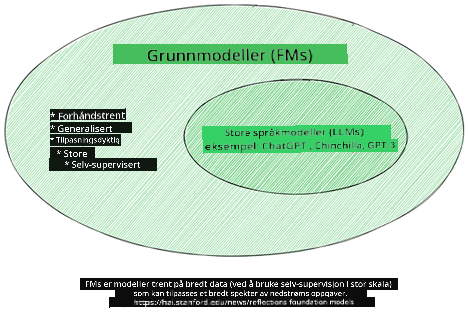

Bildekilde: [Essensiell guide til Foundation Modeller og Store Språkmodeller | av Babar M Bhatti | Medium](https://thebabar.medium.com/essential-guide-to-foundation-models-and-large-language-models-27dab58f7404)

For å ytterligere klargjøre denne distinksjonen, la oss ta ChatGPT som et eksempel. For å bygge den første versjonen av ChatGPT, tjente en modell kalt GPT-3.5 som grunnlagsmodell. Dette betyr at OpenAI brukte noen chat-spesifikke data for å lage en tilpasset versjon av GPT-3.5 som var spesialisert i å prestere godt i samtalescenarier, slik som chatbots.

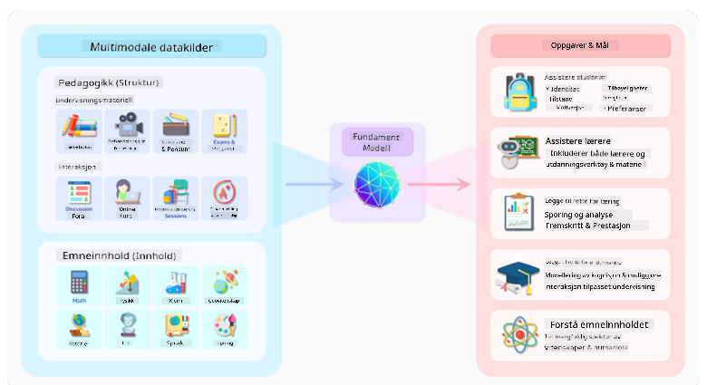

Bildekilde: [2108.07258.pdf (arxiv.org)](https://arxiv.org/pdf/2108.07258.pdf?WT.mc_id=academic-105485-koreyst)

### Åpen kildekode versus Proprietære Modeller

En annen måte å kategorisere LLM-er på er om de er åpen kildekode eller proprietære.

Åpen kildekode modeller er modeller som gjøres tilgjengelig for offentligheten og kan brukes av hvem som helst. De gjøres ofte tilgjengelig av selskapet som opprettet dem, eller av forskningssamfunnet. Disse modellene kan inspiseres, modifiseres og tilpasses for de forskjellige bruksområdene i LLM-er. Men de er ikke alltid optimalisert for produksjonsbruk, og kan kanskje ikke være like ytelsesdyktige som proprietære modeller. I tillegg kan finansiering for åpen kildekode modeller være begrenset, og de kan kanskje ikke vedlikeholdes på lang sikt eller oppdateres med den nyeste forskningen. Eksempler på populære åpen kildekode modeller inkluderer [Alpaca](https://crfm.stanford.edu/2023/03/13/alpaca.html?WT.mc_id=academic-105485-koreyst), [Bloom](https://huggingface.co/bigscience/bloom) og [LLaMA](https://llama.meta.com).

Proprietære modeller er modeller som eies av et selskap og ikke gjøres tilgjengelig for offentligheten. Disse modellene er ofte optimalisert for produksjonsbruk. Men de kan ikke inspiseres, modifiseres eller tilpasses for forskjellige bruksområder. I tillegg er de ikke alltid tilgjengelige gratis, og kan kreve et abonnement eller betaling for bruk. Brukere har heller ikke kontroll over dataene som brukes til å trene modellen, noe som betyr at de bør stole på modellens eier for å sikre forpliktelse til databeskyttelse og ansvarlig bruk av AI. Eksempler på populære proprietære modeller inkluderer [OpenAI modeller](https://platform.openai.com/docs/models/overview?WT.mc_id=academic-105485-koreyst), [Google Bard](https://sapling.ai/llm/bard?WT.mc_id=academic-105485-koreyst) eller [Claude 2](https://www.anthropic.com/index/claude-2?WT.mc_id=academic-105485-koreyst).

### Innebygging versus Bildegenerering versus Tekst- og Kodegenerering

LLM-er kan også kategoriseres etter output de genererer.

Innebygginger er et sett med modeller som kan konvertere tekst til en numerisk form, kalt innebygging, som er en numerisk representasjon av input-teksten. Innebygginger gjør det lettere for maskiner å forstå forholdene mellom ord eller setninger og kan konsumeres som input av andre modeller, slik som klassifiseringsmodeller, eller klustringsmodeller som har bedre ytelse på numeriske data. Innebyggingsmodeller brukes ofte for overføringslæring, hvor en modell bygges for en surrogatoppgave for hvilken det er en overflod av data, og deretter gjenbrukes modellvektene (innebygginger) for andre nedstrøms oppgaver. Et eksempel på denne kategorien er [OpenAI innebygginger](https://platform.openai.com/docs/models/embeddings?WT.mc_id=academic-105485-koreyst).

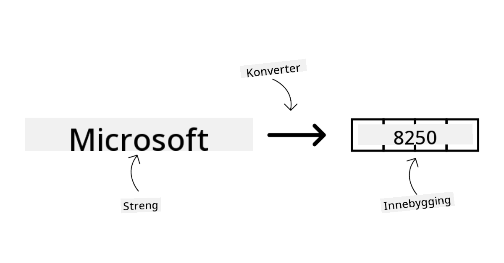

Bildegenereringsmodeller er modeller som genererer bilder. Disse modellene brukes ofte til bildebehandling, bildesyntese og bildetransformasjon. Bildegenereringsmodeller trenes ofte på store datasett av bilder, slik som [LAION-5B](https://laion.ai/blog/laion-5b/?WT.mc_id=academic-105485-koreyst), og kan brukes til å generere nye bilder eller til å redigere eksisterende bilder med innmaling, superoppløsning og fargeleggingsteknikker. Eksempler inkluderer [DALL-E-3](https://openai.com/dall-e-3?WT.mc_id=academic-105485-koreyst) og [Stable Diffusion modeller](https://github.com/Stability-AI/StableDiffusion?WT.mc_id=academic-105485-koreyst).

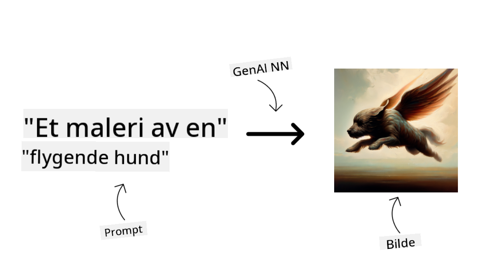

Tekst- og kodegenereringsmodeller er modeller som genererer tekst eller kode. Disse modellene brukes ofte til tekstsammendrag, oversettelse og spørsmålssvar. Tekstgenereringsmodeller trenes ofte på store datasett av tekst, slik som [BookCorpus](https://www.cv-foundation.org/openaccess/content_iccv_2015/html/Zhu_Aligning_Books_and_ICCV_2015_paper.html?WT.mc_id=academic-105485-koreyst), og kan brukes til å generere ny tekst eller til å svare på spørsmål. Kodegenereringsmodeller, som [CodeParrot](https://huggingface.co/codeparrot?WT.mc_id=academic-105485-koreyst), trenes ofte på store datasett av kode, slik som GitHub, og kan brukes til å generere ny kode eller til å fikse feil i eksisterende kode.

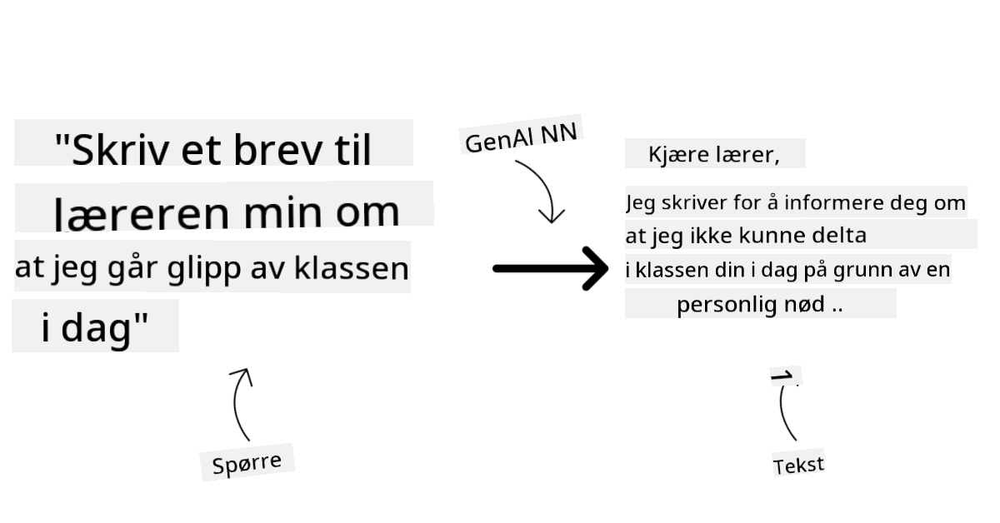

### Encoder-Decoder versus Kun Decoder

For å snakke om de forskjellige typene arkitekturer av LLM-er, la oss bruke en analogi.

Tenk deg at din sjef ga deg en oppgave med å skrive en quiz for studentene. Du har to kolleger; en som har ansvar for å lage innholdet og den andre som har ansvar for å gjennomgå dem.

Innholdsskaperen er som en modell som kun er en Decoder, de kan se på emnet og se hva du allerede har skrevet og deretter kan han skrive et kurs basert på det. De er veldig gode til å skrive engasjerende og informativt innhold, men de er ikke veldig gode til å forstå emnet og læringsmålene. Noen eksempler på Decoder-modeller er GPT-familien modeller, slik som GPT-3.

Gjennomleseren er som en modell som kun er en Encoder, de ser på det skrevne kurset og svarene, merker forholdet mellom dem og forstår konteksten, men de er ikke gode til å generere innhold. Et eksempel på Encoder-modell ville være BERT.

Tenk deg at vi også kan ha noen som kunne både lage og gjennomgå quizzen, dette er en Encoder-Decoder modell. Noen eksempler ville være BART og T5.

### Tjeneste versus Modell

Nå, la oss snakke om forskjellen mellom en tjeneste og en modell. En tjeneste er et produkt som tilbys av en Cloud Service Provider, og er ofte en kombinasjon av modeller, data og andre komponenter. En modell er den sentrale komponenten av en tjeneste, og er ofte en grunnlagsmodell, slik som en LLM.

Tjenester er ofte optimalisert for produksjonsbruk og er ofte enklere å bruke enn modeller, via et grafisk brukergrensesnitt. Men tjenester er ikke alltid tilgjengelige gratis, og kan kreve et abonnement eller betaling for bruk, i bytte for å utnytte tjenesteeiers utstyr og ressurser, optimalisere utgifter og skalere enkelt. Et eksempel på en tjeneste er [Azure OpenAI Service](https://learn.microsoft.com/azure/ai-services/openai/overview?WT.mc_id=academic-105485-koreyst), som tilbyr en pay-as-you-go plan, som betyr at brukere blir belastet proporsjonalt med hvor mye de bruker tjenesten. Dessuten tilbyr Azure OpenAI Service sikkerhet på bedriftsnivå og et ansvarlig AI-rammeverk på toppen av modellens evner.

Modeller er bare nevrale nettverk, med parametere, vekter og annet. Dette gjør det mulig for selskaper å kjøre lokalt, men de ville trenge å kjøpe utstyr, bygge en struktur for skalering og kjøpe en lisens eller bruke en åpen kildekode modell. En modell som LLaMA er tilgjengelig for bruk, og krever datakraft for å kjøre modellen.

## Hvordan teste og iterere med forskjellige modeller for å forstå ytelse på Azure

Når vårt team har utforsket det nåværende LLM-landskapet og identifisert noen gode kandidater for deres scenarier, er neste steg å teste dem på deres data og på deres arbeidsmengde. Dette er en iterativ prosess, gjort ved eksperimenter og målinger.
De fleste av modellene vi nevnte i tidligere avsnitt (OpenAI-modeller, åpen kildekode modeller som Llama2, og Hugging Face transformers) er tilgjengelige i [Model Catalog](https://learn.microsoft.com/azure/ai-studio/how-to/model-catalog-overview?WT.mc_id=academic-105485-koreyst) i [Azure AI Studio](https://ai.azure.com/?WT.mc_id=academic-105485-koreyst).

[Azure AI Studio](https://learn.microsoft.com/azure/ai-studio/what-is-ai-studio?WT.mc_id=academic-105485-koreyst) er en skyplattform designet for utviklere for å bygge generative AI-applikasjoner og administrere hele utviklingslivssyklusen - fra eksperimentering til evaluering - ved å kombinere alle Azure AI-tjenester i en enkelt hub med et praktisk GUI. Model Catalog i Azure AI Studio gjør det mulig for brukeren å:

- Finne Foundation Model av interesse i katalogen - enten proprietær eller åpen kildekode, filtrering etter oppgave, lisens eller navn. For å forbedre søkbarheten, er modellene organisert i samlinger, som Azure OpenAI-samling, Hugging Face-samling, og mer.

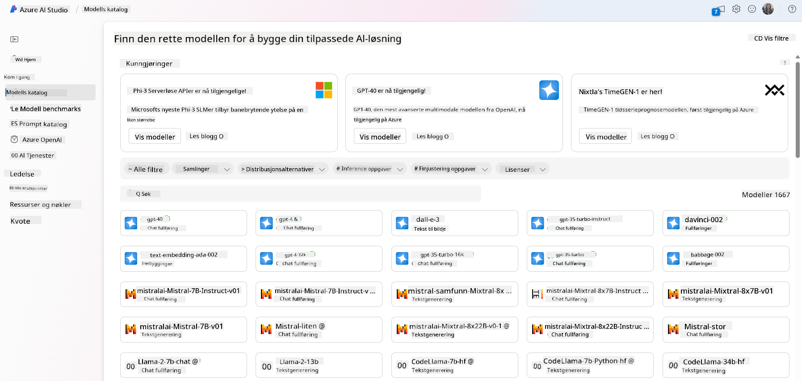

- Gjennomgå modellkortet, inkludert en detaljert beskrivelse av tiltenkt bruk og treningsdata, kodeeksempler og evalueringsresultater på det interne evalueringsbiblioteket.

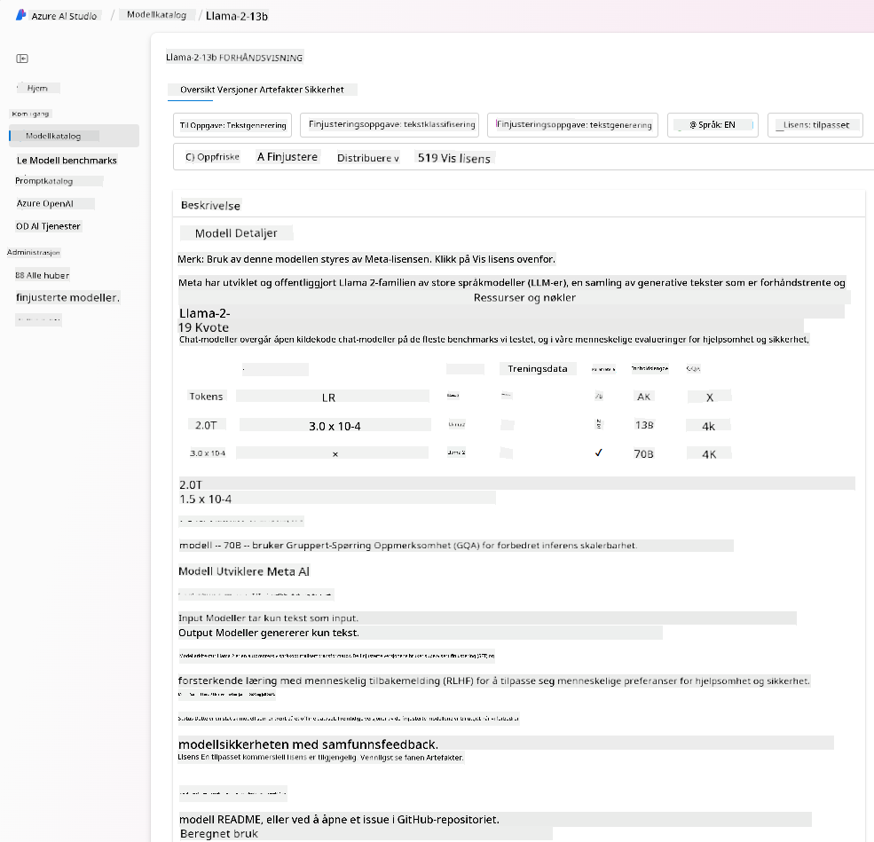
- Sammenlign referanser på tvers av modeller og datasett tilgjengelig i bransjen for å vurdere hvilken som oppfyller forretningsscenariet, gjennom [Model Benchmarks](https://learn.microsoft.com/azure/ai-studio/how-to/model-benchmarks?WT.mc_id=academic-105485-koreyst)-panelet.

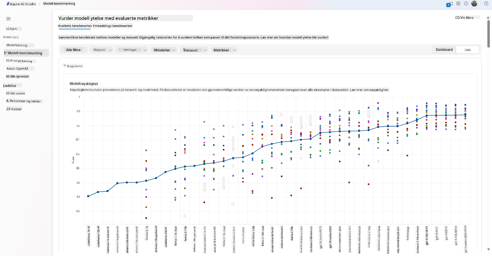

- Finjuster modellen på egendefinerte treningsdata for å forbedre modellens ytelse i en spesifikk arbeidsbelastning, ved å utnytte eksperimenterings- og sporingsfunksjonene i Azure AI Studio.

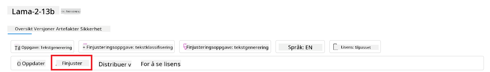

- Distribuer den originale forhåndstrente modellen eller den finjusterte versjonen til en ekstern sanntidsinference - administrert databehandling - eller serverløs API-endepunkt - [betal-etter-bruk](https://learn.microsoft.com/azure/ai-studio/how-to/model-catalog-overview#model-deployment-managed-compute-and-serverless-api-pay-as-you-go?WT.mc_id=academic-105485-koreyst) - for å gjøre det mulig for applikasjoner å bruke den.

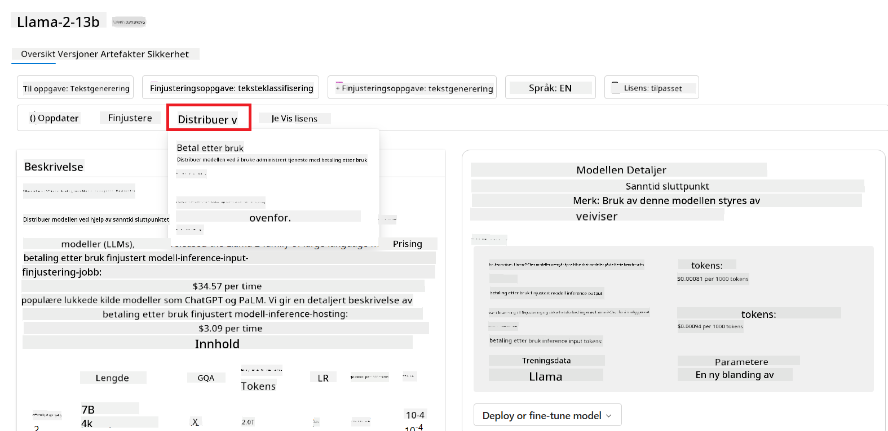

> [!NOTE]
> Ikke alle modeller i katalogen er for øyeblikket tilgjengelige for finjustering og/eller betal-etter-bruk-distribusjon. Sjekk modellkortet for detaljer om modellens evner og begrensninger.

## Forbedring av LLM-resultater

Vi har utforsket med vårt oppstartsteam ulike typer LLM-er og en skyplattform (Azure Machine Learning) som gjør det mulig for oss å sammenligne forskjellige modeller, evaluere dem på testdata, forbedre ytelsen og distribuere dem på inferensendepunkter.

Men når bør de vurdere å finjustere en modell i stedet for å bruke en forhåndstrent? Finnes det andre tilnærminger for å forbedre modellens ytelse på spesifikke arbeidsbelastninger?

Det er flere tilnærminger en bedrift kan bruke for å oppnå de resultatene de trenger fra en LLM. Du kan velge forskjellige typer modeller med ulik grad av trening når du distribuerer en LLM i produksjon, med forskjellige nivåer av kompleksitet, kostnad og kvalitet. Her er noen forskjellige tilnærminger:

- **Prompt engineering med kontekst**. Ideen er å gi nok kontekst når du ber om svar for å sikre at du får de svarene du trenger.

- **Retrieval Augmented Generation, RAG**. Dataene dine kan for eksempel eksistere i en database eller web-endepunkt. For å sikre at disse dataene, eller et underutvalg av dem, inkluderes ved forespørsel, kan du hente de relevante dataene og gjøre dem til en del av brukerens forespørsel.

- **Finjustert modell**. Her trener du modellen videre på dine egne data, noe som fører til at modellen blir mer nøyaktig og responsiv til dine behov, men det kan være kostbart.

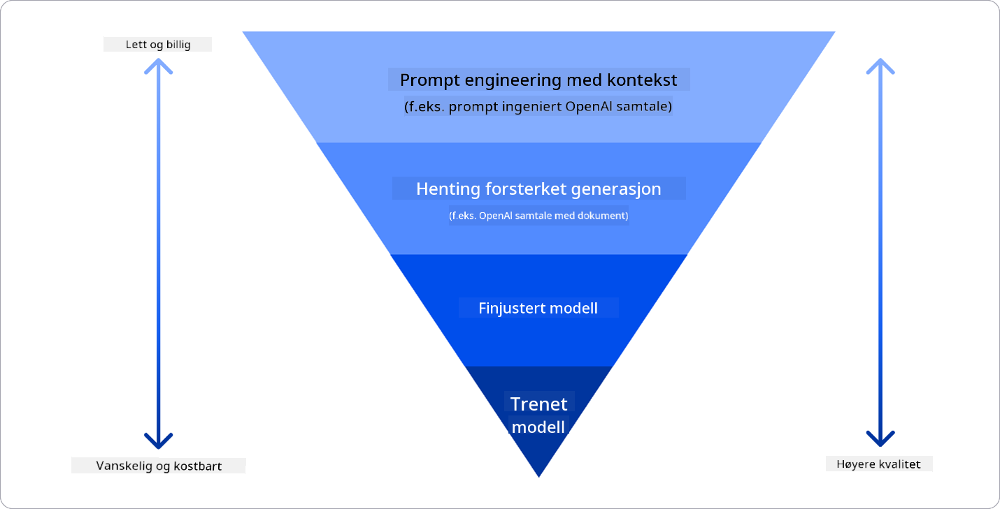

Bildekilde: [Fire måter som bedrifter distribuerer LLM-er | Fiddler AI Blog](https://www.fiddler.ai/blog/four-ways-that-enterprises-deploy-llms?WT.mc_id=academic-105485-koreyst)

### Prompt Engineering med Kontekst

Forhåndstrente LLM-er fungerer veldig bra på generelle naturlige språkopppgaver, selv ved å kalle dem med en kort forespørsel, som en setning som skal fullføres eller et spørsmål – det såkalte “zero-shot” læring.

Men jo mer brukeren kan ramme inn sin forespørsel, med en detaljert forespørsel og eksempler – Konteksten – jo mer nøyaktig og nærmere brukerens forventninger vil svaret være. I dette tilfellet snakker vi om “one-shot” læring hvis forespørselen kun inneholder ett eksempel og “few-shot” læring hvis det inkluderer flere eksempler. Prompt engineering med kontekst er den mest kostnadseffektive tilnærmingen å starte med.

### Retrieval Augmented Generation (RAG)

LLM-er har begrensningen at de kun kan bruke dataene som ble brukt under deres trening for å generere et svar. Dette betyr at de ikke vet noe om fakta som skjedde etter treningsprosessen, og de kan ikke få tilgang til ikke-offentlig informasjon (som bedriftsdata). Dette kan overvinnes gjennom RAG, en teknikk som utvider forespørselen med ekstern data i form av dokumentbiter, med tanke på forespørselens lengdebegrensninger. Dette støttes av verktøy for vektordatabase (som [Azure Vector Search](https://learn.microsoft.com/azure/search/vector-search-overview?WT.mc_id=academic-105485-koreyst)) som henter de nyttige bitene fra forskjellige forhåndsdefinerte datakilder og legger dem til forespørselens kontekst.

Denne teknikken er veldig nyttig når en bedrift ikke har nok data, nok tid eller ressurser til å finjustere en LLM, men fortsatt ønsker å forbedre ytelsen på en spesifikk arbeidsbelastning og redusere risikoen for fabrikasjoner, det vil si mystifisering av virkeligheten eller skadelig innhold.

### Finjustert modell

Finjustering er en prosess som utnytter overføringslæring for å 'tilpasse' modellen til en nedstrøms oppgave eller for å løse et spesifikt problem. I motsetning til få-skudd læring og RAG, resulterer det i en ny modell som blir generert, med oppdaterte vekter og skjevheter. Det krever et sett med trenings eksempler bestående av en enkelt input (forespørselen) og dens tilknyttede output (fullføringen). Dette ville være den foretrukne tilnærmingen hvis:

- **Bruke finjusterte modeller**. En bedrift ønsker å bruke finjusterte mindre kapable modeller (som innebyggingsmodeller) i stedet for høyytelsesmodeller, noe som resulterer i en mer kostnadseffektiv og rask løsning.

- **Vurdere latens**. Latens er viktig for en spesifikk brukstilfelle, så det er ikke mulig å bruke veldig lange forespørsler eller antallet eksempler som bør læres fra modellen passer ikke med forespørselens lengdebegrensning.

- **Holde seg oppdatert**. En bedrift har mye høy kvalitetsdata og sannhets etiketter og ressursene som kreves for å opprettholde denne dataen oppdatert over tid.

### Trenet modell

Å trene en LLM fra bunnen av er uten tvil den mest krevende og den mest komplekse tilnærmingen å adoptere, og krever massive mengder data, dyktige ressurser og passende datakraft. Dette alternativet bør vurderes bare i et scenario hvor en bedrift har et domene-spesifikt brukstilfelle og en stor mengde domene-sentrert data.

## Kunnskapssjekk

Hva kan være en god tilnærming for å forbedre LLM fullføringsresultater?

1. Prompt engineering med kontekst
1. RAG
1. Finjustert modell

A:3, hvis du har tid og ressurser og høykvalitetsdata, er finjustering det bedre alternativet for å holde seg oppdatert. Men hvis du ser på å forbedre ting og du mangler tid, er det verdt å vurdere RAG først.

## 🚀 Utfordring

Les mer om hvordan du kan [bruke RAG](https://learn.microsoft.com/azure/search/retrieval-augmented-generation-overview?WT.mc_id=academic-105485-koreyst) for din bedrift.

## Flott arbeid, fortsett din læring

Etter å ha fullført denne leksjonen, sjekk ut vår [Generativ AI Læringssamling](https://aka.ms/genai-collection?WT.mc_id=academic-105485-koreyst) for å fortsette å forbedre din kunnskap om Generativ AI!

Gå videre til Leksjon 3 hvor vi vil se på hvordan vi kan [bygge med Generativ AI Ansvarlig](../03-using-generative-ai-responsibly/README.md?WT.mc_id=academic-105485-koreyst)!

**Ansvarsfraskrivelse**:  
Dette dokumentet er oversatt ved hjelp av AI-oversettelsestjenesten [Co-op Translator](https://github.com/Azure/co-op-translator). Selv om vi streber etter nøyaktighet, vær oppmerksom på at automatiserte oversettelser kan inneholde feil eller unøyaktigheter. Det originale dokumentet på sitt opprinnelige språk bør betraktes som den autoritative kilden. For kritisk informasjon anbefales profesjonell menneskelig oversettelse. Vi er ikke ansvarlige for eventuelle misforståelser eller feiltolkninger som oppstår ved bruk av denne oversettelsen.