# Utforske og sammenligne forskjellige LLM-er

[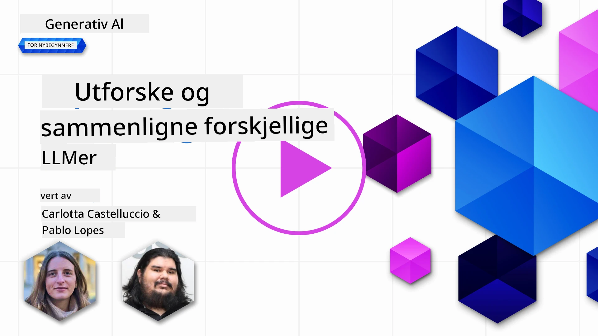](https://youtu.be/KIRUeDKscfI?si=8BHX1zvwzQBn-PlK)

> _Klikk på bildet over for å se video av denne leksjonen_

Med forrige leksjon har vi sett hvordan Generativ AI endrer teknologilandskapet, hvordan store språkmodeller (LLM-er) fungerer og hvordan en bedrift – som vår oppstartsbedrift – kan anvende dem til sine brukstilfeller og vokse! I dette kapittelet skal vi sammenligne og kontrastere forskjellige typer store språkmodeller (LLM-er) for å forstå deres fordeler og ulemper.

Neste steg i vår oppstartsreise er å utforske det gjeldende landskapet for LLM-er og forstå hvilke som passer til vårt brukstilfelle.

## Introduksjon

Denne leksjonen vil dekke:

- Ulike typer LLM-er i dagens landskap.
- Testing, iterasjon og sammenligning av forskjellige modeller for ditt brukstilfelle i Azure.
- Hvordan distribuere en LLM.

## Læringsmål

Etter å ha fullført denne leksjonen vil du kunne:

- Velge riktig modell for ditt brukstilfelle.
- Forstå hvordan man tester, itererer og forbedrer ytelsen til modellen din.
- Vite hvordan bedrifter distribuerer modeller.

## Forstå forskjellige typer LLM-er

LLM-er kan kategoriseres på flere måter basert på arkitektur, treningsdata og brukstilfelle. Å forstå disse forskjellene vil hjelpe vår oppstartsbedrift å velge riktig modell for scenariet, og forstå hvordan man tester, itererer og forbedrer ytelse.

Det finnes mange forskjellige typer LLM-modeller, valget ditt av modell avhenger av hva du har til hensikt å bruke dem til, dine data, hvor mye du er villig til å betale, og mer.

Avhengig av om du har til hensikt å bruke modellene til tekst, lyd, video, bildegenerering og så videre, kan du velge en annen type modell.

- **Lyd- og talegjenkjenning**. Whisper-lignende modeller er fortsatt nyttige som allmenn talegjenkjenningsmodeller, men produksjonsvalg inkluderer nå også nyere tale-til-tekst-modeller som `gpt-4o-transcribe`, `gpt-4o-mini-transcribe` og diariseringsvarianter. Vurder språkdækning, diariseringsstøtte, sanntidsstøtte, latens og kostnad for ditt scenario. Lær mer i [OpenAI tale-til-tekst-dokumentasjonen](https://platform.openai.com/docs/guides/speech-to-text?WT.mc_id=academic-105485-koreyst).

- **Bildegenerering**. DALL-E og Midjourney er kjente alternativer for bildegenerering, men nåværende OpenAI bildegenererings-APIer fokuserer på GPT Image-modeller som `gpt-image-2`, mens Stable Diffusion, Imagen, Flux og andre modellfamilier også er vanlige valg. Sammenlign promptoverholdelse, redigeringsstøtte, stilkontroll, sikkerhetskrav og lisensiering. Lær mer i [OpenAI bildegenereringsguide](https://platform.openai.com/docs/guides/images?WT.mc_id=academic-105485-koreyst) og kapittel 9 i dette læreplanen.

- **Tekstgenerering**. Tekstmodeller spenner nå fra grenseløsende modeller, resonnementmodeller, mindre lavlatensmodeller og åpne modeller. Nåværende eksempler inkluderer OpenAI GPT-5.x-modeller, Anthropic Claude 4.x-modeller, Google Gemini 3.x-modeller, Meta Llama 4-modeller og Mistral-modeller. Velg ikke bare basert på utgivelsesdato eller pris; sammenlign oppgavekvalitet, latens, kontekstvindu, verktøybruk, sikkerhetsatferd, regional tilgjengelighet og totalkostnad. [Microsoft Foundry model catalog](https://ai.azure.com/catalog?WT.mc_id=academic-105485-koreyst) er et godt sted å sammenligne modeller tilgjengelig på Azure.

- **Multimodalitet**. Mange av dagens modeller kan behandle mer enn tekst. Noen tar imot bilde-, lyd- eller videoinput; noen kan kalle verktøy; og spesialiserte modeller kan generere bilder, lyd eller video. For eksempel støtter nåværende OpenAI-modeller tekst- og bildeinput, Gemini-modeller kan støtte tekst, kode, bilde, lyd og videoinput avhengig av variant, og Llama 4 Scout og Maverick er åpne multimodale modeller. Sjekk alltid hver modellkort for støttede input- og outputmodaliteter før du bygger en arbeidsflyt rundt den.

Å velge en modell betyr at du får noen grunnleggende egenskaper, men de kan ofte ikke være nok. Ofte har man bedrifts-spesifikke data som man på en eller annen måte må fortelle LLM-en om. Det finnes noen forskjellige tilnærminger til dette, mer om det i kommende seksjoner.

### Foundation Models versus LLM-er

Begrepet Foundation Model ble [myntet av forskere ved Stanford](https://arxiv.org/abs/2108.07258?WT.mc_id=academic-105485-koreyst) og definert som en AI-modell som følger visse kriterier, som for eksempel:

- **De er trent med usupervisert læring eller selv-supervisert læring**, som betyr at de trenes på etikettløse multimodale data, og de krever ikke menneskelig annotering eller merking av data for treningsprosessen.
- **De er svært store modeller**, basert på svært dype nevrale nettverk trent på milliarder av parametere.
- **De er normalt ment å fungere som en ‘foundation’ for andre modeller**, hvilket betyr at de kan brukes som utgangspunkt for andre modeller som bygges på toppen, ved hjelp av finjustering.

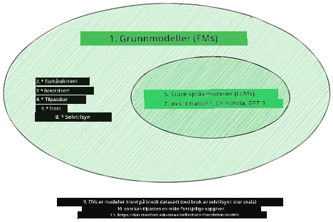

Bildet kilde: [Essential Guide to Foundation Models and Large Language Models | av Babar M Bhatti | Medium
](https://thebabar.medium.com/essential-guide-to-foundation-models-and-large-language-models-27dab58f7404)

For å klargjøre denne forskjellen ytterligere kan vi ta ChatGPT som et historisk eksempel. Tidlige versjoner av ChatGPT brukte GPT-3.5 som en foundation-modell. OpenAI brukte deretter chat-spesifikke data og justeringsteknikker for å lage en finjustert versjon som presterte bedre i konversasjonelle scenarier, for eksempel chatbotter. Moderne AI-tjenester ruter ofte mellom flere modellvarianter, så tjenestenavnet og den underliggende modellnavnet er ikke alltid det samme.

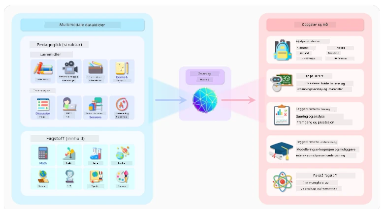

Bildet kilde: [2108.07258.pdf (arxiv.org)](https://arxiv.org/pdf/2108.07258.pdf?WT.mc_id=academic-105485-koreyst)

### Open-Weight/Open-Source versus Proprietære modeller

En annen måte å kategorisere LLM-er på er hvorvidt de er åpne i vekt, åpen kildekode, eller proprietære.

Åpen kildekode og åpne vekt-modeller gjør modellartefakter tilgjengelige for inspeksjon, nedlasting eller tilpasning, men deres lisenser varierer. Noen er helt åpne kildekode, mens andre er åpne vekt-modeller med bruksrestriksjoner. De kan være nyttige når en bedrift trenger mer kontroll over distribusjon, datalokalitet, kostnad eller tilpasning. Men team må fortsatt gjennomgå lisensbetingelser, serverkostnader, vedlikehold, sikkerhetsoppdateringer og evalueringskvalitet før produksjonsbruk. Eksempler inkluderer [Meta Llama 4](https://ai.meta.com/blog/llama-4-multimodal-intelligence/?WT.mc_id=academic-105485-koreyst), noen [Mistral-modeller](https://docs.mistral.ai/models/overview?WT.mc_id=academic-105485-koreyst) og mange modeller hostet på [Hugging Face](https://huggingface.co/models?WT.mc_id=academic-105485-koreyst).

Proprietære modeller eies og hostes av en leverandør. Disse modellene er ofte optimalisert for administrert produksjonsbruk og kan tilby sterk støtte, sikkerhetssystemer, verktøyintegrasjon og skalerbarhet. Likevel kan ikke kunder vanligvis inspisere eller modifisere modellvektene, og de må gjennomgå leverandørbetingelser for personvern, lagring, samsvar og akseptabel bruk. Eksempler inkluderer [OpenAI-modeller](https://platform.openai.com/docs/models?WT.mc_id=academic-105485-koreyst), [Google Gemini](https://deepmind.google/models/gemini/pro/?WT.mc_id=academic-105485-koreyst) og [Anthropic Claude](https://platform.claude.com/docs/en/about-claude/models/overview?WT.mc_id=academic-105485-koreyst).

### Embedding versus bildegenerering versus tekst- og kodegenerering

LLM-er kan også kategoriseres ut fra hvilken output de genererer.

Embeddings er en type modeller som kan konvertere tekst til et numerisk format, kalt embedding, som er en numerisk representasjon av input-teksten. Embeddings gjør det enklere for maskiner å forstå relasjoner mellom ord eller setninger og kan brukes som input for andre modeller, som klassifiseringsmodeller eller klynge-modeller som har bedre ytelse med numeriske data. Embedding-modeller brukes ofte for transfer learning, der en modell bygges for en surrogatoppgave med mye data, og modellvektene (embeddingene) deretter gjenbrukes for andre nedstrøms oppgaver. Et eksempel på denne kategorien er [OpenAI embeddings](https://platform.openai.com/docs/models/embeddings?WT.mc_id=academic-105485-koreyst).

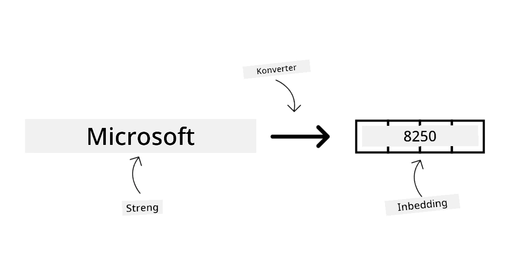

Bildegenereringsmodeller er modeller som genererer bilder. Disse modellene brukes ofte til bilde-redigering, bildegenerering og bildetransformasjon. Bildegenereringsmodeller trenes ofte på store bildedatasett, som [LAION-5B](https://laion.ai/blog/laion-5b/?WT.mc_id=academic-105485-koreyst), og kan brukes til å generere nye bilder eller redigere eksisterende bilder med teknikker som inpainting, superoppløsning og fargelegging. Eksempler inkluderer [GPT Image-modeller](https://platform.openai.com/docs/guides/images?WT.mc_id=academic-105485-koreyst), [Stable Diffusion-modeller](https://github.com/Stability-AI/StableDiffusion?WT.mc_id=academic-105485-koreyst) og Imagen-modeller.

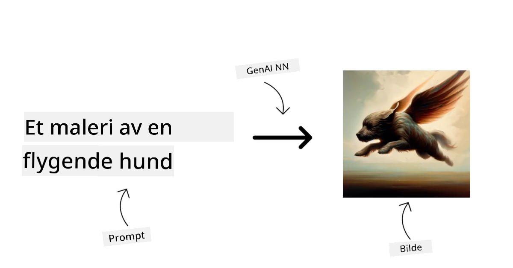

Tekst- og kodegenereringsmodeller er modeller som genererer tekst eller kode. Disse modellene brukes ofte til tekstsummering, oversettelse og spørsmål og svar. Tekstgenereringsmodeller trenes ofte på store tekstdatasett, som [BookCorpus](https://www.cv-foundation.org/openaccess/content_iccv_2015/html/Zhu_Aligning_Books_and_ICCV_2015_paper.html?WT.mc_id=academic-105485-koreyst), og kan brukes til å generere ny tekst eller svare på spørsmål. Kodegenereringsmodeller, som [CodeParrot](https://huggingface.co/codeparrot?WT.mc_id=academic-105485-koreyst), trenes ofte på store kodedatasett, som GitHub, og kan brukes til å generere ny kode eller fikse feil i eksisterende kode.

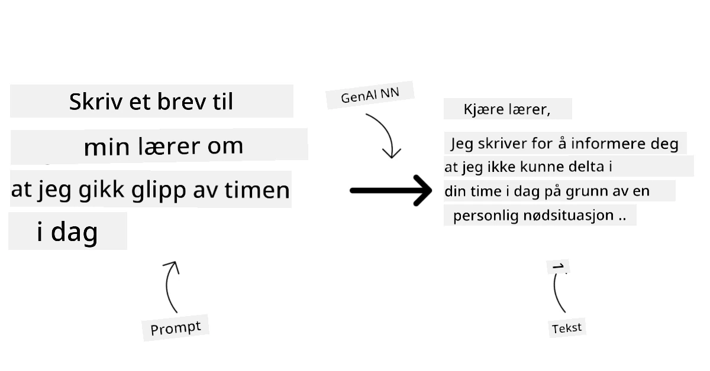

### Encoder-Decoder versus kun Decoder

For å snakke om forskjellige arkitekturtyper for LLM-er, la oss bruke en analogi.

Forestill deg at lederen din ga deg en oppgave om å lage en quiz for studentene. Du har to kollegaer; en som lager innholdet og en som gjennomgår det.

Innholdsskaperen er som en bare dekoder-modell: de kan se på temaet, se hva du allerede har skrevet, og deretter fortsette å generere innhold basert på den konteksten. De er veldig gode til å skrive engasjerende og informativt innhold, men er ikke alltid det beste valget når oppgaven bare er å klassifisere, hente eller kode informasjon. Eksempler på bare dekoder-modellfamilier er GPT og Llama-modeller.

Gjennomgangspersonen er som en bare encoder-modell, de ser på det skrevne kurset og svarene, legger merke til forholdet mellom dem og forstår kontekst, men de er ikke gode til å generere innhold. Et eksempel på bare encoder-modell er BERT.

Forestill deg at vi kan ha noen som både kan lage og gjennomgå quizen, dette er en encoder-decoder-modell. Noen eksempler er BART og T5.

### Tjeneste versus Modell

Nå, la oss snakke om forskjellen mellom en tjeneste og en modell. En tjeneste er et produkt som tilbys av en skytilbyder, og er ofte en kombinasjon av modeller, data og andre komponenter. En modell er kjernekomponenten i en tjeneste, og er ofte en foundation-modell, som en LLM.

Tjenester er ofte optimalisert for produksjonsbruk og er ofte enklere å bruke enn modeller, via et grafisk brukergrensesnitt. Imidlertid er tjenester ikke alltid gratis, og kan kreve abonnement eller betaling, i bytte mot å bruke tjenesteeierens utstyr og ressurser, optimalisere utgifter og skalering. Et eksempel på en tjeneste er [Azure OpenAI Service](https://learn.microsoft.com/azure/ai-foundry/openai/overview?WT.mc_id=academic-105485-koreyst), som tilbyr en betalingsplan etter bruk, noe som betyr at brukere blir belastet proporsjonalt med hvor mye de bruker tjenesten. Azure OpenAI Service tilbyr også bedriftsnivåsikkerhet og et rammeverk for ansvarlig AI i tillegg til modellens kapasiteter.

Modeller er de nevrale nettverksartefaktene: parametere, vekter, arkitektur, tokenizer og støttende konfigurasjon. Å kjøre en modell lokalt eller i et privat miljø krever egnet maskinvare, serverinfrastruktur, overvåking og enten kompatibel åpen kildekode/åpen vekt-lisens eller en kommersiell lisens. Åpne vekt-modeller som Llama 4 eller Mistral-modeller kan hostes selv, men de krever fortsatt beregningskraft og operasjonell ekspertise.

## Hvordan teste og iterere med forskjellige modeller for å forstå ytelse på Azure

Når teamet vårt har utforsket det nåværende landskapet for LLM-er og identifisert noen gode kandidater for deres scenarier, er neste steg å teste dem på deres data og arbeidsmengde. Dette er en iterativ prosess, utført gjennom eksperimenter og målinger.
De fleste modellene vi nevnte i tidligere avsnitt (OpenAI-modeller, åpne vektmodeller som Llama 4 og Mistral, og Hugging Face-modeller) er tilgjengelige i [Microsoft Foundry Models](https://learn.microsoft.com/azure/foundry/concepts/foundry-models-overview?WT.mc_id=academic-105485-koreyst).

[Microsoft Foundry](https://learn.microsoft.com/azure/foundry/what-is-foundry?WT.mc_id=academic-105485-koreyst), tidligere Azure AI Studio/Azure AI Foundry, er en enhetlig Azure-plattform for å bygge AI-apper og agenter. Den hjelper utviklere å administrere livssyklusen fra eksperimentering og evaluering til distribusjon, overvåking og styring. Modellkatalogen i Microsoft Foundry gjør det mulig for brukeren å:

- Finne grunnlagsmodellen av interesse i katalogen, inkludert modeller solgt av Azure og modeller fra partnere og fellesskapsleverandører. Brukere kan filtrere etter oppgave, leverandør, lisens, distribusjonsalternativ eller navn.

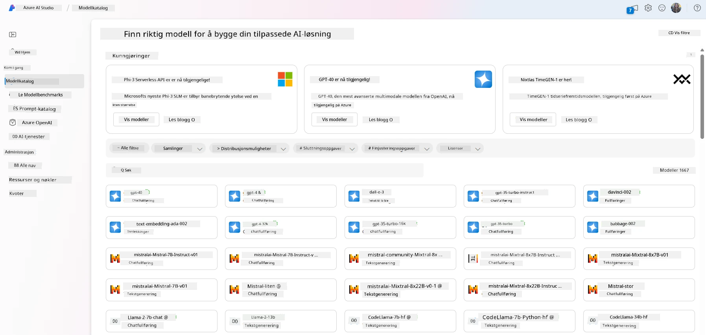

- Gå gjennom modellkortet, inkludert en detaljert beskrivelse av tiltenkt bruk og treningsdata, kodesnutter og evalueringsresultater i det interne evalueringsbiblioteket.

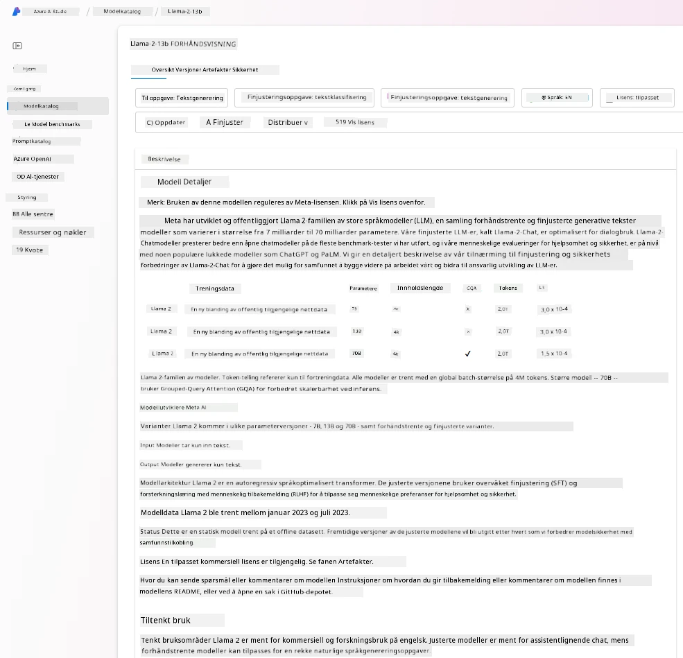

- Sammenligne benchmark på tvers av modeller og datasett tilgjengelig i industrien for å vurdere hvilken som møter forretningsscenariet, gjennom [Model Benchmarks](https://learn.microsoft.com/azure/ai-foundry/concepts/model-benchmarks?WT.mc_id=academic-105485-koreyst)-panelet.

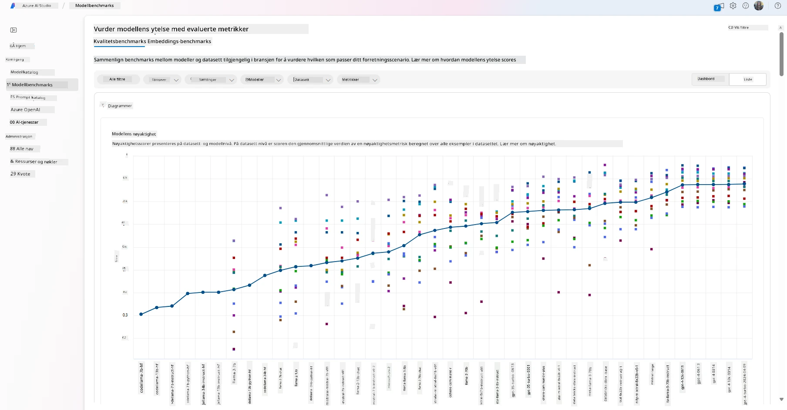

- Finjustere støttede modeller på egendata for å forbedre modellens ytelse i en spesifikk arbeidsmengde, ved å utnytte eksperimenterings- og sporingsmulighetene i Microsoft Foundry.

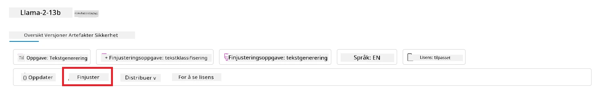

- Distribuere den originale forhåndstrente modellen eller den fintilpassede versjonen til et eksternt sanntids inferensendepunkt, ved bruk av administrerte databehandlings- eller serverløse distribusjonsmuligheter, for å gjøre det mulig for applikasjoner å konsumere den.

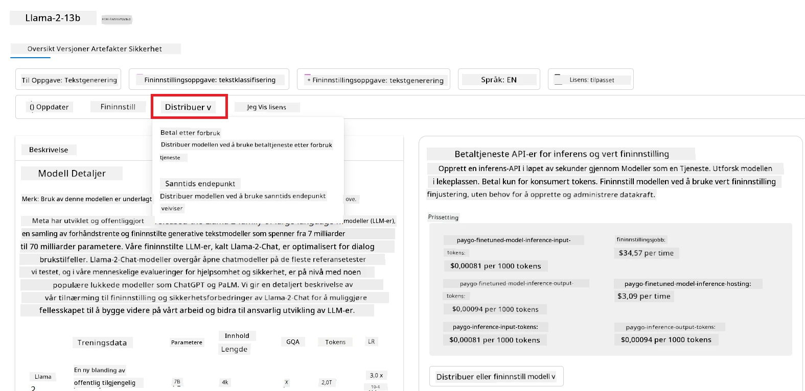

> [!NOTE]
> Ikke alle modellene i katalogen er for øyeblikket tilgjengelige for finjustering og/eller betaling-etter-bruk-distribusjon. Sjekk modellkortet for detaljer om modellens kapasiteter og begrensninger.

## Forbedring av LLM-resultater

Vi har utforsket med oppstartsteamet vårt forskjellige typer LLM-er og en skyplattform (Microsoft Foundry) som gjør det mulig å sammenligne forskjellige modeller, evaluere dem på testdata, forbedre ytelsen og distribuere dem på inferensendepunkter.

Men når bør de vurdere å finjustere en modell i stedet for å bruke en forhåndstrent modell? Finnes det andre tilnærminger for å forbedre modellens ytelse på spesifikke arbeidsmengder?

Det finnes flere tilnærminger en virksomhet kan bruke for å få de resultatene de trenger fra en LLM. Du kan velge forskjellige typer modeller med ulik grad av trening når du distribuerer en LLM i produksjon, med ulike nivåer av kompleksitet, kostnad og kvalitet. Her er noen forskjellige tilnærminger:

- **Prompt engineering med kontekst**. Ideen er å gi nok kontekst når du promptet for å sikre at du får de svarene du trenger.

- **Retrieval Augmented Generation, RAG**. Dataene dine kan for eksempel eksistere i en database eller et webendepunkt, for å sikre at disse dataene, eller et delsett av dem, inkluderes ved tidspunktet for prompting kan du hente ut de relevante dataene og gjøre dem til en del av brukerens prompt.

- **Fintunet modell**. Her har du trent modellen videre på dine egne data, noe som førte til at modellen blir mer presis og responsiv på dine behov, men som kan være kostbart.

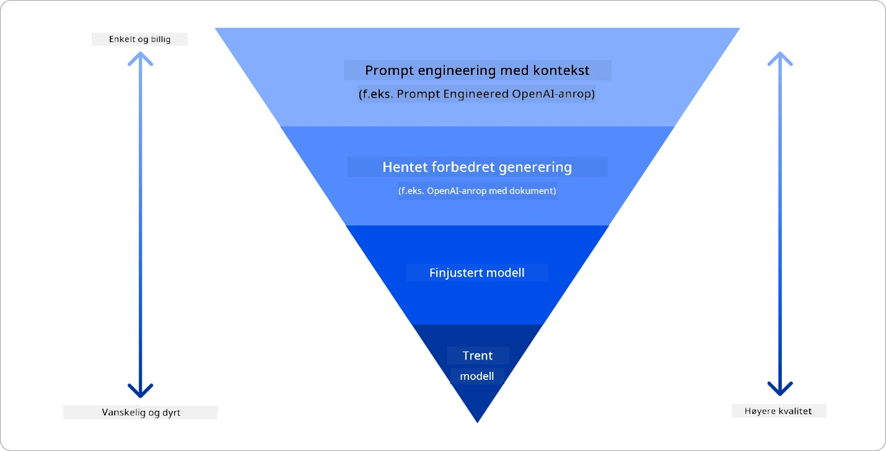

Bildets kilde: [Four Ways that Enterprises Deploy LLMs | Fiddler AI Blog](https://www.fiddler.ai/blog/four-ways-that-enterprises-deploy-llms?WT.mc_id=academic-105485-koreyst)

### Prompt Engineering med Kontekst

Forhåndstrente LLM-er fungerer veldig bra på generaliserte naturlige språkoppgaver, selv ved å kalle dem med en kort prompt, som en setning å fullføre eller et spørsmål – den såkalte «zero-shot»-læringen.

Jo mer brukeren kan ramme inn forespørselen sin, med en detaljert forespørsel og eksempler – Konteksten – desto mer nøyaktig og nær svarene vil være brukerens forventninger. Her snakker vi om «one-shot»-læring hvis prompten inneholder bare ett eksempel, og «few shot»-læring hvis den inkluderer flere eksempler.
Prompt engineering med kontekst er den mest kostnadseffektive tilnærmingen å starte med.

### Retrieval Augmented Generation (RAG)

LLM-er har begrensningen at de kun kan bruke data som har blitt brukt under treningen deres for å generere et svar. Det betyr at de ikke vet noe om fakta som har skjedd etter treningsprosessen, og de kan ikke få tilgang til ikke-offentlig informasjon (som selskapsdata).
Dette kan overvinnes gjennom RAG, en teknikk som utvider prompten med eksterne data i form av biter av dokumenter, med tanke på begrensninger i promptlengde. Dette støttes av vektor-databaseverktøy (som [Azure Vector Search](https://learn.microsoft.com/azure/search/vector-search-overview?WT.mc_id=academic-105485-koreyst)) som henter de nyttige bitene fra varierte forhåndsdefinerte datakilder og legger dem til promptens kontekst.

Denne teknikken er veldig nyttig når en virksomhet ikke har nok data, nok tid, eller ressurser til å finjustere en LLM, men fortsatt ønsker å forbedre ytelsen på en spesifikk arbeidsmengde og redusere risikoen for hallusinerte, utdaterte eller ugyldige svar.

### Fintunet modell

Finjustering er en prosess som utnytter transferlæring for å ‘tilpasse’ modellen til en nedstrømsoppgave eller for å løse et spesifikt problem. I motsetning til few-shot-læring og RAG, resulterer det i at en ny modell genereres, med oppdaterte vekter og biaser. Det krever et sett med trenings-eksempler som består av en enkelt input (prompten) og dens tilknyttede output (fullføringen).
Dette vil være den foretrukne tilnærmingen hvis:

- **Bruke mindre oppgavespesifikke modeller**. En bedrift ønsker å finjustere en mindre modell for en spesifikk oppgave i stedet for gjentatte ganger å be en større grensemodell om svar, noe som resulterer i en mer kostnadseffektiv og raskere løsning.

- **Ta hensyn til latenstid**. Latenstid er viktig for en spesifikk brukssak, så det er ikke mulig å bruke veldig lange prompts, eller antallet eksempler som modellen skal lære fra passer ikke med promptlengdebegrensningen.

- **Tilpasse stabil oppførsel**. En virksomhet har mange høykvalitets eksempler og ønsker at modellen konsekvent skal følge et oppgaveskjema, utdataformat, tone eller domene-spesifikk stil. Hvis hovedproblemet er ferske fakta eller privat kunnskap som endres ofte, bruk RAG i stedet for å stole kun på finjustering.

### Trent modell

Å trene en LLM helt fra bunnen av er uten tvil den vanskeligste og mest komplekse tilnærmingen å ta, og krever enorme mengder data, dyktige ressurser og egnet datakraft. Dette alternativet bør kun vurderes i et scenario der en virksomhet har en domene-spesifikk brukssak og en stor mengde domene-sentrerte data.

## Kunnskapssjekk

Hva kan være en god tilnærming for å forbedre LLM-fullføringsresultater?

1. Prompt engineering med kontekst
1. RAG
1. Fintunet modell

A: Alle tre kan hjelpe. Start med prompt engineering og kontekst for raske forbedringer, og bruk RAG når modellen trenger oppdaterte fakta eller privat bedriftsdata. Velg finjustering når du har nok høykvalitets eksempler og trenger at modellen konsekvent følger en oppgave, format, tone eller domenemønster.

## 🚀 Utfordring

Les mer om hvordan du kan [bruke RAG](https://learn.microsoft.com/azure/search/retrieval-augmented-generation-overview?WT.mc_id=academic-105485-koreyst) for din virksomhet.

## Flott arbeid, fortsett læringen din

Etter å ha fullført denne leksjonen, ta en kikk på vår [Generative AI Learning collection](https://aka.ms/genai-collection?WT.mc_id=academic-105485-koreyst) for å fortsette å øke din kunnskap om Generativ AI!

Gå videre til Leksjon 3 hvor vi skal se på hvordan du kan [bygge med Generativ AI på en ansvarlig måte](../03-using-generative-ai-responsibly/README.md?WT.mc_id=academic-105485-koreyst)!

---

<!-- CO-OP TRANSLATOR DISCLAIMER START -->
**Ansvarsfraskrivelse**:
Dette dokumentet er oversatt ved hjelp av AI-oversettelsestjenesten [Co-op Translator](https://github.com/Azure/co-op-translator). Selv om vi streber etter nøyaktighet, vær oppmerksom på at automatiske oversettelser kan inneholde feil eller unøyaktigheter. Det opprinnelige dokumentet på originalspråket skal betraktes som den autoritative kilden. For kritisk informasjon anbefales profesjonell menneskelig oversettelse. Vi er ikke ansvarlige for eventuelle misforståelser eller feiltolkninger som oppstår ved bruk av denne oversettelsen.
<!-- CO-OP TRANSLATOR DISCLAIMER END -->