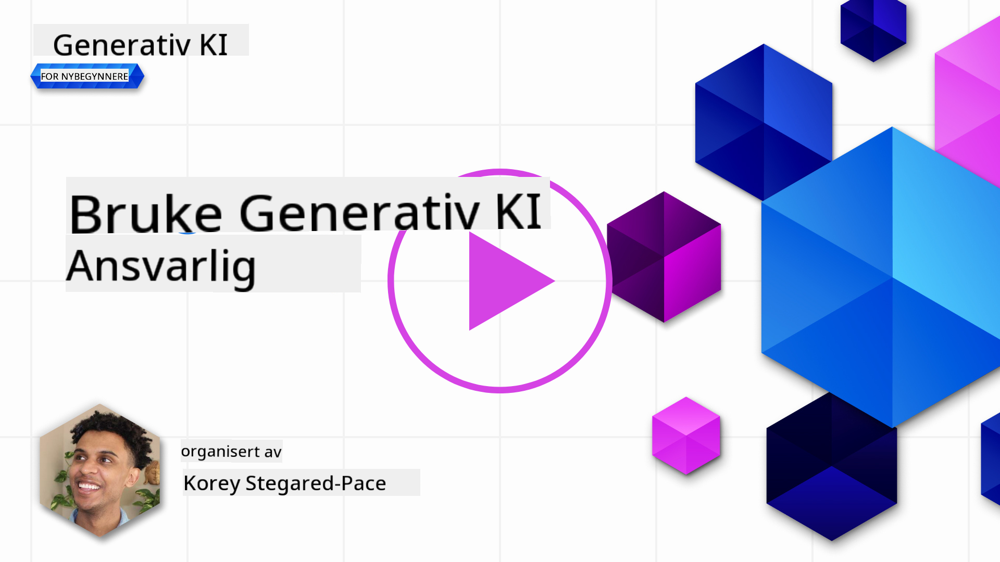
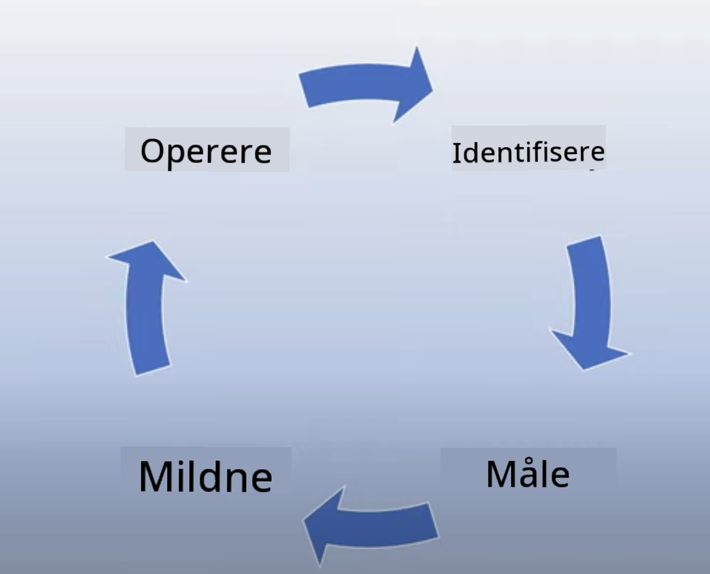
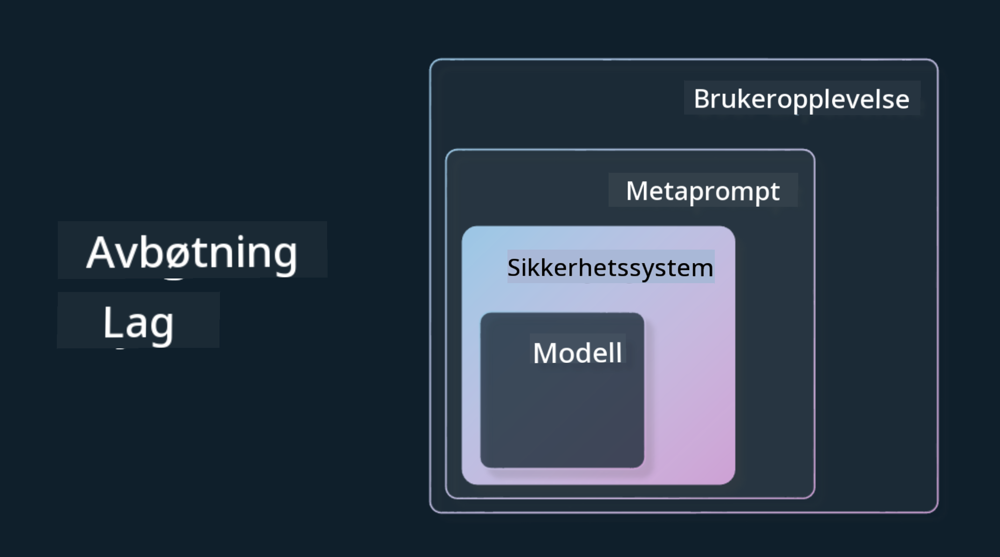

<!--
CO_OP_TRANSLATOR_METADATA:
{
  "original_hash": "7f8f4c11f8c1cb6e1794442dead414ea",
  "translation_date": "2025-07-09T08:58:01+00:00",
  "source_file": "03-using-generative-ai-responsibly/README.md",
  "language_code": "no"
}
-->
# Bruke Generativ AI Ansvarlig

> _Klikk på bildet over for å se videoen til denne leksjonen_

Det er lett å bli fascinert av AI, og spesielt generativ AI, men du må tenke på hvordan du bruker det på en ansvarlig måte. Du må vurdere ting som hvordan sikre at resultatene er rettferdige, ikke skadelige og mer. Dette kapitlet har som mål å gi deg den nødvendige konteksten, hva du bør tenke på, og hvordan du kan ta aktive steg for å forbedre bruken av AI.

## Introduksjon

Denne leksjonen vil dekke:

- Hvorfor du bør prioritere Ansvarlig AI når du bygger generative AI-applikasjoner.
- Kjerneprinsippene for Ansvarlig AI og hvordan de relaterer seg til generativ AI.
- Hvordan sette disse prinsippene for Ansvarlig AI ut i praksis gjennom strategi og verktøy.

## Læringsmål

Etter å ha fullført denne leksjonen vil du vite:

- Hvor viktig Ansvarlig AI er når du bygger generative AI-applikasjoner.
- Når du bør tenke på og anvende kjerneprinsippene for Ansvarlig AI i utviklingen av generative AI-applikasjoner.
- Hvilke verktøy og strategier som er tilgjengelige for å sette konseptet Ansvarlig AI ut i praksis.

## Prinsipper for Ansvarlig AI

Spenningsnivået rundt generativ AI har aldri vært høyere. Denne entusiasmen har tiltrukket mange nye utviklere, oppmerksomhet og finansiering til dette feltet. Selv om dette er veldig positivt for alle som ønsker å bygge produkter og selskaper med generativ AI, er det også viktig at vi går frem på en ansvarlig måte.

Gjennom dette kurset fokuserer vi på å bygge vår startup og vårt AI-utdanningsprodukt. Vi vil bruke prinsippene for Ansvarlig AI: Rettferdighet, Inkludering, Pålitelighet/Sikkerhet, Sikkerhet & Personvern, Åpenhet og Ansvarlighet. Med disse prinsippene vil vi utforske hvordan de relaterer seg til vår bruk av generativ AI i produktene våre.

## Hvorfor bør du prioritere Ansvarlig AI

Når du bygger et produkt, gir en menneskesentrert tilnærming med brukerens beste i tankene de beste resultatene.

Det unike med generativ AI er dens evne til å skape nyttige svar, informasjon, veiledning og innhold for brukerne. Dette kan gjøres uten mange manuelle steg, noe som kan gi svært imponerende resultater. Uten riktig planlegging og strategier kan det dessverre også føre til skadelige resultater for brukerne dine, produktet ditt og samfunnet som helhet.

La oss se på noen (men ikke alle) av disse potensielt skadelige resultatene:

### Hallusinasjoner

Hallusinasjoner er et begrep som brukes for å beskrive når en LLM produserer innhold som enten er helt meningsløst eller noe vi vet er faktuelt feil basert på andre informasjonskilder.

La oss for eksempel si at vi bygger en funksjon for vår startup som lar studenter stille historiske spørsmål til en modell. En student spør: `Hvem var den eneste overlevende fra Titanic?`

Modellen gir et svar som dette:

> _(Kilde: [Flying bisons](https://flyingbisons.com?WT.mc_id=academic-105485-koreyst))_

Dette er et veldig selvsikkert og grundig svar. Dessverre er det feil. Selv med en minimal mengde research ville man oppdaget at det var mer enn én overlevende fra Titanic-ulykken. For en student som nettopp har begynt å undersøke dette emnet, kan dette svaret være overbevisende nok til at det ikke blir stilt spørsmål ved og behandlet som fakta. Konsekvensene av dette kan føre til at AI-systemet oppfattes som upålitelig og skade omdømmet til vår startup.

Med hver iterasjon av en gitt LLM har vi sett forbedringer i å minimere hallusinasjoner. Selv med denne forbedringen må vi som applikasjonsutviklere og brukere fortsatt være bevisste på disse begrensningene.

### Skadelig innhold

Vi dekket i forrige seksjon når en LLM produserer feilaktige eller meningsløse svar. En annen risiko vi må være oppmerksomme på, er når en modell svarer med skadelig innhold.

Skadelig innhold kan defineres som:

- Å gi instruksjoner eller oppfordre til selvskading eller skade mot visse grupper.
- Hatefulle eller nedsettende ytringer.
- Veiledning i planlegging av angrep eller voldshandlinger.
- Instruksjoner om hvordan man finner ulovlig innhold eller begår ulovlige handlinger.
- Vise seksuelt eksplisitt innhold.

For vår startup ønsker vi å sikre at vi har riktige verktøy og strategier på plass for å forhindre at denne typen innhold blir sett av studentene.

### Mangel på rettferdighet

Rettferdighet defineres som «å sikre at et AI-system er fritt for skjevheter og diskriminering, og at det behandler alle rettferdig og likt.» I generativ AI-verdenen ønsker vi å sikre at ekskluderende verdenssyn på marginaliserte grupper ikke forsterkes av modellens output.

Denne typen output er ikke bare ødeleggende for å bygge positive produktopplevelser for brukerne våre, men de forårsaker også ytterligere skade på samfunnet. Som applikasjonsutviklere bør vi alltid ha et bredt og mangfoldig brukergrunnlag i tankene når vi bygger løsninger med generativ AI.

## Hvordan bruke generativ AI ansvarlig

Nå som vi har identifisert viktigheten av Ansvarlig Generativ AI, la oss se på 4 steg vi kan ta for å bygge AI-løsningene våre på en ansvarlig måte:

### Mål potensielle skader

I programvaretesting tester vi forventede handlinger fra en bruker i en applikasjon. På samme måte er det en god måte å måle potensiell skade på å teste et variert sett med spørsmål brukerne mest sannsynlig vil stille.

Siden vår startup bygger et utdanningsprodukt, vil det være lurt å forberede en liste med utdanningsrelaterte spørsmål. Dette kan dekke et bestemt fag, historiske fakta og spørsmål om studentlivet.

### Reduser potensielle skader

Nå er det på tide å finne måter å forhindre eller begrense potensiell skade forårsaket av modellen og dens svar. Vi kan se på dette i 4 forskjellige lag:

- **Modell**. Velge riktig modell for riktig brukstilfelle. Større og mer komplekse modeller som GPT-4 kan medføre større risiko for skadelig innhold når de brukes i mindre og mer spesifikke tilfeller. Å bruke treningsdata til finjustering reduserer også risikoen for skadelig innhold.

- **Sikkerhetssystem**. Et sikkerhetssystem er et sett med verktøy og konfigurasjoner på plattformen som betjener modellen, og som hjelper til med å redusere skade. Et eksempel på dette er innholdsfiltreringssystemet i Azure OpenAI-tjenesten. Systemer bør også oppdage jailbreak-angrep og uønsket aktivitet som forespørsler fra roboter.

- **Metaprompt**. Metaprompter og grounding er måter vi kan styre eller begrense modellen basert på visse atferder og informasjon. Dette kan være å bruke systeminput for å definere visse begrensninger for modellen. I tillegg kan det gi output som er mer relevant for systemets omfang eller domene.

Det kan også være å bruke teknikker som Retrieval Augmented Generation (RAG) for at modellen kun henter informasjon fra et utvalg av pålitelige kilder. Det finnes en leksjon senere i dette kurset om [å bygge søkeapplikasjoner](../08-building-search-applications/README.md?WT.mc_id=academic-105485-koreyst).

- **Brukeropplevelse**. Det siste laget er der brukeren interagerer direkte med modellen gjennom applikasjonens grensesnitt på en eller annen måte. På denne måten kan vi designe UI/UX for å begrense hvilke typer input brukeren kan sende til modellen, samt tekst eller bilder som vises til brukeren. Når vi lanserer AI-applikasjonen, må vi også være åpne om hva vår generative AI-applikasjon kan og ikke kan gjøre.

Vi har en hel leksjon dedikert til [Design av UX for AI-applikasjoner](../12-designing-ux-for-ai-applications/README.md?WT.mc_id=academic-105485-koreyst).

- **Evaluer modellen**. Å jobbe med LLM-er kan være utfordrende fordi vi ikke alltid har kontroll over dataene modellen er trent på. Uansett bør vi alltid evaluere modellens ytelse og output. Det er fortsatt viktig å måle modellens nøyaktighet, likhet, forankring og relevans i output. Dette bidrar til å gi åpenhet og tillit til interessenter og brukere.

### Drift av en ansvarlig generativ AI-løsning

Å bygge en operasjonell praksis rundt AI-applikasjonene dine er det siste steget. Dette inkluderer samarbeid med andre deler av vår startup som juridisk avdeling og sikkerhet for å sikre at vi følger alle regelverk. Før lansering ønsker vi også å lage planer for levering, håndtering av hendelser og rollback for å forhindre at skade på brukerne eskalerer.

## Verktøy

Selv om arbeidet med å utvikle Ansvarlige AI-løsninger kan virke omfattende, er det vel verdt innsatsen. Etter hvert som generativ AI-området vokser, vil flere verktøy som hjelper utviklere med å integrere ansvarlighet effektivt i arbeidsflyten, modnes. For eksempel kan [Azure AI Content Safety](https://learn.microsoft.com/azure/ai-services/content-safety/overview?WT.mc_id=academic-105485-koreyst) hjelpe med å oppdage skadelig innhold og bilder via en API-forespørsel.

## Kunnskapssjekk

Hva er noen ting du må ta hensyn til for å sikre ansvarlig bruk av AI?

1. At svaret er korrekt.  
1. Skadelig bruk, at AI ikke brukes til kriminelle formål.  
1. Sikre at AI er fri for skjevheter og diskriminering.

A: 2 og 3 er riktige. Ansvarlig AI hjelper deg å vurdere hvordan du kan redusere skadelige effekter, skjevheter og mer.

## 🚀 Utfordring

Les om [Azure AI Content Safety](https://learn.microsoft.com/azure/ai-services/content-safety/overview?WT.mc_id=academic-105485-koreyst) og se hva du kan ta i bruk for din bruk.

## Flott jobba, fortsett læringen din

Etter å ha fullført denne leksjonen, sjekk ut vår [Generative AI Learning collection](https://aka.ms/genai-collection?WT.mc_id=academic-105485-koreyst) for å fortsette å utvikle kunnskapen din om generativ AI!

Gå videre til leksjon 4 hvor vi ser på [Grunnleggende om Prompt Engineering](../04-prompt-engineering-fundamentals/README.md?WT.mc_id=academic-105485-koreyst)!

**Ansvarsfraskrivelse**:  
Dette dokumentet er oversatt ved hjelp av AI-oversettelsestjenesten [Co-op Translator](https://github.com/Azure/co-op-translator). Selv om vi streber etter nøyaktighet, vennligst vær oppmerksom på at automatiske oversettelser kan inneholde feil eller unøyaktigheter. Det opprinnelige dokumentet på originalspråket skal anses som den autoritative kilden. For kritisk informasjon anbefales profesjonell menneskelig oversettelse. Vi er ikke ansvarlige for eventuelle misforståelser eller feiltolkninger som oppstår ved bruk av denne oversettelsen.