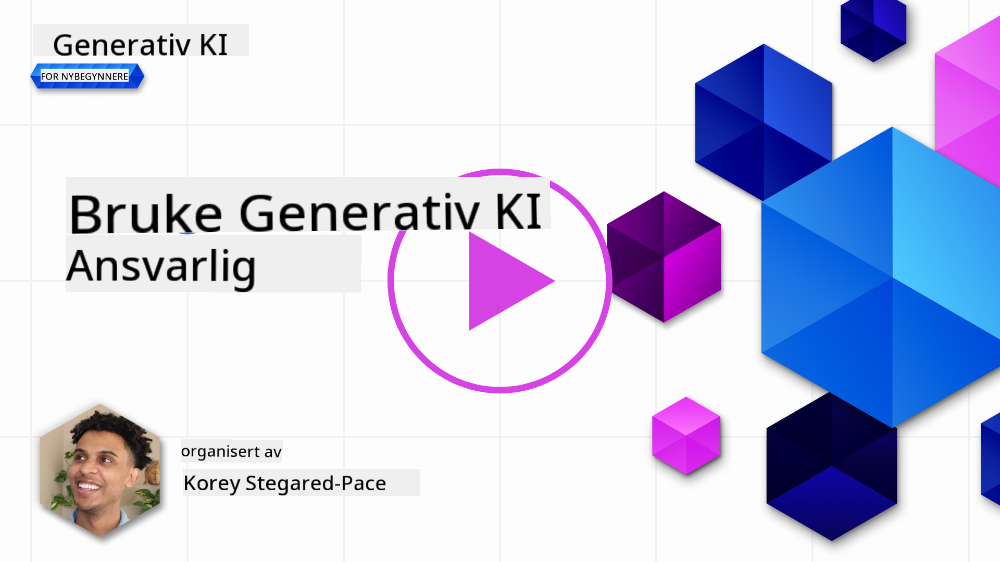
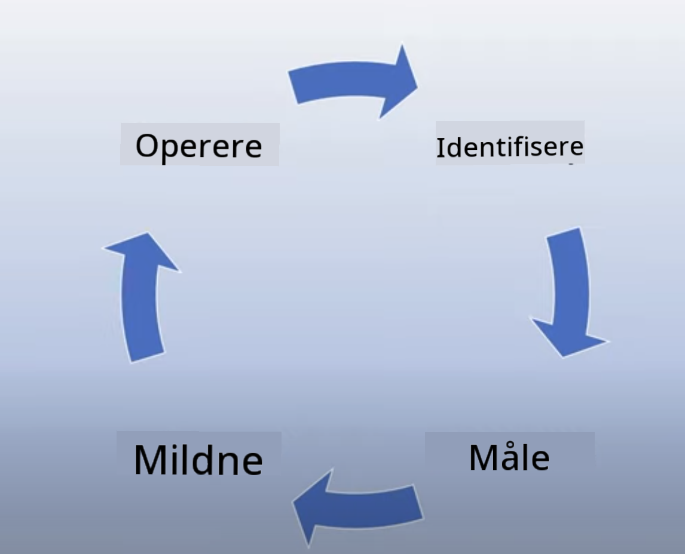
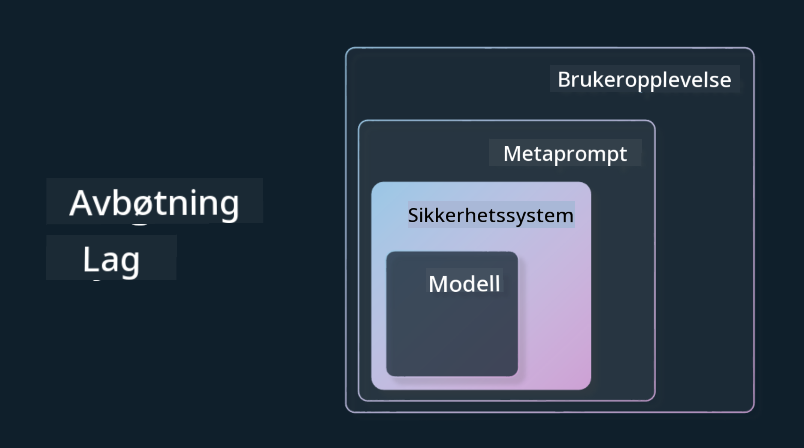

<!--
CO_OP_TRANSLATOR_METADATA:
{
  "original_hash": "13084c6321a2092841b9a081b29497ba",
  "translation_date": "2025-06-25T11:25:42+00:00",
  "source_file": "03-using-generative-ai-responsibly/README.md",
  "language_code": "no"
}
-->
# Bruke Generativ AI Ansvarlig

> _Klikk på bildet ovenfor for å se videoen av denne leksjonen_

Det er lett å bli fascinert av AI og spesielt generativ AI, men du må vurdere hvordan du vil bruke den ansvarlig. Du må tenke på hvordan du kan sikre at resultatene er rettferdige, ikke-skadelige og mer. Dette kapittelet har som mål å gi deg den nevnte konteksten, hva du bør vurdere, og hvordan du kan ta aktive skritt for å forbedre din AI-bruk.

## Introduksjon

Denne leksjonen vil dekke:

- Hvorfor du bør prioritere Ansvarlig AI når du bygger Generativ AI-applikasjoner.
- Kjerneprinsipper for Ansvarlig AI og hvordan de forholder seg til Generativ AI.
- Hvordan sette disse prinsippene for Ansvarlig AI ut i praksis gjennom strategi og verktøy.

## Læringsmål

Etter å ha fullført denne leksjonen vil du vite:

- Viktigheten av Ansvarlig AI når du bygger Generativ AI-applikasjoner.
- Når du skal tenke på og anvende kjerneprinsippene for Ansvarlig AI når du bygger Generativ AI-applikasjoner.
- Hvilke verktøy og strategier som er tilgjengelige for deg for å sette konseptet Ansvarlig AI ut i praksis.

## Prinsipper for Ansvarlig AI

Spenningsnivået for Generativ AI har aldri vært høyere. Denne spenningen har brakt mange nye utviklere, oppmerksomhet og finansiering til dette området. Selv om dette er veldig positivt for alle som ønsker å bygge produkter og selskaper ved hjelp av Generativ AI, er det også viktig at vi går frem på en ansvarlig måte.

Gjennom dette kurset fokuserer vi på å bygge vår startup og vårt AI-utdanningsprodukt. Vi vil bruke prinsippene for Ansvarlig AI: Rettferdighet, Inkludering, Pålitelighet/Sikkerhet, Sikkerhet & Personvern, Åpenhet og Ansvarlighet. Med disse prinsippene vil vi utforske hvordan de forholder seg til vår bruk av Generativ AI i våre produkter.

## Hvorfor bør du prioritere Ansvarlig AI

Når du bygger et produkt, fører det å ta en menneskesentrert tilnærming ved å ha brukerens beste interesse i tankene til de beste resultatene.

Det unike ved Generativ AI er dens evne til å skape nyttige svar, informasjon, veiledning og innhold for brukerne. Dette kan gjøres uten mange manuelle steg, noe som kan føre til svært imponerende resultater. Uten riktig planlegging og strategier kan det dessverre også føre til noen skadelige resultater for brukerne dine, produktet ditt og samfunnet som helhet.

La oss se på noen (men ikke alle) av disse potensielt skadelige resultatene:

### Hallusinasjoner

Hallusinasjoner er et begrep som brukes for å beskrive når en LLM produserer innhold som enten er helt meningsløst eller noe vi vet er faktuelt feil basert på andre informasjonskilder.

La oss for eksempel anta at vi bygger en funksjon for vår startup som lar studenter stille historiske spørsmål til en modell. En student stiller spørsmålet `Who was the sole survivor of Titanic?`

Modellen produserer et svar som det nedenfor:

> _(Kilde: [Flying bisons](https://flyingbisons.com?WT.mc_id=academic-105485-koreyst))_

Dette er et veldig selvsikkert og grundig svar. Dessverre er det feil. Selv med en minimal mengde forskning, ville man oppdage at det var mer enn én overlevende fra Titanic-katastrofen. For en student som nettopp har begynt å forske på dette emnet, kan dette svaret være overbevisende nok til å ikke bli stilt spørsmål ved og behandlet som en fakta. Konsekvensene av dette kan føre til at AI-systemet blir upålitelig og negativt påvirker omdømmet til vår startup.

Med hver iterasjon av en gitt LLM har vi sett ytelsesforbedringer rundt minimalisering av hallusinasjoner. Selv med denne forbedringen må vi som applikasjonsbyggere og brukere fortsatt være klar over disse begrensningene.

### Skadelig innhold

Vi dekket i den tidligere delen når en LLM produserer feil eller meningsløse svar. En annen risiko vi må være klar over er når en modell svarer med skadelig innhold.

Skadelig innhold kan defineres som:

- Å gi instruksjoner eller oppmuntre til selvskading eller skade på visse grupper.
- Hatefulle eller nedsettende innhold.
- Veiledning i planlegging av enhver form for angrep eller voldelige handlinger.
- Å gi instruksjoner om hvordan finne ulovlig innhold eller begå ulovlige handlinger.
- Vise seksuelt eksplisitt innhold.

For vår startup vil vi sikre at vi har de riktige verktøyene og strategiene på plass for å forhindre at denne typen innhold blir sett av studenter.

### Manglende rettferdighet

Rettferdighet er definert som "å sikre at et AI-system er fritt for skjevhet og diskriminering, og at de behandler alle rettferdig og likt." I verden av Generativ AI vil vi sikre at ekskluderende verdenssyn av marginaliserte grupper ikke forsterkes av modellens output.

Disse typene output er ikke bare destruktive for å bygge positive produktopplevelser for brukerne våre, men de forårsaker også ytterligere samfunnsskade. Som applikasjonsbyggere bør vi alltid ha en bred og mangfoldig brukerbase i tankene når vi bygger løsninger med Generativ AI.

## Hvordan bruke Generativ AI ansvarlig

Nå som vi har identifisert viktigheten av Ansvarlig Generativ AI, la oss se på 4 trinn vi kan ta for å bygge våre AI-løsninger ansvarlig:

### Mål potensielle skader

I programvaretesting tester vi de forventede handlingene til en bruker på en applikasjon. På samme måte er det å teste et mangfoldig sett med forespørsler brukerne mest sannsynlig vil bruke en god måte å måle potensielle skader.

Siden vår startup bygger et utdanningsprodukt, ville det være bra å forberede en liste over utdanningsrelaterte forespørsler. Dette kan være for å dekke et bestemt emne, historiske fakta og forespørsler om studentlivet.

### Begrens potensielle skader

Det er nå på tide å finne måter hvor vi kan forhindre eller begrense den potensielle skaden forårsaket av modellen og dens svar. Vi kan se på dette i 4 forskjellige lag:

- **Modell**. Velge riktig modell for riktig brukstilfelle. Større og mer komplekse modeller som GPT-4 kan forårsake mer risiko for skadelig innhold når de brukes på mindre og mer spesifikke brukstilfeller. Bruk av treningsdataene dine til finjustering reduserer også risikoen for skadelig innhold.

- **Sikkerhetssystem**. Et sikkerhetssystem er et sett med verktøy og konfigurasjoner på plattformen som serverer modellen som hjelper til med å begrense skade. Et eksempel på dette er innholdsfiltreringssystemet på Azure OpenAI-tjenesten. Systemer bør også oppdage jailbreak-angrep og uønsket aktivitet som forespørsler fra roboter.

- **Metaprompt**. Metaprompter og forankring er måter vi kan dirigere eller begrense modellen basert på visse atferdsmønstre og informasjon. Dette kan være å bruke systeminnganger for å definere visse grenser for modellen. I tillegg gi output som er mer relevante for omfanget eller domenet til systemet.

Det kan også være å bruke teknikker som Retrieval Augmented Generation (RAG) for å få modellen til bare å hente informasjon fra et utvalg av pålitelige kilder. Det er en leksjon senere i dette kurset for [bygge søkeapplikasjoner](../08-building-search-applications/README.md?WT.mc_id=academic-105485-koreyst)

- **Brukeropplevelse**. Det siste laget er der brukeren samhandler direkte med modellen gjennom vår applikasjonsgrensesnitt på en eller annen måte. På denne måten kan vi designe UI/UX for å begrense brukeren på hvilke typer input de kan sende til modellen, samt tekst eller bilder som vises til brukeren. Når vi distribuerer AI-applikasjonen, må vi også være åpne om hva vår Generative AI-applikasjon kan og ikke kan gjøre.

Vi har en hel leksjon dedikert til [Designe UX for AI-applikasjoner](../12-designing-ux-for-ai-applications/README.md?WT.mc_id=academic-105485-koreyst)

- **Evaluer modell**. Å jobbe med LLM-er kan være utfordrende fordi vi ikke alltid har kontroll over dataene modellen ble trent på. Uansett bør vi alltid evaluere modellens ytelse og output. Det er fortsatt viktig å måle modellens nøyaktighet, likhet, forankring og relevans av output. Dette bidrar til å gi åpenhet og tillit til interessenter og brukere.

### Drifte en ansvarlig Generativ AI-løsning

Å bygge en operasjonell praksis rundt dine AI-applikasjoner er det siste stadiet. Dette inkluderer å samarbeide med andre deler av vår startup som Juridisk og Sikkerhet for å sikre at vi er i samsvar med alle reguleringspolitikker. Før lansering ønsker vi også å bygge planer rundt levering, håndtering av hendelser og tilbakeføring for å forhindre skade på brukerne våre fra å vokse.

## Verktøy

Mens arbeidet med å utvikle Ansvarlige AI-løsninger kan virke som mye, er det arbeid som er vel verdt innsatsen. Ettersom området for Generativ AI vokser, vil flere verktøy som hjelper utviklere med å effektivt integrere ansvarlighet i arbeidsflytene deres modnes. For eksempel kan [Azure AI Content Safety](https://learn.microsoft.com/azure/ai-services/content-safety/overview?WT.mc_id=academic-105485-koreyst) hjelpe med å oppdage skadelig innhold og bilder via en API-forespørsel.

## Kunnskapssjekk

Hva er noen ting du må bry deg om for å sikre ansvarlig AI-bruk?

1. At svaret er korrekt.
1. Skadelig bruk, at AI ikke brukes til kriminelle formål.
1. Sikre at AI er fri for skjevhet og diskriminering.

A: 2 og 3 er korrekte. Ansvarlig AI hjelper deg med å vurdere hvordan du kan begrense skadelige effekter og skjevheter og mer.

## 🚀 Utfordring

Les om [Azure AI Content Safety](https://learn.microsoft.com/azure/ai-services/content-safety/overview?WT.mc_id=academic-105485-koreyst) og se hva du kan ta i bruk for din bruk.

## Flott arbeid, fortsett læringen din

Etter å ha fullført denne leksjonen, sjekk ut vår [Generative AI Learning-samling](https://aka.ms/genai-collection?WT.mc_id=academic-105485-koreyst) for å fortsette å styrke din kunnskap om Generativ AI!

Gå over til Leksjon 4 hvor vi vil se på [Grunnleggende om Prompt Engineering](../04-prompt-engineering-fundamentals/README.md?WT.mc_id=academic-105485-koreyst)!

**Ansvarsfraskrivelse**:  
Dette dokumentet har blitt oversatt ved hjelp av AI-oversettelsestjenesten [Co-op Translator](https://github.com/Azure/co-op-translator). Selv om vi jobber for nøyaktighet, vær oppmerksom på at automatiserte oversettelser kan inneholde feil eller unøyaktigheter. Det originale dokumentet på sitt opprinnelige språk bør betraktes som den autoritative kilden. For kritisk informasjon anbefales profesjonell menneskelig oversettelse. Vi er ikke ansvarlige for eventuelle misforståelser eller feiltolkninger som oppstår ved bruk av denne oversettelsen.