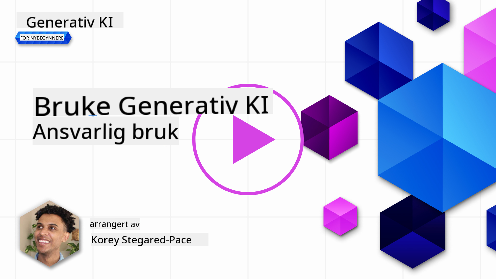

<!--
CO_OP_TRANSLATOR_METADATA:
{
  "original_hash": "4d57fad773cbeb69c5dd62e65c34200d",
  "translation_date": "2025-10-17T19:19:58+00:00",
  "source_file": "03-using-generative-ai-responsibly/README.md",
  "language_code": "no"
}
-->
# Bruke Generativ AI Ansvarlig

> _Klikk på bildet over for å se videoen til denne leksjonen_

Det er lett å bli fascinert av AI, spesielt generativ AI, men det er viktig å vurdere hvordan man bruker det ansvarlig. Du må tenke på ting som hvordan du sikrer at resultatene er rettferdige, ikke-skadelige og mer. Dette kapittelet har som mål å gi deg den nevnte konteksten, hva du bør vurdere, og hvordan du kan ta aktive steg for å forbedre din AI-bruk.

## Introduksjon

Denne leksjonen vil dekke:

- Hvorfor du bør prioritere Ansvarlig AI når du bygger applikasjoner med Generativ AI.
- Kjerneprinsipper for Ansvarlig AI og hvordan de relaterer seg til Generativ AI.
- Hvordan sette disse prinsippene for Ansvarlig AI ut i praksis gjennom strategi og verktøy.

## Læringsmål

Etter å ha fullført denne leksjonen vil du vite:

- Viktigheten av Ansvarlig AI når du bygger applikasjoner med Generativ AI.
- Når du skal tenke på og anvende kjerneprinsippene for Ansvarlig AI når du bygger applikasjoner med Generativ AI.
- Hvilke verktøy og strategier som er tilgjengelige for deg for å sette konseptet Ansvarlig AI ut i praksis.

## Prinsipper for Ansvarlig AI

Entusiasmen rundt Generativ AI har aldri vært større. Denne entusiasmen har tiltrukket mange nye utviklere, oppmerksomhet og finansiering til dette området. Selv om dette er veldig positivt for alle som ønsker å bygge produkter og selskaper med Generativ AI, er det også viktig at vi går frem på en ansvarlig måte.

Gjennom dette kurset fokuserer vi på å bygge vår startup og vårt AI-utdanningsprodukt. Vi vil bruke prinsippene for Ansvarlig AI: Rettferdighet, Inkludering, Pålitelighet/Sikkerhet, Sikkerhet & Personvern, Transparens og Ansvarlighet. Med disse prinsippene vil vi utforske hvordan de relaterer seg til vår bruk av Generativ AI i våre produkter.

## Hvorfor Bør Du Prioritere Ansvarlig AI

Når du bygger et produkt, fører en menneskesentrert tilnærming som holder brukerens beste interesse i tankene til de beste resultatene.

Det unike med Generativ AI er dens evne til å skape nyttige svar, informasjon, veiledning og innhold for brukere. Dette kan gjøres uten mange manuelle steg, noe som kan føre til svært imponerende resultater. Uten riktig planlegging og strategier kan det dessverre også føre til skadelige resultater for brukerne dine, produktet ditt og samfunnet som helhet.

La oss se på noen (men ikke alle) av disse potensielt skadelige resultatene:

### Hallusinasjoner

Hallusinasjoner er et begrep som brukes for å beskrive når en LLM produserer innhold som enten er helt meningsløst eller noe vi vet er faktuelt feil basert på andre informasjonskilder.

La oss for eksempel si at vi bygger en funksjon for vår startup som lar studenter stille historiske spørsmål til en modell. En student spør spørsmålet `Hvem var den eneste overlevende fra Titanic?`

Modellen produserer et svar som det nedenfor:

> _(Kilde: [Flying bisons](https://flyingbisons.com?WT.mc_id=academic-105485-koreyst))_

Dette er et veldig selvsikkert og grundig svar. Dessverre er det feil. Selv med minimal forskning vil man oppdage at det var mer enn én overlevende fra Titanic-katastrofen. For en student som nettopp har begynt å undersøke dette emnet, kan dette svaret være overbevisende nok til å ikke bli stilt spørsmål ved og behandlet som fakta. Konsekvensene av dette kan føre til at AI-systemet blir upålitelig og negativt påvirker omdømmet til vår startup.

Med hver iterasjon av en gitt LLM har vi sett ytelsesforbedringer rundt det å minimere hallusinasjoner. Selv med denne forbedringen må vi som applikasjonsutviklere og brukere fortsatt være oppmerksomme på disse begrensningene.

### Skadelig Innhold

Vi dekket i den tidligere delen når en LLM produserer feil eller meningsløse svar. En annen risiko vi må være oppmerksomme på er når en modell svarer med skadelig innhold.

Skadelig innhold kan defineres som:

- Å gi instruksjoner eller oppmuntre til selvskading eller skade på visse grupper.
- Hatefult eller nedsettende innhold.
- Veiledning i planlegging av enhver type angrep eller voldelige handlinger.
- Å gi instruksjoner om hvordan man finner ulovlig innhold eller begår ulovlige handlinger.
- Vise seksuelt eksplisitt innhold.

For vår startup ønsker vi å sørge for at vi har de riktige verktøyene og strategiene på plass for å forhindre at denne typen innhold blir sett av studenter.

### Manglende Rettferdighet

Rettferdighet defineres som "å sikre at et AI-system er fritt for skjevhet og diskriminering og at det behandler alle rettferdig og likt." I verden av Generativ AI ønsker vi å sikre at ekskluderende verdenssyn av marginaliserte grupper ikke forsterkes av modellens output.

Denne typen output er ikke bare destruktiv for å bygge positive produktopplevelser for våre brukere, men de forårsaker også ytterligere samfunnsskade. Som applikasjonsutviklere bør vi alltid ha et bredt og mangfoldig brukergrunnlag i tankene når vi bygger løsninger med Generativ AI.

## Hvordan Bruke Generativ AI Ansvarlig

Nå som vi har identifisert viktigheten av Ansvarlig Generativ AI, la oss se på 4 steg vi kan ta for å bygge våre AI-løsninger ansvarlig:

### Mål Potensielle Skader

I programvaretesting tester vi de forventede handlingene til en bruker på en applikasjon. På samme måte er testing av et mangfoldig sett med prompts som brukere mest sannsynlig kommer til å bruke en god måte å måle potensielle skader på.

Siden vår startup bygger et utdanningsprodukt, ville det være lurt å forberede en liste over utdanningsrelaterte prompts. Dette kan dekke et bestemt emne, historiske fakta og prompts om studentliv.

### Begrens Potensielle Skader

Det er nå tid for å finne måter hvor vi kan forhindre eller begrense den potensielle skaden forårsaket av modellen og dens svar. Vi kan se på dette i 4 forskjellige lag:

- **Modell**. Velge riktig modell for riktig brukstilfelle. Større og mer komplekse modeller som GPT-4 kan medføre større risiko for skadelig innhold når de brukes på mindre og mer spesifikke brukstilfeller. Bruk av treningsdata for finjustering reduserer også risikoen for skadelig innhold.

- **Sikkerhetssystem**. Et sikkerhetssystem er et sett med verktøy og konfigurasjoner på plattformen som serverer modellen som hjelper med å begrense skade. Et eksempel på dette er innholdsfiltreringssystemet på Azure OpenAI-tjenesten. Systemer bør også oppdage jailbreak-angrep og uønsket aktivitet som forespørsler fra bots.

- **Metaprompt**. Metaprompts og grounding er måter vi kan dirigere eller begrense modellen basert på visse oppføringer og informasjon. Dette kan være å bruke systeminnspill for å definere visse grenser for modellen. I tillegg kan det være å gi output som er mer relevant for omfanget eller domenet til systemet.

Det kan også være å bruke teknikker som Retrieval Augmented Generation (RAG) for å få modellen til kun å hente informasjon fra et utvalg av pålitelige kilder. Det finnes en leksjon senere i dette kurset for [å bygge søkeapplikasjoner](../08-building-search-applications/README.md?WT.mc_id=academic-105485-koreyst)

- **Brukeropplevelse**. Det siste laget er der brukeren interagerer direkte med modellen gjennom applikasjonens grensesnitt på en eller annen måte. På denne måten kan vi designe UI/UX for å begrense brukeren på hvilke typer input de kan sende til modellen, samt tekst eller bilder som vises til brukeren. Når vi distribuerer AI-applikasjonen, må vi også være transparente om hva vår Generative AI-applikasjon kan og ikke kan gjøre.

Vi har en hel leksjon dedikert til [Design av UX for AI-applikasjoner](../12-designing-ux-for-ai-applications/README.md?WT.mc_id=academic-105485-koreyst)

- **Evaluer modellen**. Å jobbe med LLMs kan være utfordrende fordi vi ikke alltid har kontroll over dataene modellen ble trent på. Uansett bør vi alltid evaluere modellens ytelse og output. Det er fortsatt viktig å måle modellens nøyaktighet, likhet, forankring og relevans av output. Dette hjelper med å gi transparens og tillit til interessenter og brukere.

### Operere en Ansvarlig Generativ AI-løsning

Å bygge en operasjonell praksis rundt dine AI-applikasjoner er det siste stadiet. Dette inkluderer samarbeid med andre deler av vår startup som Juridisk og Sikkerhet for å sikre at vi er i samsvar med alle regulatoriske retningslinjer. Før lansering ønsker vi også å bygge planer rundt levering, håndtering av hendelser og tilbakestilling for å forhindre skade på våre brukere fra å vokse.

## Verktøy

Selv om arbeidet med å utvikle Ansvarlige AI-løsninger kan virke som mye, er det arbeid som er vel verdt innsatsen. Etter hvert som området for Generativ AI vokser, vil flere verktøy for å hjelpe utviklere med å effektivt integrere ansvarlighet i sine arbeidsflyter modnes. For eksempel kan [Azure AI Content Safety](https://learn.microsoft.com/azure/ai-services/content-safety/overview?WT.mc_id=academic-105485-koreyst) hjelpe med å oppdage skadelig innhold og bilder via en API-forespørsel.

## Kunnskapssjekk

Hva er noen ting du må bry deg om for å sikre ansvarlig AI-bruk?

1. At svaret er korrekt.  
2. Skadelig bruk, at AI ikke brukes til kriminelle formål.  
3. Sikre at AI er fri for skjevhet og diskriminering.  

A: 2 og 3 er korrekte. Ansvarlig AI hjelper deg med å vurdere hvordan du kan begrense skadelige effekter og skjevheter og mer.

## 🚀 Utfordring

Les om [Azure AI Content Safety](https://learn.microsoft.com/azure/ai-services/content-safety/overview?WT.mc_id=academic-105485-koreyst) og se hva du kan ta i bruk for din bruk.

## Flott Arbeid, Fortsett Din Læring

Etter å ha fullført denne leksjonen, sjekk ut vår [Generative AI Learning collection](https://aka.ms/genai-collection?WT.mc_id=academic-105485-koreyst) for å fortsette å utvikle din kunnskap om Generativ AI!

Gå videre til Leksjon 4 hvor vi skal se på [Grunnleggende om Prompt Engineering](../04-prompt-engineering-fundamentals/README.md?WT.mc_id=academic-105485-koreyst)!

---

**Ansvarsfraskrivelse**:  
Dette dokumentet er oversatt ved hjelp av AI-oversettelsestjenesten [Co-op Translator](https://github.com/Azure/co-op-translator). Selv om vi streber etter nøyaktighet, vær oppmerksom på at automatiserte oversettelser kan inneholde feil eller unøyaktigheter. Det originale dokumentet på sitt opprinnelige språk bør anses som den autoritative kilden. For kritisk informasjon anbefales profesjonell menneskelig oversettelse. Vi er ikke ansvarlige for misforståelser eller feiltolkninger som oppstår ved bruk av denne oversettelsen.