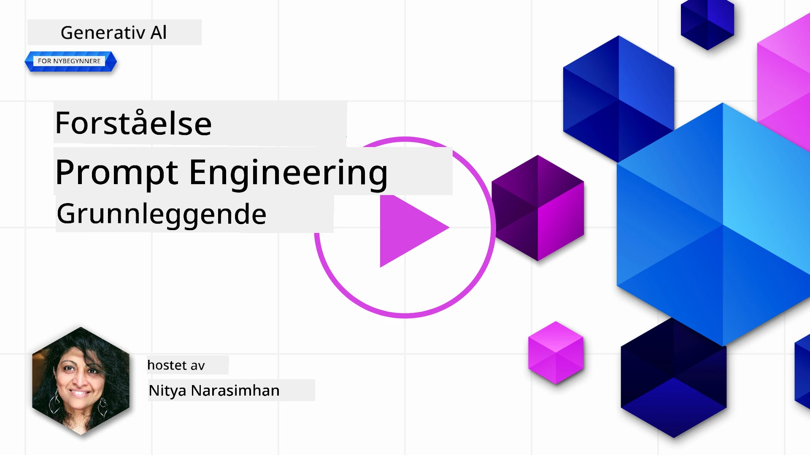
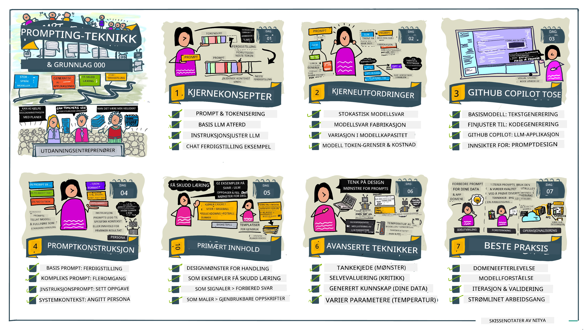
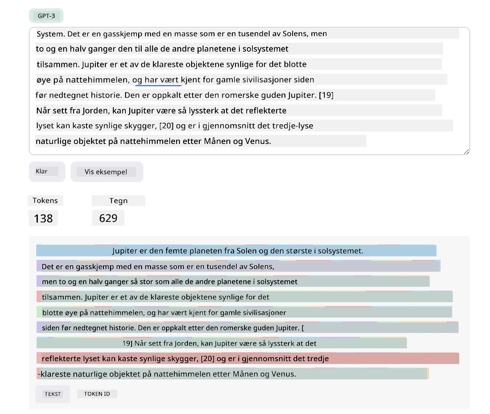
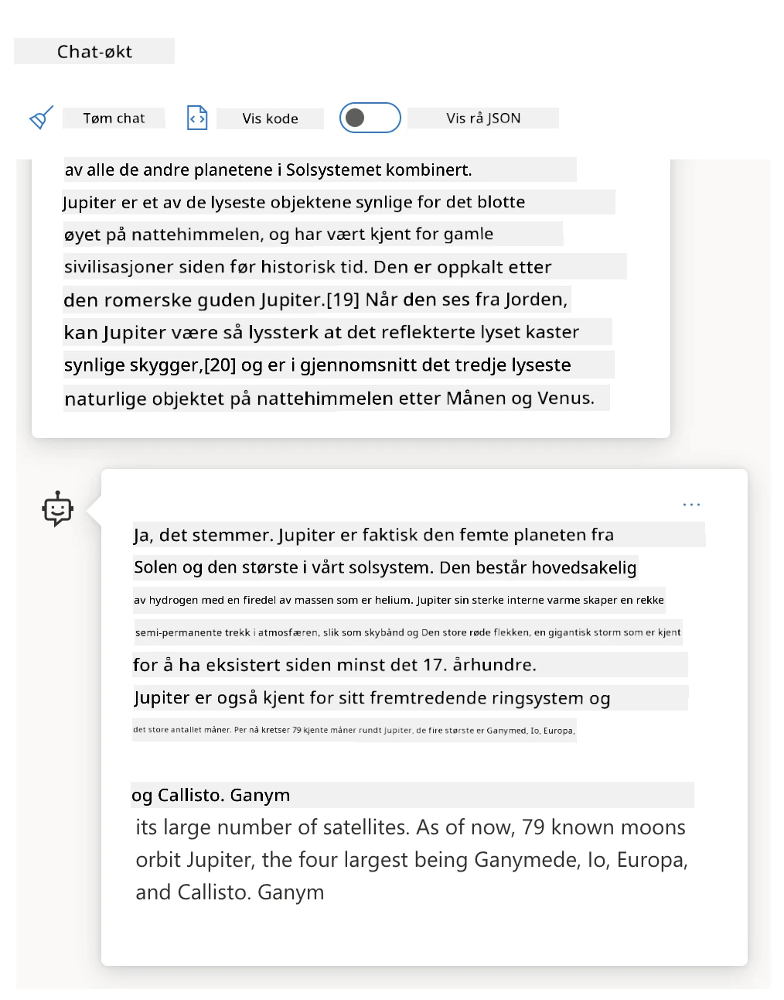
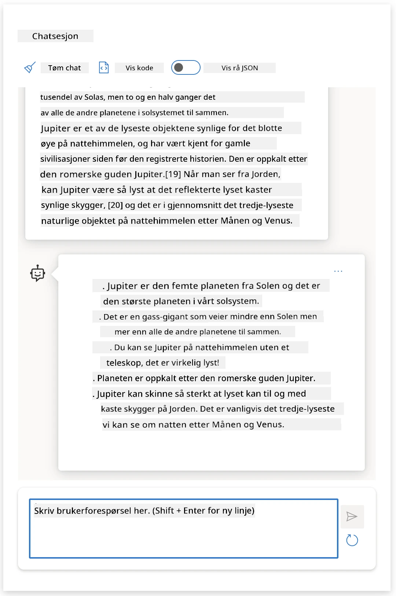
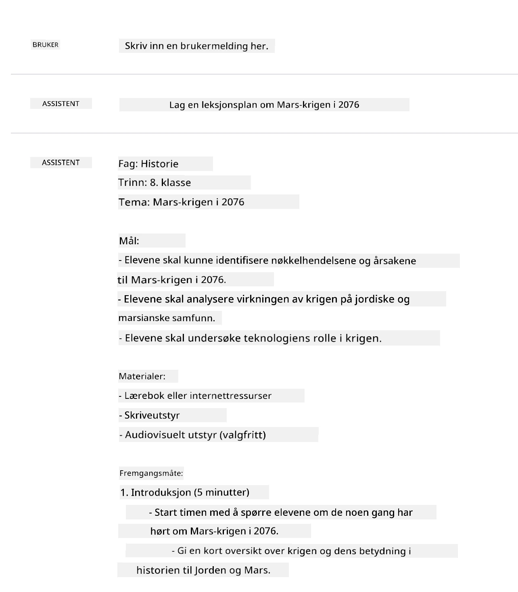
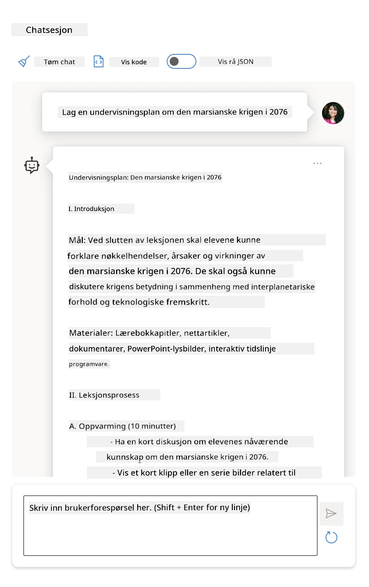
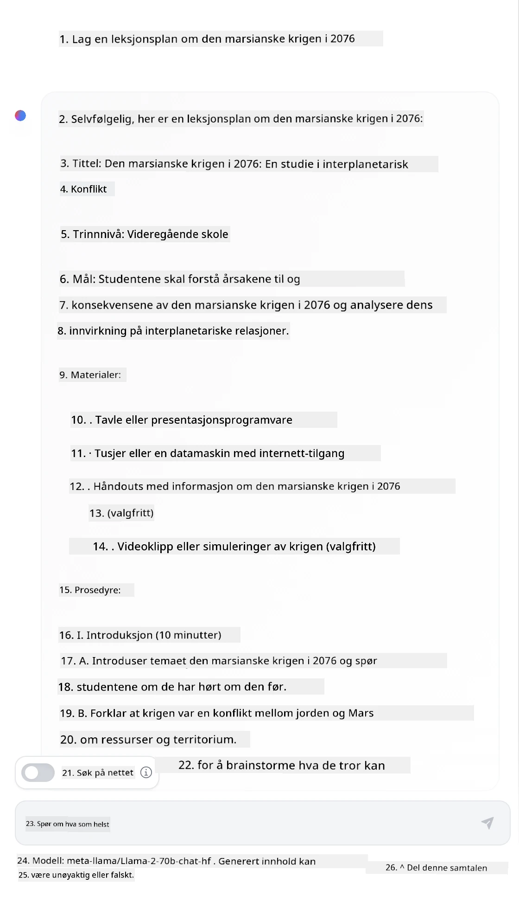

# Grunnleggende om Prompt Engineering

[](https://youtu.be/GElCu2kUlRs?si=qrXsBvXnCW12epb8)

## Introduksjon
Denne modulen dekker viktige konsepter og teknikker for å lage effektive prompts i generative AI-modeller. Måten du skriver prompten din til en LLM på, spiller også en rolle. En nøye utformet prompt kan oppnå bedre kvalitet på responsen. Men hva betyr egentlig begreper som _prompt_ og _prompt engineering_? Og hvordan kan jeg forbedre prompt-_inputen_ som jeg sender til LLM? Dette er spørsmålene vi vil prøve å svare på i dette kapitlet og det neste.

_Generativ AI_ er i stand til å lage nytt innhold (f.eks. tekst, bilder, lyd, kode osv.) som svar på brukerforespørsler. Den oppnår dette ved bruk av _Store Språkmodeller_ som OpenAIs GPT ("Generative Pre-trained Transformer") serie som er trent for bruk av naturlig språk og kode.

Brukere kan nå interagere med disse modellene ved hjelp av kjente paradigmer som chat, uten å trenge teknisk ekspertise eller opplæring. Modellene er _prompt-baserte_ - brukere sender inn tekstinput (prompt) og får tilbake AI-responsen (fullføring). De kan så "chatte med AI" iterativt, i flerskiftsamtaler, og finjustere prompten sin til responsen matcher deres forventninger.

"Prompter" blir nå det primære _programmeringsgrensesnittet_ for generative AI-apper, som forteller modellene hva de skal gjøre og påvirker kvaliteten på de returnerte svarene. "Prompt Engineering" er et raskt voksende fagfelt som fokuserer på _design og optimalisering_ av promter for å levere konsistente og kvalitetsmessige svar i stor skala.

## Læringsmål

I denne leksjonen lærer vi hva Prompt Engineering er, hvorfor det er viktig, og hvordan vi kan lage mer effektive prompts for en gitt modell og applikasjonsmål. Vi vil forstå kjernebegreper og beste praksiser for prompt engineering – og lære om et interaktivt Jupyter Notebook "sandbox"-miljø hvor vi kan se disse konseptene anvendt i ekte eksempler.

Ved slutten av denne leksjonen skal vi kunne:

1. Forklare hva prompt engineering er og hvorfor det er viktig.
2. Beskrive komponentene i en prompt og hvordan de brukes.
3. Lære beste praksiser og teknikker for prompt engineering.
4. Anvende lærte teknikker på ekte eksempler, ved bruk av en OpenAI-endepunkt.

## Nøkkelbegreper

Prompt Engineering: Praktiseringen av å designe og raffinere inputs for å veilede AI-modeller mot å produsere ønskede utdata.  
Tokenisering: Prosessen med å konvertere tekst til mindre enheter, kalt tokens, som en modell kan forstå og bearbeide.  
Instruction-Tuned LLMs: Store språkmodeller (LLMs) som har blitt finjustert med spesifikke instruksjoner for å øke nøyaktighet og relevans i svarene.

## Læringssandbox

Prompt engineering er for øyeblikket mer en kunst enn vitenskap. Den beste måten å forbedre vår intuisjon på er å _øve mer_ og ta i bruk en prøv-og-feil-tilnærming som kombinerer faglig kompetanse i bruksområdet med anbefalte teknikker og modellspesifikke optimaliseringer.

Jupyter Notebook som følger med denne leksjonen gir et _sandbox_-miljø hvor du kan prøve ut det du lærer – enten fortløpende eller som en del av kodeutfordringen til slutt. For å kjøre øvelsene trenger du:

1. **En Azure OpenAI API-nøkkel** – tjenesteendepunktet for en distribuert LLM.  
2. **Et Python-runtime** – hvor Notebook kan kjøres.  
3. **Lokale miljøvariabler** – _fullfør [SETUP](./../00-course-setup/02-setup-local.md?WT.mc_id=academic-105485-koreyst) stegene nå for å være klar_.

Notatboken leveres med _startøvelser_ - men du oppfordres til å legge til egne _Markdown_ (beskrivelse) og _Kode_ (prompt-forespørsler) seksjoner for å prøve flere eksempler eller ideer – og bygge din egen intuisjon for promptdesign.

## Illustrert Guide

Vil du få et overblikk av hva denne leksjonen dekker før du dykker inn? Sjekk ut denne illustrerte guiden, som gir deg en følelse av hovedtemaene og de viktigste innsiktene for deg å reflektere over i hver del. Leksjonens veikart tar deg fra forståelsen av kjernebegrepene og utfordringene til å takle dem med relevante prompt engineering-teknikker og beste praksiser. Merk at delen "Avanserte teknikker" i denne guiden refererer til innhold som dekkes i _neste_ kapittel i dette læreplanet.



## Vår Startup

La oss nå snakke om hvordan _dette temaet_ relaterer seg til vårt startup-oppdrag om å [bringe AI-innovasjon til utdanning](https://educationblog.microsoft.com/2023/06/collaborating-to-bring-ai-innovation-to-education?WT.mc_id=academic-105485-koreyst). Vi ønsker å bygge AI-drevne applikasjoner for _personlig tilpasset læring_ – så la oss tenke på hvordan ulike brukere av applikasjonen vår kan "designe" prompts:

- **Administratorer** kan be AI om å _analysere læreplan-data for å identifisere hull i dekningen_. AI kan oppsummere resultatene eller visualisere dem med kode.  
- **Lærere** kan be AI om å _generere en undervisningsplan for et målpublikum og et tema_. AI kan bygge den personlige planen i et spesifisert format.  
- **Studenter** kan be AI om å _veilede dem i et vanskelig fag_. AI kan nå veilede studenter med leksjoner, hint og eksempler tilpasset deres nivå.

Dette er bare toppen av isfjellet. Sjekk ut [Prompts For Education](https://github.com/microsoft/prompts-for-edu/tree/main?WT.mc_id=academic-105485-koreyst) – et åpen kildekode-bibliotek med promter kuratert av utdanningseksperter – for å få et bredere innblikk i mulighetene! _Prøv å kjøre noen av disse promptene i sandboxen eller i OpenAI Playground for å se hva som skjer!_

<!--
LESSON TEMPLATE:
This unit should cover core concept #1.
Reinforce the concept with examples and references.

CONCEPT #1:
Prompt Engineering.
Define it and explain why it is needed.
-->

## Hva er Prompt Engineering?

Vi startet denne leksjonen med å definere **Prompt Engineering** som prosessen med å _designe og optimalisere_ tekstinput (prompter) for å levere konsistente og kvalitetsrike svar (fullføringer) for et gitt applikasjonsmål og modell. Vi kan tenke på dette som en 2-trinns prosess:

- _designe_ den initielle prompten for en gitt modell og mål  
- _forbedre_ prompten iterativt for å øke kvaliteten på svaret

Dette er nødvendigvis en prøv-og-feil-prosess som krever brukerintuisjon og innsats for å oppnå optimale resultater. Så hvorfor er det viktig? For å svare på det spørsmålet, må vi først forstå tre konsepter:

- _Tokenisering_ = hvordan modellen "ser" prompten  
- _Base LLMs_ = hvordan grunnmodellen "bearbeider" en prompt  
- _Instruction-Tuned LLMs_ = hvordan modellen nå kan se "oppgaver"

### Tokenisering

En LLM ser på prompter som en _sekvens av tokens_ hvor forskjellige modeller (eller versjoner av en modell) kan tokenisere samme prompt på ulike måter. Siden LLMs trenes på tokens (ikke rå tekst), har måten promptene tokeniseres på direkte innvirkning på kvaliteten i det genererte svaret.

For å få en intuisjon om hvordan tokenisering fungerer, prøv verktøy som [OpenAI Tokenizer](https://platform.openai.com/tokenizer?WT.mc_id=academic-105485-koreyst) vist nedenfor. Lim inn prompten din – og se hvordan den blir konvertert til tokens, legg merke til hvordan mellomrom og tegnsetting håndteres. Merk at dette eksempelet viser en eldre LLM (GPT-3) – å prøve dette med en nyere modell kan gi et annet resultat.



### Konsept: Grunnmodeller

Når en prompt er tokenisert, er hovedfunksjonen til ["Base LLM"](https://blog.gopenai.com/an-introduction-to-base-and-instruction-tuned-large-language-models-8de102c785a6?WT.mc_id=academic-105485-koreyst) (eller grunnmodellen) å forutsi neste token i sekvensen. Siden LLMs trenes på enorme tekstdatasett, har de en god forståelse av de statistiske sammenhengene mellom tokens og kan gjøre denne prediksjonen med en viss sikkerhet. Merk at de ikke forstår _meningen_ med ordene i prompten eller tokenen; de ser bare et mønster de kan "fullføre" med sin neste prediksjon. De kan fortsette å forutsi sekvensen til den avbrytes av bruker eller oppfyller en forhåndsdefinert betingelse.

Vil du se hvordan promptbasert fullføring fungerer? Tast inn prompten ovenfor i Azure OpenAI Studio [_Chat Playground_](https://oai.azure.com/playground?WT.mc_id=academic-105485-koreyst) med standardinnstillinger. Systemet er konfigurert til å behandle prompts som informasjonsforespørsler – så du bør se en fullføring som tilfredsstiller denne konteksten.

Men hva om brukeren ønsket å se noe spesifikt som oppfyller visse kriterier eller oppgaveformål? Her kommer _instruction-tuned_ LLMs inn i bildet.



### Konsept: Instruction Tuned LLMs

En [Instruction Tuned LLM](https://blog.gopenai.com/an-introduction-to-base-and-instruction-tuned-large-language-models-8de102c785a6?WT.mc_id=academic-105485-koreyst) starter med grunnmodellen og finjusterer den med eksempler eller input/output-par (f.eks. flerskifts "meldinger") som kan inneholde klare instruksjoner – og responsen fra AI forsøker å følge denne instruksjonen.

Dette bruker teknikker som Reinforcement Learning with Human Feedback (RLHF) som kan lære modellen å _følge instruksjoner_ og _lære av tilbakemeldinger_ slik at den produserer svar som er bedre egnet til praktiske applikasjoner og mer relevante for brukerens mål.

La oss prøve det – gå tilbake til prompten over, men endre nå _systemmeldingen_ for å gi følgende instruksjon som kontekst:

> _Oppsummer innholdet du får for en elev i andre klasse. Hold resultatet til ett avsnitt med 3-5 punkter._

Ser du hvordan resultatet nå er tilpasset det ønskede målet og formatet? En lærer kan nå bruke dette svaret direkte i sine lysbilder til den klassen.



## Hvorfor trenger vi Prompt Engineering?

Nå som vi vet hvordan prompter behandles av LLMs, la oss snakke om _hvorfor_ vi trenger prompt engineering. Svaret ligger i at dagens LLMs byr på en rekke utfordringer som gjør _pålitelige og konsistente fullføringer_ vanskeligere å oppnå uten innsats i konstruksjon og optimalisering av prompten. For eksempel:

1. **Modellens svar er stokastiske.** Den _samme prompten_ vil sannsynligvis gi forskjellige svar i ulike modeller eller modellversjoner. Og den kan til og med gi ulike resultater med _samme modell_ på forskjellige tidspunkt. _Prompt engineering-teknikker kan hjelpe oss å minimere disse variasjonene ved å gi bedre retningslinjer_.

1. **Modeller kan fabrikkere svar.** Modeller er forhåndstrent med _store, men begrensede_ datasett, noe som betyr at de mangler kunnskap om konsepter utenfor treningsomfanget. Derfor kan de produsere fullføringer som er unøyaktige, oppdiktede eller rett og slett motsier kjente fakta. _Prompt engineering hjelper brukere å identifisere og dempe slike fabrikerte svar, f.eks. ved å be AI om kilder eller begrunnelse_.

1. **Modellers kapasiteter varierer.** Nyere modeller eller modellgenerasjoner vil ha rikere kapasiteter, men også bringe unike særtrekk og kompromisser i kostnad og kompleksitet. _Prompt engineering kan hjelpe oss å utvikle beste praksiser og arbeidsflyter som skjuler forskjeller og tilpasser seg modellspesifikke krav på skalerbare og sømløse måter_.

La oss se dette i aksjon i OpenAI eller Azure OpenAI Playground:

- Bruk den samme prompten med ulike LLM-distribusjoner (f.eks. OpenAI, Azure OpenAI, Hugging Face) – så du variasjonene?  
- Bruk samme prompt gjentatte ganger med _samme_ LLM-distribusjon (f.eks. Azure OpenAI playground) – hvordan var forskjellene i variasjon?

### Eksempel på fabrikasjoner

I dette kurset bruker vi begrepet **"fabrikasjon"** for å referere til fenomenet der LLMs noen ganger genererer faktuelt feilaktig informasjon på grunn av begrensninger i trening eller andre rammer. Du har kanskje også hørt dette omtalt som _"hallusinasjoner"_ i populære artikler eller forskningsartikler. Vi anbefaler sterkt å bruke _"fabrikasjon"_ som begrep for å unngå at vi utilsiktet antropomorfiserer oppførselen ved å tillegge maskindrevne resultater menneskelige egenskaper. Dette følger også [Retningslinjer for Ansvarlig AI](https://www.microsoft.com/ai/responsible-ai?WT.mc_id=academic-105485-koreyst) fra et terminologisk perspektiv, hvor vi fjerner begreper som også kan oppfattes som støtende eller ikke-inkluderende i enkelte sammenhenger.

Vil du få en forståelse for hvordan fabrikasjoner oppstår? Tenk på en prompt som instruerer AI til å generere innhold om et ikke-eksisterende tema (for å sikre at det ikke finnes i treningsdatasettet). For eksempel – jeg prøvde denne prompten:

> **Prompt:** generer en undervisningsplan om Martian War of 2076.
Et nettsøk viste meg at det fantes fiktive fortellinger (f.eks. TV-serier eller bøker) om marskriger – men ingen i 2076. Sunn fornuft forteller oss også at 2076 er _i fremtiden_, og dermed kan ikke knyttes til en virkelig hendelse.

Så hva skjer når vi kjører denne prompten med forskjellige LLM-leverandører?

> **Svar 1**: OpenAI Playground (GPT-35)



> **Svar 2**: Azure OpenAI Playground (GPT-35)



> **Svar 3**: : Hugging Face Chat Playground (LLama-2)



Som forventet produserer hver modell (eller modellversjon) noe forskjellige svar takket være stokastisk oppførsel og variasjoner i modellkapasitet. For eksempel retter en modell seg mot et 8. klasses publikum mens en annen antar videregående nivå. Men alle tre modellene genererte svar som kunne overbevise en uinformert bruker om at hendelsen var ekte.

Promptengineering-teknikker som _metaprompting_ og _temperaturkonfigurasjon_ kan redusere modell-fabrikasjoner til en viss grad. Nye promptengineering _arkitekturer_ integrerer også nye verktøy og teknikker sømløst inn i promptflyten for å dempe eller redusere noen av disse effektene.

## Case Study: GitHub Copilot

La oss avslutte denne delen med å få innsikt i hvordan promptengineering brukes i virkelige løsninger ved å se på en Case Study: [GitHub Copilot](https://github.com/features/copilot?WT.mc_id=academic-105485-koreyst).

GitHub Copilot er din "AI-parprogrammerer" – den omdanner tekstprompter til kodesluttføringer og er integrert i utviklingsmiljøet ditt (f.eks. Visual Studio Code) for en sømløs brukeropplevelse. Som dokumentert i serien av blogger nedenfor var den tidligste versjonen basert på OpenAI Codex-modellen – med ingeniører som raskt innså behovet for å finjustere modellen og utvikle bedre promptengineering-teknikker for å forbedre kodekvaliteten. I juli [lanserte de en forbedret AI-modell som går utover Codex](https://github.blog/2023-07-28-smarter-more-efficient-coding-github-copilot-goes-beyond-codex-with-improved-ai-model/?WT.mc_id=academic-105485-koreyst) for enda raskere forslag.

Les innleggene i rekkefølge for å følge deres læringsreise.

- **Mai 2023** | [GitHub Copilot blir bedre til å forstå koden din](https://github.blog/2023-05-17-how-github-copilot-is-getting-better-at-understanding-your-code/?WT.mc_id=academic-105485-koreyst)
- **Mai 2023** | [Inside GitHub: Arbeid med LLM-ene bak GitHub Copilot](https://github.blog/2023-05-17-inside-github-working-with-the-llms-behind-github-copilot/?WT.mc_id=academic-105485-koreyst)
- **Juni 2023** | [Hvordan skrive bedre prompter for GitHub Copilot](https://github.blog/2023-06-20-how-to-write-better-prompts-for-github-copilot/?WT.mc_id=academic-105485-koreyst)
- **Juli 2023** | [.. GitHub Copilot går utover Codex med forbedret AI-modell](https://github.blog/2023-07-28-smarter-more-efficient-coding-github-copilot-goes-beyond-codex-with-improved-ai-model/?WT.mc_id=academic-105485-koreyst)
- **Juli 2023** | [En utviklers guide til promptengineering og LLMer](https://github.blog/2023-07-17-prompt-engineering-guide-generative-ai-llms/?WT.mc_id=academic-105485-koreyst)
- **Sep 2023** | [Hvordan bygge en bedrifts-LLM-app: Leksjoner fra GitHub Copilot](https://github.blog/2023-09-06-how-to-build-an-enterprise-llm-application-lessons-from-github-copilot/?WT.mc_id=academic-105485-koreyst)

Du kan også bla gjennom deres [Engineering-blogg](https://github.blog/category/engineering/?WT.mc_id=academic-105485-koreyst) for flere innlegg som [dette](https://github.blog/2023-09-27-how-i-used-github-copilot-chat-to-build-a-reactjs-gallery-prototype/?WT.mc_id=academic-105485-koreyst) som viser hvordan disse modellene og teknikkene _anvendes_ i virkelige applikasjoner.

---

<!--
LESSON TEMPLATE:
This unit should cover core concept #2.
Reinforce the concept with examples and references.

CONCEPT #2:
Prompt Design.
Illustrated with examples.
-->

## Promptkonstruksjon

Vi har sett hvorfor promptengineering er viktig – nå la oss forstå hvordan prompter _konstrueres_ slik at vi kan evaluere forskjellige teknikker for mer effektiv promptdesign.

### Enkel prompt

La oss starte med den enkle prompten: en tekstinngang sendt til modellen uten annen kontekst. Her er et eksempel – når vi sender de første få ordene av den amerikanske nasjonalsangen til OpenAI [Completion API](https://platform.openai.com/docs/api-reference/completions?WT.mc_id=academic-105485-koreyst), fullfører den umiddelbart svaret med de neste linjene, og illustrerer grunnleggende prediksjonsatferd.

| Prompt (Input)     | Fullføring (Output)                                                                                                                          |
| :----------------- | :------------------------------------------------------------------------------------------------------------------------------------------- |
| Oh say can you see | Det høres ut som du starter teksten til "The Star-Spangled Banner," USAs nasjonalsang. Hele teksten er ...                                  |

### Kompleks prompt

Nå legger vi til kontekst og instruksjoner til den enkle prompten. [Chat Completion API](https://learn.microsoft.com/azure/ai-services/openai/how-to/chatgpt?WT.mc_id=academic-105485-koreyst) lar oss konstruere en kompleks prompt som en samling _meldinger_ med:

- Input/output-par som reflekterer _bruker_-input og _assistent_-respons.
- Systemmelding som setter konteksten for assistentens oppførsel eller personlighet.

Forespørselen har nå formen nedenfor, der _tokenisering_ effektivt fanger opp relevant informasjon fra kontekst og samtale. Å endre systemkonteksten kan nå være like avgjørende for kvaliteten på fullføringene som brukerens innspill.

```python
response = openai.chat.completions.create(
    model="gpt-3.5-turbo",
    messages=[
        {"role": "system", "content": "You are a helpful assistant."},
        {"role": "user", "content": "Who won the world series in 2020?"},
        {"role": "assistant", "content": "The Los Angeles Dodgers won the World Series in 2020."},
        {"role": "user", "content": "Where was it played?"}
    ]
)
```

### Instruksjonsprompt

I eksemplene over var brukerprompten et enkelt tekstspørsmål som kan tolkes som en forespørsel om informasjon. Med _instruksjons_-prompter kan vi bruke teksten til å spesifisere en oppgave mer detaljert, og gi bedre veiledning til AI-en. Her er et eksempel:

| Prompt (Input)                                                                                                                                                                                                                         | Fullføring (Output)                                                                                                        | Instruksjonstype    |
| :------------------------------------------------------------------------------------------------------------------------------------------------------------------------------------------------------------------------------------- | :------------------------------------------------------------------------------------------------------------------------- | :------------------ |
| Skriv en beskrivelse av den amerikanske borgerkrigen                                                                                                                                                                                 | _returnerte et enkelt avsnitt_                                                                                             | Enkel              |
| Skriv en beskrivelse av den amerikanske borgerkrigen. Oppgi viktige datoer og hendelser og beskriv deres betydning                                                                                                                  | _returnerte et avsnitt etterfulgt av en liste med viktige datoer og beskrivelser av hendelser_                              | Kompleks             |
| Skriv en beskrivelse av den amerikanske borgerkrigen i ett avsnitt. Oppgi 3 kulepunkter med viktige datoer og deres betydning. Oppgi 3 flere kulepunkter med viktige historiske personer og deres bidrag. Returner utdataene som en JSON-fil | _returnerer mer omfattende detaljer i en tekstboks, formatert som JSON som du kan kopiere og lime inn i en fil og validere etter behov_ | Kompleks. Formatert. |

## Primærinnhold

I eksemplene over var prompten fortsatt ganske åpen, som lar LLM-en avgjøre hvilken del av det forhåndstrente datasettet som var relevant. Med designmønsteret _primærinnhold_ deles input-teksten inn i to deler:

- en instruksjon (handling)
- relevant innhold (som påvirker handlingen)

Her er et eksempel der instruksjonen er "oppsummer dette i 2 setninger".

| Prompt (Input)                                                                                                                                                                                                                                                                                                                                                                                                                                                                                                                                                                                                                                                                                      | Fullføring (Output)                                                                                                                                                                                                                                                                     |
| :-------------------------------------------------------------------------------------------------------------------------------------------------------------------------------------------------------------------------------------------------------------------------------------------------------------------------------------------------------------------------------------------------------------------------------------------------------------------------------------------------------------------------------------------------------------------------------------------------------------------------------------------------------------------------------------------------- | :---------------------------------------------------------------------------------------------------------------------------------------------------------------------------------------------------------------------------------------------------------------------------------------- |
| Jupiter er den femte planeten fra solen og den største i solsystemet. Den er en gasskjemp med en masse som er en tusendel av solen, men to og en halv ganger massen til alle de andre planetene i solsystemet til sammen. Jupiter er et av de klareste objektene synlig for det blotte øye på nattehimmelen, og har vært kjent for gamle sivilisasjoner siden før historisk tid. Den er oppkalt etter den romerske guden Jupiter.[19] Når man ser fra jorden, kan Jupiter være så lyssterk at dens reflekterte lys kan kaste synlige skygger,[20] og er i gjennomsnitt det tredje mest lyssterke naturlige objektet på nattehimmelen etter månen og Venus. <br/> **Oppsummer dette i 2 korte setninger** | Jupiter, den femte planeten fra solen, er den største i solsystemet og kjent for å være et av de klareste objektene på nattehimmelen. Oppkalt etter den romerske guden Jupiter, er det en gasskjemp med en masse som er to og en halv ganger massen til alle de andre planetene i solsystemet til sammen. |

Primærinnhold-segmentet kan brukes på ulike måter for å drive mer effektive instruksjoner:

- **Eksempler** – i stedet for å fortelle modellen hva den skal gjøre med en eksplisitt instruksjon, gi den eksempler på hva den skal gjøre og la den slutte seg til mønsteret.
- **Føringer** – følg instruksjonen med en "cue" som styrer fullføringen, og veileder modellen mot mer relevante svar.
- **Malverk** – dette er gjentakbare 'oppskrifter' for prompter med plassholdere (variabler) som kan tilpasses med data for spesifikke bruksområder.

La oss utforske disse i praksis.

### Bruke eksempler

Dette er en tilnærming der du bruker primærinnholdet til å "mate modellen" med noen eksempler på ønsket utdata for en gitt instruksjon, og lar den slutte seg til mønsteret for ønsket utdata. Basert på antall eksempler som gis, kan vi ha null-skudd-prompting, ett-skudd-prompting, få-skudd-prompting osv.

Prompten består nå av tre komponenter:

- En oppgavebeskrivelse
- Noen eksempler på ønsket utdata
- Starten på et nytt eksempel (som blir en implisitt oppgavebeskrivelse)

| Læringstype | Prompt (Input)                                                                                                                                        | Fullføring (Output)         |
| :------------ | :---------------------------------------------------------------------------------------------------------------------------------------------------- | :-------------------------- |
| Null-skudd    | "The Sun is Shining". Oversett til spansk                                                                                                           | "El Sol está brillando".    |
| Ett-skudd     | "The Sun is Shining" => ""El Sol está brillando". <br> "It's a Cold and Windy Day" =>                                                                | "Es un día frío y ventoso". |
| Få-skudd     | Spilleren løp basene => Baseball <br/> Spilleren traff en serve => Tennis <br/> Spilleren slo en seks => Cricket <br/> Spilleren dunket ballen =>        | Basketball                  |
|               |                                                                                                                                                       |                             |

Legg merke til at vi måtte gi eksplisitt instruksjon ("Oversett til spansk") i null-skudd-prompting, men dette blir underforstått i ett-skudd-prompting-eksempelet. Få-skudd-eksemplet viser hvordan flere eksempler lar modeller gjøre mer nøyaktige slutninger uten ytterligere instrukser.

### Prompt-føringer

En annen teknikk for å bruke primærinnholdet er å gi _føringer_ i stedet for eksempler. I dette tilfellet gir vi modellen en dytt i riktig retning ved å _starte den_ med et utdrag som reflekterer ønsket svarformat. Modellen "tar cue-en" og fortsetter i samme stil.

| Antall føringer | Prompt (Input)                                                                                                                                                                                                                                                                                                                                                                                                                                               | Fullføring (Output)                                                                                                                                                                                                                                                                                       |
| :------------- | :----------------------------------------------------------------------------------------------------------------------------------------------------------------------------------------------------------------------------------------------------------------------------------------------------------------------------------------------------------------------------------------------------------------------------------------------------------- | :-------------------------------------------------------------------------------------------------------------------------------------------------------------------------------------------------------------------------------------------------------------------------------------------------------- |
| 0              | Jupiter er den femte planeten fra solen og den største i solsystemet. Den er en gasskjemp med en masse som er en tusendel av solen, men to og en halv ganger massen til alle de andre planetene i solsystemet til sammen. Jupiter er et av de klareste objektene synlig for det blotte øye på nattehimmelen, og har vært kjent for gamle sivilisasjoner siden før historisk tid. <br/>**Oppsummer dette**                                       | Jupiter er den største planeten i vårt solsystem og den femte fra solen. Den er en gasskjemp med en masse på 1/1000 av solens, men tyngre enn alle de andre planetene til sammen. Gamle sivilisasjoner har kjent til Jupiter lenge, og den er lett synlig på nattehimmelen. |
| 1              | Jupiter er den femte planeten fra solen og den største i solsystemet. Den er en gasskjempe med en masse på en tusendel av solens, men to og en halv ganger så stor som alle de andre planetene i solsystemet til sammen. Jupiter er et av de klareste objektene synlige med det blotte øye på nattehimmelen, og har vært kjent av gamle sivilisasjoner siden før historisk tid. <br/>**Oppsummer dette** <br/> Det vi lærte er at Jupiter | er den femte planeten fra solen og den største i solsystemet. Den er en gasskjempe med en masse på en tusendel av solens, men to og en halv ganger så stor som alle de andre planetene til sammen. Den er lett synlig med det blotte øye og har vært kjent siden gammelt av.                        |
| 2              | Jupiter er den femte planeten fra solen og den største i solsystemet. Den er en gasskjempe med en masse på en tusendel av solens, men to og en halv ganger så stor som alle de andre planetene i solsystemet til sammen. Jupiter er et av de klareste objektene synlige med det blotte øye på nattehimmelen, og har vært kjent av gamle sivilisasjoner siden før historisk tid. <br/>**Oppsummer dette** <br/> Topp 3 fakta vi lærte:         | 1. Jupiter er den femte planeten fra solen og den største i solsystemet. <br/> 2. Den er en gasskjempe med en masse på en tusendel av solen...<br/> 3. Jupiter har vært synlig for det blotte øye siden eldgamle tider ...                                                                       |
|                |                                                                                                                                                                                                                                                                                                                                                                                                                                                              |                                                                                                                                                                                                                                                                                                           |

### Prompt Templates

En prompt-mal er en _forhåndsdefinert oppskrift for en prompt_ som kan lagres og gjenbrukes etter behov, for å skape mer konsistente brukeropplevelser i stor skala. I sin enkleste form er det rett og slett en samling av prompt-eksempler som [dette fra OpenAI](https://platform.openai.com/examples?WT.mc_id=academic-105485-koreyst) som gir både interaktive prompt-komponenter (bruker- og systemmeldinger) og API-drevne forespørselsformater – for å støtte gjenbruk.

I en mer kompleks form som [dette eksempelet fra LangChain](https://python.langchain.com/docs/concepts/prompt_templates/?WT.mc_id=academic-105485-koreyst) inneholder den _plassholdere_ som kan byttes ut med data fra ulike kilder (brukerinput, systemkontekst, eksterne datakilder osv.) for å generere en prompt dynamisk. Dette gjør at man kan lage et bibliotek av gjenbrukbare prompter som kan brukes for å skape konsistente brukeropplevelser **programmatisk** i stor skala.

Til slutt ligger den virkelige verdien i maler i muligheten til å lage og publisere _prompt-biblioteker_ for vertikale applikasjonsdomener – der prompt-malen nå er _optimalisert_ for å reflektere applikasjonsspesifikk kontekst eller eksempler som gjør svarene mer relevante og presise for den målrettede brukergruppen. [Prompts For Edu](https://github.com/microsoft/prompts-for-edu?WT.mc_id=academic-105485-koreyst) er et flott eksempel på denne tilnærmingen, som kuraterer et bibliotek av prompter for utdanningssektoren med vekt på hovedmål som leksjonsplanlegging, læreplanutforming, studentveiledning osv.

## Støttende innhold

Hvis vi tenker på prompt-konstruksjon som å ha en instruksjon (oppgave) og et mål (primært innhold), så er _sekundært innhold_ som ekstra kontekst vi gir for å **påvirke resultatet på en eller annen måte**. Det kan være finjusteringsparametere, formateringsinstruksjoner, emnetaksonomier osv. som kan hjelpe modellen med å _skreddersy_ svaret for å passe de ønskede brukerobjektivene eller forventningene.

For eksempel: Gitt en kurskatalog med omfattende metadata (navn, beskrivelse, nivå, metadatakoder, instruktør osv.) for alle tilgjengelige kurs i læreplanen:

- kan vi definere en instruksjon for å "oppsummere kurskatalogen for høsten 2023"
- kan vi bruke primært innhold til å gi noen eksempler på ønsket output
- kan vi bruke sekundært innhold for å identifisere topp 5 "koder" av interesse.

Nå kan modellen gi en oppsummering i formatet vist av noen få eksempler – men hvis et resultat har flere koder, kan den prioritere de 5 kodene som er angitt i sekundært innhold.

---

<!--
LESSON TEMPLATE:
Denne enheten bør dekke kjernekonsept #1.
Forsterk konseptet med eksempler og referanser.

KONSEPT #3:
Prompt Engineering teknikker.
Hva er noen grunnleggende teknikker for prompt engineering?
Illustrer med noen øvelser.
-->

## Beste praksiser for prompting

Nå som vi vet hvordan prompter kan _konstrueres_, kan vi begynne å tenke på hvordan vi kan _designe_ dem for å reflektere beste praksis. Vi kan dele dette i to deler – å ha riktig _tankesett_ og å anvende riktige _teknikker_.

### Tankesett for Prompt Engineering

Prompt Engineering er en prøving-og-feiling-prosess, så ha tre brede ledende faktorer i tankene:

1. **Domeneinnsikt er viktig.** Svarenes nøyaktighet og relevans er en funksjon av _domenet_ applikasjonen eller brukeren opererer i. Bruk intuisjon og domenekunnskap for å **skreddersy teknikker** ytterligere. For eksempel, definer _domene-spesifikke personligheter_ i systemprompter, eller bruk _domene-spesifikke maler_ i brukerprompter. Gi sekundært innhold som reflekterer domene-spesifikke kontekster, eller bruk _domene-spesifikke hint og eksempler_ for å styre modellen mot kjente bruksområder.

2. **Modellforståelse er viktig.** Vi vet at modeller er stokastiske av natur. Men modellimplementeringer kan også variere med tanke på treningsdata de bruker (forhåndstrent kunnskap), funksjonalitetene de tilbyr (f.eks. via API eller SDK) og typen innhold de er optimalisert for (f.eks. kode vs. bilder vs. tekst). Forstå styrker og begrensninger for den modellen du bruker, og bruk denne kunnskapen til å _prioritere oppgaver_ eller bygge _tilpassede maler_ som er optimalisert for modellens kapasiteter.

3. **Iterasjon og validering er viktig.** Modeller utvikler seg raskt, og det samme gjør teknikkene for prompt engineering. Som fagekspert kan du ha annen kontekst eller kriterier for _din_ spesifikke applikasjon, som kanskje ikke gjelder for det bredere miljøet. Bruk prompt engineering-verktøy og -teknikker for å "kickstarte" konstruksjonen av prompt, så iterer og valider resultatene ved hjelp av egen intuisjon og domenekunnskap. Dokumenter innsiktene dine og lag en **kunnskapsbase** (f.eks. prompt-biblioteker) som andre kan bruke som ny basislinje, for raskere iterasjoner i framtiden.

## Beste praksiser

La oss nå se på vanlige beste praksiser som anbefales av [OpenAI](https://help.openai.com/en/articles/6654000-best-practices-for-prompt-engineering-with-openai-api?WT.mc_id=academic-105485-koreyst) og [Azure OpenAI](https://learn.microsoft.com/azure/ai-services/openai/concepts/prompt-engineering#best-practices?WT.mc_id=academic-105485-koreyst) praktikere.

| Hva                              | Hvorfor                                                                                                                                                                                                                                               |
| :-------------------------------- | :------------------------------------------------------------------------------------------------------------------------------------------------------------------------------------------------------------------------------------------------ |
| Evaluer de siste modellene.       | Nye modellgenerasjoner har trolig forbedrede funksjoner og kvalitet – men kan også medføre høyere kostnader. Evaluer dem for effekt, og ta så migrasjonsbeslutninger.                                                                                |
| Skille instruksjoner og kontekst   | Sjekk om modellen/leverandøren definerer _avgrensere_ for å skille instruksjoner, primært og sekundært innhold tydeligere. Dette kan hjelpe modeller med å tilordne vekter mer presist til tokenene.                                                         |
| Vær spesifikk og tydelig             | Gi flere detaljer om ønsket kontekst, utfall, lengde, format, stil osv. Dette vil forbedre både kvalitet og konsistens i svarene. Lag oppskrifter i gjenbrukbare maler.                                                          |
| Vær beskrivende, bruk eksempler      | Modeller responderer ofte bedre på "show and tell"-tilnærming. Start med en `zero-shot`-tilnærming der du gir en instruksjon (men ingen eksempler), og prøv deretter `few-shot` som en finjustering med noen eksempler på ønsket output. Bruk analogier. |
| Bruk hint for å kickstarte svar | Gi modellen en dytt mot ønsket utfall ved å gi noen ledende ord eller setninger den kan bruke som startpunkt for svaret.                                                                                                               |
| Gjenta budskap                       | Noen ganger må man gjenta seg for modellen. Gi instruksjoner før og etter primærinnholdet, bruk en instruksjon og et hint osv. Iterer og valider for å se hva som fungerer.                                                         |
| Rekkefølge er viktig                     | Rekkefølgen du presenterer informasjon for modellen kan påvirke output, også i læringseksempler, grunnet nyhetsbias. Prøv ulike muligheter for å se hva som fungerer best.                                                               |
| Gi modellen en “utvei”           | Gi modellen et _fallback_-svar den kan bruke hvis den ikke klarer å fullføre oppgaven av en eller annen grunn. Dette kan redusere sjansen for at modellen genererer falske eller oppdiktede svar.                                                         |
|                                   |                                                                                                                                                                                                                                                   |

Som med all beste praksis, husk at _din erfaring kan variere_ basert på modell, oppgave og domene. Bruk disse som utgangspunkt, og iterer for å finne hva som fungerer best for deg. Evaluer din prompt engineering-prosess løpende etter hvert som nye modeller og verktøy blir tilgjengelige, med fokus på prosessskalerbarhet og svar-kvalitet.

<!--
LESSON TEMPLATE:
Denne enheten bør gi en kodeutfordring hvis aktuelt

UTFORDRING:
Lenke til et Jupyter-notatbok med kun kodekommentarer i instruksjonene (kode-seksjonene er tomme).

LØSNING:
Lenke til en kopi av den notatboken med prompter fylt ut og kjørt, som viser ett eksempel på løsning.
-->

## Oppgave

Gratulerer! Du er kommet til slutten av leksjonen! Nå er det tid for å prøve noen av disse konseptene og teknikkene med ekte eksempler!

For oppgaven skal vi bruke en Jupyter Notebook med øvelser du kan utføre interaktivt. Du kan også utvide notebooken med egne Markdown- og kodeceller for å utforske ideer og teknikker på egen hånd.

### For å komme i gang, lag en egen kopi (fork) av repositoriet, så

- (Anbefalt) Start GitHub Codespaces
- (Alternativt) Klon repositoriet til din lokale maskin og bruk det med Docker Desktop
- (Alternativt) Åpne notebooken i ditt foretrukne notebook-miljø.

### Deretter, konfigurer miljøvariablene dine

- Kopier filen `.env.copy` i rote-mappen til `.env` og fyll ut verdiene for `AZURE_OPENAI_API_KEY`, `AZURE_OPENAI_ENDPOINT` og `AZURE_OPENAI_DEPLOYMENT`. Kom tilbake til [Learning Sandbox-seksjonen](../../../04-prompt-engineering-fundamentals) for å lære hvordan.

### Så, åpne Jupyter Notebook

- Velg kjøretidskjerne. Hvis du bruker alternativ 1 eller 2, velg som regel standard Python 3.10.x-kjerne som tilbys av dev-containeren.

Du er klar til å kjøre øvelsene. Merk at det ikke finnes _rette og gale_ svar her – bare utforsking via prøve-og-feile, for å bygge intuisjon om hva som fungerer for en gitt modell og applikasjonsdomene.

_Fordelen med dette er at det ikke finnes kode-løsninger i denne leksjonen. I stedet vil notebooken inneholde Markdown-celler med tittelen "Min løsning:" som viser ett eksempel på output som referanse._

 <!--
LESSON TEMPLATE:
Avslutt seksjonen med en oppsummering og ressurser for selvstyrt læring.
-->

## Kunnskapssjekk

Hvilken av følgende er en god prompt som følger noen rimelige beste praksiser?

1. Vis meg et bilde av en rød bil
2. Vis meg et bilde av en rød bil av merket Volvo og modellen XC90 parkert ved en klippe med solnedgang
3. Vis meg et bilde av en rød bil av merket Volvo og modellen XC90

Svar: 2, det er den beste prompten fordi den gir detaljer om "hva" og er spesifikk (ikke bare en tilfeldig bil, men en bestemt merke og modell) og beskriver også den overordnede settingen. Nummer 3 er nest best da den også inneholder mye beskrivelse.

## 🚀 Utfordring

Prøv å bruke "hint"-teknikken med prompten: Fullfør setningen "Vis meg et bilde av en rød bil av merket Volvo og ". Hva svarer den, og hvordan ville du forbedret det?

## Flott jobba! Fortsett læringen

Vil du lære mer om ulike konsepter innen Prompt Engineering? Gå til [siden for videre læring](https://aka.ms/genai-collection?WT.mc_id=academic-105485-koreyst) for å finne flere gode ressurser om dette temaet.

Gå videre til leksjon 5 hvor vi ser på [avanserte prompting-teknikker](../05-advanced-prompts/README.md?WT.mc_id=academic-105485-koreyst)!

---

<!-- CO-OP TRANSLATOR DISCLAIMER START -->
**Ansvarsfraskrivelse**:
Dette dokumentet er oversatt ved hjelp av AI-oversettelsestjenesten [Co-op Translator](https://github.com/Azure/co-op-translator). Selv om vi streber etter nøyaktighet, vennligst vær oppmerksom på at automatiske oversettelser kan inneholde feil eller unøyaktigheter. Det opprinnelige dokumentet på originalspråket skal anses som den autoritative kilden. For kritisk informasjon anbefales profesjonell menneskelig oversettelse. Vi er ikke ansvarlige for eventuelle misforståelser eller feiltolkninger som følge av bruk av denne oversettelsen.
<!-- CO-OP TRANSLATOR DISCLAIMER END -->