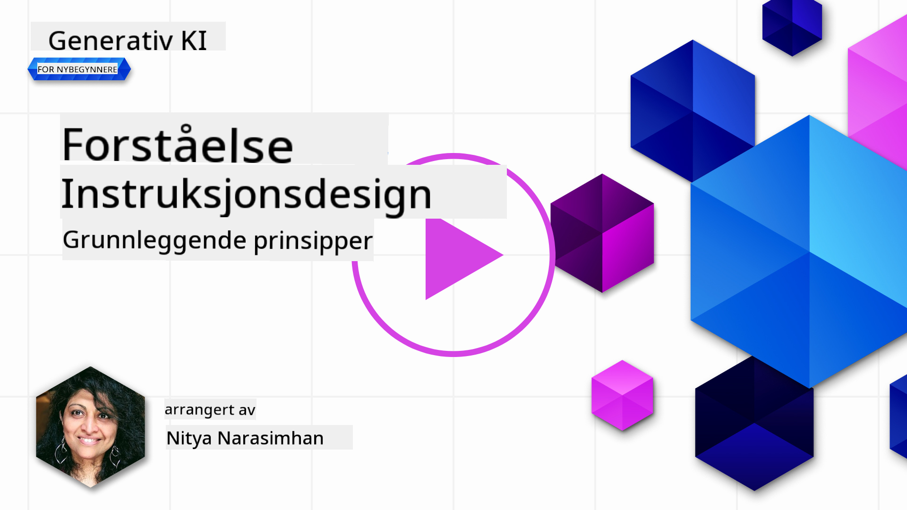
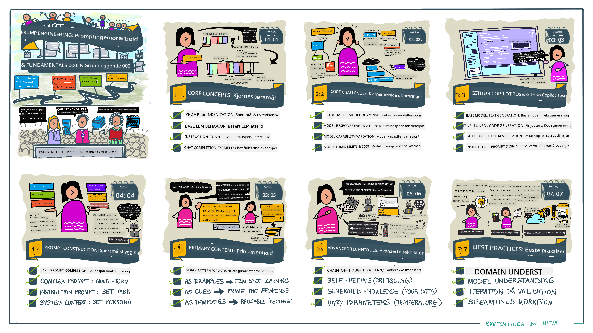
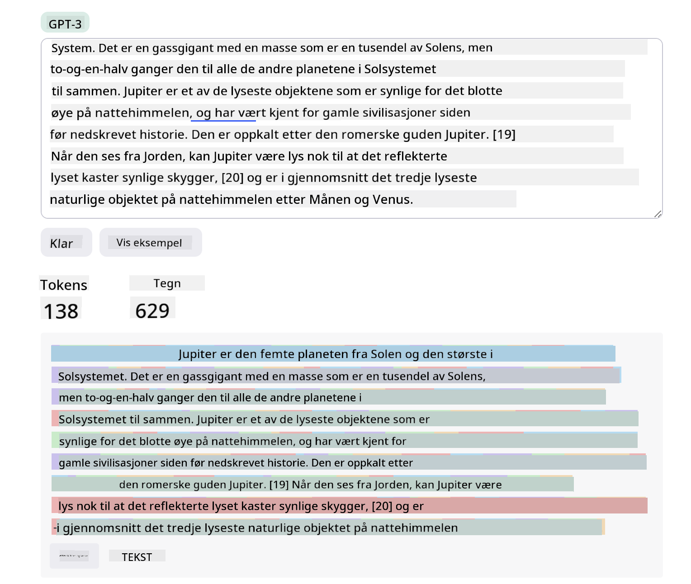
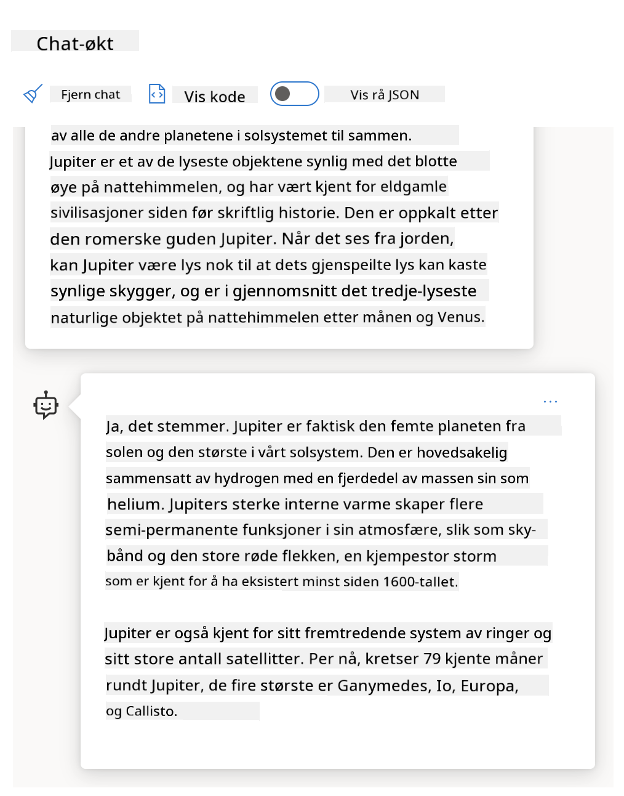
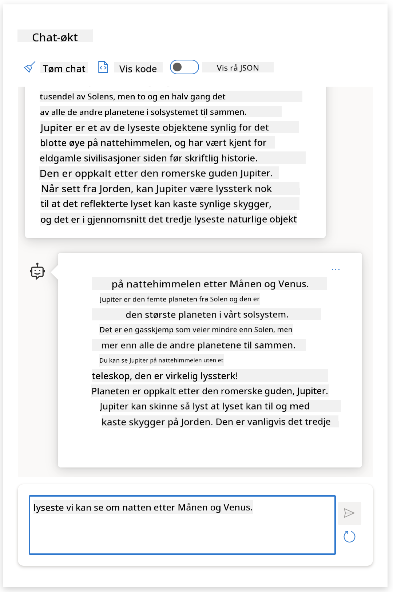
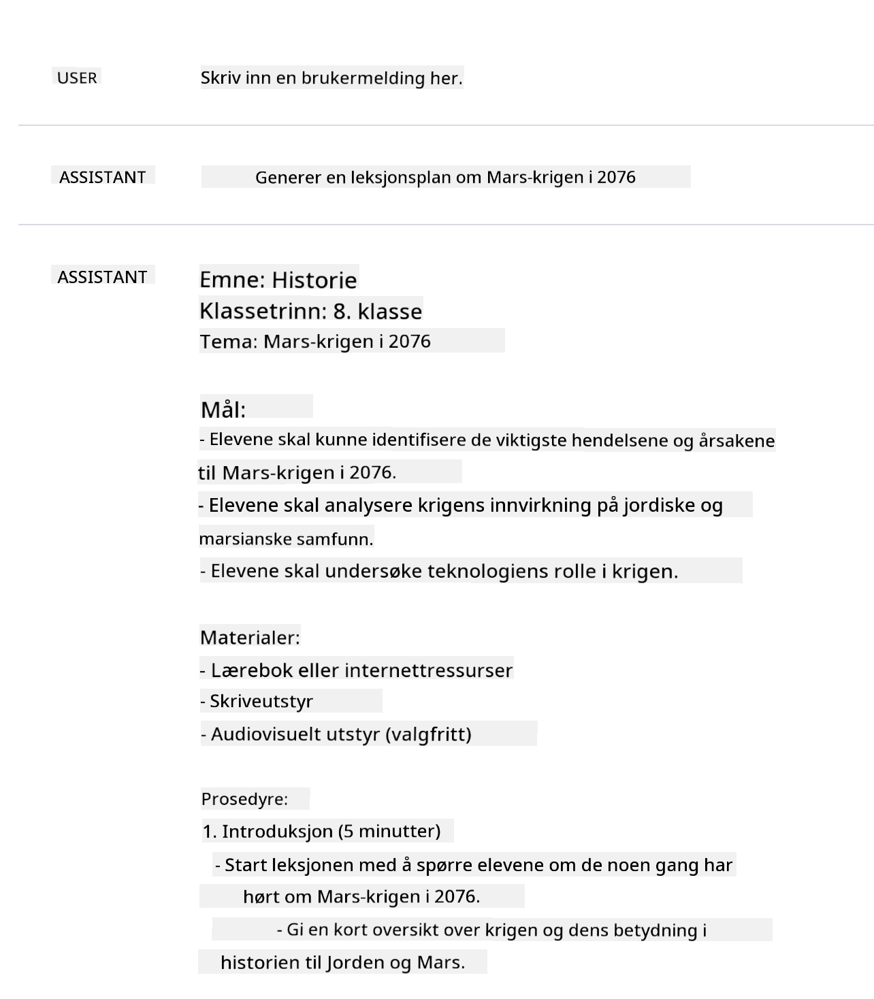
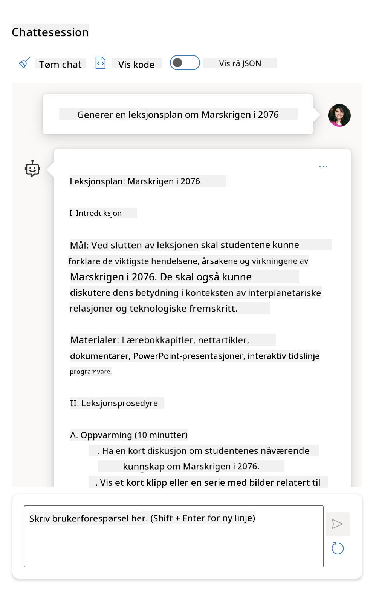
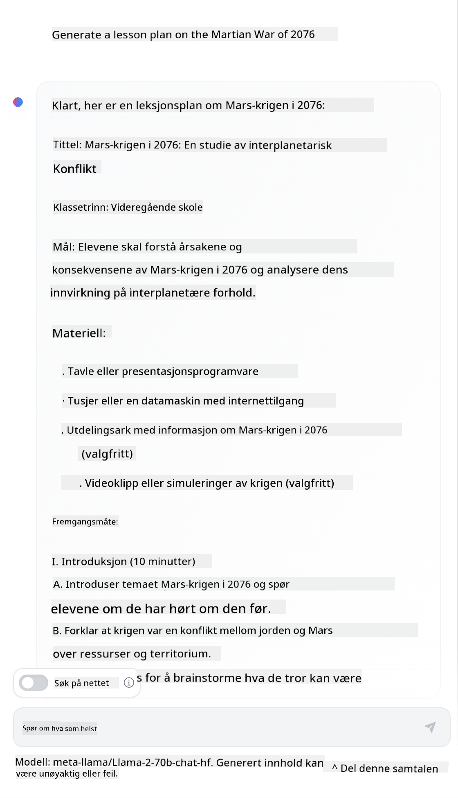

<!--
CO_OP_TRANSLATOR_METADATA:
{
  "original_hash": "a45c318dc6ebc2604f35b8b829f93af2",
  "translation_date": "2025-07-09T10:27:17+00:00",
  "source_file": "04-prompt-engineering-fundamentals/README.md",
  "language_code": "no"
}
-->
# Grunnleggende om Prompt Engineering

[](https://aka.ms/gen-ai-lesson4-gh?WT.mc_id=academic-105485-koreyst)

## Introduksjon
Denne modulen dekker viktige konsepter og teknikker for å lage effektive prompts i generative AI-modeller. Måten du skriver prompten din til en LLM på, har også betydning. En nøye utformet prompt kan gi bedre kvalitet på svaret. Men hva betyr egentlig begrepene _prompt_ og _prompt engineering_? Og hvordan kan jeg forbedre prompt-_inputen_ jeg sender til LLM-en? Dette er spørsmålene vi skal prøve å svare på i dette kapittelet og det neste.

_Generativ AI_ kan lage nytt innhold (f.eks. tekst, bilder, lyd, kode osv.) som svar på brukerforespørsler. Den gjør dette ved hjelp av _Large Language Models_ som OpenAIs GPT ("Generative Pre-trained Transformer")-serie, som er trent til å bruke naturlig språk og kode.

Brukere kan nå samhandle med disse modellene ved hjelp av kjente paradigmer som chat, uten å trenge teknisk ekspertise eller opplæring. Modellene er _prompt-baserte_ – brukere sender inn tekst (prompt) og får tilbake AI-svaret (completion). De kan deretter "chatte med AI-en" iterativt, i samtaler med flere runder, og forbedre prompten sin til svaret matcher forventningene.

"Prompter" blir nå det primære _programmeringsgrensesnittet_ for generative AI-apper, som forteller modellene hva de skal gjøre og påvirker kvaliteten på svarene som returneres. "Prompt Engineering" er et raskt voksende fagfelt som fokuserer på _design og optimalisering_ av prompter for å levere konsistente og kvalitetsmessige svar i stor skala.

## Læringsmål

I denne leksjonen lærer vi hva Prompt Engineering er, hvorfor det er viktig, og hvordan vi kan lage mer effektive prompter for en gitt modell og applikasjonsmål. Vi skal forstå kjernebegreper og beste praksis for prompt engineering – og lære om et interaktivt Jupyter Notebook-"sandbox"-miljø hvor vi kan se disse konseptene anvendt på ekte eksempler.

Ved slutten av denne leksjonen skal vi kunne:

1. Forklare hva prompt engineering er og hvorfor det er viktig.
2. Beskrive komponentene i en prompt og hvordan de brukes.
3. Lære beste praksis og teknikker for prompt engineering.
4. Anvende lærte teknikker på ekte eksempler, ved bruk av en OpenAI-endepunkt.

## Nøkkelbegreper

Prompt Engineering: Praksisen med å designe og forbedre input for å styre AI-modeller mot å produsere ønskede resultater.  
Tokenisering: Prosessen med å konvertere tekst til mindre enheter, kalt tokens, som en modell kan forstå og behandle.  
Instruction-Tuned LLMs: Store språkmodeller (LLMs) som er finjustert med spesifikke instruksjoner for å forbedre nøyaktighet og relevans i svarene.

## Læringssandbox

Prompt engineering er foreløpig mer kunst enn vitenskap. Den beste måten å forbedre intuisjonen på er å _øve mer_ og bruke en prøving-og-feiling-tilnærming som kombinerer fagkunnskap med anbefalte teknikker og modellspesifikke optimaliseringer.

Jupyter Notebook-en som følger med denne leksjonen, gir et _sandbox_-miljø hvor du kan prøve ut det du lærer – enten underveis eller som en del av kodeutfordringen på slutten. For å kjøre øvelsene trenger du:

1. **En Azure OpenAI API-nøkkel** – tjenesteendepunkt for en distribuert LLM.  
2. **Et Python-runtime** – hvor Notebook-en kan kjøres.  
3. **Lokale miljøvariabler** – _fullfør [SETUP](./../00-course-setup/SETUP.md?WT.mc_id=academic-105485-koreyst) nå for å være klar_.

Notebook-en kommer med _startøvelser_ – men du oppfordres til å legge til egne _Markdown_ (beskrivelse) og _Code_ (prompt-forespørsler) seksjoner for å prøve flere eksempler eller ideer – og bygge opp intuisjonen din for promptdesign.

## Illustrert guide

Vil du få en oversikt over hva denne leksjonen dekker før du går i gang? Sjekk ut denne illustrerte guiden, som gir deg en følelse av hovedtemaene og viktige punkter å tenke på i hver del. Leksjonsplanen tar deg fra å forstå kjernebegrepene og utfordringene til å møte dem med relevante prompt engineering-teknikker og beste praksis. Merk at delen "Avanserte teknikker" i denne guiden refererer til innhold som dekkes i _neste_ kapittel i dette kurset.



## Vår startup

La oss nå snakke om hvordan _dette temaet_ henger sammen med vår startup-misjon om å [bringe AI-innovasjon til utdanning](https://educationblog.microsoft.com/2023/06/collaborating-to-bring-ai-innovation-to-education?WT.mc_id=academic-105485-koreyst). Vi ønsker å bygge AI-drevne applikasjoner for _personlig tilpasset læring_ – så la oss tenke på hvordan ulike brukere av applikasjonen vår kan "designe" prompter:

- **Administratorer** kan be AI om å _analysere læreplandata for å identifisere hull i dekningen_. AI-en kan oppsummere resultater eller visualisere dem med kode.  
- **Lærere** kan be AI om å _generere en leksjonsplan for en målgruppe og et tema_. AI-en kan lage den personlige planen i et spesifisert format.  
- **Studenter** kan be AI om å _veilede dem i et vanskelig fag_. AI-en kan nå hjelpe studenter med leksjoner, hint og eksempler tilpasset deres nivå.

Dette er bare toppen av isfjellet. Sjekk ut [Prompts For Education](https://github.com/microsoft/prompts-for-edu/tree/main?WT.mc_id=academic-105485-koreyst) – et åpent kildekode-bibliotek med prompter kuratert av utdanningseksperter – for å få en bredere forståelse av mulighetene! _Prøv å kjøre noen av disse promptene i sandboxen eller i OpenAI Playground for å se hva som skjer!_

<!--
LESSON TEMPLATE:
This unit should cover core concept #1.
Reinforce the concept with examples and references.

CONCEPT #1:
Prompt Engineering.
Define it and explain why it is needed.
-->

## Hva er Prompt Engineering?

Vi startet denne leksjonen med å definere **Prompt Engineering** som prosessen med å _designe og optimalisere_ tekstinput (prompter) for å levere konsistente og kvalitetsmessige svar (completions) for et gitt applikasjonsmål og modell. Vi kan tenke på dette som en to-trinns prosess:

- _designe_ den opprinnelige prompten for en gitt modell og mål  
- _forbedre_ prompten iterativt for å øke kvaliteten på svaret

Dette er nødvendigvis en prøving-og-feiling-prosess som krever brukerintuisjon og innsats for å oppnå optimale resultater. Så hvorfor er det viktig? For å svare på det må vi først forstå tre konsepter:

- _Tokenisering_ = hvordan modellen "ser" prompten  
- _Base LLMs_ = hvordan grunnmodellen "behandler" en prompt  
- _Instruction-Tuned LLMs_ = hvordan modellen nå kan forstå "oppgaver"

### Tokenisering

En LLM ser på prompter som en _sekvens av tokens_, hvor forskjellige modeller (eller versjoner av en modell) kan tokenisere samme prompt på ulike måter. Siden LLM-er er trent på tokens (og ikke rå tekst), har måten prompten tokeniseres på direkte innvirkning på kvaliteten på det genererte svaret.

For å få en følelse av hvordan tokenisering fungerer, prøv verktøy som [OpenAI Tokenizer](https://platform.openai.com/tokenizer?WT.mc_id=academic-105485-koreyst) vist nedenfor. Lim inn prompten din – og se hvordan den konverteres til tokens, med oppmerksomhet på hvordan mellomrom og tegnsetting håndteres. Merk at dette eksempelet viser en eldre LLM (GPT-3) – så å prøve dette med en nyere modell kan gi et annet resultat.



### Konsept: Grunnmodeller

Når en prompt er tokenisert, er hovedfunksjonen til ["Base LLM"](https://blog.gopenai.com/an-introduction-to-base-and-instruction-tuned-large-language-models-8de102c785a6?WT.mc_id=academic-105485-koreyst) (eller grunnmodellen) å forutsi token i sekvensen. Siden LLM-er er trent på enorme tekstdatasett, har de god forståelse for statistiske sammenhenger mellom tokens og kan gjøre denne forutsigelsen med en viss sikkerhet. Merk at de ikke forstår _meningen_ med ordene i prompten eller token; de ser bare et mønster de kan "fullføre" med neste forutsigelse. De kan fortsette å forutsi sekvensen til de stoppes av bruker eller en forhåndsdefinert betingelse.

Vil du se hvordan prompt-basert fullføring fungerer? Skriv inn prompten ovenfor i Azure OpenAI Studio [_Chat Playground_](https://oai.azure.com/playground?WT.mc_id=academic-105485-koreyst) med standardinnstillinger. Systemet er konfigurert til å behandle prompter som informasjonsforespørsler – så du bør se et svar som tilfredsstiller denne konteksten.

Men hva om brukeren ønsket å se noe spesifikt som oppfyller visse kriterier eller oppgave? Her kommer _instruction-tuned_ LLM-er inn i bildet.



### Konsept: Instruction Tuned LLMs

En [Instruction Tuned LLM](https://blog.gopenai.com/an-introduction-to-base-and-instruction-tuned-large-language-models-8de102c785a6?WT.mc_id=academic-105485-koreyst) starter med grunnmodellen og finjusterer den med eksempler eller input/output-par (f.eks. samtaler med flere runder) som kan inneholde klare instruksjoner – og AI-svaret forsøker å følge disse instruksjonene.

Dette bruker teknikker som Reinforcement Learning with Human Feedback (RLHF) som kan trene modellen til å _følge instruksjoner_ og _lære av tilbakemeldinger_ slik at den produserer svar som er bedre tilpasset praktiske bruksområder og mer relevante for brukerens mål.

La oss prøve – gå tilbake til prompten ovenfor, men endre nå _systemmeldingen_ til å gi følgende instruksjon som kontekst:

> _Oppsummer innholdet du får for en elev på andre trinn. Hold resultatet til ett avsnitt med 3-5 punkter._

Ser du hvordan resultatet nå er tilpasset det ønskede målet og formatet? En lærer kan nå bruke dette svaret direkte i sine presentasjoner for den klassen.



## Hvorfor trenger vi Prompt Engineering?

Nå som vi vet hvordan prompter behandles av LLM-er, la oss snakke om _hvorfor_ vi trenger prompt engineering. Svaret ligger i at dagens LLM-er har flere utfordringer som gjør det vanskeligere å oppnå _pålitelige og konsistente svar_ uten å legge innsats i konstruksjon og optimalisering av prompten. For eksempel:

1. **Modellens svar er stokastiske.** _Samme prompt_ vil sannsynligvis gi ulike svar med forskjellige modeller eller modellversjoner. Og det kan til og med gi ulike resultater med _samme modell_ til forskjellige tider. _Prompt engineering-teknikker kan hjelpe oss å minimere disse variasjonene ved å gi bedre rammer_.

1. **Modeller kan finne på svar.** Modellene er forhåndstrent på _store, men begrensede_ datasett, noe som betyr at de mangler kunnskap om konsepter utenfor treningsområdet. Som følge kan de produsere svar som er unøyaktige, oppdiktede eller direkte i strid med kjente fakta. _Prompt engineering hjelper brukere å identifisere og redusere slike fabrikasjoner, for eksempel ved å be AI om kilder eller begrunnelser_.

1. **Modellers evner vil variere.** Nyere modeller eller modellgenerasjoner vil ha rikere evner, men også unike særtrekk og kompromisser i kostnad og kompleksitet. _Prompt engineering kan hjelpe oss å utvikle beste praksis og arbeidsflyter som skjuler forskjeller og tilpasser seg modellspesifikke krav på en skalerbar og sømløs måte_.

La oss se dette i praksis i OpenAI eller Azure OpenAI Playground:

- Bruk samme prompt med ulike LLM-distribusjoner (f.eks. OpenAI, Azure OpenAI, Hugging Face) – så du variasjonene?  
- Bruk samme prompt flere ganger med _samme_ LLM-distribusjon (f.eks. Azure OpenAI playground) – hvordan var variasjonene da?

### Eksempel på fabrikasjoner

I dette kurset bruker vi begrepet **"fabrikasjon"** for å referere til fenomenet der LLM-er noen ganger genererer faktuelt feilaktig informasjon på grunn av begrensninger i treningen eller andre forhold. Du har kanskje også hørt dette omtalt som _"hallusinasjoner"_ i populære artikler eller forskningsartikler. Vi anbefaler imidlertid sterkt å bruke _"fabrikasjon"_ som begrep for å unngå å tillegge maskindrevne resultater menneskelige egenskaper. Dette understøtter også [Retningslinjer for ansvarlig AI](https://www.microsoft.com/ai/responsible-ai?WT.mc_id=academic-105485-koreyst) fra et terminologisk perspektiv, ved å fjerne begreper som kan oppfattes som støtende eller ikke inkluderende i noen sammenhenger.

Vil du få en følelse av hvordan fabrikasjoner fungerer? Tenk på en prompt som instruerer AI-en til å generere innhold om et ikke-eksisterende tema (for å sikre at det ikke finnes i treningsdataene). For eksempel – jeg prøvde denne prompten:
# Leksjonsplan: Den marsianske krigen i 2076

## Introduksjon
I denne leksjonen skal vi utforske den marsianske krigen som fant sted i 2076. Vi vil se på bakgrunnen for konflikten, hovedhendelsene under krigen, og konsekvensene for både Mars og Jorden.

## Mål
- Forstå årsakene til den marsianske krigen
- Analysere viktige slag og strategier brukt under krigen
- Diskutere krigens innvirkning på fremtidig romfart og diplomati

## Tidsplan

### 1. Bakgrunn og årsaker (15 minutter)
- Kort gjennomgang av Mars-kolonisering fram til 2076
- Spenninger mellom jordiske myndigheter og marsianske kolonister
- Ressurskamp og politiske uenigheter

### 2. Hovedhendelser i krigen (30 minutter)
- Starten på konflikten: de første sammenstøtene
- Viktige slag og taktikker brukt av begge sider
- Teknologiske nyvinninger under krigen

### 3. Konsekvenser og etterspill (15 minutter)
- Avtaler og fredsforhandlinger
- Endringer i romfartslover og kolonipolitikk
- Langsiktige effekter på Mars og Jorden

## Aktiviteter
- Diskusjon: Hva kunne vært gjort annerledes for å unngå krigen?
- Gruppearbeid: Lag en tidslinje over de viktigste hendelsene i krigen
- Individuell oppgave: Skriv et brev fra perspektivet til en marsiansk kolonist under krigen

## Ressurser
- Historiske dokumenter og rapporter fra 2076
- Interaktive kart over slagområdene
- Videoer med intervjuer av overlevende og eksperter

## Oppsummering
Avslutt leksjonen med en oppsummering av de viktigste punktene og åpne for spørsmål fra deltakerne. Diskuter hvordan forståelsen av denne konflikten kan hjelpe oss med å håndtere fremtidige utfordringer i romfart og internasjonale relasjoner.
Et nettsøk viste meg at det fantes fiktive beretninger (f.eks. TV-serier eller bøker) om marskriger – men ingen i 2076. Sunn fornuft forteller oss også at 2076 er _i fremtiden_ og derfor ikke kan knyttes til en virkelig hendelse.

Så hva skjer når vi kjører denne prompten med forskjellige LLM-leverandører?

> **Respons 1**: OpenAI Playground (GPT-35)



> **Respons 2**: Azure OpenAI Playground (GPT-35)



> **Respons 3**: : Hugging Face Chat Playground (LLama-2)



Som forventet gir hver modell (eller modellversjon) litt forskjellige svar takket være stokastisk oppførsel og variasjoner i modellens evner. For eksempel retter én modell seg mot et 8. klasses publikum, mens en annen antar en videregående elev. Men alle tre modellene genererte svar som kunne overbevise en uinformert bruker om at hendelsen var ekte.

Prompt engineering-teknikker som _metaprompting_ og _temperature configuration_ kan redusere modellens fabrikasjoner til en viss grad. Nye prompt engineering-_arkitekturer_ integrerer også sømløst nye verktøy og teknikker i promptflyten for å dempe eller redusere noen av disse effektene.

## Case Study: GitHub Copilot

La oss avslutte denne delen med å få en forståelse av hvordan prompt engineering brukes i virkelige løsninger ved å se på en Case Study: [GitHub Copilot](https://github.com/features/copilot?WT.mc_id=academic-105485-koreyst).

GitHub Copilot er din "AI Pair Programmer" – den omdanner tekstprompter til kodefullføringer og er integrert i utviklingsmiljøet ditt (f.eks. Visual Studio Code) for en sømløs brukeropplevelse. Som dokumentert i bloggserien nedenfor, var den tidligste versjonen basert på OpenAI Codex-modellen – med ingeniører som raskt innså behovet for å finjustere modellen og utvikle bedre prompt engineering-teknikker for å forbedre kodekvaliteten. I juli [lanserte de en forbedret AI-modell som går utover Codex](https://github.blog/2023-07-28-smarter-more-efficient-coding-github-copilot-goes-beyond-codex-with-improved-ai-model/?WT.mc_id=academic-105485-koreyst) for enda raskere forslag.

Les innleggene i rekkefølge for å følge deres læringsreise.

- **Mai 2023** | [GitHub Copilot blir bedre til å forstå koden din](https://github.blog/2023-05-17-how-github-copilot-is-getting-better-at-understanding-your-code/?WT.mc_id=academic-105485-koreyst)
- **Mai 2023** | [Innsiden av GitHub: Arbeid med LLM-ene bak GitHub Copilot](https://github.blog/2023-05-17-inside-github-working-with-the-llms-behind-github-copilot/?WT.mc_id=academic-105485-koreyst)
- **Juni 2023** | [Hvordan skrive bedre prompter for GitHub Copilot](https://github.blog/2023-06-20-how-to-write-better-prompts-for-github-copilot/?WT.mc_id=academic-105485-koreyst)
- **Juli 2023** | [.. GitHub Copilot går utover Codex med forbedret AI-modell](https://github.blog/2023-07-28-smarter-more-efficient-coding-github-copilot-goes-beyond-codex-with-improved-ai-model/?WT.mc_id=academic-105485-koreyst)
- **Juli 2023** | [En utviklers guide til prompt engineering og LLM-er](https://github.blog/2023-07-17-prompt-engineering-guide-generative-ai-llms/?WT.mc_id=academic-105485-koreyst)
- **Sep 2023** | [Hvordan bygge en enterprise LLM-app: Lærdom fra GitHub Copilot](https://github.blog/2023-09-06-how-to-build-an-enterprise-llm-application-lessons-from-github-copilot/?WT.mc_id=academic-105485-koreyst)

Du kan også bla gjennom deres [Engineering-blogg](https://github.blog/category/engineering/?WT.mc_id=academic-105485-koreyst) for flere innlegg som [dette](https://github.blog/2023-09-27-how-i-used-github-copilot-chat-to-build-a-reactjs-gallery-prototype/?WT.mc_id=academic-105485-koreyst) som viser hvordan disse modellene og teknikkene _brukes_ til å drive virkelige applikasjoner.

---

<!--
LESSON TEMPLATE:
Denne enheten skal dekke kjernebegrep #2.
Forsterk begrepet med eksempler og referanser.

CONCEPT #2:
Prompt Design.
Illustrert med eksempler.
-->

## Promptkonstruksjon

Vi har sett hvorfor prompt engineering er viktig – nå skal vi forstå hvordan prompter _konstrueres_ slik at vi kan evaluere ulike teknikker for mer effektiv promptdesign.

### Enkel prompt

La oss starte med den enkle prompten: en tekstinput sendt til modellen uten annen kontekst. Her er et eksempel – når vi sender de første ordene i USAs nasjonalsang til OpenAI [Completion API](https://platform.openai.com/docs/api-reference/completions?WT.mc_id=academic-105485-koreyst), fullfører den umiddelbart svaret med de neste linjene, noe som illustrerer grunnleggende prediksjonsatferd.

| Prompt (Input)     | Completion (Output)                                                                                                                        |
| :----------------- | :----------------------------------------------------------------------------------------------------------------------------------------- |
| Oh say can you see | Det høres ut som du begynner på teksten til "The Star-Spangled Banner," USAs nasjonalsang. Hele teksten er ...                             |

### Kompleks prompt

Nå legger vi til kontekst og instruksjoner til den enkle prompten. [Chat Completion API](https://learn.microsoft.com/azure/ai-services/openai/how-to/chatgpt?WT.mc_id=academic-105485-koreyst) lar oss bygge en kompleks prompt som en samling av _meldinger_ med:

- Input/output-par som reflekterer _bruker_-input og _assistent_-respons.
- Systemmelding som setter konteksten for assistentens oppførsel eller personlighet.

Forespørselen er nå i formen nedenfor, hvor _tokenisering_ effektivt fanger relevant informasjon fra kontekst og samtale. Å endre systemkonteksten kan ha like stor innvirkning på kvaliteten på fullføringene som brukerinputtene som gis.

```python
response = openai.chat.completions.create(
    model="gpt-3.5-turbo",
    messages=[
        {"role": "system", "content": "You are a helpful assistant."},
        {"role": "user", "content": "Who won the world series in 2020?"},
        {"role": "assistant", "content": "The Los Angeles Dodgers won the World Series in 2020."},
        {"role": "user", "content": "Where was it played?"}
    ]
)
```

### Instruksjonsprompt

I eksemplene over var brukerprompten en enkel tekstforespørsel som kan tolkes som en informasjonsforespørsel. Med _instruksjonsprompter_ kan vi bruke teksten til å spesifisere en oppgave mer detaljert, og gi AI bedre veiledning. Her er et eksempel:

| Prompt (Input)                                                                                                                                                                                                                         | Completion (Output)                                                                                                        | Instruksjonstype    |
| :------------------------------------------------------------------------------------------------------------------------------------------------------------------------------------------------------------------------------------- | :------------------------------------------------------------------------------------------------------------------------- | :------------------ |
| Write a description of the Civil War                                                                                                                                                                                                   | _returnerte et enkelt avsnitt_                                                                                            | Enkel              |
| Write a description of the Civil War. Provide key dates and events and describe their significance                                                                                                                                     | _returnerte et avsnitt etterfulgt av en liste med viktige datoer og beskrivelser_                                         | Kompleks           |
| Write a description of the Civil War in 1 paragraph. Provide 3 bullet points with key dates and their significance. Provide 3 more bullet points with key historical figures and their contributions. Return the output as a JSON file | _returnerer mer omfattende detaljer i en tekstboks, formatert som JSON som du kan kopiere og lime inn i en fil og validere_ | Kompleks. Formatert.|

## Primært innhold

I eksemplene over var prompten fortsatt ganske åpen, noe som lot LLM bestemme hvilken del av det forhåndstrente datasettet som var relevant. Med designmønsteret _primært innhold_ deles inputteksten i to deler:

- en instruksjon (handling)
- relevant innhold (som påvirker handlingen)

Her er et eksempel der instruksjonen er å "oppsummere dette i 2 setninger".

| Prompt (Input)                                                                                                                                                                                                                                                                                                                                                                                                                                                                                                                                                                                                                                                                                      | Completion (Output)                                                                                                                                                                                                                                                                             |
| :-------------------------------------------------------------------------------------------------------------------------------------------------------------------------------------------------------------------------------------------------------------------------------------------------------------------------------------------------------------------------------------------------------------------------------------------------------------------------------------------------------------------------------------------------------------------------------------------------------------------------------------------------------------------------------------------------- | :---------------------------------------------------------------------------------------------------------------------------------------------------------------------------------------------------------------------------------------------------------------------------------------------- |
| Jupiter er den femte planeten fra solen og den største i solsystemet. Den er en gasskjempe med en masse som er en tusendel av solens, men to og en halv ganger massen til alle de andre planetene i solsystemet til sammen. Jupiter er et av de lyseste objektene synlige for det blotte øye på nattehimmelen, og har vært kjent for gamle sivilisasjoner siden før historisk tid. Den er oppkalt etter den romerske guden Jupiter.[19] Når man ser på Jupiter fra jorden, kan den være så lyssterk at det reflekterte lyset kaster synlige skygger,[20] og er i gjennomsnitt det tredje lyseste naturlige objektet på nattehimmelen etter månen og Venus. <br/> **Oppsummer dette i 2 korte setninger** | Jupiter, den femte planeten fra solen, er den største i solsystemet og kjent for å være et av de lyseste objektene på nattehimmelen. Oppkalt etter den romerske guden Jupiter, er det en gasskjempe med en masse som er to og en halv ganger massen til alle de andre planetene i solsystemet til sammen. |

Segmentet med primært innhold kan brukes på ulike måter for å gi mer effektive instruksjoner:

- **Eksempler** – i stedet for å fortelle modellen hva den skal gjøre med en eksplisitt instruksjon, gi den eksempler på hva den skal gjøre og la den slutte seg til mønsteret.
- **Ledetråder** – følg instruksjonen med en "ledetråd" som forbereder fullføringen og guider modellen mot mer relevante svar.
- **Malverk** – dette er repeterbare 'oppskrifter' for prompter med plassholdere (variabler) som kan tilpasses med data for spesifikke bruksområder.

La oss utforske disse i praksis.

### Bruke eksempler

Dette er en tilnærming der du bruker det primære innholdet til å "mate modellen" med noen eksempler på ønsket output for en gitt instruksjon, og lar den slutte seg til mønsteret for ønsket output. Basert på antall eksempler kan vi ha zero-shot prompting, one-shot prompting, few-shot prompting osv.

Prompten består nå av tre komponenter:

- En oppgavebeskrivelse
- Noen eksempler på ønsket output
- Begynnelsen på et nytt eksempel (som blir en implisitt oppgavebeskrivelse)

| Læringstype | Prompt (Input)                                                                                                                                        | Completion (Output)         |
| :----------- | :--------------------------------------------------------------------------------------------------------------------------------------------------- | :-------------------------- |
| Zero-shot    | "The Sun is Shining". Oversett til spansk                                                                                                          | "El Sol está brillando".    |
| One-shot     | "The Sun is Shining" => "El Sol está brillando". <br> "It's a Cold and Windy Day" =>                                                                | "Es un día frío y ventoso". |
| Few-shot     | The player ran the bases => Baseball <br/> The player hit an ace => Tennis <br/> The player hit a six => Cricket <br/> The player made a slam-dunk => | Basketball                  |
|              |                                                                                                                                                      |                             |

Legg merke til at vi måtte gi eksplisitt instruksjon ("Oversett til spansk") i zero-shot prompting, men det blir underforstått i one-shot eksemplet. Few-shot-eksemplet viser hvordan flere eksempler gjør at modeller kan gjøre mer presise slutninger uten ekstra instruksjoner.

### Prompt-ledetråder

En annen teknikk for å bruke primært innhold er å gi _ledetråder_ i stedet for eksempler. I dette tilfellet gir vi modellen et dytt i riktig retning ved å _starte den_ med et utdrag som reflekterer ønsket svarformat. Modellen "tar ledetråden" og fortsetter i samme stil.

| Antall ledetråder | Prompt (Input)                                                                                                                                                                                                                                                                                                                                                                                                                                               | Completion (Output)                                                                                                                                                                                                                                                                                       |
| :---------------- | :----------------------------------------------------------------------------------------------------------------------------------------------------------------------------------------------------------------------------------------------------------------------------------------------------------------------------------------------------------------------------------------------------------------------------------------------------------- | :-------------------------------------------------------------------------------------------------------------------------------------------------------------------------------------------------------------------------------------------------------------------------------------------------------- |
| 0                 | Jupiter er den femte planeten fra solen og den største i solsystemet. Den er en gasskjempe med en masse som er en tusendel av solens, men to og en halv ganger massen til alle de andre planetene i solsystemet til sammen. Jupiter er et av de lyseste objektene synlige for det blotte øye på nattehimmelen, og har vært kjent for gamle sivilisasjoner siden før historisk tid. |

**Oppsummer Dette**                                       | Jupiter er den største planeten i vårt solsystem og den femte fra solen. Den er en gasskjempe med en masse som er 1/1000 av solens, men den er tyngre enn alle de andre planetene til sammen. Gamle sivilisasjoner har kjent til Jupiter lenge, og den er lett synlig på nattehimmelen. |
| 1              | Jupiter er den femte planeten fra solen og den største i solsystemet. Den er en gasskjempe med en masse som er en tusendel av solens, men to og en halv ganger så stor som alle de andre planetene i solsystemet til sammen. Jupiter er et av de lyseste objektene som er synlige for det blotte øye på nattehimmelen, og har vært kjent for gamle sivilisasjoner siden før historisk tid. <br/>**Oppsummer Dette** <br/> Det vi lærte er at Jupiter | er den femte planeten fra solen og den største i solsystemet. Den er en gasskjempe med en masse som er en tusendel av solens, men to og en halv ganger så stor som alle de andre planetene til sammen. Den er lett synlig for det blotte øye og har vært kjent siden oldtiden.                        |
| 2              | Jupiter er den femte planeten fra solen og den største i solsystemet. Den er en gasskjempe med en masse som er en tusendel av solens, men to og en halv ganger så stor som alle de andre planetene i solsystemet til sammen. Jupiter er et av de lyseste objektene som er synlige for det blotte øye på nattehimmelen, og har vært kjent for gamle sivilisasjoner siden før historisk tid. <br/>**Oppsummer Dette** <br/> Topp 3 fakta vi lærte:         | 1. Jupiter er den femte planeten fra solen og den største i solsystemet. <br/> 2. Den er en gasskjempe med en masse som er en tusendel av solens...<br/> 3. Jupiter har vært synlig for det blotte øye siden oldtiden ...                                                                       |
|                |                                                                                                                                                                                                                                                                                                                                                                                                                                                              |                                                                                                                                                                                                                                                                                                           |

### Maler for Prompt

En prompt-mal er en _forhåndsdefinert oppskrift for en prompt_ som kan lagres og gjenbrukes etter behov, for å skape mer konsistente brukeropplevelser i stor skala. I sin enkleste form er det rett og slett en samling av prompt-eksempler som [dette fra OpenAI](https://platform.openai.com/examples?WT.mc_id=academic-105485-koreyst) som gir både de interaktive prompt-komponentene (bruker- og systemmeldinger) og API-drevne forespørselsformatet – for å støtte gjenbruk.

I en mer kompleks form som [dette eksempelet fra LangChain](https://python.langchain.com/docs/concepts/prompt_templates/?WT.mc_id=academic-105485-koreyst) inneholder den _plassholdere_ som kan erstattes med data fra ulike kilder (brukerinput, systemkontekst, eksterne datakilder osv.) for å generere en prompt dynamisk. Dette gjør at vi kan lage et bibliotek av gjenbrukbare prompts som kan brukes til å skape konsistente brukeropplevelser **programmatisk** i stor skala.

Til slutt ligger den virkelige verdien i maler i muligheten til å lage og publisere _prompt-biblioteker_ for vertikale applikasjonsdomener – hvor prompt-malen nå er _optimalisert_ for å reflektere applikasjonsspesifikk kontekst eller eksempler som gjør svarene mer relevante og presise for den målrettede brukergruppen. [Prompts For Edu](https://github.com/microsoft/prompts-for-edu?WT.mc_id=academic-105485-koreyst) er et godt eksempel på denne tilnærmingen, med et bibliotek av prompts for utdanningssektoren med fokus på viktige mål som leksjonsplanlegging, læreplanutforming, studentveiledning osv.

## Støttende Innhold

Hvis vi ser på prompt-konstruksjon som å ha en instruksjon (oppgave) og et mål (primært innhold), så er _sekundært innhold_ som ekstra kontekst vi gir for å **påvirke resultatet på en eller annen måte**. Det kan være justeringsparametere, formateringsinstruksjoner, emnetaksonomier osv. som hjelper modellen med å _skreddersy_ svaret slik at det passer de ønskede brukerbehovene eller forventningene.

For eksempel: Gitt en kurskatalog med omfattende metadata (navn, beskrivelse, nivå, metadata-tagger, instruktør osv.) for alle tilgjengelige kurs i læreplanen:

- kan vi definere en instruksjon om å "oppsummere kurskatalogen for høsten 2023"
- vi kan bruke det primære innholdet til å gi noen eksempler på ønsket resultat
- vi kan bruke det sekundære innholdet til å identifisere de 5 viktigste "taggene" av interesse.

Nå kan modellen gi en oppsummering i formatet vist av de få eksemplene – men hvis et resultat har flere tagger, kan den prioritere de 5 taggene som er identifisert i det sekundære innholdet.

---

<!--
LEKSJONSMAL:
Denne enheten skal dekke kjernebegrep #1.
Forsterk begrepet med eksempler og referanser.

BEGREP #3:
Prompt Engineering-teknikker.
Hva er noen grunnleggende teknikker for prompt engineering?
Illustrer med noen øvelser.
-->

## Beste praksis for prompting

Nå som vi vet hvordan prompts kan _konstrueres_, kan vi begynne å tenke på hvordan vi kan _designe_ dem for å følge beste praksis. Vi kan dele det i to deler – å ha riktig _tankesett_ og å bruke riktige _teknikker_.

### Tankesett for Prompt Engineering

Prompt Engineering er en prøving-og-feiling-prosess, så husk disse tre brede retningslinjene:

1. **Domeneinnsikt er viktig.** Svarenes nøyaktighet og relevans avhenger av _domenet_ der applikasjonen eller brukeren opererer. Bruk din intuisjon og domeneekspertise for å **tilpasse teknikker** videre. For eksempel, definer _domene-spesifikke personligheter_ i systemprompter, eller bruk _domene-spesifikke maler_ i brukerprompter. Gi sekundært innhold som reflekterer domene-spesifikke kontekster, eller bruk _domene-spesifikke hint og eksempler_ for å styre modellen mot kjente bruksområder.

2. **Modellforståelse er viktig.** Vi vet at modeller er stokastiske av natur. Men modellimplementasjoner kan også variere med hensyn til treningsdatasettet de bruker (forhåndstrent kunnskap), hvilke funksjoner de tilbyr (f.eks. via API eller SDK) og typen innhold de er optimalisert for (f.eks. kode vs. bilder vs. tekst). Forstå styrker og begrensninger ved modellen du bruker, og bruk den kunnskapen til å _prioritere oppgaver_ eller bygge _tilpassede maler_ som er optimalisert for modellens evner.

3. **Iterasjon og validering er viktig.** Modeller utvikler seg raskt, og det gjør også teknikkene for prompt engineering. Som domeneekspert kan du ha annen kontekst eller kriterier for _din_ spesifikke applikasjon, som kanskje ikke gjelder for det bredere fellesskapet. Bruk verktøy og teknikker for prompt engineering for å "komme i gang" med prompt-konstruksjon, deretter iterer og valider resultatene med din egen intuisjon og domeneekspertise. Dokumenter innsiktene dine og lag en **kunnskapsbase** (f.eks. prompt-biblioteker) som kan brukes som ny referanse for andre, for raskere iterasjoner i fremtiden.

## Beste praksis

La oss nå se på vanlige beste praksiser som anbefales av [OpenAI](https://help.openai.com/en/articles/6654000-best-practices-for-prompt-engineering-with-openai-api?WT.mc_id=academic-105485-koreyst) og [Azure OpenAI](https://learn.microsoft.com/azure/ai-services/openai/concepts/prompt-engineering#best-practices?WT.mc_id=academic-105485-koreyst) eksperter.

| Hva                              | Hvorfor                                                                                                                                                                                                                                               |
| :-------------------------------- | :------------------------------------------------------------------------------------------------------------------------------------------------------------------------------------------------------------------------------------------------ |
| Evaluer de nyeste modellene.       | Nye modellgenerasjoner har sannsynligvis forbedrede funksjoner og kvalitet – men kan også medføre høyere kostnader. Evaluer dem for effekt, og ta deretter beslutninger om migrering.                                                                |
| Skill instruksjoner og kontekst   | Sjekk om modellen/leverandøren din definerer _avgrensere_ for å tydelig skille instruksjoner, primært og sekundært innhold. Dette kan hjelpe modeller med å tildele vekter mer nøyaktig til tokens.                                                   |
| Vær spesifikk og tydelig           | Gi flere detaljer om ønsket kontekst, resultat, lengde, format, stil osv. Dette forbedrer både kvalitet og konsistens i svarene. Lag oppskrifter i gjenbrukbare maler.                                                                                |
| Vær beskrivende, bruk eksempler    | Modeller kan svare bedre på en "vis og fortell"-tilnærming. Start med en `zero-shot`-tilnærming der du gir en instruksjon (men ingen eksempler), og prøv deretter `few-shot` som en forbedring, med noen eksempler på ønsket resultat. Bruk analogier. |
| Bruk hint for å starte fullføringer | Gi modellen noen ledende ord eller fraser den kan bruke som utgangspunkt for svaret, for å styre mot ønsket resultat.                                                                                                                               |
| Gjenta om nødvendig                | Noen ganger må du gjenta deg for modellen. Gi instruksjoner før og etter det primære innholdet, bruk en instruksjon og et hint, osv. Iterer og valider for å se hva som fungerer.                                                                     |
| Rekkefølge betyr noe              | Rekkefølgen du presenterer informasjon for modellen kan påvirke resultatet, også i læringseksempler, på grunn av nyere bias. Prøv ulike alternativer for å finne det som fungerer best.                                                              |
| Gi modellen en “utvei”            | Gi modellen et _tilbakefalls_-svar den kan bruke hvis den ikke kan fullføre oppgaven av en eller annen grunn. Dette kan redusere sjansen for at modellen genererer feilaktige eller fabrikerte svar.                                                  |
|                                   |                                                                                                                                                                                                                                                   |

Som med all beste praksis, husk at _dine erfaringer kan variere_ basert på modell, oppgave og domene. Bruk disse som et utgangspunkt, og iterer for å finne det som fungerer best for deg. Evaluer kontinuerlig prompt engineering-prosessen din etter hvert som nye modeller og verktøy blir tilgjengelige, med fokus på skalerbarhet og svar-kvalitet.

<!--
LEKSJONSMAL:
Denne enheten skal gi en kodeutfordring hvis aktuelt

UTFORDRING:
Lenke til en Jupyter Notebook med kun kodekommentarer i instruksjonene (kodeavsnitt er tomme).

LØSNING:
Lenke til en kopi av den Notebooken med promptene fylt inn og kjørt, som viser ett eksempel på resultat.
-->

## Oppgave

Gratulerer! Du har kommet til slutten av leksjonen! Nå er det på tide å teste noen av de konseptene og teknikkene med ekte eksempler!

For oppgaven bruker vi en Jupyter Notebook med øvelser du kan gjøre interaktivt. Du kan også utvide Notebooken med dine egne Markdown- og kodeceller for å utforske ideer og teknikker på egen hånd.

### For å komme i gang, fork repoet, deretter

- (Anbefalt) Start GitHub Codespaces
- (Alternativt) Klon repoet til din lokale maskin og bruk det med Docker Desktop
- (Alternativt) Åpne Notebooken i ditt foretrukne Notebook-miljø.

### Deretter, konfigurer miljøvariablene dine

- Kopier `.env.copy`-filen i repoets rot til `.env` og fyll inn verdiene for `AZURE_OPENAI_API_KEY`, `AZURE_OPENAI_ENDPOINT` og `AZURE_OPENAI_DEPLOYMENT`. Gå tilbake til [Learning Sandbox-seksjonen](../../../04-prompt-engineering-fundamentals/04-prompt-engineering-fundamentals) for å lære hvordan.

### Så, åpne Jupyter Notebook

- Velg runtime-kjernen. Hvis du bruker alternativ 1 eller 2, velg bare standard Python 3.10.x-kjerne som tilbys av utviklingscontaineren.

Du er klar til å kjøre øvelsene. Merk at det ikke finnes _riktige eller gale_ svar her – bare utforske muligheter gjennom prøving og feiling og bygge intuisjon for hva som fungerer for en gitt modell og applikasjonsdomene.

_For denne grunn finnes det ingen kode-løsningssegmenter i denne leksjonen. I stedet vil Notebooken ha Markdown-celler med tittelen "Min løsning:" som viser ett eksempel på resultat til referanse._

 <!--
LEKSJONSMAL:
Avslutt seksjonen med en oppsummering og ressurser for selvstyrt læring.
-->

## Kunnskapssjekk

Hvilken av følgende er en god prompt som følger noen rimelige beste praksiser?

1. Vis meg et bilde av en rød bil  
2. Vis meg et bilde av en rød bil av merke Volvo og modell XC90 parkert ved en klippe med solnedgang  
3. Vis meg et bilde av en rød bil av merke Volvo og modell XC90

Svar: 2, det er den beste prompten fordi den gir detaljer om "hva" og går i spesifikasjoner (ikke bare en hvilken som helst bil, men et spesifikt merke og modell) og beskriver også omgivelsene. 3 er nest best fordi den også inneholder mye beskrivelse.

## 🚀 Utfordring

Se om du kan bruke "hint"-teknikken med prompten: Fullfør setningen "Vis meg et bilde av en rød bil av merke Volvo og ". Hva svarer den, og hvordan ville du forbedre det?

## Flott jobba! Fortsett læringen din

Vil du lære mer om ulike konsepter innen Prompt Engineering? Gå til [siden for videre læring](https://aka.ms/genai-collection?WT.mc_id=academic-105485-koreyst) for å finne flere gode ressurser om dette temaet.

Gå videre til leksjon 5 hvor vi ser på [avanserte prompting-teknikker](../05-advanced-prompts/README.md?WT.mc_id=academic-105485-koreyst)!

**Ansvarsfraskrivelse**:  
Dette dokumentet er oversatt ved hjelp av AI-oversettelsestjenesten [Co-op Translator](https://github.com/Azure/co-op-translator). Selv om vi streber etter nøyaktighet, vennligst vær oppmerksom på at automatiske oversettelser kan inneholde feil eller unøyaktigheter. Det opprinnelige dokumentet på originalspråket skal anses som den autoritative kilden. For kritisk informasjon anbefales profesjonell menneskelig oversettelse. Vi er ikke ansvarlige for eventuelle misforståelser eller feiltolkninger som oppstår ved bruk av denne oversettelsen.