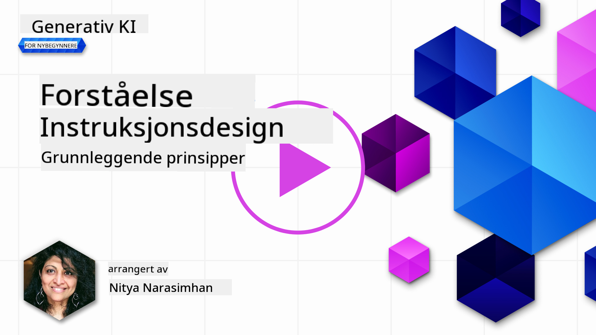
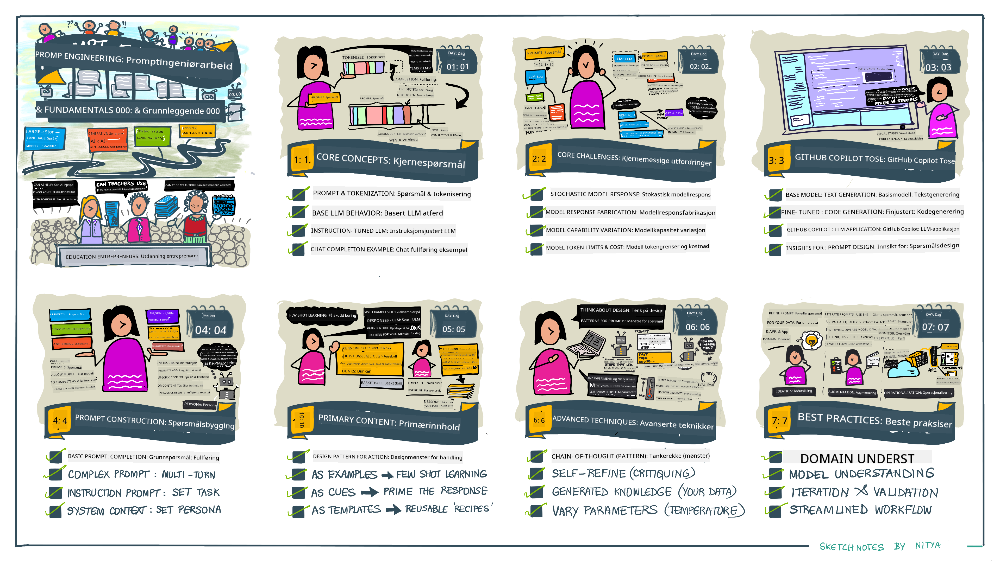
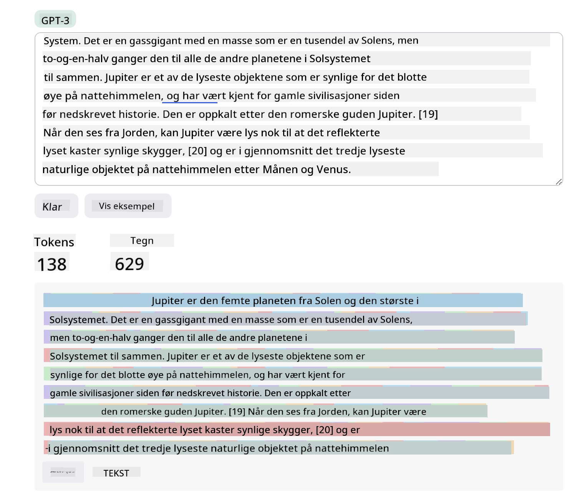
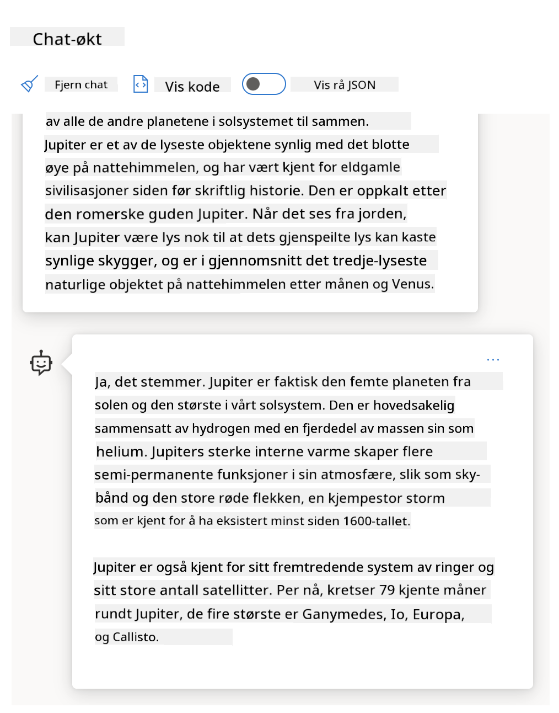
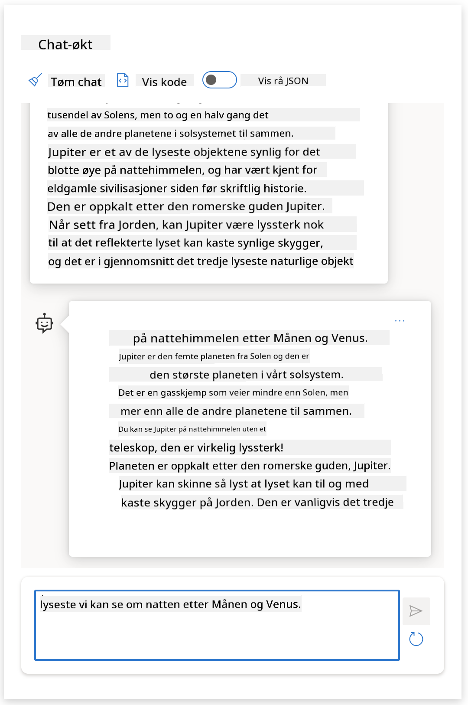
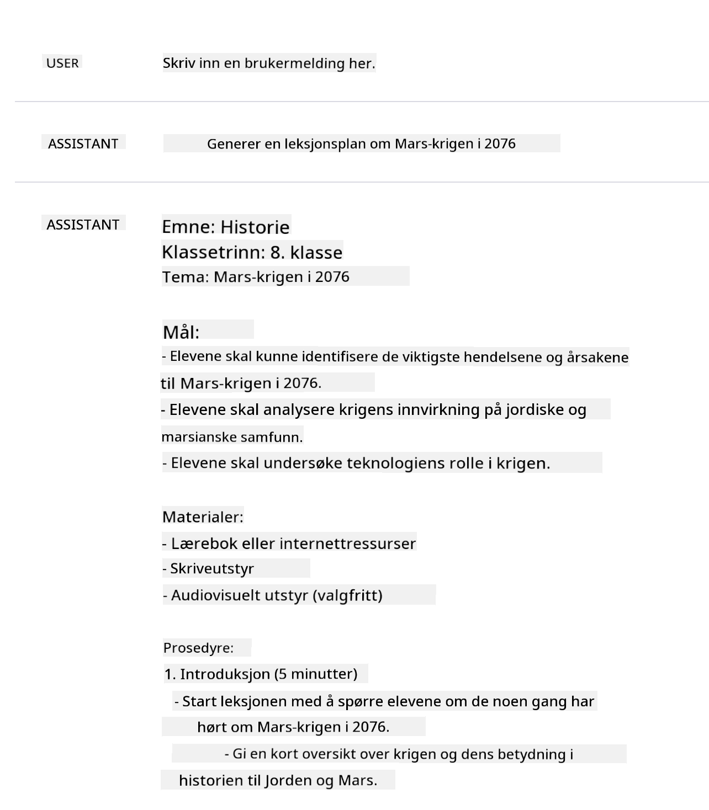
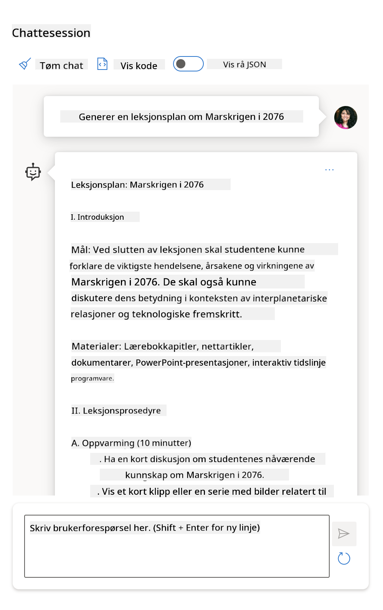
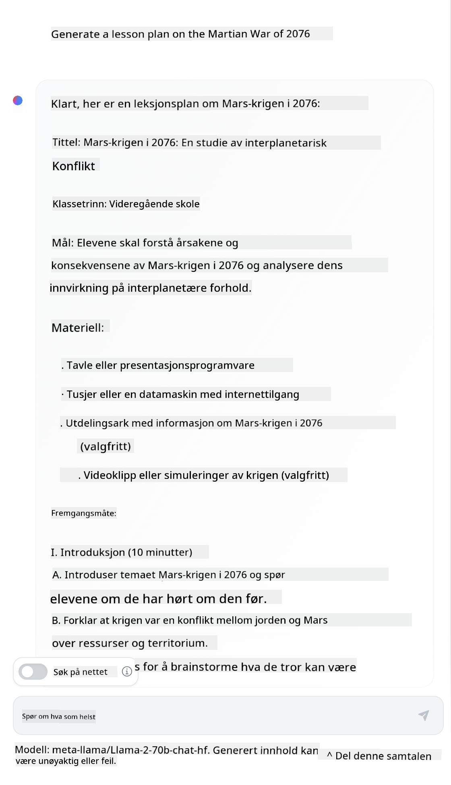

<!--
CO_OP_TRANSLATOR_METADATA:
{
  "original_hash": "a45c318dc6ebc2604f35b8b829f93af2",
  "translation_date": "2025-06-25T12:53:55+00:00",
  "source_file": "04-prompt-engineering-fundamentals/README.md",
  "language_code": "no"
}
-->
# Grunnleggende om Prompt Engineering

## Introduksjon
Denne modulen dekker essensielle konsepter og teknikker for å lage effektive prompts i generative AI-modeller. Måten du skriver din prompt til en LLM er også viktig. En nøye utformet prompt kan gi bedre kvalitet på svaret. Men hva betyr egentlig begreper som _prompt_ og _prompt engineering_? Og hvordan kan jeg forbedre prompt _inputen_ som jeg sender til LLM-en? Dette er spørsmålene vi vil forsøke å besvare i dette kapittelet og det neste.

_Generativ AI_ er i stand til å skape nytt innhold (f.eks. tekst, bilder, lyd, kode osv.) som svar på brukerforespørsler. Den oppnår dette ved å bruke _Large Language Models_ som OpenAIs GPT ("Generative Pre-trained Transformer")-serie som er trent for å bruke naturlig språk og kode.

Brukere kan nå samhandle med disse modellene ved hjelp av kjente paradigmer som chat, uten å trenge teknisk ekspertise eller opplæring. Modellene er _prompt-baserte_ - brukere sender en tekstinput (prompt) og får tilbake AI-responsen (completion). De kan deretter "chatte med AI" iterativt, i samtaler over flere omganger, og finjustere prompten til responsen matcher deres forventninger.

"Prompts" blir nå det primære _programmeringsgrensesnittet_ for generative AI-applikasjoner, som forteller modellene hva de skal gjøre og påvirker kvaliteten på de returnerte responsene. "Prompt Engineering" er et raskt voksende studieområde som fokuserer på _design og optimalisering_ av prompts for å levere konsistente og kvalitetsresponser i stor skala.

## Læringsmål

I denne leksjonen lærer vi hva Prompt Engineering er, hvorfor det er viktig, og hvordan vi kan lage mer effektive prompts for en gitt modell og applikasjonsmål. Vi vil forstå kjernebegreper og beste praksiser for prompt engineering - og lære om et interaktivt Jupyter Notebooks "sandbox"-miljø der vi kan se disse konseptene anvendt på virkelige eksempler.

Ved slutten av denne leksjonen vil vi kunne:

1. Forklare hva prompt engineering er og hvorfor det er viktig.
2. Beskrive komponentene i en prompt og hvordan de brukes.
3. Lære beste praksiser og teknikker for prompt engineering.
4. Anvende lærte teknikker på virkelige eksempler, ved å bruke en OpenAI-endepunkt.

## Nøkkelbegreper

Prompt Engineering: Praksisen med å designe og finjustere input for å veilede AI-modeller mot å produsere ønskede utganger.
Tokenisering: Prosessen med å konvertere tekst til mindre enheter, kalt tokens, som en modell kan forstå og behandle.
Instruksjonsjusterte LLM-er: Store språkmodeller (LLM-er) som har blitt finjustert med spesifikke instruksjoner for å forbedre deres responsnøyaktighet og relevans.

## Lærings Sandbox

Prompt engineering er foreløpig mer kunst enn vitenskap. Den beste måten å forbedre vår intuisjon for det på er å _øve mer_ og ta i bruk en prøving-og-feiling-tilnærming som kombinerer applikasjonsdomeinkunnskap med anbefalte teknikker og modellspecifikke optimaliseringer.

Jupyter Notebook som følger med denne leksjonen gir et _sandbox_-miljø der du kan prøve ut det du lærer - underveis eller som en del av kodeutfordringen på slutten. For å utføre øvelsene, vil du trenge:

1. **En Azure OpenAI API-nøkkel** - tjenesteendepunktet for en distribuert LLM.
2. **Et Python-runtime** - der Noteboken kan kjøres.
3. **Lokale miljøvariabler** - _fullfør [SETUP](./../00-course-setup/SETUP.md?WT.mc_id=academic-105485-koreyst) trinnene nå for å bli klar_.

Noteboken kommer med _startøvelser_ - men du oppfordres til å legge til dine egne _Markdown_ (beskrivelse) og _Kode_ (prompt-forespørsler) seksjoner for å prøve ut flere eksempler eller ideer - og bygge din intuisjon for promptdesign.

## Illustrert veiledning

Vil du få oversikten over hva denne leksjonen dekker før du dykker inn? Sjekk ut denne illustrerte veiledningen, som gir deg en følelse av hovedtemaene som dekkes og de viktigste punktene for deg å tenke på i hver enkelt. Leksjonskartet tar deg fra å forstå kjernebegrepene og utfordringene til å adressere dem med relevante prompt engineering-teknikker og beste praksiser. Merk at "Avanserte teknikker"-seksjonen i denne veiledningen refererer til innhold dekket i _neste_ kapittel av dette pensumet.

## Vår Startup

La oss nå snakke om hvordan _dette emnet_ forholder seg til vår oppstartsmisjon om å [bringe AI-innovasjon til utdanning](https://educationblog.microsoft.com/2023/06/collaborating-to-bring-ai-innovation-to-education?WT.mc_id=academic-105485-koreyst). Vi ønsker å bygge AI-drevne applikasjoner for _personlig læring_ - så la oss tenke på hvordan ulike brukere av vår applikasjon kan "designe" prompts:

- **Administratorer** kan be AI om å _analysere læreplanens data for å identifisere hull i dekningen_. AI kan oppsummere resultater eller visualisere dem med kode.
- **Lærere** kan be AI om å _generere en leksjonsplan for en målgruppe og et emne_. AI kan bygge den personlige planen i et spesifisert format.
- **Studenter** kan be AI om å _tutore dem i et vanskelig emne_. AI kan nå veilede studenter med leksjoner, hint og eksempler tilpasset deres nivå.

Dette er bare toppen av isfjellet. Sjekk ut [Prompts For Education](https://github.com/microsoft/prompts-for-edu/tree/main?WT.mc_id=academic-105485-koreyst) - et åpen kildekode-bibliotek med prompts kuratert av utdanningseksperter - for å få en bredere forståelse av mulighetene! _Prøv å kjøre noen av disse promptsene i sandboxen eller ved å bruke OpenAI Playground for å se hva som skjer!_

## Hva er Prompt Engineering?

Vi startet denne leksjonen med å definere **Prompt Engineering** som prosessen med å _designe og optimalisere_ tekstinput (prompts) for å levere konsistente og kvalitetsresponser (completions) for en gitt applikasjonsmål og modell. Vi kan tenke på dette som en 2-trinns prosess:

- _designe_ den opprinnelige prompten for en gitt modell og mål
- _finjustere_ prompten iterativt for å forbedre kvaliteten på responsen

Dette er nødvendigvis en prøving-og-feiling-prosess som krever brukerintuisjon og innsats for å oppnå optimale resultater. Så hvorfor er det viktig? For å svare på det spørsmålet, må vi først forstå tre konsepter:

- _Tokenisering_ = hvordan modellen "ser" prompten
- _Base LLM-er_ = hvordan grunnmodellen "prosesserer" en prompt
- _Instruksjonsjusterte LLM-er_ = hvordan modellen nå kan se "oppgaver"

### Tokenisering

En LLM ser prompts som en _sekvens av tokens_ der forskjellige modeller (eller versjoner av en modell) kan tokenisere den samme prompten på forskjellige måter. Siden LLM-er er trent på tokens (og ikke på rå tekst), har måten prompts blir tokenisert på en direkte innvirkning på kvaliteten på den genererte responsen.

For å få en intuisjon for hvordan tokenisering fungerer, prøv verktøy som [OpenAI Tokenizer](https://platform.openai.com/tokenizer?WT.mc_id=academic-105485-koreyst) vist nedenfor. Kopier inn din prompt - og se hvordan den blir konvertert til tokens, og legg merke til hvordan mellomromstegn og skilletegn håndteres. Merk at dette eksempelet viser en eldre LLM (GPT-3) - så å prøve dette med en nyere modell kan gi et annet resultat.

### Konsept: Grunnmodeller

Når en prompt er tokenisert, er den primære funksjonen til ["Base LLM"](https://blog.gopenai.com/an-introduction-to-base-and-instruction-tuned-large-language-models-8de102c785a6?WT.mc_id=academic-105485-koreyst) (eller Grunnmodell) å forutsi tokenet i den sekvensen. Siden LLM-er er trent på massive tekstdatasett, har de en god forståelse av de statistiske forholdene mellom tokens og kan gjøre den forutsigelsen med en viss selvtillit. Merk at de ikke forstår _betydningen_ av ordene i prompten eller tokenet; de ser bare et mønster de kan "fullføre" med sin neste forutsigelse. De kan fortsette å forutsi sekvensen til den avsluttes av brukerintervensjon eller en forhåndsdefinert betingelse.

Vil du se hvordan prompt-basert fullføring fungerer? Skriv inn prompten ovenfor i Azure OpenAI Studio [_Chat Playground_](https://oai.azure.com/playground?WT.mc_id=academic-105485-koreyst) med standardinnstillingene. Systemet er konfigurert til å behandle prompts som forespørsler om informasjon - så du bør se en fullføring som tilfredsstiller denne konteksten.

Men hva om brukeren ønsket å se noe spesifikt som oppfylte noen kriterier eller oppgavemål? Det er her _instruksjonsjusterte_ LLM-er kommer inn i bildet.

### Konsept: Instruksjonsjusterte LLM-er

En [Instruksjonsjustert LLM](https://blog.gopenai.com/an-introduction-to-base-and-instruction-tuned-large-language-models-8de102c785a6?WT.mc_id=academic-105485-koreyst) starter med grunnmodellen og finjusterer den med eksempler eller input/output-par (f.eks. fleromgangs "meldinger") som kan inneholde klare instruksjoner - og responsen fra AI forsøker å følge den instruksjonen.

Dette bruker teknikker som Reinforcement Learning with Human Feedback (RLHF) som kan trene modellen til å _følge instruksjoner_ og _lære av tilbakemeldinger_ slik at den produserer responser som er bedre egnet for praktiske applikasjoner og mer relevante for brukerens mål.

La oss prøve det - gå tilbake til prompten ovenfor, men endre nå _systemmeldingen_ for å gi følgende instruksjon som kontekst:

> _Oppsummer innholdet du får for en andreklasseelev. Hold resultatet til ett avsnitt med 3-5 kulepunkter._

Se hvordan resultatet nå er justert for å reflektere det ønskede målet og formatet? En lærer kan nå direkte bruke denne responsen i sine lysbilder for den klassen.

## Hvorfor trenger vi Prompt Engineering?

Nå som vi vet hvordan prompts behandles av LLM-er, la oss snakke om _hvorfor_ vi trenger prompt engineering. Svaret ligger i det faktum at dagens LLM-er utgjør en rekke utfordringer som gjør _pålitelige og konsistente fullføringer_ mer utfordrende å oppnå uten å legge innsats i promptkonstruksjon og optimalisering. For eksempel:

1. **Modellresponser er stokastiske.** Den _samme prompten_ vil sannsynligvis produsere forskjellige responser med forskjellige modeller eller modellversjoner. Og den kan til og med produsere forskjellige resultater med den _samme modellen_ til forskjellige tider. _Prompt engineering-teknikker kan hjelpe oss med å minimere disse variasjonene ved å gi bedre retningslinjer_.

1. **Modeller kan fabrikere responser.** Modeller er forhåndstrent med _store, men begrensede_ datasett, noe som betyr at de mangler kunnskap om konsepter utenfor det treningsområdet. Som et resultat kan de produsere fullføringer som er unøyaktige, oppdiktede eller direkte motstridende med kjente fakta. _Prompt engineering-teknikker hjelper brukere med å identifisere og dempe slike fabrikasjoner, f.eks. ved å be AI om sitater eller resonnement_.

1. **Modellers evner vil variere.** Nyere modeller eller modelgenerasjoner vil ha rikere evner, men også bringe unike særegenheter og avveininger i kostnad og kompleksitet. _Prompt engineering kan hjelpe oss med å utvikle beste praksiser og arbeidsflyter som abstraherer bort forskjeller og tilpasser seg modellspecifikke krav på en skalerbar, sømløs måte_.

La oss se dette i aksjon i OpenAI eller Azure OpenAI Playground:

- Bruk den samme prompten med forskjellige LLM-distribusjoner (f.eks. OpenAI, Azure OpenAI, Hugging Face) - så du variasjonene?
- Bruk den samme prompten gjentatte ganger med den _samme_ LLM-distribusjonen (f.eks. Azure OpenAI playground) - hvordan skilte disse variasjonene seg?

### Eksempel på fabrikasjoner

I dette kurset bruker vi begrepet **"fabrikasjon"** for å referere til fenomenet der LLM-er noen ganger genererer faktuelt feil informasjon på grunn av begrensninger i treningen eller andre begrensninger. Du har kanskje også hørt dette referert til som _"hallusinasjoner"_ i populære artikler eller forskningsartikler. Imidlertid anbefaler vi sterkt å bruke _"fabrikasjon"_ som begrepet, slik at vi ikke ved et uhell antropomorfiserer oppførselen ved å tilskrive en menneskelignende egenskap til et maskindrevet utfall. Dette forsterker også [Retningslinjer for ansvarlig AI](https://www.microsoft.com/ai/responsible-ai?WT.mc_id=academic-105485-koreyst) fra et terminologiperspektiv, ved å fjerne termer som også kan anses som støtende eller ikke-inkluderende i noen sammenhenger.

Vil du få en følelse av hvordan fabrikasjoner fungerer? Tenk på en prompt som instruerer AI om å generere innhold for et ikke-eksisterende emne (for å sikre at det ikke finnes i treningsdatasettet). For eksempel - jeg prøvde denne prompten:

> **Prompt:** generer en leksjonsplan om Mars-krigen i 2076.

Et nettsøk viste meg at det var fiktive fortellinger (f.eks. TV-serier eller bøker) om Mars-kriger - men ingen i 2076. Sunn fornuft forteller oss også at 2076 er _i fremtiden_ og dermed ikke kan assosieres med en virkelig hendelse.

Så hva skjer når vi kjører denne prompten med forskjellige LLM-leverandører?

> **Respons 1**: OpenAI Playground (GPT-35)

> **Respons 2**: Azure OpenAI Playground (GPT-35)

> **Respons 3**: : Hugging Face Chat Playground (LLama-2)

Som forventet, produserer hver modell (eller modellversjon) litt forskjellige responser takket være stokastisk oppførsel og variasjoner i modellkapasitet. For eksempel, en modell retter seg mot et 8. klasse publikum, mens en annen antar en videregående elev. Men alle tre modellene genererte responser som kunne overbevise en uinformert bruker om at hendelsen var virkelig.

Prompt engineering-teknikker som _metaprompting_ og _temperaturkonfigurasjon_ kan redusere modellers fabrikasjoner til en viss grad. Nye prompt engineering _arkitekturer_ inkorporerer også nye verktøy og teknikker sømløst inn i promptflyten, for å dempe eller redusere noen av disse effektene.

## Case Study: GitHub Copilot

La oss avslutte denne seksjonen med å få en følelse av hvordan prompt engineering brukes i virkelige løsninger ved å se på en Case Study: [GitHub Copilot](https://github.com/features/copilot?WT.mc_id=academic-105485-koreyst).

GitHub Copilot er din "AI Pair Programmer" - den konverterer tekstprompts til kodefullføringer og er integrert i ditt utviklingsmiljø (f.eks. Visual Studio Code) for en sømløs brukeropplevelse. Som dokumentert i serien av blogger nedenfor, var den tidligste versjonen basert på OpenAI Codex-modellen - med ingeniører som raskt innså behovet for å finjustere modellen og utvikle bedre prompt engineering-teknikker, for å forbedre kodekvaliteten. I juli debuterte de med en [forbedret AI-modell som går utover Codex](https://github.blog/2023-07-28-sm
Endelig ligger den virkelige verdien av maler i evnen til å lage og publisere _promptbiblioteker_ for vertikale applikasjonsdomener - hvor promptmalen nå er _optimalisert_ for å reflektere applikasjonsspesifikke kontekster eller eksempler som gjør svarene mer relevante og nøyaktige for den målrettede brukergruppen. Repositoriet [Prompts For Edu](https://github.com/microsoft/prompts-for-edu?WT.mc_id=academic-105485-koreyst) er et godt eksempel på denne tilnærmingen, som kuraterer et bibliotek med prompts for utdanningssektoren med fokus på viktige mål som leksjonsplanlegging, læreplanutforming, studentveiledning osv.

## Støttende innhold

Hvis vi tenker på promptkonstruksjon som å ha en instruksjon (oppgave) og et mål (primærinnhold), så er _sekundærinnhold_ som tilleggsinformasjon vi gir for å **påvirke resultatet på en eller annen måte**. Det kan være justeringsparametere, formateringsinstruksjoner, emneklassifiseringer osv. som kan hjelpe modellen med å _skreddersy_ sitt svar for å passe de ønskede brukerobjektene eller forventningene.

For eksempel: Gitt en kurskatalog med omfattende metadata (navn, beskrivelse, nivå, metadatakoder, instruktør osv.) på alle tilgjengelige kurs i læreplanen:

- vi kan definere en instruksjon for å "summere kurskatalogen for høsten 2023"
- vi kan bruke primærinnholdet til å gi noen eksempler på ønsket resultat
- vi kan bruke sekundærinnholdet til å identifisere de 5 mest interessante "kodene".

Nå kan modellen gi en oppsummering i formatet vist av de få eksemplene - men hvis et resultat har flere koder, kan den prioritere de 5 kodene identifisert i sekundærinnholdet.

---

## Beste praksis for prompt

Nå som vi vet hvordan prompts kan _konstrueres_, kan vi begynne å tenke på hvordan vi kan _designe_ dem for å reflektere beste praksis. Vi kan tenke på dette i to deler - ha den riktige _tankegangen_ og anvende de riktige _teknikkene_.

### Tankegang for promptteknikk

Promptteknikk er en prøve-og-feile prosess, så husk tre brede veiledende faktorer:

1. **Domeneforståelse betyr noe.** Nøyaktighet og relevans i responsen er en funksjon av _domenet_ der applikasjonen eller brukeren opererer. Bruk din intuisjon og domenekunnskap til å **tilpasse teknikker** videre. For eksempel, definer _domenespesifikke personligheter_ i systemprompts, eller bruk _domenespesifikke maler_ i brukerprompts. Gi sekundærinnhold som reflekterer domenespesifikke kontekster, eller bruk _domenespesifikke signaler og eksempler_ for å veilede modellen mot kjente bruksmønstre.

2. **Modellforståelse betyr noe.** Vi vet at modeller er stokastiske av natur. Men modellimplementeringer kan også variere når det gjelder treningsdatasettet de bruker (forhåndstrent kunnskap), de mulighetene de tilbyr (f.eks. via API eller SDK) og typen innhold de er optimalisert for (f.eks. kode vs. bilder vs. tekst). Forstå styrkene og begrensningene til modellen du bruker, og bruk den kunnskapen til å _prioritere oppgaver_ eller bygge _tilpassede maler_ som er optimalisert for modellens kapabiliteter.

3. **Iterasjon og validering betyr noe.** Modeller utvikler seg raskt, og det gjør også teknikkene for promptteknikk. Som en domeneekspert kan du ha annen kontekst eller kriterier _din_ spesifikke applikasjon, som kanskje ikke gjelder for det bredere fellesskapet. Bruk verktøy og teknikker for promptteknikk til å "starte opp" promptkonstruksjonen, og iterer og valider resultatene ved hjelp av din egen intuisjon og domenekunnskap. Registrer innsikten din og opprett en **kunnskapsbase** (f.eks. promptbiblioteker) som kan brukes som en ny baseline av andre, for raskere iterasjoner i fremtiden.

## Beste praksis

La oss nå se på vanlige beste praksis som anbefales av [OpenAI](https://help.openai.com/en/articles/6654000-best-practices-for-prompt-engineering-with-openai-api?WT.mc_id=academic-105485-koreyst) og [Azure OpenAI](https://learn.microsoft.com/azure/ai-services/openai/concepts/prompt-engineering#best-practices?WT.mc_id=academic-105485-koreyst) utøvere.

| Hva                               | Hvorfor                                                                                                                                                                                                                                               |
| :-------------------------------- | :---------------------------------------------------------------------------------------------------------------------------------------------------------------------------------------------------------------------------------------------------- |
| Evaluer de nyeste modellene.      | Nye modellgenerasjoner har sannsynligvis forbedrede funksjoner og kvalitet - men kan også medføre høyere kostnader. Evaluer dem for påvirkning, og ta deretter migrasjonsbeslutninger.                                                                |
| Skill instruksjoner og kontekst   | Sjekk om modellen/leverandøren din definerer _avgrensninger_ for å tydeligere skille instruksjoner, primær- og sekundærinnhold. Dette kan hjelpe modeller med å tildele vekter mer nøyaktig til tokens.                                                |
| Vær spesifikk og tydelig          | Gi mer detaljer om ønsket kontekst, resultat, lengde, format, stil osv. Dette vil forbedre både kvaliteten og konsistensen i svarene. Fang oppskrifter i gjenbrukbare maler.                                                                           |
| Vær beskrivende, bruk eksempler   | Modeller kan respondere bedre på en "vis og fortell"-tilnærming. Start med en `zero-shot` approach where you give it an instruction (but no examples) then try `few-shot` as a refinement, providing a few examples of the desired output. Use analogies. |
| Use cues to jumpstart completions | Nudge it towards a desired outcome by giving it some leading words or phrases that it can use as a starting point for the response.                                                                                                               |
| Double Down                       | Sometimes you may need to repeat yourself to the model. Give instructions before and after your primary content, use an instruction and a cue, etc. Iterate & validate to see what works.                                                         |
| Order Matters                     | The order in which you present information to the model may impact the output, even in the learning examples, thanks to recency bias. Try different options to see what works best.                                                               |
| Give the model an “out”           | Give the model a _fallback_ completion response it can provide if it cannot complete the task for any reason. This can reduce chances of models generating false or fabricated responses.                                                         |
|                                   |                                                                                                                                                                                                                                                   |

As with any best practice, remember that _your mileage may vary_ based on the model, the task and the domain. Use these as a starting point, and iterate to find what works best for you. Constantly re-evaluate your prompt engineering process as new models and tools become available, with a focus on process scalability and response quality.

<!--
LESSON TEMPLATE:
This unit should provide a code challenge if applicable

CHALLENGE:
Link to a Jupyter Notebook with only the code comments in the instructions (code sections are empty).

SOLUTION:
Link to a copy of that Notebook with the prompts filled in and run, showing what one example could be.
-->

## Assignment

Congratulations! You made it to the end of the lesson! It's time to put some of those concepts and techniques to the test with real examples!

For our assignment, we'll be using a Jupyter Notebook with exercises you can complete interactively. You can also extend the Notebook with your own Markdown and Code cells to explore ideas and techniques on your own.

### To get started, fork the repo, then

- (Recommended) Launch GitHub Codespaces
- (Alternatively) Clone the repo to your local device and use it with Docker Desktop
- (Alternatively) Open the Notebook with your preferred Notebook runtime environment.

### Next, configure your environment variables

- Copy the `.env.copy` file in repo root to `.env` and fill in the `AZURE_OPENAI_API_KEY`, `AZURE_OPENAI_ENDPOINT` and `AZURE_OPENAI_DEPLOYMENT` verdier. Kom tilbake til [Learning Sandbox-seksjonen](../../../04-prompt-engineering-fundamentals/04-prompt-engineering-fundamentals) for å lære hvordan.

### Neste, åpne Jupyter Notebook

- Velg runtime-kjernen. Hvis du bruker alternativ 1 eller 2, velg bare standard Python 3.10.x-kjernen som tilbys av utviklingscontaineren.

Du er klar til å kjøre øvelsene. Merk at det ikke er noen _riktige eller gale_ svar her - bare utforsking av alternativer gjennom prøve-og-feile og oppbygging av intuisjon for hva som fungerer for en gitt modell og applikasjonsdomene.

_Av denne grunn er det ingen Code Solution-segmenter i denne leksjonen. I stedet vil Notebook ha Markdown-celler med tittelen "My Solution:" som viser ett eksempel på resultat for referanse._

## Kunnskapssjekk

Hvilken av følgende er en god prompt som følger noen rimelige beste praksis?

1. Vis meg et bilde av en rød bil
2. Vis meg et bilde av en rød bil av merke Volvo og modell XC90 parkert ved en klippe med solnedgang
3. Vis meg et bilde av en rød bil av merke Volvo og modell XC90

A: 2, det er den beste prompten da den gir detaljer om "hva" og går inn i spesifikasjoner (ikke bare en bil, men et spesifikt merke og modell) og den beskriver også den generelle innstillingen. 3 er nest best da den også inneholder mye beskrivelse.

## 🚀 Utfordring

Se om du kan utnytte "signal"-teknikken med prompten: Fullfør setningen "Vis meg et bilde av en rød bil av merke Volvo og ". Hva svarer den med, og hvordan ville du forbedret det?

## Flott arbeid! Fortsett læringen din

Vil du lære mer om forskjellige konsepter innen promptteknikk? Gå til [videre læringssiden](https://aka.ms/genai-collection?WT.mc_id=academic-105485-koreyst) for å finne andre gode ressurser om dette emnet.

Gå videre til Leksjon 5 hvor vi skal se på [avanserte promptteknikker](../05-advanced-prompts/README.md?WT.mc_id=academic-105485-koreyst)!

**Ansvarsfraskrivelse**:  
Dette dokumentet er oversatt ved hjelp av AI-oversettelsestjenesten [Co-op Translator](https://github.com/Azure/co-op-translator). Selv om vi streber etter nøyaktighet, vennligst vær oppmerksom på at automatiserte oversettelser kan inneholde feil eller unøyaktigheter. Det originale dokumentet på sitt opprinnelige språk bør betraktes som den autoritative kilden. For kritisk informasjon anbefales profesjonell menneskelig oversettelse. Vi er ikke ansvarlige for eventuelle misforståelser eller feiltolkninger som oppstår fra bruken av denne oversettelsen.