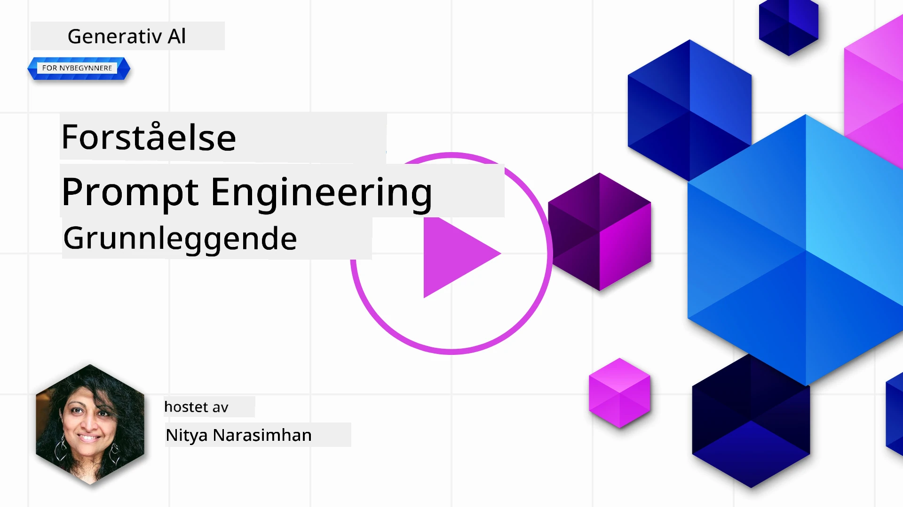
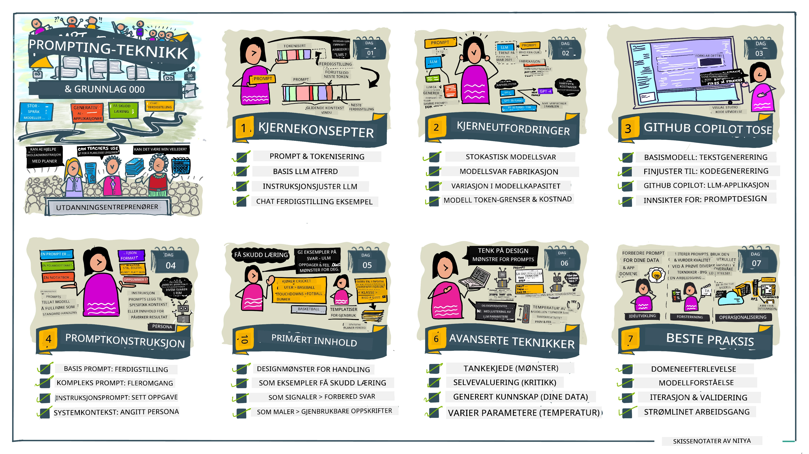
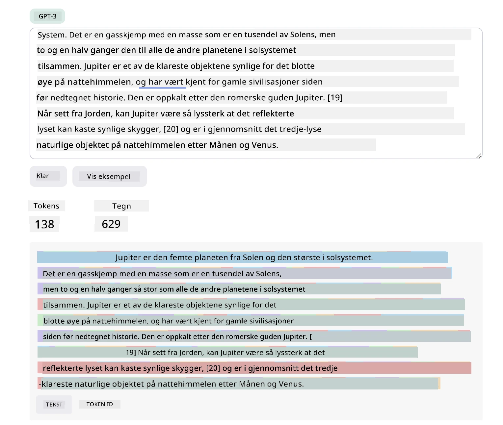
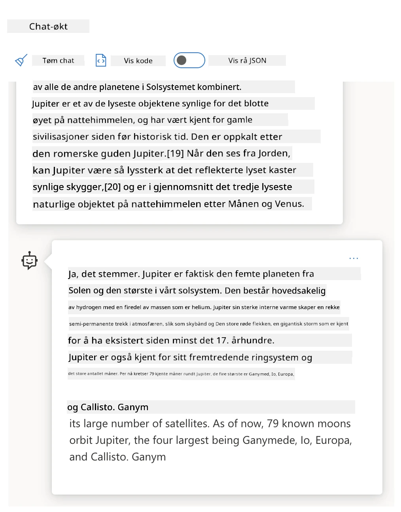
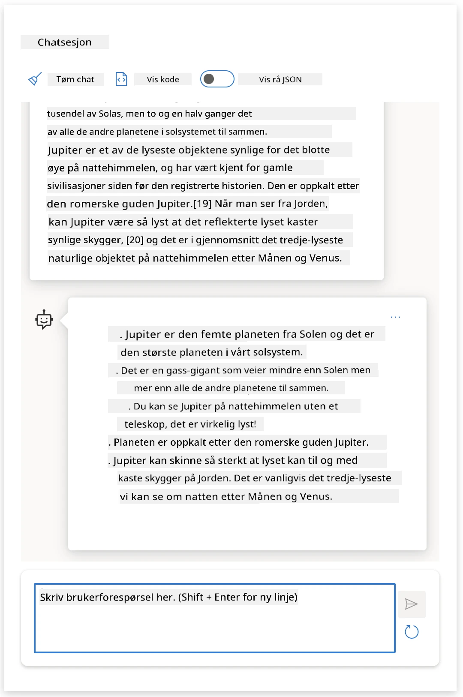
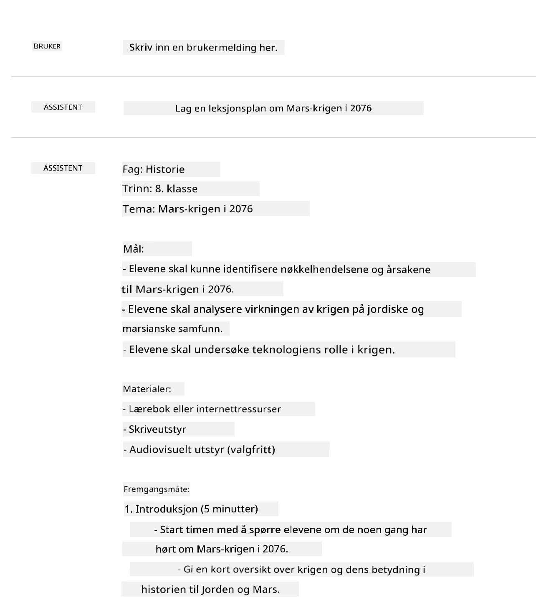
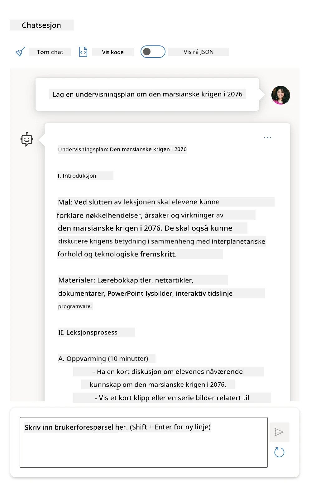
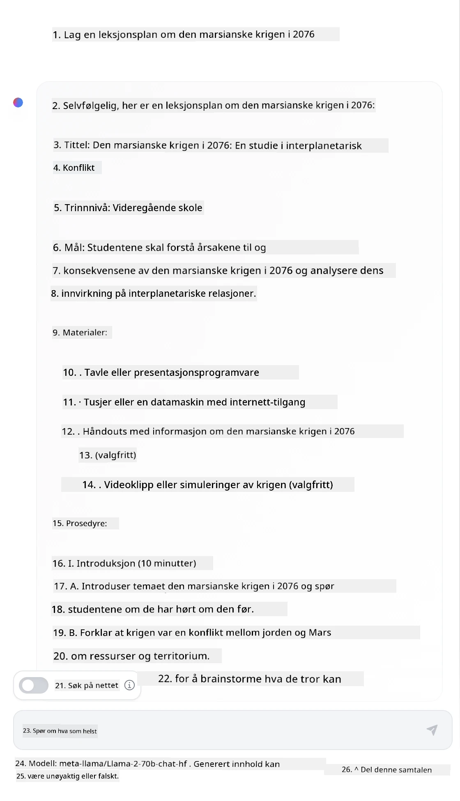

# Grunnleggende om Prompt Engineering

[](https://youtu.be/GElCu2kUlRs?si=qrXsBvXnCW12epb8)

## Introduksjon
Denne modulen dekker essensielle konsepter og teknikker for å lage effektive prompts i generative AI-modeller. Måten du skriver prompten til en LLM på, er også viktig. En nøye utformet prompt kan oppnå bedre kvalitet på svaret. Men hva betyr egentlig begreper som _prompt_ og _prompt engineering_? Og hvordan kan jeg forbedre prompt-_inputen_ jeg sender til LLMen? Dette er spørsmålene vi skal prøve å svare på i dette kapittelet og det neste.

_Generativ AI_ er i stand til å lage nytt innhold (f.eks. tekst, bilder, lyd, kode osv.) som svar på brukerforespørsler. Dette gjøres ved hjelp av _Store språkmodeller_ som OpenAIs GPT ("Generative Pre-trained Transformer")-serie, som er trent i bruk av naturlig språk og kode.

Brukere kan nå samhandle med disse modellene ved hjelp av kjente paradigmer som chat, uten å trenge teknisk ekspertise eller opplæring. Modellene er _prompt-baserte_ – brukere sender en tekstinput (prompt) og får tilbake AI-svaret (completion). De kan deretter "chatte med AI-en" iterativt i flertrinns-samtaler, og forbedre prompten til svaret matcher forventningene deres.

"Prompter" blir nå det primære _programmeringsgrensesnittet_ for generative AI-applikasjoner, som forteller modellene hva de skal gjøre og påvirker kvaliteten på svarene som returneres. "Prompt Engineering" er et raskt voksende studiefelt som fokuserer på _design og optimalisering_ av prompts for å levere konsistente og kvalitetsmessige svar i stor skala.

## Læringsmål

I denne leksjonen lærer vi hva Prompt Engineering er, hvorfor det er viktig, og hvordan vi kan lage mer effektive prompts for en gitt modell og applikasjonsmål. Vi skal forstå kjernebegreper og beste praksis for prompt engineering – og lære om et interaktivt Jupyter Notebooks "sandbox"-miljø hvor vi kan se disse konseptene anvendt på virkelige eksempler.

Mot slutten av denne leksjonen vil vi kunne:

1. Forklare hva prompt engineering er og hvorfor det er viktig.
2. Beskrive komponentene i en prompt og hvordan de brukes.
3. Lære beste praksis og teknikker for prompt engineering.
4. Anvende lærte teknikker på virkelige eksempler, ved bruk av et OpenAI-endepunkt.

## Nøkkelbegreper

Prompt Engineering: Praksisen med å designe og forbedre input for å styre AI-modeller mot å produsere ønskede utdata.
Tokenisering: Prosessen med å omdanne tekst til mindre enheter, kalt tokens, som en modell kan forstå og prosessere.
Instruksjonsjusterte LLM-er: Store språkmodeller (LLM-er) som er finjustert med spesifikke instruksjoner for å forbedre nøyaktighet og relevans i svarene.

## Læringssandbox

Prompt engineering er for øyeblikket mer kunst enn vitenskap. Den beste måten å forbedre vår intuisjon for det på er å _øve mer_ og adoptere en prøving-og-feiling-tilnærming som kombinerer domenekunnskap med anbefalte teknikker og modellspesifikke optimaliseringer.

Jupyter Notebook som følger med denne leksjonen gir et _sandbox_-miljø hvor du kan prøve ut det du lærer – underveis eller som del av kodeutfordringen på slutten. For å kjøre øvelsene trenger du:

1. **En Azure OpenAI API-nøkkel** – tjenesteendepunkt for en distribuert LLM.
2. **Et Python-runtime-miljø** – hvor Notebooken kan kjøres.
3. **Lokale miljøvariabler** – _fullfør [SETUP](./../00-course-setup/02-setup-local.md?WT.mc_id=academic-105485-koreyst) stegene nå for å gjøre deg klar_.

Notebooken kommer med _startøvelser_ – men du oppfordres til å legge til egne _Markdown_ (beskrivelse) og _Kode_ (prompt-forespørsler) seksjoner for å prøve flere eksempler eller ideer – og bygge intuisjon for promptdesign.

## Illustrert guide

Vil du få et overblikk over hva denne leksjonen dekker før du går i gang? Sjekk ut denne illustrerte guiden, som gir deg en følelse av hovedtemaene og viktige poeng for deg å tenke på i hver del. Leksjonsplanen tar deg fra å forstå kjernebegreper og utfordringer til å møte dem med relevante teknikker for prompt engineering og beste praksis. Merk at delen "Avanserte teknikker" i denne guiden viser til innhold som dekkes i det _neste_ kapittelet i dette pensumet.



## Vår startup

Nå, la oss snakke om hvordan _dette temaet_ relaterer seg til vår startup-misjon om å [bringe AI-innovasjon til utdanning](https://educationblog.microsoft.com/2023/06/collaborating-to-bring-ai-innovation-to-education?WT.mc_id=academic-105485-koreyst). Vi ønsker å bygge AI-drevne applikasjoner for _personlig tilpasset læring_ – så la oss tenke på hvordan ulike brukere av applikasjonen vår kan "designe" prompts:

- **Administratorer** kan be AI om å _analysere læreplandata for å identifisere hull i dekningen_. AI-en kan oppsummere resultater eller visualisere dem med kode.
- **Lærere** kan be AI om å _generere en leksjonsplan for en målgruppe og et tema_. AI-en kan bygge den personlig tilpassede planen i et spesifisert format.
- **Studenter** kan be AI om å _veilede dem i et vanskelig fag_. AI-en kan nå veilede elever med leksjoner, hint og eksempler tilpasset deres nivå.

Det er bare toppen av isfjellet. Sjekk ut [Prompts For Education](https://github.com/microsoft/prompts-for-edu/tree/main?WT.mc_id=academic-105485-koreyst) – et åpent kildekode-bibliotek med prompts kurert av utdanningseksperter – for å få en bredere følelse av mulighetene! _Prøv å kjøre noen av disse promptene i sandkassen eller bruke OpenAI Playground for å se hva som skjer!_

<!--
LEKSJONSMAL:
Denne enheten bør dekke kjernebegrep #1.
Forsterk konseptet med eksempler og referanser.

KONSEPT #1:
Prompt Engineering.
Definer det og forklar hvorfor det trengs.
-->

## Hva er Prompt Engineering?

Vi startet denne leksjonen med å definere **Prompt Engineering** som prosessen med å _designe og optimalisere_ tekstinput (prompter) for å levere konsistente og kvalitetsmessige svar (completioner) for et gitt applikasjonsmål og modell. Vi kan tenke på dette som en 2-trinns prosess:

- _designe_ den opprinnelige prompten for en gitt modell og målsetting
- _forbedre_ prompten iterativt for å øke kvaliteten på svaret

Dette er nødvendigvis en prøving-og-feiling-prosess som krever brukerintuisjon og innsats for å oppnå optimale resultater. Så hvorfor er det viktig? For å svare på det, trenger vi først å forstå tre konsepter:

- _Tokenisering_ = hvordan modellen "ser" prompten
- _Basis-LLMer_ = hvordan grunnmodellen "behandler" en prompt
- _Instruksjonsjusterte LLM-er_ = hvordan modellen nå kan se "oppgaver"

### Tokenisering

En LLM ser på prompter som en _sekvens av tokens_ hvor ulike modeller (eller versjoner av en modell) kan tokenisere samme prompt på ulike måter. Siden LLM-er trenes på tokens (og ikke rå tekst), har måten promptene tokeniseres på direkte innvirkning på kvaliteten av det genererte svaret.

For å få en intuisjon for hvordan tokenisering fungerer, prøv verktøy som [OpenAI Tokenizer](https://platform.openai.com/tokenizer?WT.mc_id=academic-105485-koreyst) vist under. Kopier inn din prompt – og se hvordan den blir konvertert til tokens, med særlig oppmerksomhet på hvordan mellomromstegn og tegnsetting håndteres. Merk at dette eksempelet viser en eldre LLM (GPT-3) – så det å prøve dette med en nyere modell kan gi et annet resultat.



### Konsept: Grunnmodeller

Når en prompt er tokenisert, er hovedfunksjonen til ["Base LLM"](https://blog.gopenai.com/an-introduction-to-base-and-instruction-tuned-large-language-models-8de102c785a6?WT.mc_id=academic-105485-koreyst) (eller grunnmodell) å forutsi token i den sekvensen. Siden LLM-er trenes på massive tekstdatasett, har de en god forståelse for statistiske sammenhenger mellom tokens og kan gjøre denne prediksjonen med en viss sikkerhet. Merk at de ikke forstår _meningen_ med ordene i prompten eller tokenet; de ser bare et mønster de kan "fullføre" med sitt neste prediksjon. De kan fortsette å forutsi sekvensen til den blir avsluttet av brukerhandling eller en forhåndsdefinert betingelse.

Vil du se hvordan prompt-basert fullføring fungerer? Skriv inn prompten ovenfor i [Microsoft Foundry playground](https://ai.azure.com?WT.mc_id=academic-105485-koreyst) med standardinnstillingene. Systemet er konfigurert til å behandle prompts som forespørsler om informasjon – så du bør se en fullføring som tilfredsstiller denne konteksten.

Men hva om brukeren ønsket å se noe spesifikt som oppfylte noen kriterier eller oppgaveformål? Da kommer _instruksjonsjusterte_ LLM-er inn i bildet.



### Konsept: Instruksjonsjusterte LLM-er

En [Instruksjonsjustert LLM](https://blog.gopenai.com/an-introduction-to-base-and-instruction-tuned-large-language-models-8de102c785a6?WT.mc_id=academic-105485-koreyst) starter med grunnmodellen og finjusterer den med eksempler eller input/output-par (f.eks. flertrinns "meldinger") som kan inneholde klare instruksjoner – og AI-svaret forsøker å følge den instruksjonen.

Dette bruker teknikker som Forsterkningslæring med Menneskelig Tilbakemelding (RLHF) som kan trene modellen til å _følge instruksjoner_ og _lære av tilbakemelding_ slik at den produserer svar som er bedre egnet til praktiske applikasjoner og mer relevante for brukerens mål.

La oss prøve det – gå tilbake til prompten over, men endre nå _systemmeldingen_ for å gi følgende instruksjon som kontekst:

> _Oppsummer innhold du får for en andreklassing. Hold resultatet til ett avsnitt med 3-5 punktlister._

Ser du hvordan resultatet nå er justert for å reflektere ønsket mål og format? En lærer kan nå bruke dette svaret direkte i sine lysbilder for den klassen.



## Hvorfor trenger vi Prompt Engineering?

Nå som vi vet hvordan LLM-er behandler prompter, la oss snakke om _hvorfor_ vi trenger prompt engineering. Svaret ligger i at dagens LLM-er byr på en rekke utfordringer som gjør _pålitelige og konsistente fullføringer_ vanskeligere å oppnå uten innsats i konstruksjon og optimalisering av prompten. For eksempel:

1. **Modellsvar er stokastiske.** Den _samme prompten_ vil sannsynligvis produsere forskjellige svar med ulike modeller eller modellversjoner. Og det kan til og med gi ulike resultater med _samme modell_ til forskjellige tider. _Prompt engineering-teknikker kan hjelpe oss å minimere disse variasjonene ved å gi bedre retningslinjer_.

1. **Modeller kan finne på svar.** Modeller er forhåndstrent med _store, men begrensede_ datasett, noe som betyr at de mangler kunnskap om konsepter utenfor det treningsomfanget. Derfor kan de produsere fullføringer som er unøyaktige, oppdiktede eller direkte i strid med kjente fakta. _Prompt engineering-teknikker hjelper brukere med å identifisere og dempe slike fabrikasjoner, f.eks. ved å be AI om henvisninger eller resonnement_.

1. **Modellers evner vil variere.** Nyere modeller eller modellgenerasjoner vil ha rikere evner, men bringer også unike særtrekk og kompromisser i kostnader og kompleksitet. _Prompt engineering kan hjelpe oss med å utvikle beste praksis og arbeidsflyter som abstraherer bort forskjeller og tilpasser seg modellspesifikke krav på skalerbare, sømløse måter_.

La oss se dette i praksis i OpenAI eller Azure OpenAI Playground:

- Bruk samme prompt med ulike LLM-distribusjoner (f.eks. OpenAI, Azure OpenAI, Hugging Face) – så du variasjonene?
- Bruk samme prompt gjentatte ganger med _samme_ LLM-distribusjon (f.eks. Azure OpenAI playground) – hvordan var forskjellene her?

### Eksempel på fabrikasjoner

I dette kurset bruker vi uttrykket **"fabrikasjon"** for å referere til fenomenet der LLM-er noen ganger genererer faktuelt feil informasjon på grunn av begrensninger i treningen eller andre forhold. Du har kanskje også hørt dette omtalt som _"hallusinasjoner"_ i populære artikler eller forskningsartikler. Vi anbefaler imidlertid sterkt å bruke _"fabrikasjon"_ som begrep, slik at vi unngår å menneskeliggjøre atferden ved å tillegge en maskin-drevet utfall en menneskelig egenskap. Dette styrker også [Retningslinjer for ansvarlig AI](https://www.microsoft.com/ai/responsible-ai?WT.mc_id=academic-105485-koreyst) fra et terminologiperspektiv, ved å fjerne ord som også kan anses som støtende eller ikke-inkluderende i noen sammenhenger.

Vil du få en følelse av hvordan fabrikasjoner fungerer? Tenk på en prompt som instruerer AI til å generere innhold for et ikke-eksisterende tema (for å sikre at det ikke finnes i treningsdatasettet). For eksempel – jeg prøvde denne prompten:

> **Prompt:** generer en leksjonsplan om den martianske krigen i 2076.

Et nettsøk viste meg at det fantes fiktive fremstillinger (f.eks. TV-serier eller bøker) om mars-kriger – men ingen i 2076. Sunn fornuft sier også at 2076 er _i fremtiden_ og dermed ikke kan assosieres med en virkelig hendelse.


Hva skjer når vi kjører denne prompten med forskjellige tilbydere av LLM?

> **Respons 1**: OpenAI Playground (GPT-35)



> **Respons 2**: Azure OpenAI Playground (GPT-35)



> **Respons 3**: : Hugging Face Chat Playground (LLama-2)



Som forventet gir hvert modell (eller modellversjon) litt forskjellige svar takket være stokastisk oppførsel og variasjoner i modellkapasitet. For eksempel retter en modell seg mot et 8. klasses nivå mens den andre antar en videregående elev. Men alle tre modellene genererte svar som kunne overbevise en uinformert bruker om at hendelsen var ekte.

Teknikker innen prompt engineering som _metaprompting_ og _temperaturkonfigurasjon_ kan redusere modellfabrikkasjoner til en viss grad. Nye prompt engineering _arkitekturer_ integrerer også sømløst nye verktøy og teknikker i promptflyten for å dempe eller redusere noen av disse effektene.

## Case Study: GitHub Copilot

La oss avslutte denne delen med å få en forståelse av hvordan prompt engineering brukes i løsninger i den virkelige verden ved å se på ett Case Study: [GitHub Copilot](https://github.com/features/copilot?WT.mc_id=academic-105485-koreyst).

GitHub Copilot er din "AI partnerprogrammerer" - den konverterer tekstprompt til kodefullføringer og er integrert i utviklingsmiljøet ditt (f.eks. Visual Studio Code) for en sømløs brukeropplevelse. Som dokumentert i bloggrekkene nedenfor, var den tidligste versjonen basert på OpenAI Codex-modellen - med ingeniører som raskt innså behovet for å finjustere modellen og utvikle bedre prompt engineering-teknikker for å forbedre kodekvaliteten. I juli [lanserte de en forbedret AI-modell som går utover Codex](https://github.blog/2023-07-28-smarter-more-efficient-coding-github-copilot-goes-beyond-codex-with-improved-ai-model/?WT.mc_id=academic-105485-koreyst) for enda raskere forslag.

Les innleggene i rekkefølge for å følge deres læringsreise.

- **Mai 2023** | [GitHub Copilot blir bedre på å forstå koden din](https://github.blog/2023-05-17-how-github-copilot-is-getting-better-at-understanding-your-code/?WT.mc_id=academic-105485-koreyst)
- **Mai 2023** | [Innsiden av GitHub: Arbeid med LLM-ene bak GitHub Copilot](https://github.blog/2023-05-17-inside-github-working-with-the-llms-behind-github-copilot/?WT.mc_id=academic-105485-koreyst).
- **Juni 2023** | [Hvordan skrive bedre prompts for GitHub Copilot](https://github.blog/2023-06-20-how-to-write-better-prompts-for-github-copilot/?WT.mc_id=academic-105485-koreyst).
- **Juli 2023** | [.. GitHub Copilot går utover Codex med forbedret AI-modell](https://github.blog/2023-07-28-smarter-more-efficient-coding-github-copilot-goes-beyond-codex-with-improved-ai-model/?WT.mc_id=academic-105485-koreyst)
- **Juli 2023** | [En utviklers guide til prompt engineering og LLM-er](https://github.blog/2023-07-17-prompt-engineering-guide-generative-ai-llms/?WT.mc_id=academic-105485-koreyst)
- **September 2023** | [Hvordan bygge en bedrifts-LLM-app: Lærdom fra GitHub Copilot](https://github.blog/2023-09-06-how-to-build-an-enterprise-llm-application-lessons-from-github-copilot/?WT.mc_id=academic-105485-koreyst)

Du kan også bla gjennom deres [Engineering-blogg](https://github.blog/category/engineering/?WT.mc_id=academic-105485-koreyst) for flere innlegg som [dette](https://github.blog/2023-09-27-how-i-used-github-copilot-chat-to-build-a-reactjs-gallery-prototype/?WT.mc_id=academic-105485-koreyst) som viser hvordan disse modellene og teknikkene _anvendes_ for å drive virkelige applikasjoner.

---

<!--
LESSON TEMPLATE:
Denne enheten skal dekke kjernebegrep #2.
Forsterk begrepet med eksempler og referanser.

KJERNEBEGREP #2:
Promptdesign.
Illustrert med eksempler.
-->

## Promptkonstruksjon

Vi har sett hvorfor prompt engineering er viktig - nå la oss forstå hvordan prompts _konstruseres_ slik at vi kan evaluere forskjellige teknikker for mer effektiv promptdesign.

### Enkel prompt

La oss starte med den enkle prompten: et tekstinnspill sendt til modellen uten annen kontekst. Her er et eksempel - når vi sender de første ordene i USAs nasjonalsang til OpenAI [Completion API](https://platform.openai.com/docs/api-reference/completions?WT.mc_id=academic-105485-koreyst), fullfører den umiddelbart svaret med de neste linjene, noe som illustrerer den grunnleggende prediksjonsoppførselen.

| Prompt (Input)     | Fullføring (Output)                                                                                                                      |
| :----------------- | :----------------------------------------------------------------------------------------------------------------------------------------- |
| Oh say can you see | Det høres ut som du begynner sangtekstene til "The Star-Spangled Banner," USAs nasjonalsang. Hele teksten er ...                         |

### Kompleks prompt

Nå legger vi til kontekst og instruksjoner til den enkle prompten. [Chat Completion API](https://learn.microsoft.com/azure/ai-foundry/openai/how-to/chatgpt?WT.mc_id=academic-105485-koreyst) lar oss bygge en kompleks prompt som en samling av _meldinger_ med:

- Inn-/ut-par som gjenspeiler _bruker_-innspill og _assistent_-svar.
- Systemmelding som setter konteksten for assistentens oppførsel eller personlighet.

Forespørselen er nå i formen nedenfor, hvor _tokenisering_ effektivt fanger relevant informasjon fra kontekst og samtale. Å endre systemkonteksten kan være like avgjørende for kvaliteten på fullføringer som brukerinnspill.

```python
response = client.responses.create(
    model="gpt-5-mini",
    input=[
        {"role": "system", "content": "You are a helpful assistant."},
        {"role": "user", "content": "Who won the world series in 2020?"},
        {"role": "assistant", "content": "The Los Angeles Dodgers won the World Series in 2020."},
        {"role": "user", "content": "Where was it played?"}
    ]
)
```

### Instruksjonsprompt

I eksemplene ovenfor var brukerprompten et enkelt tekstspørsmål som kan tolkes som en forespørsel om informasjon. Med _instruksjon_ prompts kan vi bruke den teksten til å spesifisere en oppgave mer detaljert, og gi bedre veiledning til AI-en. Her er et eksempel:

| Prompt (Input)                                                                                                                                                                                                                         | Fullføring (Output)                                                                                                        | Instruksjonstype    |
| :------------------------------------------------------------------------------------------------------------------------------------------------------------------------------------------------------------------------------------- | :------------------------------------------------------------------------------------------------------------------------- | :------------------ |
| Skriv en beskrivelse av borgerkrigen                                                                                                                                                                                                 | _returnerte et enkelt avsnitt_                                                                                              | Enkel               |
| Skriv en beskrivelse av borgerkrigen. Oppgi viktige datoer og hendelser og beskriv deres betydning                                                                                                                                     | _returnerte et avsnitt etterfulgt av en liste over viktige datoer med beskrivelser_                                           | Kompleks            |
| Skriv en beskrivelse av borgerkrigen i 1 avsnitt. Gi 3 punkter med viktige datoer og deres betydning. Gi 3 punkter til med viktige historiske personer og deres bidrag. Returner resultatet som en JSON-fil                                | _returnerer mer omfattende detaljer i en tekstboks, formatert som JSON som du kan kopiere til en fil og validere ved behov_     | Kompleks. Formatert.|

## Primært innhold

I eksemplene ovenfor var prompten fortsatt ganske åpen, noe som tillot LLM å bestemme hvilken del av det forhåndstrente datasettet som var relevant. Med designmønsteret _primært innhold_ deles inndatateksten i to deler:

- en instruksjon (handling)
- relevant innhold (som påvirker handlingen)

Her er et eksempel hvor instruksjonen er å "oppsummere dette i 2 setninger".

| Prompt (Input)                                                                                                                                                                                                                                                                                                                                                                                                                                                                                                                                                                                                                                                                                              | Fullføring (Output)                                                                                                                                                                                                                                                                                  |
| :-------------------------------------------------------------------------------------------------------------------------------------------------------------------------------------------------------------------------------------------------------------------------------------------------------------------------------------------------------------------------------------------------------------------------------------------------------------------------------------------------------------------------------------------------------------------------------------------------------------------------------------------------------------------------------------------------- | :--------------------------------------------------------------------------------------------------------------------------------------------------------------------------------------------------------------------------------------------------------------------------------------------------- |
| Jupiter er den femte planeten fra solen og den største i solsystemet. Det er en gasskjemp med en masse som er en tidel av en tusendel av solen, men to og en halv ganger massen til alle de andre planetene i solsystemet til sammen. Jupiter er ett av de lyseste objektene synlige for det blotte øye på nattehimmelen, og har vært kjent for gamle sivilisasjoner siden før dokumentert historie. Den er oppkalt etter den romerske guden Jupiter.[19] Når man ser den fra jorden, kan Jupiter være sterk nok til at refleksjonslyset kaster synlige skygger,[20] og er i gjennomsnitt det tredje mest lyssterke naturlige objektet på nattehimmelen etter månen og Venus. <br/> **Oppsummer dette i 2 korte setninger** | Jupiter, den femte planeten fra solen, er den største i solsystemet og er kjent for å være et av de lyseste objektene på nattehimmelen. Den er oppkalt etter den romerske guden Jupiter, og er en gasskjemp med en masse som er to og en halv ganger større enn alle de andre planetene til sammen i solsystemet. |

Segmentet primært innhold kan brukes på ulike måter for å drive mer effektive instruksjoner:

- **Eksempler** - i stedet for å fortelle modellen hva den skal gjøre med en eksplisitt instruksjon, gi den eksempler på hva den skal gjøre og la den utlede mønsteret.
- **Signaler** - følg instruksjonen med et "signal" som forbereder fullføringen og veileder modellen mot mer relevante svar.
- **Maler** - disse er repeterbare 'oppskrifter' for prompts med plasserholdere (variabler) som kan tilpasses med data for spesifikke bruksområder.

La oss utforske disse i praksis.

### Bruke eksempler

Dette er en tilnærming der du bruker primært innhold for å "mate modellen" med noen eksempler på ønsket output for en gitt instruksjon, og lar den utlede mønsteret for ønsket output. Basert på antall eksempler som gis kan vi ha zero-shot prompting, one-shot prompting, few-shot prompting osv.

Prompten består nå av tre komponenter:

- En oppgavebeskrivelse
- Noen eksempler på ønsket output
- Begynnelsen på et nytt eksempel (som blir en implisitt oppgavebeskrivelse)

| Læringstype | Prompt (Input)                                                                                                                                     | Fullføring (Output)         |
| :------------ | :------------------------------------------------------------------------------------------------------------------------------------------------- | :-------------------------- |
| Zero-shot     | "The Sun is Shining". Oversett til spansk                                                                                                         | "El Sol está brillando".    |
| One-shot      | "The Sun is Shining" => ""El Sol está brillando". <br> "It's a Cold and Windy Day" =>                                                              | "Es un día frío y ventoso". |
| Few-shot      | Spilleren løp basene => Baseball <br/> Spilleren slo en es => Tennis <br/> Spilleren slo en sekser => Cricket <br/> Spilleren gjorde en slam-dunk => | Basketball                  |
|               |                                                                                                                                                   |                             |

Merk hvordan vi måtte gi eksplisitt instruksjon ("Oversett til spansk") i zero-shot prompting, men det utledes i one-shot prompting-eksemplet. Few-shot-eksemplet viser hvordan flere eksempler lar modellene gjøre mer presise slutninger uten ekstra instruksjoner.

### Promptsignaler

En annen teknikk for bruk av primært innhold er å gi _signaler_ i stedet for eksempler. I dette tilfellet gir vi modellen et dytt i riktig retning ved å _starte den_ med et utdrag som reflekterer ønsket svarformat. Modellen "tar signalet" og fortsetter i samme stil.

| Antall signaler | Prompt (Input)                                                                                                                                                                                                                                                                                                                                                                                                                                         | Fullføring (Output)                                                                                                                                                                                                                                                                                     |
| :------------- | :------------------------------------------------------------------------------------------------------------------------------------------------------------------------------------------------------------------------------------------------------------------------------------------------------------------------------------------------------------------------------------------------------------------------------------------------------- | :------------------------------------------------------------------------------------------------------------------------------------------------------------------------------------------------------------------------------------------------------------------------------------------------------ |
| 0              | Jupiter er den femte planeten fra solen og den største i solsystemet. Det er en gasskjemp med en masse som er en tidel av en tusendel av solen, men to og en halv ganger massen til alle de andre planetene i solsystemet til sammen. Jupiter er ett av de lyseste objektene synlige for det blotte øye på nattehimmelen, og har vært kjent for gamle sivilisasjoner siden før dokumentert historie. <br/>**Oppsummer dette**               | Jupiter er den største planeten i vårt solsystem og den femte fra solen. Den er en gasskjemp med en masse på 1/1000 av solens, men tyngre enn alle de andre planetene til sammen. Gamle sivilisasjoner har kjent til Jupiter i lang tid, og den er lett synlig på nattehimmelen..      |
| 1              | Jupiter er den femte planeten fra solen og den største i solsystemet. Det er en gasskjemp med en masse som er en tidel av en tusendel av solen, men to og en halv ganger massen til alle de andre planetene i solsystemet til sammen. Jupiter er ett av de lyseste objektene synlige for det blotte øye på nattehimmelen, og har vært kjent for gamle sivilisasjoner siden før dokumentert historie. <br/>**Oppsummer dette** <br/> Det vi lærte er at Jupiter | er den femte planeten fra solen og den største i solsystemet. Det er en gasskjemp med en masse som er en tidel av en tusendel av solen, men to og en halv ganger massen til alle de andre planetene til sammen. Den er lett synlig for det blotte øye og har vært kjent siden gammel tid.  |

| 2              | Jupiter er den femte planeten fra solen og den største i solsystemet. Den er en gasskjempe med en masse på en tusendel av solens masse, men to og en halv gang så mye som alle de andre planetene i solsystemet til sammen. Jupiter er ett av de mest lyssterke objektene synlige for det blotte øye på nattehimmelen, og har vært kjent for eldgamle sivilisasjoner siden tiden før registrert historie. <br/>**Oppsummer dette** <br/> Topp 3 fakta vi lærte:         | 1. Jupiter er den femte planeten fra solen og den største i solsystemet. <br/> 2. Den er en gasskjempe med en masse på en tusendel av solens mas...<br/> 3. Jupiter har vært synlig for det blotte øye siden eldgamle tider ...                                                                       |
|                |                                                                                                                                                                                                                                                                                                                                                                                                                                                              |                                                                                                                                                                                                                                                                                                           |

### Maler for prompt

En prompt-mal er en _forhåndsdefinert oppskrift for en prompt_ som kan lagres og brukes på nytt etter behov, for å gi mer konsistente brukeropplevelser i stor skala. I sin enkleste form er det rett og slett en samling med prompt-eksempler som [dette fra OpenAI](https://cookbook.openai.com/examples/gpt4-1_prompting_guide?WT.mc_id=academic-105485-koreyst) som gir både de interaktive prompt-komponentene (bruker- og systemmeldinger) og API-drevne forespørselsformat – for å støtte gjenbruk.

I sin mer komplekse form, som [dette eksemplet fra LangChain](https://python.langchain.com/docs/concepts/prompt_templates/?WT.mc_id=academic-105485-koreyst), inneholder den _plassholdere_ som kan erstattes med data fra en rekke kilder (brukerinput, systemkontekst, eksterne datakilder osv.) for å generere en prompt dynamisk. Dette lar oss skape et bibliotek av gjenbrukbare prompts som kan brukes til å drive konsistente brukeropplevelser **programmatisk** i stor skala.

Til slutt ligger den virkelige verdien av maler i muligheten til å lage og publisere _prompt-biblioteker_ for vertikale applikasjonsdomener – der prompt-malen nå er _optimalisert_ for å reflektere applikasjonsspesifikk kontekst eller eksempler som gjør svarene mer relevante og nøyaktige for den målrettede brukergruppen. [Prompts For Edu](https://github.com/microsoft/prompts-for-edu?WT.mc_id=academic-105485-koreyst)-lageret er et godt eksempel på denne tilnærmingen, som kuraterer et bibliotek av prompts for utdanningsdomene med fokus på sentrale mål som leksjonsplanlegging, pensumdesign, studentveiledning osv.

## Støttende innhold

Hvis vi tenker på prompt-konstruksjon som å ha en instruksjon (oppgave) og et mål (hovedinnhold), da er _sekundært innhold_ som ekstra kontekst vi gir for å **påvirke outputen på en eller annen måte**. Det kan være justeringsparametere, formateringsinstruksjoner, emnetaksonomier osv. som kan hjelpe modellen å _skreddersy_ svaret for å passe ønskede brukerobjektiver eller forventninger.

For eksempel: Gitt en kurskatalog med omfattende metadata (navn, beskrivelse, nivå, metadatakoder, instruktør osv.) for alle tilgjengelige kurs i pensum:

- kan vi definere en instruksjon om å "oppsummere kurskatalogen for høsten 2023"
- kan vi bruke hovedinnholdet til å gi noen eksempler på ønsket output
- kan vi bruke sekundært innhold til å identifisere de fem viktigste "kategoriene" av interesse.

Nå kan modellen gi en oppsummering i formatet vist i noen få eksempler - men hvis et resultat har flere kategorier, kan den prioritere de fem kategoriene identifisert i sekundært innhold.

---

<!--
LEKSJONSMAL:
Denne enheten skal dekke kjernebegrep #1.
Forsterk begrepet med eksempler og referanser.

BEGREP #3:
Teknikker for prompt-engineering.
Hva er noen grunnleggende teknikker for prompt-engineering?
Illustrer det med noen øvelser.
-->

## Beste praksiser for prompting

Nå som vi vet hvordan prompts kan _konstrueres_, kan vi begynne å tenke på hvordan vi kan _designe_ dem for å reflektere beste praksis. Vi kan tenke på dette i to deler – å ha riktig _tankesett_ og å bruke riktige _teknikker_.

### Tankesett for prompt-engineering

Prompt-engineering er en prøve-og-feile-prosess, så ha tre brede veiledende faktorer i tankene:

1. **Domene-forståelse er viktig.** Svarenes nøyaktighet og relevans er en funksjon av _domenet_ der applikasjonen eller brukeren opererer. Bruk intuisjon og domeneekspertise til å **tilpasse teknikker** videre. Definer for eksempel _domenespesifikke personligheter_ i system-promptene dine, eller bruk _domenespesifikke maler_ i bruker-promptene dine. Gi sekundært innhold som reflekterer domenespesifikke kontekster, eller bruk _domenespesifikke hint og eksempler_ for å veilede modellen mot kjente bruksmønstre.

2. **Modellforståelse er viktig.** Vi vet at modeller er stokastiske av natur. Men modellimplementasjoner kan også variere med hensyn til treningsdatasettet de bruker (forhåndstrent kunnskap), evnene de tilbyr (f.eks. via API eller SDK) og typen innhold de er optimalisert for (f.eks. kode vs. bilder vs. tekst). Forstå styrker og begrensninger til modellen du bruker, og bruk denne kunnskapen til å _prioritere oppgaver_ eller lage _tilpassede maler_ som er optimalisert for modellens evner.

3. **Iterasjon og validering er viktig.** Modeller utvikler seg raskt, og det gjør også teknikkene for prompt-engineering. Som domeneekspert kan du ha annen kontekst eller kriterier for _din_ spesifikke applikasjon som kanskje ikke gjelder for det bredere fellesskapet. Bruk verktøy og teknikker for prompt-engineering for å "komme raskt i gang" med prompt-konstruksjon, iterer deretter og valider resultatene med din egen intuisjon og domeneekspertise. Dokumenter innsiktene dine og skap en **kunnskapsbase** (f.eks. prompt-biblioteker) som kan brukes som et nytt utgangspunkt av andre, for raskere iterasjoner i fremtiden.

## Beste praksis

Nå skal vi se på vanlige beste praksiser som anbefales av [OpenAI](https://help.openai.com/en/articles/6654000-best-practices-for-prompt-engineering-with-openai-api?WT.mc_id=academic-105485-koreyst) og [Azure OpenAI](https://learn.microsoft.com/azure/ai-foundry/openai/concepts/prompt-engineering#best-practices?WT.mc_id=academic-105485-koreyst) utøvere.

| Hva                              | Hvorfor                                                                                                                                                                                                                                               |
| :-------------------------------- | :------------------------------------------------------------------------------------------------------------------------------------------------------------------------------------------------------------------------------------------------ |
| Evaluer de nyeste modellene.     | Nye modellgenerasjoner har sannsynligvis forbedrede funksjoner og kvalitet – men kan også medføre høyere kostnader. Evaluer dem for effekt, og ta deretter beslutninger om migrasjon.                                                                                                              |
| Skill mellom instruksjoner og kontekst | Sjekk om modellen/leverandøren din definerer _avgrensere_ for å tydelig skille instruksjoner, primær og sekundært innhold. Dette kan hjelpe modeller med å tildele vekter mer nøyaktig til tokens.                                                                                               |
| Vær spesifikk og tydelig          | Gi flere detaljer om ønsket kontekst, resultat, lengde, format, stil osv. Dette vil forbedre både kvalitet og konsistens i svarene. Dokumenter framgangsmåter i gjenbrukbare maler.                                                                                                           |
| Vær beskrivende, bruk eksempler   | Modeller kan respondere bedre på en "vis og fortell"-tilnærming. Start med en `zero-shot`-tilnærming hvor du gir en instruksjon (men ingen eksempler), deretter prøv `few-shot` som finpuss, og gi noen få eksempler på ønsket output. Bruk analogier.                                           |
| Bruk hint for å starte fullføringer | Gi den et dytt mot ønsket resultat ved å gi ledende ord eller fraser som den kan bruke som startpunkt for svaret.                                                                                                                               |
| Gjenta                           | Noen ganger må du gjenta deg for modellen. Gi instruksjoner før og etter hovedinnholdet, bruk en instruksjon og et hint, osv. Iterer og valider for å se hva som fungerer.                                                                    |
| Rekkefølge betyr noe             | Rekken informasjon presenteres for modellen kan påvirke output, også i læringseksempler, på grunn av nylighesbias. Prøv forskjellige alternativer for å se hva som fungerer best.                                                        |
| Gi modellen en “utvei”           | Gi modellen et _fallback_-svar den kan gi hvis den av en eller annen grunn ikke kan fullføre oppgaven. Dette kan redusere sjansen for at modeller genererer feil eller fabrikerte svar.                                                        |
|                                   |                                                                                                                                                                                                                                                   |

Som med all beste praksis, husk at _din erfaring kan variere_ avhengig av modellen, oppgaven og domenet. Bruk disse som et utgangspunkt, og iterer for å finne hva som fungerer best for deg. Evaluer kontinuerlig prompt-engineering-prosessen din etter hvert som nye modeller og verktøy blir tilgjengelige, med fokus på prosess-skalerbarhet og svar-kvalitet.

<!--
LEKSJONSMAL:
Denne enheten skal gi en kodeutfordring hvis det er relevant

UTFORDRING:
Link til en Jupyter Notebook med bare kodekommentarer i instruksjonene (kodeavsnitt er tomme).

LØSNING:
Link til en kopi av den notatboken med utfylte prompts som kjøres, som viser hva ett eksempel kunne være.
-->

## Oppgave

Gratulerer! Du har kommet til slutten av leksjonen! Det er tid for å teste noen av konseptene og teknikkene med virkelige eksempler!

For oppgaven vår, skal vi bruke en Jupyter Notebook med øvelser du kan gjøre interaktivt. Du kan også utvide Notebook med dine egne Markdown- og kodeceller for å utforske ideer og teknikker på egen hånd.

### For å komme i gang, fork repoet, deretter

- (Anbefalt) Start GitHub Codespaces
- (Alternativt) Klon repoet til din lokale enhet og bruk det med Docker Desktop
- (Alternativt) Åpne notatboken i ditt foretrukne Notebook-miljø.

### Neste, konfigurer miljøvariablene dine

- Kopier `.env.copy`-filen i repo-roten til `.env` og fyll inn verdiene for `AZURE_OPENAI_API_KEY`, `AZURE_OPENAI_ENDPOINT` og `AZURE_OPENAI_DEPLOYMENT`. Gå tilbake til [Learning Sandbox-seksjonen](#læringssandbox) for å lære hvordan.

### Neste, åpne Jupyter Notatboken

- Velg runtime-kjernen. Hvis du bruker alternativ 1 eller 2, velg bare standard Python 3.10.x-kjerne som tilbys av utviklingscontaineren.

Du er klar til å kjøre øvelsene. Merk at det ikke finnes _riktige og gale_ svar her - bare å utforske muligheter ved prøving og feiling og bygge intuisjon for hva som fungerer for en gitt modell og applikasjonsdomene.

_Av den grunn finnes det ingen Kode-løsningsseksjoner i denne leksjonen. I stedet vil Notatboken ha Markdown-celler med tittelen "Min løsning:" som viser ett eksempelresultat som referanse._

 <!--
LEKSJONSMAL:
Avslutt seksjonen med en oppsummering og ressurser for selvstudium.
-->

## Kunnskapssjekk

Hvilken av følgende er en god prompt som følger noen rimelige beste praksiser?

1. Vis meg et bilde av en rød bil
2. Vis meg et bilde av en rød bil av merke Volvo og modell XC90 parkert ved en klippe med solen som går ned
3. Vis meg et bilde av en rød bil av merke Volvo og modell XC90

A: 2, det er den beste prompten siden den gir detaljer om "hva" og går inn i spesifikasjoner (ikke bare en hvilken som helst bil, men et spesifikt merke og modell) og den beskriver også den generelle settingen. 3 er nest best siden den også inneholder mye beskrivelse.

## 🚀 Utfordring

Se om du kan bruke "hint"-teknikken med prompten: Fullfør setningen "Vis meg et bilde av en rød bil av merke Volvo og ". Hva svarer den med, og hvordan ville du forbedret den?

## Flott arbeid! Fortsett læringen

Vil du lære mer om forskjellige konsepter innen Prompt Engineering? Gå til [siden for videre læring](https://aka.ms/genai-collection?WT.mc_id=academic-105485-koreyst) for å finne andre gode ressurser om dette temaet.

Gå videre til Leksjon 5 der vi ser på [avanserte prompting-teknikker](../05-advanced-prompts/README.md?WT.mc_id=academic-105485-koreyst)!

---

<!-- CO-OP TRANSLATOR DISCLAIMER START -->
**Ansvarsfraskrivelse**:
Dette dokumentet er oversatt ved hjelp av AI-oversettelsestjenesten [Co-op Translator](https://github.com/Azure/co-op-translator). Selv om vi streber etter nøyaktighet, vær oppmerksom på at automatiske oversettelser kan inneholde feil eller unøyaktigheter. Det opprinnelige dokumentet på originalspråket skal betraktes som den autoritative kilden. For kritisk informasjon anbefales profesjonell menneskelig oversettelse. Vi er ikke ansvarlige for eventuelle misforståelser eller feiltolkninger som oppstår ved bruk av denne oversettelsen.
<!-- CO-OP TRANSLATOR DISCLAIMER END -->