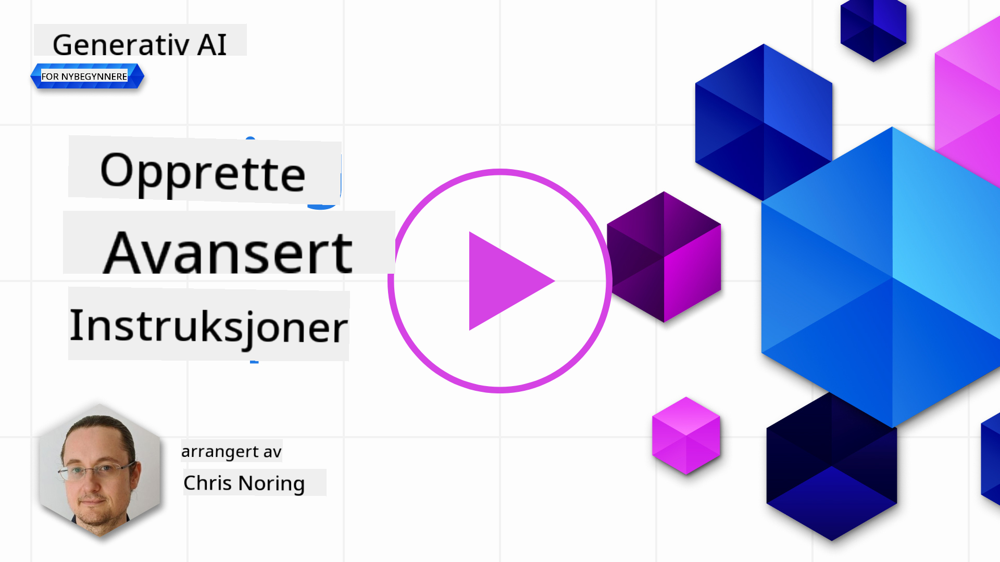

<!--
CO_OP_TRANSLATOR_METADATA:
{
  "original_hash": "b2651fb16bcfbc62b8e518751ed90fdb",
  "translation_date": "2025-10-17T19:17:07+00:00",
  "source_file": "05-advanced-prompts/README.md",
  "language_code": "no"
}
-->
# Lage avanserte oppfordringer

[](https://youtu.be/BAjzkaCdRok?si=NmUIyRf7-cDgbjtt)

La oss oppsummere noen lærdommer fra forrige kapittel:

> Oppfordrings-_utforming_ er prosessen der vi **veileder modellen mot mer relevante svar** ved å gi mer nyttige instruksjoner eller kontekst.

Det er også to steg for å skrive oppfordringer: å konstruere oppfordringen ved å gi relevant kontekst, og _optimalisering_, hvordan man gradvis forbedrer oppfordringen.

På dette punktet har vi en grunnleggende forståelse av hvordan man skriver oppfordringer, men vi må gå dypere. I dette kapittelet vil du gå fra å prøve ut ulike oppfordringer til å forstå hvorfor én oppfordring er bedre enn en annen. Du vil lære hvordan du konstruerer oppfordringer ved å følge noen grunnleggende teknikker som kan brukes på enhver LLM.

## Introduksjon

I dette kapittelet skal vi dekke følgende temaer:

- Utvide kunnskapen din om oppfordringsutforming ved å bruke forskjellige teknikker på oppfordringene dine.
- Konfigurere oppfordringene dine for å variere resultatet.

## Læringsmål

Etter å ha fullført denne leksjonen, vil du kunne:

- Bruke oppfordringsutformingsteknikker som forbedrer resultatet av oppfordringene dine.
- Utføre oppfordringer som enten er varierte eller deterministiske.

## Oppfordringsutforming

Oppfordringsutforming er prosessen med å lage oppfordringer som gir ønsket resultat. Det er mer til oppfordringsutforming enn bare å skrive en tekstoppfordring. Oppfordringsutforming er ikke en ingeniørdisiplin, det er mer et sett med teknikker du kan bruke for å oppnå ønsket resultat.

### Et eksempel på en oppfordring

La oss ta en grunnleggende oppfordring som denne:

> Generer 10 spørsmål om geografi.

I denne oppfordringen bruker du faktisk et sett med forskjellige oppfordringsteknikker.

La oss bryte dette ned.

- **Kontekst**, du spesifiserer at det skal handle om "geografi".
- **Begrensning av resultatet**, du ønsker ikke mer enn 10 spørsmål.

### Begrensninger ved enkle oppfordringer

Du kan eller kan ikke få ønsket resultat. Du vil få generert spørsmålene dine, men geografi er et stort tema, og du får kanskje ikke det du ønsker på grunn av følgende grunner:

- **Stort tema**, du vet ikke om det vil handle om land, hovedsteder, elver og så videre.
- **Format**, hva om du ønsket at spørsmålene skulle være formatert på en bestemt måte?

Som du kan se, er det mye å vurdere når du lager oppfordringer.

Så langt har vi sett et enkelt oppfordringseksempel, men generativ AI er i stand til mye mer for å hjelpe folk i en rekke roller og bransjer. La oss utforske noen grunnleggende teknikker neste.

### Teknikker for oppfordringer

Først må vi forstå at oppfordring er en _fremvoksende_ egenskap ved en LLM, noe som betyr at dette ikke er en funksjon som er innebygd i modellen, men heller noe vi oppdager mens vi bruker modellen.

Det finnes noen grunnleggende teknikker som vi kan bruke for å oppfordre en LLM. La oss utforske dem.

- **Zero-shot oppfordring**, dette er den mest grunnleggende formen for oppfordring. Det er en enkelt oppfordring som ber om et svar fra LLM basert utelukkende på treningsdataene.
- **Few-shot oppfordring**, denne typen oppfordring veileder LLM ved å gi 1 eller flere eksempler den kan stole på for å generere sitt svar.
- **Chain-of-thought**, denne typen oppfordring forteller LLM hvordan man bryter ned et problem i steg.
- **Generert kunnskap**, for å forbedre svaret på en oppfordring kan du gi genererte fakta eller kunnskap i tillegg til oppfordringen din.
- **Minst til mest**, som chain-of-thought, handler denne teknikken om å bryte ned et problem i en serie med steg og deretter be om at disse stegene utføres i rekkefølge.
- **Self-refine**, denne teknikken handler om å kritisere LLMs output og deretter be den om å forbedre seg.
- **Maieutisk oppfordring**, her ønsker du å sikre at LLMs svar er korrekt, og du ber den forklare ulike deler av svaret. Dette er en form for self-refine.

### Zero-shot oppfordring

Denne stilen av oppfordring er veldig enkel, den består av en enkelt oppfordring. Denne teknikken er sannsynligvis det du bruker når du begynner å lære om LLMs. Her er et eksempel:

- Oppfordring: "Hva er algebra?"
- Svar: "Algebra er en gren av matematikk som studerer matematiske symboler og reglene for å manipulere disse symbolene."

### Few-shot oppfordring

Denne stilen av oppfordring hjelper modellen ved å gi noen få eksempler sammen med forespørselen. Den består av en enkelt oppfordring med tillegg av oppgave-spesifikke data. Her er et eksempel:

- Oppfordring: "Skriv et dikt i stil med Shakespeare. Her er noen eksempler på Shakespeare-sonetter:
  Sonett 18: 'Skal jeg sammenligne deg med en sommerdag? Du er mer vakker og mer temperert...'
  Sonett 116: 'La meg ikke til ekteskap av sanne sinn Innrømme hindringer. Kjærlighet er ikke kjærlighet Som endrer seg når den finner endring...'
  Sonett 132: 'Dine øyne elsker jeg, og de, som synes synd på meg, Kjenner ditt hjerte plager meg med forakt,...'
  Nå, skriv en sonett om månens skjønnhet."
- Svar: "På himmelen skinner månen mykt, I sølvlys som kaster sin milde nåde,..."

Eksempler gir LLM konteksten, formatet eller stilen til ønsket output. De hjelper modellen med å forstå den spesifikke oppgaven og generere mer nøyaktige og relevante svar.

### Chain-of-thought

Chain-of-thought er en veldig interessant teknikk da den handler om å ta LLM gjennom en serie med steg. Ideen er å instruere LLM på en måte som gjør at den forstår hvordan man gjør noe. Vurder følgende eksempel, med og uten chain-of-thought:

    - Oppfordring: "Alice har 5 epler, kaster 3 epler, gir 2 til Bob og Bob gir ett tilbake, hvor mange epler har Alice?"
    - Svar: 5

LLM svarer med 5, som er feil. Riktig svar er 1 eple, gitt beregningen (5 -3 -2 + 1 = 1).

Så hvordan kan vi lære LLM å gjøre dette riktig?

La oss prøve chain-of-thought. Å bruke chain-of-thought betyr:

1. Gi LLM et lignende eksempel.
1. Vis beregningen, og hvordan man beregner det riktig.
1. Gi den opprinnelige oppfordringen.

Slik gjør du det:

- Oppfordring: "Lisa har 7 epler, kaster 1 eple, gir 4 epler til Bart og Bart gir ett tilbake:
  7 -1 = 6
  6 -4 = 2
  2 +1 = 3  
  Alice har 5 epler, kaster 3 epler, gir 2 til Bob og Bob gir ett tilbake, hvor mange epler har Alice?"
  Svar: 1

Legg merke til hvordan vi skriver vesentlig lengre oppfordringer med et annet eksempel, en beregning og deretter den opprinnelige oppfordringen, og vi kommer frem til riktig svar 1.

Som du kan se, er chain-of-thought en veldig kraftig teknikk.

### Generert kunnskap

Mange ganger når du vil konstruere en oppfordring, ønsker du å gjøre det ved å bruke data fra din egen bedrift. Du vil at en del av oppfordringen skal komme fra bedriften, og den andre delen skal være den faktiske oppfordringen du er interessert i.

Som et eksempel kan oppfordringen din se slik ut hvis du er i forsikringsbransjen:

```text
{{company}}: {{company_name}}
{{products}}:
{{products_list}}
Please suggest an insurance given the following budget and requirements:
Budget: {{budget}}
Requirements: {{requirements}}
```

Ovenfor ser du hvordan oppfordringen er konstruert ved hjelp av en mal. I malen er det en rekke variabler, angitt med `{{variable}}`, som vil bli erstattet med faktiske verdier fra en bedrifts-API.

Her er et eksempel på hvordan oppfordringen kan se ut når variablene er erstattet med innhold fra din bedrift:

```text
Insurance company: ACME Insurance
Insurance products (cost per month):
- Car, cheap, 500 USD
- Car, expensive, 1100 USD
- Home, cheap, 600 USD
- Home, expensive, 1200 USD
- Life, cheap, 100 USD

Please suggest an insurance given the following budget and requirements:
Budget: $1000
Requirements: Car, Home, and Life insurance
```

Når denne oppfordringen kjøres gjennom en LLM, vil den produsere et svar som dette:

```output
Given the budget and requirements, we suggest the following insurance package from ACME Insurance:
- Car, cheap, 500 USD
- Home, cheap, 600 USD
- Life, cheap, 100 USD
Total cost: $1,200 USD
```

Som du kan se, foreslår den også livsforsikring, noe den ikke burde. Dette resultatet er en indikasjon på at vi må optimalisere oppfordringen ved å endre den for å være tydeligere på hva den kan tillate. Etter litt _prøving og feiling_ kommer vi frem til følgende oppfordring:

```text
Insurance company: ACME Insurance
Insurance products (cost per month):
- type: Car, cheap, cost: 500 USD
- type: Car, expensive, cost: 1100 USD
- type: Home, cheap, cost: 600 USD
- type: Home, expensive, cost: 1200 USD
- type: Life, cheap, cost: 100 USD

Please suggest an insurance given the following budget and requirements:
Budget: $1000 restrict choice to types: Car, Home
```

Legg merke til hvordan det å legge til _type_ og _kostnad_ og også bruke nøkkelordet _begrens_ hjelper LLM med å forstå hva vi ønsker.

Nå får vi følgende svar:

```output
Given the budget and requirements, we suggest the Car, Cheap insurance product which costs 500 USD per month.
```

Poenget med dette eksemplet var å vise at selv om vi bruker en grunnleggende teknikk som _generert kunnskap_, må vi fortsatt optimalisere oppfordringen i de fleste tilfeller for å få ønsket resultat.

### Minst til mest

Ideen med minst-til-mest oppfordring er å bryte ned et større problem i delproblemer. På den måten hjelper du LLM med å "overvinne" det større problemet. Et godt eksempel kan være innen dataanalyse, der du kan be LLM om å dele opp et problem slik:

> Oppfordring: Hvordan utføre dataanalyse i 5 steg?

Med AI-assistenten din som svarer med:

1. Samle data
1. Rense data
1. Analysere data
1. Visualisere data
1. Presentere data

### Self-refine, kritisere resultatene

Med generative AI-er og LLM-er kan du ikke stole blindt på resultatet. Du må verifisere det. Tross alt presenterer LLM bare det som mest sannsynlig kommer neste, ikke nødvendigvis det som er korrekt. Derfor er det en god idé å be LLM om å kritisere seg selv, noe som leder oss til self-refine-teknikken.

Hvordan det fungerer er at du følger følgende steg:

1. Innledende oppfordring som ber LLM om å løse et problem
1. LLM svarer
1. Du kritiserer svaret og ber AI om å forbedre det
1. LLM svarer igjen, denne gangen tar det hensyn til kritikken og foreslår løsninger det har kommet opp med

Du kan gjenta denne prosessen så mange ganger du vil.

Her er et eksempel som bruker denne teknikken:

> Oppfordring: "Lag en Python Web API med rutene produkter og kunder"

AI-svar:

```python
import flask
app = Flask(__name__)

@app.route('/products')
def products():
    return 'Products'

@app.route('/customers')
def customers():
    return 'Customers'
```

> Oppfordring: foreslå 3 forbedringer av koden ovenfor

AI-svar:

```text
Sure, here are three suggestions to improve the code:

Import the correct module: The first line should import Flask instead of flask. The correct import statement should be from flask import Flask.

Add a main function: Add a if __name__ == '__main__': block to the end of the file to run the application when the file is executed.

Use f-strings: Use f-strings to format the return statements in the route functions. For example, return 'Products' can be changed to return f'This is the {request.path} page'.
```

```python
from flask import Flask, request

app = Flask(__name__)

@app.route('/products')
def products():
    return f'This is the {request.path} page'

@app.route('/customers')
def customers():
    return f'This is the {request.path} page'

if __name__ == '__main__':
    app.run()
```

Som du kan se, forbedrer AI-svaret ovenfor den første foreslåtte koden takket være kritikken av det første svaret.

### Maieutisk oppfordring

Maieutisk oppfordring er en teknikk som ligner på self-refine, men det handler mer om å be LLM om å forklare seg selv. Målet er å redusere inkonsekvenser i LLMs output for å sikre at den kommer frem til riktig svar. Arbeidsflyten du skal følge er:

1. Be LLM om å svare på et spørsmål
1. For hver del av svaret, be LLM om å forklare det mer i dybden.
1. Hvis det er inkonsekvenser, forkast delene som er inkonsekvente.

Gjenta 2 og 3 til du har gått gjennom alle delene og er fornøyd med svaret.

Her er et eksempel på en oppfordring:

> Oppfordring: Hvordan kan jeg lage en kriseplan for å håndtere en pandemi i 5 steg?
> LLM-svar:

```text
1. Identify the risks
1. Identify the stakeholders
1. Identify the resources
1. Identify the actions
1. Identify the communication channels
```

Den har identifisert 5 steg, men kan vi avgjøre om dette er korrekt? La oss be LLM om å forklare hvert steg:

> Oppfordring: Forklar det første steget mer detaljert, hva er risikoene i detalj ved en pandemi?

```text
The risks are the following:

- Loss of life
- Loss of business
- Loss of reputation
- Loss of customers
- Loss of employees
```

På dette punktet vil vi sikre at LLM er korrekt, så vi ber den forklare den første risikoen mer detaljert og håper den er konsistent med svaret ovenfor:

> Oppfordring: I en pandemi, hva er den største risikoen og hvorfor?

```text
The biggest risk is loss of life because it's the most important thing to protect.
```

> Hva er de to største risikoene i en pandemi?

```text
The two biggest risks are loss of life and loss of business.
```

På dette punktet er LLM konsistent og nevner "liv" og "virksomhet" som de to største risikoene. Vi kan nå fortsette til neste steg og føle oss ganske sikre. Men vi bør ikke stole blindt på LLM, vi bør alltid verifisere output.

## Variere output

LLMs er ikke-deterministiske av natur, noe som betyr at du vil få forskjellige resultater hver gang du kjører den samme oppfordringen. Prøv følgende oppfordring for eksempel:

> "Generer kode for en Python Web API"

```python
# Import necessary modules
import flask
from flask import request, jsonify

# Create a Flask app
app = flask.Flask(__name__)

# Create a route for the API
@app.route('/api', methods=['GET'])
def api():
    # Get the data from the request
    data = request.args

    # Process the data
    result = process_data(data)

    # Return the result as JSON
    return jsonify(result)

# Function to process the data
def process_data(data):
    # Do something with the data
    result = data + 1

    # Return the result
    return result

# Run the app
if __name__ == '__main__':
    app.run()

```

Å kjøre den samme oppfordringen igjen genererer et litt annet svar:

```python
#import necessary packages
import flask
from flask import request, jsonify

#create the Flask application
app = flask.Flask(__name__)
app.config["DEBUG"] = True

#create a list of books
books = [
    {'id': 0,
     'title': 'A Fire Upon the Deep',
     'author': 'Vernor Vinge',
     'first_sentence': 'The coldsleep itself was dreamless.',
     'year_published': '1992'},
    {'id': 1,
     'title': 'The Ones Who Walk Away From Omelas',
     'author': 'Ursula K. Le Guin',
     'first_sentence': 'With a clamor of bells that set the swallows soaring, the Festival of Summer came to the city Omelas, bright-towered by the sea.',
     'published': '1973'},
    {'id': 2,
     'title': 'Dhalgren',
     'author': 'Samuel R. Delany',
     'first_sentence': 'to wound the autumnal city.',
     'published': '1975'}
]

#create an endpoint for the API
@app.route('/', methods=['GET'])
def home():
    return '''<h1>Books API</h1>
<p>A prototype API for retrieving books.</p>'''

#create an endpoint to return all books
@app.route('/api/v1/resources/books/all', methods=['GET'])
def api_all():
    return jsonify(books)

#create an endpoint to return a single book
@app.route('/api/v1/resources/books', methods=['GET'])
def api_id():
    #check if an ID was provided as part of the URL
    #if ID is provided, assign it to a variable
    #if no ID is provided, display an error
    if 'id' in request.args:
        id = int(request.args['id'])
    else:
        return "Error: No id field provided. Please specify an id."

    #create an empty list for our results
    results = []

    #loop through the data and match results that fit the requested ID
    #IDs are unique, but other fields might return many results
    for book in books:
        if book['id'] == id:
            results.append(book)

    #use the jsonify function from Flask to convert our list of
    #Python dictionaries to the JSON format
    return jsonify(results)

app.run()
```

> Så er variert output et problem?

Det avhenger av hva du prøver å gjøre. Hvis du ønsker et spesifikt svar, er det et problem. Hvis du er ok med variert output som "Generer hvilke som helst 3 spørsmål om geografi", er det ikke et problem.

### Bruke temperatur for å variere output

Ok, så vi har bestemt oss for at vi vil begrense output til å være mer forutsigbar, det vil si mer deterministisk. Hvordan gjør vi det?

Temperatur er en verdi mellom 0 og 1, hvor 0 er mest deterministisk og 1 er mest variert. Standardverdien er 0.7. La oss se hva som skjer med to kjøringer av den samme oppfordringen med temperatur satt til 0.1:

> "Generer kode for en Python Web API"

```python
#import necessary libraries
import flask
from flask import request, jsonify

#create an instance of the Flask class
app = flask.Flask(__name__)

#create an endpoint for the API
@app.route('/api/v1/endpoint', methods=['GET'])
def api_endpoint():
    #get the request data
    data = request.get_json()

    #process the data
    result = process_data(data)

    #return the result
    return jsonify(result)

#function to process the data
def process_data(data):
    #process the data
    result = {'result': 'success'}

    #return the result
    return result

#run the Flask app
if __name__ == '__main__':
    app.run()

```

Å kjøre oppfordringen igjen gir oss dette resultatet:

```python
#import necessary libraries
import flask
from flask import request, jsonify

#create a Flask app
app = flask.Flask(__name__)

#create a route for the API
@app.route('/api', methods=['GET'])
def api_call():
    #get the data from the request
    data = request.get_json()

    #process the data
    result = process_data(data)

    #return the result
    return jsonify(result)

#define the process_data function
def process_data(data):
    #do something with the data
    result = data + 1

    #return the result
    return result

#run the app
if __name__ == '__main__':
    app.run()

```

Det er bare en liten forskjell mellom disse to outputene. La oss gjøre det motsatte denne gangen, la oss sette temperaturen til 0.9:

```python
# Import necessary libraries
import flask
from flask import request, jsonify

# Create a Flask app
app = flask.Flask(__name__)

# Create a route for the API
@app.route('/api', methods=['GET'])
def api_call():
    # Get the data from the request
    data = request.args

    # Process the data
    result = process_data(data)

    # Return the result
    return jsonify(result)

# Function to process the data
def process_data(data):
    # Do something with the data
    result = data + 1

    # Return the result
    return result

# Run the app
if __name__ == '__main__':
    app.run()

```

og det andre forsøket med 0.9 som temperaturverdi:

```python
import flask
from flask import request, jsonify

# create the Flask app
app = flask.Flask(__name__)
app.config['DEBUG'] = True

# create some test data
books = [
    {'id': 0, 'title': 'A Fire Upon The Deep', 'author': 'Vernor Vinge', 'first_sentence': 'The coldsleep itself was dreamless.', 'year_published': '1992'},
    {'id': 1, 'title': 'The Ones Who Walk Away From Omelas', 'author': 'Ursula K. Le Guin', 'first_sentence': 'With a clamor of bells that set the swallows soaring, the Festival of Summer came to the city Omelas, bright-towered by the sea.', 'published': '1973'},
    {'id': 2, 'title': 'Dhalgren', 'author': 'Samuel R. Delany', 'first_sentence': 'to wound the autumnal city.', 'published': '1975'}
]

# create an endpoint
@app.route('/', methods=['GET'])
def home():
    return '''<h1>Welcome to our book API!</h1>'''

@app.route('/api/v1/resources/books

```

Som du kan se, kunne ikke resultatene vært mer varierte.

> Merk at det finnes flere parametere du kan endre for å variere resultatet, som top-k, top-p, repetisjonsstraff, lengdestraff og diversitetsstraff, men disse ligger utenfor omfanget av dette kurset.

## Gode praksiser

Det finnes mange metoder du kan bruke for å oppnå det du ønsker. Du vil finne din egen stil etter hvert som du bruker prompting mer og mer.

I tillegg til teknikkene vi har dekket, er det noen gode praksiser å vurdere når du lager prompts for en LLM.

Her er noen gode praksiser å vurdere:

- **Spesifiser kontekst**. Kontekst er viktig; jo mer du kan spesifisere, som domene, tema osv., desto bedre.
- Begrens output. Hvis du ønsker et spesifikt antall elementer eller en spesifikk lengde, spesifiser det.
- **Spesifiser både hva og hvordan**. Husk å nevne både hva du vil ha og hvordan du vil ha det, for eksempel "Lag en Python Web API med rutene produkter og kunder, del det opp i 3 filer".
- **Bruk maler**. Ofte vil du ønske å berike dine prompts med data fra din bedrift. Bruk maler for å gjøre dette. Maler kan ha variabler som du erstatter med faktisk data.
- **Stav riktig**. LLM-er kan gi deg et korrekt svar, men hvis du staver riktig, vil du få et bedre svar.

## Oppgave

Her er kode i Python som viser hvordan man bygger en enkel API ved hjelp av Flask:

```python
from flask import Flask, request

app = Flask(__name__)

@app.route('/')
def hello():
    name = request.args.get('name', 'World')
    return f'Hello, {name}!'

if __name__ == '__main__':
    app.run()
```

Bruk en AI-assistent som GitHub Copilot eller ChatGPT og bruk "self-refine"-teknikken for å forbedre koden.

## Løsning

Prøv å løse oppgaven ved å legge til passende prompts i koden.

> [!TIP]
> Formuler en prompt for å be om forbedringer, det er lurt å begrense hvor mange forbedringer. Du kan også be om forbedringer på en bestemt måte, for eksempel arkitektur, ytelse, sikkerhet osv.

[Løsning](../../../05-advanced-prompts/python/aoai-solution.py)

## Kunnskapssjekk

Hvorfor ville jeg brukt chain-of-thought prompting? Vis meg 1 korrekt svar og 2 feil svar.

1. For å lære LLM hvordan man løser et problem.
1. B, For å lære LLM å finne feil i kode.
1. C, For å instruere LLM til å komme opp med forskjellige løsninger.

A: 1, fordi chain-of-thought handler om å vise LLM hvordan man løser et problem ved å gi det en serie med steg, og lignende problemer og hvordan de ble løst.

## 🚀 Utfordring

Du har nettopp brukt self-refine-teknikken i oppgaven. Ta et hvilket som helst program du har laget og vurder hvilke forbedringer du ønsker å gjøre. Bruk nå self-refine-teknikken for å implementere de foreslåtte endringene. Hva synes du om resultatet, bedre eller dårligere?

## Flott arbeid! Fortsett læringen din

Etter å ha fullført denne leksjonen, sjekk ut vår [Generative AI Learning-samling](https://aka.ms/genai-collection?WT.mc_id=academic-105485-koreyst) for å fortsette å utvikle din kunnskap om Generativ AI!

Gå videre til Leksjon 6, hvor vi skal bruke vår kunnskap om Prompt Engineering til [å bygge tekstgenereringsapper](../06-text-generation-apps/README.md?WT.mc_id=academic-105485-koreyst)

---

**Ansvarsfraskrivelse**:  
Dette dokumentet er oversatt ved hjelp av AI-oversettelsestjenesten [Co-op Translator](https://github.com/Azure/co-op-translator). Selv om vi streber etter nøyaktighet, vær oppmerksom på at automatiserte oversettelser kan inneholde feil eller unøyaktigheter. Det originale dokumentet på sitt opprinnelige språk bør anses som den autoritative kilden. For kritisk informasjon anbefales profesjonell menneskelig oversettelse. Vi er ikke ansvarlige for eventuelle misforståelser eller feiltolkninger som oppstår ved bruk av denne oversettelsen.