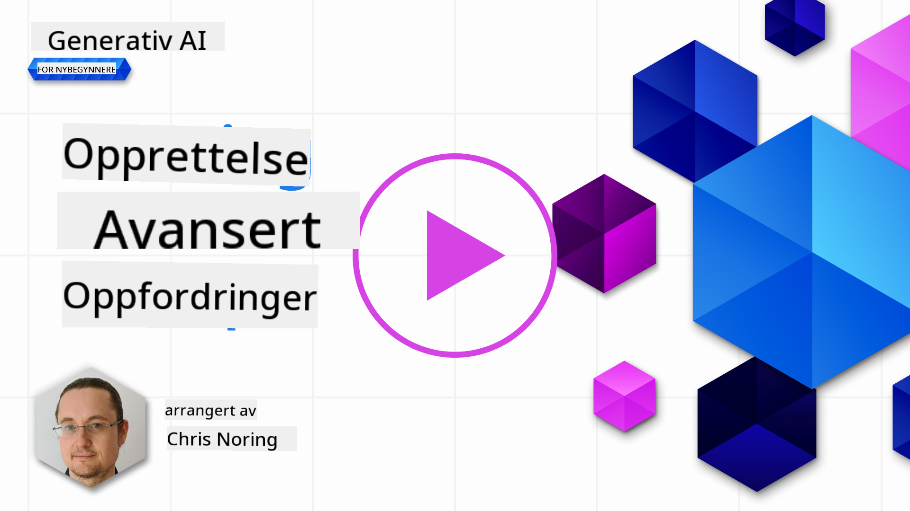

<!--
CO_OP_TRANSLATOR_METADATA:
{
  "original_hash": "b2651fb16bcfbc62b8e518751ed90fdb",
  "translation_date": "2025-10-17T19:17:07+00:00",
  "source_file": "05-advanced-prompts/README.md",
  "language_code": "no"
}
-->
# Lage avanserte oppfordringer

[](https://youtu.be/BAjzkaCdRok?si=NmUIyRf7-cDgbjtt)

La oss oppsummere noen l칝rdommer fra forrige kapittel:

> Oppfordrings-_utforming_ er prosessen der vi **veileder modellen mot mer relevante svar** ved 친 gi mer nyttige instruksjoner eller kontekst.

Det er ogs친 to steg for 친 skrive oppfordringer: 친 konstruere oppfordringen ved 친 gi relevant kontekst, og _optimalisering_, hvordan man gradvis forbedrer oppfordringen.

P친 dette punktet har vi en grunnleggende forst친else av hvordan man skriver oppfordringer, men vi m친 g친 dypere. I dette kapittelet vil du g친 fra 친 pr칮ve ut ulike oppfordringer til 친 forst친 hvorfor 칠n oppfordring er bedre enn en annen. Du vil l칝re hvordan du konstruerer oppfordringer ved 친 f칮lge noen grunnleggende teknikker som kan brukes p친 enhver LLM.

## Introduksjon

I dette kapittelet skal vi dekke f칮lgende temaer:

- Utvide kunnskapen din om oppfordringsutforming ved 친 bruke forskjellige teknikker p친 oppfordringene dine.
- Konfigurere oppfordringene dine for 친 variere resultatet.

## L칝ringsm친l

Etter 친 ha fullf칮rt denne leksjonen, vil du kunne:

- Bruke oppfordringsutformingsteknikker som forbedrer resultatet av oppfordringene dine.
- Utf칮re oppfordringer som enten er varierte eller deterministiske.

## Oppfordringsutforming

Oppfordringsutforming er prosessen med 친 lage oppfordringer som gir 칮nsket resultat. Det er mer til oppfordringsutforming enn bare 친 skrive en tekstoppfordring. Oppfordringsutforming er ikke en ingeni칮rdisiplin, det er mer et sett med teknikker du kan bruke for 친 oppn친 칮nsket resultat.

### Et eksempel p친 en oppfordring

La oss ta en grunnleggende oppfordring som denne:

> Generer 10 sp칮rsm친l om geografi.

I denne oppfordringen bruker du faktisk et sett med forskjellige oppfordringsteknikker.

La oss bryte dette ned.

- **Kontekst**, du spesifiserer at det skal handle om "geografi".
- **Begrensning av resultatet**, du 칮nsker ikke mer enn 10 sp칮rsm친l.

### Begrensninger ved enkle oppfordringer

Du kan eller kan ikke f친 칮nsket resultat. Du vil f친 generert sp칮rsm친lene dine, men geografi er et stort tema, og du f친r kanskje ikke det du 칮nsker p친 grunn av f칮lgende grunner:

- **Stort tema**, du vet ikke om det vil handle om land, hovedsteder, elver og s친 videre.
- **Format**, hva om du 칮nsket at sp칮rsm친lene skulle v칝re formatert p친 en bestemt m친te?

Som du kan se, er det mye 친 vurdere n친r du lager oppfordringer.

S친 langt har vi sett et enkelt oppfordringseksempel, men generativ AI er i stand til mye mer for 친 hjelpe folk i en rekke roller og bransjer. La oss utforske noen grunnleggende teknikker neste.

### Teknikker for oppfordringer

F칮rst m친 vi forst친 at oppfordring er en _fremvoksende_ egenskap ved en LLM, noe som betyr at dette ikke er en funksjon som er innebygd i modellen, men heller noe vi oppdager mens vi bruker modellen.

Det finnes noen grunnleggende teknikker som vi kan bruke for 친 oppfordre en LLM. La oss utforske dem.

- **Zero-shot oppfordring**, dette er den mest grunnleggende formen for oppfordring. Det er en enkelt oppfordring som ber om et svar fra LLM basert utelukkende p친 treningsdataene.
- **Few-shot oppfordring**, denne typen oppfordring veileder LLM ved 친 gi 1 eller flere eksempler den kan stole p친 for 친 generere sitt svar.
- **Chain-of-thought**, denne typen oppfordring forteller LLM hvordan man bryter ned et problem i steg.
- **Generert kunnskap**, for 친 forbedre svaret p친 en oppfordring kan du gi genererte fakta eller kunnskap i tillegg til oppfordringen din.
- **Minst til mest**, som chain-of-thought, handler denne teknikken om 친 bryte ned et problem i en serie med steg og deretter be om at disse stegene utf칮res i rekkef칮lge.
- **Self-refine**, denne teknikken handler om 친 kritisere LLMs output og deretter be den om 친 forbedre seg.
- **Maieutisk oppfordring**, her 칮nsker du 친 sikre at LLMs svar er korrekt, og du ber den forklare ulike deler av svaret. Dette er en form for self-refine.

### Zero-shot oppfordring

Denne stilen av oppfordring er veldig enkel, den best친r av en enkelt oppfordring. Denne teknikken er sannsynligvis det du bruker n친r du begynner 친 l칝re om LLMs. Her er et eksempel:

- Oppfordring: "Hva er algebra?"
- Svar: "Algebra er en gren av matematikk som studerer matematiske symboler og reglene for 친 manipulere disse symbolene."

### Few-shot oppfordring

Denne stilen av oppfordring hjelper modellen ved 친 gi noen f친 eksempler sammen med foresp칮rselen. Den best친r av en enkelt oppfordring med tillegg av oppgave-spesifikke data. Her er et eksempel:

- Oppfordring: "Skriv et dikt i stil med Shakespeare. Her er noen eksempler p친 Shakespeare-sonetter:
  Sonett 18: 'Skal jeg sammenligne deg med en sommerdag? Du er mer vakker og mer temperert...'
  Sonett 116: 'La meg ikke til ekteskap av sanne sinn Innr칮mme hindringer. Kj칝rlighet er ikke kj칝rlighet Som endrer seg n친r den finner endring...'
  Sonett 132: 'Dine 칮yne elsker jeg, og de, som synes synd p친 meg, Kjenner ditt hjerte plager meg med forakt,...'
  N친, skriv en sonett om m친nens skj칮nnhet."
- Svar: "P친 himmelen skinner m친nen mykt, I s칮lvlys som kaster sin milde n친de,..."

Eksempler gir LLM konteksten, formatet eller stilen til 칮nsket output. De hjelper modellen med 친 forst친 den spesifikke oppgaven og generere mer n칮yaktige og relevante svar.

### Chain-of-thought

Chain-of-thought er en veldig interessant teknikk da den handler om 친 ta LLM gjennom en serie med steg. Ideen er 친 instruere LLM p친 en m친te som gj칮r at den forst친r hvordan man gj칮r noe. Vurder f칮lgende eksempel, med og uten chain-of-thought:

    - Oppfordring: "Alice har 5 epler, kaster 3 epler, gir 2 til Bob og Bob gir ett tilbake, hvor mange epler har Alice?"
    - Svar: 5

LLM svarer med 5, som er feil. Riktig svar er 1 eple, gitt beregningen (5 -3 -2 + 1 = 1).

S친 hvordan kan vi l칝re LLM 친 gj칮re dette riktig?

La oss pr칮ve chain-of-thought. 칀 bruke chain-of-thought betyr:

1. Gi LLM et lignende eksempel.
1. Vis beregningen, og hvordan man beregner det riktig.
1. Gi den opprinnelige oppfordringen.

Slik gj칮r du det:

- Oppfordring: "Lisa har 7 epler, kaster 1 eple, gir 4 epler til Bart og Bart gir ett tilbake:
  7 -1 = 6
  6 -4 = 2
  2 +1 = 3  
  Alice har 5 epler, kaster 3 epler, gir 2 til Bob og Bob gir ett tilbake, hvor mange epler har Alice?"
  Svar: 1

Legg merke til hvordan vi skriver vesentlig lengre oppfordringer med et annet eksempel, en beregning og deretter den opprinnelige oppfordringen, og vi kommer frem til riktig svar 1.

Som du kan se, er chain-of-thought en veldig kraftig teknikk.

### Generert kunnskap

Mange ganger n친r du vil konstruere en oppfordring, 칮nsker du 친 gj칮re det ved 친 bruke data fra din egen bedrift. Du vil at en del av oppfordringen skal komme fra bedriften, og den andre delen skal v칝re den faktiske oppfordringen du er interessert i.

Som et eksempel kan oppfordringen din se slik ut hvis du er i forsikringsbransjen:

```text
{{company}}: {{company_name}}
{{products}}:
{{products_list}}
Please suggest an insurance given the following budget and requirements:
Budget: {{budget}}
Requirements: {{requirements}}
```

Ovenfor ser du hvordan oppfordringen er konstruert ved hjelp av en mal. I malen er det en rekke variabler, angitt med `{{variable}}`, som vil bli erstattet med faktiske verdier fra en bedrifts-API.

Her er et eksempel p친 hvordan oppfordringen kan se ut n친r variablene er erstattet med innhold fra din bedrift:

```text
Insurance company: ACME Insurance
Insurance products (cost per month):
- Car, cheap, 500 USD
- Car, expensive, 1100 USD
- Home, cheap, 600 USD
- Home, expensive, 1200 USD
- Life, cheap, 100 USD

Please suggest an insurance given the following budget and requirements:
Budget: $1000
Requirements: Car, Home, and Life insurance
```

N친r denne oppfordringen kj칮res gjennom en LLM, vil den produsere et svar som dette:

```output
Given the budget and requirements, we suggest the following insurance package from ACME Insurance:
- Car, cheap, 500 USD
- Home, cheap, 600 USD
- Life, cheap, 100 USD
Total cost: $1,200 USD
```

Som du kan se, foresl친r den ogs친 livsforsikring, noe den ikke burde. Dette resultatet er en indikasjon p친 at vi m친 optimalisere oppfordringen ved 친 endre den for 친 v칝re tydeligere p친 hva den kan tillate. Etter litt _pr칮ving og feiling_ kommer vi frem til f칮lgende oppfordring:

```text
Insurance company: ACME Insurance
Insurance products (cost per month):
- type: Car, cheap, cost: 500 USD
- type: Car, expensive, cost: 1100 USD
- type: Home, cheap, cost: 600 USD
- type: Home, expensive, cost: 1200 USD
- type: Life, cheap, cost: 100 USD

Please suggest an insurance given the following budget and requirements:
Budget: $1000 restrict choice to types: Car, Home
```

Legg merke til hvordan det 친 legge til _type_ og _kostnad_ og ogs친 bruke n칮kkelordet _begrens_ hjelper LLM med 친 forst친 hva vi 칮nsker.

N친 f친r vi f칮lgende svar:

```output
Given the budget and requirements, we suggest the Car, Cheap insurance product which costs 500 USD per month.
```

Poenget med dette eksemplet var 친 vise at selv om vi bruker en grunnleggende teknikk som _generert kunnskap_, m친 vi fortsatt optimalisere oppfordringen i de fleste tilfeller for 친 f친 칮nsket resultat.

### Minst til mest

Ideen med minst-til-mest oppfordring er 친 bryte ned et st칮rre problem i delproblemer. P친 den m친ten hjelper du LLM med 친 "overvinne" det st칮rre problemet. Et godt eksempel kan v칝re innen dataanalyse, der du kan be LLM om 친 dele opp et problem slik:

> Oppfordring: Hvordan utf칮re dataanalyse i 5 steg?

Med AI-assistenten din som svarer med:

1. Samle data
1. Rense data
1. Analysere data
1. Visualisere data
1. Presentere data

### Self-refine, kritisere resultatene

Med generative AI-er og LLM-er kan du ikke stole blindt p친 resultatet. Du m친 verifisere det. Tross alt presenterer LLM bare det som mest sannsynlig kommer neste, ikke n칮dvendigvis det som er korrekt. Derfor er det en god id칠 친 be LLM om 친 kritisere seg selv, noe som leder oss til self-refine-teknikken.

Hvordan det fungerer er at du f칮lger f칮lgende steg:

1. Innledende oppfordring som ber LLM om 친 l칮se et problem
1. LLM svarer
1. Du kritiserer svaret og ber AI om 친 forbedre det
1. LLM svarer igjen, denne gangen tar det hensyn til kritikken og foresl친r l칮sninger det har kommet opp med

Du kan gjenta denne prosessen s친 mange ganger du vil.

Her er et eksempel som bruker denne teknikken:

> Oppfordring: "Lag en Python Web API med rutene produkter og kunder"

AI-svar:

```python
import flask
app = Flask(__name__)

@app.route('/products')
def products():
    return 'Products'

@app.route('/customers')
def customers():
    return 'Customers'
```

> Oppfordring: foresl친 3 forbedringer av koden ovenfor

AI-svar:

```text
Sure, here are three suggestions to improve the code:

Import the correct module: The first line should import Flask instead of flask. The correct import statement should be from flask import Flask.

Add a main function: Add a if __name__ == '__main__': block to the end of the file to run the application when the file is executed.

Use f-strings: Use f-strings to format the return statements in the route functions. For example, return 'Products' can be changed to return f'This is the {request.path} page'.
```

```python
from flask import Flask, request

app = Flask(__name__)

@app.route('/products')
def products():
    return f'This is the {request.path} page'

@app.route('/customers')
def customers():
    return f'This is the {request.path} page'

if __name__ == '__main__':
    app.run()
```

Som du kan se, forbedrer AI-svaret ovenfor den f칮rste foresl친tte koden takket v칝re kritikken av det f칮rste svaret.

### Maieutisk oppfordring

Maieutisk oppfordring er en teknikk som ligner p친 self-refine, men det handler mer om 친 be LLM om 친 forklare seg selv. M친let er 친 redusere inkonsekvenser i LLMs output for 친 sikre at den kommer frem til riktig svar. Arbeidsflyten du skal f칮lge er:

1. Be LLM om 친 svare p친 et sp칮rsm친l
1. For hver del av svaret, be LLM om 친 forklare det mer i dybden.
1. Hvis det er inkonsekvenser, forkast delene som er inkonsekvente.

Gjenta 2 og 3 til du har g친tt gjennom alle delene og er forn칮yd med svaret.

Her er et eksempel p친 en oppfordring:

> Oppfordring: Hvordan kan jeg lage en kriseplan for 친 h친ndtere en pandemi i 5 steg?
> LLM-svar:

```text
1. Identify the risks
1. Identify the stakeholders
1. Identify the resources
1. Identify the actions
1. Identify the communication channels
```

Den har identifisert 5 steg, men kan vi avgj칮re om dette er korrekt? La oss be LLM om 친 forklare hvert steg:

> Oppfordring: Forklar det f칮rste steget mer detaljert, hva er risikoene i detalj ved en pandemi?

```text
The risks are the following:

- Loss of life
- Loss of business
- Loss of reputation
- Loss of customers
- Loss of employees
```

P친 dette punktet vil vi sikre at LLM er korrekt, s친 vi ber den forklare den f칮rste risikoen mer detaljert og h친per den er konsistent med svaret ovenfor:

> Oppfordring: I en pandemi, hva er den st칮rste risikoen og hvorfor?

```text
The biggest risk is loss of life because it's the most important thing to protect.
```

> Hva er de to st칮rste risikoene i en pandemi?

```text
The two biggest risks are loss of life and loss of business.
```

P친 dette punktet er LLM konsistent og nevner "liv" og "virksomhet" som de to st칮rste risikoene. Vi kan n친 fortsette til neste steg og f칮le oss ganske sikre. Men vi b칮r ikke stole blindt p친 LLM, vi b칮r alltid verifisere output.

## Variere output

LLMs er ikke-deterministiske av natur, noe som betyr at du vil f친 forskjellige resultater hver gang du kj칮rer den samme oppfordringen. Pr칮v f칮lgende oppfordring for eksempel:

> "Generer kode for en Python Web API"

```python
# Import necessary modules
import flask
from flask import request, jsonify

# Create a Flask app
app = flask.Flask(__name__)

# Create a route for the API
@app.route('/api', methods=['GET'])
def api():
    # Get the data from the request
    data = request.args

    # Process the data
    result = process_data(data)

    # Return the result as JSON
    return jsonify(result)

# Function to process the data
def process_data(data):
    # Do something with the data
    result = data + 1

    # Return the result
    return result

# Run the app
if __name__ == '__main__':
    app.run()

```

칀 kj칮re den samme oppfordringen igjen genererer et litt annet svar:

```python
#import necessary packages
import flask
from flask import request, jsonify

#create the Flask application
app = flask.Flask(__name__)
app.config["DEBUG"] = True

#create a list of books
books = [
    {'id': 0,
     'title': 'A Fire Upon the Deep',
     'author': 'Vernor Vinge',
     'first_sentence': 'The coldsleep itself was dreamless.',
     'year_published': '1992'},
    {'id': 1,
     'title': 'The Ones Who Walk Away From Omelas',
     'author': 'Ursula K. Le Guin',
     'first_sentence': 'With a clamor of bells that set the swallows soaring, the Festival of Summer came to the city Omelas, bright-towered by the sea.',
     'published': '1973'},
    {'id': 2,
     'title': 'Dhalgren',
     'author': 'Samuel R. Delany',
     'first_sentence': 'to wound the autumnal city.',
     'published': '1975'}
]

#create an endpoint for the API
@app.route('/', methods=['GET'])
def home():
    return '''<h1>Books API</h1>
<p>A prototype API for retrieving books.</p>'''

#create an endpoint to return all books
@app.route('/api/v1/resources/books/all', methods=['GET'])
def api_all():
    return jsonify(books)

#create an endpoint to return a single book
@app.route('/api/v1/resources/books', methods=['GET'])
def api_id():
    #check if an ID was provided as part of the URL
    #if ID is provided, assign it to a variable
    #if no ID is provided, display an error
    if 'id' in request.args:
        id = int(request.args['id'])
    else:
        return "Error: No id field provided. Please specify an id."

    #create an empty list for our results
    results = []

    #loop through the data and match results that fit the requested ID
    #IDs are unique, but other fields might return many results
    for book in books:
        if book['id'] == id:
            results.append(book)

    #use the jsonify function from Flask to convert our list of
    #Python dictionaries to the JSON format
    return jsonify(results)

app.run()
```

> S친 er variert output et problem?

Det avhenger av hva du pr칮ver 친 gj칮re. Hvis du 칮nsker et spesifikt svar, er det et problem. Hvis du er ok med variert output som "Generer hvilke som helst 3 sp칮rsm친l om geografi", er det ikke et problem.

### Bruke temperatur for 친 variere output

Ok, s친 vi har bestemt oss for at vi vil begrense output til 친 v칝re mer forutsigbar, det vil si mer deterministisk. Hvordan gj칮r vi det?

Temperatur er en verdi mellom 0 og 1, hvor 0 er mest deterministisk og 1 er mest variert. Standardverdien er 0.7. La oss se hva som skjer med to kj칮ringer av den samme oppfordringen med temperatur satt til 0.1:

> "Generer kode for en Python Web API"

```python
#import necessary libraries
import flask
from flask import request, jsonify

#create an instance of the Flask class
app = flask.Flask(__name__)

#create an endpoint for the API
@app.route('/api/v1/endpoint', methods=['GET'])
def api_endpoint():
    #get the request data
    data = request.get_json()

    #process the data
    result = process_data(data)

    #return the result
    return jsonify(result)

#function to process the data
def process_data(data):
    #process the data
    result = {'result': 'success'}

    #return the result
    return result

#run the Flask app
if __name__ == '__main__':
    app.run()

```

칀 kj칮re oppfordringen igjen gir oss dette resultatet:

```python
#import necessary libraries
import flask
from flask import request, jsonify

#create a Flask app
app = flask.Flask(__name__)

#create a route for the API
@app.route('/api', methods=['GET'])
def api_call():
    #get the data from the request
    data = request.get_json()

    #process the data
    result = process_data(data)

    #return the result
    return jsonify(result)

#define the process_data function
def process_data(data):
    #do something with the data
    result = data + 1

    #return the result
    return result

#run the app
if __name__ == '__main__':
    app.run()

```

Det er bare en liten forskjell mellom disse to outputene. La oss gj칮re det motsatte denne gangen, la oss sette temperaturen til 0.9:

```python
# Import necessary libraries
import flask
from flask import request, jsonify

# Create a Flask app
app = flask.Flask(__name__)

# Create a route for the API
@app.route('/api', methods=['GET'])
def api_call():
    # Get the data from the request
    data = request.args

    # Process the data
    result = process_data(data)

    # Return the result
    return jsonify(result)

# Function to process the data
def process_data(data):
    # Do something with the data
    result = data + 1

    # Return the result
    return result

# Run the app
if __name__ == '__main__':
    app.run()

```

og det andre fors칮ket med 0.9 som temperaturverdi:

```python
import flask
from flask import request, jsonify

# create the Flask app
app = flask.Flask(__name__)
app.config['DEBUG'] = True

# create some test data
books = [
    {'id': 0, 'title': 'A Fire Upon The Deep', 'author': 'Vernor Vinge', 'first_sentence': 'The coldsleep itself was dreamless.', 'year_published': '1992'},
    {'id': 1, 'title': 'The Ones Who Walk Away From Omelas', 'author': 'Ursula K. Le Guin', 'first_sentence': 'With a clamor of bells that set the swallows soaring, the Festival of Summer came to the city Omelas, bright-towered by the sea.', 'published': '1973'},
    {'id': 2, 'title': 'Dhalgren', 'author': 'Samuel R. Delany', 'first_sentence': 'to wound the autumnal city.', 'published': '1975'}
]

# create an endpoint
@app.route('/', methods=['GET'])
def home():
    return '''<h1>Welcome to our book API!</h1>'''

@app.route('/api/v1/resources/books

```

Som du kan se, kunne ikke resultatene v칝rt mer varierte.

> Merk at det finnes flere parametere du kan endre for 친 variere resultatet, som top-k, top-p, repetisjonsstraff, lengdestraff og diversitetsstraff, men disse ligger utenfor omfanget av dette kurset.

## Gode praksiser

Det finnes mange metoder du kan bruke for 친 oppn친 det du 칮nsker. Du vil finne din egen stil etter hvert som du bruker prompting mer og mer.

I tillegg til teknikkene vi har dekket, er det noen gode praksiser 친 vurdere n친r du lager prompts for en LLM.

Her er noen gode praksiser 친 vurdere:

- **Spesifiser kontekst**. Kontekst er viktig; jo mer du kan spesifisere, som domene, tema osv., desto bedre.
- Begrens output. Hvis du 칮nsker et spesifikt antall elementer eller en spesifikk lengde, spesifiser det.
- **Spesifiser b친de hva og hvordan**. Husk 친 nevne b친de hva du vil ha og hvordan du vil ha det, for eksempel "Lag en Python Web API med rutene produkter og kunder, del det opp i 3 filer".
- **Bruk maler**. Ofte vil du 칮nske 친 berike dine prompts med data fra din bedrift. Bruk maler for 친 gj칮re dette. Maler kan ha variabler som du erstatter med faktisk data.
- **Stav riktig**. LLM-er kan gi deg et korrekt svar, men hvis du staver riktig, vil du f친 et bedre svar.

## Oppgave

Her er kode i Python som viser hvordan man bygger en enkel API ved hjelp av Flask:

```python
from flask import Flask, request

app = Flask(__name__)

@app.route('/')
def hello():
    name = request.args.get('name', 'World')
    return f'Hello, {name}!'

if __name__ == '__main__':
    app.run()
```

Bruk en AI-assistent som GitHub Copilot eller ChatGPT og bruk "self-refine"-teknikken for 친 forbedre koden.

## L칮sning

Pr칮v 친 l칮se oppgaven ved 친 legge til passende prompts i koden.

> [!TIP]
> Formuler en prompt for 친 be om forbedringer, det er lurt 친 begrense hvor mange forbedringer. Du kan ogs친 be om forbedringer p친 en bestemt m친te, for eksempel arkitektur, ytelse, sikkerhet osv.

[L칮sning](../../../05-advanced-prompts/python/aoai-solution.py)

## Kunnskapssjekk

Hvorfor ville jeg brukt chain-of-thought prompting? Vis meg 1 korrekt svar og 2 feil svar.

1. For 친 l칝re LLM hvordan man l칮ser et problem.
1. B, For 친 l칝re LLM 친 finne feil i kode.
1. C, For 친 instruere LLM til 친 komme opp med forskjellige l칮sninger.

A: 1, fordi chain-of-thought handler om 친 vise LLM hvordan man l칮ser et problem ved 친 gi det en serie med steg, og lignende problemer og hvordan de ble l칮st.

## 游 Utfordring

Du har nettopp brukt self-refine-teknikken i oppgaven. Ta et hvilket som helst program du har laget og vurder hvilke forbedringer du 칮nsker 친 gj칮re. Bruk n친 self-refine-teknikken for 친 implementere de foresl친tte endringene. Hva synes du om resultatet, bedre eller d친rligere?

## Flott arbeid! Fortsett l칝ringen din

Etter 친 ha fullf칮rt denne leksjonen, sjekk ut v친r [Generative AI Learning-samling](https://aka.ms/genai-collection?WT.mc_id=academic-105485-koreyst) for 친 fortsette 친 utvikle din kunnskap om Generativ AI!

G친 videre til Leksjon 6, hvor vi skal bruke v친r kunnskap om Prompt Engineering til [친 bygge tekstgenereringsapper](../06-text-generation-apps/README.md?WT.mc_id=academic-105485-koreyst)

---

**Ansvarsfraskrivelse**:  
Dette dokumentet er oversatt ved hjelp av AI-oversettelsestjenesten [Co-op Translator](https://github.com/Azure/co-op-translator). Selv om vi streber etter n칮yaktighet, v칝r oppmerksom p친 at automatiserte oversettelser kan inneholde feil eller un칮yaktigheter. Det originale dokumentet p친 sitt opprinnelige spr친k b칮r anses som den autoritative kilden. For kritisk informasjon anbefales profesjonell menneskelig oversettelse. Vi er ikke ansvarlige for eventuelle misforst친elser eller feiltolkninger som oppst친r ved bruk av denne oversettelsen.