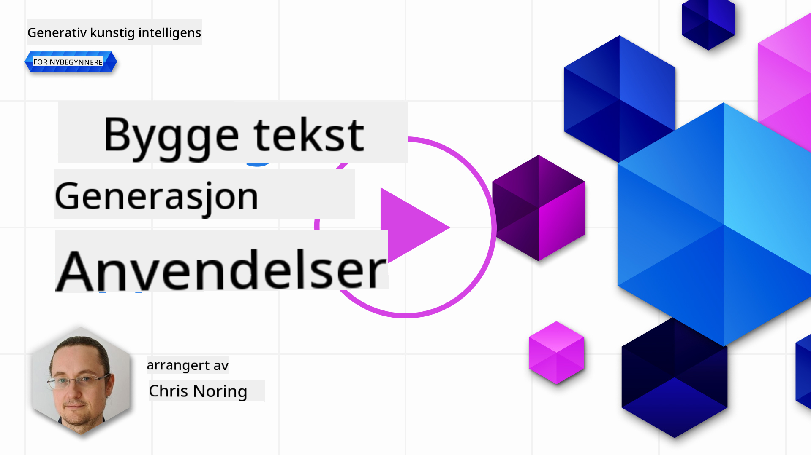

<!--
CO_OP_TRANSLATOR_METADATA:
{
  "original_hash": "5ec6c92b629564538ef397c550adb73e",
  "translation_date": "2025-05-19T17:01:52+00:00",
  "source_file": "06-text-generation-apps/README.md",
  "language_code": "no"
}
-->
# Bygge Tekstgenereringsapplikasjoner

[](https://aka.ms/gen-ai-lesson6-gh?WT.mc_id=academic-105485-koreyst)

> _(Klikk på bildet ovenfor for å se videoen av denne leksjonen)_

Så langt har du sett gjennom dette pensumet at det er kjernebegreper som "prompts" og til og med en hel disiplin kalt "prompt engineering". Mange verktøy du kan interagere med, som ChatGPT, Office 365, Microsoft Power Platform og mer, støtter deg i å bruke "prompts" for å oppnå noe.

For at du skal legge til en slik opplevelse i en app, må du forstå konsepter som "prompts", fullføringer og velge et bibliotek å jobbe med. Det er akkurat det du vil lære i dette kapitlet.

## Introduksjon

I dette kapitlet vil du:

- Lære om openai-biblioteket og dets kjernebegreper.
- Bygge en tekstgenereringsapp ved hjelp av openai.
- Forstå hvordan du bruker konsepter som "prompt", temperatur og tokens for å bygge en tekstgenereringsapp.

## Læringsmål

På slutten av denne leksjonen vil du kunne:

- Forklare hva en tekstgenereringsapp er.
- Bygge en tekstgenereringsapp ved hjelp av openai.
- Konfigurere appen din til å bruke flere eller færre tokens og også endre temperaturen for et variert utfall.

## Hva er en tekstgenereringsapp?

Normalt når du bygger en app, har den en slags grensesnitt som følgende:

- Kommandobasert. Konsollapper er typiske apper hvor du skriver inn en kommando, og den utfører en oppgave. For eksempel er `git` en kommandobasert app.
- Brukergrensesnitt (UI). Noen apper har grafiske brukergrensesnitt (GUIs) hvor du klikker på knapper, skriver inn tekst, velger alternativer og mer.

### Konsoll- og UI-apper er begrensede

Sammenlign det med en kommandobasert app hvor du skriver inn en kommando:

- **Det er begrenset**. Du kan ikke bare skrive inn en hvilken som helst kommando, bare de som appen støtter.
- **Språkspesifikt**. Noen apper støtter mange språk, men som standard er appen bygget for et spesifikt språk, selv om du kan legge til mer språkstøtte.

### Fordeler med tekstgenereringsapper

Så hvordan er en tekstgenereringsapp annerledes?

I en tekstgenereringsapp har du mer fleksibilitet, du er ikke begrenset til et sett med kommandoer eller et spesifikt inngangsspråk. I stedet kan du bruke naturlig språk for å interagere med appen. En annen fordel er at fordi du allerede interagerer med en datakilde som har blitt trent på et stort korpus av informasjon, mens en tradisjonell app kan være begrenset til hva som er i en database.

### Hva kan jeg bygge med en tekstgenereringsapp?

Det er mange ting du kan bygge. For eksempel:

- **En chatbot**. En chatbot som svarer på spørsmål om emner, som ditt selskap og dets produkter, kan være en god match.
- **Hjelper**. LLM-er er gode på ting som å oppsummere tekst, få innsikt fra tekst, produsere tekst som CV-er og mer.
- **Kodeassistent**. Avhengig av språkmodellen du bruker, kan du bygge en kodeassistent som hjelper deg med å skrive kode. For eksempel kan du bruke et produkt som GitHub Copilot samt ChatGPT for å hjelpe deg med å skrive kode.

## Hvordan kan jeg komme i gang?

Vel, du må finne en måte å integrere med en LLM som vanligvis innebærer følgende to tilnærminger:

- Bruk en API. Her konstruerer du webforespørsler med "prompt" og får generert tekst tilbake.
- Bruk et bibliotek. Biblioteker hjelper med å kapsle inn API-anropene og gjøre dem enklere å bruke.

## Biblioteker/SDK-er

Det finnes noen kjente biblioteker for å jobbe med LLM-er som:

- **openai**, dette biblioteket gjør det enkelt å koble til modellen din og sende inn "prompts".

Deretter er det biblioteker som opererer på et høyere nivå som:

- **Langchain**. Langchain er godt kjent og støtter Python.
- **Semantic Kernel**. Semantic Kernel er et bibliotek av Microsoft som støtter språkene C#, Python og Java.

## Første app ved hjelp av openai

La oss se hvordan vi kan bygge vår første app, hvilke biblioteker vi trenger, hvor mye som kreves og så videre.

### Installer openai

Det finnes mange biblioteker der ute for å interagere med OpenAI eller Azure OpenAI. Det er mulig å bruke flere programmeringsspråk som C#, Python, JavaScript, Java og mer. Vi har valgt å bruke `openai` Python-biblioteket, så vi bruker `pip` for å installere det.

```bash
pip install openai
```

### Opprett en ressurs

Du må utføre følgende trinn:

- Opprett en konto på Azure [https://azure.microsoft.com/free/](https://azure.microsoft.com/free/?WT.mc_id=academic-105485-koreyst).
- Få tilgang til Azure OpenAI. Gå til [https://learn.microsoft.com/azure/ai-services/openai/overview#how-do-i-get-access-to-azure-openai](https://learn.microsoft.com/azure/ai-services/openai/overview#how-do-i-get-access-to-azure-openai?WT.mc_id=academic-105485-koreyst) og be om tilgang.

  > [!NOTE]
  > På tidspunktet for skriving, må du søke om tilgang til Azure OpenAI.

- Installer Python <https://www.python.org/>
- Ha opprettet en Azure OpenAI Service-ressurs. Se denne guiden for hvordan du [oppretter en ressurs](https://learn.microsoft.com/azure/ai-services/openai/how-to/create-resource?pivots=web-portal?WT.mc_id=academic-105485-koreyst).

### Finn API-nøkkel og endepunkt

På dette punktet må du fortelle biblioteket ditt `openai` hvilken API-nøkkel du skal bruke. For å finne API-nøkkelen din, gå til "Keys and Endpoint"-seksjonen av din Azure OpenAI-ressurs og kopier "Key 1"-verdien.


Nå som du har denne informasjonen kopiert, la oss instruere bibliotekene til å bruke den.

> [!NOTE]
> Det er verdt å skille API-nøkkelen fra koden din. Du kan gjøre det ved å bruke miljøvariabler.
>
> - Sett miljøvariabelen `OPENAI_API_KEY` to your API key.
>   `export OPENAI_API_KEY='sk-...'`

### Sett opp konfigurasjon Azure

Hvis du bruker Azure OpenAI, her er hvordan du setter opp konfigurasjon:

```python
openai.api_type = 'azure'
openai.api_key = os.environ["OPENAI_API_KEY"]
openai.api_version = '2023-05-15'
openai.api_base = os.getenv("API_BASE")
```

Ovenfor setter vi følgende:

- `api_type` to `azure`. This tells the library to use Azure OpenAI and not OpenAI.
- `api_key`, this is your API key found in the Azure Portal.
- `api_version`, this is the version of the API you want to use. At the time of writing, the latest version is `2023-05-15`.
- `api_base`, this is the endpoint of the API. You can find it in the Azure Portal next to your API key.

> [!NOTE] > `os.getenv` is a function that reads environment variables. You can use it to read environment variables like `OPENAI_API_KEY` and `API_BASE`. Set these environment variables in your terminal or by using a library like `dotenv`.

## Generate text

The way to generate text is to use the `Completion` klasse. Her er et eksempel:

```python
prompt = "Complete the following: Once upon a time there was a"

completion = openai.Completion.create(model="davinci-002", prompt=prompt)
print(completion.choices[0].text)
```

I koden ovenfor oppretter vi et fullføringsobjekt og sender inn modellen vi vil bruke og "prompten". Deretter skriver vi ut den genererte teksten.

### Chat-fullføringer

Så langt har du sett hvordan vi har brukt `Completion` to generate text. But there's another class called `ChatCompletion` som er mer egnet for chatbots. Her er et eksempel på å bruke det:

```python
import openai

openai.api_key = "sk-..."

completion = openai.ChatCompletion.create(model="gpt-3.5-turbo", messages=[{"role": "user", "content": "Hello world"}])
print(completion.choices[0].message.content)
```

Mer om denne funksjonaliteten i et kommende kapittel.

## Øvelse - din første tekstgenereringsapp

Nå som vi har lært hvordan vi setter opp og konfigurerer openai, er det på tide å bygge din første tekstgenereringsapp. For å bygge appen din, følg disse trinnene:

1. Opprett et virtuelt miljø og installer openai:

   ```bash
   python -m venv venv
   source venv/bin/activate
   pip install openai
   ```

   > [!NOTE]
   > Hvis du bruker Windows, skriv `venv\Scripts\activate` instead of `source venv/bin/activate`.

   > [!NOTE]
   > Locate your Azure OpenAI key by going to [https://portal.azure.com/](https://portal.azure.com/?WT.mc_id=academic-105485-koreyst) and search for `Open AI` and select the `Open AI resource` and then select `Keys and Endpoint` and copy the `Key 1` verdi.

1. Opprett en _app.py_-fil og gi den følgende kode:

   ```python
   import openai

   openai.api_key = "<replace this value with your open ai key or Azure OpenAI key>"

   openai.api_type = 'azure'
   openai.api_version = '2023-05-15'
   openai.api_base = "<endpoint found in Azure Portal where your API key is>"
   deployment_name = "<deployment name>"

   # add your completion code
   prompt = "Complete the following: Once upon a time there was a"
   messages = [{"role": "user", "content": prompt}]

   # make completion
   completion = openai.chat.completions.create(model=deployment_name, messages=messages)

   # print response
   print(completion.choices[0].message.content)
   ```

   > [!NOTE]
   > Hvis du bruker Azure OpenAI, må du sette `api_type` to `azure` and set the `api_key` til din Azure OpenAI-nøkkel.

   Du bør se et utfall som følgende:

   ```output
    very unhappy _____.

   Once upon a time there was a very unhappy mermaid.
   ```

## Ulike typer "prompts", for ulike ting

Nå har du sett hvordan du genererer tekst ved hjelp av en "prompt". Du har til og med et program oppe og kjører som du kan endre og endre for å generere forskjellige typer tekst.

"Prompts" kan brukes til alle slags oppgaver. For eksempel:

- **Generere en type tekst**. For eksempel kan du generere et dikt, spørsmål til en quiz osv.
- **Oppslag av informasjon**. Du kan bruke "prompts" for å søke etter informasjon som følgende eksempel 'Hva betyr CORS i webutvikling?'.
- **Generere kode**. Du kan bruke "prompts" for å generere kode, for eksempel utvikle et regulært uttrykk som brukes til å validere e-post eller hvorfor ikke generere et helt program, som en webapp?

## Et mer praktisk brukstilfelle: en oppskriftsgenerator

Tenk deg at du har ingredienser hjemme, og du vil lage noe. For det trenger du en oppskrift. En måte å finne oppskrifter på er å bruke en søkemotor, eller du kan bruke en LLM til å gjøre det.

Du kan skrive en "prompt" som så:

> "Vis meg 5 oppskrifter for en rett med følgende ingredienser: kylling, poteter og gulrøtter. Per oppskrift, list opp alle ingrediensene som brukes"

Gitt "prompten" ovenfor, kan du få et svar som:

```output
1. Roasted Chicken and Vegetables:
Ingredients:
- 4 chicken thighs
- 2 potatoes, cut into cubes
- 2 carrots, cut into cubes
- 2 tablespoons olive oil
- 2 cloves garlic, minced
- 1 teaspoon dried thyme
- 1 teaspoon dried oregano
- Salt and pepper, to taste

2. Chicken and Potato Stew:
Ingredients:
- 2 tablespoons olive oil
- 1 onion, diced
- 2 cloves garlic, minced
- 2 chicken breasts, cut into cubes
- 2 potatoes, cut into cubes
- 2 carrots, cut into cubes
- 1 teaspoon dried oregano
- 1 teaspoon dried thyme
- 1 cup chicken broth
- Salt and pepper, to taste

3. Chicken and Potato Bake:
Ingredients:
- 2 tablespoons olive oil
- 2 chicken breasts, cut into cubes
- 2 potatoes, cut into cubes
- 2 carrots, cut into cubes
- 1 onion, diced
- 2 cloves garlic, minced
- 1 teaspoon dried oregano
- 1 teaspoon dried thyme
- 1 cup chicken broth
- Salt and pepper, to taste

4. Chicken and Potato Soup:
Ingredients:
- 2 tablespoons olive oil
- 1 onion, diced
- 2 cloves garlic, minced
- 2 chicken breasts, cut into cubes
- 2 potatoes, cut into cubes
- 2 carrots, cut into cubes
- 1 teaspoon dried oregano
- 1 teaspoon dried thyme
- 4 cups chicken broth
- Salt and pepper, to taste

5. Chicken and Potato Hash:
Ingredients:
- 2 tablespoons olive oil
- 2 chicken breasts, cut into cubes
- 2 potatoes, cut into cubes
- 2 carrots, cut into cubes
- 1 onion, diced
- 2 cloves garlic, minced
- 1 teaspoon dried oregano
```

Dette resultatet er flott, jeg vet hva jeg skal lage. På dette punktet, hva som kunne vært nyttige forbedringer er:

- Filtrere ut ingredienser jeg ikke liker eller er allergisk mot.
- Lage en handleliste, i tilfelle jeg ikke har alle ingrediensene hjemme.

For tilfellene ovenfor, la oss legge til en ekstra "prompt":

> "Vennligst fjern oppskrifter med hvitløk siden jeg er allergisk, og erstatt det med noe annet. Lag også en handleliste for oppskriftene, med tanke på at jeg allerede har kylling, poteter og gulrøtter hjemme."

Nå har du et nytt resultat, nemlig:

```output
1. Roasted Chicken and Vegetables:
Ingredients:
- 4 chicken thighs
- 2 potatoes, cut into cubes
- 2 carrots, cut into cubes
- 2 tablespoons olive oil
- 1 teaspoon dried thyme
- 1 teaspoon dried oregano
- Salt and pepper, to taste

2. Chicken and Potato Stew:
Ingredients:
- 2 tablespoons olive oil
- 1 onion, diced
- 2 chicken breasts, cut into cubes
- 2 potatoes, cut into cubes
- 2 carrots, cut into cubes
- 1 teaspoon dried oregano
- 1 teaspoon dried thyme
- 1 cup chicken broth
- Salt and pepper, to taste

3. Chicken and Potato Bake:
Ingredients:
- 2 tablespoons olive oil
- 2 chicken breasts, cut into cubes
- 2 potatoes, cut into cubes
- 2 carrots, cut into cubes
- 1 onion, diced
- 1 teaspoon dried oregano
- 1 teaspoon dried thyme
- 1 cup chicken broth
- Salt and pepper, to taste

4. Chicken and Potato Soup:
Ingredients:
- 2 tablespoons olive oil
- 1 onion, diced
- 2 chicken breasts, cut into cubes
- 2 potatoes, cut into cubes
- 2 carrots, cut into cubes
- 1 teaspoon dried oregano
- 1 teaspoon dried thyme
- 4 cups chicken broth
- Salt and pepper, to taste

5. Chicken and Potato Hash:
Ingredients:
- 2 tablespoons olive oil
- 2 chicken breasts, cut into cubes
- 2 potatoes, cut into cubes
- 2 carrots, cut into cubes
- 1 onion, diced
- 1 teaspoon dried oregano

Shopping List:
- Olive oil
- Onion
- Thyme
- Oregano
- Salt
- Pepper
```

Det er dine fem oppskrifter, uten nevnt hvitløk, og du har også en handleliste med tanke på hva du allerede har hjemme.

## Øvelse - bygg en oppskriftsgenerator

Nå som vi har spilt ut et scenario, la oss skrive kode for å matche det demonstrerte scenariet. For å gjøre det, følg disse trinnene:

1. Bruk den eksisterende _app.py_-filen som et utgangspunkt
1. Finn `prompt`-variabelen og endre koden til følgende:

   ```python
   prompt = "Show me 5 recipes for a dish with the following ingredients: chicken, potatoes, and carrots. Per recipe, list all the ingredients used"
   ```

   Hvis du nå kjører koden, bør du se et utfall som:

   ```output
   -Chicken Stew with Potatoes and Carrots: 3 tablespoons oil, 1 onion, chopped, 2 cloves garlic, minced, 1 carrot, peeled and chopped, 1 potato, peeled and chopped, 1 bay leaf, 1 thyme sprig, 1/2 teaspoon salt, 1/4 teaspoon black pepper, 1 1/2 cups chicken broth, 1/2 cup dry white wine, 2 tablespoons chopped fresh parsley, 2 tablespoons unsalted butter, 1 1/2 pounds boneless, skinless chicken thighs, cut into 1-inch pieces
   -Oven-Roasted Chicken with Potatoes and Carrots: 3 tablespoons extra-virgin olive oil, 1 tablespoon Dijon mustard, 1 tablespoon chopped fresh rosemary, 1 tablespoon chopped fresh thyme, 4 cloves garlic, minced, 1 1/2 pounds small red potatoes, quartered, 1 1/2 pounds carrots, quartered lengthwise, 1/2 teaspoon salt, 1/4 teaspoon black pepper, 1 (4-pound) whole chicken
   -Chicken, Potato, and Carrot Casserole: cooking spray, 1 large onion, chopped, 2 cloves garlic, minced, 1 carrot, peeled and shredded, 1 potato, peeled and shredded, 1/2 teaspoon dried thyme leaves, 1/4 teaspoon salt, 1/4 teaspoon black pepper, 2 cups fat-free, low-sodium chicken broth, 1 cup frozen peas, 1/4 cup all-purpose flour, 1 cup 2% reduced-fat milk, 1/4 cup grated Parmesan cheese

   -One Pot Chicken and Potato Dinner: 2 tablespoons olive oil, 1 pound boneless, skinless chicken thighs, cut into 1-inch pieces, 1 large onion, chopped, 3 cloves garlic, minced, 1 carrot, peeled and chopped, 1 potato, peeled and chopped, 1 bay leaf, 1 thyme sprig, 1/2 teaspoon salt, 1/4 teaspoon black pepper, 2 cups chicken broth, 1/2 cup dry white wine

   -Chicken, Potato, and Carrot Curry: 1 tablespoon vegetable oil, 1 large onion, chopped, 2 cloves garlic, minced, 1 carrot, peeled and chopped, 1 potato, peeled and chopped, 1 teaspoon ground coriander, 1 teaspoon ground cumin, 1/2 teaspoon ground turmeric, 1/2 teaspoon ground ginger, 1/4 teaspoon cayenne pepper, 2 cups chicken broth, 1/2 cup dry white wine, 1 (15-ounce) can chickpeas, drained and rinsed, 1/2 cup raisins, 1/2 cup chopped fresh cilantro
   ```

   > NOTE, din LLM er ikke-deterministisk, så du kan få forskjellige resultater hver gang du kjører programmet.

   Flott, la oss se hvordan vi kan forbedre ting. For å forbedre ting, vil vi sørge for at koden er fleksibel, slik at ingredienser og antall oppskrifter kan forbedres og endres.

1. La oss endre koden på følgende måte:

   ```python
   no_recipes = input("No of recipes (for example, 5): ")

   ingredients = input("List of ingredients (for example, chicken, potatoes, and carrots): ")

   # interpolate the number of recipes into the prompt an ingredients
   prompt = f"Show me {no_recipes} recipes for a dish with the following ingredients: {ingredients}. Per recipe, list all the ingredients used"
   ```

   Å ta koden for en testkjøring, kan se slik ut:

   ```output
   No of recipes (for example, 5): 3
   List of ingredients (for example, chicken, potatoes, and carrots): milk,strawberries

   -Strawberry milk shake: milk, strawberries, sugar, vanilla extract, ice cubes
   -Strawberry shortcake: milk, flour, baking powder, sugar, salt, unsalted butter, strawberries, whipped cream
   -Strawberry milk: milk, strawberries, sugar, vanilla extract
   ```

### Forbedre ved å legge til filter og handleliste

Vi har nå en fungerende app som kan produsere oppskrifter, og den er fleksibel ettersom den er avhengig av input fra brukeren, både på antall oppskrifter, men også ingrediensene som brukes.

For å forbedre det videre, vil vi legge til følgende:

- **Filtrer ut ingredienser**. Vi vil kunne filtrere ut ingredienser vi ikke liker eller er allergiske mot. For å oppnå denne endringen kan vi redigere vår eksisterende "prompt" og legge til en filterbetingelse på slutten av den slik:

  ```python
  filter = input("Filter (for example, vegetarian, vegan, or gluten-free): ")

  prompt = f"Show me {no_recipes} recipes for a dish with the following ingredients: {ingredients}. Per recipe, list all the ingredients used, no {filter}"
  ```

  Ovenfor legger vi til `{filter}` på slutten av "prompten", og vi fanger også opp filterverdien fra brukeren.

  Et eksempelinput på å kjøre programmet kan nå se slik ut:

  ```output
  No of recipes (for example, 5): 3
  List of ingredients (for example, chicken, potatoes, and carrots): onion,milk
  Filter (for example, vegetarian, vegan, or gluten-free): no milk

  1. French Onion Soup

  Ingredients:

  -1 large onion, sliced
  -3 cups beef broth
  -1 cup milk
  -6 slices french bread
  -1/4 cup shredded Parmesan cheese
  -1 tablespoon butter
  -1 teaspoon dried thyme
  -1/4 teaspoon salt
  -1/4 teaspoon black pepper

  Instructions:

  1. In a large pot, sauté onions in butter until golden brown.
  2. Add beef broth, milk, thyme, salt, and pepper. Bring to a boil.
  3. Reduce heat and simmer for 10 minutes.
  4. Place french bread slices on soup bowls.
  5. Ladle soup over bread.
  6. Sprinkle with Parmesan cheese.

  2. Onion and Potato Soup

  Ingredients:

  -1 large onion, chopped
  -2 cups potatoes, diced
  -3 cups vegetable broth
  -1 cup milk
  -1/4 teaspoon black pepper

  Instructions:

  1. In a large pot, sauté onions in butter until golden brown.
  2. Add potatoes, vegetable broth, milk, and pepper. Bring to a boil.
  3. Reduce heat and simmer for 10 minutes.
  4. Serve hot.

  3. Creamy Onion Soup

  Ingredients:

  -1 large onion, chopped
  -3 cups vegetable broth
  -1 cup milk
  -1/4 teaspoon black pepper
  -1/4 cup all-purpose flour
  -1/2 cup shredded Parmesan cheese

  Instructions:

  1. In a large pot, sauté onions in butter until golden brown.
  2. Add vegetable broth, milk, and pepper. Bring to a boil.
  3. Reduce heat and simmer for 10 minutes.
  4. In a small bowl, whisk together flour and Parmesan cheese until smooth.
  5. Add to soup and simmer for an additional 5 minutes, or until soup has thickened.
  ```

  Som du kan se, er eventuelle oppskrifter med melk i filtrert ut. Men, hvis du er laktoseintolerant, vil du kanskje filtrere ut oppskrifter med ost i dem også, så det er behov for å være tydelig.

- **Lage en handleliste**. Vi vil lage en handleliste, med tanke på hva vi allerede har hjemme.

  For denne funksjonaliteten kunne vi enten prøve å løse alt i en "prompt" eller vi kunne dele det opp i to "prompts". La oss prøve den siste tilnærmingen. Her foreslår vi å legge til en ekstra "prompt", men for at det skal fungere, må vi legge til resultatet av den første "prompten" som kontekst til den siste "prompten".

  Finn delen i koden som skriver ut resultatet fra den første "prompten" og legg til følgende kode nedenfor:

  ```python
  old_prompt_result = completion.choices[0].message.content
  prompt = "Produce a shopping list for the generated recipes and please don't include ingredients that I already have."

  new_prompt = f"{old_prompt_result} {prompt}"
  messages = [{"role": "user", "content": new_prompt}]
  completion = openai.Completion.create(engine=deployment_name, messages=messages, max_tokens=1200)

  # print response
  print("Shopping list:")
  print(completion.choices[0].message.content)
  ```

  Merk følgende:

  1. Vi konstruerer en ny "prompt" ved å legge til resultatet fra den første "prompten" til den nye "prompten":

     ```python
     new_prompt = f"{old_prompt_result} {prompt}"
     ```

  1. Vi gjør en ny forespørsel, men også med tanke på antall tokens vi ba om i den første "prompten", så denne gangen sier vi at `max_tokens` er 1200.

     ```python
     completion = openai.Completion.create(engine=deployment_name, prompt=new_prompt, max_tokens=1200)
     ```

     Når vi tar denne koden for en testkjøring, kommer vi nå til følgende utfall:

     ```output
     No of recipes (for example, 5): 2
     List of ingredients (for example, chicken, potatoes, and carrots): apple,flour
     Filter (for example, vegetarian, vegan, or gluten-free): sugar


     -Apple and flour pancakes: 1 cup flour, 1/2 tsp baking powder, 1/2 tsp baking soda, 1/4 tsp salt, 1 tbsp sugar, 1 egg, 1 cup buttermilk or sour milk, 1/4 cup melted butter, 1 Granny Smith apple, peeled and grated
     -Apple fritters: 1-1/2 cups flour, 1 tsp baking powder, 1/4 tsp salt, 1/4 tsp baking soda, 1/4 tsp nutmeg, 1/4 tsp cinnamon, 1/4 tsp allspice, 1/4 cup sugar, 1/4 cup vegetable shortening, 1/4 cup milk, 1 egg, 2 cups shredded, peeled apples
     Shopping list:
     -Flour, baking powder, baking soda, salt, sugar, egg, buttermilk, butter, apple, nutmeg, cinnamon, allspice
     ```

## Forbedre oppsettet ditt

Det vi har så langt er kode som fungerer, men det er noen justeringer vi bør gjøre for å forbedre ting ytterligere. Noen ting vi bør gjøre er:

- **Skille hemmeligheter fra kode**, som API-nøkkelen. Hemmeligheter hører ikke hjemme i kode og bør lagres på et sikkert sted. For å skille hemmeligheter fra kode, kan vi bruke miljøvariabler og biblioteker som `python-dotenv` to load them from a file. Here's how that would look like in code:

  1. Create a `.env`-fil med følgende innhold:

     ```bash
     OPENAI_API_KEY=sk-...
     ```

     > Merk, for Azure må du sette følgende miljøvariabler:

     ```bash
     OPENAI_API_TYPE=azure
     OPENAI_API_VERSION=2023-05-15
     OPENAI_API_BASE=<replace>
     ```

     I kode, ville du laste miljøvariablene slik:

     ```python
     from dotenv import load_dotenv

     load_dotenv()

     openai.api_key = os.environ["OPENAI_API_KEY"]
     ```

- **Et ord om tokenlengde**. Vi bør vurdere hvor mange tokens vi trenger for å generere teksten vi ønsker. Tokens koster penger, så der det er mulig, bør vi prøve å være økonomiske med antall tokens vi bruker. For eksempel, kan vi formulere "prompten" slik at vi kan bruke færre tokens?

  For å endre tokens brukt, kan du bruke `max_tokens`-parameteren. For eksempel, hvis du vil bruke 100 tokens, ville du gjøre:

  ```python
  completion = client.chat.completions.create(model=deployment, messages=messages, max_tokens=100)
  ```

- **Eksperimentere med temperatur**. Temperatur er noe vi ikke har nevnt så langt, men er en viktig kontekst for hvordan programmet vårt fungerer. Jo høyere temperaturverdi, desto mer tilfeldig vil utgangen være. Omvendt, jo lavere temperaturverdi, desto mer forutsigbar vil utgangen være. Vurder om du ønsker variasjon i utgangen din eller ikke.

  For å endre temperaturen, kan du bruke `temperature`-parameteren. For eksempel, hvis du vil bruke en temperatur på 0,5, ville du gjøre:

  ```python
  completion = client.chat.completions.create(model=deployment, messages=messages, temperature=0.5)
  ```

  > Merk, jo nærmere 1.0, desto mer variert vil utgangen være.

## Oppgave

For denne oppgaven kan du velge hva du vil bygge.

Her er noen forslag:

- Juster oppskriftsgeneratorappen for å forbedre den ytterligere. Lek med temperaturverdier og "prompts" for å se hva du kan komme opp med.
- Bygg en "studiekompis". Denne appen bør kunne svare på spørsmål om et emne, for eksempel Python, du kan ha "prompts" som "Hva er et visst emne i Python?", eller du kan ha en "prompt" som sier, vis meg kode for et visst emne osv.
- Historiebot, få historien til å bli levende, instruer boten til å spille en viss historisk karakter og still den spørsmål om dens liv og tider.

## Løsning

### Studiekompis

Nedenfor er en start-"prompt", se hvordan du kan bruke den og justere den etter dine ønsker.

```text
- "You're an expert on the Python language

    Suggest a beginner lesson for Python in the following format:

    Format:
    - concepts:
    - brief explanation of the lesson:
    - exercise in code with solutions"
```

### Historiebot

Her er noen "prompts" du kan bruke:

```text
- "You are Abe Lincoln, tell me about yourself in 3 sentences, and respond using grammar and words like Abe would have used"
- "You are Abe Lincoln, respond using grammar and words like Abe would have used:

   Tell me about your greatest accomplishments, in 300 words"
```

## Kunnskapssjekk

Hva gjør konseptet temperatur?

1. Det kontrollerer hvor tilfeldig utgangen er.
1. Det kontrollerer hvor stor responsen er.
1. Det kontrollerer hvor mange tokens som brukes.


**Ansvarsfraskrivelse**:  
Dette dokumentet har blitt oversatt ved hjelp av AI-oversettelsestjenesten [Co-op Translator](https://github.com/Azure/co-op-translator). Selv om vi streber etter nøyaktighet, vennligst vær oppmerksom på at automatiserte oversettelser kan inneholde feil eller unøyaktigheter. Det originale dokumentet på sitt opprinnelige språk bør anses som den autoritative kilden. For kritisk informasjon anbefales profesjonell menneskelig oversettelse. Vi er ikke ansvarlige for misforståelser eller feiltolkninger som oppstår ved bruk av denne oversettelsen.