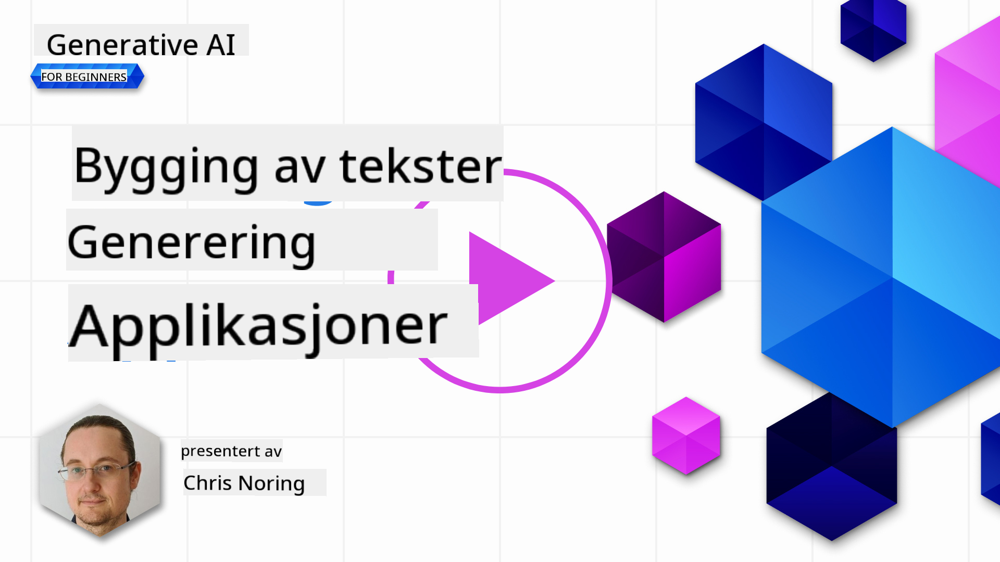

<!--
CO_OP_TRANSLATOR_METADATA:
{
  "original_hash": "df027997f1448323d6159b78a1b669bf",
  "translation_date": "2025-10-17T19:17:38+00:00",
  "source_file": "06-text-generation-apps/README.md",
  "language_code": "no"
}
-->
# Bygge applikasjoner for tekstgenerering

[](https://youtu.be/0Y5Luf5sRQA?si=t_xVg0clnAI4oUFZ)

> _(Klikk på bildet ovenfor for å se videoen til denne leksjonen)_

Så langt i dette kurset har du sett at det finnes kjernebegreper som "prompts" og til og med en hel disiplin kalt "prompt engineering". Mange verktøy du kan bruke, som ChatGPT, Office 365, Microsoft Power Platform og flere, støtter bruk av prompts for å oppnå noe.

For å legge til en slik opplevelse i en app, må du forstå begreper som prompts, fullføringer og velge et bibliotek å jobbe med. Det er akkurat det du vil lære i dette kapittelet.

## Introduksjon

I dette kapittelet vil du:

- Lære om openai-biblioteket og dets kjernebegreper.
- Bygge en tekstgenereringsapp ved hjelp av openai.
- Forstå hvordan du bruker begreper som prompt, temperatur og tokens for å bygge en tekstgenereringsapp.

## Læringsmål

Ved slutten av denne leksjonen vil du kunne:

- Forklare hva en tekstgenereringsapp er.
- Bygge en tekstgenereringsapp ved hjelp av openai.
- Konfigurere appen din til å bruke flere eller færre tokens og også endre temperaturen for et variert resultat.

## Hva er en tekstgenereringsapp?

Vanligvis når du bygger en app, har den en slags grensesnitt som følgende:

- Kommando-basert. Konsollapper er typiske apper der du skriver inn en kommando, og den utfører en oppgave. For eksempel er `git` en kommando-basert app.
- Brukergrensesnitt (UI). Noen apper har grafiske brukergrensesnitt (GUIs) der du klikker på knapper, skriver inn tekst, velger alternativer og mer.

### Begrensninger med konsoll- og UI-apper

Sammenlign dette med en kommando-basert app der du skriver inn en kommando:

- **Det er begrenset**. Du kan ikke bare skrive inn hvilken som helst kommando, kun de som appen støtter.
- **Språkspecifikt**. Noen apper støtter mange språk, men som standard er appen bygget for et spesifikt språk, selv om du kan legge til mer språksupport.

### Fordeler med tekstgenereringsapper

Så hvordan er en tekstgenereringsapp annerledes?

I en tekstgenereringsapp har du mer fleksibilitet, du er ikke begrenset til et sett med kommandoer eller et spesifikt innføringsspråk. I stedet kan du bruke naturlig språk for å interagere med appen. En annen fordel er at du allerede interagerer med en datakilde som er trent på et stort korpus av informasjon, mens en tradisjonell app kan være begrenset til det som finnes i en database.

### Hva kan jeg bygge med en tekstgenereringsapp?

Det er mange ting du kan bygge. For eksempel:

- **En chatbot**. En chatbot som svarer på spørsmål om emner, som din bedrift og dens produkter, kan være en god match.
- **Hjelper**. LLMs er gode på ting som å oppsummere tekst, få innsikt fra tekst, produsere tekst som CV-er og mer.
- **Kodeassistent**. Avhengig av språkmodellen du bruker, kan du bygge en kodeassistent som hjelper deg med å skrive kode. For eksempel kan du bruke et produkt som GitHub Copilot samt ChatGPT for å hjelpe deg med å skrive kode.

## Hvordan kan jeg komme i gang?

Vel, du må finne en måte å integrere med en LLM, som vanligvis innebærer følgende to tilnærminger:

- Bruke en API. Her konstruerer du webforespørsler med din prompt og får generert tekst tilbake.
- Bruke et bibliotek. Biblioteker hjelper med å kapsle inn API-kallene og gjøre dem enklere å bruke.

## Biblioteker/SDK-er

Det finnes noen velkjente biblioteker for å jobbe med LLMs som:

- **openai**, dette biblioteket gjør det enkelt å koble til modellen din og sende inn prompts.

Deretter finnes det biblioteker som opererer på et høyere nivå som:

- **Langchain**. Langchain er velkjent og støtter Python.
- **Semantic Kernel**. Semantic Kernel er et bibliotek fra Microsoft som støtter språkene C#, Python og Java.

## Første app ved bruk av openai

La oss se hvordan vi kan bygge vår første app, hvilke biblioteker vi trenger, hvor mye som kreves og så videre.

### Installere openai

Det finnes mange biblioteker der ute for å interagere med OpenAI eller Azure OpenAI. Det er mulig å bruke mange programmeringsspråk som C#, Python, JavaScript, Java og mer. Vi har valgt å bruke Python-biblioteket `openai`, så vi bruker `pip` for å installere det.

```bash
pip install openai
```

### Opprette en ressurs

Du må utføre følgende trinn:

- Opprett en konto på Azure [https://azure.microsoft.com/free/](https://azure.microsoft.com/free/?WT.mc_id=academic-105485-koreyst).
- Få tilgang til Azure OpenAI. Gå til [https://learn.microsoft.com/azure/ai-services/openai/overview#how-do-i-get-access-to-azure-openai](https://learn.microsoft.com/azure/ai-services/openai/overview#how-do-i-get-access-to-azure-openai?WT.mc_id=academic-105485-koreyst) og be om tilgang.

  > [!NOTE]
  > På tidspunktet for skriving, må du søke om tilgang til Azure OpenAI.

- Installer Python <https://www.python.org/>
- Ha opprettet en Azure OpenAI Service-ressurs. Se denne veiledningen for hvordan du [oppretter en ressurs](https://learn.microsoft.com/azure/ai-services/openai/how-to/create-resource?pivots=web-portal?WT.mc_id=academic-105485-koreyst).

### Finn API-nøkkel og endepunkt

På dette tidspunktet må du fortelle `openai`-biblioteket hvilken API-nøkkel som skal brukes. For å finne API-nøkkelen din, gå til "Keys and Endpoint"-seksjonen i din Azure OpenAI-ressurs og kopier verdien "Key 1".


Nå som du har denne informasjonen kopiert, la oss instruere bibliotekene til å bruke den.

> [!NOTE]
> Det er verdt å skille API-nøkkelen din fra koden din. Du kan gjøre det ved å bruke miljøvariabler.
>
> - Sett miljøvariabelen `OPENAI_API_KEY` til API-nøkkelen din.
>   `export OPENAI_API_KEY='sk-...'`

### Konfigurasjonsoppsett for Azure

Hvis du bruker Azure OpenAI, her er hvordan du setter opp konfigurasjonen:

```python
openai.api_type = 'azure'
openai.api_key = os.environ["OPENAI_API_KEY"]
openai.api_version = '2023-05-15'
openai.api_base = os.getenv("API_BASE")
```

Ovenfor setter vi følgende:

- `api_type` til `azure`. Dette forteller biblioteket å bruke Azure OpenAI og ikke OpenAI.
- `api_key`, dette er din API-nøkkel funnet i Azure Portal.
- `api_version`, dette er versjonen av API-en du vil bruke. På tidspunktet for skriving er den nyeste versjonen `2023-05-15`.
- `api_base`, dette er endepunktet til API-en. Du finner det i Azure Portal ved siden av API-nøkkelen din.

> [!NOTE] > `os.getenv` er en funksjon som leser miljøvariabler. Du kan bruke den til å lese miljøvariabler som `OPENAI_API_KEY` og `API_BASE`. Sett disse miljøvariablene i terminalen din eller ved å bruke et bibliotek som `dotenv`.

## Generere tekst

Måten å generere tekst på er å bruke klassen `Completion`. Her er et eksempel:

```python
prompt = "Complete the following: Once upon a time there was a"

completion = openai.Completion.create(model="davinci-002", prompt=prompt)
print(completion.choices[0].text)
```

I koden ovenfor oppretter vi et fullføringsobjekt og sender inn modellen vi vil bruke og prompten. Deretter skriver vi ut den genererte teksten.

### Chat-fullføringer

Så langt har du sett hvordan vi har brukt `Completion` til å generere tekst. Men det finnes en annen klasse kalt `ChatCompletion` som er mer egnet for chatbots. Her er et eksempel på hvordan du bruker den:

```python
import openai

openai.api_key = "sk-..."

completion = openai.ChatCompletion.create(model="gpt-3.5-turbo", messages=[{"role": "user", "content": "Hello world"}])
print(completion.choices[0].message.content)
```

Mer om denne funksjonaliteten i et kommende kapittel.

## Øvelse - din første tekstgenereringsapp

Nå som vi har lært hvordan vi setter opp og konfigurerer openai, er det på tide å bygge din første tekstgenereringsapp. For å bygge appen din, følg disse trinnene:

1. Opprett et virtuelt miljø og installer openai:

   ```bash
   python -m venv venv
   source venv/bin/activate
   pip install openai
   ```

   > [!NOTE]
   > Hvis du bruker Windows, skriv `venv\Scripts\activate` i stedet for `source venv/bin/activate`.

   > [!NOTE]
   > Finn din Azure OpenAI-nøkkel ved å gå til [https://portal.azure.com/](https://portal.azure.com/?WT.mc_id=academic-105485-koreyst) og søk etter `Open AI` og velg `Open AI resource` og deretter `Keys and Endpoint` og kopier verdien `Key 1`.

1. Opprett en _app.py_-fil og gi den følgende kode:

   ```python
   import openai

   openai.api_key = "<replace this value with your open ai key or Azure OpenAI key>"

   openai.api_type = 'azure'
   openai.api_version = '2023-05-15'
   openai.api_base = "<endpoint found in Azure Portal where your API key is>"
   deployment_name = "<deployment name>"

   # add your completion code
   prompt = "Complete the following: Once upon a time there was a"
   messages = [{"role": "user", "content": prompt}]

   # make completion
   completion = openai.chat.completions.create(model=deployment_name, messages=messages)

   # print response
   print(completion.choices[0].message.content)
   ```

   > [!NOTE]
   > Hvis du bruker Azure OpenAI, må du sette `api_type` til `azure` og sette `api_key` til din Azure OpenAI-nøkkel.

   Du bør se et output som følgende:

   ```output
    very unhappy _____.

   Once upon a time there was a very unhappy mermaid.
   ```

## Ulike typer prompts for ulike ting

Nå har du sett hvordan du genererer tekst ved hjelp av en prompt. Du har til og med et program oppe og kjører som du kan modifisere og endre for å generere ulike typer tekst.

Prompts kan brukes til alle slags oppgaver. For eksempel:

- **Generere en type tekst**. For eksempel kan du generere et dikt, spørsmål til en quiz osv.
- **Søke opp informasjon**. Du kan bruke prompts til å søke etter informasjon som følgende eksempel 'Hva betyr CORS i webutvikling?'.
- **Generere kode**. Du kan bruke prompts til å generere kode, for eksempel utvikle et regulært uttrykk som brukes til å validere e-post eller hvorfor ikke generere et helt program, som en webapp?

## Et mer praktisk bruksområde: en oppskriftsgenerator

Tenk deg at du har ingredienser hjemme og vil lage noe mat. For det trenger du en oppskrift. En måte å finne oppskrifter på er å bruke en søkemotor, eller du kan bruke en LLM til å gjøre det.

Du kan skrive en prompt som dette:

> "Vis meg 5 oppskrifter for en rett med følgende ingredienser: kylling, poteter og gulrøtter. Per oppskrift, list opp alle ingrediensene som brukes."

Gitt prompten ovenfor, kan du få et svar som ligner på:

```output
1. Roasted Chicken and Vegetables:
Ingredients:
- 4 chicken thighs
- 2 potatoes, cut into cubes
- 2 carrots, cut into cubes
- 2 tablespoons olive oil
- 2 cloves garlic, minced
- 1 teaspoon dried thyme
- 1 teaspoon dried oregano
- Salt and pepper, to taste

2. Chicken and Potato Stew:
Ingredients:
- 2 tablespoons olive oil
- 1 onion, diced
- 2 cloves garlic, minced
- 2 chicken breasts, cut into cubes
- 2 potatoes, cut into cubes
- 2 carrots, cut into cubes
- 1 teaspoon dried oregano
- 1 teaspoon dried thyme
- 1 cup chicken broth
- Salt and pepper, to taste

3. Chicken and Potato Bake:
Ingredients:
- 2 tablespoons olive oil
- 2 chicken breasts, cut into cubes
- 2 potatoes, cut into cubes
- 2 carrots, cut into cubes
- 1 onion, diced
- 2 cloves garlic, minced
- 1 teaspoon dried oregano
- 1 teaspoon dried thyme
- 1 cup chicken broth
- Salt and pepper, to taste

4. Chicken and Potato Soup:
Ingredients:
- 2 tablespoons olive oil
- 1 onion, diced
- 2 cloves garlic, minced
- 2 chicken breasts, cut into cubes
- 2 potatoes, cut into cubes
- 2 carrots, cut into cubes
- 1 teaspoon dried oregano
- 1 teaspoon dried thyme
- 4 cups chicken broth
- Salt and pepper, to taste

5. Chicken and Potato Hash:
Ingredients:
- 2 tablespoons olive oil
- 2 chicken breasts, cut into cubes
- 2 potatoes, cut into cubes
- 2 carrots, cut into cubes
- 1 onion, diced
- 2 cloves garlic, minced
- 1 teaspoon dried oregano
```

Dette resultatet er flott, jeg vet hva jeg skal lage. På dette tidspunktet kan nyttige forbedringer være:

- Filtrere ut ingredienser jeg ikke liker eller er allergisk mot.
- Lage en handleliste, i tilfelle jeg ikke har alle ingrediensene hjemme.

For de ovennevnte tilfellene, la oss legge til en ekstra prompt:

> "Vennligst fjern oppskrifter med hvitløk da jeg er allergisk og erstatt det med noe annet. Lag også en handleliste for oppskriftene, med tanke på at jeg allerede har kylling, poteter og gulrøtter hjemme."

Nå har du et nytt resultat, nemlig:

```output
1. Roasted Chicken and Vegetables:
Ingredients:
- 4 chicken thighs
- 2 potatoes, cut into cubes
- 2 carrots, cut into cubes
- 2 tablespoons olive oil
- 1 teaspoon dried thyme
- 1 teaspoon dried oregano
- Salt and pepper, to taste

2. Chicken and Potato Stew:
Ingredients:
- 2 tablespoons olive oil
- 1 onion, diced
- 2 chicken breasts, cut into cubes
- 2 potatoes, cut into cubes
- 2 carrots, cut into cubes
- 1 teaspoon dried oregano
- 1 teaspoon dried thyme
- 1 cup chicken broth
- Salt and pepper, to taste

3. Chicken and Potato Bake:
Ingredients:
- 2 tablespoons olive oil
- 2 chicken breasts, cut into cubes
- 2 potatoes, cut into cubes
- 2 carrots, cut into cubes
- 1 onion, diced
- 1 teaspoon dried oregano
- 1 teaspoon dried thyme
- 1 cup chicken broth
- Salt and pepper, to taste

4. Chicken and Potato Soup:
Ingredients:
- 2 tablespoons olive oil
- 1 onion, diced
- 2 chicken breasts, cut into cubes
- 2 potatoes, cut into cubes
- 2 carrots, cut into cubes
- 1 teaspoon dried oregano
- 1 teaspoon dried thyme
- 4 cups chicken broth
- Salt and pepper, to taste

5. Chicken and Potato Hash:
Ingredients:
- 2 tablespoons olive oil
- 2 chicken breasts, cut into cubes
- 2 potatoes, cut into cubes
- 2 carrots, cut into cubes
- 1 onion, diced
- 1 teaspoon dried oregano

Shopping List:
- Olive oil
- Onion
- Thyme
- Oregano
- Salt
- Pepper
```

Det er dine fem oppskrifter, uten hvitløk nevnt, og du har også en handleliste med tanke på hva du allerede har hjemme.

## Øvelse - bygg en oppskriftsgenerator

Nå som vi har spilt ut et scenario, la oss skrive kode som matcher det demonstrerte scenariet. For å gjøre det, følg disse trinnene:

1. Bruk den eksisterende _app.py_-filen som et utgangspunkt.
1. Finn variabelen `prompt` og endre koden til følgende:

   ```python
   prompt = "Show me 5 recipes for a dish with the following ingredients: chicken, potatoes, and carrots. Per recipe, list all the ingredients used"
   ```

   Hvis du nå kjører koden, bør du se et output som ligner på:

   ```output
   -Chicken Stew with Potatoes and Carrots: 3 tablespoons oil, 1 onion, chopped, 2 cloves garlic, minced, 1 carrot, peeled and chopped, 1 potato, peeled and chopped, 1 bay leaf, 1 thyme sprig, 1/2 teaspoon salt, 1/4 teaspoon black pepper, 1 1/2 cups chicken broth, 1/2 cup dry white wine, 2 tablespoons chopped fresh parsley, 2 tablespoons unsalted butter, 1 1/2 pounds boneless, skinless chicken thighs, cut into 1-inch pieces
   -Oven-Roasted Chicken with Potatoes and Carrots: 3 tablespoons extra-virgin olive oil, 1 tablespoon Dijon mustard, 1 tablespoon chopped fresh rosemary, 1 tablespoon chopped fresh thyme, 4 cloves garlic, minced, 1 1/2 pounds small red potatoes, quartered, 1 1/2 pounds carrots, quartered lengthwise, 1/2 teaspoon salt, 1/4 teaspoon black pepper, 1 (4-pound) whole chicken
   -Chicken, Potato, and Carrot Casserole: cooking spray, 1 large onion, chopped, 2 cloves garlic, minced, 1 carrot, peeled and shredded, 1 potato, peeled and shredded, 1/2 teaspoon dried thyme leaves, 1/4 teaspoon salt, 1/4 teaspoon black pepper, 2 cups fat-free, low-sodium chicken broth, 1 cup frozen peas, 1/4 cup all-purpose flour, 1 cup 2% reduced-fat milk, 1/4 cup grated Parmesan cheese

   -One Pot Chicken and Potato Dinner: 2 tablespoons olive oil, 1 pound boneless, skinless chicken thighs, cut into 1-inch pieces, 1 large onion, chopped, 3 cloves garlic, minced, 1 carrot, peeled and chopped, 1 potato, peeled and chopped, 1 bay leaf, 1 thyme sprig, 1/2 teaspoon salt, 1/4 teaspoon black pepper, 2 cups chicken broth, 1/2 cup dry white wine

   -Chicken, Potato, and Carrot Curry: 1 tablespoon vegetable oil, 1 large onion, chopped, 2 cloves garlic, minced, 1 carrot, peeled and chopped, 1 potato, peeled and chopped, 1 teaspoon ground coriander, 1 teaspoon ground cumin, 1/2 teaspoon ground turmeric, 1/2 teaspoon ground ginger, 1/4 teaspoon cayenne pepper, 2 cups chicken broth, 1/2 cup dry white wine, 1 (15-ounce) can chickpeas, drained and rinsed, 1/2 cup raisins, 1/2 cup chopped fresh cilantro
   ```

   > MERK, din LLM er ikke-deterministisk, så du kan få forskjellige resultater hver gang du kjører programmet.

   Flott, la oss se hvordan vi kan forbedre ting. For å forbedre ting, vil vi sørge for at koden er fleksibel, slik at ingredienser og antall oppskrifter kan forbedres og endres.

1. La oss endre koden på følgende måte:

   ```python
   no_recipes = input("No of recipes (for example, 5): ")

   ingredients = input("List of ingredients (for example, chicken, potatoes, and carrots): ")

   # interpolate the number of recipes into the prompt an ingredients
   prompt = f"Show me {no_recipes} recipes for a dish with the following ingredients: {ingredients}. Per recipe, list all the ingredients used"
   ```

   Å teste koden kan se slik ut:

   ```output
   No of recipes (for example, 5): 3
   List of ingredients (for example, chicken, potatoes, and carrots): milk,strawberries

   -Strawberry milk shake: milk, strawberries, sugar, vanilla extract, ice cubes
   -Strawberry shortcake: milk, flour, baking powder, sugar, salt, unsalted butter, strawberries, whipped cream
   -Strawberry milk: milk, strawberries, sugar, vanilla extract
   ```

### Forbedre ved å legge til filter og handleliste

Vi har nå en fungerende app som kan produsere oppskrifter, og den er fleksibel da den baserer seg på input fra brukeren, både når det gjelder antall oppskrifter og ingredienser som brukes.

For å forbedre den ytterligere, ønsker vi å legge til følgende:

- **Filtrere ut ingredienser**. Vi ønsker å kunne filtrere ut ingredienser vi ikke liker eller er allergiske mot. For å oppnå denne endringen kan vi redigere vår eksisterende prompt og legge til en filterbetingelse på slutten av den, som dette:

  ```python
  filter = input("Filter (for example, vegetarian, vegan, or gluten-free): ")

  prompt = f"Show me {no_recipes} recipes for a dish with the following ingredients: {ingredients}. Per recipe, list all the ingredients used, no {filter}"
  ```

  Ovenfor legger vi til `{filter}` på slutten av prompten, og vi fanger også opp filterverdien fra brukeren.

  Et eksempel på input når programmet kjøres kan nå se slik ut:

  ```output
  No of recipes (for example, 5): 3
  List of ingredients (for example, chicken, potatoes, and carrots): onion,milk
  Filter (for example, vegetarian, vegan, or gluten-free): no milk

  1. French Onion Soup

  Ingredients:

  -1 large onion, sliced
  -3 cups beef broth
  -1 cup milk
  -6 slices french bread
  -1/4 cup shredded Parmesan cheese
  -1 tablespoon butter
  -1 teaspoon dried thyme
  -1/4 teaspoon salt
  -1/4 teaspoon black pepper

  Instructions:

  1. In a large pot, sauté onions in butter until golden brown.
  2. Add beef broth, milk, thyme, salt, and pepper. Bring to a boil.
  3. Reduce heat and simmer for 10 minutes.
  4. Place french bread slices on soup bowls.
  5. Ladle soup over bread.
  6. Sprinkle with Parmesan cheese.

  2. Onion and Potato Soup

  Ingredients:

  -1 large onion, chopped
  -2 cups potatoes, diced
  -3 cups vegetable broth
  -1 cup milk
  -1/4 teaspoon black pepper

  Instructions:

  1. In a large pot, sauté onions in butter until golden brown.
  2. Add potatoes, vegetable broth, milk, and pepper. Bring to a boil.
  3. Reduce heat and simmer for 10 minutes.
  4. Serve hot.

  3. Creamy Onion Soup

  Ingredients:

  -1 large onion, chopped
  -3 cups vegetable broth
  -1 cup milk
  -1/4 teaspoon black pepper
  -1/4 cup all-purpose flour
  -1/2 cup shredded Parmesan cheese

  Instructions:

  1. In a large pot, sauté onions in butter until golden brown.
  2. Add vegetable broth, milk, and pepper. Bring to a boil.
  3. Reduce heat and simmer for 10 minutes.
  4. In a small bowl, whisk together flour and Parmesan cheese until smooth.
  5. Add to soup and simmer for an additional 5 minutes, or until soup has thickened.
  ```

  Som du kan se, er alle oppskrifter med melk filtrert ut. Men hvis du er laktoseintolerant, vil du kanskje også filtrere ut oppskrifter med ost, så det er behov for å være tydelig.

- **Lage en handleliste**. Vi ønsker å lage en handleliste, med tanke på hva vi allerede har hjemme.

  For denne funksjonaliteten kan vi enten prøve å løse alt i én prompt, eller vi kan dele det opp i to prompts. La oss prøve den siste tilnærmingen. Her foreslår vi å legge til en ekstra prompt, men for at det skal fungere, må vi legge til resultatet fra den første prompten som kontekst til den andre prompten.

  Finn delen i koden som skriver ut resultatet fra den første prompten, og legg til følgende kode nedenfor:
  ```python
  old_prompt_result = completion.choices[0].message.content
  prompt = "Produce a shopping list for the generated recipes and please don't include ingredients that I already have."

  new_prompt = f"{old_prompt_result} {prompt}"
  messages = [{"role": "user", "content": new_prompt}]
  completion = openai.Completion.create(engine=deployment_name, messages=messages, max_tokens=1200)

  # print response
  print("Shopping list:")
  print(completion.choices[0].message.content)
  ```

  Merk følgende:

  1. Vi konstruerer en ny prompt ved å legge til resultatet fra den første prompten til den nye prompten:

     ```python
     new_prompt = f"{old_prompt_result} {prompt}"
     ```

  1. Vi gjør en ny forespørsel, men tar også hensyn til antall tokens vi ba om i den første prompten, så denne gangen sier vi `max_tokens` er 1200.

     ```python
     completion = openai.Completion.create(engine=deployment_name, prompt=new_prompt, max_tokens=1200)
     ```

     Når vi tester denne koden, kommer vi nå fram til følgende output:

     ```output
     No of recipes (for example, 5): 2
     List of ingredients (for example, chicken, potatoes, and carrots): apple,flour
     Filter (for example, vegetarian, vegan, or gluten-free): sugar


     -Apple and flour pancakes: 1 cup flour, 1/2 tsp baking powder, 1/2 tsp baking soda, 1/4 tsp salt, 1 tbsp sugar, 1 egg, 1 cup buttermilk or sour milk, 1/4 cup melted butter, 1 Granny Smith apple, peeled and grated
     -Apple fritters: 1-1/2 cups flour, 1 tsp baking powder, 1/4 tsp salt, 1/4 tsp baking soda, 1/4 tsp nutmeg, 1/4 tsp cinnamon, 1/4 tsp allspice, 1/4 cup sugar, 1/4 cup vegetable shortening, 1/4 cup milk, 1 egg, 2 cups shredded, peeled apples
     Shopping list:
     -Flour, baking powder, baking soda, salt, sugar, egg, buttermilk, butter, apple, nutmeg, cinnamon, allspice
     ```

## Forbedre oppsettet ditt

Det vi har så langt er kode som fungerer, men det er noen justeringer vi bør gjøre for å forbedre ting ytterligere. Noen ting vi bør gjøre er:

- **Separere hemmeligheter fra kode**, som API-nøkkelen. Hemmeligheter hører ikke hjemme i kode og bør lagres på et sikkert sted. For å separere hemmeligheter fra kode, kan vi bruke miljøvariabler og biblioteker som `python-dotenv` for å laste dem fra en fil. Slik kan det se ut i kode:

  1. Lag en `.env`-fil med følgende innhold:

     ```bash
     OPENAI_API_KEY=sk-...
     ```

     > Merk, for Azure må du sette følgende miljøvariabler:

     ```bash
     OPENAI_API_TYPE=azure
     OPENAI_API_VERSION=2023-05-15
     OPENAI_API_BASE=<replace>
     ```

     I kode ville du laste miljøvariablene slik:

     ```python
     from dotenv import load_dotenv

     load_dotenv()

     openai.api_key = os.environ["OPENAI_API_KEY"]
     ```

- **Et ord om token-lengde**. Vi bør vurdere hvor mange tokens vi trenger for å generere teksten vi ønsker. Tokens koster penger, så der det er mulig, bør vi prøve å være økonomiske med antall tokens vi bruker. For eksempel, kan vi formulere prompten slik at vi kan bruke færre tokens?

  For å endre tokens som brukes, kan du bruke parameteren `max_tokens`. For eksempel, hvis du vil bruke 100 tokens, kan du gjøre:

  ```python
  completion = client.chat.completions.create(model=deployment, messages=messages, max_tokens=100)
  ```

- **Eksperimentere med temperatur**. Temperatur er noe vi ikke har nevnt så langt, men det er en viktig kontekst for hvordan programmet vårt presterer. Jo høyere temperaturverdi, desto mer tilfeldig blir output. Omvendt, jo lavere temperaturverdi, desto mer forutsigbar blir output. Vurder om du ønsker variasjon i output eller ikke.

  For å endre temperaturen, kan du bruke parameteren `temperature`. For eksempel, hvis du vil bruke en temperatur på 0.5, kan du gjøre:

  ```python
  completion = client.chat.completions.create(model=deployment, messages=messages, temperature=0.5)
  ```

  > Merk, jo nærmere 1.0, desto mer variert blir output.

## Oppgave

For denne oppgaven kan du velge hva du vil lage.

Her er noen forslag:

- Juster oppskriftsgenerator-appen for å forbedre den ytterligere. Eksperimenter med temperaturverdier og promptene for å se hva du kan komme opp med.
- Lag en "studiekompis". Denne appen bør kunne svare på spørsmål om et emne, for eksempel Python. Du kan ha prompts som "Hva er et bestemt emne i Python?", eller du kan ha en prompt som sier, vis meg kode for et bestemt emne osv.
- Historiebot, få historien til å komme til live, instruer boten til å spille en bestemt historisk karakter og still den spørsmål om livet og tiden dens.

## Løsning

### Studiekompis

Nedenfor er en startprompt, se hvordan du kan bruke den og justere den etter eget ønske.

```text
- "You're an expert on the Python language

    Suggest a beginner lesson for Python in the following format:

    Format:
    - concepts:
    - brief explanation of the lesson:
    - exercise in code with solutions"
```

### Historiebot

Her er noen prompts du kan bruke:

```text
- "You are Abe Lincoln, tell me about yourself in 3 sentences, and respond using grammar and words like Abe would have used"
- "You are Abe Lincoln, respond using grammar and words like Abe would have used:

   Tell me about your greatest accomplishments, in 300 words"
```

## Kunnskapssjekk

Hva gjør konseptet temperatur?

1. Det styrer hvor tilfeldig output er.
1. Det styrer hvor stor responsen er.
1. Det styrer hvor mange tokens som brukes.

## 🚀 Utfordring

Når du jobber med oppgaven, prøv å variere temperaturen, prøv å sette den til 0, 0.5 og 1. Husk at 0 er minst variert og 1 er mest. Hvilken verdi fungerer best for appen din?

## Flott arbeid! Fortsett læringen din

Etter å ha fullført denne leksjonen, sjekk ut vår [Generative AI Learning-samling](https://aka.ms/genai-collection?WT.mc_id=academic-105485-koreyst) for å fortsette å utvikle kunnskapen din om Generative AI!

Gå videre til Leksjon 7 hvor vi skal se på hvordan man [bygger chatteapplikasjoner](../07-building-chat-applications/README.md?WT.mc_id=academic-105485-koreyst)!

---

**Ansvarsfraskrivelse**:  
Dette dokumentet er oversatt ved hjelp av AI-oversettelsestjenesten [Co-op Translator](https://github.com/Azure/co-op-translator). Selv om vi streber etter nøyaktighet, vær oppmerksom på at automatiske oversettelser kan inneholde feil eller unøyaktigheter. Det originale dokumentet på dets opprinnelige språk bør anses som den autoritative kilden. For kritisk informasjon anbefales profesjonell menneskelig oversettelse. Vi er ikke ansvarlige for eventuelle misforståelser eller feiltolkninger som oppstår ved bruk av denne oversettelsen.