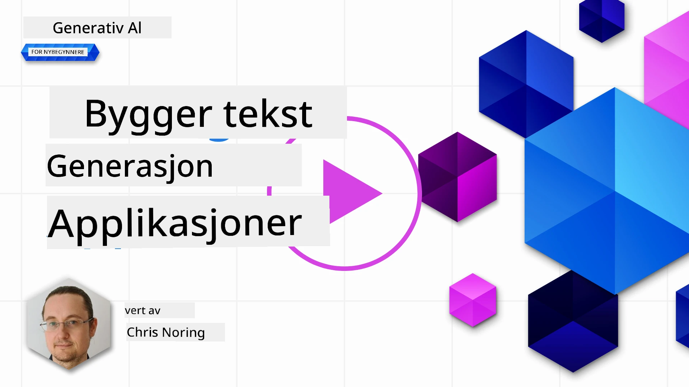

# Bygge teksterskapingsapplikasjoner

[](https://youtu.be/0Y5Luf5sRQA?si=t_xVg0clnAI4oUFZ)

> _(Klikk på bildet over for å se video av denne leksjonen)_

Du har så langt i dette pensumet sett at det finnes kjernebegreper som prompts og til og med en hel disiplin kalt "prompt engineering". Mange verktøy du kan samhandle med som ChatGPT, Office 365, Microsoft Power Platform og mer, støtter bruk av prompts for å oppnå noe.

For at du skal kunne legge til en slik opplevelse i en app, må du forstå konsepter som prompts, fullføringer og velge et bibliotek å jobbe med. Det er akkurat det du vil lære i dette kapittelet.

## Introduksjon

I dette kapittelet vil du:

- Lære om openai-biblioteket og dets kjernebegreper.
- Bygge en teksterskapingsapp ved hjelp av openai.
- Forstå hvordan du bruker konsepter som prompt, temperatur og tokens for å bygge en teksterskapingsapp.

## Læringsmål

På slutten av denne leksjonen vil du kunne:

- Forklare hva en teksterskapingsapp er.
- Bygge en teksterskapingsapp ved hjelp av openai.
- Konfigurere appen din til å bruke flere eller færre tokens og også endre temperaturen, for variert output.

## Hva er en teksterskapingsapp?

Normalt når du bygger en app, har den en slags brukergrensesnitt som følgende:

- Kommandobasert. Konsollapper er typiske apper der du skriver en kommando, og den utfører en oppgave. For eksempel er `git` en kommandobasert app.
- Brukergrensesnitt (UI). Noen apper har grafiske brukergrensesnitt (GUI) der du klikker på knapper, legger inn tekst, velger alternativer og mer.

### Konsoll- og UI-apper er begrenset

Sammenlign det med en kommandobasert app der du skriver en kommando:

- **Den er begrenset**. Du kan ikke bare skrive hvilken som helst kommando, kun de appen støtter.
- **Språkspesifikk**. Noen apper støtter mange språk, men som standard er appen bygget for et spesifikt språk, selv om du kan legge til mer språkstøtte.

### Fordeler med teksterskapingsapper

Så hvordan skiller en teksterskapingsapp seg?

I en teksterskapingsapp har du mer fleksibilitet, du er ikke begrenset til et sett med kommandoer eller et spesifikt inndataspråk. I stedet kan du bruke naturlig språk for å samhandle med appen. En annen fordel er at du allerede samhandler med en datakilde som er trent på en omfattende mengde informasjon, mens en tradisjonell app kan være begrenset til hva som er i en database.

### Hva kan jeg bygge med en teksterskapingsapp?

Det er mange ting du kan bygge. For eksempel:

- **En chattebot**. En chattebot som svarer på spørsmål om emner som firmaet ditt og produktene det tilbyr, kan være en god match.
- **Hjelper**. LLM-er er flinke til ting som å oppsummere tekst, hente innsikt fra tekst, produsere tekst som CV-er og mer.
- **Kodeassistent**. Avhengig av språkmodellen du bruker, kan du bygge en kodeassistent som hjelper deg å skrive kode. For eksempel kan du bruke et produkt som GitHub Copilot så vel som ChatGPT for å hjelpe deg å kode.

## Hvordan kan jeg komme i gang?

Vel, du må finne en måte å integrere med en LLM på, som vanligvis innebærer følgende to tilnærminger:

- Bruke en API. Her setter du sammen nettverksforespørsler med prompten din og får generert tekst tilbake.
- Bruke et bibliotek. Biblioteker innkapsler API-kallene og gjør dem enklere å bruke.

## Biblioteker/SDK-er

Det finnes noen kjente biblioteker for å jobbe med LLM-er som:

- **openai**, dette biblioteket gjør det enkelt å koble til modellen din og sende inn prompts.

Så finnes det biblioteker som opererer på et høyere nivå som:

- **Langchain**. Langchain er godt kjent og støtter Python.
- **Semantic Kernel**. Semantic Kernel er et bibliotek fra Microsoft som støtter språkene C#, Python og Java.

## Første app ved bruk av openai

La oss se hvordan vi kan bygge vår første app, hvilke biblioteker vi trenger, hvor mye som kreves og så videre.

### Installer openai

Det finnes mange biblioteker der ute for å samhandle med OpenAI eller Azure OpenAI. Det er også mulig å bruke mange programmeringsspråk som C#, Python, JavaScript, Java og mer. Vi har valgt å bruke `openai` Python-biblioteket, så vi bruker `pip` for å installere det.

```bash
pip install openai
```

### Opprett en ressurs

Du må utføre følgende trinn:

- Opprett en konto på Azure [https://azure.microsoft.com/free/](https://azure.microsoft.com/free/?WT.mc_id=academic-105485-koreyst).
- Få tilgang til Azure OpenAI. Gå til [https://learn.microsoft.com/azure/ai-services/openai/overview#how-do-i-get-access-to-azure-openai](https://learn.microsoft.com/azure/ai-services/openai/overview#how-do-i-get-access-to-azure-openai?WT.mc_id=academic-105485-koreyst) og søk om tilgang.

  > [!NOTE]
  > På tidspunktet for skriving må du søke om tilgang til Azure OpenAI.

- Installer Python <https://www.python.org/>
- Ha opprettet en Azure OpenAI Service-ressurs. Se denne guiden for hvordan du [oppretter en ressurs](https://learn.microsoft.com/azure/ai-services/openai/how-to/create-resource?pivots=web-portal?WT.mc_id=academic-105485-koreyst).

### Finn API-nøkkel og endepunkt

På dette tidspunktet må du fortelle `openai`-biblioteket hvilket API-nøkkel som skal brukes. For å finne API-nøkkelen din, gå til "Keys and Endpoint"-seksjonen i Azure OpenAI-ressursen din og kopier verdien for "Key 1".


Nå som du har kopiert denne informasjonen, la oss instruere bibliotekene om å bruke den.

> [!NOTE]
> Det er verdt å skille API-nøkkelen din fra koden din. Du kan gjøre det ved å bruke miljøvariabler.
>
> - Sett miljøvariabelen `OPENAI_API_KEY` til din API-nøkkel.
>   `export OPENAI_API_KEY='sk-...'`

### Sett opp konfigurering Azure

Hvis du bruker Azure OpenAI (nå en del av Microsoft Foundry), her er hvordan du setter opp konfigurasjonen. Vi bruker standard `OpenAI`-klient pekt mot Azure OpenAI `/openai/v1/`-endepunktet, som fungerer med Responses API og trenger ingen `api_version`:

```python
import os
from openai import OpenAI

client = OpenAI(
    api_key=os.environ["AZURE_OPENAI_API_KEY"],
    base_url=f"{os.environ['AZURE_OPENAI_ENDPOINT'].rstrip('/')}/openai/v1/",
)
```

Ovenfor setter vi følgende:

- `api_key`, dette er din API-nøkkel funnet i Azure-portalen eller Microsoft Foundry-portalen.
- `base_url`, dette er endepunktet til Foundry-ressursen din med `/openai/v1/` lagt til. Det stabile v1-endepunktet fungerer på tvers av OpenAI og Azure OpenAI uten `api_version`-administrasjon.

> [!NOTE] > `os.environ` leser miljøvariabler. Du kan bruke det til å lese miljøvariabler som `AZURE_OPENAI_API_KEY` og `AZURE_OPENAI_ENDPOINT`. Sett disse miljøvariablene i terminalen din eller ved å bruke et bibliotek som `dotenv`.

## Generer tekst

Måten å generere tekst på er å bruke Responses API via `responses.create`-metoden. Her er et eksempel:

```python
prompt = "Complete the following: Once upon a time there was a"

response = client.responses.create(
    model="gpt-4o-mini",  # dette er navnet på modellutrullingen din
    input=prompt,
    store=False,
)
print(response.output_text)
```

I koden ovenfor oppretter vi et svar og sender inn modellen vi vil bruke og prompten. Så skriver vi ut den genererte teksten via `response.output_text`.

### Samtaler med flere runder

Responses API passer godt for både enkeltrundig teksterskaping og flertrundige chatbots – du gir en liste med meldinger i `input` for å bygge opp en samtale:

```python
from openai import OpenAI

client = OpenAI(api_key="sk-...")

response = client.responses.create(model="gpt-4o-mini", input="Hello world", store=False)
print(response.output_text)
```

Mer om denne funksjonaliteten i et kommende kapittel.

## Øvelse - din første teksterskapingsapp

Nå som vi har lært hvordan man setter opp og konfigurerer openai, er det på tide å bygge din første teksterskapingsapp. For å bygge appen, følg disse trinnene:

1. Opprett et virtuelt miljø og installer openai:

   ```bash
   python -m venv venv
   source venv/bin/activate
   pip install openai
   ```

   > [!NOTE]
   > Hvis du bruker Windows, skriv `venv\Scripts\activate` i stedet for `source venv/bin/activate`.

   > [!NOTE]
   > Finn din Azure OpenAI-nøkkel ved å gå til [https://portal.azure.com/](https://portal.azure.com/?WT.mc_id=academic-105485-koreyst) og søk etter `Open AI`, velg `Open AI resource` og deretter `Keys and Endpoint` og kopier `Key 1`-verdien.

1. Lag en _app.py_-fil og gi den følgende kode:

   ```python
   import os
   from openai import OpenAI

   client = OpenAI(
       api_key="<replace this value with your Azure OpenAI key>",
       base_url="<endpoint found in Azure Portal>/openai/v1/",
   )
   deployment_name = "<deployment name>"

   # legg til din fullføringskode
   prompt = "Complete the following: Once upon a time there was a"

   # gjør en forespørsel ved bruk av Responses API
   response = client.responses.create(model=deployment_name, input=prompt, store=False)

   # skriv ut responsen
   print(response.output_text)
   ```

   > [!NOTE]
   > Hvis du bruker OpenAI som ikke er Azure, bruk `client = OpenAI(api_key="<erstatt denne verdien med din OpenAI-nøkkel>")` (ingen `base_url`) og send inn et modellnavn som `gpt-4o-mini` i stedet for et distribusjonsnavn.

   Du bør se en output som følgende:

   ```output
    very unhappy _____.

   Once upon a time there was a very unhappy mermaid.
   ```

## Ulike typer prompts, til forskjellige ting

Nå har du sett hvordan du kan generere tekst ved å bruke en prompt. Du har til og med et program som kjører som du kan modifisere og endre for å generere forskjellige typer tekst.

Prompts kan brukes til alle slags oppgaver. For eksempel:

- **Generer en type tekst**. For eksempel kan du generere et dikt, spørsmål til en quiz osv.
- **Søk opp informasjon**. Du kan bruke prompts for å lete etter informasjon som i følgende eksempel: 'Hva betyr CORS i webutvikling?'.
- **Generer kode**. Du kan bruke prompts for å generere kode, for eksempel utvikle et regulært uttrykk som validerer e-post eller hvorfor ikke generere et helt program, som en webapp?

## En mer praktisk brukstilfelle: en oppskriftsgenerator

Forestill deg at du har ingredienser hjemme og vil lage noe mat. For det trenger du en oppskrift. En måte å finne oppskrifter på er å bruke en søkemotor, eller du kan bruke en LLM til det.

Du kan skrive en prompt slik:

> "Vis meg 5 oppskrifter for en rett med følgende ingredienser: kylling, poteter og gulrøtter. Per oppskrift, list opp alle ingrediensene som brukes"

Gitt ovenstående prompt kan du få et svar som ligner:

```output
1. Roasted Chicken and Vegetables:
Ingredients:
- 4 chicken thighs
- 2 potatoes, cut into cubes
- 2 carrots, cut into cubes
- 2 tablespoons olive oil
- 2 cloves garlic, minced
- 1 teaspoon dried thyme
- 1 teaspoon dried oregano
- Salt and pepper, to taste

2. Chicken and Potato Stew:
Ingredients:
- 2 tablespoons olive oil
- 1 onion, diced
- 2 cloves garlic, minced
- 2 chicken breasts, cut into cubes
- 2 potatoes, cut into cubes
- 2 carrots, cut into cubes
- 1 teaspoon dried oregano
- 1 teaspoon dried thyme
- 1 cup chicken broth
- Salt and pepper, to taste

3. Chicken and Potato Bake:
Ingredients:
- 2 tablespoons olive oil
- 2 chicken breasts, cut into cubes
- 2 potatoes, cut into cubes
- 2 carrots, cut into cubes
- 1 onion, diced
- 2 cloves garlic, minced
- 1 teaspoon dried oregano
- 1 teaspoon dried thyme
- 1 cup chicken broth
- Salt and pepper, to taste

4. Chicken and Potato Soup:
Ingredients:
- 2 tablespoons olive oil
- 1 onion, diced
- 2 cloves garlic, minced
- 2 chicken breasts, cut into cubes
- 2 potatoes, cut into cubes
- 2 carrots, cut into cubes
- 1 teaspoon dried oregano
- 1 teaspoon dried thyme
- 4 cups chicken broth
- Salt and pepper, to taste

5. Chicken and Potato Hash:
Ingredients:
- 2 tablespoons olive oil
- 2 chicken breasts, cut into cubes
- 2 potatoes, cut into cubes
- 2 carrots, cut into cubes
- 1 onion, diced
- 2 cloves garlic, minced
- 1 teaspoon dried oregano
```

Dette resultatet er flott, jeg vet hva jeg skal lage. På dette tidspunktet kunne det være nyttige forbedringer som:

- Filtrere ut ingredienser jeg ikke liker eller er allergisk mot.
- Lage en handleliste, i tilfelle jeg ikke har alle ingrediensene hjemme.

For de ovennevnte tilfellene, la oss legge til en ekstra prompt:

> "Vennligst fjern oppskrifter med hvitløk da jeg er allergisk og erstatt det med noe annet. Lag også en handleliste for oppskriftene, tatt i betraktning at jeg allerede har kylling, poteter og gulrøtter hjemme."

Nå har du et nytt resultat, nemlig:

```output
1. Roasted Chicken and Vegetables:
Ingredients:
- 4 chicken thighs
- 2 potatoes, cut into cubes
- 2 carrots, cut into cubes
- 2 tablespoons olive oil
- 1 teaspoon dried thyme
- 1 teaspoon dried oregano
- Salt and pepper, to taste

2. Chicken and Potato Stew:
Ingredients:
- 2 tablespoons olive oil
- 1 onion, diced
- 2 chicken breasts, cut into cubes
- 2 potatoes, cut into cubes
- 2 carrots, cut into cubes
- 1 teaspoon dried oregano
- 1 teaspoon dried thyme
- 1 cup chicken broth
- Salt and pepper, to taste

3. Chicken and Potato Bake:
Ingredients:
- 2 tablespoons olive oil
- 2 chicken breasts, cut into cubes
- 2 potatoes, cut into cubes
- 2 carrots, cut into cubes
- 1 onion, diced
- 1 teaspoon dried oregano
- 1 teaspoon dried thyme
- 1 cup chicken broth
- Salt and pepper, to taste

4. Chicken and Potato Soup:
Ingredients:
- 2 tablespoons olive oil
- 1 onion, diced
- 2 chicken breasts, cut into cubes
- 2 potatoes, cut into cubes
- 2 carrots, cut into cubes
- 1 teaspoon dried oregano
- 1 teaspoon dried thyme
- 4 cups chicken broth
- Salt and pepper, to taste

5. Chicken and Potato Hash:
Ingredients:
- 2 tablespoons olive oil
- 2 chicken breasts, cut into cubes
- 2 potatoes, cut into cubes
- 2 carrots, cut into cubes
- 1 onion, diced
- 1 teaspoon dried oregano

Shopping List:
- Olive oil
- Onion
- Thyme
- Oregano
- Salt
- Pepper
```

Det er dine fem oppskrifter, uten hvitløk nevnt, og du har også en handleliste basert på hva du allerede har hjemme.

## Øvelse - bygg en oppskriftsgenerator

Nå som vi har gjennomgått et scenario, la oss skrive kode som passer til det viste scenarioet. For å gjøre det, følg disse trinnene:

1. Bruk eksisterende _app.py_-fil som utgangspunkt
1. Finn `prompt`-variabelen og endre koden til følgende:

   ```python
   prompt = "Show me 5 recipes for a dish with the following ingredients: chicken, potatoes, and carrots. Per recipe, list all the ingredients used"
   ```

   Hvis du nå kjører koden, bør du se en output som ligner på:

   ```output
   -Chicken Stew with Potatoes and Carrots: 3 tablespoons oil, 1 onion, chopped, 2 cloves garlic, minced, 1 carrot, peeled and chopped, 1 potato, peeled and chopped, 1 bay leaf, 1 thyme sprig, 1/2 teaspoon salt, 1/4 teaspoon black pepper, 1 1/2 cups chicken broth, 1/2 cup dry white wine, 2 tablespoons chopped fresh parsley, 2 tablespoons unsalted butter, 1 1/2 pounds boneless, skinless chicken thighs, cut into 1-inch pieces
   -Oven-Roasted Chicken with Potatoes and Carrots: 3 tablespoons extra-virgin olive oil, 1 tablespoon Dijon mustard, 1 tablespoon chopped fresh rosemary, 1 tablespoon chopped fresh thyme, 4 cloves garlic, minced, 1 1/2 pounds small red potatoes, quartered, 1 1/2 pounds carrots, quartered lengthwise, 1/2 teaspoon salt, 1/4 teaspoon black pepper, 1 (4-pound) whole chicken
   -Chicken, Potato, and Carrot Casserole: cooking spray, 1 large onion, chopped, 2 cloves garlic, minced, 1 carrot, peeled and shredded, 1 potato, peeled and shredded, 1/2 teaspoon dried thyme leaves, 1/4 teaspoon salt, 1/4 teaspoon black pepper, 2 cups fat-free, low-sodium chicken broth, 1 cup frozen peas, 1/4 cup all-purpose flour, 1 cup 2% reduced-fat milk, 1/4 cup grated Parmesan cheese

   -One Pot Chicken and Potato Dinner: 2 tablespoons olive oil, 1 pound boneless, skinless chicken thighs, cut into 1-inch pieces, 1 large onion, chopped, 3 cloves garlic, minced, 1 carrot, peeled and chopped, 1 potato, peeled and chopped, 1 bay leaf, 1 thyme sprig, 1/2 teaspoon salt, 1/4 teaspoon black pepper, 2 cups chicken broth, 1/2 cup dry white wine

   -Chicken, Potato, and Carrot Curry: 1 tablespoon vegetable oil, 1 large onion, chopped, 2 cloves garlic, minced, 1 carrot, peeled and chopped, 1 potato, peeled and chopped, 1 teaspoon ground coriander, 1 teaspoon ground cumin, 1/2 teaspoon ground turmeric, 1/2 teaspoon ground ginger, 1/4 teaspoon cayenne pepper, 2 cups chicken broth, 1/2 cup dry white wine, 1 (15-ounce) can chickpeas, drained and rinsed, 1/2 cup raisins, 1/2 cup chopped fresh cilantro
   ```

   > MERK, din LLM er ikke deterministisk, så du kan få forskjellige resultater hver gang du kjører programmet.

   Flott, la oss se hvordan vi kan forbedre ting. For å forbedre ting, vil vi sørge for at koden er fleksibel, slik at ingredienser og antall oppskrifter kan forbedres og endres.

1. La oss endre koden på følgende måte:

   ```python
   no_recipes = input("No of recipes (for example, 5): ")

   ingredients = input("List of ingredients (for example, chicken, potatoes, and carrots): ")

   # interpolere antall oppskrifter inn i prompten og ingrediensene
   prompt = f"Show me {no_recipes} recipes for a dish with the following ingredients: {ingredients}. Per recipe, list all the ingredients used"
   ```

   Det å ta koden for en testkjøring kan se slik ut:

   ```output
   No of recipes (for example, 5): 3
   List of ingredients (for example, chicken, potatoes, and carrots): milk,strawberries

   -Strawberry milk shake: milk, strawberries, sugar, vanilla extract, ice cubes
   -Strawberry shortcake: milk, flour, baking powder, sugar, salt, unsalted butter, strawberries, whipped cream
   -Strawberry milk: milk, strawberries, sugar, vanilla extract
   ```

### Forbedre ved å legge til filter og handleliste

Vi har nå en funksjonell app som kan produsere oppskrifter, og den er fleksibel siden den baserer seg på input fra brukeren, både i form av antall oppskrifter og ingrediensene som brukes.

For å ytterligere forbedre den, ønsker vi å legge til følgende:

- **Filtrer ut ingredienser**. Vi vil kunne filtrere ut ingredienser vi ikke liker eller er allergisk mot. For å utføre denne endringen, kan vi redigere den eksisterende prompten vår og legge til en filterbetingelse på slutten av den slik:

  ```python
  filter = input("Filter (for example, vegetarian, vegan, or gluten-free): ")

  prompt = f"Show me {no_recipes} recipes for a dish with the following ingredients: {ingredients}. Per recipe, list all the ingredients used, no {filter}"
  ```

  Ovenfor legger vi til `{filter}` på slutten av prompten og vi fanger også filterverdien fra brukeren.

  Et eksempel på input når programmet kjøres kan nå se slik ut:

  ```output
  No of recipes (for example, 5): 3
  List of ingredients (for example, chicken, potatoes, and carrots): onion,milk
  Filter (for example, vegetarian, vegan, or gluten-free): no milk

  1. French Onion Soup

  Ingredients:

  -1 large onion, sliced
  -3 cups beef broth
  -1 cup milk
  -6 slices french bread
  -1/4 cup shredded Parmesan cheese
  -1 tablespoon butter
  -1 teaspoon dried thyme
  -1/4 teaspoon salt
  -1/4 teaspoon black pepper

  Instructions:

  1. In a large pot, sauté onions in butter until golden brown.
  2. Add beef broth, milk, thyme, salt, and pepper. Bring to a boil.
  3. Reduce heat and simmer for 10 minutes.
  4. Place french bread slices on soup bowls.
  5. Ladle soup over bread.
  6. Sprinkle with Parmesan cheese.

  2. Onion and Potato Soup

  Ingredients:

  -1 large onion, chopped
  -2 cups potatoes, diced
  -3 cups vegetable broth
  -1 cup milk
  -1/4 teaspoon black pepper

  Instructions:

  1. In a large pot, sauté onions in butter until golden brown.
  2. Add potatoes, vegetable broth, milk, and pepper. Bring to a boil.
  3. Reduce heat and simmer for 10 minutes.
  4. Serve hot.

  3. Creamy Onion Soup

  Ingredients:

  -1 large onion, chopped
  -3 cups vegetable broth
  -1 cup milk
  -1/4 teaspoon black pepper
  -1/4 cup all-purpose flour
  -1/2 cup shredded Parmesan cheese

  Instructions:

  1. In a large pot, sauté onions in butter until golden brown.
  2. Add vegetable broth, milk, and pepper. Bring to a boil.
  3. Reduce heat and simmer for 10 minutes.
  4. In a small bowl, whisk together flour and Parmesan cheese until smooth.
  5. Add to soup and simmer for an additional 5 minutes, or until soup has thickened.
  ```

  Som du kan se, er alle oppskrifter med melk filtrert ut. Men hvis du er laktoseintolerant, vil du kanskje også filtrere ut oppskrifter med ost, så det er behov for å være tydelig.


- **Lag en handleliste**. Vi ønsker å lage en handleliste, med tanke på hva vi allerede har hjemme.

  For denne funksjonaliteten kan vi enten prøve å løse alt i én prompt eller vi kan dele det opp i to prompts. La oss prøve den siste tilnærmingen. Her foreslår vi å legge til en ekstra prompt, men for at det skal fungere, må vi legge resultatet fra den første prompten som kontekst til den andre prompten.

  Finn delen i koden som skriver ut resultatet fra den første prompten og legg til følgende kode under:

  ```python
  old_prompt_result = response.output_text
  prompt = "Produce a shopping list for the generated recipes and please don't include ingredients that I already have."

  new_prompt = f"{old_prompt_result} {prompt}"
  response = client.responses.create(model=deployment_name, input=new_prompt, max_output_tokens=1200, store=False)

  # skriv ut svar
  print("Shopping list:")
  print(response.output_text)
  ```

  Merk følgende:

  1. Vi bygger en ny prompt ved å legge resultatet fra den første prompten til den nye prompten:

     ```python
     new_prompt = f"{old_prompt_result} {prompt}"
     ```

  1. Vi lager en ny forespørsel, men også med tanke på antall tokens vi ba om i den første prompten, så denne gangen setter vi `max_output_tokens` til 1200.

     ```python
     response = client.responses.create(model=deployment_name, input=new_prompt, max_output_tokens=1200, store=False)
     ```

     Når vi prøver denne koden, kommer vi nå til følgende output:

     ```output
     No of recipes (for example, 5): 2
     List of ingredients (for example, chicken, potatoes, and carrots): apple,flour
     Filter (for example, vegetarian, vegan, or gluten-free): sugar


     -Apple and flour pancakes: 1 cup flour, 1/2 tsp baking powder, 1/2 tsp baking soda, 1/4 tsp salt, 1 tbsp sugar, 1 egg, 1 cup buttermilk or sour milk, 1/4 cup melted butter, 1 Granny Smith apple, peeled and grated
     -Apple fritters: 1-1/2 cups flour, 1 tsp baking powder, 1/4 tsp salt, 1/4 tsp baking soda, 1/4 tsp nutmeg, 1/4 tsp cinnamon, 1/4 tsp allspice, 1/4 cup sugar, 1/4 cup vegetable shortening, 1/4 cup milk, 1 egg, 2 cups shredded, peeled apples
     Shopping list:
     -Flour, baking powder, baking soda, salt, sugar, egg, buttermilk, butter, apple, nutmeg, cinnamon, allspice
     ```

## Forbedre oppsettet ditt

Det vi har så langt er kode som fungerer, men det er noen justeringer vi bør gjøre for å forbedre ting ytterligere. Noe av det vi bør gjøre er:

- **Skill hemmeligheter fra koden**, som API-nøkkelen. Hemmeligheter hører ikke hjemme i koden og bør lagres på et sikkert sted. For å skille hemmeligheter fra kode, kan vi bruke miljøvariabler og biblioteker som `python-dotenv` for å laste dem fra en fil. Slik vil det se ut i kode:

  1. Lag en `.env`-fil med følgende innhold:

     ```bash
     OPENAI_API_KEY=sk-...
     ```

     > Merk, for Azure OpenAI i Microsoft Foundry må du i stedet sette følgende miljøvariabler:

     ```bash
     AZURE_OPENAI_API_KEY=<replace>
     AZURE_OPENAI_ENDPOINT=<replace>
     AZURE_OPENAI_API_VERSION=2024-10-21
     ```

     I koden ville du lastet miljøvariablene slik:

     ```python
     import os
     from dotenv import load_dotenv
     from openai import OpenAI

     load_dotenv()

     client = OpenAI(api_key=os.environ["OPENAI_API_KEY"])
     ```

- **Et ord om tokenlengde**. Vi bør vurdere hvor mange tokens vi trenger for å generere teksten vi ønsker. Tokens koster penger, så der det er mulig bør vi prøve å være økonomiske med antall tokens vi bruker. For eksempel, kan vi formulere prompten slik at vi kan bruke færre tokens?

  For å endre hvor mange tokens som brukes, kan du bruke parameteren `max_output_tokens`. For eksempel, hvis du vil bruke 100 tokens, ville du gjort:

  ```python
  response = client.responses.create(model=deployment, input=prompt, max_output_tokens=100, store=False)
  ```

- **Eksperimentere med temperatur**. Temperatur er noe vi ikke har nevnt så langt, men er en viktig kontekst for hvordan programmet vårt oppfører seg. Jo høyere temperaturverdi, desto mer tilfeldig blir output. Omvendt, jo lavere temperaturverdi, desto mer forutsigbar blir output. Vurder om du ønsker variasjon i outputen din eller ikke.

  For å endre temperaturen, kan du bruke parameteren `temperature`. For eksempel, hvis du vil bruke temperatur 0,5, ville du gjort:

  ```python
  response = client.responses.create(model=deployment, input=prompt, temperature=0.5, store=False)
  ```

  > Merk, jo nærmere 1.0, desto mer variert blir output.

## Oppgave

For denne oppgaven kan du velge hva du vil bygge.

Her er noen forslag:

- Juster oppskriftgenerator-appen for å forbedre den ytterligere. Lek med temperaturverdier og promptene for å se hva du kan få til.
- Bygg en "studiekompis". Denne appen bør kunne svare på spørsmål om et emne, for eksempel Python. Du kan ha prompts som "Hva er et bestemt tema i Python?", eller en prompt som sier, vis meg kode for et bestemt tema, osv.
- Historie-bot, få historien til å leve, instruer boten til å spille en bestemt historisk figur og still den spørsmål om liv og levnet.

## Løsning

### Studiekompis

Nedenfor er en startprompt, se hvordan du kan bruke den og justere den etter eget ønske.

```text
- "You're an expert on the Python language

    Suggest a beginner lesson for Python in the following format:

    Format:
    - concepts:
    - brief explanation of the lesson:
    - exercise in code with solutions"
```

### Historie-bot

Her er noen prompts du kan bruke:

```text
- "You are Abe Lincoln, tell me about yourself in 3 sentences, and respond using grammar and words like Abe would have used"
- "You are Abe Lincoln, respond using grammar and words like Abe would have used:

   Tell me about your greatest accomplishments, in 300 words"
```

## Kunnskapssjekk

Hva gjør temperaturkonseptet?

1. Det styrer hvor tilfeldig outputen er.
1. Det styrer hvor stor responsen er.
1. Det styrer hvor mange tokens som brukes.

## 🚀 Utfordring

Når du jobber med oppgaven, prøv å variere temperaturen, prøv å sette den til 0, 0.5 og 1. Husk at 0 er minst variert og 1 er mest variert. Hvilken verdi fungerer best for appen din?

## Fantastisk jobba! Fortsett læringen

Etter å ha fullført denne leksjonen, sjekk ut vår [Generative AI Learning collection](https://aka.ms/genai-collection?WT.mc_id=academic-105485-koreyst) for å fortsette å bygge opp din kunnskap om Generativ AI!

Gå videre til Leksjon 7 hvor vi skal se på hvordan man [bygger chatteapplikasjoner](../07-building-chat-applications/README.md?WT.mc_id=academic-105485-koreyst)!

---

<!-- CO-OP TRANSLATOR DISCLAIMER START -->
**Ansvarsfraskrivelse**:
Dette dokumentet er oversatt ved hjelp av AI-oversettelsestjenesten [Co-op Translator](https://github.com/Azure/co-op-translator). Selv om vi streber etter nøyaktighet, vær oppmerksom på at automatiske oversettelser kan inneholde feil eller unøyaktigheter. Det opprinnelige dokumentet på originalspråket skal betraktes som den autoritative kilden. For kritisk informasjon anbefales profesjonell menneskelig oversettelse. Vi er ikke ansvarlige for eventuelle misforståelser eller feiltolkninger som oppstår ved bruk av denne oversettelsen.
<!-- CO-OP TRANSLATOR DISCLAIMER END -->