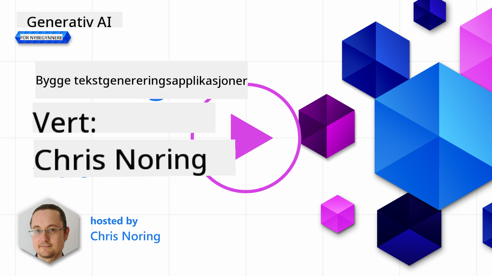

<!--
CO_OP_TRANSLATOR_METADATA:
{
  "original_hash": "df027997f1448323d6159b78a1b669bf",
  "translation_date": "2025-10-17T19:17:38+00:00",
  "source_file": "06-text-generation-apps/README.md",
  "language_code": "no"
}
-->
# Bygge applikasjoner for tekstgenerering

[](https://youtu.be/0Y5Luf5sRQA?si=t_xVg0clnAI4oUFZ)

> _(Klikk p친 bildet ovenfor for 친 se videoen til denne leksjonen)_

S친 langt i dette kurset har du sett at det finnes kjernebegreper som "prompts" og til og med en hel disiplin kalt "prompt engineering". Mange verkt칮y du kan bruke, som ChatGPT, Office 365, Microsoft Power Platform og flere, st칮tter bruk av prompts for 친 oppn친 noe.

For 친 legge til en slik opplevelse i en app, m친 du forst친 begreper som prompts, fullf칮ringer og velge et bibliotek 친 jobbe med. Det er akkurat det du vil l칝re i dette kapittelet.

## Introduksjon

I dette kapittelet vil du:

- L칝re om openai-biblioteket og dets kjernebegreper.
- Bygge en tekstgenereringsapp ved hjelp av openai.
- Forst친 hvordan du bruker begreper som prompt, temperatur og tokens for 친 bygge en tekstgenereringsapp.

## L칝ringsm친l

Ved slutten av denne leksjonen vil du kunne:

- Forklare hva en tekstgenereringsapp er.
- Bygge en tekstgenereringsapp ved hjelp av openai.
- Konfigurere appen din til 친 bruke flere eller f칝rre tokens og ogs친 endre temperaturen for et variert resultat.

## Hva er en tekstgenereringsapp?

Vanligvis n친r du bygger en app, har den en slags grensesnitt som f칮lgende:

- Kommando-basert. Konsollapper er typiske apper der du skriver inn en kommando, og den utf칮rer en oppgave. For eksempel er `git` en kommando-basert app.
- Brukergrensesnitt (UI). Noen apper har grafiske brukergrensesnitt (GUIs) der du klikker p친 knapper, skriver inn tekst, velger alternativer og mer.

### Begrensninger med konsoll- og UI-apper

Sammenlign dette med en kommando-basert app der du skriver inn en kommando:

- **Det er begrenset**. Du kan ikke bare skrive inn hvilken som helst kommando, kun de som appen st칮tter.
- **Spr친kspecifikt**. Noen apper st칮tter mange spr친k, men som standard er appen bygget for et spesifikt spr친k, selv om du kan legge til mer spr친ksupport.

### Fordeler med tekstgenereringsapper

S친 hvordan er en tekstgenereringsapp annerledes?

I en tekstgenereringsapp har du mer fleksibilitet, du er ikke begrenset til et sett med kommandoer eller et spesifikt innf칮ringsspr친k. I stedet kan du bruke naturlig spr친k for 친 interagere med appen. En annen fordel er at du allerede interagerer med en datakilde som er trent p친 et stort korpus av informasjon, mens en tradisjonell app kan v칝re begrenset til det som finnes i en database.

### Hva kan jeg bygge med en tekstgenereringsapp?

Det er mange ting du kan bygge. For eksempel:

- **En chatbot**. En chatbot som svarer p친 sp칮rsm친l om emner, som din bedrift og dens produkter, kan v칝re en god match.
- **Hjelper**. LLMs er gode p친 ting som 친 oppsummere tekst, f친 innsikt fra tekst, produsere tekst som CV-er og mer.
- **Kodeassistent**. Avhengig av spr친kmodellen du bruker, kan du bygge en kodeassistent som hjelper deg med 친 skrive kode. For eksempel kan du bruke et produkt som GitHub Copilot samt ChatGPT for 친 hjelpe deg med 친 skrive kode.

## Hvordan kan jeg komme i gang?

Vel, du m친 finne en m친te 친 integrere med en LLM, som vanligvis inneb칝rer f칮lgende to tiln칝rminger:

- Bruke en API. Her konstruerer du webforesp칮rsler med din prompt og f친r generert tekst tilbake.
- Bruke et bibliotek. Biblioteker hjelper med 친 kapsle inn API-kallene og gj칮re dem enklere 친 bruke.

## Biblioteker/SDK-er

Det finnes noen velkjente biblioteker for 친 jobbe med LLMs som:

- **openai**, dette biblioteket gj칮r det enkelt 친 koble til modellen din og sende inn prompts.

Deretter finnes det biblioteker som opererer p친 et h칮yere niv친 som:

- **Langchain**. Langchain er velkjent og st칮tter Python.
- **Semantic Kernel**. Semantic Kernel er et bibliotek fra Microsoft som st칮tter spr친kene C#, Python og Java.

## F칮rste app ved bruk av openai

La oss se hvordan vi kan bygge v친r f칮rste app, hvilke biblioteker vi trenger, hvor mye som kreves og s친 videre.

### Installere openai

Det finnes mange biblioteker der ute for 친 interagere med OpenAI eller Azure OpenAI. Det er mulig 친 bruke mange programmeringsspr친k som C#, Python, JavaScript, Java og mer. Vi har valgt 친 bruke Python-biblioteket `openai`, s친 vi bruker `pip` for 친 installere det.

```bash
pip install openai
```

### Opprette en ressurs

Du m친 utf칮re f칮lgende trinn:

- Opprett en konto p친 Azure [https://azure.microsoft.com/free/](https://azure.microsoft.com/free/?WT.mc_id=academic-105485-koreyst).
- F친 tilgang til Azure OpenAI. G친 til [https://learn.microsoft.com/azure/ai-services/openai/overview#how-do-i-get-access-to-azure-openai](https://learn.microsoft.com/azure/ai-services/openai/overview#how-do-i-get-access-to-azure-openai?WT.mc_id=academic-105485-koreyst) og be om tilgang.

  > [!NOTE]
  > P친 tidspunktet for skriving, m친 du s칮ke om tilgang til Azure OpenAI.

- Installer Python <https://www.python.org/>
- Ha opprettet en Azure OpenAI Service-ressurs. Se denne veiledningen for hvordan du [oppretter en ressurs](https://learn.microsoft.com/azure/ai-services/openai/how-to/create-resource?pivots=web-portal?WT.mc_id=academic-105485-koreyst).

### Finn API-n칮kkel og endepunkt

P친 dette tidspunktet m친 du fortelle `openai`-biblioteket hvilken API-n칮kkel som skal brukes. For 친 finne API-n칮kkelen din, g친 til "Keys and Endpoint"-seksjonen i din Azure OpenAI-ressurs og kopier verdien "Key 1".


N친 som du har denne informasjonen kopiert, la oss instruere bibliotekene til 친 bruke den.

> [!NOTE]
> Det er verdt 친 skille API-n칮kkelen din fra koden din. Du kan gj칮re det ved 친 bruke milj칮variabler.
>
> - Sett milj칮variabelen `OPENAI_API_KEY` til API-n칮kkelen din.
>   `export OPENAI_API_KEY='sk-...'`

### Konfigurasjonsoppsett for Azure

Hvis du bruker Azure OpenAI, her er hvordan du setter opp konfigurasjonen:

```python
openai.api_type = 'azure'
openai.api_key = os.environ["OPENAI_API_KEY"]
openai.api_version = '2023-05-15'
openai.api_base = os.getenv("API_BASE")
```

Ovenfor setter vi f칮lgende:

- `api_type` til `azure`. Dette forteller biblioteket 친 bruke Azure OpenAI og ikke OpenAI.
- `api_key`, dette er din API-n칮kkel funnet i Azure Portal.
- `api_version`, dette er versjonen av API-en du vil bruke. P친 tidspunktet for skriving er den nyeste versjonen `2023-05-15`.
- `api_base`, dette er endepunktet til API-en. Du finner det i Azure Portal ved siden av API-n칮kkelen din.

> [!NOTE] > `os.getenv` er en funksjon som leser milj칮variabler. Du kan bruke den til 친 lese milj칮variabler som `OPENAI_API_KEY` og `API_BASE`. Sett disse milj칮variablene i terminalen din eller ved 친 bruke et bibliotek som `dotenv`.

## Generere tekst

M친ten 친 generere tekst p친 er 친 bruke klassen `Completion`. Her er et eksempel:

```python
prompt = "Complete the following: Once upon a time there was a"

completion = openai.Completion.create(model="davinci-002", prompt=prompt)
print(completion.choices[0].text)
```

I koden ovenfor oppretter vi et fullf칮ringsobjekt og sender inn modellen vi vil bruke og prompten. Deretter skriver vi ut den genererte teksten.

### Chat-fullf칮ringer

S친 langt har du sett hvordan vi har brukt `Completion` til 친 generere tekst. Men det finnes en annen klasse kalt `ChatCompletion` som er mer egnet for chatbots. Her er et eksempel p친 hvordan du bruker den:

```python
import openai

openai.api_key = "sk-..."

completion = openai.ChatCompletion.create(model="gpt-3.5-turbo", messages=[{"role": "user", "content": "Hello world"}])
print(completion.choices[0].message.content)
```

Mer om denne funksjonaliteten i et kommende kapittel.

## 칒velse - din f칮rste tekstgenereringsapp

N친 som vi har l칝rt hvordan vi setter opp og konfigurerer openai, er det p친 tide 친 bygge din f칮rste tekstgenereringsapp. For 친 bygge appen din, f칮lg disse trinnene:

1. Opprett et virtuelt milj칮 og installer openai:

   ```bash
   python -m venv venv
   source venv/bin/activate
   pip install openai
   ```

   > [!NOTE]
   > Hvis du bruker Windows, skriv `venv\Scripts\activate` i stedet for `source venv/bin/activate`.

   > [!NOTE]
   > Finn din Azure OpenAI-n칮kkel ved 친 g친 til [https://portal.azure.com/](https://portal.azure.com/?WT.mc_id=academic-105485-koreyst) og s칮k etter `Open AI` og velg `Open AI resource` og deretter `Keys and Endpoint` og kopier verdien `Key 1`.

1. Opprett en _app.py_-fil og gi den f칮lgende kode:

   ```python
   import openai

   openai.api_key = "<replace this value with your open ai key or Azure OpenAI key>"

   openai.api_type = 'azure'
   openai.api_version = '2023-05-15'
   openai.api_base = "<endpoint found in Azure Portal where your API key is>"
   deployment_name = "<deployment name>"

   # add your completion code
   prompt = "Complete the following: Once upon a time there was a"
   messages = [{"role": "user", "content": prompt}]

   # make completion
   completion = openai.chat.completions.create(model=deployment_name, messages=messages)

   # print response
   print(completion.choices[0].message.content)
   ```

   > [!NOTE]
   > Hvis du bruker Azure OpenAI, m친 du sette `api_type` til `azure` og sette `api_key` til din Azure OpenAI-n칮kkel.

   Du b칮r se et output som f칮lgende:

   ```output
    very unhappy _____.

   Once upon a time there was a very unhappy mermaid.
   ```

## Ulike typer prompts for ulike ting

N친 har du sett hvordan du genererer tekst ved hjelp av en prompt. Du har til og med et program oppe og kj칮rer som du kan modifisere og endre for 친 generere ulike typer tekst.

Prompts kan brukes til alle slags oppgaver. For eksempel:

- **Generere en type tekst**. For eksempel kan du generere et dikt, sp칮rsm친l til en quiz osv.
- **S칮ke opp informasjon**. Du kan bruke prompts til 친 s칮ke etter informasjon som f칮lgende eksempel 'Hva betyr CORS i webutvikling?'.
- **Generere kode**. Du kan bruke prompts til 친 generere kode, for eksempel utvikle et regul칝rt uttrykk som brukes til 친 validere e-post eller hvorfor ikke generere et helt program, som en webapp?

## Et mer praktisk bruksomr친de: en oppskriftsgenerator

Tenk deg at du har ingredienser hjemme og vil lage noe mat. For det trenger du en oppskrift. En m친te 친 finne oppskrifter p친 er 친 bruke en s칮kemotor, eller du kan bruke en LLM til 친 gj칮re det.

Du kan skrive en prompt som dette:

> "Vis meg 5 oppskrifter for en rett med f칮lgende ingredienser: kylling, poteter og gulr칮tter. Per oppskrift, list opp alle ingrediensene som brukes."

Gitt prompten ovenfor, kan du f친 et svar som ligner p친:

```output
1. Roasted Chicken and Vegetables:
Ingredients:
- 4 chicken thighs
- 2 potatoes, cut into cubes
- 2 carrots, cut into cubes
- 2 tablespoons olive oil
- 2 cloves garlic, minced
- 1 teaspoon dried thyme
- 1 teaspoon dried oregano
- Salt and pepper, to taste

2. Chicken and Potato Stew:
Ingredients:
- 2 tablespoons olive oil
- 1 onion, diced
- 2 cloves garlic, minced
- 2 chicken breasts, cut into cubes
- 2 potatoes, cut into cubes
- 2 carrots, cut into cubes
- 1 teaspoon dried oregano
- 1 teaspoon dried thyme
- 1 cup chicken broth
- Salt and pepper, to taste

3. Chicken and Potato Bake:
Ingredients:
- 2 tablespoons olive oil
- 2 chicken breasts, cut into cubes
- 2 potatoes, cut into cubes
- 2 carrots, cut into cubes
- 1 onion, diced
- 2 cloves garlic, minced
- 1 teaspoon dried oregano
- 1 teaspoon dried thyme
- 1 cup chicken broth
- Salt and pepper, to taste

4. Chicken and Potato Soup:
Ingredients:
- 2 tablespoons olive oil
- 1 onion, diced
- 2 cloves garlic, minced
- 2 chicken breasts, cut into cubes
- 2 potatoes, cut into cubes
- 2 carrots, cut into cubes
- 1 teaspoon dried oregano
- 1 teaspoon dried thyme
- 4 cups chicken broth
- Salt and pepper, to taste

5. Chicken and Potato Hash:
Ingredients:
- 2 tablespoons olive oil
- 2 chicken breasts, cut into cubes
- 2 potatoes, cut into cubes
- 2 carrots, cut into cubes
- 1 onion, diced
- 2 cloves garlic, minced
- 1 teaspoon dried oregano
```

Dette resultatet er flott, jeg vet hva jeg skal lage. P친 dette tidspunktet kan nyttige forbedringer v칝re:

- Filtrere ut ingredienser jeg ikke liker eller er allergisk mot.
- Lage en handleliste, i tilfelle jeg ikke har alle ingrediensene hjemme.

For de ovennevnte tilfellene, la oss legge til en ekstra prompt:

> "Vennligst fjern oppskrifter med hvitl칮k da jeg er allergisk og erstatt det med noe annet. Lag ogs친 en handleliste for oppskriftene, med tanke p친 at jeg allerede har kylling, poteter og gulr칮tter hjemme."

N친 har du et nytt resultat, nemlig:

```output
1. Roasted Chicken and Vegetables:
Ingredients:
- 4 chicken thighs
- 2 potatoes, cut into cubes
- 2 carrots, cut into cubes
- 2 tablespoons olive oil
- 1 teaspoon dried thyme
- 1 teaspoon dried oregano
- Salt and pepper, to taste

2. Chicken and Potato Stew:
Ingredients:
- 2 tablespoons olive oil
- 1 onion, diced
- 2 chicken breasts, cut into cubes
- 2 potatoes, cut into cubes
- 2 carrots, cut into cubes
- 1 teaspoon dried oregano
- 1 teaspoon dried thyme
- 1 cup chicken broth
- Salt and pepper, to taste

3. Chicken and Potato Bake:
Ingredients:
- 2 tablespoons olive oil
- 2 chicken breasts, cut into cubes
- 2 potatoes, cut into cubes
- 2 carrots, cut into cubes
- 1 onion, diced
- 1 teaspoon dried oregano
- 1 teaspoon dried thyme
- 1 cup chicken broth
- Salt and pepper, to taste

4. Chicken and Potato Soup:
Ingredients:
- 2 tablespoons olive oil
- 1 onion, diced
- 2 chicken breasts, cut into cubes
- 2 potatoes, cut into cubes
- 2 carrots, cut into cubes
- 1 teaspoon dried oregano
- 1 teaspoon dried thyme
- 4 cups chicken broth
- Salt and pepper, to taste

5. Chicken and Potato Hash:
Ingredients:
- 2 tablespoons olive oil
- 2 chicken breasts, cut into cubes
- 2 potatoes, cut into cubes
- 2 carrots, cut into cubes
- 1 onion, diced
- 1 teaspoon dried oregano

Shopping List:
- Olive oil
- Onion
- Thyme
- Oregano
- Salt
- Pepper
```

Det er dine fem oppskrifter, uten hvitl칮k nevnt, og du har ogs친 en handleliste med tanke p친 hva du allerede har hjemme.

## 칒velse - bygg en oppskriftsgenerator

N친 som vi har spilt ut et scenario, la oss skrive kode som matcher det demonstrerte scenariet. For 친 gj칮re det, f칮lg disse trinnene:

1. Bruk den eksisterende _app.py_-filen som et utgangspunkt.
1. Finn variabelen `prompt` og endre koden til f칮lgende:

   ```python
   prompt = "Show me 5 recipes for a dish with the following ingredients: chicken, potatoes, and carrots. Per recipe, list all the ingredients used"
   ```

   Hvis du n친 kj칮rer koden, b칮r du se et output som ligner p친:

   ```output
   -Chicken Stew with Potatoes and Carrots: 3 tablespoons oil, 1 onion, chopped, 2 cloves garlic, minced, 1 carrot, peeled and chopped, 1 potato, peeled and chopped, 1 bay leaf, 1 thyme sprig, 1/2 teaspoon salt, 1/4 teaspoon black pepper, 1 1/2 cups chicken broth, 1/2 cup dry white wine, 2 tablespoons chopped fresh parsley, 2 tablespoons unsalted butter, 1 1/2 pounds boneless, skinless chicken thighs, cut into 1-inch pieces
   -Oven-Roasted Chicken with Potatoes and Carrots: 3 tablespoons extra-virgin olive oil, 1 tablespoon Dijon mustard, 1 tablespoon chopped fresh rosemary, 1 tablespoon chopped fresh thyme, 4 cloves garlic, minced, 1 1/2 pounds small red potatoes, quartered, 1 1/2 pounds carrots, quartered lengthwise, 1/2 teaspoon salt, 1/4 teaspoon black pepper, 1 (4-pound) whole chicken
   -Chicken, Potato, and Carrot Casserole: cooking spray, 1 large onion, chopped, 2 cloves garlic, minced, 1 carrot, peeled and shredded, 1 potato, peeled and shredded, 1/2 teaspoon dried thyme leaves, 1/4 teaspoon salt, 1/4 teaspoon black pepper, 2 cups fat-free, low-sodium chicken broth, 1 cup frozen peas, 1/4 cup all-purpose flour, 1 cup 2% reduced-fat milk, 1/4 cup grated Parmesan cheese

   -One Pot Chicken and Potato Dinner: 2 tablespoons olive oil, 1 pound boneless, skinless chicken thighs, cut into 1-inch pieces, 1 large onion, chopped, 3 cloves garlic, minced, 1 carrot, peeled and chopped, 1 potato, peeled and chopped, 1 bay leaf, 1 thyme sprig, 1/2 teaspoon salt, 1/4 teaspoon black pepper, 2 cups chicken broth, 1/2 cup dry white wine

   -Chicken, Potato, and Carrot Curry: 1 tablespoon vegetable oil, 1 large onion, chopped, 2 cloves garlic, minced, 1 carrot, peeled and chopped, 1 potato, peeled and chopped, 1 teaspoon ground coriander, 1 teaspoon ground cumin, 1/2 teaspoon ground turmeric, 1/2 teaspoon ground ginger, 1/4 teaspoon cayenne pepper, 2 cups chicken broth, 1/2 cup dry white wine, 1 (15-ounce) can chickpeas, drained and rinsed, 1/2 cup raisins, 1/2 cup chopped fresh cilantro
   ```

   > MERK, din LLM er ikke-deterministisk, s친 du kan f친 forskjellige resultater hver gang du kj칮rer programmet.

   Flott, la oss se hvordan vi kan forbedre ting. For 친 forbedre ting, vil vi s칮rge for at koden er fleksibel, slik at ingredienser og antall oppskrifter kan forbedres og endres.

1. La oss endre koden p친 f칮lgende m친te:

   ```python
   no_recipes = input("No of recipes (for example, 5): ")

   ingredients = input("List of ingredients (for example, chicken, potatoes, and carrots): ")

   # interpolate the number of recipes into the prompt an ingredients
   prompt = f"Show me {no_recipes} recipes for a dish with the following ingredients: {ingredients}. Per recipe, list all the ingredients used"
   ```

   칀 teste koden kan se slik ut:

   ```output
   No of recipes (for example, 5): 3
   List of ingredients (for example, chicken, potatoes, and carrots): milk,strawberries

   -Strawberry milk shake: milk, strawberries, sugar, vanilla extract, ice cubes
   -Strawberry shortcake: milk, flour, baking powder, sugar, salt, unsalted butter, strawberries, whipped cream
   -Strawberry milk: milk, strawberries, sugar, vanilla extract
   ```

### Forbedre ved 친 legge til filter og handleliste

Vi har n친 en fungerende app som kan produsere oppskrifter, og den er fleksibel da den baserer seg p친 input fra brukeren, b친de n친r det gjelder antall oppskrifter og ingredienser som brukes.

For 친 forbedre den ytterligere, 칮nsker vi 친 legge til f칮lgende:

- **Filtrere ut ingredienser**. Vi 칮nsker 친 kunne filtrere ut ingredienser vi ikke liker eller er allergiske mot. For 친 oppn친 denne endringen kan vi redigere v친r eksisterende prompt og legge til en filterbetingelse p친 slutten av den, som dette:

  ```python
  filter = input("Filter (for example, vegetarian, vegan, or gluten-free): ")

  prompt = f"Show me {no_recipes} recipes for a dish with the following ingredients: {ingredients}. Per recipe, list all the ingredients used, no {filter}"
  ```

  Ovenfor legger vi til `{filter}` p친 slutten av prompten, og vi fanger ogs친 opp filterverdien fra brukeren.

  Et eksempel p친 input n친r programmet kj칮res kan n친 se slik ut:

  ```output
  No of recipes (for example, 5): 3
  List of ingredients (for example, chicken, potatoes, and carrots): onion,milk
  Filter (for example, vegetarian, vegan, or gluten-free): no milk

  1. French Onion Soup

  Ingredients:

  -1 large onion, sliced
  -3 cups beef broth
  -1 cup milk
  -6 slices french bread
  -1/4 cup shredded Parmesan cheese
  -1 tablespoon butter
  -1 teaspoon dried thyme
  -1/4 teaspoon salt
  -1/4 teaspoon black pepper

  Instructions:

  1. In a large pot, saut칠 onions in butter until golden brown.
  2. Add beef broth, milk, thyme, salt, and pepper. Bring to a boil.
  3. Reduce heat and simmer for 10 minutes.
  4. Place french bread slices on soup bowls.
  5. Ladle soup over bread.
  6. Sprinkle with Parmesan cheese.

  2. Onion and Potato Soup

  Ingredients:

  -1 large onion, chopped
  -2 cups potatoes, diced
  -3 cups vegetable broth
  -1 cup milk
  -1/4 teaspoon black pepper

  Instructions:

  1. In a large pot, saut칠 onions in butter until golden brown.
  2. Add potatoes, vegetable broth, milk, and pepper. Bring to a boil.
  3. Reduce heat and simmer for 10 minutes.
  4. Serve hot.

  3. Creamy Onion Soup

  Ingredients:

  -1 large onion, chopped
  -3 cups vegetable broth
  -1 cup milk
  -1/4 teaspoon black pepper
  -1/4 cup all-purpose flour
  -1/2 cup shredded Parmesan cheese

  Instructions:

  1. In a large pot, saut칠 onions in butter until golden brown.
  2. Add vegetable broth, milk, and pepper. Bring to a boil.
  3. Reduce heat and simmer for 10 minutes.
  4. In a small bowl, whisk together flour and Parmesan cheese until smooth.
  5. Add to soup and simmer for an additional 5 minutes, or until soup has thickened.
  ```

  Som du kan se, er alle oppskrifter med melk filtrert ut. Men hvis du er laktoseintolerant, vil du kanskje ogs친 filtrere ut oppskrifter med ost, s친 det er behov for 친 v칝re tydelig.

- **Lage en handleliste**. Vi 칮nsker 친 lage en handleliste, med tanke p친 hva vi allerede har hjemme.

  For denne funksjonaliteten kan vi enten pr칮ve 친 l칮se alt i 칠n prompt, eller vi kan dele det opp i to prompts. La oss pr칮ve den siste tiln칝rmingen. Her foresl친r vi 친 legge til en ekstra prompt, men for at det skal fungere, m친 vi legge til resultatet fra den f칮rste prompten som kontekst til den andre prompten.

  Finn delen i koden som skriver ut resultatet fra den f칮rste prompten, og legg til f칮lgende kode nedenfor:
  ```python
  old_prompt_result = completion.choices[0].message.content
  prompt = "Produce a shopping list for the generated recipes and please don't include ingredients that I already have."

  new_prompt = f"{old_prompt_result} {prompt}"
  messages = [{"role": "user", "content": new_prompt}]
  completion = openai.Completion.create(engine=deployment_name, messages=messages, max_tokens=1200)

  # print response
  print("Shopping list:")
  print(completion.choices[0].message.content)
  ```

  Merk f칮lgende:

  1. Vi konstruerer en ny prompt ved 친 legge til resultatet fra den f칮rste prompten til den nye prompten:

     ```python
     new_prompt = f"{old_prompt_result} {prompt}"
     ```

  1. Vi gj칮r en ny foresp칮rsel, men tar ogs친 hensyn til antall tokens vi ba om i den f칮rste prompten, s친 denne gangen sier vi `max_tokens` er 1200.

     ```python
     completion = openai.Completion.create(engine=deployment_name, prompt=new_prompt, max_tokens=1200)
     ```

     N친r vi tester denne koden, kommer vi n친 fram til f칮lgende output:

     ```output
     No of recipes (for example, 5): 2
     List of ingredients (for example, chicken, potatoes, and carrots): apple,flour
     Filter (for example, vegetarian, vegan, or gluten-free): sugar


     -Apple and flour pancakes: 1 cup flour, 1/2 tsp baking powder, 1/2 tsp baking soda, 1/4 tsp salt, 1 tbsp sugar, 1 egg, 1 cup buttermilk or sour milk, 1/4 cup melted butter, 1 Granny Smith apple, peeled and grated
     -Apple fritters: 1-1/2 cups flour, 1 tsp baking powder, 1/4 tsp salt, 1/4 tsp baking soda, 1/4 tsp nutmeg, 1/4 tsp cinnamon, 1/4 tsp allspice, 1/4 cup sugar, 1/4 cup vegetable shortening, 1/4 cup milk, 1 egg, 2 cups shredded, peeled apples
     Shopping list:
     -Flour, baking powder, baking soda, salt, sugar, egg, buttermilk, butter, apple, nutmeg, cinnamon, allspice
     ```

## Forbedre oppsettet ditt

Det vi har s친 langt er kode som fungerer, men det er noen justeringer vi b칮r gj칮re for 친 forbedre ting ytterligere. Noen ting vi b칮r gj칮re er:

- **Separere hemmeligheter fra kode**, som API-n칮kkelen. Hemmeligheter h칮rer ikke hjemme i kode og b칮r lagres p친 et sikkert sted. For 친 separere hemmeligheter fra kode, kan vi bruke milj칮variabler og biblioteker som `python-dotenv` for 친 laste dem fra en fil. Slik kan det se ut i kode:

  1. Lag en `.env`-fil med f칮lgende innhold:

     ```bash
     OPENAI_API_KEY=sk-...
     ```

     > Merk, for Azure m친 du sette f칮lgende milj칮variabler:

     ```bash
     OPENAI_API_TYPE=azure
     OPENAI_API_VERSION=2023-05-15
     OPENAI_API_BASE=<replace>
     ```

     I kode ville du laste milj칮variablene slik:

     ```python
     from dotenv import load_dotenv

     load_dotenv()

     openai.api_key = os.environ["OPENAI_API_KEY"]
     ```

- **Et ord om token-lengde**. Vi b칮r vurdere hvor mange tokens vi trenger for 친 generere teksten vi 칮nsker. Tokens koster penger, s친 der det er mulig, b칮r vi pr칮ve 친 v칝re 칮konomiske med antall tokens vi bruker. For eksempel, kan vi formulere prompten slik at vi kan bruke f칝rre tokens?

  For 친 endre tokens som brukes, kan du bruke parameteren `max_tokens`. For eksempel, hvis du vil bruke 100 tokens, kan du gj칮re:

  ```python
  completion = client.chat.completions.create(model=deployment, messages=messages, max_tokens=100)
  ```

- **Eksperimentere med temperatur**. Temperatur er noe vi ikke har nevnt s친 langt, men det er en viktig kontekst for hvordan programmet v친rt presterer. Jo h칮yere temperaturverdi, desto mer tilfeldig blir output. Omvendt, jo lavere temperaturverdi, desto mer forutsigbar blir output. Vurder om du 칮nsker variasjon i output eller ikke.

  For 친 endre temperaturen, kan du bruke parameteren `temperature`. For eksempel, hvis du vil bruke en temperatur p친 0.5, kan du gj칮re:

  ```python
  completion = client.chat.completions.create(model=deployment, messages=messages, temperature=0.5)
  ```

  > Merk, jo n칝rmere 1.0, desto mer variert blir output.

## Oppgave

For denne oppgaven kan du velge hva du vil lage.

Her er noen forslag:

- Juster oppskriftsgenerator-appen for 친 forbedre den ytterligere. Eksperimenter med temperaturverdier og promptene for 친 se hva du kan komme opp med.
- Lag en "studiekompis". Denne appen b칮r kunne svare p친 sp칮rsm친l om et emne, for eksempel Python. Du kan ha prompts som "Hva er et bestemt emne i Python?", eller du kan ha en prompt som sier, vis meg kode for et bestemt emne osv.
- Historiebot, f친 historien til 친 komme til live, instruer boten til 친 spille en bestemt historisk karakter og still den sp칮rsm친l om livet og tiden dens.

## L칮sning

### Studiekompis

Nedenfor er en startprompt, se hvordan du kan bruke den og justere den etter eget 칮nske.

```text
- "You're an expert on the Python language

    Suggest a beginner lesson for Python in the following format:

    Format:
    - concepts:
    - brief explanation of the lesson:
    - exercise in code with solutions"
```

### Historiebot

Her er noen prompts du kan bruke:

```text
- "You are Abe Lincoln, tell me about yourself in 3 sentences, and respond using grammar and words like Abe would have used"
- "You are Abe Lincoln, respond using grammar and words like Abe would have used:

   Tell me about your greatest accomplishments, in 300 words"
```

## Kunnskapssjekk

Hva gj칮r konseptet temperatur?

1. Det styrer hvor tilfeldig output er.
1. Det styrer hvor stor responsen er.
1. Det styrer hvor mange tokens som brukes.

## 游 Utfordring

N친r du jobber med oppgaven, pr칮v 친 variere temperaturen, pr칮v 친 sette den til 0, 0.5 og 1. Husk at 0 er minst variert og 1 er mest. Hvilken verdi fungerer best for appen din?

## Flott arbeid! Fortsett l칝ringen din

Etter 친 ha fullf칮rt denne leksjonen, sjekk ut v친r [Generative AI Learning-samling](https://aka.ms/genai-collection?WT.mc_id=academic-105485-koreyst) for 친 fortsette 친 utvikle kunnskapen din om Generative AI!

G친 videre til Leksjon 7 hvor vi skal se p친 hvordan man [bygger chatteapplikasjoner](../07-building-chat-applications/README.md?WT.mc_id=academic-105485-koreyst)!

---

**Ansvarsfraskrivelse**:  
Dette dokumentet er oversatt ved hjelp av AI-oversettelsestjenesten [Co-op Translator](https://github.com/Azure/co-op-translator). Selv om vi streber etter n칮yaktighet, v칝r oppmerksom p친 at automatiske oversettelser kan inneholde feil eller un칮yaktigheter. Det originale dokumentet p친 dets opprinnelige spr친k b칮r anses som den autoritative kilden. For kritisk informasjon anbefales profesjonell menneskelig oversettelse. Vi er ikke ansvarlige for eventuelle misforst친elser eller feiltolkninger som oppst친r ved bruk av denne oversettelsen.