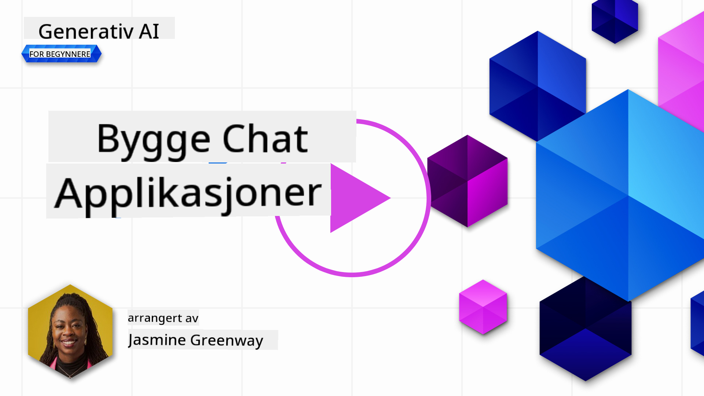

<!--
CO_OP_TRANSLATOR_METADATA:
{
  "original_hash": "ea4bbe640847aafbbba14dae4625e9af",
  "translation_date": "2025-05-19T17:55:14+00:00",
  "source_file": "07-building-chat-applications/README.md",
  "language_code": "no"
}
-->
# Bygge generative AI-drevne chatteapplikasjoner

[](https://aka.ms/gen-ai-lessons7-gh?WT.mc_id=academic-105485-koreyst)

> _(Klikk på bildet ovenfor for å se videoen av denne leksjonen)_

Nå som vi har sett hvordan vi kan bygge tekstgenererende apper, la oss se nærmere på chatteapplikasjoner.

Chatteapplikasjoner har blitt en integrert del av våre daglige liv, og tilbyr mer enn bare et middel for uformell samtale. De er viktige deler av kundeservice, teknisk support og til og med sofistikerte rådgivningssystemer. Det er sannsynlig at du har fått hjelp fra en chatteapplikasjon ikke så lenge siden. Når vi integrerer mer avansert teknologi som generativ AI i disse plattformene, øker kompleksiteten og utfordringene.

Noen spørsmål vi trenger å få besvart er:

- **Bygge appen**. Hvordan kan vi effektivt bygge og sømløst integrere disse AI-drevne applikasjonene for spesifikke bruksområder?
- **Overvåking**. Når de er distribuert, hvordan kan vi overvåke og sikre at applikasjonene opererer på høyeste nivå av kvalitet, både når det gjelder funksjonalitet og etterlevelse av de [seks prinsippene for ansvarlig AI](https://www.microsoft.com/ai/responsible-ai?WT.mc_id=academic-105485-koreyst)?

Etter hvert som vi beveger oss inn i en tid preget av automatisering og sømløse interaksjoner mellom mennesker og maskiner, blir det essensielt å forstå hvordan generativ AI transformerer omfanget, dybden og tilpasningsevnen til chatteapplikasjoner. Denne leksjonen vil undersøke aspektene ved arkitektur som støtter disse intrikate systemene, fordype seg i metodene for finjustering for oppgave-spesifikke oppgaver, og evaluere metrikker og hensyn som er relevante for å sikre ansvarlig AI-distribusjon.

## Introduksjon

Denne leksjonen dekker:

- Teknikker for effektivt å bygge og integrere chatteapplikasjoner.
- Hvordan tilpasse og finjustere applikasjoner.
- Strategier og hensyn for effektivt å overvåke chatteapplikasjoner.

## Læringsmål

Ved slutten av denne leksjonen vil du kunne:

- Beskrive hensyn for å bygge og integrere chatteapplikasjoner i eksisterende systemer.
- Tilpasse chatteapplikasjoner for spesifikke bruksområder.
- Identifisere nøkkelmål og hensyn for effektivt å overvåke og opprettholde kvaliteten på AI-drevne chatteapplikasjoner.
- Sikre at chatteapplikasjoner utnytter AI ansvarlig.

## Integrere generativ AI i chatteapplikasjoner

Å forbedre chatteapplikasjoner gjennom generativ AI handler ikke bare om å gjøre dem smartere; det handler om å optimalisere deres arkitektur, ytelse og brukergrensesnitt for å levere en kvalitetsbrukeropplevelse. Dette involverer å undersøke de arkitektoniske fundamentene, API-integrasjoner og hensyn til brukergrensesnittet. Denne delen har som mål å tilby deg en omfattende veikart for å navigere i disse komplekse landskapene, enten du kobler dem til eksisterende systemer eller bygger dem som frittstående plattformer.

Ved slutten av denne delen vil du være utstyrt med ekspertisen som trengs for effektivt å konstruere og innlemme chatteapplikasjoner.

### Chatbot eller chatteapplikasjon?

Før vi dykker inn i å bygge chatteapplikasjoner, la oss sammenligne 'chatbots' mot 'AI-drevne chatteapplikasjoner,' som tjener forskjellige roller og funksjoner. En chatbots hovedformål er å automatisere spesifikke samtaleoppgaver, som å svare på ofte stilte spørsmål eller spore en pakke. Den styres vanligvis av regelbasert logikk eller komplekse AI-algoritmer. I kontrast er en AI-drevet chatteapplikasjon et langt mer omfattende miljø designet for å lette forskjellige former for digital kommunikasjon, som tekst-, tale- og videoprater blant menneskelige brukere. Dens definerende funksjon er integrasjonen av en generativ AI-modell som simulerer nyanserte, menneskelignende samtaler, genererer svar basert på et bredt utvalg av input og kontekstuelle ledetråder. En generativ AI-drevet chatteapplikasjon kan engasjere seg i åpne domene diskusjoner, tilpasse seg utviklende samtalekontekster, og til og med produsere kreative eller komplekse dialoger.

Tabellen nedenfor skisserer de viktigste forskjellene og likhetene for å hjelpe oss å forstå deres unike roller i digital kommunikasjon.

| Chatbot                               | Generativ AI-drevet chatteapplikasjon |
| ------------------------------------- | ------------------------------------- |
| Oppgavefokusert og regelbasert        | Kontekstbevisst                       |
| Ofte integrert i større systemer      | Kan være vert for en eller flere chatbots |
| Begrenset til programmerte funksjoner | Inkorporerer generative AI-modeller   |
| Spesialiserte og strukturerte interaksjoner | I stand til åpne domene diskusjoner  |

### Utnytte forhåndsbygde funksjoner med SDK-er og API-er

Når du bygger en chatteapplikasjon, er et godt første steg å vurdere hva som allerede finnes. Å bruke SDK-er og API-er for å bygge chatteapplikasjoner er en fordelaktig strategi av flere grunner. Ved å integrere godt dokumenterte SDK-er og API-er, posisjonerer du strategisk applikasjonen din for langsiktig suksess, adresserer skalerbarhet og vedlikeholdshensyn.

- **Fremskynder utviklingsprosessen og reduserer overhead**: Å stole på forhåndsbygde funksjoner i stedet for den kostbare prosessen med å bygge dem selv lar deg fokusere på andre aspekter av applikasjonen som du kanskje finner viktigere, som forretningslogikk.
- **Bedre ytelse**: Når du bygger funksjonalitet fra bunnen av, vil du til slutt spørre deg selv "Hvordan skalerer det? Er denne applikasjonen i stand til å håndtere en plutselig tilstrømning av brukere?" Godt vedlikeholdte SDK-er og API-er har ofte innebygde løsninger for disse bekymringene.
- **Enklere vedlikehold**: Oppdateringer og forbedringer er enklere å håndtere ettersom de fleste API-er og SDK-er bare krever en oppdatering av et bibliotek når en nyere versjon blir utgitt.
- **Tilgang til banebrytende teknologi**: Å utnytte modeller som er finjustert og trent på omfattende datasett gir applikasjonen din naturlige språkfunksjoner.

Å få tilgang til funksjonaliteten til en SDK eller API innebærer vanligvis å få tillatelse til å bruke de tilbudte tjenestene, som ofte skjer gjennom bruk av en unik nøkkel eller autentiseringstoken. Vi vil bruke OpenAI Python Library for å utforske hvordan dette ser ut. Du kan også prøve det selv i følgende [notatbok for OpenAI](../../../07-building-chat-applications/python/oai-assignment.ipynb) eller [notatbok for Azure OpenAI Services](../../../07-building-chat-applications/python/aoai-assignment.ipynb) for denne leksjonen.

```python
import os
from openai import OpenAI

API_KEY = os.getenv("OPENAI_API_KEY","")

client = OpenAI(
    api_key=API_KEY
    )

chat_completion = client.chat.completions.create(model="gpt-3.5-turbo", messages=[{"role": "user", "content": "Suggest two titles for an instructional lesson on chat applications for generative AI."}])
```

Eksemplet ovenfor bruker GPT-3.5 Turbo-modellen for å fullføre promptet, men merk at API-nøkkelen er satt før du gjør det. Du vil få en feil hvis du ikke satte nøkkelen.

## Brukeropplevelse (UX)

Generelle UX-prinsipper gjelder for chatteapplikasjoner, men her er noen ekstra hensyn som blir spesielt viktige på grunn av maskinlæringskomponentene involvert.

- **Mekanisme for å adressere tvetydighet**: Generative AI-modeller genererer av og til tvetydige svar. En funksjon som lar brukere be om avklaring kan være nyttig hvis de støter på dette problemet.
- **Kontekstretensjon**: Avanserte generative AI-modeller har evnen til å huske kontekst innen en samtale, noe som kan være en nødvendig ressurs for brukeropplevelsen. Å gi brukere muligheten til å kontrollere og administrere kontekst forbedrer brukeropplevelsen, men introduserer risikoen for å beholde sensitiv brukerinformasjon. Hensyn for hvor lenge denne informasjonen lagres, som å introdusere en retensjonspolicy, kan balansere behovet for kontekst mot personvern.
- **Personalisering**: Med evnen til å lære og tilpasse seg, tilbyr AI-modeller en individualisert opplevelse for en bruker. Å skreddersy brukeropplevelsen gjennom funksjoner som brukerprofiler gjør ikke bare at brukeren føler seg forstått, men det hjelper også deres søken etter å finne spesifikke svar, og skaper en mer effektiv og tilfredsstillende interaksjon.

Et slikt eksempel på personalisering er "Custom instructions"-innstillingene i OpenAI's ChatGPT. Det lar deg gi informasjon om deg selv som kan være viktig kontekst for dine prompt. Her er et eksempel på en tilpasset instruksjon.


Denne "profilen" ber ChatGPT om å lage en leksjonsplan om lenkelister. Legg merke til at ChatGPT tar hensyn til at brukeren kanskje ønsker en mer dyptgående leksjonsplan basert på hennes erfaring.


### Microsofts systemmeldingsrammeverk for store språkmodeller

[Microsoft har gitt veiledning](https://learn.microsoft.com/azure/ai-services/openai/concepts/system-message#define-the-models-output-format?WT.mc_id=academic-105485-koreyst) for å skrive effektive systemmeldinger når du genererer svar fra LLMs, delt inn i 4 områder:

1. Definere hvem modellen er for, samt dens evner og begrensninger.
2. Definere modellens utdataformat.
3. Gi spesifikke eksempler som demonstrerer modellens tiltenkte oppførsel.
4. Gi ekstra atferdsmessige sikkerhetsnett.

### Tilgjengelighet

Enten en bruker har visuelle, auditive, motoriske eller kognitive begrensninger, bør en godt designet chatteapplikasjon være brukbar for alle. Følgende liste bryter ned spesifikke funksjoner som er rettet mot å forbedre tilgjengeligheten for forskjellige brukerbegrensninger.

- **Funksjoner for synshemming**: Høy kontrast-temaer og justerbar tekst, skjermleserkompatibilitet.
- **Funksjoner for hørselshemming**: Tekst-til-tale og tale-til-tekst-funksjoner, visuelle signaler for lydvarsler.
- **Funksjoner for motorisk hemming**: Støtte for tastaturnavigasjon, stemmekommandoer.
- **Funksjoner for kognitiv hemming**: Forenklede språkvalg.

## Tilpasning og finjustering for domenespesifikke språkmodeller

Tenk deg en chatteapplikasjon som forstår din bedrifts sjargong og forutser de spesifikke forespørslene brukerne vanligvis har. Det er et par tilnærminger verdt å nevne:

- **Utnytte DSL-modeller**. DSL står for domenespesifikt språk. Du kan utnytte en såkalt DSL-modell trent på et spesifikt domene for å forstå dets konsepter og scenarier.
- **Anvende finjustering**. Finjustering er prosessen med videre trening av modellen din med spesifikke data.

## Tilpasning: Bruke en DSL

Å utnytte domenespesifikke språkmodeller (DSL-modeller) kan forbedre brukerengasjementet ved å gi spesialiserte, kontekstuelt relevante interaksjoner. Det er en modell som er trent eller finjustert for å forstå og generere tekst relatert til et spesifikt felt, bransje eller emne. Alternativer for å bruke en DSL-modell kan variere fra å trene en fra bunnen av til å bruke eksisterende gjennom SDK-er og API-er. Et annet alternativ er finjustering, som innebærer å ta en eksisterende forhåndstrent modell og tilpasse den for et spesifikt domene.

## Tilpasning: Anvende finjustering

Finjustering vurderes ofte når en forhåndstrent modell ikke strekker til i et spesialisert domene eller spesifikk oppgave.

For eksempel er medisinske forespørsler komplekse og krever mye kontekst. Når en medisinsk fagperson diagnostiserer en pasient, er det basert på en rekke faktorer som livsstil eller eksisterende forhold, og kan til og med stole på nylige medisinske tidsskrifter for å validere diagnosen deres. I slike nyanserte scenarier kan en generelle AI-chatteapplikasjon ikke være en pålitelig kilde.

### Scenario: en medisinsk applikasjon

Tenk på en chatteapplikasjon designet for å hjelpe medisinske fagpersoner ved å gi raske referanser til behandlingsretningslinjer, legemiddelinteraksjoner eller nylige forskningsfunn.

En generelle modell kan være tilstrekkelig for å svare på grunnleggende medisinske spørsmål eller gi generelle råd, men den kan slite med følgende:

- **Svært spesifikke eller komplekse tilfeller**. For eksempel, en nevrolog kan spørre applikasjonen, "Hva er de nåværende beste praksisene for å håndtere medikamentresistent epilepsi hos pediatriske pasienter?"
- **Manglende nylige fremskritt**. En generelle modell kan ha problemer med å gi et aktuelt svar som inkorporerer de nyeste fremskrittene innen nevrologi og farmakologi.

I slike tilfeller kan finjustering av modellen med et spesialisert medisinsk datasett betydelig forbedre dens evne til å håndtere disse intrikate medisinske forespørslene mer nøyaktig og pålitelig. Dette krever tilgang til et stort og relevant datasett som representerer de domenespesifikke utfordringene og spørsmålene som må adresseres.

## Hensyn for en høy kvalitets AI-drevet chatteopplevelse

Denne delen skisserer kriteriene for "høykvalitets" chatteapplikasjoner, som inkluderer fangst av handlingsbare metrikker og etterlevelse av et rammeverk som ansvarlig utnytter AI-teknologi.

### Nøkkelmål

For å opprettholde den høye ytelsen til en applikasjon, er det viktig å holde oversikt over nøkkelmål og hensyn. Disse målingene sikrer ikke bare funksjonaliteten til applikasjonen, men vurderer også kvaliteten på AI-modellen og brukeropplevelsen. Nedenfor er en liste som dekker grunnleggende, AI og brukeropplevelsesmål som bør vurderes.

| Mål                             | Definisjon                                                                                                             | Hensyn for chatteutvikler                                                 |
| ------------------------------- | ---------------------------------------------------------------------------------------------------------------------- | ------------------------------------------------------------------------- |
| **Oppetid**                     | Måler tiden applikasjonen er operativ og tilgjengelig for brukere.                                                     | Hvordan vil du minimere nedetid?                                          |
| **Responstid**                  | Tiden det tar for applikasjonen å svare på en brukers forespørsel.                                                     | Hvordan kan du optimalisere forespørselbehandling for å forbedre responstiden? |
| **Presisjon**                   | Forholdet mellom sanne positive prediksjoner til det totale antallet positive prediksjoner                            | Hvordan vil du validere presisjonen til modellen din?                     |
| **Recall (Sensitivitet)**       | Forholdet mellom sanne positive prediksjoner til det faktiske antallet positive                                       | Hvordan vil du måle og forbedre recall?                                   |
| **F1 Score**                    | Det harmoniske gjennomsnittet av presisjon og recall, som balanserer avveiningen mellom begge.                         | Hva er ditt mål F1 Score? Hvordan vil du balansere presisjon og recall?   |
| **Perpleksitet**                | Måler hvor godt sannsynlighetsfordelingen forutsatt av modellen stemmer overens med den faktiske fordelingen av data. | Hvordan vil du minimere perpleksitet?                                     |
| **Brukertilfredshetsmål**       | Måler brukerens oppfatning av applikasjonen. Ofte fanget opp gjennom undersøkelser.                                    | Hvor ofte vil du samle brukerfeedback? Hvordan vil du tilpasse deg basert på det? |
| **Feilrate**                    | Frekvensen som modellen gjør feil i forståelse eller utdata.                                                           | Hvilke strategier har du på plass for å redusere feilrater?               |
| **Retraining-sykluser**         | Frekvensen som modellen oppdateres for å inkorporere nye data og innsikter.                                           | Hvor ofte vil du trene modellen på nytt? Hva utløser en retraining-syklus? |
| **Anomalideteksjon**            | Verktøy og teknikker for å identifisere uvanlige mønstre som ikke samsvarer med forventet oppførsel.                  | Hvordan vil du respondere på anomalier?                                   |

### Implementere ansvarlige AI-praksiser i chatteapplikasjoner

Microsofts tilnærming til Ansvarlig AI har identifisert seks prinsipper som bør veilede AI-utvikling og bruk. Nedenfor er prinsippene, deres definisjon, og ting en chatteutvikler bør vurdere og hvorfor de bør ta dem alvorlig.

| Prinsipper             | Microsofts

**Ansvarsfraskrivelse**:
Dette dokumentet er oversatt ved hjelp av AI-oversettelsestjenesten [Co-op Translator](https://github.com/Azure/co-op-translator). Selv om vi streber etter nøyaktighet, vær oppmerksom på at automatiserte oversettelser kan inneholde feil eller unøyaktigheter. Det originale dokumentet på sitt opprinnelige språk bør betraktes som den autoritative kilden. For kritisk informasjon anbefales profesjonell menneskelig oversettelse. Vi er ikke ansvarlige for eventuelle misforståelser eller feiltolkninger som oppstår ved bruk av denne oversettelsen.